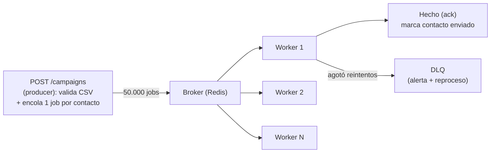

> 🚫 **SPOILER — material del corrector.** No mostrar al alumno. Úsala solo como vara de medir (ver `.ai/soluciones/README.md` y `INSTRUCCIONES-CORRECTOR.md` §6). Este ejercicio **no tiene respuesta única**: lo que sigue son las decisiones más defendibles y los criterios para juzgar otras.

# Solución de referencia — Diseña el pipeline (colas, reintentos, DLQ)

## Principio rector para corregir

No corrijas *qué* eligió, corrige *cómo* lo justificó. El eje dominante para síncrono vs cola es: **¿es lento? ¿es frágil (llama a un tercero que puede fallar)? ¿el usuario necesita el resultado antes de que le respondas?** Si es lento + frágil y NO se necesita en la respuesta → cola. El segundo eje, una vez en la cola: reintentar **obliga** a idempotencia (at-least-once), y reintentar a ciegas (sin tope, sin distinguir transitorio de poison) es un antipatrón.

## Tabla de decisión esperada

| Op | Decisión | Por qué | Status |
|---|---|---|---|
| **A** signup + email | Crear usuario **síncrono**, email **a la cola** | Crear el usuario es rápido y crítico para la respuesta; el email es lento + frágil (SMTP) y no-crítico para responder | `201`/`202` con "email en camino" |
| **B** campaña 50k | **Cola** (un job por contacto) | 50.000 envíos lentos y frágiles; el usuario no puede esperar | `202` + id de campaña para consultar estado |
| **C** GET estado | **Síncrono** | Lectura rápida en la base; meterla a una cola es over-engineering | `200` |
| **D** webhook pago | **Responder 2xx rápido** + delegar el trabajo pesado a la cola | El proveedor reintenta si tardas o no respondes 2xx (at-least-once externo); validar firma es rápido, marcar pagado + notificar es el trabajo encolable | `200`/`202` inmediato |
| **E** recálculo nocturno | **Programado** (cron/scheduler), no encolado por request | Nadie lo dispara ni lo espera; es batch periódico | n/a (no hay request) |

## Política por operación encolada

### A — `enviar_bienvenida(user_id)`
- **max_attempts:** 5. **Backoff + jitter:** `delay = base * 2**intento + random(0, jitter)` (p. ej. base 1 s → ~1, ~2, ~4, ~8, ~16 s con ruido). El jitter evita que mil reintentos caigan a la vez (thundering herd).
- **Idempotency key:** `(user_id, "bienvenida")` o el `job_id`. Antes de enviar, registrar/verificar que a ese usuario ya se le mandó la bienvenida.
- **Transitorio (reintentar):** SMTP timeout, 5xx del proveedor, conexión rechazada. **Poison (DLQ):** email con formato inválido, usuario borrado entre el encolado y el envío.
- **DLQ:** alerta cuando entra algo; al revisar, decidir reproceso (si era transitorio largo) o descarte (si el dato está mal).

### B — `enviar_campaña(campaign_id, contacto_id)` (un job por contacto)
- **max_attempts:** 3–5 + backoff con jitter (igual que A).
- **Idempotency key:** **`(campaign_id, contacto_id)`** — esta es la clave del ejercicio. Si un worker envía el email y muere antes del ack, el broker reentrega el job; la key evita que ese contacto reciba el email **dos veces**. Un solo job por contacto (no un job gigante de 50k) da granularidad: un fallo aislado no arrastra a los demás.
- **Transitorio:** SMTP caído, rate-limit del proveedor (429). **Poison:** dirección inválida, contacto dado de baja.
- **DLQ:** métrica "emails en DLQ por campaña"; alertar si supera un umbral; reproceso tras arreglar direcciones.

### D — `procesar_pago(event_id)` (lo que el webhook delega)
- El **handler del webhook** valida la firma HMAC y responde 2xx **rápido**, encolando `procesar_pago`. Como el proveedor reintenta el webhook (at-least-once externo), el handler debe ser **idempotente por `event_id`** (si ya procesaste ese evento, ignóralo).
- **max_attempts** + backoff para el trabajo encolado (marcar factura pagada, notificar). **Idempotency key:** `event_id` del proveedor. **Poison:** evento que referencia una factura inexistente.

## Diagrama esperado (campaña)

## Costo de la cola (cierre esperado)
- Operar un **broker** (Redis/RabbitMQ): otro servicio que mantener, monitorear, respaldar.
- **Consistencia eventual:** el email "se enviará pronto", no "ya se envió" — el estado de la campaña es asíncrono.
- Complejidad de despliegue: ahora hay procesos worker además de la API, y hay que escalarlos y observarlos.
- **Operación que NO debe ir a cola:** el `GET` de estado (C) — lectura rápida, sin trabajo lento ni frágil; una cola ahí solo agrega latencia y complejidad.

## Qué hace "competente" vs "excelente"
- **Competente:** las cinco decisiones con criterio lento/frágil/no-crítico; política completa (max_attempts + backoff con jitter + idempotency key + transitorio vs poison) en las encoladas; reconoce un over-engineering (C); diagrama + costo nombrado.
- **Excelente:** expone la tensión del webhook (D: el proveedor reintenta → handler idempotente por `event_id`), distingue E (cron) de cola-por-request, justifica por qué `(campaign_id, contacto_id)` evita el doble envío, e incluye reproceso de DLQ y dimensionado del backoff.

## Errores a marcar (resumen)
- Meter el `GET` (C) o el recálculo nocturno (E) a una cola disparada por request.
- Procesar el webhook (D) entero dentro del request (el proveedor reintenta → doble procesamiento).
- Un job gigante de 50k en vez de uno por contacto.
- Reintentos sin tope o sin jitter; olvidar la idempotency key; DLQ sin observabilidad.
- No nombrar ningún costo de la cola.

## Variante de control anti-IA
Pedir el **contrafactual del webhook**: "¿qué pasa si procesas todo dentro del request del webhook y tardas 10 s?". Respuesta razonada: el proveedor asume que falló (timeout / no-2xx) y **reenvía** el webhook → procesarías el pago dos veces, salvo que el handler sea idempotente por `event_id`. Quien copió una comparativa genérica no conecta el reintento externo con la idempotencia.
