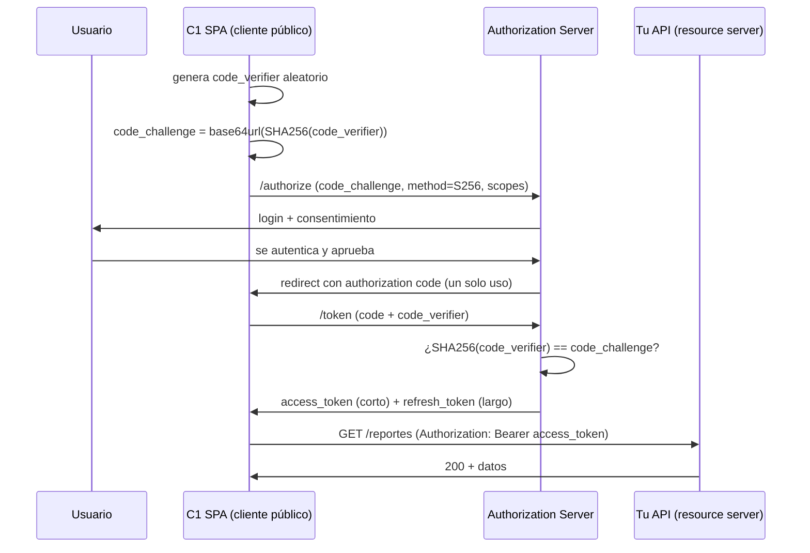

> 🚫 **SPOILER — material del corrector.** No mostrar al alumno. Úsala sólo como vara de medir (ver `.ai/soluciones/README.md` y `INSTRUCCIONES-CORRECTOR.md` §6).

# Solución de referencia — Diseña los flujos de auth de tres clientes

## 1. Flujo por cliente

| Cliente | Flujo correcto | ¿Cliente? | ¿Usuario? | Justificación |
|---|---|---|---|---|
| **C1** SPA React | **authorization code + PKCE** | público (código a la vista en el navegador) | sí | No puede esconder un `client_secret`; hay usuario que da consentimiento. PKCE reemplaza el secreto ausente. |
| **C2** Cron job | **client credentials** | confidencial (corre en un servidor) | no | Sin usuario a quién mostrarle consentimiento; puede guardar un `client_secret` de verdad. El token lo representa a sí mismo. |
| **C3** App móvil | **authorization code + PKCE** | público (descompilable) | sí | Mismo razonamiento que C1: no puede esconder un secreto y hay usuario. PKCE es obligatorio en móvil. |

Los dos ejes que deciden: **(a) ¿puede el cliente guardar un secreto sin que lo extraigan?** (público vs
confidencial) y **(b) ¿hay un usuario humano que apruebe el acceso?** C1 y C3 son públicos *por razones
distintas* (código JS visible vs binario descompilable), pero ambos con usuario → PKCE. C2 es la excepción:
máquina a máquina.

## 2. PKCE: qué ataque evita

PKCE (Proof Key for Code Exchange, RFC 7636) evita que un atacante que **intercepte el authorization code**
(por ejemplo capturando el redirect en un dispositivo comprometido o vía un esquema de URL secuestrado en
móvil) pueda **canjearlo** por tokens. El cliente genera un `code_verifier` aleatorio, manda solo su hash
(`code_challenge = base64url(SHA256(code_verifier))`) al pedir el code, y al canjear presenta el
`code_verifier` original; el authorization server verifica que el hash cuadre. Sin el `code_verifier` (que
nunca viajó en el primer paso), el code interceptado es inútil.

**C1 y C3 lo necesitan** porque son públicos: antes de PKCE dependían de un `client_secret` que no pueden
guardar. **C2 no lo necesita**: no hay redirect ni authorization code que interceptar; se autentica
directamente con su `client_secret`.

## 3. Almacenamiento del token en C1 (XSS vs CSRF)

- **`localStorage`**: legible por JavaScript → cualquier **XSS** (un script inyectado, p. ej. vía una
  dependencia npm comprometida) roba el token en una línea. Mal lugar para el refresh token.
- **Cookie `httpOnly` + `Secure` + `SameSite`**: JS no la puede leer (mitiga XSS), pero el navegador la envía
  automáticamente → expone a **CSRF**, que se mitiga con `SameSite=Lax/Strict` y/o un token anti-CSRF.

**Recomendación:** el **refresh token** (larga vida, el que más duele perder) va en cookie
`httpOnly`+`Secure`+`SameSite`; el access token de vida corta puede vivir en memoria (variable JS), nunca en
`localStorage`. El patrón más robusto es **BFF (Backend-For-Frontend)**: un backend liviano guarda los tokens
server-side y entrega al navegador solo una cookie de sesión `httpOnly`; el navegador nunca toca el access
token, eliminando el dilema (a cambio de más infraestructura).

## 4. Refresh con rotación + scopes

- **Rotación con detección de reuso**: cada uso de un refresh token devuelve uno nuevo e **invalida el
  anterior**. Si reaparece un refresh token ya consumido, el servidor asume robo y **revoca toda la familia**
  de tokens del usuario (fuerza re-login). Es la práctica recomendada en 2026.
- **Scopes de mínimo privilegio** (ejemplos para esta API): `reportes:leer`, `perfil:editar`. El cron job C2
  pide solo `reportes:leer`: si su token se filtra, el atacante no puede modificar nada. Es `least privilege`
  aplicado a tokens — el mismo principio que regirá los permisos de los agentes en F6/F7.

## 5. La trampa (flujo incorrecto para C1)

Dos respuestas válidas:
- **`client credentials`**: incorrecto porque (a) representa a una máquina, no al usuario logueado, y (b)
  exige un `client_secret` que una SPA no puede esconder.
- **Implicit flow**: incorrecto porque está **deprecado** por OAuth 2.1 (devolvía el token en la URL, expuesto
  en el historial/referrer). Su reemplazo es justamente authorization code + PKCE.

## 6. JWT (por qué no datos sensibles en el payload)

Aunque el access token vaya **firmado**, el payload es **base64, no cifrado**: cualquiera que intercepte el
token lo lee. La firma evita que lo *modifiquen*, no que lo *lean*. Por eso no se mete el rol de facturación,
el RUT ni datos del usuario más allá de lo mínimo (`sub`, `scopes`, `exp`). Conecta directo con el ejercicio
`verificar-jwt-a-mano`: ahí se ve que decodificar el payload no requiere el secreto.

## Diagrama esperado (`diagrama.md`)

## Variantes aceptables
- Para C2, mencionar que en algunos ecosistemas el m2m usa un JWT firmado con clave privada (`private_key_jwt`) en vez de `client_secret`: correcto y más avanzado, suma.
- Para C1, proponer directamente el patrón BFF como elección principal (no solo como alternativa): excelente, es defendible.
- Scopes con otra nomenclatura (`read:reports`) mientras sean de mínimo privilegio.

## No aceptable como competente
- ❌ `client credentials` o implicit para C1/C3.
- ❌ Recomendar `localStorage` para el refresh token sin nombrar XSS.
- ❌ "PKCE cifra el token" o "PKCE reemplaza la firma".
- ❌ Diagrama sin `code_verifier`/`code_challenge` ni el canje del code.
