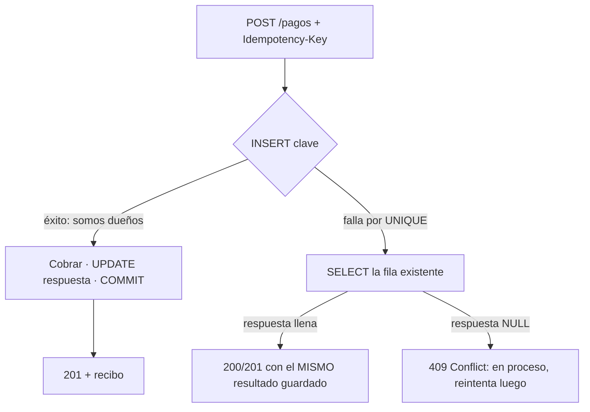

> 🚫 **SPOILER — material del corrector.** No mostrar al alumno. Es un ejercicio de **diseño**: úsala para evaluar el razonamiento de `diseno.md` + `esquema.sql`, no para "tener la respuesta única" (hay variantes válidas).

# Solución de referencia — Diseña un endpoint POST idempotente

## Esquema de referencia (`esquema.sql`)

```sql
CREATE TABLE idempotency_keys (
    clave       text        NOT NULL,            -- generada por el CLIENTE (UUID)
    usuario_id  bigint      NOT NULL,
    endpoint    text        NOT NULL,            -- p. ej. 'POST /pagos'
    body_hash   text        NOT NULL,            -- hash del payload, para detectar reuso con body distinto
    respuesta   jsonb,                           -- NULL = en vuelo; lleno = terminada
    estado_http smallint,                        -- el status que se devolvió (para reproducirlo)
    creado_en   timestamptz NOT NULL DEFAULT now(),
    PRIMARY KEY (clave, usuario_id)              -- el árbitro de la carrera (alcance por usuario)
);
-- Para el TTL: un job que borra WHERE creado_en < now() - interval '24 hours'.
```

El **alcance** `(clave, usuario_id)` permite que dos usuarios distintos reusen, sin colisión, una misma cadena de clave; el `body_hash` detecta el cliente que reusa una clave con un payload diferente.

## Flujo de referencia (INSERT-primero)



### (a) Primer request
`INSERT` reclama la clave (éxito). Se ejecuta el cobro y, en la **misma transacción**, `UPDATE ... SET respuesta = ..., estado_http = 201`. Se responde 201 con el recibo.

### (b) Reintento de algo terminado
`INSERT` falla por violación de unicidad. `SELECT` la fila: `respuesta` está llena → se devuelve **el mismo resultado guardado** (mismo status). El cobro **no** se repite. Esa es la idempotencia.

### (c) Dos requests concurrentes con la misma clave (la carrera)
Ambos intentan `INSERT`. La base de datos serializa por el `PRIMARY KEY`: **uno gana** (sigue al cobro), el **otro recibe violación de unicidad**. Ese segundo hace `SELECT`: como la `respuesta` del ganador aún está en `NULL` (el cobro corre), responde **409** ("procesando, reintenta"). No hay doble cobro porque el `INSERT`-primero convirtió "comprobar y actuar" en una operación atómica — la misma defensa del locking de `3.3`.

## Status HTTP de referencia

| Caso | Status | Por qué |
|---|---|---|
| Primer request, cobro exitoso | **201 Created** | se creó el pago |
| Reintento de algo terminado | **200/201** con el resultado guardado | idempotencia: mismo efecto, misma respuesta |
| Misma clave aún "en vuelo" | **409 Conflict** | otro request la procesa; reintentar luego |
| Clave reusada con body DISTINTO | **422** (o **409**) | el cliente reusó una clave para otra operación: es un error, no se sirve el resultado viejo ni se cobra de nuevo |

## Trade-off fail-open vs fail-closed
Un pago es **fail-closed**: si el banco no responde (timeout o circuit breaker abierto), **no** se asume éxito ni se degrada a "cobrado". Se responde un error (502/503 "intenta más tarde") y la clave queda en vuelo (o se libera para reintento). Asumir éxito crearía un cargo fantasma o un descuadre de plata. Contraste: un endpoint **no crítico** (recomendaciones, contador de likes) puede ser fail-open con un fallback (lista vacía, último valor cacheado).

## Preguntas de defensa
- **Clave del cliente:** debe ser la **misma** a través de los reintentos para que el servidor reconozca el mismo intento; una clave generada por el servidor sería distinta en cada llegada → no habría idempotencia.
- **INSERT-primero vs SELECT-luego-INSERT:** el SELECT-luego-INSERT deja una **ventana** entre comprobar y escribir; bajo concurrencia, dos requests comprueban "no existe" y ambos cobran. El `INSERT` contra un `UNIQUE` es **una sola operación atómica** que la base de datos serializa, cerrando la ventana.

## Puntos resbalosos (donde el corrector debe mirar)
1. **Diseño con la ventana de carrera abierta** (SELECT y luego INSERT): es el error central; debe usar INSERT-primero.
2. **No distinguir en-vuelo de terminada:** sin `respuesta` nullable, no hay forma de elegir entre 200-resultado y 409.
3. **Olvidar el TTL** y el caso "misma clave, body distinto".
4. **Fail-open en el pago:** descalifica el criterio de criticidad.
5. **Tratar la `Idempotency-Key` como confiable:** debería validarse formato/longitud (hilo de seguridad).

## Rango de soluciones aceptables
- **`UNIQUE(clave)`** global en vez de `(clave, usuario_id)` — aceptable si justifica que la clave es un UUID globalmente único (colisión despreciable); el alcance por usuario es más robusto.
- **Almacén en Redis** con `SET NX` (set-if-not-exists) como árbitro en vez de Postgres — válido y común; `SET NX` cumple el mismo rol que el `UNIQUE`.
- **Devolver 200 en lugar de 201 en el reintento** — aceptable si es coherente (idealmente reproduce el status original guardado).
- **Bloquear con `SELECT ... FOR UPDATE`** sobre una fila pre-creada — variante válida, aunque el INSERT-primero es más simple.
- ❌ **No aceptable como competente:** SELECT-luego-INSERT sin atomicidad; no manejar el caso "en vuelo"; clave generada por el servidor; fail-open en el pago.
