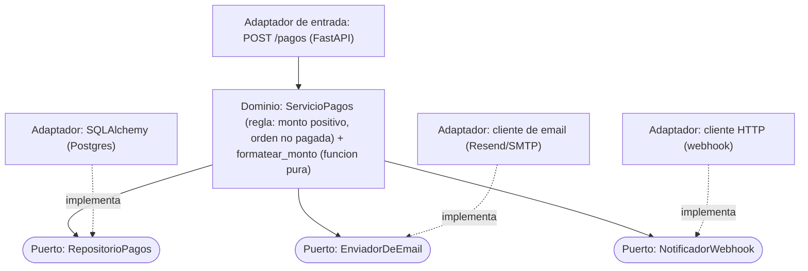

> 🚫 **SPOILER — material del corrector.** No mostrar al alumno. Úsala sólo como vara de medir (ver `.ai/soluciones/README.md` y `INSTRUCCIONES-CORRECTOR.md` §6).

# Solución de referencia — Diseña los puertos de una feature

## Parte 1 — Clasificación de las 5 piezas

| # | Pieza | Clasificación |
|---|---|---|
| 1 | Validar monto positivo + orden no pagada | **Dominio puro** (lógica de negocio, no toca el exterior) |
| 2 | Persistir la transacción (Postgres) | **Adaptador de salida** (*driven*) detrás de un puerto |
| 3 | Enviar recibo por email | **Adaptador de salida** (*driven*) detrás de un puerto |
| 4 | Notificar al webhook externo | **Adaptador de salida** (*driven*) detrás de un puerto |
| 5 | Formatear el monto a texto legible | **Dominio puro** (función pura) — **sin puerto** |
| — | Recibir el pago por HTTP | **Adaptador de entrada** (*driving*) que llama al dominio |

## Parte 2 — Puertos propuestos (con métodos en lenguaje de dominio)

```python
class RepositorioPagos(Protocol):
    def guardar(self, pago: Pago) -> Pago: ...          # devuelve el pago con id
    def orden_ya_pagada(self, orden_id: str) -> bool: ...

class EnviadorDeEmail(Protocol):
    def enviar_recibo(self, email: str, cuerpo: str) -> None: ...

class NotificadorWebhook(Protocol):
    def notificar(self, evento: str, datos: dict) -> None: ...
```

Los nombres describen la **intención** del dominio (`enviar_recibo`, `notificar`), no la tecnología
(`enviar_smtp`, `post_http`). El `ServicioPagos` recibe los tres puertos por el constructor.

## Parte 3 — Las tres micro-decisiones

| Decisión | Veredicto | Justificación |
|---|---|---|
| **D1 — Envío de email** | **PUERTO SÍ** | Es lento, tiene efectos externos y el proveedor cambia (SMTP → Resend → SendGrid). Querrás un doble en tests (no mandar emails de verdad) y poder cambiar de proveedor sin tocar el dominio. |
| **D2 — Formateo del monto** | **PUERTO NO** | Es una **función pura** (`15000 -> "$15.000 CLP"`): no toca DB, red ni archivos; ya es trivial de testear sola. Un puerto `FormateadorDeMonto` aquí es ceremonia. Si algún día hay que formatear por país, una función con parámetro o una pequeña estrategia basta — y aun así no es infraestructura. |
| **D3 — Notificación al webhook** | **PUERTO SÍ** | Es una llamada HTTP saliente: lenta, falible (timeouts, reintentos), con un destino que cambia. Mockeable en tests y candidata a resiliencia (la Fase 3.14). Puerto claro. |

> El criterio general que se espera: **introduce el puerto cuando el dolor ya es visible** (test que
> necesita infra, proveedor que podría cambiar), **no "por si acaso"**. Email y webhook lo tienen;
> el formateo no.

## Parte 4 — Testabilidad sin infraestructura

Al `ServicioPagos` se le inyectan **dobles** que cumplen los tres puertos: un `RepositorioPagos` en
memoria (lista + un set de órdenes ya pagadas), un `EnviadorDeEmail` *spy* que solo registra `(email,
cuerpo)` sin mandar nada, y un `NotificadorWebhook` *spy* que registra la llamada. Con eso se prueba la
regla del paso 1 (monto positivo, orden no pagada) y que **se intentó** enviar el recibo y notificar —sin
SMTP, sin webhook real, sin Postgres—. Los *spies* permiten además aserciones tipo "se llamó
`enviar_recibo` exactamente una vez con el email del cliente".

## Parte 5 — Seguridad (el POST saliente)

El paso 4 hace un `POST` a una **URL configurable**: vector clásico de **SSRF** (Server-Side Request
Forgery). Si la URL no se valida, un atacante (o una orden manipulada) podría apuntarla a un servicio
**interno** (metadata del cloud `169.254.169.254`, `localhost`, la red privada). Mitigación: **allowlist**
de dominios/destinos permitidos, prohibir IPs privadas/loopback, y resolver+validar el host antes de
hacer el request. Se ve a fondo en [`3.13` OWASP Top 10](/fase-3-backend/3-13-owasp-top10-web/) y vuelve
con los agentes que hacen fetch en la Fase 6/7.

## Parte 6 — Diagrama esperado (Mermaid)



Lo crítico del diagrama: el `ServicioPagos` apunta a los **puertos** (no a los adaptadores concretos), y
los adaptadores de salida **implementan** los puertos. Ninguna flecha sale del dominio hacia DB/email/HTTP
concretos. El formateo vive **dentro** del dominio, sin puerto.

## Puntos resbalosos (donde el corrector debe mirar)
1. **Puerto al formateo (D2 = SÍ):** el error estrella. Es función pura; ponerle puerto es sobre-ingeniería. Si lo justifica con un caso real de intercambio en runtime, aceptar con matiz, pero señalar que una función/estrategia simple basta.
2. **Flecha invertida en el diagrama:** dominio → adaptador concreto. Es justo lo que la hexagonal prohíbe.
3. **Métodos que filtran tecnología** en los puertos (`enviar_smtp`, `insert`).
4. **Olvidar SSRF:** el POST a URL configurable es el riesgo concreto; "validación de input" genérico no basta.
5. **"Todo es dominio" o "todo es adaptador":** la regla del paso 1 es dominio; los 3 efectos son adaptadores; el formateo es dominio puro sin puerto.

## Rango de respuestas aceptables
- D1 y D3 deben ser **PUERTO SÍ** con justificación de efecto externo/cambio. D2 debe ser **PUERTO NO** (o "SÍ" solo con una defensa de intercambio real, marcando que es discutible).
- Aceptar nombres de puerto distintos si expresan intención de dominio.
- Aceptar agrupar email+webhook bajo un puerto `Notificador` si lo justifica (ambos son notificaciones de salida) — es una decisión de diseño defendible.
- ❌ **No aceptable como competente:** puerto al formateo sin defensa, flechas saliendo del dominio hacia concretos, o no mencionar SSRF / no explicar el testeo con dobles.
