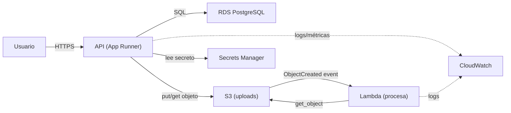

> 🚫 **SPOILER — material del corrector.** No mostrar al alumno. Es una solución de referencia, no la
> única válida: servicios alternativos bien justificados (ECS/Fargate vs App Runner, SSM vs Secrets
> Manager) son correctos. Lo que se evalúa es el **criterio**, no que coincida palabra por palabra.

# Solución de referencia — Diseño de despliegue del capstone en AWS

## 1. Tabla de mapeo

| Necesidad del capstone | Primitivo (5.5) | Servicio AWS | Equivalente Azure |
|---|---|---|---|
| Correr la API (contenedor) | compute | App Runner (o ECS/Fargate); EC2 si quiero VM cruda | App Service / Container Apps |
| Guardar archivos subidos | object storage | S3 | Blob Storage |
| Base de datos relacional | managed DB | RDS PostgreSQL | Azure Database for PostgreSQL |
| Tarea al subir un archivo | serverless | Lambda (trigger de S3) | Functions |
| Logs y métricas | observabilidad | CloudWatch | Monitor / App Insights |
| Guardar secretos | config 12-factor | Secrets Manager (o SSM Parameter Store) | Key Vault |
| Control de acceso (transversal) | identity & access | IAM | Entra ID + RBAC |

## 2. Decisión de compute para la API

La API es un **contenedor** (de la 5.1) con tráfico relativamente parejo y latencia importante para
el usuario. Por eso **no** elijo Lambda: el cold start añade latencia y, con tráfico constante,
always-on sale más barato. Elijo **App Runner**: le doy mi imagen y me da URL HTTPS + autoscaling sin
administrar la VM. Si necesitara más control (sidecars, red privada compleja), subiría a **ECS/Fargate**.
**EC2** quedaría solo si tuviera que administrar el SO yo, que no es el caso. La Lambda queda para la
**tarea por evento** (procesar el archivo subido), que sí es event-driven y corta: el caso ideal de serverless.

## 3. Diagrama



## 4. IAM — policy de least privilege para la Lambda

```json
{
  "Version": "2012-10-17",
  "Statement": [
    {
      "Sid": "LeerUploads",
      "Effect": "Allow",
      "Action": ["s3:GetObject"],
      "Resource": "arn:aws:s3:::donpelusa-app-uploads-prod/*"
    },
    {
      "Sid": "EscribirLogs",
      "Effect": "Allow",
      "Action": ["logs:CreateLogStream", "logs:PutLogEvents"],
      "Resource": "arn:aws:logs:*:*:log-group:/aws/lambda/procesa-uploads:*"
    }
  ]
}
```

**Por qué un role y no access keys:** la Lambda asume su **execution role** y recibe credenciales
**temporales** que AWS inyecta y rota; no hay secreto escrito que pueda filtrarse en un commit o un log.
Una access key de larga vida sería un riesgo permanente si se filtra. (Para humanos: IAM Identity Center.)

## 5. Costo / riesgo

El **free tier cambió en julio 2025**: las cuentas nuevas ya no tienen 12 meses de allowances, sino
**créditos** (hasta USD 200) que **expiran a los 6 meses** o al agotarse. Una **RDS** olvidada prendida
cobra por hora (consume créditos y luego factura; "parar" la suspende solo ≤7 días). Medida el día 1:
crear un **AWS Budget** con alarma (p. ej. a USD 5) y destruir los recursos de prueba al terminar.

---

## Notas para el corrector

- Aceptar EC2 o ECS/Fargate como compute **si el trade-off está justificado**; rechazar "Lambda para la API" sin reconocer cold start/costo.
- La policy debe tener acciones enumeradas + ARN acotado; cualquier `*` en `Action` o `Resource` baja a en-progreso/incompleto en C2.
- El equivalente Azure puede variar (App Service vs Container Apps): ambos válidos.
- El punto de costo **debe** reflejar el modelo 2026 (créditos), no "12 meses gratis".
