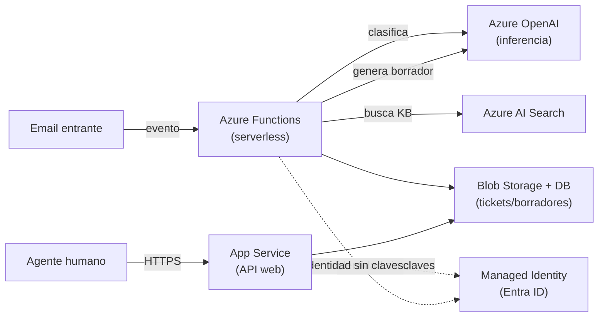

> 🚫 **SPOILER — material del corrector.** No mostrar al alumno antes de un intento real. Es UNA
> respuesta de referencia: otras elecciones son válidas si el razonamiento (perfil de carga, costo,
> seguridad) es sólido. Úsala para detectar huecos y graduar pistas, no para entregar la lista.

# Solución de referencia — Mapeo del asistente de soporte a Azure

## 1. Componentes → primitivo → servicio

| Componente | Primitivo | Servicio Azure | Por qué |
|---|---|---|---|
| Recepción de email | serverless / event-driven | **Azure Functions** | Llega a ráfagas, en cualquier momento; escala a cero entre emails. Pagar un servicio "siempre encendido" para esto es desperdicio. |
| Clasificación con LLM | inferencia | **Azure OpenAI Service** | Es una llamada a un LLM (urgencia + categoría). La hace la propia Function tras recibir el email. |
| Búsqueda en la KB | búsqueda / vector DB | **Azure AI Search** (o `pgvector`) | KB de tamaño medio/grande: AI Search da hybrid + semantic ranking administrado. Para una KB pequeña con Postgres ya presente, pgvector basta y es más barato. |
| Generación del borrador | inferencia | **Azure OpenAI Service** | Segunda llamada al LLM, citando los artículos recuperados. |
| API web para agentes | compute (PaaS) | **App Service** | Tráfico sostenido (agentes revisando todo el día); una API "siempre arriba" sin cold starts. |
| Almacenamiento de tickets | storage | **Blob Storage** (+ una DB administrada para metadatos) | Persistencia para auditoría; los borradores/adjuntos van a blobs, los metadatos a una DB. |
| Auth entre servicios | IAM | **Managed Identity / Entra ID** | App Service y Functions se autentican contra Azure OpenAI y AI Search sin claves. |

## 2. Diagrama de referencia

## 3. Trade-off #1 — Managed Identity vs. clave en variable de entorno

Una **clave en variable de entorno** ya es mucho mejor que hardcodearla, pero sigue siendo un secreto:
hay que guardarlo en la config del App Service/Functions, rotarlo, y existe la vía de que se filtre
(logs, dumps, un `env` mal expuesto). **Managed Identity** lo elimina: la identidad del servicio se
autentica contra Azure OpenAI/AI Search con un token de auto-refresh, y se le asigna **solo** el rol
que necesita (least privilege). Como hay **algo desplegado** (no un script local), Managed Identity es
la elección correcta: cero claves que rotar o filtrar, mismo código en local (vía `az login`) y en prod.
La clave en entorno queda para un prototipo rápido o un job efímero.

## 4. Trade-off #2 — Azure OpenAI pay-as-you-go vs. PTU

**Pay-as-you-go** (por token) es lo correcto al empezar y con tráfico irregular: pagas exactamente lo
que consumes, sin compromiso. **PTU** (Provisioned Throughput Units, capacidad reservada) se justifica
cuando el tráfico es **alto y predecible** y necesitas **latencia estable** sin competir por el rate
limit compartido: pagas capacidad fija (más cara en reposo) a cambio de throughput garantizado y
previsibilidad de costo. Para este asistente, que arranca con volumen modesto y variable, **pay-as-you-go**
es la elección; se reevalúa hacia PTU solo si el volumen crece y se vuelve constante. Comprometer PTU
antes de tener tráfico es pagar capacidad ociosa.

## 5. Dónde NO usaría el servicio Azure

Si la KB son ~500 artículos y el backend ya corre sobre **Postgres**, montar **Azure AI Search** añade
un servicio más que administrar y un piso mensual de costo que no se justifica. Ahí **`pgvector`**
(misma base de datos, una extensión) es más simple y barato, y el "hybrid search" se puede aproximar con
`tsvector` + vector. Eso **no es "peor"**: es elegir por volumen y costo en vez de por reflejo de marca.
AI Search gana cuando la KB es grande, multi-idioma, o necesitas su reranking semántico llave en mano.

## Notas para el corrector

- Acepta variantes razonables: p. ej. Container Apps en vez de App Service, o Cosmos DB para tickets.
  Lo que importa es la **justificación por perfil de carga**, no el servicio exacto.
- Marca como error grave poner la API en Functions o el ingest en App Service sin justificar.
- Si los dos trade-offs no tienen el **escenario donde gana el otro lado**, es `en-progreso` en C3.
- La señal de `excelente` es el "dónde NO usaría Azure" propio y un trade-off cuantificado/ejemplificado.
