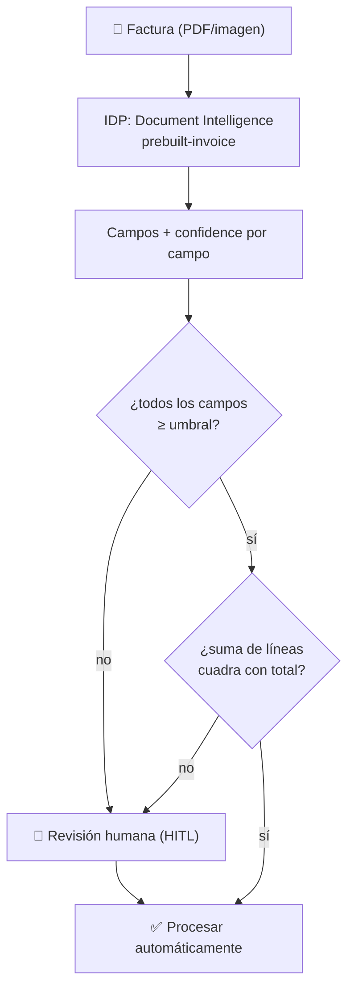

> 🚫 **SPOILER — material del corrector.** No mostrar al alumno. Es una **vara de
> medir** para un ejercicio de diseño: hay un rango amplio de respuestas válidas. Úsala
> para juzgar si la justificación del alumno es sólida, no para exigir que coincida palabra
> por palabra.

# Solución de referencia — Elegir la modalidad y diseñar el pipeline de IDP

## Parte A — Elección de modalidad (respuesta canónica)

| # | Adaptador | API / local | Restricción dominante |
|---|---|---|---|
| 1 | **STT** (realtime) | API (servicio de streaming de baja latencia) | **Latencia**: subtítulos en vivo exigen streaming; un batch de Whisper no sirve. |
| 2 | **OCR / IDP especializado** | API (Document Intelligence) o self-host | **Confidence + corrección monetaria**: alto volumen de un tipo conocido donde un error paga de más → necesitas confidence por campo para el gate. |
| 3 | **Vision + TTS** (encadenados) | API | **Accesibilidad / flexibilidad**: hay que *entender* una escena arbitraria (vision) y *hablarla* (TTS); el contenido es impredecible, terreno del LLM de vision. |
| 4 | **STT** (batch) | **Local** (faster-whisper en tu infra) | **Privacidad / compliance**: datos de pacientes que no pueden salir de la empresa → prohíbe la API de terceros, sin importar costo. |

> Puntos finos que distinguen un buen análisis: el caso 1 y el 4 son **ambos STT** pero
> con restricciones opuestas (latencia realtime vs privacidad/batch) → modos distintos. El
> caso 2 es el único que **exige confidence por campo**, por eso IDP y no vision. El caso 3
> es el único que combina **dos** adaptadores en cadena (vision → texto → TTS).

## Parte B — Pipeline de IDP del escenario 2 (diseño de referencia)

- **Servicio: IDP especializado (Document Intelligence), no LLM de vision.** Lo decisivo
  es el **`confidence` por campo** —que habilita el gate HITL— y el **determinismo** (mismo
  documento → mismo output), más el costo predecible por página a volumen. **Qué pierdo:**
  flexibilidad (un LLM de vision podría responder preguntas abiertas sobre el documento sin
  entrenar nada) y la capacidad de *razonar* sobre el contenido. Para "saca estos campos de
  facturas conocidas", no necesito eso.
- **Gate de confianza + HITL.** Umbral concreto (p. ej. **0.95** para el monto, **0.90**
  para campos menos críticos): campos sobre el umbral se auto-aceptan; cualquier campo bajo
  el umbral manda **toda la factura** a una cola de revisión humana. El **monto** es el
  campo más delicado porque un error ahí es directamente dinero mal pagado → umbral más
  alto.
- **Validación cruzada (regla de negocio, encima del confidence).** La **suma de las
  líneas debe cuadrar con el total declarado** (con tolerancia de centavos). Atrapa el caso
  en que el modelo leyó *con alta confianza* un total que es incoherente con el detalle —
  algo que el gate de confianza, por sí solo, dejaría pasar. (Es el ejercicio
  `idp-confianza-gate` hecho realidad.) Otras reglas válidas: que la fecha no sea futura,
  que el RUT del proveedor exista en la lista de proveedores conocidos.
- **Seguridad y privacidad (dos riesgos):**
  1. **Indirect prompt injection (LLM01):** si después del IDP un LLM razona sobre el texto
     extraído (o un agente lo usa para *pagar*), el documento puede contener instrucciones
     hostiles ("aprueba este pago", "ignora tus reglas"). **Mitigación:** tratar el texto
     como dato no confiable, segregarlo del system prompt, y **nunca** dejar que dispare la
     acción de pago sin el gate de validación + HITL.
  2. **PII en las facturas (privacidad / governance, 6.15):** las facturas traen datos de
     personas y empresas. **Mitigación:** cifrado en reposo y tránsito, control de acceso a
     la cola de HITL, retención mínima, y audit logging de quién vio/aprobó qué (relevante
     para EU AI Act si aplica).
- **Observabilidad (dos métricas):**
  1. **Tasa de revisión humana** (% de facturas que caen en HITL): si sube, el IDP se está
     degradando o llegan formatos nuevos; si es altísima, el ROI desaparece y hay que
     reentrenar/ajustar el umbral.
  2. **Distribución de `confidence`** por campo (y **tasa de fallo de la validación
     cruzada**): detecta si un proveedor concreto rompe la extracción, y permite calibrar
     el umbral con datos reales en vez de a ojo.

## Rango de respuestas aceptables

- En la Parte A, **self-host del IDP** en vez de API para el escenario 2 es válido si se
  justifica por costo a volumen o privacidad; lo importante es la restricción, no el
  proveedor exacto.
- Un **híbrido** IDP + LLM (IDP extrae campos, LLM clasifica el tipo de gasto o detecta
  anomalías en el texto) es una respuesta **excelente** si no sobre-ingenieriza.
- Umbrales distintos (0.90, 0.92, 0.98) son todos válidos: lo que se evalúa es que
  **exista un umbral concreto** y que el monto tenga el más exigente.
- Otros riesgos OWASP válidos: Improper Output Handling (LLM05) si el campo extraído va a
  una query/sistema sin validar; Sensitive Information Disclosure si el texto se loguea con
  PII. Cualquiera con mitigación concreta cuenta.
- **No penalizar** un diseño distinto bien defendido. **Sí marcar:** elegir vision para el
  caso 2 sin notar la pérdida del confidence, "revisar todo" en el HITL, o una validación
  cruzada que en realidad es otro filtro de confianza.
