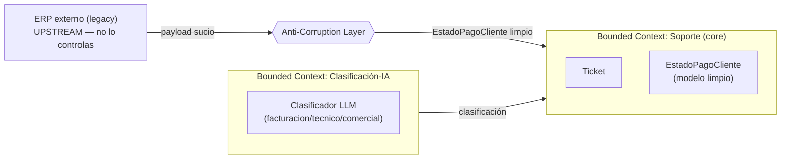

> 🚫 **SPOILER — material del corrector.** No mostrar al alumno. **Este ejercicio no tiene
> respuesta única.** Es una *orientación de qué diseño es defendible*, no una plantilla a la que
> el alumno deba converger. Califica si **trazó fronteras defendibles**, **diseñó una aduana que
> traduce Y valida**, y **defendió el trade-off DDD**, no si llegó a este diseño exacto.

# Solución de referencia — Bounded contexts + ACL

## Cómo usar esta solución
El alumno entrega `context-map.md` + `acl-diseno.md` + `adr-0001-acl.md`. Contrasta contra la
dirección de abajo. Lo que mide la rúbrica: ¿la relación con el ERP está marcada como
upstream/downstream con ACL y justificada? ¿La aduana **valida** además de traducir? ¿El ADR
pesa ACL vs conformist con gatillo, y el juicio nombra una parte con DDD y una sin?

## 1. Context map de referencia (una versión defendible)

- **Soporte** es el core (donde vive el `Ticket` y la decisión de respuesta). **Downstream**.
- **ERP** es **upstream**: no lo controlas, no cambia por ti, y ya cambió sus códigos antes → la relación es *upstream/downstream con ACL* (de libro). El ACL pertenece a Soporte, no al ERP.
- **Clasificación-IA**: defendible como context propio (tiene su lenguaje y reglas de evals/prompts) **o** como servicio dentro de Soporte. Ambas son válidas si el alumno lo justifica; lo importante es que NO comparta el modelo de Ticket crudo.

## 2. ACL de referencia (modelo sucio → limpio)

**Modelo sucio (ERP, no se toca):** `{cli, nm, pay_st(int mágico), bal(string), last_pay(str|null), ovd(int|null)}`.

**Modelo limpio (dominio Soporte):**
- `EstadoPagoCliente`: `id: str`, `nombre: str` (normalizado), `estado: EstadoPago` (enum `AL_DIA|PENDIENTE|MOROSO|EN_REVISION`), `saldo: Dinero`, `dias_mora: int | None`.

**Traducción campo a campo (la aduana):**
| ERP (sucio) | Dominio (limpio) | Traducción |
|---|---|---|
| `cli` | `id` | directo |
| `nm` | `nombre` | `.strip()` + normalizar espacios + `.title()` |
| `pay_st: 3` | `estado: MOROSO` | mapa `{1:AL_DIA, 2:PENDIENTE, 3:MOROSO, 9:EN_REVISION}` |
| `bal: "15990.00"` | `saldo: Dinero(1599000)` | parsear string → centavos enteros |
| `last_pay` | (opcional) | `date.fromisoformat` o `None` |
| `ovd: null` | `dias_mora: None` | null → `None` explícito |

**Qué valida y rechaza (frontera de seguridad):**
- `pay_st` **no** en el mapa conocido (`4`, `7`, o el viejo `0`) → **rechaza** con error explícito (`EstadoPagoExternoDesconocido`). El escenario advierte que esto pasa.
- `bal` ausente / no parseable → rechaza (no dejar entrar un `Dinero` corrupto).
- Es **frontera de confianza**: el payload del ERP es input externo **no confiable** hasta validarlo —exactamente como la salida de un LLM (OWASP: validar en la frontera, no asumir). En Fase 7, este es el punto donde el dato externo se valida **antes** de que el agente actúe.

## 3. ADR de referencia (esqueleto)

- **Decisión:** ACL propio (opción) vs conformist (adoptar el modelo del ERP tal cual).
- **Opción A — ACL:** (+) aísla el modelo sucio, un solo punto de cambio cuando el ERP cambie, valida lo no confiable. (−) más código, una capa más de traducción.
- **Opción B — conformist:** (+) cero traducción al inicio. (−) el modelo del ERP (codigos mágicos, strings) infecta todo Soporte; el próximo cambio del proveedor te rompe en N lugares; sin frontera de validación.
- **Decisión:** **ACL**, porque el ERP es ajeno, **ya cambió antes** y manda valores fuera de tabla → el costo de la traducción es menor que el de acoplarse.
- **Gatillo:** si el ERP se reemplaza por un servicio propio, estable y bien modelado, reconsiderar conformist (el ACL deja de pagar su costo).

**Juicio DDD-sí / DDD-no (defendible):**
- **Merece DDD táctico:** el `EstadoPagoCliente` + la **regla de qué hacer con un moroso** (escalar a humano, bloquear, etc.) — hay invariantes y decisiones de negocio. El `Dinero` del saldo es un value object claro.
- **No merece DDD (CRUD honesto):** el **catálogo de categorías de tickets** (`facturacion/tecnico/comercial`) es admin plano sin invariantes; montarle aggregates/eventos es over-engineering.

## Rango de soluciones aceptables
- Mapa con 2 o 3 contexts, siempre que la relación con el ERP sea upstream/downstream con ACL y esté justificada.
- Modelo limpio con otros nombres/campos, siempre que: NO deje entrar string/int crudos del ERP, use al menos un value object (`Dinero` o enum), y la aduana **valide y rechace** lo desconocido.
- ADR que elija conformist es aceptable **solo** si reconoce el riesgo de acoplamiento y pone un gatillo fuerte —pero dado que el escenario dice que el ERP ya cambió y manda valores mágicos, ACL es la opción mejor fundada; un conformist sin matizar es `en-progreso`.
