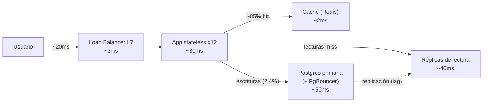

> 🚫 **SPOILER — material del corrector.** No mostrar al alumno. Úsala solo como vara de medir (ver
> `.ai/soluciones/README.md` y `INSTRUCCIONES-CORRECTOR.md` §6).

# Solución de referencia — Estimación de capacidad y diagnóstico de cuello de botella

No hay una única redacción correcta y los números **pueden variar** según el factor de pico que el
alumno declare. Lo que sigue es lo que un análisis **competente** cubre; **excelente** = además
cuantifica el impacto de la caché y ata la concurrencia al pool concreto.

## Sección 1 — Estimación de capacidad

| Magnitud | Cálculo | Resultado |
|---|---|---|
| DAU | 4.000.000 × 5% | 200.000 |
| Requests/usuario/día | 80 lecturas + 2 escrituras | 82 |
| Requests/día | 200.000 × 82 | 16.400.000 |
| QPS promedio | 16.400.000 / 86.400 s | **≈ 190 req/s** |
| Mezcla | 80/82 lecturas | **≈ 97,6% lecturas**, 2,4% escrituras |
| QPS pico (día normal) | 190 × 4 (factor declarado) | **≈ 760 req/s** |
| QPS pico (evento viral) | 190 × 6 | **≈ 1.140 req/s** → diseñar para ~**1.200 req/s** |
| Concurrencia (Little) | 1.200 req/s × 0,25 s | **≈ 300 requests en vuelo** |

Notas: el factor de pico (×4 normal, ×6 viral) es un supuesto **declarado**; otro alumno puede usar
×3/×5 y seguir competente si lo justifica. La clave es dimensionar por el **pico**, no por los 190
promedio, y calcular la concurrencia sobre el pico.

## Sección 2 — Cuello de botella

- La **capa de app** NO es el cuello, aunque parezca: 40 ms/núcleo → 25 req/s/núcleo × 4 núcleos =
  100 req/s por servidor; con 2 servidores, ~200 req/s. Se queda corta para el pico, **pero es
  stateless y clonable**: agregas servidores y el LB reparte. No es el problema de fondo.
- El cuello real es la **única base de datos primaria**: recurso **compartido y no clonable**, sin
  réplicas ni caché, recibiendo ~97,6% del tráfico (lecturas) directo. Peor aún, el **connection
  pool de 30** contra una concurrencia de ~300 en vuelo: el pool se agota **antes** que la CPU de la
  DB. Esa es la fuente de los errores 500 intermitentes del incidente (requests esperando una
  conexión que no llega, timeouts).
- **Métrica que lo confirma** (observabilidad, F5): **USE** → saturación del pool de conexiones
  (conexiones en uso / máximo) y de la DB; **RED** → la *Duration* (latencia) se dispara y los
  *Errors* suben mientras el *Rate* de la app aún parece "normal". La firma clásica de saturación de
  un recurso compartido.

## Sección 3 — Plan de escala (ordenado por costo/beneficio)

1. **Caché de lecturas (cache-aside) — primero: barata y de máximo impacto.** El 97,6% del tráfico
   son lecturas de hilos de comentarios, contenido "caliente" que cambia poco entre publicaciones.
   Con un hit ratio razonable (~85%), la caché absorbe la gran mayoría de las lecturas: de ~1.170
   lecturas/s a la DB bajamos a ~175. *Trade-off:* sirve datos **obsoletos** hasta el TTL (un
   comentario recién publicado puede tardar segundos en aparecer) y añade el problema de
   **invalidación**. Para comentarios es aceptable.
2. **Réplicas de lectura.** Las lecturas que escapan a la caché van a 1-2 réplicas; la primaria queda
   para escrituras (que son solo ~2,4%). *Trade-off:* **replication lag** → un usuario que acaba de
   publicar podría no ver su propio comentario si lee de una réplica atrasada (problema
   *read-your-writes*; se mitiga leyendo de la primaria justo tras escribir).
3. **Escalar la app horizontalmente** + **subir/poolear conexiones** (PgBouncer). La app stateless se
   escala a ~12 instancias tras el LB; un pooler evita que cada instancia abra demasiadas conexiones
   a Postgres. *Trade-off:* más costo de cómputo; hay que dimensionar el pool contra el
   `max_connections` de la DB, no abrirlo infinito.
4. **(Extra) Rate limiting en escrituras + CDN para assets.** Protege la primaria de ráfagas de
   escritura abusivas y saca el estático del path crítico.

## Sección 4 — Decisión CAP

Punto del sistema: **leer un hilo de comentarios durante una partición** entre la primaria y las
réplicas (o entre la caché y la fuente).

- **Elección: AP** (disponibilidad sobre consistencia). Mejor mostrar el hilo con datos unos segundos
  viejos que devolver un error: para un feed de comentarios, la **eventual consistency** es
  perfectamente aceptable y la experiencia importa más que la exactitud al instante.
- **Pero no para todo:** una acción de **moderación** (borrar un comentario ilegal, banear a un
  usuario) quiere **CP** —ahí sí prefieres rechazar/esperar antes que dejar visible algo que debe
  desaparecer. Excelente si el alumno nota que **distintos puntos del sistema eligen distinto** y lo
  registra como ADR ("feed = AP, moderación = CP, porque…").

## Sección 5 — Diagrama (ejemplo aceptable)

Presupuesto p99 ≈ red 20 + LB 3 + app 30 + (caché 2 | DB 40-50) ≈ dentro de los 250 ms objetivo en
el caso hit; el caso miss a réplica queda cerca del límite, lo que justifica priorizar el hit ratio
de la caché.

## Qué separa "excelente" de "competente"

- Cuantifica el efecto de la caché (de ~1.170 a ~175 lecturas/s en la DB) en vez de decir "ayuda".
- Nota que el **pool de 30** se satura antes que la CPU de la DB y lo liga a la concurrencia calculada.
- Distingue AP/CP por subsistema (feed vs moderación) y lo deja en un ADR.
- Recuerda que escalar la app **sube throughput, no baja la latencia** de una query lenta.
