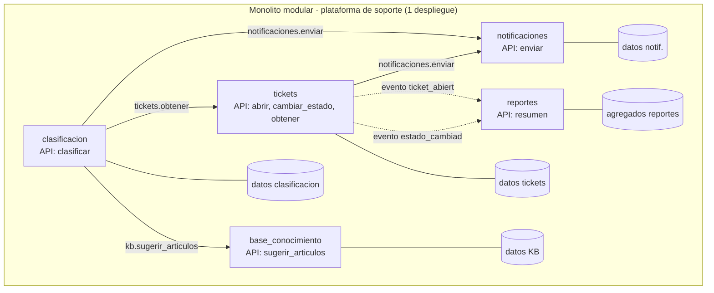

> 🚫 **SPOILER — material del corrector.** No mostrar al alumno. Es **un** diseño de referencia, no el
> único válido. Evalúa el ownership, la calidad de las APIs y el razonamiento, no la coincidencia literal.

# Solución de referencia — Diseña los módulos de un monolito modular

## Parte 1 — Mapa de módulos (referencia)

### `tickets` (recepción + estado)
- **Posee:** `ticket(id, cliente_id, asunto, descripcion, prioridad, estado, creado_en)`,
  `ticket_evento(ticket_id, tipo, ts)`.
- **API interna:**
  - `tickets.abrir(cliente_id, asunto, descripcion, prioridad) -> ticket_id`
  - `tickets.cambiar_estado(ticket_id, nuevo_estado) -> None` (emite el evento "estado_cambiado")
  - `tickets.obtener(ticket_id) -> Ticket` (objeto de dominio, no fila cruda)

### `clasificacion`
- **Posee:** `categoria`, `asignacion(ticket_id, categoria, cola, agente_id)`.
- **API interna:**
  - `clasificacion.clasificar(ticket_id) -> Categoria` (etiqueta y asigna cola/agente)
  - Llama a `tickets.obtener(...)` para leer el contenido; **no** lee la tabla `ticket`.

### `base_conocimiento` (KB)
- **Posee:** `articulo(id, titulo, cuerpo, categoria)`.
- **API interna:**
  - `kb.sugerir_articulos(categoria) -> list[Articulo]`
  - No conoce tickets; recibe la categoría como argumento (bajo acoplamiento).

### `notificaciones`
- **Posee:** `plantilla`, `envio_log(destinatario, plantilla, ts, estado)`.
- **API interna:**
  - `notificaciones.enviar(destinatario, plantilla, datos) -> None` (fire-and-forget)
  - No participa en transacciones de negocio; **solo recibe avisos**.

### `reportes` (el caso difícil)
- **Posee:** sus propias tablas/vistas **agregadas** (`metrica_diaria`, `resumen_categoria`), NO las tablas
  de los demás.
- **Cómo obtiene los datos (correcto):** se **suscribe a eventos de dominio** (`ticket_abierto`,
  `estado_cambiado`) y va acumulando sus agregados; o lee de una **vista/réplica de solo lectura**. Nunca
  hace `SELECT` directo contra `ticket`/`asignacion`.
- **API interna:** `reportes.resumen(rango) -> Resumen`.

> El módulo de **reportes** es la trampa del ejercicio: la tentación es leer las tablas de todos. La
> solución sana es **eventos** (encaja con el patrón Observer de 2.5 y con CDC/streaming de 7.6) o una
> vista de solo lectura — manteniendo el ownership intacto.

## Parte 2 — Diagrama de referencia

Fíjate visualmente: `notificaciones` solo **recibe** llamadas (fire-and-forget) y `reportes` solo recibe
**eventos**. Ambos tienen acoplamiento transaccional casi nulo → candidatos a primera costura.

## Parte 3 — ADR de referencia

**Título:** Monolito modular, no microservicios — plataforma de soporte.
- **Contexto:** equipo de 5, tráfico modesto y parejo, stack único, dominio aún en evolución.
- **Decisión:** un solo despliegue, dividido en 5 módulos con ownership de datos y APIs de dominio; un
  Postgres con **un esquema por módulo** y la regla "nadie toca el esquema del vecino".
- **Alternativas:** (a) microservicios desde el día 1 — descartada: ninguna de las cuatro razones reales
  está presente, y pagaríamos red + sagas + 5 pipelines sin beneficio; (b) monolito sin módulos (big ball
  of mud) — descartada: imposible de extraer después.
- **Trade-off / renuncia honesta:** renunciamos a **escalar componentes por separado** y al **aislamiento
  de fallas** entre módulos (un bug que tumba el proceso los tumba a todos), y a **despliegues
  independientes** por equipo. Lo aceptamos porque hoy no tenemos ni la escala desigual ni los equipos que
  lo justifiquen.
- **Consecuencias / cómo lo mantenemos sano:** ownership de datos forzado en revisión de PR; las APIs de
  módulo se diseñan para sobrevivir a una extracción (firma estable). Gatillo de re-evaluación documentado
  (ver Parte 4).

## Parte 4 — Primera costura (referencia)

- **Candidato:** `notificaciones` (alternativa válida: `reportes`).
- **Por qué el más fácil:** **acoplamiento transaccional nulo** — los demás solo le **avisan**
  (fire-and-forget); no participa en ninguna transacción de negocio. Extraerlo solo convierte
  `notificaciones.enviar(...)` de llamada en memoria a **mensaje en una cola** (idempotencia/DLQ de 7.2).
- **Gatillo observable:** "cuando el volumen de envíos supere X/min y empiece a meter latencia en el
  request del usuario", o "cuando integremos un proveedor externo de email/SMS con sus propios límites de
  rate". No "cuando sea grande".
- **Extracción sin big-bang (Strangler Fig):** se publica un evento/mensaje en cola en vez de llamar la
  función; un worker (primero en el mismo deploy, luego como servicio) lo consume. El resto del sistema no
  cambia su llamada. Al extraer, se instrumentan **trazas distribuidas + correlation IDs** para no perder
  el "¿dónde falló?".

## Rango de soluciones aceptables
- Otros cortes de módulos son válidos si respetan ownership y APIs de dominio (p. ej. fusionar
  `clasificacion` dentro de `tickets` con submódulos, si se justifica).
- `reportes` como primera costura es igual de aceptable que `notificaciones` si se argumenta por su lectura
  agregada desacoplada.
- Resolver reportes por **eventos** o por **vista de solo lectura** son ambas correctas; leer tablas ajenas
  directamente **no** lo es.
