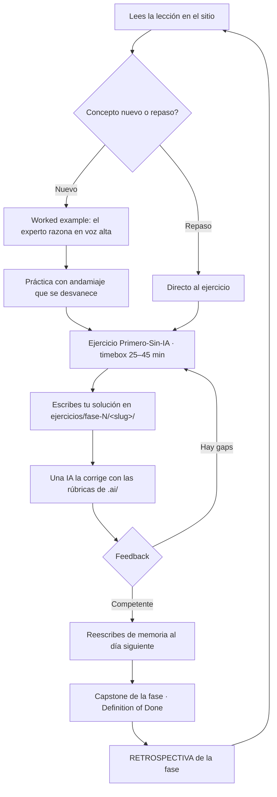

# AI / Automation Engineer — Curso público de cero a semi-senior

> Un curso navegable, autoguiado y gratuito para reconstruir tus fundamentos de ingeniería
> y especializarte en el nicho **IA + Automatización**. Sin atajos, sin sobreventa.
>
> *"No se trata de no usar IA. Se trata de no necesitarla para pensar."*

---

## Qué es esto

Un repositorio de conocimiento libre que te lleva, paso a paso, **de cero real a AI / Automation
Engineer semi-senior empleable**, con la ruta a senior trazada al final. No es una lista de enlaces:
es un curso con lecciones tipo universitario, ejercicios con corrección, proyectos capstone por fase
y un método de estudio diseñado para que el conocimiento se quede.

La columna vertebral es el [`ROADMAP.md`](./ROADMAP.md): 9 fases + un Track-0 paralelo de
empleabilidad. El sitio renderizado expande cada sub-unidad en una lección completa.

## Para quién es

- **Cero real:** nunca programaste, o lo intentaste y no cuajó. El curso está escrito **para ti**:
  F0–F2 son densas y enseñan desde el principio (no "aceleradas").
- **Oxidado con experiencia:** sabes orquestar IA pero perdiste autonomía para construir el software
  que la envuelve. Un **diagnóstico de entrada** te enruta a saltar lo que ya dominas; la experiencia
  previa aparece como recuadros *"Si ya lo tocaste, valida y salta"*, nunca como prerrequisito.

Destino: **semi-senior empleable** en el nicho IA/Automatización (escaso en LATAM), con horizonte a
senior tras el siguiente trabajo.

## Promesa honesta (sin sobrevender)

> [!IMPORTANT]
> Este curso es autoguiado: **no caduca por el reloj**. Las cifras son informativas, no un corte.

- **Plazos reales** a 10–15 h/semana:
  - Cero real → semi-senior empleable: **~18–30 meses**.
  - Oxidado con experiencia: **~4–9 meses** si pones por delante portafolio, inglés y entrevistas.
  - (Las "9–12 meses" del ROADMAP asumían la aceleración de un perfil con experiencia previa.)
- **Salario, dos mercados honestos:** la banda objetivo (CLP 1.6–2.4M ≈ USD 1.7–2.6k) mapea a
  **mid local chileno** o **remoto-USD de entrada**. Los remotos jugosos (USD 4–8k) son
  **mayormente senior + inglés required + sistemas agénticos en producción**. El premium real de
  IA/ML es ~12–15%, y el **inglés es el gate de pricing**, no un bonus.

Si alguien te promete remoto-USD de gama alta en seis meses desde cero, te está vendiendo humo.
Aquí no.

## El método: Primero-Sin-IA

La regla rectora de todo el curso. Para cada concepto o ejercicio nuevo:

1. **Intenta resolverlo solo**, a mano, aunque sea feo y lento (timebox: 25–45 min).
2. Solo entonces consulta **documentación oficial**.
3. **Solo al final** usa IA — para *revisar y explicar*, nunca para *generar*.
4. **Reescribe la solución de memoria al día siguiente.** Si no puedes, no lo aprendiste.

Se escala por novedad: para conceptos genuinamente nuevos, primero un *worked example* (el experto
razona en voz alta) y práctica con andamiaje que se desvanece; para repaso, Primero-Sin-IA de
entrada. Todo ejercicio trae **solución de referencia + errores comunes** para autocorrección honesta.

## Cómo está organizado

```text
ai-automation-engineer-course/
├─ README.md · ROADMAP.md · progreso.md · LICENSE · CONTRIBUTING.md
├─ src/content/docs/   →  EL CURSO: sitio Astro Starlight navegable (estudias aquí)
├─ ejercicios/         →  TU WORKSPACE: resuelves los ejercicios aquí, al lado de VSCode
├─ .ai/                →  CORRECTOR POR IA: rúbricas + instrucciones para que una IA te corrija
└─ .claude/skills/     →  skills para extender el curso y corregir entregas
```

Doble propósito del repo: **(a)** estudiar en el sitio renderizado; **(b)** trabajar los ejercicios
en `ejercicios/` y dejarlos ahí para que una IA los corrija con las rúbricas de `.ai/`.

### Flujo de aprendizaje



## Cómo correr el sitio

Requisitos: Node 20+ y [pnpm](https://pnpm.io/) (este repo usa **pnpm**, no npm).

```bash
pnpm install      # instala dependencias
pnpm dev          # servidor de desarrollo con hot-reload (http://localhost:4321)
pnpm build        # build de producción (sitio estático en dist/)
pnpm preview      # sirve el build de producción localmente
```

## Cómo estudiar

1. **Lee la lección en el sitio** (`pnpm dev`). Ahí está la teoría, los modelos mentales, los
   ejemplos comentados y los diagramas.
2. **Trabaja el ejercicio al lado, en VSCode.** Cada lección apunta a su scaffold en
   `ejercicios/fase-N/<slug>/` (enunciado + starter + tests). Aplica el **Primero-Sin-IA**.
3. **Pide la corrección a una IA.** Cuando termines, dale a tu asistente la entrega y la rúbrica
   correspondiente en `.ai/rubricas/`. El corrector evalúa corrección, calidad de ingeniería,
   seguridad y comprensión demostrada — y te devuelve *feedback pedagógico*, no solo una nota.
4. **Reescribe de memoria al día siguiente** y marca tu avance en [`progreso.md`](./progreso.md).
5. **Cierra cada fase** con su proyecto capstone (cumpliendo el *Definition of Done*) y su
   `RETROSPECTIVA`.

## Índice de fases

| Fase | Tema | |
|---|---|---|
| **Track-0** | Empleabilidad, marca e inglés — **en paralelo desde la semana 1** | 🔁 |
| Fase 0 | Reconstrucción de fundamentos y autonomía | |
| Fase 1 | Lenguajes núcleo: Python + TypeScript | |
| Fase 2 | Ingeniería de software | |
| Fase 3 | Bases de datos y Backend | |
| Fase 4 | Frontend + UI/UX | |
| Fase 5 | DevOps, Cloud y despliegue | |
| Fase 6 | **AI Engineering** | ★ |
| Fase 7 | **Automatización, Orquestación y Data Engineering** | ★ |
| Fase 8 | System Design y Arquitectura | |

★ = donde está tu ventaja competitiva y el premium salarial. El capstone **estrella del portafolio**
es el proyecto **agéntico de la Fase 7** (manejo de fallas + impacto real), por encima del RAG
genérico.

Hilos transversales tejidos **desde el día 1** (no como fase posterior): testing/TDD, evals de IA,
seguridad (OWASP web + LLM/Agentic), observabilidad, spec-driven dev + ADRs + Conventional Commits,
costo/latencia, inglés técnico y empleabilidad.

## Licencia

Licencia **dual**: el **contenido** (lecciones, textos, diagramas) bajo **CC BY-SA 4.0** y el
**código** (ejemplos, scaffolds, tests, config) bajo **MIT**. Detalles en [`LICENSE`](./LICENSE) y
[`LICENSE-CODE`](./LICENSE-CODE).

## Contribuir

Las contribuciones son bienvenidas: mejoras de lecciones, ejercicios, correcciones factuales,
traducciones. Lee [`CONTRIBUTING.md`](./CONTRIBUTING.md) para el estándar de lección, los
Conventional Commits y la política de idioma.

---

> *Construido en abierto por Alvaro Cortés. Si te sirve, una estrella ⭐ ayuda a que
> llegue a otra persona que está reconstruyendo su autonomía.*
