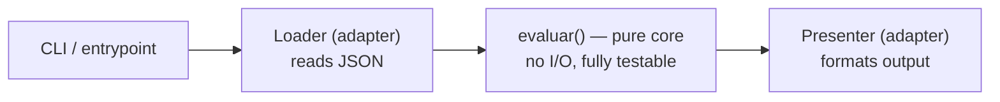

<!--
Template for the ARQUITECTURA.md deliverable.

Write it in ENGLISH (DoD 8: README/architecture in English — Track 0). Keep it
short and honest: this is a one-pager a reviewer reads before opening the code.
Rename to ARQUITECTURA.md (or ARCHITECTURE.md) and delete these comments.
-->

# Architecture — Despensa (Capstone F2)

## What it does
One paragraph: the tool's purpose, its inputs and outputs.

## Design after the refactor
Describe the shape you arrived at. A diagram helps (Mermaid renders on GitHub):



- **Pure core:** which function/module holds the business logic and why it has no
  I/O (SRP). This is what your unit + mutation tests target.
- **Adapters:** how reading and printing were pushed to the edges (DIP light), so
  the core can be tested without files or stdout.

## Testing strategy
- **Characterization net:** what it pins, and why it ran before the first change.
- **Unit + boundary tests:** which exact borders you cover (e.g. `cantidad == 2`,
  `days == 0`, `days == 3`).
- **Mutation score:** starting score → final score. Any surviving mutants left,
  and why (e.g. equivalent mutant — show the input that *should* distinguish it
  and argue why none exists).
- **What you chose NOT to test, and the trade-off.**

## Key decisions
Link the ADRs in `docs/adr/`:
- [ADR 0001](docs/adr/0001-record-architecture-decisions.md)
- ADR 0002 — …
- ADR 0003 — …

## How to run
```bash
uv sync --all-extras --dev
uv run python despensa.py tests/datos/despensa-ejemplo.json
uv run pytest -q
uv run mutmut run && uv run mutmut results
```
