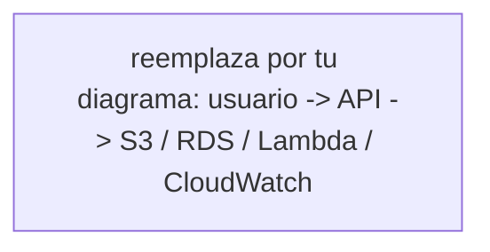

# Diseño de despliegue del capstone en AWS

> Plantilla. Reemplaza cada `TODO` con tu diseño. Trabájalo **a mano primero**, sin IA.

## 1. Tabla de mapeo (primitivo → AWS → Azure)

| Necesidad del capstone | Primitivo (5.5) | Servicio AWS | Equivalente Azure |
|---|---|---|---|
| Correr la API | TODO | TODO | TODO |
| Guardar archivos subidos | TODO | TODO | TODO |
| Base de datos relacional | TODO | TODO | TODO |
| Tarea disparada al subir un archivo | TODO | TODO | TODO |
| Logs y métricas | TODO | TODO | TODO |
| Guardar secretos (config) | TODO | TODO | TODO |

## 2. Decisión de compute para la API (con trade-off)

TODO: ¿EC2, ECS/Fargate/App Runner o Lambda? Justifica en 3–4 líneas según el patrón de carga
de una API (¿tráfico constante o por picos? ¿contenedor? ¿cuánta infra quiero administrar?).

## 3. Diagrama de la arquitectura



## 4. IAM — policy de least privilege para la Lambda

```json
{
  "Version": "2012-10-17",
  "Statement": [
    {
      "TODO": "enumera SOLO s3:GetObject sobre el ARN del bucket de uploads, y los permisos de logs"
    }
  ]
}
```

**Por qué un role y no access keys (2 líneas):** TODO

## 5. Costo / riesgo

TODO (3 líneas): qué cambió en el free tier de AWS en 2026 y qué medida concreta pondrías el día 1
para no llevarte una boleta sorpresa.
