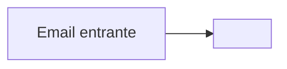

# Mapeo a Azure — Asistente de soporte

> Completa esta plantilla a mano, sin IA. Borra los `<...>` y los comentarios al rellenar.

## 1. Componentes → primitivo → servicio

| Componente | Primitivo (5.5) | Servicio Azure | Por qué ese (perfil de carga / administrado vs. propio) |
|---|---|---|---|
| Recepción de email | `<serverless / compute / ...>` | `<...>` | `<una razón concreta>` |
| Clasificación con LLM | `<...>` | `<...>` | `<...>` |
| Búsqueda en la KB | `<...>` | `<...>` | `<...>` |
| Generación del borrador | `<...>` | `<...>` | `<...>` |
| API web para agentes | `<...>` | `<...>` | `<...>` |
| Almacenamiento de tickets | `<...>` | `<...>` | `<...>` |

## 2. Diagrama del flujo (Mermaid)

## 3. Trade-off #1: `<elige uno de la lista del README>`

`<un párrafo: qué eliges, en qué escenario, y por qué — con argumento de costo/seguridad/latencia>`

## 4. Trade-off #2: `<elige otro>`

`<un párrafo>`

## 5. ¿Dónde NO usaría el servicio Azure?

`<al menos un caso concreto, p. ej. pgvector en vez de AI Search para una KB pequeña, y por qué eso no es "peor">`
