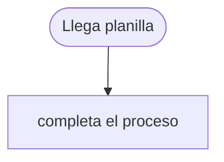

# Plan de migración — bot_legado.py

> Completa esto **a mano, sin IA**. No hay una única respuesta correcta: se evalúa que tu
> diagnóstico ancle a líneas concretas y que tu plan sea incremental y reversible. Borra esta cita al
> entregar.

## 1. Diagnóstico (≥4 modos de falla)

| # | Síntoma (qué se rompe) | Línea / paso | Causa raíz (posición vs significado, sleep, falla silenciosa, no idempotente, ciego) |
|---|------------------------|--------------|---------------------------------------------------------------------------------------|
| 1 | … | … | … |
| 2 | … | … | … |
| 3 | … | … | … |
| 4 | … | … | … |

## 2. Escalera por paso

| Paso del bot | Escalón elegido (api · navegador · rpa-ui · rediseñar) | Restricción dominante que lo decide |
|--------------|--------------------------------------------------------|-------------------------------------|
| `cargar_proveedores` | … | … |
| `validar_rut` | … | … |
| `dar_de_alta` (abrir form) | … | … |
| `dar_de_alta` (escribir campos) | … | … |
| `dar_de_alta` (guardar + verificar) | … | … |

## 3. Plan Strangler Fig (incremental, reversible)

- **Corte 1 (primero):** ¿qué pieza migras hoy mismo y por qué es la más segura para empezar?
- **Corte 2..n:** orden de los siguientes cortes.
- **En paralelo:** ¿cómo corres el viejo y el nuevo a la vez para comparar antes de cortar?
- **Métrica de confianza:** ¿qué mides para decidir que un corte es seguro? (p. ej. coincidencia de
  resultados, tasa de error, latencia).

## 4. ADR — migrar de RPA a código

**Estado:** propuesto

**Contexto.**
(¿Qué hace el bot hoy? ¿Qué síntoma muestra que la RPA por coordenadas ya no rinde?)

**Decisión.**
(A qué escalón gradúas cada paso y por qué la restricción dominante lo exige.)

**Alternativas consideradas.**
- Quedarse en RPA por coordenadas: (por qué no alcanza)
- (otra opción descartada y por qué)

**Trade-off que acepto.**
(Qué gano y qué CUESTA migrar: tiempo, negociar una API, operar más infra, etc. Migrar también
tiene precio: sé honesto.)

## 5. BPMN / carriles mínimo (Mermaid)

