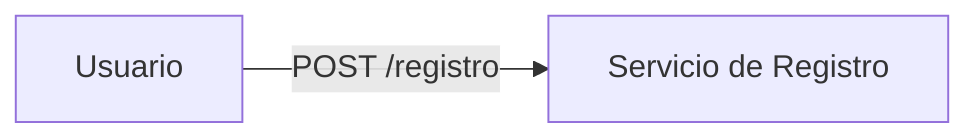

# Rediseño — Registro de usuario: de síncrono en cadena a event-driven

> Completa las cuatro partes. Diseña **a mano y sin IA** antes de consultar la lección.
> Recuerda la pregunta que manda: **¿el que llama necesita la respuesta para continuar su operación?**

---

## Parte 1 — Qué queda síncrono y qué pasa a evento

| Paso | Decisión (síncrono / evento) | Pregunta que manda (por qué) |
|---|---|---|
| 1. Alta en la BD de usuarios | | |
| 2. Correo de bienvenida | | |
| 3. Contacto en el CRM | | |
| 4. Cupón de bienvenida | | |
| 5. Registro en analítica | | |

## Parte 2 — Diagrama del flujo rediseñado

> Reemplaza el esqueleto por tu diseño. Debe distinguir el salto síncrono (el alta) del fan-out por evento.

## Parte 3 — ADR: "Registro event-driven con consistencia eventual"

- **Contexto:** (qué problema tiene el flujo síncrono actual)
- **Decisión:** (qué queda síncrono, qué pasa a evento)
- **Alternativas consideradas:** (p. ej. dejar todo síncrono; cola de comandos por paso; log de eventos)
- **Trade-off (honesto):**
  - **Renuncio a:** (qué deja de ser inmediato → consistencia eventual)
  - **Riesgo nuevo que acepto:** (duplicado / orden / dual write) y cómo lo cubro

## Parte 4 — Blindaje de lo asíncrono

- **Contra el dual write (BD + publish no son atómicos):**
- **Idempotencia de cada consumidor (ante at-least-once):**
- **(Opcional) Orden de eventos de un mismo usuario:**
