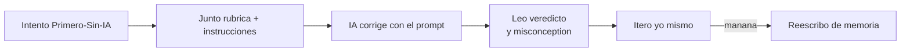

import { Steps } from "@astrojs/starlight/components";

Ya viste el método [Primero-Sin-IA](/empezar/) y montaste tu
[entorno](/empezar/monta-tu-entorno/). Falta la pieza que cierra el bucle: **cómo
una IA te corrige sin resolverte el ejercicio**. Esta es la diferencia entre usar
la IA para _aprender_ y usarla para _evitar aprender_.

La idea es simple: tras intentar un ejercicio **Primero-Sin-IA**, le entregas tu
solución a una IA (Claude, ChatGPT, un modelo local, el que tengas) **junto con la
rúbrica** del ejercicio, y le pides **feedback pedagógico**, no la respuesta. Te
devuelve dónde te equivocaste, qué concepto repasar y el siguiente paso — pero
nunca el código de la solución.

:::tip[Qué IA usar]
Cualquiera con acceso de lectura al repositorio o a la que le puedas pegar los
archivos: Claude Code, Cursor, ChatGPT con el repo cargado, un modelo local. El
framework de corrección de la carpeta `.ai/` está diseñado para funcionar igual
sin importar el modelo.
:::

## El bucle de corrección, paso a paso

<Steps>

1. **Intenta el ejercicio solo.** Trabaja en `ejercicios/<fase>/<slug>/` y deja
   ahí tu intento: el código, tu tabla de traza, tus notas, el write-up — lo que
   pida el enunciado. **Primero a mano, sin IA**, con timebox de 25–45 min.

2. **Reúne las tres cosas que la IA necesita.** El corrector no adivina: le das
   (a) tu entrega, (b) la **rúbrica** del ejercicio y (c) las instrucciones del
   corrector. Las rutas siguen una convención fija:

   | Qué | Ruta en el repo |
   |---|---|
   | Tu intento | `ejercicios/<fase>/<slug>/` |
   | Rúbrica del ejercicio | `.ai/rubricas/<fase>/<slug>.md` |
   | Instrucciones del corrector | `.ai/INSTRUCCIONES-CORRECTOR.md` |

3. **Pídele la corrección** con el prompt de más abajo. Si tu IA tiene acceso al
   repo, basta con nombrar el ejercicio. Si no, pega el contenido de los archivos.

4. **Lee el feedback e itera.** La IA te da pistas → preguntas → dirección
   concreta, en ese orden. Corriges, vuelves a intentar, y al día siguiente
   **reescribes la solución de memoria** (repaso espaciado).

</Steps>

## La regla anti-spoiler (no la rompas)

Existe una carpeta `.ai/soluciones/<fase>/<slug>.md` con la **solución de
referencia** de cada ejercicio. Es para el **corrector**, no para ti.

:::danger[NUNCA abras `.ai/soluciones/` antes de intentar el ejercicio]
Mirar la solución antes de pelearla destruye exactamente lo que el ejercicio viene
a entrenar: tu criterio. Es la versión moderna de copiar la respuesta del final
del libro — te sientes avanzado y no aprendiste nada. La solución es la **vara de
medir** de la IA para detectar tus errores, no material de estudio.
:::

Por eso el corrector tiene reglas innegociables, definidas en
`.ai/INSTRUCCIONES-CORRECTOR.md`:

- **Si no hay intento tuyo, no te corrige.** Te recuerda la regla del
  Primero-Sin-IA, te da una sola pista de arranque y se detiene.
- **Nunca pega ni parafrasea la solución de referencia.** La usa solo para
  detectar dónde fallas.
- **Da feedback graduado:** primero pistas, luego preguntas socráticas, y solo al
  final —si de verdad lo intentaste— dirección concreta. Jamás el código completo.
- **Corrige el trabajo, no a la persona.** Tono de mentor exigente, honesto sobre
  amable: si está mal, te lo dice con evidencia.

## Cómo interpretar el feedback

El corrector cierra siempre con un **veredicto** estructurado. Apréndete a leerlo:

- **Nivel global** — `incompleto` · `en-progreso` · `competente` · `excelente`.
  Ojo: el global lo arrastra el criterio más bajo de ruta crítica. Un objetivo
  central `incompleto` **no** se compensa con otros excelentes.
- **Por criterio** — corrección, calidad de ingeniería, comprensión demostrada,
  etc., cada uno con su nivel y la **evidencia** concreta de tu trabajo.
- **Misconception principal** — la _idea equivocada de fondo_, no solo el síntoma.
  Esto es lo más valioso del feedback: arréglalo y muchos errores caen solos.
- **Señal de dependencia-IA** — si tu explicación no calza con tu código, o tu
  solución es "demasiado perfecta" para tu nivel, te lo marca y te propone una
  verificación (explicar en voz alta, predecir una variante). No es una acusación:
  es para que te des cuenta solo.
- **Próximos pasos** y **spaced repetition** — el siguiente paso de práctica y qué
  reescribir de memoria mañana.

:::note[Iterar, no rendirse]
Un veredicto `en-progreso` no es un fracaso: es un mapa. Toma el primer "próximo
paso", vuelve a intentar **tú**, y pide otra corrección. El objetivo no es sacar
`excelente` a la primera, sino subir de nivel por tu propio esfuerzo.
:::

## Prompt de ejemplo (cópialo)

Reemplaza `<fase>` y `<slug>` por los de tu ejercicio (por ejemplo
`fase-0` y `trazado-a-mano-bucle`). Úsalo cuando ya tengas tu intento listo:

```text
Corrige mi ejercicio `ejercicios/<fase>/<slug>/` usando el framework de la
carpeta `.ai/`. Sigue `.ai/INSTRUCCIONES-CORRECTOR.md` al pie de la letra.

Pasos:
1. Lee el contrato `ejercicios/<fase>/<slug>/ejercicio.yml` y el enunciado
   `ejercicios/<fase>/<slug>/README.md`.
2. Lee mi intento (todo lo demás dentro de esa carpeta).
3. Evalúa contra la rúbrica `.ai/rubricas/<fase>/<slug>.md`.

Reglas que DEBES respetar:
- NO me entregues la solución ni la parafrasees. Quiero FEEDBACK, no la respuesta.
- Si crees que no intenté de verdad, recuérdame el Primero-Sin-IA y detente.
- Dame feedback graduado: primero pistas, luego preguntas, y solo al final
  dirección concreta, sin escribir el código por mí.
- Cierra con el veredicto en el formato del paso 5 de las instrucciones.
```

Si tu IA **no** tiene acceso al repositorio, agrega al final: _"Te pego a
continuación mi intento y la rúbrica"_ y pega el contenido de tu carpeta del
ejercicio y de `.ai/rubricas/<fase>/<slug>.md`. **Nunca le pegues la solución de
referencia** — eso anula la corrección.

## En resumen



Con esto cierras el método. Ya tienes el _qué_ (el bucle), el _cómo_ (el prompt) y
la regla de oro (anti-spoiler). Hora de empezar de verdad:

[**Fase 0 · Fundamentos y autonomía →**](/fase-0-fundamentos/)
