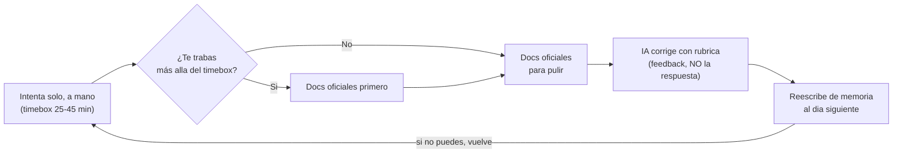

import { LinkCard, CardGrid, Steps } from "@astrojs/starlight/components";

Bienvenido. Si llegaste hasta aquí es porque quieres convertirte en **AI /
Automation Engineer** partiendo de **cero real** — y este es, literalmente, el
primer paso. No necesitas saber programar. No necesitas haber tocado una
terminal. No necesitas un título. Solo necesitas constancia y honestidad con un
método. El resto te lo damos nosotros, desde el principio y en orden.

Esta página es tu mapa de orientación: qué es el curso, para quién es, cómo está
armado, **cómo estudiarlo** para que rinda, y —lo más importante— el método que
hace que funcione: **Primero-Sin-IA**. Léela completa una vez. Volverás a ella.

:::tip[De qué va realmente esto]
La portada te dio la versión de 30 segundos. Esta es la versión **profunda y
accionable**: la que de verdad cambia cómo vas a estudiar cada día.
:::

## Qué es este curso

Un curso público, autoguiado y gratuito que te lleva de no saber programar a ser
**AI / Automation Engineer semi-senior empleable**. No es una lista de videos ni
una colección de tutoriales sueltos: es una **ruta de ingeniería** con
fundamentos, proyectos que corren, y un corrector por IA que te exige pensar.

Lo que lo hace distinto:

- **Parte de cero real.** Cada concepto se enseña desde su base. Toda
  experiencia previa está marcada como _opcional_: si ya sabes algo, lo validas y
  saltas; si no, nada asume que lo traes.
- **El método te obliga a pensar antes de pedirle a la IA.** Eso es lo que
  construye criterio de ingeniería de verdad, y lo que el mercado paga.
- **Termina en evidencia, no en certificados.** Cada fase cierra con un proyecto
  capstone que corre, con README y decisiones documentadas. Tu portafolio _es_ tu
  prueba.

## Para quién es

Para ti, si te describe alguna de estas frases:

- Nunca programaste y quieres entrar al rubro **bien**, no a medias.
- Programas un poco pero sientes que dependes de la IA para todo y eso te asusta
  en una entrevista.
- Quieres especializarte en el nicho **IA + automatización**, que es donde está
  la demanda en 2026.

Lo único que el curso te exige es **honestidad con el método**: intentar antes de
preguntar, y dejar que la IA te corrija después. Si haces eso, llegas.

## Cómo está organizado

El curso tiene **un carril paralelo + una ruta técnica secuencial**.

El **Track 0** corre **desde la semana 1**, en paralelo a todo lo demás. Es
empleabilidad, marca personal e inglés técnico. El error más caro del roadmap
clásico es dejar lo "blando" para el final; aquí arranca ya.

<LinkCard
  title="🔁 Track 0 · Empleabilidad, marca e inglés"
  href="/track-0-empleabilidad/"
  description="Carril PARALELO desde la semana 1. Inglés técnico, portafolio, CV, GitHub profesional y estrategia de postulación. Avanza un poco cada semana, no al final."
/>

La **ruta técnica** son nueve fases en orden (Fase 0 → Fase 8). Cada una alimenta
a la siguiente; no saltes el orden a menos que valides que ya dominas una fase.

<CardGrid>
  <LinkCard title="Fase 0 · Fundamentos y autonomía" href="/fase-0-fundamentos/" description="Mentalidad, terminal, Git y programar sin IA. Empieza aquí tu ruta técnica." />
  <LinkCard title="Fase 1 · Lenguajes núcleo" href="/fase-1-lenguajes/" description="Python y TypeScript desde cero, async, tests y tu primera victoria con un LLM." />
  <LinkCard title="Fase 2 · Ingeniería de software" href="/fase-2-ingenieria/" description="Estructuras de datos de trabajo, clean code, TDD, refactoring y debugging." />
  <LinkCard title="Fase 3 · Bases de datos y Backend" href="/fase-3-backend/" description="SQL, PostgreSQL, APIs REST con FastAPI, auth y seguridad OWASP." />
  <LinkCard title="Fase 4 · Frontend + UI/UX" href="/fase-4-frontend/" description="HTML/CSS, Tailwind, accesibilidad, React + Next.js y UI para apps de IA." />
  <LinkCard title="Fase 5 · DevOps y Cloud" href="/fase-5-devops/" description="Docker, CI/CD, cloud, costos, despliegue y observabilidad." />
  <LinkCard title="Fase 6 · AI Engineering ★" href="/fase-6-ai-engineering/" description="LLMs, prompts, tool use + MCP, embeddings, RAG, agentes y evals." />
  <LinkCard title="Fase 7 · Automatización + Data Eng ★" href="/fase-7-automatizacion/" description="n8n, integración confiable, Temporal, ELT/dbt y agentes de automatización." />
  <LinkCard title="Fase 8 · System Design" href="/fase-8-system-design/" description="System design, DDD táctico y arquitectura de sistemas de IA a escala." />
</CardGrid>

Las **rúbricas y soluciones de referencia** viven aparte, en la carpeta `.ai/`
del repositorio, fuera de las lecciones. Esa carpeta es el **corrector**, no el
material de estudio: no la abras hasta haber escrito tu propio intento.

## Cómo estudiar (léelo antes de empezar)

El curso rinde el doble si lo trabajas con un ritual. Estas son las reglas de la
casa:

<Steps>

1. **Sigue el orden.** Empieza por las dos páginas que cierran este onboarding
   (montar entorno y cómo te corrige la IA), y luego entra a la
   [**Fase 0**](/fase-0-fundamentos/). Dentro de cada fase, las sub-unidades van
   numeradas: respétalas.

2. **En cada lección, no leas en piloto automático.** Pausa en cada concepto y
   recupéralo de memoria antes de seguir. Si no puedes reconstruir lo que acabas
   de leer sin mirar, todavía no lo aprendiste: lo reconociste.

3. **Haz el ejercicio Primero-Sin-IA.** Cada lección tiene un reto en la carpeta
   `ejercicios/`. Lo intentas **solo, a mano, con cronómetro** (timebox 25–45
   min) antes de mirar nada. Aquí es donde se construye el criterio.

4. **Pide la corrección por IA.** Cuando termines tu intento, le entregas tu
   solución a una IA junto con la rúbrica. Te corrige; no te resuelve. El detalle
   está en [**Cómo te corrige la IA**](/empezar/como-te-corrige-la-ia/).

5. **Reescribe de memoria al día siguiente.** Es repaso espaciado. Si no puedes
   reproducirlo sin notas, vuelve a la lección. Esto no es opcional.

</Steps>

:::note[Ritmo realista]
Mejor **tres bloques de 40 minutos** que de verdad cumples, que dos horas diarias
que abandonas el jueves. Constancia le gana a intensidad. Lleva tu avance en el
archivo `progreso.md` de la raíz del repo: una sub-unidad solo está lista cuando
(a) entiendes el concepto sin notas, (b) hiciste el ejercicio sin IA y (c) lo
aplicaste en un proyecto.
:::

## El método: Primero-Sin-IA (a fondo)

Este es el motor del curso. Si interiorizas una sola idea de todo el onboarding,
que sea esta. La regla rectora del repositorio:

> **"No se trata de no usar IA. Se trata de no _necesitarla_ para pensar."**

### Por qué intentar el ejercicio SIN IA primero

Porque **el camino es el aprendizaje**. Una IA te lleva del punto A al punto B
sin que tu cerebro recorra el trayecto — y ese trayecto _es_ lo que te convierte
en ingeniero. Cuando delegas el pensamiento, mes a mes pierdes la capacidad de
generarlo. El mercado 2026 no paga por "saber pedirle código a una IA": eso lo
hace cualquiera. Paga por alguien que pueda **construir y sostener** software
cuando la IA se equivoca, alucina o no entiende el contexto. En una entrevista de
_live coding_ no hay autocompletado mágico: te sientan frente a un problema y
observan si **piensas**.

### La trampa de la fluidez

Cuando lees una solución bien explicada (o la generas con IA), sientes que la
entendiste. Esa sensación de "sí, claro, lo reconozco" es una **ilusión de
fluidez**: reconocer no es lo mismo que poder **producir** de memoria. Es la
trampa más cara del aprendizaje con IA — te sientes competente sin serlo, y lo
descubres tarde, en la entrevista o en el trabajo real. El antídoto es incómodo a
propósito: **cerrar todo y reconstruir tú**. Ese pequeño tirón mental al intentar
recordar _es_ el aprendizaje en acción.

### Cuándo SÍ usar la IA

Mucho, y sin culpa — pero **después** de pensar:

- Para que te **explique** un error que ya peleaste tú.
- Para **corregir** tu solución con una rúbrica (el bucle de abajo).
- Para **profundizar** en un concepto que ya entendiste a grandes rasgos.
- Para tareas mecánicas que no entrenan tu criterio (formateo, andamiaje
  repetitivo) una vez que ya sabes hacerlas a mano.

Lo que **no** haces es pedirle que piense por ti la parte que el ejercicio existe
para entrenarte. Esa es la línea.

:::caution[El matiz que casi todos confunden]
Primero-Sin-IA **no** significa "no usar IA". Significa no usarla para la parte
que te hace pensar. Si usas la IA para _evitar_ el esfuerzo mental, te estás
estafando a ti mismo. Si la usas para _amplificar_ lo que ya pensaste, es un
acelerador brutal.
:::

### El bucle completo

1. **Intenta** el ejercicio solo, a mano, con timebox. Feo y lento está bien.
2. **Te trabas** (normal). Recién ahí abres la **documentación oficial**.
3. **La IA te corrige con la rúbrica.** Le pasas tu solución y la rúbrica del
   ejercicio, y te devuelve feedback graduado —pistas, preguntas, dirección— pero
   **nunca el código de la solución**. Te empuja a cerrarlo tú.
4. **Reescribes de memoria** al día siguiente para fijarlo.

El paso 3 es tan importante que tiene su propia página. Léela antes de empezar la
Fase 0.

## Tu siguiente paso

<CardGrid>
  <LinkCard
    title="1 · Monta tu entorno"
    href="/empezar/monta-tu-entorno/"
    description="Instala Python, uv, Node, pnpm, git y tu editor en una máquina limpia (macOS, Linux o Windows). Paso a paso, sin asumir nada."
  />
  <LinkCard
    title="2 · Cómo te corrige la IA"
    href="/empezar/como-te-corrige-la-ia/"
    description="El bucle de corrección: cómo le pides feedback a una IA con la rúbrica, la regla anti-spoiler y un prompt copiable."
  />
  <LinkCard
    title="3 · Empieza la Fase 0"
    href="/fase-0-fundamentos/"
    description="Mentalidad, terminal, Git y tu primer código sin IA. El cimiento de todo lo demás."
  />
</CardGrid>

:::tip[GLaDOS no incluida]
El curso no te va a felicitar por completar lecciones. Te va a felicitar cuando
puedas **explicar sin notas y construir sin muletas**. Esa es la única vara que
importa. Nos vemos en la Fase 0.
:::
