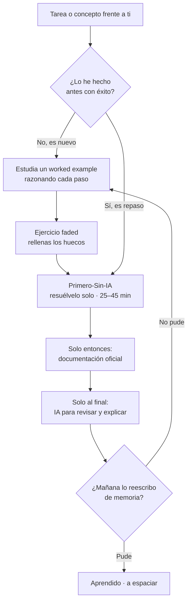

import Nivel from "@components/Nivel.astro";
import Reto from "@components/Reto.astro";
import Solucion from "@components/Solucion.astro";
import Quiz from "@components/Quiz.astro";
import CheckDominio from "@components/CheckDominio.astro";

<Nivel nivel="básico" />

Esta es la primera lección del curso y, en cierto sentido, la más importante: no
trata de _qué_ aprender, sino de _cómo_ aprenderlo para que se te quede. Si
interiorizas este método, todas las fases siguientes rinden el doble. Si lo
saltas, vas a "completar" lecciones sin construir criterio real.

## Objetivos de esta lección

Al terminar deberías ser capaz de:

- **O1 — Aplicar** la regla del **Primero-Sin-IA** _escalándola por novedad_:
  decidir, ante una tarea concreta, si empezar por un **worked example** o ir
  directo a resolverlo solo, y **justificar** esa decisión.
- **O2 — Diseñar** un sistema personal de estudio que integre **active recall** y
  **spaced repetition** como ritual (no como opción), con un **drill diario** y
  bloques de tiempo fijos.
- **O3 — Explicar** por qué depender de la IA _para pensar_ atrofia tu autonomía,
  y distinguir usar la IA **para aprender** de usarla **para evitar aprender**.

## Por qué esto importa (y mucho)

El mercado 2026 no paga por "saber pedirle código a una IA" — eso lo hace
cualquiera. Paga por alguien que pueda **construir y sostener** software cuando
la IA se equivoca, alucina o simplemente no entiende el contexto. En una
entrevista técnica de _live coding_ no hay autocompletado mágico: te sientan
frente a un problema y observan si **piensas**. Las empresas están endureciendo
justo eso (pruebas habladas, sin IA, en vivo) porque se llenaron de candidatos
que no saben razonar sin un asistente al lado.

Aquí está la trampa que este curso resuelve a propósito: **la IA es una muleta
extraordinaria y, por lo mismo, peligrosa**. Te lleva del punto A al punto B sin
que tu cerebro recorra el camino. Y el camino _es_ el aprendizaje. Quien delega
el pensamiento pierde, mes a mes, la capacidad de generarlo. Quien usa la IA
_después_ de pensar, la convierte en un acelerador.

:::note[La frase que rige todo el repositorio]
**"No se trata de no usar IA. Se trata de no _necesitarla_ para pensar."**
Vas a usar IA muchísimo en este curso — pero siempre _después_ de haber hecho el
trabajo mental tú.
:::

## Lo que ya traes (activación)

Si llegaste desde [**Empezar aquí**](/empezar/), ya viste la idea general del
método y montaste (o vas a montar) tu repositorio de estudio. Esta lección lo
convierte en un **sistema** que puedes ejecutar todos los días. Antes de seguir,
recupera de memoria —sin volver a leer— dos cosas:

1. ¿Para qué sirve, en una frase, el repositorio de estudio que vas a llevar?
2. ¿Por qué el curso insiste en intentar las cosas _solo_ antes de pedir ayuda?

Si no te salen con fluidez, no pasa nada: ese pequeño tirón mental que sentiste
al intentar recordar **es** el aprendizaje en acción. Tiene nombre: se llama
_active recall_, y es el motor de todo lo que viene.

## Worked example: cómo decide un experto qué hacer con una tarea nueva

Antes de pedirte que lo hagas, te muestro el razonamiento completo, en voz alta.
La regla del Primero-Sin-IA tiene cuatro pasos:

> 1. **Intenta resolverlo solo**, a mano, aunque sea feo y lento (timebox 25–45 min).
> 2. **Solo entonces** consulta documentación oficial.
> 3. **Solo al final** usa IA — para _revisar y explicar_, no para _generar_.
> 4. **Reescríbelo de memoria** al día siguiente. Si no puedes, no lo aprendiste.

Pero aplicarla a ciegas tiene un problema: si el material es **genuinamente
nuevo** para ti, lanzarte a "resolverlo solo" desde cero no funciona — te
quedas dando vueltas, frustrado, y peor: **fijas ideas equivocadas** que después
cuesta desaprender. La investigación educativa lo confirma (efecto del
_worked example_, Sweller): para algo nuevo, **estudiar un ejemplo resuelto bien
explicado le gana a pelearse en seco con el problema**.

Por eso la regla **escala por novedad**. Veamos el razonamiento aplicado a dos
tareas concretas.

**Caso A — "Escribe una función que invierta un texto". Nunca has programado.**

> _Pienso en voz alta:_ esto es nuevo de verdad. No sé qué es una función, ni
> cómo se escribe, ni qué significa "invertir" en código. Si me lanzo a
> "resolverlo solo" voy a inventar sintaxis y a frustrarme sin aprender nada
> útil. → **Empiezo por un worked example:** leo una solución ya hecha y
> _razono cada línea_ ("esta línea le pone nombre a la función, esta recorre el
> texto al revés…"). Luego hago un ejercicio **faded**: me dan el código con
> huecos y yo relleno solo las partes clave. **Recién entonces** intento uno
> parecido yo solo, con timebox.

**Caso B — "Invierte una lista". Ya hiciste lo del texto la semana pasada.**

> _Pienso en voz alta:_ esto es básicamente lo mismo que ya hice, con otro tipo
> de dato. Ya tengo el modelo mental. → **Primero-Sin-IA de entrada:** lo
> intento solo desde el principio, sin worked example. Si me trabo más de
> 25–45 min, _ahí_ miro la documentación, y la IA queda para el final.

¿Ves la diferencia? La misma persona, la misma regla, **dos puntos de partida
distintos** según cuán nuevo es el material. Eso es "escalar por novedad".



Hay un segundo motor, igual de importante, que el worked example no cubre: **cómo
hacer que lo aprendido no se evapore**. Dos técnicas, ambas con respaldo fuerte:

- **Active recall (recuperación activa):** en lugar de _releer_ tus notas,
  cierras el cuaderno e intentas **reconstruir** la idea de memoria. Releer
  produce una sensación de fluidez ("sí, lo reconozco") que es una **ilusión**:
  reconocer no es lo mismo que poder producir. Recuperar de memoria es difícil
  —y por eso funciona—.
- **Spaced repetition (repetición espaciada):** repasar **distribuido en el
  tiempo** (hoy, mañana, en 3 días, en una semana) vence por goleada a estudiar
  todo de una sentada. El paso 4 de la regla ("reescríbelo de memoria mañana")
  es spaced retrieval puro: si no puedes reproducirlo al día siguiente, no lo
  aprendiste todavía, lo _reconociste_.

| Cuándo repasar | Qué haces | Qué detecta |
|---|---|---|
| Mismo día | Resumen de 3 líneas de memoria | Si entendiste la idea central |
| +1 día | Reescribir la solución sin mirar | Comprensión ilusoria vs. real |
| +3 días | Re-derivar un caso nuevo | Si puedes _transferir_, no solo repetir |
| +1 semana | Quiz rápido / explicárselo a alguien | Retención a mediano plazo |

## Lo que parece cierto pero no lo es

:::caution[Misconception 1 — "Primero-Sin-IA significa no usar IA"]
Falso. Significa **no usarla para la parte que te hace pensar**. La usas
muchísimo: para que te _explique_ un error después de haberlo peleado, para
revisar tu solución, para profundizar. La regla protege el músculo del
razonamiento, no te prohíbe la herramienta.
:::

:::caution[Misconception 2 — "Estudiar un worked example es hacer trampa / es pasivo"]
Falso, **si lo haces activo**. Leer un ejemplo resuelto _explicándote cada paso_
es exactamente lo recomendado para material nuevo. El error sería _copiarlo sin
razonarlo_. La trampa real es la contraria: lanzarte a pelear en seco con algo
genuinamente nuevo suele **fijar ideas equivocadas** que después cuesta
desaprender.
:::

:::caution[Misconception 3 — "Releer mis notas hasta que 'suene familiar' es estudiar"]
Falso. La familiaridad es una **ilusión de fluidez**: reconoces el texto, pero no
puedes producir la idea de memoria. Lo que construye memoria duradera es lo
incómodo: **cerrar las notas y reconstruir**. Si te resulta fácil, probablemente
no estás aprendiendo; solo repasando lo que ya sabías.
:::

:::caution[Misconception 4 — "Si lo entendí hoy, ya lo aprendí"]
Falso. Entender en el momento es necesario pero no suficiente. La prueba real es
**reproducirlo mañana sin ayuda**. Por eso el paso 4 no es opcional: convierte un
"lo entendí" frágil en conocimiento que aguanta.
:::

:::caution[Misconception 5 — "Me pongo un fin de semana entero y lo saco de una"]
Falso. Estudiar concentrado (_massing_) se siente productivo pero se olvida
rápido. **Distribuido** (_spacing_) en sesiones cortas a lo largo de la semana
retiene mucho más con el mismo total de horas. Menos maratones, más constancia.
:::

## Práctica con andamiaje (se desvanece)

Vamos de lo guiado a lo independiente.

### Parte 1 — Parsons: reordena el método (andamiaje alto)

Estas cuatro acciones están **desordenadas**. Sin mirar arriba, escribe el orden
correcto del Primero-Sin-IA (solo los números):

```text
(a) Reescribir la solución de memoria al día siguiente.
(b) Usar IA para revisar y explicar, no para generar.
(c) Intentar resolverlo solo, a mano, con timebox.
(d) Consultar la documentación oficial.
```

<Solucion title="Ver el orden correcto (ábrelo solo después de intentarlo)">
El orden es **(c) → (d) → (b) → (a)**. Primero el intento propio, luego docs
oficiales, luego la IA para revisar, y al día siguiente la reescritura de
memoria. Si pusiste la IA antes que tu propio intento, ese es justo el hábito que
esta lección viene a corregir.
</Solucion>

### Parte 2 — PRIMM: predecir antes de ejecutar (andamiaje medio)

Todavía no programamos (eso llega en
[0.7](/fase-0-fundamentos/0-7-fundamentos-programacion/)), así que aquí el
"código" es lenguaje llano. La técnica se llama **PRIMM** (Predict–Run–
Investigate–Modify–Make) y su primer paso, **predecir**, es el Primero-Sin-IA en
miniatura: piensa _antes_ de ver el resultado.

> **Predice (sin calcular en una herramienta):**
> Empiezas con `total = 0`. Luego, para cada número de la lista `[2, 5, 3]`, le
> sumas ese número a `total`. ¿Cuánto vale `total` al final?

Escribe tu predicción antes de seguir. ¿La tienes? Bien. El resultado es **10**
(`0+2+5+3`). Si predijiste primero —aunque te equivocaras— hiciste justo lo que
mide un _live coding_: razonar el resultado antes de ejecutarlo. Esa costumbre la
formalizaremos sobre código real en
[0.3 · Notional machine y trazado a mano](/fase-0-fundamentos/0-3-notional-machine-trazado/).

### Parte 3 — Clasifica por novedad (andamiaje que se va)

Para cada tarea, decide **nuevo** (worked example primero) o **repaso**
(Primero-Sin-IA de entrada) **para ti**, y di la primera acción. No hay una
única respuesta: depende de tu historia. Lo que se evalúa es la **justificación**.

1. Aprender qué es un `commit` de Git, sin haberlo usado nunca.
2. Escribir tu décima función después de nueve esta semana.
3. Entender por primera vez qué es la recursión.

(El ejercicio entregable de abajo amplía esto. Esta parte es solo el calentamiento.)

## Ejercicio Primero-Sin-IA

<Reto title="Diseña tu sistema de estudio" timebox="35 min">

Vas a producir el documento que te va a gobernar todo el curso. **Primero a mano,
sin IA** (timebox 35 min). El entregable es un archivo `metodo.md` con cuatro
secciones:

1. **Tu protocolo Primero-Sin-IA**, reescrito _con tus palabras_ (los 4 pasos), y
   la frase de una línea que pondrás visible en tu repo como recordatorio.
2. **Tabla de novedad** con estas 6 tareas; para cada una marca _nuevo_ o
   _repaso_ **para ti**, la **primera acción** (worked example / faded /
   Primero-Sin-IA) y **una línea de justificación**:
   _(a)_ usar `git rebase`; _(b)_ escribir un `if/else`; _(c)_ qué es un embedding;
   _(d)_ sumar dos números en una función; _(e)_ desplegar con Docker;
   _(f)_ leer un stack trace.
3. **Tu horario semanal**: bloques fijos de estudio (día + hora + duración) y la
   definición de tu **drill diario** (1 problema pequeño resuelto a mano _antes_
   de tocar el teclado).
4. **Tu cadencia de spaced repetition**: cuándo reescribirás de memoria lo
   aprendido (mismo día / +1 / +3 / +7) y cómo lo registrarás.

**Criterios de "hecho":**
- [ ] Las 4 secciones están completas y son **tuyas** (no genéricas).
- [ ] La tabla justifica cada clasificación; al menos una tarea es _repaso_ y
      al menos una es _nuevo_, **coherente con tu experiencia real**.
- [ ] El horario tiene bloques **concretos** (no "cuando pueda") y un drill diario definido.
- [ ] Puedes **explicar sin notas** por qué el active recall le gana a releer.
- [ ] (Hilo transversal) Guardas `metodo.md` en tu repo con un commit de mensaje
      `docs: add personal study method` — tu primer **Conventional Commit**
      (lo formalizamos en [0.6](/fase-0-fundamentos/0-6-git-y-github/)).

Cuando termines, pídele a tu IA que lo corrija con el framework de `.ai/` (ver
abajo). Recuerda: la IA **no** te lo resuelve; evalúa lo que tú ya hiciste.

</Reto>

<Solucion title="Pista (NO la solución): si te trabas con la tabla de novedad">
La clave no es acertar una etiqueta "correcta" — es la **coherencia con tu
historia**. Pregúntate por cada tarea: _¿la he hecho antes con éxito?_ Si sí,
es repaso → Primero-Sin-IA de entrada. Si no, es nuevo → worked example primero.
La tarea _(d) sumar dos números_ probablemente sea repaso para casi cualquiera;
_(c) qué es un embedding_ casi seguro es nuevo. Las del medio dependen de ti, y
ahí está el aprendizaje: en **justificar**, no en adivinar.
</Solucion>

## Check de dominio

<CheckDominio
  title="Marca solo lo que puedes EXPLICAR sin notas"
  items={[
    "Decir los 4 pasos del Primero-Sin-IA en orden, con mis palabras.",
    "Explicar cuándo empezar por un worked example y cuándo por el intento solo (y por qué).",
    "Explicar por qué releer notas es una ilusión de fluidez y qué hago en su lugar.",
    "Justificar por qué reescribir de memoria al día siguiente no es opcional.",
    "Distinguir usar la IA para aprender de usarla para evitar aprender.",
  ]}
/>

Y dos preguntas rápidas de recuperación:

<Quiz
  question="¿Qué significa exactamente la regla del Primero-Sin-IA?"
  options={[
    "No usar IA en ningún momento del curso.",
    "Intentarlo solo primero; la IA al final, para revisar y explicar, no para generar.",
    "Que la IA escriba el código y tú solo lo revises.",
  ]}
  answer={1}
  explanation="Protege la parte que te hace pensar. Usas IA mucho, pero después de haber hecho el trabajo mental."
/>

<Quiz
  question="Vas a aprender recursión por PRIMERA vez. ¿Por dónde empiezas según el método?"
  options={[
    "Primero-Sin-IA de entrada: a pelearlo solo desde cero, sin mirar nada.",
    "Worked example razonado → ejercicio faded → recién entonces lo intento solo.",
    "Le pido a la IA que me lo explique y copio su ejemplo.",
  ]}
  answer={1}
  explanation="Para material genuinamente nuevo, el worked example le gana a pelear en seco (efecto del worked example). Pelear en seco algo nuevo fija ideas equivocadas."
/>

:::tip[Si ya tienes un método de estudio que te funciona]
Quizá ya usas Anki, Pomodoro o algo propio. **Valida y salta:** ¿tu método
incluye (1) recuperación activa en vez de relectura, (2) repaso espaciado, y
(3) una regla explícita sobre _cuándo_ entra la IA? Si las tres están, adapta el
ejercicio para auditar tu sistema actual en vez de crear uno nuevo. Si falta
alguna, esta lección te dice cuál y por qué.
:::

## Recursos

Documentación y fuentes primero; nada de gurús de productividad.

- **Active recall y spaced repetition (síntesis basada en evidencia):**
  [The Learning Scientists — descargables](https://www.learningscientists.org/downloadable-materials)
  (retrieval practice, spaced practice, interleaving).
- **Worked-example effect y carga cognitiva:** resúmenes de la
  _Cognitive Load Theory_ (Sweller) — busca "worked example effect" en fuentes
  académicas, no en blogs.
- **PRIMM (para cuando empieces a programar):** material original de Sue
  Sentance sobre Predict–Run–Investigate–Modify–Make.
- **Anki** (opcional, para tarjetas de conceptos): [docs oficiales](https://docs.ankiweb.net/).
- El [**ROADMAP**](/referencia/) del curso, donde la Regla del Primero-Sin-IA
  está declarada como columna vertebral.

> Mantén una lista viva de los links que vayas leyendo en `articulos.md` dentro
> de la carpeta de esta sub-unidad. Prefiere siempre la **fuente oficial**.

## Conexión con el proyecto de la fase

El capstone de la Fase 0 es una **CLI escrita 100% sin IA**: tu prueba de que
recuperaste la autonomía. Este sistema de estudio es la _infraestructura_ que lo
hace posible. El `metodo.md` que diseñas hoy es, además, tu primer
**documento-spec** y tu primer **Conventional Commit** — dos hábitos
(spec-first y commits con significado) que tejeremos en cada proyecto desde aquí
hasta la Fase 8. Cuando llegues al capstone, depurar tu propio código sin
debugger va a exigir exactamente el músculo de _predecir antes de ejecutar_ que
empezaste a entrenar en la Parte 2.

## Reflexión y repaso espaciado

Antes de cerrar, responde en tu `metodo.md` o en tu cuaderno:

- ¿En qué situación concreta de tu última semana usaste la IA para _evitar_
  pensar? ¿Qué harías distinto con la regla de hoy?
- ¿Cuál de las cinco misconceptions te describía mejor _a ti_?

**Gancho de spaced repetition** — agenda estos repasos (son parte del método, no
extra):

- **Mañana (+1 día):** sin mirar esta lección, escribe los 4 pasos del
  Primero-Sin-IA y la regla de escalado por novedad. ¿Te salieron? Esa es la prueba.
- **En 3 días:** clasifica 3 tareas nuevas por novedad y justifícalas.
- **En 1 semana:** explícale a alguien (o a tu IA, en voz alta) por qué el active
  recall le gana a releer. Si puedes enseñarlo, lo aprendiste.

Siguiente parada: [**0.2 · Pensamiento computacional**](/fase-0-fundamentos/0-2-pensamiento-computacional/),
donde aplicarás este método a tu primera herramienta mental de ingeniería.
