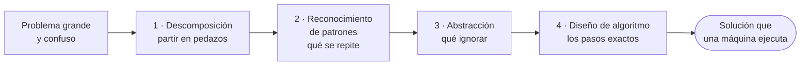
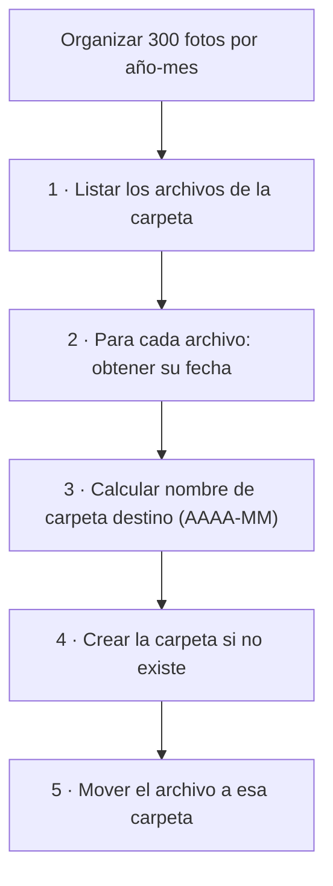

import Reto from "@components/Reto.astro";
import Solucion from "@components/Solucion.astro";
import Quiz from "@components/Quiz.astro";
import CheckDominio from "@components/CheckDominio.astro";
import Nivel from "@components/Nivel.astro";

<Nivel nivel="básico" />

## Objetivos de esta sub-unidad

Al terminar deberías poder **hacer** esto (no solo "conocerlo"):

- **O1 — Descomponer** un problema cotidiano en subproblemas más pequeños e independientes, y **nombrar las dependencias** entre ellos.
- **O2 — Identificar un patrón** repetido y **abstraer** el detalle irrelevante, de modo que la misma solución sirva para problemas que *parecen* distintos.
- **O3 — Diseñar un algoritmo** paso a paso (en pseudocódigo o lenguaje natural preciso) que resuelva un problema concreto, **incluyendo sus casos borde**.

> Estos tres verbos —descomponer, abstraer, diseñar— son lo que un entrevistador observa cuando te da un problema en vivo. No miran si memorizaste sintaxis; miran si **piensas como ingeniero**.

---

## Por qué importa (el dinero y la entrevista)

El **pensamiento computacional** es la habilidad de *atacar un problema de forma que una máquina pueda ejecutarlo*. No es programar: es el paso **anterior** a programar, el que decide si tu código será un desastre o una solución limpia.

- En un **live coding** nadie te pide que recites un lenguaje. Te dan un problema vago ("organiza estos pedidos", "deduplica esta lista") y observan cómo lo **rompes en pedazos** y diseñas la solución *antes* de teclear. El 80% de los candidatos que se caen, se caen aquí: empiezan a escribir código sin haber pensado el problema.
- En el mundo del **AI-augmented engineer**, esto importa *más*, no menos. La IA escribe código rápido, pero **no descompone tu problema por ti**: si tú no sabes partir un problema en subproblemas, no puedes ni dirigir a la IA ni detectar cuándo te entrega una descomposición equivocada. El que solo sabe pedir "hazme la app" produce basura; el que sabe descomponer dirige a la IA como a un equipo.
- Es la base de **todo** lo que viene: una API es un problema descompuesto en endpoints; un pipeline de datos es un problema descompuesto en etapas; un agente de IA es un problema descompuesto en pasos y herramientas.

:::tip[Si ya programaste antes]
Quizás ya descompones problemas por instinto. Perfecto: usa esta sub-unidad para **ponerle nombre** a lo que haces y **hacerlo explícito**. La diferencia entre un junior y un semi-senior no es que el segundo descomponga —es que lo hace *conscientemente* y puede *explicar* por qué partió el problema así. Si los dos ejercicios `Primero-Sin-IA` de abajo te salen en menos de la mitad del timebox y puedes defender cada decisión, valida y salta a [0.3 · Notional machine](/fase-0-fundamentos/0-3-notional-machine-trazado/).
:::

---

## Antes de empezar: recupera lo de 0.1

En [0.1 · Mentalidad y método](/fase-0-fundamentos/0-1-mentalidad-y-metodo/) instalaste la **Regla del Primero-Sin-IA**: piensas tú primero, la IA revisa después. El pensamiento computacional es *exactamente* el músculo que esa regla entrena. Sin notas, responde mentalmente:

- ¿Qué significa "resolverlo primero a mano"? ¿Por qué duele y por qué ese dolor es el aprendizaje (*desirable difficulty*)?
- ¿Cuál es la diferencia entre **usar** la IA y **depender** de ella para pensar?

Si esas dos respuestas no salen fluidas, vuelve un momento a 0.1. Esta sub-unidad asume que ya aceptaste la regla; aquí la *aplicas*.

---

## Las cuatro herramientas del pensamiento computacional

Hay cuatro movimientos. No son una receta rígida (rara vez van en orden puro), pero son las cuatro lentes con las que miras cualquier problema:



| Herramienta | La pregunta que responde | En una frase |
|---|---|---|
| **Descomposición** | ¿En qué pedazos más pequeños se parte esto? | Divide y vencerás. |
| **Reconocimiento de patrones** | ¿Qué se repite o se parece a algo que ya resolví? | No reinventes; reutiliza. |
| **Abstracción** | ¿Qué detalles puedo ignorar sin perder lo esencial? | Quédate con lo que importa. |
| **Diseño de algoritmo** | ¿Cuál es la secuencia exacta de pasos? | La receta sin ambigüedad. |

Cada una merece una mirada antes del ejemplo completo.

### Descomposición — divide y vencerás

Un problema grande asusta porque lo ves entero. **Descomponer** es partirlo en subproblemas tan pequeños que cada uno es obvio. Cocinar una cena de 6 platos es abrumador; "pica la cebolla" no lo es.

La clave que casi nadie nota: al descomponer también descubres las **dependencias**. "No puedes mover la foto antes de saber su fecha". Ese orden importa, y nombrarlo es la mitad del trabajo.

### Reconocimiento de patrones — no reinventes

Un **patrón** es algo que se **repite** (haces lo mismo para cada foto, para cada fila, para cada usuario) o que se **parece** a un problema que ya resolviste. Reconocer la repetición es lo que después se convierte en un **bucle**; reconocer el parecido es lo que te ahorra resolver desde cero.

### Abstracción — quédate con lo esencial

**Abstraer** es **borrar** detalle irrelevante. Un mapa del metro es útil *porque* miente: no respeta distancias ni calles reales, solo la información que necesitas (qué estación conecta con cuál). Si quieres organizar fotos por fecha, el contenido de la foto, su resolución y si es `.jpg` o `.png` son ruido: lo único esencial es la **fecha**.

:::note[Abstracción ≠ complicar]
Abstraer **simplifica**: quitas, no agregas. Mucha gente cree que "abstracto" significa "complicado y genérico". Es al revés: una buena abstracción hace el problema *más simple* porque elimina lo que no importa.
:::

### Diseño de algoritmo — la receta sin ambigüedad

Un **algoritmo** es una secuencia finita de pasos **sin ambigüedad** que resuelve el problema. "Más o menos ordénalas" no es un algoritmo. "Para cada foto: lee su fecha, calcula la carpeta año-mes, créala si no existe, mueve la foto ahí" sí lo es: cualquiera (o cualquier máquina) lo ejecuta y obtiene el mismo resultado.

El algoritmo es **independiente del lenguaje**. El mismo algoritmo se escribe igual de bien en Python, en TypeScript o en una servilleta. Eso es justo lo que lo hace valioso.

---

## Ejemplo resuelto (pensando en voz alta)

Veamos el pipeline completo con un problema real. Voy a **razonar en voz alta**, como lo haría en una pizarra, para que veas el *proceso*, no solo el resultado.

> **Problema:** "Tengo 300 fotos sueltas en una carpeta `Descargas`. Quiero organizarlas en subcarpetas por año y mes: `2024-01`, `2024-02`, etc."

**Paso 1 — Descomponer.** *"300 fotos" me asusta. Lo bajo a una sola: ¿qué tengo que hacerle a UNA foto? La leo, miro su fecha, decido en qué carpeta va, me aseguro de que la carpeta exista, y la muevo. Eso son cinco subproblemas. Si resuelvo el de una foto, el de 300 es "repite esto 300 veces". Anoto también las dependencias: no puedo decidir la carpeta antes de tener la fecha; no puedo mover antes de que la carpeta exista."*



**Paso 2 — Reconocer patrones.** *"Los pasos 2 a 5 son idénticos para cada foto. Eso es una repetición: huele a bucle. Y 'crear la carpeta si no existe' lo he visto mil veces —es un patrón estándar, no algo que deba inventar. Reconocerlo me dice que el grueso del trabajo es UN bloque que se repite."*

**Paso 3 — Abstraer.** *"¿Qué de una foto me importa? Solo su fecha. No me importa si es `.jpg` o `.png`, ni qué muestra, ni cuánto pesa, ni su nombre original. Todo eso es ruido. Si en mi cabeza reduzco cada foto a 'una cosa que tiene una fecha', el problema se vuelve trivial. Esa reducción es la abstracción."*

**Paso 4 — Diseñar el algoritmo.** *"Ahora escribo los pasos sin ambigüedad. Y me detengo a pensar los casos borde ANTES de codear, porque son los que rompen el programa: ¿y si un archivo no tiene fecha?, ¿y si la carpeta destino ya existe?, ¿y si la carpeta está vacía y no hay nada que mover?"*

```text
algoritmo organizar_fotos(carpeta):
    archivos ← listar todos los archivos de la carpeta
    si archivos está vacía:
        terminar (no hay nada que hacer)        # caso borde: carpeta vacía
    para cada archivo en archivos:
        fecha ← obtener fecha del archivo
        si fecha no existe:
            saltar este archivo y anotarlo       # caso borde: sin fecha
            continuar con el siguiente
        destino ← formatear fecha como "AAAA-MM"
        si la carpeta destino no existe:
            crear la carpeta destino              # patrón "crear si no existe"
        mover archivo a la carpeta destino
```

Fíjate en lo que **NO** hice: no abrí un editor, no escribí Python, no pensé en qué librería usar. Todo esto se resolvió **en lenguaje y pseudocódigo**, que es independiente del lenguaje de programación. Cuando llegue el momento de teclear (Fase 1), traducir este algoritmo a Python será casi mecánico. *Ese* es el poder del pensamiento computacional: el 80% del trabajo difícil ocurre antes de la primera línea de código.

> [!tip] La servilleta vence al teclado
> Un buen ingeniero resuelve el problema en una servilleta y *luego* lo teclea. Un mal ingeniero teclea hasta que algo funciona y no sabe por qué. La servilleta es más barata de equivocarse que el teclado.

---

## Errores de principiante (y por qué están mal)

:::caution[Misconception 1 — "Descomponer es escribir funciones."]
La descomposición ocurre **en lenguaje natural, antes del código**. Partir "organiza las fotos" en cinco subproblemas no requiere saber qué es una función. Si crees que necesitas saber programar para descomponer, lo tienes al revés: descompones *para* después poder programar. La servilleta no tiene sintaxis.
:::

:::caution[Misconception 2 — "Abstraer es hacerlo más genérico y complicado."]
Abstraer es **quitar**, no agregar. Reducir una foto a "algo con una fecha" es *más simple*, no más complejo. La sobre-abstracción ("¿y si algún día quiero organizar también por color y por persona y por...?") es un error opuesto y caro: abstraes los detalles que **no importan para el problema de hoy**, no inventas problemas que nadie pidió (eso se llama *YAGNI*, lo verás en Fase 2).
:::

:::caution[Misconception 3 — "El algoritmo es el código."]
Un algoritmo es la **receta**; el código es **una** forma de escribirla. El mismo algoritmo de las fotos se expresa igual en Python, TypeScript o en palabras. Si solo sabes "el código", estás atado a un lenguaje; si entiendes "el algoritmo", lo llevas a cualquiera. Por eso los ejercicios de esta sub-unidad son `a-mano`: el objetivo es el algoritmo, no la sintaxis.
:::

:::caution[Misconception 4 — "Reconocer patrones es copiar de Stack Overflow."]
Copiar es copiar. **Reconocer un patrón** es ver la *estructura* repetida: "esto que hago para cada foto es lo mismo que hago para cada fila de un CSV o cada usuario de una lista". Esa estructura ("haz lo mismo para cada elemento de una colección") es la que después se vuelve un bucle. El patrón vive en tu cabeza, no en el portapapeles.
:::

:::caution[Misconception 5 — "La IA descompone el problema por mí, así que no necesito esto."]
La IA puede *proponer* una descomposición, pero si tú no sabes descomponer no puedes hacer dos cosas críticas: (1) **detectar** cuando su descomposición está mal (olvidó un caso borde, mezcló subproblemas que debían ir separados), y (2) **dirigirla** ("no, sepáralo así, esta parte depende de la otra"). El ingeniero que no piensa solo *delega su criterio* a la máquina. Esta sub-unidad existe precisamente para que la IA sea tu palanca, no tu muleta.
:::

---

## Práctica con andamiaje (el andamio se va cayendo)

Vamos de menos a más autonomía. Primero **predices** (PRIMM), luego **reordenas** (Parsons), y al final **construyes desde cero** en los retos `Primero-Sin-IA`.

### A. Predict (PRIMM) — predice antes de mirar

Aquí tienes un algoritmo simple en pseudocódigo. **Sin ejecutar nada en tu cabeza a la rápida**, predice qué imprime. Tómate un minuto de verdad.

```text
algoritmo saludar(nombres):
    para cada nombre en nombres:
        si el nombre empieza con "A":
            imprimir "Hola, " + nombre
    imprimir "Listo"

saludar(["Ana", "Beto", "Alex", "Carla"])
```

<Quiz
  question="¿Qué imprime el algoritmo saludar(['Ana', 'Beto', 'Alex', 'Carla'])?"
  options={[
    "Hola, Ana / Hola, Alex / Listo",
    "Hola, Ana / Hola, Beto / Hola, Alex / Hola, Carla / Listo",
    "Hola, Ana / Hola, Alex (sin 'Listo')",
    "Solo 'Listo'",
  ]}
  answer={0}
  explanation="El bucle recorre los cuatro nombres pero solo imprime los que empiezan con 'A' (Ana y Alex). El 'Listo' está FUERA del bucle, así que se imprime una sola vez al final. Reconocer dónde termina el bucle (la indentación) es parte de leer un algoritmo."
/>

### B. Investigate + Modify (Parsons) — ordena los pasos

El siguiente algoritmo "decidir qué ver esta noche" tiene **los pasos correctos, pero desordenados**. Tu tarea: reordénalos mentalmente (o en papel) hasta que la secuencia sea lógica y respete las dependencias. Hay **una** trampa de dependencia escondida.

```text
PASOS DESORDENADOS (reordénalos):
  (a) reproducir la película elegida
  (b) si la lista de candidatas está vacía: proponer "leer un libro" y terminar
  (c) obtener la lista de películas no vistas
  (d) elegir la candidata mejor puntuada
  (e) filtrar las que duran menos de 2 horas
```

<Solucion title="Ver el orden correcto (pista, no te la des hasta intentarlo)">

Orden correcto: **c → e → b → d → a**.

1. **(c)** primero necesitas la lista de no vistas (no puedes filtrar lo que no tienes).
2. **(e)** filtras por duración.
3. **(b)** *aquí* está la dependencia escondida: el chequeo de "lista vacía" debe ir **después** de filtrar, no antes —porque puede que tuvieras películas, pero ninguna dure menos de 2 horas. Si pones (b) antes de (e), te saltas el caso en que el filtro deja la lista vacía.
4. **(d)** eliges la mejor puntuada (ya sabes que hay al menos una).
5. **(a)** reproduces.

La lección: **las dependencias y los casos borde mandan en el orden**. Un paso no va "donde suena bien", va donde sus requisitos ya están cumplidos.

</Solucion>

### C. Make — ahora construyes tú

El andamio se cayó. Los dos retos de abajo son `Primero-Sin-IA`: piensas tú, a mano, contra el reloj. La IA viene *después*, solo a revisar.

---

## Ejercicios Primero-Sin-IA

Recuerda el contrato de [0.1](/fase-0-fundamentos/0-1-mentalidad-y-metodo/): a mano primero, con timebox; está bien que sea lento y feo. La IA corrige al final con el framework de `.ai/` —y corrige tu **proceso**, no solo el resultado.

<Reto title="Descompón un problema cotidiano con las 4 herramientas" timebox="35 min">

Toma **uno** de estos problemas cotidianos (elige el que menos hayas pensado nunca):

- Organizar una mudanza de departamento.
- Preparar y enviar las 30 invitaciones de un cumpleaños.
- Decidir el menú de almuerzos de toda una semana para dos personas.

Y produce, **a mano y sin IA**, las cuatro lentes aplicadas: el árbol de **descomposición** con sus dependencias, los **patrones** que se repiten, qué **abstraes** (qué detalles ignoras y por qué), y el **algoritmo** final en pasos numerados con al menos **dos casos borde**.

Carpeta del ejercicio y plantilla: `ejercicios/fase-0/descomponer-problema-cotidiano/`.

**Hecho significa:** los cuatro entregables existen, las dependencias están explícitas, y puedes defender por qué ignoraste cada detalle que ignoraste.

</Reto>

<Reto title="Diseña un algoritmo preciso (y luego trázalo)" timebox="30 min">

Diseña, **a mano y sin IA**, el algoritmo de una herramienta pequeña: *"encontrar el archivo más grande dentro de una carpeta"*. Escríbelo en pseudocódigo, maneja los casos borde (carpeta vacía, empates), y después **traza a mano** tu propio algoritmo sobre una lista de ejemplo de 4 archivos para verificar que funciona.

Carpeta del ejercicio y plantilla: `ejercicios/fase-0/disenar-algoritmo-pseudocodigo/`.

**Hecho significa:** el pseudocódigo no tiene pasos ambiguos, cubre los dos casos borde, y tu traza a mano produce el resultado correcto. Este reto es el puente directo a [0.3 · Notional machine](/fase-0-fundamentos/0-3-notional-machine-trazado/).

</Reto>

---

## Check de dominio

Cierra el cuaderno. Si puedes hacer esto **sin notas**, lo aprendiste; si no, vuelve a la sección correspondiente (no a la IA todavía).

<CheckDominio
  items={[
    "Explicar las 4 herramientas (descomposición, patrones, abstracción, algoritmo) con un ejemplo propio de cada una",
    "Descomponer un problema nuevo y nombrar al menos una dependencia entre subproblemas",
    "Dar un ejemplo de abstracción y decir qué detalle ignoré y por qué",
    "Distinguir 'algoritmo' de 'código' y justificar por qué el algoritmo es independiente del lenguaje",
    "Identificar un caso borde antes de diseñar la solución (no después de que rompe)",
  ]}
/>

<Quiz
  question="¿Cuál de estas afirmaciones describe correctamente la ABSTRACCIÓN?"
  options={[
    "Hacer el problema más genérico y preparado para cualquier caso futuro",
    "Ignorar los detalles irrelevantes para quedarte solo con lo esencial",
    "Partir el problema en subproblemas más pequeños",
    "Escribir los pasos exactos sin ambigüedad",
  ]}
  answer={1}
  explanation="Abstracción = quitar detalle irrelevante (lente 3). Partir en subproblemas es descomposición; escribir pasos exactos es diseño de algoritmo; 'prepararlo para cualquier caso futuro' es sobre-ingeniería, justo lo que NO es abstracción."
/>

---

## Recursos

Documentación y fuentes de calidad, oficiales primero:

- **BBC Bitesize — Computational thinking** (introducción canónica a las 4 herramientas, en inglés): los conceptos de *decomposition, pattern recognition, abstraction, algorithms* explicados desde cero.
- **Google for Education — Computational Thinking** (curso gratuito para educadores, define y ejemplifica cada pilar).
- **Jeannette Wing, "Computational Thinking" (2006)** — el artículo de 3 páginas que acuñó el término. Lectura breve y fundacional (inglés técnico: buen primer texto para el track de inglés).
- **"How to Solve It", G. Pólya** — el clásico de 1945 sobre descomponer y atacar problemas. Anterior a la computación, sigue siendo la mejor guía mental.

> En esta fase la doc oficial pesa poco (es un tema conceptual); pesa más que **practiques las lentes** en problemas reales. Lee uno de estos, pero gasta el doble de tiempo en los retos.

---

## Conexión con el capstone de la Fase 0

El proyecto de cierre de esta fase es la **[CLI sin IA](/fase-0-fundamentos/)**: una herramienta de línea de comandos útil, escrita 100% sin asistencia de IA. Esta sub-unidad es el cimiento directo:

- Antes de teclear una línea de tu CLI, vas a **descomponerla** en subproblemas (parsear argumentos, validar entrada, hacer el trabajo, mostrar salida).
- Vas a **diseñar su algoritmo** en pseudocódigo —exactamente como el ejercicio del "archivo más grande"— y *después* lo traducirás a código en Fase 1.
- Los **casos borde** que practicaste aquí (carpeta vacía, entrada inválida) son los que harán que tu CLI no explote en la demo.

En la práctica, el capstone arranca con un **mini-spec** (lo verás en [0.8 · Spec-first](/fase-0-fundamentos/)): y un mini-spec *es* el resultado de descomponer y abstraer un problema. Lo que aprendiste hoy es el primer borrador de esa spec.

---

## Reflexión + repaso espaciado

Antes de cerrar, escribe en tu `progreso.md` (de 0.1) **dos o tres frases**:

> ¿En qué momento de hoy *atacaste el teclado* en vez de pensar primero? ¿Qué problema reciente de tu vida (no de código) habrías resuelto mejor descomponiéndolo? Nombra la herramienta de las cuatro que más te cuesta.

**Gancho de repaso espaciado:**

- **Mañana:** reescribe de memoria las 4 herramientas y un ejemplo de cada una, sin mirar esta página. Si no salen, no las aprendiste —vuelve.
- **En 3 días:** toma un problema cualquiera de tu día (no técnico) y descomponlo en 60 segundos en tu cabeza. El objetivo es que descomponer se vuelva un **reflejo**, no un esfuerzo.
- **En 1 semana:** retoma el reto del "archivo más grande" y vuelve a diseñar el algoritmo desde cero. Compara con tu primer intento: si mejoró, el músculo está creciendo.

> [!tip] GLaDOS-style closing
> "Descomponer, abstraer, diseñar. Tres palabras que separan a quien *resuelve* problemas de quien solo *teclea hasta que deja de doler*. La buena noticia: es una habilidad, no un talento. Se entrena. Empieza con la servilleta."
