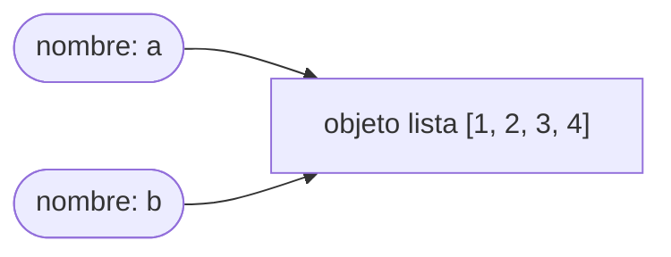

import Nivel from "@components/Nivel.astro";
import Reto from "@components/Reto.astro";
import Solucion from "@components/Solucion.astro";
import Quiz from "@components/Quiz.astro";
import CheckDominio from "@components/CheckDominio.astro";

<Nivel nivel="básico" />

## Objetivos de esta lección

Al terminar vas a poder:

- **O1 — Predecir**, sin ejecutar, la salida exacta de un fragmento con bucles y mutación, construyendo una **tabla de estado** (variable × paso) que justifique tu predicción.
- **O2 — Explicar** el modelo *"nombres → objetos"* (la *notional machine*) y por qué el *aliasing* produce efectos que a primera vista parecen mágicos.
- **O3 — Reordenar** (problema de *Parsons*) las líneas desordenadas de una función hasta que su comportamiento sea correcto, justificando las dependencias de orden.

> Términos en inglés que vas a oír en entrevistas y docs: **notional machine**, **dry-run**, **trace table**, **aliasing**, **Parsons problem**. Los usamos en su forma original a propósito.

---

## Por qué importa (el dinero, sin vueltas)

En toda entrevista técnica seria hay un **live coding**: te ponen código en una pizarra o un editor compartido y te preguntan *"¿qué imprime esto?"* o *"¿por qué falla?"*. No puedes ejecutarlo. No puedes pedirle a una IA que lo haga. Solo estás tú y tu capacidad de **simular la máquina en tu cabeza**.

Eso que simulas tiene nombre: la **notional machine** — un modelo simplificado, pero *consistente y correcto*, de cómo la computadora ejecuta tu código. No es el silicio real; es la abstracción justa para razonar. Quien la tiene, lee un programa y "ve la película". Quien no, adivina, ejecuta a ciegas y se cae cuando el debugger no está.

> [!tip] En la práctica
> El debugger es una muleta excelente. El problema es presentarse a la entrevista en silla de ruedas. Esta lección te enseña a caminar.

Es, además, la base de todo lo que viene: depurar sin `print`, leer código ajeno (Fase 2), y entender por qué tu agente de IA mutó un estado que creías intacto (Fase 6). Si no puedes trazar un bucle a mano, no puedes confiar en lo que escribes.

---

## Lo que ya traes (actívalo)

Esta sub-unidad se apoya en las dos anteriores:

- De [0.1 · Mentalidad y método](/fase-0-fundamentos/0-1-mentalidad-y-metodo/): la **Regla del Primero-Sin-IA**. Aquí se aplica literal: vas a *predecir* antes de ejecutar.
- De [0.2 · Pensamiento computacional](/fase-0-fundamentos/0-2-pensamiento-computacional/): **descomponer** un problema en pasos. Trazar es eso mismo, pero hacia adentro: descomponer la *ejecución* en pasos atómicos.

Pregunta de calentamiento (respóndela mentalmente antes de seguir): si una variable `x` vale `5` y escribes `y = x` y luego `x = 9`, ¿cuánto vale `y`? Guarda tu respuesta; volvemos a ella.

:::tip[Si ya programas hace años]
Quizás trazas en automático y esto te suena obvio. Valida en 3 minutos: salta al [Reto 2 (Parsons)](#reto-2--parsons-ordena-la-función) y al [Check de dominio](#check-de-dominio). Si los resuelves sin dudar, marca la sub-unidad y sigue. Si dudas en el `is` o en el *aliasing*, lee la lección: es justo donde el modelo intuitivo falla.
:::

---

## Ejemplo resuelto (te lo trazo en voz alta)

### La idea central: nombres y objetos

La mayoría de la gente imagina una variable como una **caja** que *contiene* un valor. Funciona para números, pero rompe con listas y diccionarios. El modelo correcto de Python es:

> Un **nombre** es una etiqueta que *apunta* a un **objeto** en memoria. Asignar (`=`) no copia el objeto: mueve la etiqueta.

Mira este fragmento. Lo razono paso a paso, como en una entrevista.

```python
a = [1, 2, 3]
b = a
b.append(4)
print(a)
```

**Pensando en voz alta:**

1. `a = [1, 2, 3]` → se crea **un** objeto lista en memoria. El nombre `a` apunta a él.
2. `b = a` → **no** se crea una lista nueva. El nombre `b` apunta al *mismo* objeto que `a`. Ahora hay dos etiquetas, un solo objeto.
3. `b.append(4)` → `.append` **muta** el objeto al que apunta `b`. Pero ese objeto es el mismo que el de `a`. La lista ahora es `[1, 2, 3, 4]`.
4. `print(a)` → `a` sigue apuntando a ese objeto mutado. Imprime **`[1, 2, 3, 4]`**.

Si esperabas `[1, 2, 3]`, tu modelo era "la caja": creíste que `b` tenía su propia copia. No la tiene. Esto es **aliasing**: dos nombres, un objeto.



Volviendo a tu calentamiento: `y = x; x = 9` deja `y` en `5`. ¿Contradicción? No. Los enteros son **inmutables**: no puedes mutarlos, solo *reasignar* el nombre. `x = 9` mueve la etiqueta `x` a un objeto nuevo (`9`); `y` se queda apuntando al `5`. La regla "nombres → objetos" explica **ambos** casos. Esa es la marca de una buena notional machine: un solo modelo, sin excepciones.

### La técnica: tabla de estado (dry-run)

Para fragmentos con bucles, "verlo en la cabeza" no alcanza: se te caen los valores intermedios. La herramienta profesional es la **tabla de estado** (o *trace table*): una fila por cada paso relevante, una columna por variable. Trazo esta función:

```python
def total_descuento(precios, umbral):
    total = 0
    for p in precios:
        if p > umbral:
            total = total + p
    return total
```

Quiero `total_descuento([10, 50, 30, 80], 25)`. Voy fila por fila, anotando el estado **después** de cada iteración:

| Paso | `p` | ¿`p > 25`? | `total` (después) |
|------|-----|-----------|-------------------|
| inicio | — | — | 0 |
| iter 1 | 10 | no | 0 |
| iter 2 | 50 | sí | 50 |
| iter 3 | 30 | sí | 80 |
| iter 4 | 80 | sí | 160 |

`return total` ⇒ **160**. No ejecuté nada. La tabla *es* la prueba de mi razonamiento, y si me equivoco, me dice **en qué fila** se rompió mi modelo.

Reglas del dry-run que uso siempre:
- **Una línea a la vez, de arriba abajo.** La máquina no "ve el conjunto"; ejecuta en secuencia.
- **Toda variable que cambia tiene su columna.** Si no la anotas, la olvidas.
- **Anota el estado *después* de cada paso**, no "el resultado final". El error vive en los intermedios.

---

## Errores de modelo que vas a tener (y por qué)

:::caution[Misconception 1 — "`=` copia el objeto"]
Podrías pensar que `b = a` crea una copia de la lista. **Está mal:** copia la *referencia*, no el objeto. Para copiar de verdad una lista usas `a.copy()` o `a[:]`. Confundir esto te hará "mutar" datos que creías intactos — uno de los bugs más caros y silenciosos que existen.
:::

:::caution[Misconception 2 — "el bucle pasa todo de una vez"]
El `for` no procesa la lista "en bloque". Ejecuta el cuerpo **una vez por elemento, en orden**, y el estado de la iteración anterior persiste. Por eso un acumulador (`total`) crece: no se reinicia salvo que tú lo reinicies dentro del bucle.
:::

:::caution[Misconception 3 — `==` vs `is`]
`==` pregunta *"¿valen lo mismo?"*. `is` pregunta *"¿son el mismo objeto?"* (la misma etiqueta apuntando al mismo lugar). Dos listas distintas con el mismo contenido cumplen `==` pero **no** `is`. En el reto de abajo esto decide el resultado.
:::

:::caution[Misconception 4 — "lo leo de un vistazo y ya sé qué hace"]
La lectura "global" funciona para código trivial y te traiciona en cuanto hay mutación o índices. Trazar a mano se siente lento al principio; es exactamente el músculo que un live coding mide. Lento y correcto le gana a rápido y adivinando.
:::

:::caution[Off-by-one — `range`]
`range(n)` produce `0, 1, …, n-1` (**no** incluye `n`). `range(1, n+1)` produce `1, …, n`. La mitad de los errores de bucle de un junior son un `range` mal contado. Cuando traces, escribe explícitamente qué valores toma el índice.
:::

---

## Práctica con andamiaje (PRIMM)

Antes de soltarte, una ronda guiada con el método **PRIMM** — *Predict, Run, Investigate, Modify, Make*. La clave: **predices ANTES de ejecutar**. Esa es la versión micro del Primero-Sin-IA.

Fragmento:

```python
xs = [4, 7, 1]
ys = sorted(xs)
ys.append(99)
print(xs)
print(ys)
```

1. **Predict** (sin ejecutar, anota en papel): ¿qué imprime cada `print`? Pista de modelo: ¿`sorted(xs)` muta `xs` o crea un objeto nuevo?
2. **Run**: ejecuta y compara con tu predicción.
3. **Investigate**: si fallaste, ¿en qué línea se rompió tu modelo? `sorted()` *devuelve una lista nueva* (no muta); `.sort()` mutaría en sitio. ¿Lo tenías?
4. **Modify**: cambia `sorted(xs)` por `xs.sort()` (que devuelve `None`). Re-predice `print(ys)` y verifica.
5. **Make**: escribe tú un fragmento de 3 líneas donde `is` dé `True` entre dos nombres. Demuéstralo con un `print`.

<Quiz
  question="Con el fragmento de arriba, ¿qué imprime print(xs)?"
  options={["[4, 7, 1]", "[1, 4, 7]", "[1, 4, 7, 99]", "[4, 7, 1, 99]"]}
  answer={0}
  explanation="sorted(xs) NO muta xs: crea una lista nueva ordenada y se la asigna a ys. xs queda intacto: [4, 7, 1]. Si fuera xs.sort(), ahí sí cambiaría."
/>

Ahora un **Parsons mini** (reordenar líneas) para que veas la técnica del Reto 2. Estas líneas, desordenadas, forman una función que cuenta cuántos números de una lista son positivos. Ordénalas mentalmente:

```text
    return cuenta
        if n > 0:
def positivos(numeros):
            cuenta = cuenta + 1
    cuenta = 0
    for n in numeros:
```

<Solucion title="Ver orden correcto (ábrelo solo tras intentarlo)">

```python
def positivos(numeros):
    cuenta = 0
    for n in numeros:
        if n > 0:
            cuenta = cuenta + 1
    return cuenta
```

La pista de orden está en las **dependencias**: `cuenta = 0` debe existir *antes* del bucle que la usa; el `if` vive *dentro* del `for` (más indentación); el `return` va al final, al nivel de la función. La indentación no es estética: **es** la estructura.

</Solucion>

---

## Ejercicios Primero-Sin-IA

> Recordatorio de método: intenta **a mano, sin ejecutar y sin IA** (respeta el timebox). Solo después ejecutas para verificar. Mañana, reescribe tu predicción de memoria — si no puedes, no lo aprendiste todavía.

<Reto title="Traza una inversión in-place con aliasing" timebox="30 min">

Predice la salida **exacta** de este programa sin ejecutarlo. Lo entregable es tu **tabla de estado**, no solo el número final.

```python
def reordenar(xs):
    izquierda = 0
    derecha = len(xs) - 1
    while izquierda < derecha:
        xs[izquierda], xs[derecha] = xs[derecha], xs[izquierda]
        izquierda = izquierda + 1
        derecha = derecha - 1
    return xs

original = [5, 8, 2, 1]
copia = original
resultado = reordenar(copia)
print(original)
print(resultado)
print(original is resultado)
```

**Hecho significa:**
- Una tabla de estado con columnas `izquierda`, `derecha` y el contenido de `xs` tras cada vuelta del `while`.
- Las **tres** líneas que imprime el programa, predichas antes de ejecutar.
- Una explicación de por qué la tercera línea (`is`) da lo que da.

Carpeta del ejercicio y entregables: `ejercicios/fase-0/notional-machine-trazado/`.

<Solucion title="Pista (no la respuesta)">

Dos trampas conviven aquí. (1) `copia = original` **no** copia la lista: `copia` y `original` son la misma. (2) `reordenar` muta `xs` *in-place* con el swap y **devuelve el mismo objeto** que recibió. Pregúntate: ¿cuántos objetos lista existen en total en este programa? Si tu respuesta es "uno", ya casi lo tienes.

</Solucion>

</Reto>

<Reto title="Parsons: ordena la función" timebox="25 min">

Te doy las líneas de una función `promedio(numeros)` **desordenadas**. Debe devolver el promedio de la lista y, si la lista está vacía, devolver `0.0` (sin reventar por división entre cero). Reordénalas — incluida la **indentación** — hasta que los tests pasen.

Líneas desordenadas:

```text
    total = 0
def promedio(numeros):
    if not numeros:
        return 0.0
    for n in numeros:
        total = total + n
    return total / len(numeros)
```

**Hecho significa:**
- `solucion.py` con las líneas reordenadas (función ejecutable, sin líneas sobrantes).
- `uv run pytest` (o `pytest`) en verde con los tests provistos.
- `orden.md`: 3–4 frases justificando **por qué** ese orden y no otro (qué línea depende de cuál).

Carpeta del ejercicio: `ejercicios/fase-0/notional-machine-parsons/`.

<Solucion title="Pista (no la respuesta)">

Piensa en dependencias de datos y de control, no en "cómo se ve bonito". ¿Qué línea *necesita* que `total` ya exista? ¿El `if` de la lista vacía conviene antes o después de tocar `len(numeros)`? La indentación te dice qué vive *dentro* del bucle y qué vive al nivel de la función.

</Solucion>

</Reto>

> ¿Quieres una tercera repetición sobre bucles anidados? El ejercicio hermano [`trazado-a-mano-bucle`](#) (carpeta `ejercicios/fase-0/trazado-a-mano-bucle/`) es justo eso. Úsalo mañana como *spaced retrieval*.

---

## Check de dominio

Marca solo lo que puedes **explicar sin notas**. Si dudas, vuelve a la sección correspondiente.

<CheckDominio items={[
  "Explicar el modelo 'nombres → objetos' y por qué = no copia",
  "Distinguir aliasing de copia, y == de is, con un ejemplo propio",
  "Trazar a mano un bucle con acumulador usando una tabla de estado",
  "Decir qué valores toma range(n) y range(a, b) sin equivocarme en el último",
  "Reordenar las líneas de una función pequeña (Parsons) justificando el orden por dependencias",
]} />

**Active recall (hazlo en voz alta, sin mirar):**

1. Explícale a alguien (o a la pared) qué es una *notional machine* en una frase.
2. Predice la salida: `s = "ab"; t = s; s = s + "c"; print(t)`. ¿Por qué `t` no cambia, si las listas sí cambiaban?

<Quiz
  question="¿Qué imprime: s = 'ab'; t = s; s = s + 'c'; print(t)?"
  options={["ab", "abc", "Error", "None"]}
  answer={0}
  explanation="Los strings son inmutables: s + 'c' crea un objeto NUEVO y reasigna el nombre s. t sigue apuntando al 'ab' original. Es el mismo principio del entero del calentamiento."
/>

---

## Recursos (oficial primero)

- **Python Tutor** — [pythontutor.com](https://pythontutor.com): visualiza la *notional machine* paso a paso (nombres, objetos, el stack). Úsalo **solo para verificar** tu predicción, nunca para predecir por ti.
- **Python — Execution model** (oficial): [docs.python.org/3/reference/executionmodel.html](https://docs.python.org/3/reference/executionmodel.html) — cómo se vinculan nombres y objetos.
- **Python — Data model** (oficial): [docs.python.org/3/reference/datamodel.html](https://docs.python.org/3/reference/datamodel.html) — qué es un objeto, identidad (`id()`), `is`.
- **Python — The `for` statement** (oficial): [docs.python.org/3/reference/compound_stmts.html#the-for-statement](https://docs.python.org/3/reference/compound_stmts.html#the-for-statement).
- Complementario (no oficial, excelente): Ned Batchelder, *"Facts and myths about Python names and values"* — [nedbatchelder.com/text/names.html](https://nedbatchelder.com/text/names.html).

Mantén tu lista viva de enlaces en `articulos.md` dentro de la carpeta de la sub-unidad.

---

## Conexión con el capstone de la fase

El [Capstone F0 — CLI sin IA](/fase-0-fundamentos/) lo escribes **sin asistencia de IA**. Eso implica depurarlo igual: cuando tu CLI imprima algo raro, no tendrás un agente que lo explique. Tendrás una tabla de estado y tu cabeza. Trazar a mano es, literalmente, el método con el que vas a encontrar tus propios bugs. Cada hora que inviertas aquí te ahorra tres frente al capstone.

Y es transferible: depurar un servicio en Fase 5 sin más que los **logs**, o entender por qué un agente de Fase 6 mutó un estado compartido, son la misma habilidad a mayor escala. La traza a mano es la observabilidad de tu propia mente.

---

## Reflexión + repaso espaciado

Escribe 3 frases en tu `notas.md`:

1. ¿En cuál de los cuatro *misconceptions* te reconociste? (Sé honesto: el que niegas suele ser el tuyo.)
2. ¿Qué fila de tu tabla de estado se rompió primero en el Reto 1, y qué idea de fondo la causó?
3. Define *aliasing* con tus palabras, sin mirar.

**Gancho de spaced repetition:**
- **Mañana:** reescribe de memoria tu predicción del Reto 1, sin mirar. Si no sale, vuelve al ejemplo resuelto.
- **En 3 días:** traza `ejercicios/fase-0/trazado-a-mano-bucle/` (bucle anidado) en frío.
- **En 1 semana:** crea un fragmento de 5 líneas con *aliasing* que engañe a un compañero. Enseñar es la prueba final de que la notional machine ya es tuya.

> [!tip] En la práctica
> "Lo leí y entendí" no es un dato verificable. "Lo predije y acerté sin ejecutar" sí. Una de esas dos frases pasa la entrevista. La otra es la mentira que te cuentas.
