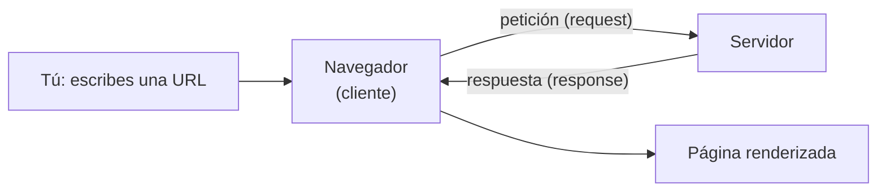
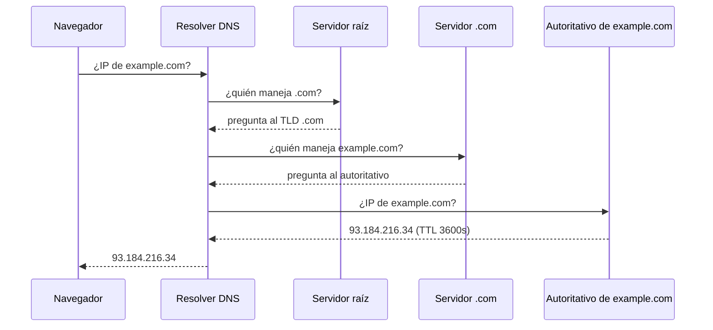

import Reto from "@components/Reto.astro";
import Solucion from "@components/Solucion.astro";
import Quiz from "@components/Quiz.astro";
import CheckDominio from "@components/CheckDominio.astro";
import Nivel from "@components/Nivel.astro";

<Nivel nivel="básico" />

## 🎯 Objetivos de esta lección

Al terminar vas a poder, **sin notas**:

1. **Explicar** el viaje completo de una petición web —del navegador al servidor y de vuelta— nombrando cada pieza (DNS, IP, puerto, TCP, TLS, HTTP) y por qué existe.
2. **Descomponer** cualquier URL en sus partes (esquema, host, puerto, ruta, query, fragmento) y **predecir** qué método y status code esperarías de una operación dada.
3. **Inspeccionar** tráfico HTTP real con `curl` y **diagnosticar** un problema leyendo status code y headers (¿error del cliente o del servidor? ¿cifrado o no? ¿redirección?).

> Esta lección es **conceptual con manos a la obra**. No memorices una tabla: construye el modelo mental. Todo lo que programes después —un endpoint, un scraper, un agente que llama a una API, un deploy detrás de Cloudflare— vive encima de lo que ves aquí.

---

## 2. Por qué esto importa (y por qué te van a preguntar en entrevista)

💰 **Mercado:** "explícame qué pasa cuando escribo `google.com` en el navegador y aprieto Enter" es **la** pregunta clásica de entrevista técnica, justamente porque mide si entiendes el sistema completo o solo memorizaste sintaxis. Un semi-senior la responde con un diagrama mental, no con un "se conecta a internet". Y en el día a día: cada bug de "la API devuelve 500", "el deploy da 502", "la cámara no funciona en `http://`", "el agente recibe 429" se resuelve **rápido** si tienes este modelo, y se vuelve magia negra si no.

No estás aprendiendo trivia de redes. Estás aprendiendo el **terreno** sobre el que corren las apps. Un ingeniero que no sabe qué es un puerto depura a ciegas.

---

## 3. Lo que ya traes (actívalo antes de seguir)

En [0.1 Mentalidad y método](/fase-0-fundamentos/0-1-mentalidad-y-metodo/) acordamos el **Primero-Sin-IA**: intentar a mano antes de pedir ayuda. En [0.3 Trazado a mano](/fase-0-fundamentos/0-3-notional-machine-trazado/) entrenaste a **predecir la salida** de un programa sin ejecutarlo. Aquí aplicas lo mismo, pero al sistema completo: vas a **predecir** qué responde un servidor antes de mirar.

Trae también esto de tu vida diaria, aunque no le hayas puesto nombre:

- Cuando escribes una dirección en el navegador y carga una página → eso es **cliente-servidor**.
- Cuando una página dice "404 — no encontrado" → eso es un **status code HTTP**.
- Cuando ves el candado 🔒 en la barra → eso es **HTTPS** (HTTP cifrado).
- Cuando tu router de casa deja que el celular, el notebook y la TV usen "el mismo internet" → eso es **NAT**.

La lección le pone nombre técnico a cosas que ya tocas. Eso es justo lo que pide el ROADMAP: **formalizar** lo intuitivo.



---

## 4. Ejemplo resuelto: el viaje de una URL, pensado en voz alta

Voy a razonar **paso a paso**, como lo haría frente a un entrevistador. Toma esta URL:

```
https://example.com:443/tienda/productos?categoria=audio&orden=precio#resenas
```

**Paso 0 — Descompongo la URL.** Antes de "conectarme" a nada, leo qué me están pidiendo:

| Parte | Valor | Qué significa |
|---|---|---|
| **esquema** (scheme) | `https` | protocolo + cifrado. Implica puerto 443 por defecto. |
| **host** | `example.com` | el nombre del servidor (un dominio, no una dirección todavía). |
| **puerto** (port) | `443` | la "puerta" del servidor a la que toco. 443 es HTTPS. |
| **ruta** (path) | `/tienda/productos` | qué recurso quiero dentro del servidor. |
| **query string** | `?categoria=audio&orden=precio` | parámetros: pares `clave=valor` separados por `&`. |
| **fragmento** | `#resenas` | ancla **dentro de la página**; **nunca sale al servidor**, lo usa solo el navegador. |

> Pienso en voz alta: el fragmento `#resenas` me sorprende a la primera, pero tiene lógica — es para saltar a una sección de la página ya descargada. El servidor no necesita saberlo, así que el navegador no lo envía.

**Paso 1 — ¿Quién es `example.com`?** El servidor no entiende nombres, entiende **direcciones IP** (como `93.184.216.34`). Necesito traducir el nombre a número. Eso lo hace el **DNS** (Domain Name System), la "guía telefónica" de internet:



> Pienso en voz alta: esto parece lento (varias idas y vueltas), pero casi siempre la respuesta está **cacheada** (en el navegador, en el sistema operativo, en tu router, en el resolver de tu ISP). El `TTL` —time to live— dice cuántos segundos vale guardarla. Por eso "ya administro `alvarocortes.cl`": cuando cambio un registro DNS, tarda en propagarse justo por estos cachés.

**Paso 2 — Abro un canal hasta esa IP:puerto.** Con la IP `93.184.216.34` y el puerto `443`, establezco una conexión **TCP**. TCP garantiza que los bytes lleguen completos y en orden; se abre con un saludo de tres pasos (el *handshake*: SYN → SYN-ACK → ACK). Es una llamada telefónica: primero "¿me escuchas?" antes de hablar.

**Paso 3 — Como es `https`, ciframos (TLS).** Sobre el canal TCP se monta un **handshake TLS**: el servidor presenta su **certificado** (lo firma una autoridad en la que tu sistema confía), acuerdan claves, y de ahí en adelante **todo viaja cifrado**. Esto es lo que impide que el WiFi del café lea tu sesión.

**Paso 4 — Recién ahora hablo HTTP.** Envío una **petición** en texto plano (dentro del túnel cifrado):

```http
GET /tienda/productos?categoria=audio&orden=precio HTTP/1.1
Host: example.com
User-Agent: Mozilla/5.0
Accept: text/html
```

Fíjate: el método es `GET` (quiero **leer** un recurso), la ruta y la query van en la primera línea, y el header `Host` le dice al servidor **cuál** de los sitios que aloja quiero (un mismo servidor puede servir muchos dominios). El fragmento `#resenas` **no aparece**: se quedó en el navegador.

**Paso 5 — El servidor responde.** Procesa y devuelve:

```http
HTTP/1.1 200 OK
Content-Type: text/html; charset=utf-8
Content-Length: 5821
Cache-Control: max-age=300

<!DOCTYPE html><html>... (el cuerpo / body) ...</html>
```

Leo la **línea de estado**: `200 OK` → salió bien. Los **headers** son metadatos (qué tipo de contenido, cuánto pesa, cuánto cachearlo). El **body** es el contenido real.

**Paso 6 — El navegador renderiza.** Recibe el HTML y:
1. Lo parsea y construye el **DOM** (el árbol de la página).
2. Ve que el HTML referencia CSS, JS e imágenes → hace **más peticiones** (vuelve al Paso 4 por cada una).
3. El **motor de JavaScript** (V8 en Chrome) ejecuta el JS.
4. Calcula posiciones (*layout*), pinta píxeles (*paint*) y finalmente saltas a `#resenas`.

Ese es el viaje completo. Una página moderna repite los pasos 4–5 **decenas de veces** (cada imagen, cada script). Por eso la **latencia** importa: cada ida y vuelta cuesta milisegundos, y se acumulan.

---

## 5. Errores de principiante (confróntalos ahora)

:::caution[Podrías pensar X… y está mal]

- **"HTTPS solo cifra la contraseña."** ❌ Cifra **todo el canal**: URL completa con su query, headers, cookies y body. Lo único que un espía ve es *con qué IP hablas* y *cuántos bytes*, no el contenido. Por eso la cámara del navegador y el portapapeles **exigen HTTPS**.
- **"404 significa que el servidor está caído."** ❌ Un `404` es una **respuesta exitosa del servidor** que dice "ese recurso no existe aquí". El servidor está vivo y te contestó. Si estuviera caído, no habría respuesta (timeout) o vería un `502/503` de un proxy adelante.
- **"`401` y `403` son lo mismo."** ❌ `401 Unauthorized` en realidad significa **no autenticado** ("¿quién eres? identifícate"). `403 Forbidden` significa **autenticado pero sin permiso** ("sé quién eres, pero no puedes"). El nombre del 401 es engañoso; la semántica no.
- **"El puerto es parte del dominio."** ❌ El dominio (`example.com`) se traduce a una IP vía DNS. El **puerto** (`:443`) elige *qué servicio* en esa máquina. Una misma IP puede correr web (443), SSH (22) y una base de datos (5432) a la vez, cada uno en su puerto.
- **"`GET` y `POST` dan lo mismo."** ❌ `GET` **lee** sin efectos secundarios (es *seguro* e *idempotente*: repetirlo no cambia nada). `POST` **crea/modifica** (no idempotente: enviarlo dos veces puede crear dos pedidos). Usar `GET` para borrar algo es un bug clásico de seguridad.
- **"Una IP identifica a una persona."** ❌ Gracias a **NAT**, toda tu casa (celular, TV, notebook, el mainframe) sale a internet con **una sola IP pública compartida**. La IP identifica una conexión de red, no a un humano.

:::

---

## 6. Práctica con andamiaje (el soporte se desvanece)

### 6a. Parsons — reordena el viaje (papel, sin IA)

Estos son los pasos de "escribo una URL y aprieto Enter", **desordenados**. Reordénalos en un papel **antes** de mirar la solución. No ejecutes nada: predice.

```text
( ) El navegador parsea el HTML y construye el DOM, pidiendo CSS/JS/imágenes.
( ) Se abre la conexión TCP (handshake SYN / SYN-ACK / ACK) a la IP en el puerto 443.
( ) El servidor responde con una línea de estado, headers y body.
( ) DNS traduce el host a una dirección IP.
( ) El navegador descompone la URL en esquema, host, puerto, ruta, query, fragmento.
( ) Se envía la petición HTTP (método + ruta + headers).
( ) Handshake TLS: el servidor presenta su certificado y se acuerdan claves.
```

<Solucion title="Ver orden correcto (solo si ya lo ordenaste)">

1. El navegador descompone la URL.
2. DNS traduce el host a IP.
3. Se abre la conexión TCP.
4. Handshake TLS (porque es `https`).
5. Se envía la petición HTTP.
6. El servidor responde (estado + headers + body).
7. El navegador parsea el HTML y pide subrecursos.

Regla mnemónica: **nombre → número → canal → cifrado → pregunta → respuesta → pintar**.

</Solucion>

### 6b. PRIMM — predice, corre, investiga (5 min, con terminal)

`curl` es un cliente HTTP de línea de comandos: hace exactamente lo que el navegador, pero te muestra el HTTP crudo. La opción `-I` hace una petición **HEAD** (pide solo los headers, sin el body).

**Predice** (escríbelo *antes* de correr): ¿qué status code esperas de `https://example.com`? ¿Qué `Content-Type`?

```bash
curl -I https://example.com
```

**Corre** el comando. **Investiga** la salida: busca la primera línea (`HTTP/2 200`), el header `content-type`, y `content-length`. ¿Coincidió con tu predicción?

**Modifica:** ahora pide un recurso que no existe y observa el cambio de status:

```bash
curl -s -o /dev/null -w "%{http_code}\n" https://example.com/esta-ruta-no-existe
```

`-s` silencia el progreso, `-o /dev/null` tira el body a la basura, `-w "%{http_code}"` imprime solo el código. ¿Es `2xx`, `4xx` o `5xx`? ¿Por qué ese y no otro?

---

## 7. Ejercicios Primero-Sin-IA

> Recuerda el contrato: **intenta a mano primero** (timebox abajo), luego documentación oficial, y **solo al final** usa IA para *revisar*, no para *generar*. Estos dos ejercicios cubren las dos mitades de la lección: el **modelo** (el viaje) y la **observación** (HTTP real).

<Reto title="Anatomía de una URL y su viaje" timebox="35 min">

Toma una URL **real y completa** (con query y, si puedes, fragmento) y produce dos cosas, **a mano, sin ejecutar nada y sin IA**:

1. Una **tabla de descomposición** de la URL (esquema, host, puerto efectivo, ruta, query, fragmento).
2. Un **recorrido numerado** de qué pasa al apretar Enter, desde DNS hasta el render, nombrando IP, puerto, TCP, TLS y el método HTTP — y diciendo **qué parte de la URL NO viaja al servidor** y por qué.

Entregable: el archivo `recorrido.md` (hay un esqueleto en la carpeta del ejercicio). Detalle en `ejercicios/fase-0/anatomia-de-una-url/README.md`.

</Reto>

<Reto title="Inspecciona HTTP real con curl" timebox="40 min">

Con `curl` (sin navegador, sin IA), captura y **clasifica** respuestas HTTP reales: un `2xx`, un `4xx`, una **redirección** `3xx` (y síguela con `-L`), y compara una petición `http://` contra `https://`. Por cada caso, anota status code, qué te dijeron los headers, y **qué concluyes** (¿error de cliente o de servidor? ¿está cifrado?).

Entregable: el archivo `informe.md` (esqueleto incluido). Detalle en `ejercicios/fase-0/http-con-curl/README.md`.

</Reto>

> [!tip] Si ya tocaste esto en tu homelab
> Si ya configuraste un Cloudflare Tunnel, un reverse proxy (Caddy/nginx) o registros DNS, estos ejercicios son tu **validación**: deberías poder explicar *por qué* tu túnel expone el puerto 443 y no el 80, y qué status code devuelve tu proxy cuando el servicio de atrás está caído (pista: `502`). Si no puedes explicarlo sin abrir la config, todavía no lo formalizaste — hazlos igual.

---

## 8. Check de dominio (active recall)

Sin mirar la lección, responde en voz alta o por escrito:

<CheckDominio
  items={[
    "Explicar el viaje de una URL nombrando DNS, IP, puerto, TCP, TLS y HTTP, en orden",
    "Distinguir cuándo usar GET vs POST y por qué GET no debe tener efectos secundarios",
    "Diferenciar un 401 de un 403, y un 404 de un 502, con una frase cada uno",
    "Explicar qué resuelve NAT y por qué tu casa entera comparte una IP pública",
    "Decir qué parte de una URL nunca llega al servidor y por qué",
  ]}
/>

<Quiz
  question="Pides una página y recibes `HTTP/2 503 Service Unavailable`. ¿Qué concluyes?"
  options={[
    "El recurso no existe; escribí mal la ruta",
    "No estoy autenticado; necesito un token",
    "El servidor (o un proxy delante) recibió la petición pero no puede atenderla ahora",
    "La conexión nunca llegó; es un problema de DNS",
  ]}
  answer={2}
  explanation="5xx = error del lado del servidor. 503 dice 'te escuché pero no puedo servirte ahora' (sobrecarga, mantención, backend caído). No es 4xx (eso sería culpa del cliente) ni un fallo de DNS (en ese caso no habría respuesta HTTP)."
/>

<Quiz
  question="¿Cuál de estas afirmaciones sobre HTTPS es correcta?"
  options={[
    "Cifra solo el body, los headers y la URL viajan en claro",
    "Cifra todo el contenido HTTP; un espía solo ve con qué IP hablas y cuánto tráfico hay",
    "Cifra la conexión solo si el sitio pide login",
    "Es más lento porque revisa el contenido en busca de virus",
  ]}
  answer={1}
  explanation="TLS cifra el canal completo: URL, headers, cookies y body. El observador externo solo ve metadatos de red (IP destino, volumen, timing), no el contenido."
/>

---

## 9. Recursos (documentación oficial primero)

- **MDN — Overview of HTTP** (la referencia, en español): https://developer.mozilla.org/es/docs/Web/HTTP/Overview
- **MDN — Códigos de estado HTTP**: https://developer.mozilla.org/es/docs/Web/HTTP/Status
- **MDN — Métodos HTTP**: https://developer.mozilla.org/es/docs/Web/HTTP/Methods
- **MDN — ¿Qué pasa cuando navegas a un sitio web?**: https://developer.mozilla.org/es/docs/Learn/Common_questions/Web_mechanics/What_happens_when_you_navigate_to_a_website
- **Cloudflare Learning — DNS**: https://www.cloudflare.com/learning/dns/what-is-dns/
- **curl — manual oficial**: https://curl.se/docs/manpage.html
- **MDN — Glosario (TCP, TLS, NAT, puerto)**: https://developer.mozilla.org/es/docs/Glossary

---

## 10. Conexión con el capstone (CLI sin IA)

El **Proyecto Fase 0 es un CLI útil, escrito 100% sin IA**. En cuanto tu CLI hable con el mundo —descargar algo, consultar una API de tu homelab, postear a un webhook— vas a *vivir* esta lección: vas a construir una URL, elegir un método HTTP, leer un status code, y manejar el caso `4xx`/`5xx` sin que se caiga. Quien no entiende HTTP escribe un CLI que explota ante el primer `404`.

Hilo de **ingeniería** que arrastras desde ya (Definition of Done §B): si tu CLI hace requests, eso es una **decisión de diseño** que se documenta. Cuando llegues al capstone, una línea en un ADR ("elegí `GET` porque la operación es de solo lectura e idempotente") y un commit con mensaje convencional (`feat: agrega cliente HTTP al CLI`) ya cuentan. Empieza el hábito aquí.

---

## 11. Reflexión + repaso espaciado

**Prompt de reflexión (escríbelo, 3 frases):** ¿qué pieza del viaje de una URL te resultó más sorprendente o contraintuitiva, y qué bug que ya viste en tu vida (una página que no cargó, un deploy que falló) recién ahora entiendes mejor?

**Gancho de spaced repetition:**
- **Mañana:** reescribe de memoria los 7 pasos del viaje de una URL (Parsons 6a) sin mirar. Si te trabas en uno, ahí está tu hueco.
- **En 3 días:** explícale a alguien (o a una grabadora) la diferencia entre `401`/`403` y entre `4xx`/`5xx`, con un ejemplo de cada uno.
- **En 1 semana:** vuelve a `curl -I` un sitio y, **antes** de correrlo, predice los tres primeros headers que esperas ver. Acertar es señal de que el modelo está fijo.

> [!tip] GLaDOS dice
> Memorizar la tabla de status codes es de junior. Mirar un `502` y decir al tiro "el proxy está vivo pero el backend de atrás murió" — sin abrir Google — es lo que separa al que depura del que reza. Practica el segundo.
