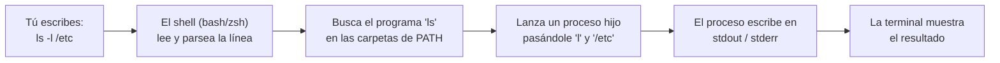
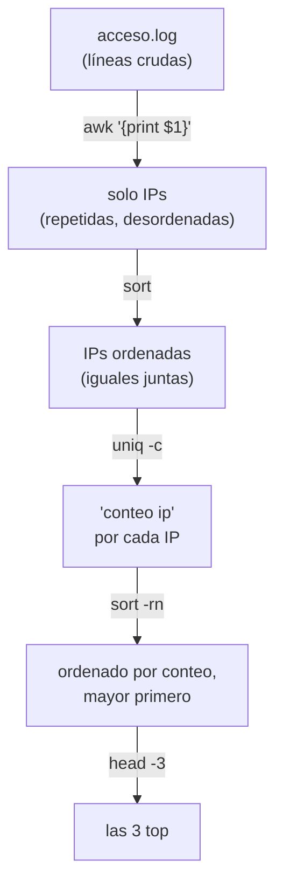
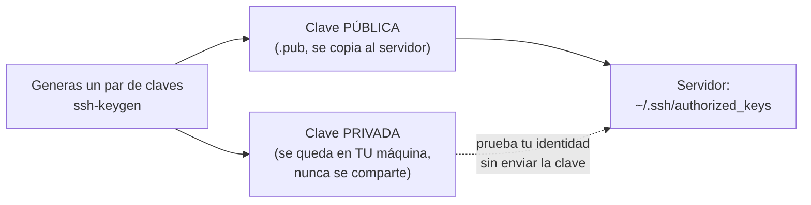

import Reto from "@components/Reto.astro";
import Solucion from "@components/Solucion.astro";
import Quiz from "@components/Quiz.astro";
import CheckDominio from "@components/CheckDominio.astro";
import Nivel from "@components/Nivel.astro";

<Nivel nivel="intermedio" />

## Objetivos de esta sub-unidad

Al terminar vas a poder, **sin notas**:

1. **Navegar y operar** un sistema tipo Unix desde la terminal: moverte por el filesystem, leer y cambiar permisos, e inspeccionar procesos.
2. **Componer** flujos de datos con pipes y redirecciones usando `grep`, `sed`, `awk`, `find`, `curl` y `jq`, y **predecir su salida** antes de ejecutarlos.
3. **Escribir un script bash** robusto (argumentos, variables de entorno, códigos de salida, manejo de errores) que automatice una tarea repetitiva, y **conectarte por SSH** a un servidor de forma segura.

:::tip[Si ya tocaste la terminal antes]
Tienes un homelab, usas `ssh` para entrar a un servidor o ya copiaste comandos de Stack Overflow. Perfecto: úsalo como **atajo de validación**, no como excusa para saltar. Salta directo a la sección [Práctica con andamiaje](#práctica-construye-el-pipeline-andamiaje-que-se-desvanece) e intenta el [primer reto](#retos-primero-sin-ia) sin mirar. Si lo resuelves en menos de 10 minutos sin Google ni IA, ya dominas la base y puedes ir a los retos 2 y 3. Si te trabas, esta lección te llena los huecos que el copiar-pegar nunca te enseñó.
:::

## Por qué importa (el dinero y la autonomía)

> 💰 La terminal es el **idioma común** de la ingeniería de software. No es un tema "de Linux": es donde corres tests, despliegas, depuras un servidor a las 3 AM, encadenas herramientas de IA y automatizas lo que harías a mano cien veces.

Tres razones concretas, sin adornos:

- **En una entrevista técnica te van a pedir que muevas datos.** "Cuéntame cuántas peticiones fallaron en este log" no se responde abriendo Excel. Se responde con un pipeline de tres comandos en cinco segundos. Quien sabe hacerlo se ve senior; quien no, se ve perdido.
- **La automatización empieza aquí.** Antes de orquestar agentes de IA o pipelines de datos (Fases 6 y 7), automatizas lo aburrido con un script de 15 líneas. El 80% del valor de un "Automation Engineer" arranca en un `for` de bash bien puesto.
- **Es el cimiento de todo lo que viene.** Git, Docker, SSH a un VPS, CI/CD, levantar un servidor de modelos — todo vive en la terminal. Si la terminal te da miedo, cada fase siguiente te va a costar el doble.

Y lo más importante para este curso: la terminal es **honesta**. No hay botón mágico ni autocompletado que piense por ti. Es justo el músculo del [Primero-Sin-IA](../0-1-mentalidad-y-metodo/) que vinimos a reconstruir.

## Antes de empezar: lo que ya deberías traer

Esta sub-unidad se apoya en lo anterior. Recupéralo de memoria **antes** de seguir (active recall, no relectura pasiva):

- De [0.4 — Cómo funciona la web y un computador](../0-4-web-y-computador/): ¿qué es un **proceso**? ¿Qué es un **puerto**? ¿Qué diferencia hay entre un programa en disco y un programa corriendo en memoria?
- De [0.3 — Notional machine y trazado a mano](../0-3-notional-machine-trazado/): la disciplina de **predecir la salida antes de ejecutar**. La vas a aplicar a pipelines de shell, no solo a bucles.
- De [0.2 — Pensamiento computacional](../0-2-pensamiento-computacional/): **descomposición**. Un pipeline es descomposición pura: un problema grande partido en pasos pequeños, cada uno una herramienta.

Si alguna de esas preguntas te dejó en blanco, vuelve un momento. La terminal va a tener mucho más sentido si sabes que "ejecutar un comando" es "el shell lanza un proceso hijo".

### El modelo mental: shell, comando, proceso

Cuando escribes un comando y presionas Enter, pasa esto:



Tres ideas que sostienen **todo** lo demás:

- **El shell es un programa** (`bash`, `zsh`, `sh`). Su trabajo es leer tu línea, encontrar el programa que pediste, lanzarlo como **proceso**, y conectarlo a tres "cables" de datos.
- **Cada proceso nace con tres cables (streams):** `stdin` (entrada, descriptor 0), `stdout` (salida normal, descriptor 1) y `stderr` (errores, descriptor 2). Por defecto `stdin` es tu teclado y `stdout`/`stderr` son la pantalla. **Redirigir y encadenar es solo reconectar esos cables.**
- **El shell encuentra los programas mirando `PATH`**, una variable de entorno con una lista de carpetas. Cuando "no se encuentra el comando", casi siempre es `PATH`, no magia.

Graba esto: **pipes y redirecciones no son sintaxis rara que memorizas. Son reconexiones de tres cables.** Si entiendes los cables, el resto se deduce.

## Ejemplo resuelto: razonando un pipeline en voz alta

Vamos a resolver un problema real pensando en voz alta, como lo haría alguien con experiencia. **No memorices el comando final; sigue el razonamiento.**

**Problema:** tengo un archivo `acceso.log` (un log de servidor web). Quiero saber **las 3 direcciones IP que más peticiones hicieron**. Cada línea empieza con la IP:

```text
192.168.1.10 - - [25/Jun/2026:10:00:01 -0400] "GET /index.html" 200 1043
10.0.0.5 - - [25/Jun/2026:10:00:03 -0400] "GET /admin" 404 512
192.168.1.10 - - [25/Jun/2026:10:00:05 -0400] "GET /style.css" 200 210
...miles de líneas...
```

**Pienso en voz alta (descomposición — Fase 0.2):**

> "No conozco un comando que diga 'top 3 IPs'. Pero sí puedo partir el problema en pasos pequeños y conectar una herramienta por paso. ¿Qué pasos?
>
> 1. **Quedarme solo con la IP** de cada línea (la primera columna). Eso es `awk '{print $1}'` — `awk` parte cada línea en columnas (`$1`, `$2`, …) y aquí imprimo la primera.
> 2. Ahora tengo una IP por línea, repetidas. Quiero **contar repetidas**. La herramienta para contar repetidas es `uniq -c`… pero `uniq` solo colapsa **líneas adyacentes** iguales. Entonces primero tengo que **ordenar** para que las iguales queden juntas: `sort`.
> 3. `uniq -c` me da `<conteo> <ip>`. Quiero las más frecuentes **arriba**, así que **ordeno por número, descendente**: `sort -rn` (`-n` numérico, `-r` reverso).
> 4. **Me quedo con las 3 primeras**: `head -3`.
>
> Cada paso recibe la salida del anterior por su `stdin` y entrega por su `stdout`. El pegamento es el pipe `|`."

El pipeline completo:

```bash
awk '{print $1}' acceso.log | sort | uniq -c | sort -rn | head -3
```

**Verifico el flujo de datos paso a paso** (trazado a mano del pipeline — el mismo músculo de la notional machine, aplicado al shell):



Resultado:

```text
   42 192.168.1.10
   17 10.0.0.5
    9 203.0.113.7
```

La lección no es "memoriza `awk … | sort | uniq -c | sort -rn | head`". La lección es el **método**: descompongo, asigno una herramienta por paso, conecto con `|`, y **predigo qué sale de cada etapa** antes de correr el todo. Ese método resuelve mil problemas, no uno.

### Las herramientas del pipeline, en una tabla

| Herramienta | Para qué sirve (una línea) | Ejemplo mínimo |
|---|---|---|
| `grep` | Filtrar líneas que **coinciden** con un patrón | `grep "404" acceso.log` |
| `sed` | **Sustituir / editar** texto línea a línea | `sed 's/foo/bar/g' archivo` |
| `awk` | Procesar **columnas** y calcular | `awk '{print $1, $9}'` |
| `sort` | **Ordenar** líneas | `sort -rn` |
| `uniq` | Colapsar/**contar** líneas adyacentes iguales | `uniq -c` |
| `wc` | **Contar** líneas/palabras/bytes | `wc -l` |
| `cut` | Cortar **campos** por delimitador | `cut -d: -f1 /etc/passwd` |
| `find` | **Buscar archivos** por nombre/tipo/fecha | `find . -name "*.py"` |
| `curl` | Hacer **peticiones HTTP** (traer datos) | `curl https://api.ejemplo.com` |
| `jq` | Filtrar/transformar **JSON** | `jq '.[].nombre'` |

No las memorices de golpe. Memoriza **qué problema resuelve cada una** (la columna del medio). El "cómo exacto" lo da `man <comando>` o `<comando> --help` — y leerlos **en inglés** es parte del oficio (hilo de inglés técnico: las páginas `man` no están traducidas, y eso está bien).

### Redirecciones: reconectar los cables

Pipe (`|`) conecta el `stdout` de un proceso al `stdin` del siguiente. Las **redirecciones** conectan un cable a un **archivo**:

```bash
comando > salida.txt      # stdout SOBREESCRIBE salida.txt
comando >> salida.txt     # stdout SE AÑADE al final de salida.txt
comando 2> errores.txt    # stderr (cable 2) a un archivo
comando > todo.txt 2>&1   # stdout a un archivo, y stderr al MISMO sitio que stdout
comando < entrada.txt     # stdin viene de un archivo en vez del teclado
```

`2>&1` se lee literal: "manda el cable 2 (`stderr`) a donde apunta ahora el cable 1 (`stdout`)". Por eso el **orden importa** y `2>&1` va **después** de redirigir `stdout`.

### Permisos: quién puede leer, escribir y ejecutar

`ls -l` muestra algo como `-rwxr-xr--`. Se lee en bloques de tres:

```text
-  rwx  r-x  r--
│   │    │    └── otros (resto del mundo): solo leer
│   │    └─────── grupo: leer y ejecutar
│   └──────────── dueño: leer, escribir, ejecutar
└──────────────── tipo: '-' archivo, 'd' directorio, 'l' enlace
```

Cada `rwx` es un número en binario: `r=4`, `w=2`, `x=1`. Sumas por bloque:

- `rwx` = 4+2+1 = **7**
- `r-x` = 4+0+1 = **5**
- `r--` = 4+0+0 = **4**

Por eso `chmod 754 archivo` significa `rwxr-xr--`. Y `chmod 600 clave` (`rw-------`) es lo que **exige** SSH para tu clave privada: solo el dueño puede leerla, nadie más. Para hacer ejecutable un script: `chmod +x script.sh`.

## Errores y malentendidos frecuentes

:::caution[Misconception 1: "uniq elimina todos los duplicados"]
**Podrías pensar** que `uniq` quita cualquier línea repetida del archivo. **Está mal:** `uniq` solo colapsa duplicados **adyacentes**. Si las líneas iguales están separadas, no las toca. Por eso casi siempre va precedido de `sort`. Si ves `uniq` "no funcionando", el 99% de las veces falta el `sort` antes.
:::

:::caution[Misconception 2: "comillas, ¿para qué? si funciona igual"]
**Podrías pensar** que `rm $archivo` y `rm "$archivo"` son lo mismo. **Está mal y es peligroso.** Si `archivo="mis notas.txt"`, sin comillas el shell parte por el espacio y ejecuta `rm mis notas.txt` → intenta borrar **dos** archivos (`mis` y `notas.txt`). Esto es *word splitting*. **Regla de oro: encierra SIEMPRE las variables en comillas dobles** (`"$var"`). No es estética: es seguridad. (Hilo de seguridad — el mismo descuido es la raíz de inyecciones de comandos.)
:::

:::caution[Misconception 3: "`curl URL | bash` es una forma normal de instalar"]
Lo vas a ver en READMEs: `curl https://sitio/install.sh | bash`. **Esto ejecuta código de internet sin que lo leas.** Si el sitio (o la red) está comprometido, le diste tu máquina. Lo correcto: `curl -fsSL https://sitio/install.sh -o install.sh`, **lee** el archivo, y solo entonces `bash install.sh`. La conveniencia no vale tu equipo.
:::

:::caution[Misconception 4: "stdout y stderr son lo mismo"]
**Podrías pensar** que todo lo que aparece en pantalla es "la salida". **Está mal.** Los errores van por `stderr` (cable 2), separado a propósito: así puedes redirigir la salida buena a un archivo (`> resultado.txt`) y **seguir viendo los errores** en pantalla. Un script bien hecho manda mensajes de error y diagnóstico a `stderr` (`echo "..." >&2`) y deja `stdout` limpio para el dato útil. Esto es **observabilidad** desde el día uno.
:::

:::caution[Misconception 5: "el script falló a la mitad pero igual siguió"]
Por defecto, bash **ignora** errores y sigue ejecutando la siguiente línea, y una variable no definida vale "vacío" en silencio. Un respaldo que "funcionó" pero archivó una carpeta vacía es peor que uno que falla ruidoso. La cura es empezar todo script con `set -euo pipefail` (lo vemos abajo). Sin esto, tus automatizaciones mienten.
:::

## Variables de entorno

Una **variable de entorno** es un par `NOMBRE=valor` que el shell y los procesos hijos pueden leer. Sirven para **configurar sin tocar el código**: rutas, modos, y —con cuidado— credenciales.

```bash
echo "$HOME"          # tu carpeta personal, ej. /home/pelu
echo "$PATH"          # carpetas donde el shell busca comandos
nombre="Alvaro"       # variable de shell (solo este shell)
export API_URL="https://api.ejemplo.com"   # exportada: la heredan los procesos hijos
```

La diferencia clave: `nombre="..."` vive solo en tu shell; `export NOMBRE="..."` lo **hereda** cualquier programa que lances después. Por eso las apps leen su config con `export DATABASE_URL=...` antes de arrancar.

- **Persistencia:** lo que pongas en `~/.bashrc` o `~/.zshrc` se aplica cada vez que abres una terminal. Ahí van tus `export` y alias permanentes.
- **Secretos:** las API keys **nunca** se escriben en el código ni se suben a Git. Van en variables de entorno (o un archivo `.env` que `.gitignore` excluye). Lo formalizamos en Fase 3, pero el hábito empieza aquí: **un secreto en `git log` es un secreto filtrado para siempre.**

## SSH: tu llave para entrar a otra máquina

`ssh` (Secure SHell) te da una terminal **en otro computador** por un canal cifrado. Es como te conectas a un VPS, a tu homelab o al servidor donde corre tu API.

```bash
ssh usuario@servidor.com          # entrar (pide contraseña la primera vez)
ssh -p 2222 usuario@servidor.com  # si el SSH escucha en otro puerto
```

Pero las contraseñas son frágiles. El estándar profesional son **claves SSH**: un par criptográfico de dos archivos.



**Razonamiento en voz alta de un setup típico:**

> "1. Genero el par: `ssh-keygen -t ed25519 -C "mi-correo"`. Crea `~/.ssh/id_ed25519` (privada) y `~/.ssh/id_ed25519.pub` (pública).
> 2. La **privada** se queda conmigo y **jamás** sale de mi máquina. Si la filtro, cualquiera entra como yo.
> 3. La **pública** la copio al servidor: `ssh-copy-id usuario@servidor`. Eso la agrega a `~/.ssh/authorized_keys` allá.
> 4. Desde ahora, `ssh usuario@servidor` entra sin contraseña: el servidor me reta y mi clave privada **prueba** que soy yo sin transmitirse.
> 5. SSH exige que la privada tenga permisos `600` (`chmod 600 ~/.ssh/id_ed25519`). Si están abiertos, **se niega a usarla** — y aquí cierra el círculo con la sección de permisos."

Atajo de productividad: un archivo `~/.ssh/config` te deja escribir alias.

```text
Host miservidor
    HostName servidor.com
    User pelu
    Port 22
    IdentityFile ~/.ssh/id_ed25519
```

Con eso, `ssh miservidor` basta. (Hilo de seguridad: clave por máquina, permisos `600`, nunca la privada en un repo.)

## Scripting bash: automatizar lo repetitivo

Un script es un archivo de texto con comandos que el shell ejecuta de arriba a abajo. La diferencia entre "pegué tres comandos" y "escribí un script" es **robustez**: argumentos, validación y manejo de errores.

El esqueleto que todo script tuyo debería tener:

```bash
#!/usr/bin/env bash
# ↑ "shebang": qué intérprete usar. Hace el archivo ejecutable como programa.
set -euo pipefail
# -e: aborta si un comando falla.   -u: error si usas una variable no definida.
# -o pipefail: un pipe falla si CUALQUIER etapa falla (no solo la última).

origen="${1:-}"                     # primer argumento; "" si no lo pasaron
if [[ -z "$origen" ]]; then         # -z = "está vacío"
  echo "Uso: $0 <directorio>" >&2   # mensaje de ayuda a stderr
  exit 1                            # código de salida != 0 = "hubo error"
fi
```

Piezas clave (cada una conecta con un hilo del curso):

- **`#!/usr/bin/env bash`** — el *shebang* dice qué programa interpreta el archivo.
- **`set -euo pipefail`** — convierte fallos silenciosos en fallos ruidosos (observabilidad).
- **`$1`, `$2`, … `$@`** — los argumentos que recibió el script. `$0` es el nombre del propio script.
- **`exit 0` vs `exit 1`** — el **código de salida**. `0` = éxito; cualquier otro = error. Es como otros programas (y CI/CD) saben si tu script funcionó. `$?` guarda el código del último comando.
- **`if [[ ... ]]`, `for x in ...; do ... done`** — control de flujo, igual que en cualquier lenguaje (Fase 0.7), con sintaxis propia.

Un script real, comentado:

```bash
#!/usr/bin/env bash
set -euo pipefail

# Renombra a minúsculas todos los .TXT de la carpeta actual.
for archivo in *.TXT; do
  [[ -e "$archivo" ]] || continue          # si no hay ninguno, no truenes
  nuevo="${archivo%.TXT}.txt"              # quita .TXT, agrega .txt
  mv -- "$archivo" "$nuevo"
  echo "Renombrado: $archivo -> $nuevo" >&2 # diagnóstico a stderr
done
```

El **shebang + `set -euo pipefail` + validar argumentos + `stderr` para diagnóstico + códigos de salida** es la diferencia entre un script de juguete y uno que pondrías en producción. Lo vas a usar en cada automatización del curso.

## Práctica: construye el pipeline (andamiaje que se desvanece)

Aquí el andamiaje baja poco a poco: primero **predices**, luego **reordenas**, al final **construyes solo**. Hazlo en una terminal real.

### Paso 1 — PRIMM: Predecir antes de ejecutar

Tienes este archivo `notas.txt`:

```text
manzana
pera
manzana
kiwi
pera
manzana
```

**Predice (escríbelo en papel ANTES de correr nada):** ¿qué imprime cada comando?

```bash
sort notas.txt | uniq -c
sort notas.txt | uniq -c | sort -rn | head -1
```

<Solucion title="Verifica tu predicción (ábrelo solo después de predecir)">

El primero ordena y cuenta repetidas adyacentes:

```text
      1 kiwi
      3 manzana
      2 pera
```

El segundo además ordena por conteo descendente y toma la primera línea:

```text
      3 manzana
```

Si predijiste que `uniq -c` daba el conteo **sin** ordenar primero, repasa la *Misconception 1*: `uniq` solo colapsa líneas adyacentes.

</Solucion>

### Paso 2 — Parsons: reordena el pipeline

Quieres **las 5 palabras más frecuentes** de un archivo `texto.txt`, una por línea con su conteo. Tienes las piezas **desordenadas**. Ponlas en el orden correcto (mentalmente o en papel):

```text
A)  | sort
B)  | head -5
C)  tr ' ' '\n' < texto.txt
D)  | uniq -c
E)  | sort -rn
```

(`tr ' ' '\n'` reemplaza cada espacio por un salto de línea: parte el texto en una palabra por línea.)

<Solucion title="Ver el orden correcto y por qué">

Orden: **C → A → D → E → B**

```bash
tr ' ' '\n' < texto.txt | sort | uniq -c | sort -rn | head -5
```

Razonamiento: primero una palabra por línea (C), ordenar para juntar iguales (A), contar (D), ordenar por conteo descendente (E), tomar las 5 primeras (B). Si pusiste `uniq -c` (D) antes de `sort` (A), recuerda que `uniq` necesita las iguales **adyacentes**.

</Solucion>

### Paso 3 — Modifica

Toma el pipeline del Paso 2 y **cámbialo** para que ignore mayúsculas/minúsculas (que `Pera` y `pera` cuenten como la misma palabra). Pista: existe un comando que pasa todo a minúsculas, o `tr '[:upper:]' '[:lower:]'`. ¿Dónde lo insertas en la cadena? Pruébalo.

## Retos Primero-Sin-IA

Estos son **entregables**. Resuélvelos **a mano, sin IA**, dentro del timebox. Cuando termines, pídele a una IA que te **corrija** usando la carpeta `.ai/` (no que te lo resuelva). Cada reto tiene su carpeta en `ejercicios/fase-0/<slug>/`.

<Reto title="Top 3 de IPs en un log" timebox="35 min">

Carpeta: `ejercicios/fase-0/pipeline-conteo-logs/`

Escribe un script `resolver.sh` que reciba la ruta de un log por argumento (`$1`) e imprima **las 3 IPs con más peticiones**, una por línea, en formato `CONTEO IP`, de mayor a menor.

**Hecho significa:**
- `bash resolver.sh acceso.log` imprime exactamente las 3 líneas esperadas (lo verifican los tests).
- Sin argumento, el script termina con código de salida distinto de 0 (no se cuelga ni revienta feo).
- Puedes **explicar en voz alta** qué hace cada etapa del pipeline.

<Solucion title="Pista (no la solución)">
Es exactamente el ejemplo resuelto de esta lección: aísla la primera columna, ordena, cuenta, ordena por conteo, corta. Lo único nuevo es envolverlo en un script que lea `$1` y valide que venga. Repasa el esqueleto de `set -euo pipefail` y `${1:?...}`.
</Solucion>

</Reto>

<Reto title="Script de respaldo robusto" timebox="40 min">

Carpeta: `ejercicios/fase-0/backup-con-bash/`

Escribe `backup.sh <directorio>` que cree un `.tar.gz` con el contenido del directorio, nombrado con timestamp (ej. `respaldo-20260625-103000.tar.gz`), dentro de la carpeta que indique la variable de entorno `BACKUP_DIR` (por defecto, la carpeta actual).

**Hecho significa:**
- Empieza con `#!/usr/bin/env bash` y `set -euo pipefail`.
- Sin argumento → mensaje de uso a `stderr` y `exit 1`. Directorio inexistente → error a `stderr` y `exit 1`.
- En éxito, crea el archivo y escribe **solo su ruta** en `stdout` (los diagnósticos van a `stderr`).
- Respeta `BACKUP_DIR` si está definida.

<Solucion title="Pista (no la solución)">
La forma de archivar el **contenido** (no la ruta absoluta) es `tar -czf "$destino" -C "$origen" .`. El timestamp sale de `date +%Y%m%d-%H%M%S`. Recuerda mandar lo informativo a `stderr` con `>&2` para que `stdout` quede limpio con la ruta.
</Solucion>

</Reto>

<Reto title="Consulta JSON con jq" timebox="30 min">

Carpeta: `ejercicios/fase-0/json-con-jq/`

Escribe `consulta.sh <archivo.json>` que, sobre una lista de usuarios en JSON, imprima los **nombres de los usuarios activos con más de 5 logins**, ordenados alfabéticamente, uno por línea.

**Hecho significa:**
- Usa `jq` (instálalo si no lo tienes: `brew install jq` o `apt install jq`).
- La salida son nombres en crudo (sin comillas JSON): pista, `jq -r`.
- Filtra por dos condiciones a la vez y ordena por nombre.

<Solucion title="Pista (no la solución)">
`jq` tiene `select(condición)` para filtrar, `and` para combinar condiciones, `sort_by(.campo)` para ordenar y `.[].campo` para extraer un campo de cada elemento. En el mundo real, el JSON vendría de `curl https://api/... | ./consulta.sh /dev/stdin`; aquí trabajas sobre un archivo fijo para que sea reproducible.
</Solucion>

</Reto>

## Check de dominio

Sin mirar la lección, responde en voz alta o por escrito:

<CheckDominio
  items={[
    "Explicar qué son stdin, stdout y stderr, y por qué stderr está separado",
    "Decir qué hace `2>&1` y por qué el orden importa",
    "Explicar por qué `uniq` casi siempre va precedido de `sort`",
    "Traducir `chmod 640 archivo` a rwx y decir quién puede hacer qué",
    "Explicar la diferencia entre una variable de shell y una exportada (export)",
    "Decir qué archivo SSH se comparte y cuál NUNCA, y qué permisos exige la clave privada",
    "Explicar qué hace `set -euo pipefail` y por qué un script serio lo lleva",
  ]}
/>

Y un par de preguntas rápidas:

<Quiz
  question="¿Por qué `cat archivo | grep error` casi siempre se puede escribir mejor como `grep error archivo`?"
  options={[
    "Porque cat no existe en todos los sistemas",
    "Porque grep ya sabe leer archivos directamente; el cat sobra (un proceso de más)",
    "Porque el pipe es más lento que una coma",
  ]}
  answer={1}
  explanation="grep (y la mayoría de estas herramientas) acepta el archivo como argumento. El `cat | ...` extra es el clásico 'uso inútil de cat': lanza un proceso de más sin ganar nada. Funciona, pero delata a un principiante."
/>

<Quiz
  question="Un script tiene `set -e` y una línea `grep patron archivo.txt` que no encuentra nada. ¿Qué pasa?"
  options={[
    "Nada, sigue a la siguiente línea",
    "El script ABORTA, porque grep devuelve código de salida 1 cuando no hay coincidencias",
    "Imprime un error pero continúa",
  ]}
  answer={1}
  explanation="grep devuelve exit code 1 cuando no encuentra coincidencias (no es un 'error', es 'no encontré'). Con `set -e` eso aborta el script. Es un caso clásico: si 'no encontrar' es válido, maneja el código (ej. `grep patron archivo || true`)."
/>

## Recursos (documentación oficial primero)

- **`man <comando>`** y **`<comando> --help`** — la fuente primaria, ya instalada en tu máquina. Empieza siempre aquí.
- [GNU Coreutils manual](https://www.gnu.org/software/coreutils/manual/) — `sort`, `uniq`, `cut`, `wc`, `head` y compañía, oficial.
- [GNU Bash Reference Manual](https://www.gnu.org/software/bash/manual/) — el manual del shell (parámetros, `set`, control de flujo).
- [GNU grep](https://www.gnu.org/software/grep/manual/) · [GNU sed](https://www.gnu.org/software/sed/manual/) · [The GNU Awk User's Guide](https://www.gnu.org/software/gawk/manual/) — las tres bestias de texto.
- [jq manual](https://jqlang.github.io/jq/manual/) — referencia oficial de `jq` (filtros, `select`, `sort_by`).
- [curl docs](https://curl.se/docs/) — y el libro gratis *Everything curl*.
- [OpenSSH manual (`man ssh`, `man ssh_config`)](https://www.openssh.com/manual.html) — SSH y el archivo de config.
- [ShellCheck](https://www.shellcheck.net/) — linter de bash: pega tu script y te marca los errores que `set -euo pipefail` no atrapa. Úsalo siempre.

## Conexión con el capstone de la fase

El **Capstone de Fase 0 — *CLI sin IA*** (ver el [índice de la Fase 0](../)) es una herramienta de línea de comandos escrita 100% sin asistencia de IA. Esta sub-unidad es su terreno:

- Tu CLI **vive en la terminal**: lee argumentos (`$1`, `$@`), escribe a `stdout`, manda errores a `stderr` y devuelve códigos de salida — exactamente lo que practicaste aquí.
- Lo **automatizas y pruebas** con scripts bash: un `run.sh`, un `test.sh`.
- Empieza con una **mini-spec** (entradas/salidas/casos borde — Fase 0.8) y cada cambio entra con un **Conventional Commit** (Fase 0.6). El hábito de "stdout limpio, stderr para diagnóstico, exit codes honestos" es lo que hace que tu CLI sea **componible** con pipes, como las herramientas de esta lección.

Dicho de otro modo: aquí aprendiste a **usar** herramientas de terminal; en el capstone aprendes a **construir una** que se comporte como ellas.

## Reflexión y repaso espaciado

Antes de cerrar, escribe (en tu `RETROSPECTIVA.md` o donde lleves notas):

- ¿Qué parte te costó más: los pipes, los permisos, el scripting o SSH? Esa es tu señal de qué reforzar.
- Un comando que copiabas sin entender y que **ahora** sí puedes explicar pieza por pieza.

**Gancho de repaso espaciado:**

- **Mañana:** reescribe de memoria, sin mirar, el pipeline de "top 3 IPs" y el esqueleto de un script con `set -euo pipefail`. Si no te sale, no lo aprendiste todavía — vuelve al ejemplo resuelto.
- **En 3 días:** sin notas, traduce `chmod 750` y `chmod 644` a `rwx`, y explica qué permisos exige una clave SSH privada y por qué.
- **En 1 semana:** automatiza una tarea **real** y repetitiva de tu vida (renombrar fotos, respaldar una carpeta, contar algo en un archivo) con un script bash propio. Si lo usas de verdad, se queda para siempre.

> "La terminal no perdona, pero tampoco miente. Aprende a leerla y nunca más vas a necesitar que un botón piense por ti."
