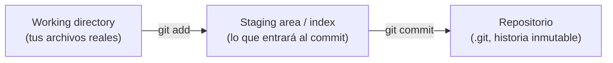
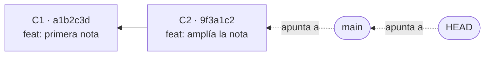
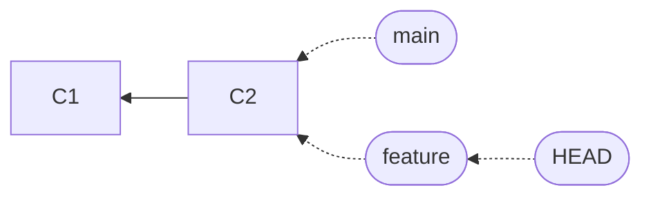
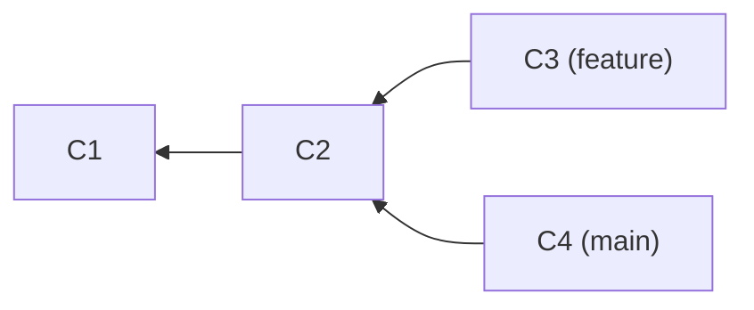
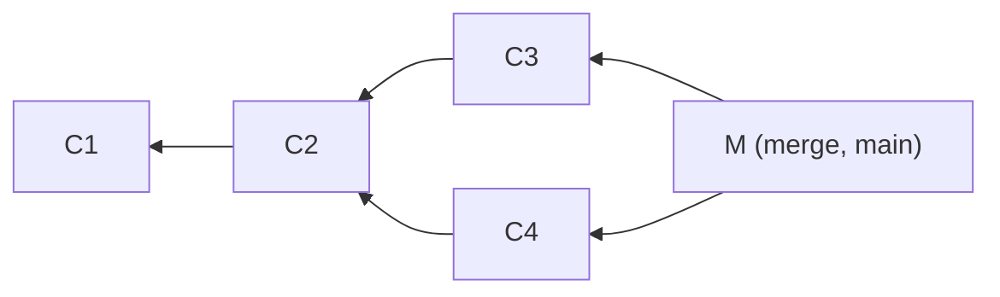
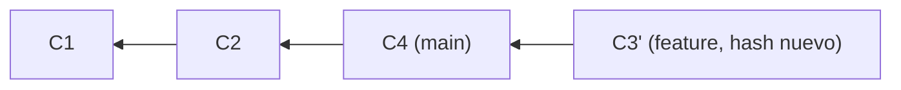
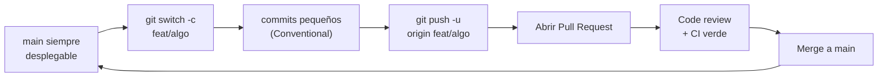

import Nivel from "@components/Nivel.astro";
import Reto from "@components/Reto.astro";
import Solucion from "@components/Solucion.astro";
import Quiz from "@components/Quiz.astro";
import CheckDominio from "@components/CheckDominio.astro";

<Nivel nivel="básico" />

Git es el sistema que recuerda **cada versión** de tu trabajo. No es un botón de "guardar en la nube": es una pequeña base de datos versionada que vive dentro de tu proyecto. Esta lección te enseña a **verla por dentro** —no a memorizar comandos— para que dejes de tenerle miedo a `rebase`, a los conflictos y al historial.

## Objetivos

Al terminar vas a poder, sin notas:

- **O1 — Explicar** el modelo mental de Git (un commit es un *snapshot* inmutable; el historial es un grafo de *parents*; `HEAD` y las ramas son punteros) y **predecir** a qué apunta cada referencia tras una secuencia de comandos.
- **O2 — Decidir y justificar** el trade-off entre `merge` y `rebase`, y **resolver** un conflicto de fusión a mano.
- **O3 — Implementar** el flujo *GitHub Flow* con **Conventional Commits** validados por un hook `commit-msg` desde el primer commit.

:::tip[Si ya usabas Git]
Si ya haces `add` / `commit` / `push` a diario, no te saltes la lección: la mayoría de la gente usa Git **sin un modelo mental** y se rompe en el primer conflicto o `rebase`. Usa la parte 4 (el modelo) y el [Reto 1](#ejercicios-primero-sin-ia) como **validación rápida**: si puedes dibujar el grafo de commits y decir a qué apunta `HEAD` sin ejecutar nada, valida y avanza más rápido por el resto.
:::

## Por qué importa

> 💰 **Relevancia de mercado.** Git no aparece como "skill deseable" en las ofertas: se **asume**, como saber escribir. Pero en una entrevista técnica te miran *cómo* lo usas: un historial limpio con [Conventional Commits](https://www.conventionalcommits.org/en/v1.0.0/), Pull Requests revisables y la capacidad de explicar qué hace un `rebase` te marca como semi-senior. Lo contrario —commits llamados `"cambios"`, miedo a tocar ramas, `git push --force` a ciegas— te marca como junior. Es uno de los hábitos transversales que esta carrera teje **desde el commit #1**, no "una fase después".

Además, todo lo que construyas de aquí en adelante (tests, CI/CD, code review, los capstones) **vive sobre Git**. Si el cimiento es sólido, el resto se apoya tranquilo.

## Lo que ya traes (activación)

Esta lección se apoya en lo anterior. Recupéralo de memoria antes de seguir:

- De [Terminal y Linux](../0-5-terminal-y-linux/): navegar carpetas, `ls -a` para ver archivos ocultos, redirección (`>`, `>>`), permisos de ejecución (`chmod +x`) y variables de entorno. Git **es** una herramienta de terminal; aquí la usas a fondo.
- De [Notional machine y trazado a mano](../0-3-notional-machine-trazado/): predecir el estado de un programa paso a paso, sin ejecutar. Aquí harás lo mismo, pero el "estado" es **a qué apunta cada referencia** de Git.

:::note[Antes de seguir, responde en voz alta]
¿Qué hace `mkdir demo && cd demo`? ¿Y `cat archivo`? Si dudas, vuelve un momento a 0.5. Lo usarás en el worked example de abajo.
:::

## Ejemplo resuelto: mirar Git por dentro (think-aloud)

Voy a construir un repo minúsculo y **razonar en voz alta** qué pasa en la base de datos de Git en cada paso. Sigue el hilo; no copies todavía.

### Paso 1 — crear el repo

```bash
mkdir demo && cd demo
git init
```

*Pienso:* `git init` crea una carpeta oculta `.git/`. **Ahí vive todo**: la historia, las ramas, la configuración. Si borro `.git/`, vuelvo a tener una carpeta normal sin historia. Aún no hay ningún commit.

### Paso 2 — el primer commit

```bash
echo "hola" > nota.txt
git add nota.txt
git commit -m "feat: primera nota"
```

*Pienso:* hay **tres zonas** y el archivo viaja entre ellas:



- El **working directory** es la carpeta con tus archivos tal como los editas.
- El **staging area** (o *index*) es una "lista de empaque": lo que elegiste incluir en el próximo commit. `git add` mueve cosas aquí.
- El **repositorio** es la historia ya grabada. `git commit` toma lo que está en staging y lo congela en un commit.

Un **commit** no guarda "lo que cambió" (un diff). Guarda una **foto completa** del proyecto en ese instante (un *snapshot*) más metadata: autor, fecha, mensaje y —clave— el **hash del commit padre**. El "diff" que ves en `git show` lo **calcula Git al vuelo** comparando dos snapshots. Esta distinción es la que confunde a casi todo el mundo.

Cada commit se identifica por un **hash SHA** (40 caracteres, ej. `a1b2c3…`). El hash sale del *contenido*: si cambia algo —un byte, el padre, el mensaje— el hash cambia. Por eso el historial es **inmutable**: no editas un commit, creas uno nuevo con otro hash.

### Paso 3 — un segundo commit y mirar la cadena

```bash
echo "segunda línea" >> nota.txt
git commit -am "feat: amplía la nota"
git log --oneline
```

```text
9f3a1c2 (HEAD -> main) feat: amplía la nota
a1b2c3d feat: primera nota
```

*Pienso:* tengo dos commits encadenados. El nuevo (`C2`) apunta a su padre (`C1`):



Tres conceptos en ese diagrama:

| Concepto | Qué es | Cómo lo veo |
|---|---|---|
| **Commit** | nodo inmutable: snapshot + padre + metadata | `git log`, `git show` |
| **Rama (`main`)** | un puntero **móvil** a un commit. Literalmente un archivo de texto con un hash | `cat .git/refs/heads/main` |
| **`HEAD`** | "dónde estoy parado". Normalmente apunta a una rama, no a un commit | `cat .git/HEAD` → `ref: refs/heads/main` |

*Compruebo que no miento:*

```bash
cat .git/HEAD
# ref: refs/heads/main
cat .git/refs/heads/main
# 9f3a1c2...   ← el hash de C2
```

`HEAD` → `main` → `C2`. Una rama **no contiene** los commits: es solo un post-it pegado en uno. Cuando hago `git commit`, Git crea el commit nuevo y **mueve el post-it `main`** al commit nuevo. Esa es toda la magia.

### Paso 4 — una rama es barata

```bash
git switch -c feature
```

*Pienso:* esto crea **otro post-it** llamado `feature` pegado en el mismo `C2`, y mueve `HEAD` a apuntar a `feature`. No copió archivos ni historia. Por eso en Git ramificar es instantáneo y gratis:



Si ahora hago `git commit`, **solo se mueve `feature`** (porque `HEAD` apunta a `feature`); `main` se queda donde está. Acabo de "divergir" una rama. Todo lo demás —merge, rebase, conflictos, Pull Requests— son maneras de **reunir** post-its que divergieron.

:::tip[El modelo en tres ideas]
Tres ideas y entendiste el 80% de Git: **(1)** un commit es una foto inmutable que apunta a su padre; **(2)** una rama es un puntero móvil a un commit; **(3)** `HEAD` dice en qué rama estás parado. Memoriza eso y los comandos dejan de dar miedo.
:::

## Lo que NO es (misconceptions)

:::caution[Errores de modelo mental que vas a tener que desaprender]

- **"Un commit guarda los cambios / el diff."** No. Guarda un **snapshot completo** del proyecto. El diff es un cálculo que Git hace cuando se lo pides. Creerlo te confunde al resolver conflictos.
- **"Una rama es una copia de los archivos / una carpeta."** No. Es **un puntero a un commit** (un archivo con un hash dentro de `.git/refs/heads/`). Cambiar de rama no copia nada, solo mueve `HEAD` y actualiza tu working directory.
- **"`git add` guarda mi trabajo."** No. `git add` solo pone cosas en el **staging area**. Lo que **graba** es `commit`. Si editas un archivo *después* de `git add` y luego haces `commit`, se graba la versión que estaba en staging, no la última edición.
- **"`HEAD` es la última versión / el `main`."** No. `HEAD` es **dónde estás tú ahora**. Si te paras en un commit antiguo, `HEAD` apunta ahí (*detached HEAD*) y `main` sigue intacto en otro lado.
- **"Si hago `rebase` pierdo trabajo."** No (si lo entiendes). `rebase` **reescribe** commits creando copias con otro hash; el contenido se conserva. El peligro real es otro y muy concreto: reescribir commits que **ya compartiste** con otros (ver más abajo).
:::

## merge vs rebase: el trade-off que todos preguntan

Partimos de una rama `feature` que divergió de `main`, y mientras tanto `main` avanzó:



Quiero juntar el trabajo. Dos caminos:

**`git merge` (desde `main`: `git merge feature`)** crea un **commit de fusión** (`M`) con **dos padres** (`C4` y `C3`). No reescribe nada; el historial muestra *que hubo dos líneas que se juntaron*:



**`git rebase` (desde `feature`: `git rebase main`)** toma tus commits de `feature` (`C3`) y los **vuelve a aplicar uno por uno encima de `C4`**, creando copias con **hash nuevo** (`C3'`). El historial queda **lineal**, como si hubieras empezado desde el `main` actual:



| | `merge` | `rebase` |
|---|---|---|
| Historial | preserva la verdad (ramas + commit de fusión) | lineal, "limpio", reescrito |
| Hashes | conserva los originales | crea commits nuevos (otro hash) |
| ¿Reescribe historia? | no | **sí** |
| Bueno para | ramas **compartidas/públicas** | tu rama **local/privada** antes de compartir |

:::caution[La regla de oro del rebase]
**Nunca hagas `rebase` de commits que ya existen fuera de tu repo local** (que ya empujaste y otros podrían haber usado). Reescribir hashes compartidos obliga a todos a un `push --force` y rompe el historial del equipo. Rebase para **ordenar lo tuyo antes de compartirlo**; merge para **integrar lo ya compartido**.
:::

### Conflictos: no es una catástrofe, es una pregunta

Un conflicto ocurre cuando dos ramas tocaron **las mismas líneas** del mismo archivo y Git no sabe cuál gana. No se rompió nada: Git te marca el archivo y **te pregunta**:

```text
<<<<<<< HEAD
texto de tu rama actual
=======
texto de la otra rama
>>>>>>> feature
```

Resolverlo es un proceso de tres pasos, siempre el mismo:

1. **Abre el archivo** y deja el contenido final que quieres (borra los marcadores `<<<<<<<`, `=======`, `>>>>>>>`). Puede ser una versión, la otra, o una mezcla escrita a mano.
2. `git add <archivo>` para decir "ya lo resolví".
3. `git commit` (en merge) o `git rebase --continue` (en rebase). Si te arrepientes, `git merge --abort` / `git rebase --abort` te devuelve al estado previo, sano y salvo.

El error mental a evitar: ver los `<<<<<<<` y entrar en pánico o borrar el archivo. Es solo Git diciendo "decide tú".

## Conventional Commits + el hook desde el commit #1

Un mensaje de commit no es para ti de hoy: es para quien lea el historial en seis meses (probablemente tú). [**Conventional Commits**](https://www.conventionalcommits.org/en/v1.0.0/) es una convención mínima que estructura el mensaje. Formato (placeholders entre `<>`):

```text
<type>[(scope opcional)][!]: <descripción>

[cuerpo opcional]

[footer(s) opcional(es)]
```

- **`type`** obligatorio. Los dos del estándar: `feat` (nueva funcionalidad) y `fix` (corrige un bug). Recomendados además: `docs`, `style`, `refactor`, `perf`, `test`, `build`, `ci`, `chore`, `revert`.
- **`scope`** opcional entre paréntesis: la zona afectada → `feat(auth): …`.
- **`!`** antes de los `:` marca un *breaking change* → `feat(api)!: …`.
- **`descripción`** en imperativo, corta, sin punto final.

Ejemplos reales:

```text
feat(parser): añade soporte para arreglos anidados
fix: corrige el off-by-one del paginador
docs: reescribe el README de instalación
refactor!: renombra el módulo de almacenamiento
```

¿Por qué molestarse? El `type` mapea directo a [SemVer](https://semver.org/lang/es/): `fix` → versión PATCH, `feat` → MINOR, un breaking change → MAJOR. Permite generar changelogs automáticos y hace el historial **legible y filtrable**. Es el primer hilo de **spec-driven development** del curso.

### Forzarlo con un hook (para que no dependa de tu disciplina)

Git puede ejecutar scripts en momentos clave: los **hooks**. El hook **`commit-msg`** se dispara justo después de que escribes el mensaje y **recibe un único argumento: la ruta del archivo temporal con tu mensaje**. Si el script **sale con código distinto de 0, Git aborta el commit**. Es el lugar perfecto para validar el formato.

El problema: los hooks viven en `.git/hooks/`, que **no se versiona** (no viaja en el repo). La solución profesional es guardarlos en una carpeta versionada (`.githooks/`) y decirle a Git que los use:

```bash
mkdir -p .githooks
# ... creas .githooks/commit-msg y lo haces ejecutable ...
chmod +x .githooks/commit-msg
git config core.hooksPath .githooks
```

Así el hook **viaja con el repo** y cualquiera que lo clone solo corre `git config core.hooksPath .githooks` una vez. Construirás y probarás ese hook en el [Reto 2](#ejercicios-primero-sin-ia).

:::caution[Seguridad: lo que NUNCA va a un commit]
El historial de Git es **permanente**. Si commiteas una contraseña, un token o una API key y luego la borras en otro commit, **sigue ahí** para siempre en la historia (y en cada clon). Por eso:
- Los secretos van en un archivo de entorno (`.env`) que **listas en `.gitignore`** para que Git lo ignore.
- Un `.gitignore` típico ignora `.env`, `node_modules/`, `__pycache__/`, `*.log`, `dist/`, build artifacts.
- Si alguna vez empujas un secreto: **considéralo comprometido y rótalo** (cámbialo en el servicio). Limpiar la historia es caro y no garantiza que nadie lo copió.
:::

## GitHub Flow: el ciclo de trabajo real

GitHub no es Git: es un servicio que hospeda repos remotos y añade **Pull Requests** y **code review**. **GitHub Flow** es el flujo más usado para equipos pequeños y proyectos modernos. Un solo ciclo:



- **`main` siempre desplegable.** Nunca trabajas directo sobre `main`; ramificas.
- **Rama por tarea**, nombre descriptivo (`feat/login`, `fix/timezone`).
- **Pull Request (PR):** propones fusionar tu rama. Es donde ocurre el **code review**: otra persona (o tú, releyendo con ojos críticos) comenta línea por línea. Un buen PR es **pequeño y enfocado** —10 PRs chicos se revisan; 1 PR de 2000 líneas se aprueba sin leer.
- **CI** (lo verás en la Fase 5) corre tests y lint sobre el PR antes de permitir el merge.

`origin` es el nombre por defecto del repo remoto. `git push -u origin <rama>` lo sube y enlaza tu rama local con la remota; después basta `git push`.

## Práctica con andamiaje

El andamiaje se **desvanece**: primero predices, luego ordenas, luego construyes solo.

### PRIMM — Predice antes de ejecutar

Dado un repo recién creado donde corres, en orden:

```bash
git init
echo "1" > f.txt && git add f.txt && git commit -m "feat: A"   # C1
echo "2" >> f.txt && git commit -am "feat: B"                   # C2
git switch -c experimento                                       # nueva rama
echo "3" >> f.txt && git commit -am "feat: C"                   # C3
```

**Predict:** sin ejecutar, responde mentalmente: ¿a qué commit apunta `main`? ¿Y `experimento`? ¿Y `HEAD`?

<Solucion title="Ver respuesta (después de predecir)">

`main` se quedó en **C2** (nunca avanzó después de crear la rama). `experimento` apunta a **C3**. `HEAD` apunta a la rama **`experimento`** (símbolo `ref: refs/heads/experimento`), que a su vez apunta a C3. Solo se movió el post-it `experimento`, porque `HEAD` estaba en él al hacer el commit C3.

**Run/Investigate:** compruébalo de verdad con `git log --oneline --all --graph`, `cat .git/HEAD` y `cat .git/refs/heads/main`.

</Solucion>

### Parsons — ordena el GitHub Flow

Estas líneas están **desordenadas**. Reordénalas para un ciclo correcto de GitHub Flow (de empezar una tarea a integrarla):

```text
A.  git push -u origin feat/exportar
B.  git switch -c feat/exportar
C.  # otra persona revisa el PR y aprueba
D.  git commit -m "feat: añade exportación a CSV"
E.  # abrir Pull Request en GitHub
F.  git switch main && git pull        # traer main ya actualizado
G.  # merge del PR a main
```

<Solucion title="Ver orden correcto">

**B → D → A → E → C → G → F.**

Ramificas (B), commiteas tu trabajo (D), lo subes y enlazas la rama (A), abres el PR (E), te revisan y aprueban (C), se hace merge a `main` (G), y vuelves a tu `main` local y lo actualizas (F) para arrancar la próxima tarea desde lo último. (D y A pueden repetirse varias veces antes de E si haces varios commits.)

</Solucion>

## Ejercicios Primero-Sin-IA

Recuerda la regla: **intenta a mano primero** (timebox abajo), luego documentación oficial, y **solo al final** una IA para *revisar*, nunca para *generar*. La pista de `<Solucion>` es un empujón, no la respuesta.

<Reto title="Predice las referencias (modelo mental de Git)" timebox="30 min">

**Carpeta del ejercicio:** `ejercicios/fase-0/git-modelo-mental/`

Dada una secuencia de comandos que ramifica y diverge, **dibuja el grafo de commits a mano**, marca a qué apunta cada referencia (`main`, la rama, `HEAD`), y razona qué pasaría con `merge` frente a `rebase`. **Sin ejecutar Git hasta haber predicho.**

**Hecho significa:**
- Un grafo con los commits y las flechas hacia los padres.
- Cada referencia (`main`, rama, `HEAD`) etiquetada en el commit correcto.
- Una explicación de qué tipo de merge resulta (fast-forward o de 3 vías) y por qué.
- El grafo resultante tras un `rebase`, notando qué cambia en la identidad de los commits.
- Una regla propia para elegir entre merge y rebase.

El enunciado completo, los comandos exactos y qué archivos entregar están en el `README.md` de esa carpeta.

<Solucion title="Pista (ábrela solo si te trabaste)">

El truco está en recordar **qué post-it se mueve en cada commit**: solo se mueve la rama a la que apunta `HEAD`. Para decidir fast-forward vs 3 vías, pregúntate: ¿la rama destino avanzó *desde* que la otra divergió? Si **ambas** avanzaron desde el punto común, no hay fast-forward posible. Para el rebase, recuerda que "reaplicar" = crear un commit nuevo con el mismo *cambio* pero otro **padre** y por tanto otro **hash**.

</Solucion>

</Reto>

<Reto title="Construye el hook commit-msg (Conventional Commits)" timebox="45 min">

**Carpeta del ejercicio:** `ejercicios/fase-0/commit-msg-hook/`

Implementa un hook `commit-msg` que **acepte** mensajes válidos de Conventional Commits y **rechace** (exit ≠ 0) los inválidos. Tienes un esqueleto en `commit-msg` y una suite de tests en `tests/` que define el comportamiento esperado: hazlos pasar en verde.

**Hecho significa:**
- Todos los tests de `tests/test_hook.py` pasan (`pytest`).
- Mensajes como `feat: x`, `fix(api): y`, `refactor!: z` se aceptan; `arregla el bug`, `Feature: x`, `feat sin dos puntos` se rechazan.
- Los commits de `Merge`/`Revert` autogenerados por Git no se bloquean.
- El hook escribe un mensaje de ayuda **a stderr** cuando rechaza.
- Añades **un caso de prueba propio** (un mensaje borde que se te ocurra).

El enunciado completo está en el `README.md` de la carpeta. Este ejercicio teje dos hilos del curso: **spec-driven (Conventional Commits)** y **testing** (defines el contrato con tests antes de implementar).

<Solucion title="Pista (ábrela solo si te trabaste)">

Git te pasa la **ruta** del mensaje como `$1`, no el texto. Lee la **primera línea no vacía y que no empiece con `#`** (esa es la cabecera). Construye una expresión regular extendida (`grep -E`) anclada con `^…$` que exija: uno de los tipos válidos, un scope opcional entre paréntesis, un `!` opcional, luego `: ` y al menos un carácter de descripción. Acuérdate de **dejar pasar** primero los mensajes que empiezan con `Merge ` o `Revert `. Sin *spoiler*: la regex tiene la forma `^(feat|fix|...)(\(...\))?(!)?: .+$`.

</Solucion>

</Reto>

## Check de dominio

Sin mirar la lección:

<CheckDominio items={[
  "Explicar, con mis palabras, qué es un commit, qué es una rama y qué es HEAD — y en qué se diferencian.",
  "Dibujar el grafo de commits tras una secuencia de add/commit/switch -c/commit y decir a qué apunta cada referencia.",
  "Explicar por qué un commit es un snapshot inmutable y no un diff.",
  "Decir cuándo usar merge y cuándo rebase, y enunciar la regla de oro del rebase.",
  "Describir los 3 pasos para resolver un conflicto sin entrar en pánico.",
  "Escribir 4 mensajes válidos de Conventional Commits con type, scope y un breaking change.",
  "Explicar por qué nunca se commitea un secreto, aunque después lo borres.",
]} />

<Quiz
  question="¿Qué guarda exactamente un commit de Git?"
  options={[
    "Solo los cambios (el diff) respecto al commit anterior",
    "Una foto completa (snapshot) del proyecto + metadata + el hash del padre",
    "Una copia de la rama main en ese momento",
    "Únicamente el mensaje y la fecha"
  ]}
  answer={1}
  explanation="Un commit es un snapshot inmutable del árbol de archivos más metadata (autor, mensaje) y el hash de su padre. El diff lo calcula Git al vuelo comparando dos snapshots."
/>

<Quiz
  question="¿En cuál de estos casos NO debes hacer git rebase?"
  options={[
    "En tu rama local privada, para ordenar commits antes de abrir el PR",
    "Sobre commits que ya empujaste y que otros podrían haber usado",
    "Para reaplicar tus commits sobre un main actualizado, antes de compartir",
    "Nunca importa; rebase siempre es seguro"
  ]}
  answer={1}
  explanation="La regla de oro: nunca reescribas con rebase commits que ya existen fuera de tu repo local. Reescribir hashes compartidos rompe el historial del equipo."
/>

<Quiz
  question="¿Qué recibe el hook commit-msg y qué controla su código de salida?"
  options={[
    "Recibe el texto del mensaje; su salida no hace nada",
    "Recibe la ruta del archivo con el mensaje; salir con código ≠ 0 aborta el commit",
    "Recibe la rama actual; su salida elige la rama destino",
    "No recibe nada; solo registra en un log"
  ]}
  answer={1}
  explanation="commit-msg recibe un único argumento: la ruta del archivo temporal con el mensaje propuesto. Si el script sale con estado distinto de 0, Git aborta el commit."
/>

## Recursos (oficial primero)

- [Pro Git (libro completo, gratis, en español)](https://git-scm.com/book/es/v2) — capítulos 2 y 3 cubren exactamente esta lección.
- [Documentación de `githooks`](https://git-scm.com/docs/githooks) — referencia oficial del hook `commit-msg` y `core.hooksPath`.
- [Conventional Commits 1.0.0](https://www.conventionalcommits.org/en/v1.0.0/) — la especificación.
- [GitHub Flow](https://docs.github.com/en/get-started/using-github/github-flow) — el flujo, documentado por GitHub.
- [`git switch` y `git restore`](https://git-scm.com/docs/git-switch) — los comandos modernos (más claros que el viejo `git checkout`).

## Conexión con el capstone de la fase

El [Capstone F0 — CLI sin IA](../) vive en un repo Git **desde el primer minuto**. Esta lección te da, de forma directa, varios entregables del *Definition of Done* del proyecto:

- El repo arranca con `git init` y un `.gitignore` correcto.
- **Conventional Commits en todo el historial**, validados por tu hook `commit-msg` (lo construyes aquí).
- Trabajas en ramas y, si lo subes a GitHub, integras vía Pull Request.

Cuando llegues al capstone, esto ya tiene que ser músculo, no algo que consultas.

## Reflexión + repaso espaciado

:::note[Prompt de reflexión (escríbelo en tu `RETROSPECTIVA.md` o notas)]
Antes de esta lección, ¿qué creías que era una rama? ¿Cambió tu modelo mental? Describe en 3–4 frases qué pasa **exactamente** dentro de `.git/` cuando haces `git commit` estando parado en `feature`.
:::

**Gancho de repaso espaciado:**
- **Mañana (24 h):** sin mirar nada, dibuja de memoria el grafo del [Reto 1](#ejercicios-primero-sin-ia) y rehaz el hook del Reto 2 desde cero. Si no puedes, no lo aprendiste todavía — vuelve a la parte 4.
- **En 1 semana:** explícale a alguien (o al espejo, o a una IA pidiéndole que te *cuestione*) la diferencia entre merge y rebase y la regla de oro. Si dudas, relee "merge vs rebase".
- **Hábito permanente:** desde hoy, **cada commit** que hagas en este curso usa Conventional Commits. La repetición distribuida lo vuelve automático.
