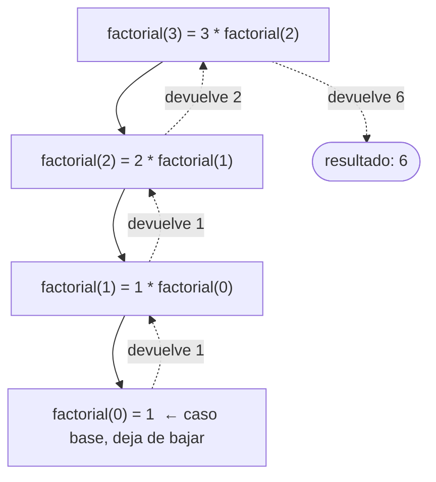
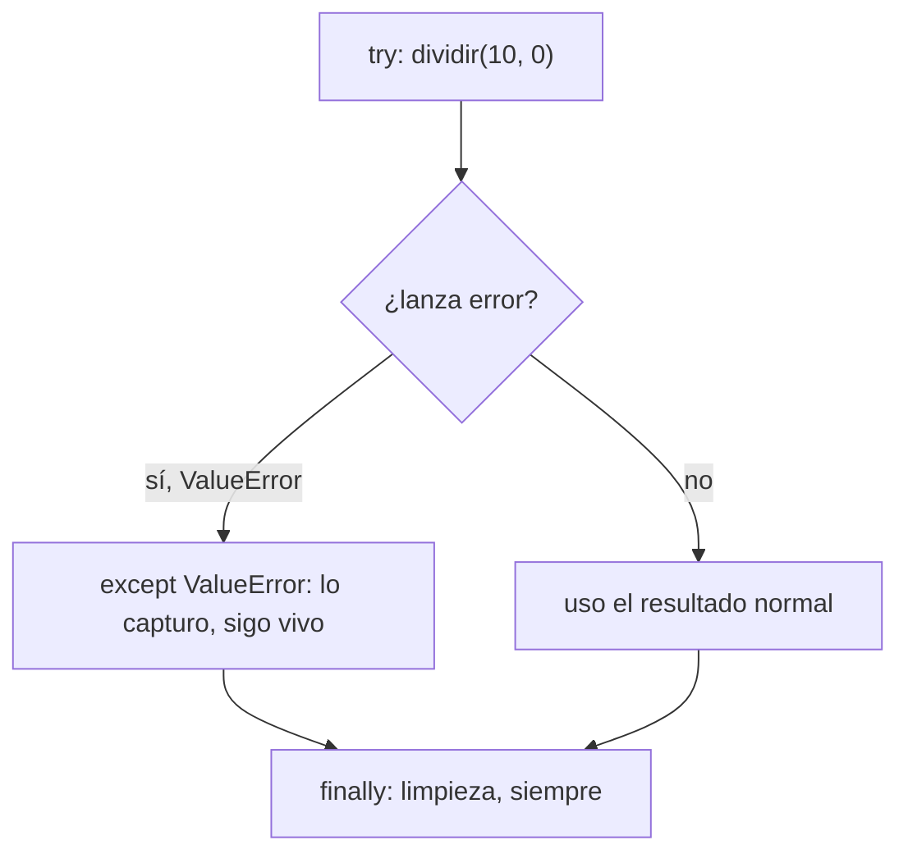

import Reto from "@components/Reto.astro";
import Solucion from "@components/Solucion.astro";
import Quiz from "@components/Quiz.astro";
import CheckDominio from "@components/CheckDominio.astro";
import Nivel from "@components/Nivel.astro";

<Nivel nivel="básico" />

Esta es la sub-unidad más larga de la Fase 0 y la que sostiene **todo** lo que viene después. Aquí re-construyes, a mano, los seis ladrillos con los que está hecho cualquier programa: **tipos y variables, control de flujo, funciones y scope, estructuras de datos, recursión y manejo de errores**. Los ejemplos están en Python (el lenguaje troncal de la fase), pero las ideas son del lenguaje que sea.

> Una palabra antes de empezar: si en algún punto sientes el impulso de pegar esto en una IA y pedir "explícamelo rápido", resiste. El objetivo de esta lección no es *saber* que existe un diccionario. Es que tu cabeza pueda **simular** uno sin ejecutar nada. Eso es lo que un live coding mide y lo que la dependencia de IA atrofió.

:::tip[Si ya tocaste esto antes]
Si ya programaste y reconoces todos estos términos, no te saltes la lección entera: úsala como **diagnóstico**. Ve directo a los **dos ejercicios Primero-Sin-IA** del final (sección 7) y resuélvelos **a mano, sin ejecutar y sin IA**. Si los cierras en el timebox sin titubear, valida con el check de dominio (sección 8) y avanza a [`0.8` Spec-first y stack traces](/fase-0-fundamentos/). Si te trabas en recursión o scope, vuelve a la sección que falló. Es lo normal: son justo las dos que más se oxidan.
:::

## 1. Qué vas a saber hacer

Al terminar, sin IA y sin notas, podrás:

- **O1 — Predecir** la salida de un fragmento que combine variables, condicionales, bucles y funciones, trazándolo línea a línea (sin ejecutarlo).
- **O2 — Implementar** una función pequeña que recorra y agregue datos en estructuras (`list`/`dict`/`set`), con sus casos borde y validación de entradas.
- **O3 — Explicar** por qué una variable reasignada dentro de una función no cambia la de afuera (scope), y trazar la pila de llamadas de una función **recursiva**.

## 2. Por qué importa (el dinero está aquí)

> 💰 **Por qué importa:** sin esto, en cualquier entrevista técnica con *live coding* te caes en los primeros diez minutos. Es el cimiento de tu credibilidad como semi-senior.

El mercado 2026 está endureciendo el filtro anti-IA justo en las entrevistas: cámara encendida, sin copilot, "explícame en voz alta qué hace este bucle". El candidato que orquesta IA pero no puede trazar un `for` anidado a mano se nota en segundos. Y al revés: el que **predice la salida antes de correr el código** proyecta exactamente la señal de autonomía que se paga. Esta lección es barata de leer y carísima de no tener.

Hay un segundo motivo, menos obvio: todo lo que viene —APIs, RAG, agentes, pipelines de datos— son las **mismas seis piezas** combinadas a mayor escala. Un agente de IA es control de flujo (decidir qué herramienta llamar) + estructuras (su memoria) + manejo de errores (qué pasa cuando el modelo devuelve basura) + recursión (el agent loop). Si las bases están firmes, lo de arriba es vocabulario nuevo sobre cimientos conocidos. Si no, es una torre sobre arena.

## 3. Lo que ya traes (actívalo)

Esta sub-unidad no parte de cero del todo. Reúsalo:

- De [`0.2` Pensamiento computacional](/fase-0-fundamentos/): **descomponer** un problema en pasos. Programar es eso, escrito en una sintaxis que la máquina entiende.
- De [`0.3` Notional machine + trazado a mano](/fase-0-fundamentos/): la **tabla de traza** (variable × iteración). La vas a usar en cada ejercicio de aquí.
- De [`0.6` Git](/fase-0-fundamentos/): cada vez que cierres un fragmento que corre, lo confirmas con un **Conventional Commit** (`feat: agrega total_por_categoria`). El hábito empieza hoy, no en la Fase 2.

Antes de seguir, responde de memoria (sin volver a 0.3):

<Quiz
  question="¿Qué genera range(1, 4) en Python?"
  options={[
    "1, 2, 3, 4",
    "1, 2, 3",
    "0, 1, 2, 3",
  ]}
  answer={1}
  explanation="range(inicio, fin) incluye el inicio y EXCLUYE el fin: 1, 2, 3. El off-by-one en range es el error #1 al trazar bucles."
/>

## 4. Ejemplo resuelto, pensado en voz alta

Voy a construir, paso a paso, una función que cuenta cuántas veces aparece cada palabra en una lista. En el camino paso por los seis ladrillos. **No leas esto como un resultado: léelo como me oirías razonar si estuviera al lado tuyo.**

### 4.1 Tipos y variables

Una **variable** es un nombre pegado a un valor. El **tipo** es la clase de valor: el contrato de qué operaciones admite.

```python
nombre = "ada"        # str  (texto)
edad = 36             # int  (entero)
altura = 1.70         # float (decimal)
activo = True         # bool (True / False)
nada = None           # None (ausencia de valor)
```

Pienso en voz alta: *"`nombre` es un `str`. Eso significa que puedo hacer `nombre.upper()` pero NO `nombre + 1`, porque sumar texto y número no tiene sentido para Python."* El tipo me dice qué está permitido **antes** de ejecutar. Para preguntárselo a la máquina: `type(edad)` devuelve `int`, y `isinstance(edad, int)` devuelve `True`.

:::note[Mutable vs inmutable — guárdalo, vuelve después]
`str`, `int`, `float`, `bool`, `tuple` son **inmutables**: no cambian, creas valores nuevos. `list`, `dict`, `set` son **mutables**: los modificas en su lugar. Esta distinción explica el 80% de los bugs raros de scope que verás en la sección 6. Por ahora solo regístrala.
:::

### 4.2 Control de flujo

El control de flujo decide **qué línea corre y cuántas veces**. Dos herramientas: ramas (`if`/`elif`/`else`) y bucles (`for`/`while`).

```python
def clasifica(edad):
    if edad < 0:
        return "inválida"
    elif edad < 18:
        return "menor"
    else:
        return "adulto"
```

Razono: *"Python evalúa las ramas de arriba hacia abajo y se queda con la PRIMERA verdadera. Por eso `elif edad < 18` ya sabe que `edad >= 0` (si no, habría entrado al primer `if`). El orden importa: si pusiera `else` antes, nunca llegaría a `menor`."*

Un bucle recorre una secuencia:

```python
total = 0
for n in [4, 8, 15]:
    total = total + n     # acumulador: total se ARRASTRA entre vueltas
# aquí total vale 27
```

El patrón clave es el **acumulador**: una variable que inicializas **antes** del bucle y actualizas **dentro**. Dónde la inicializas (antes vs. dentro) cambia todo el resultado. Ese fue exactamente el error resbaloso de [0.3](/fase-0-fundamentos/).

### 4.3 Funciones y scope

Una **función** empaca un trozo de lógica con un nombre, recibe **parámetros** y devuelve un valor con `return`.

```python
def doble(x):
    resultado = x * 2
    return resultado

y = doble(21)   # y vale 42
```

Aquí viene lo importante, el **scope** (alcance): las variables creadas dentro de una función (`resultado`, y el parámetro `x`) **solo existen dentro de esa función**. Afuera no existen. Cada llamada crea su propio mundo local que se destruye al volver.

```python
x = 10            # x "global", del módulo

def f(n):
    x = n * 2     # ESTA x es local, NUEVA, distinta de la de arriba
    return x

print(f(3))       # 6
print(x)          # 10  ← la global NO cambió
```

Pienso en voz alta: *"Dentro de `f`, asignar `x = n * 2` no toca la `x` de afuera: crea una `x` local que tapa (shadowing) a la global mientras dure la función. Por eso afuera `x` sigue siendo 10."* Python busca nombres en este orden, **LEGB**: **L**ocal → **E**nclosing (función que envuelve) → **G**lobal (módulo) → **B**uilt-in (lo que viene de fábrica, como `len`). El primero que encuentra, gana.

### 4.4 Estructuras de datos

Cuatro contenedores, cada uno con un propósito:

| Estructura | Sintaxis | Para qué | Ordenada | Mutable | Permite duplicados |
|---|---|---|---|---|---|
| **list** | `[1, 2, 2]` | secuencia que cambia | sí (por posición) | sí | sí |
| **tuple** | `(1, 2)` | grupo fijo de campos | sí | **no** | sí |
| **dict** | `{"a": 1}` | mapa clave → valor | sí (inserción) | sí | claves no |
| **set** | `{1, 2}` | colección sin orden ni repetidos | no | sí | **no** |

Cuándo uso cada uno: *"¿Necesito el orden y voy a agregar/quitar? `list`. ¿Es un registro fijo, como `(lat, lon)`? `tuple`. ¿Busco por una clave, como un nombre? `dict`. ¿Solo me importa si algo está o no, sin repetir? `set`."* El `dict` y el `set` encuentran un elemento casi instantáneamente (no recorren todo); la `list` tiene que mirar uno por uno. Esa diferencia te importará mucho en la Fase 2.

### 4.5 Armando la función (control + estructuras + funciones)

Ahora junto las piezas. Quiero `cuenta_palabras(palabras)` que devuelva un `dict` palabra → cuántas veces aparece.

```python
def cuenta_palabras(palabras):
    conteo = {}                       # dict acumulador, vacío
    for palabra in palabras:          # control de flujo: recorro la list
        if palabra in conteo:         # ¿ya la vi?
            conteo[palabra] += 1      # sí: sumo 1
        else:
            conteo[palabra] = 1       # no: la registro en 1
    return conteo

cuenta_palabras(["sol", "mar", "sol"])   # {"sol": 2, "mar": 1}
```

Lo trazo mentalmente con `["sol", "mar", "sol"]`:

| palabra | `conteo` antes | rama | `conteo` después |
|---|---|---|---|
| "sol" | `{}` | else | `{"sol": 1}` |
| "mar" | `{"sol": 1}` | else | `{"sol": 1, "mar": 1}` |
| "sol" | `{"sol": 1, "mar": 1}` | if | `{"sol": 2, "mar": 1}` |

*"Si no puedo llenar esta tabla sin ejecutar, no entendí la función — entendí que existe."*

### 4.6 Recursión

Una función **recursiva** se llama a sí misma con un problema más pequeño, hasta llegar a un **caso base** que ya sabe responder sin recursión.

```python
def factorial(n):
    if n == 0:          # caso base: factorial de 0 es 1
        return 1
    return n * factorial(n - 1)   # caso recursivo: más pequeño
```

La trampa mental: cada llamada **espera** a que la de adentro termine antes de poder multiplicar. Se apilan. Trazo `factorial(3)` como una pila:



Razono: *"Bajo hasta el caso base (`n == 0`), y recién ahí empiezo a subir multiplicando: `1 → 1·1 → 2·1 → 3·2 = 6`. Si me olvido del caso base, nunca dejo de bajar: eso es un `RecursionError`, el bucle infinito de la recursión."*

### 4.7 Manejo de errores

Un programa robusto **anticipa lo que puede salir mal**. En Python eso se hace con `try` / `except`, y se señala un error con `raise`.

```python
def dividir(a, b):
    if b == 0:
        raise ValueError("no se puede dividir por cero")
    return a / b

try:
    resultado = dividir(10, 0)
except ValueError as e:
    print(f"error controlado: {e}")
    resultado = None
finally:
    print("esto corre pase lo que pase")
```

El flujo:



Razono: *"`raise` interrumpe la función ahí mismo y 'lanza' el error hacia arriba. Si nadie lo `except`-ea, el programa muere y te imprime un **stack trace** (lo lees en [0.8](/fase-0-fundamentos/)). El `except ValueError` lo atrapa **solo si es de ese tipo**: capturar el tipo correcto es la diferencia entre arreglar un bug y esconderlo."*

## 5. Errores de principiante que vas a tener (y por qué)

:::caution[Podrías pensar que `=` y `==` son lo mismo]
`=` **asigna** (`x = 5` mete 5 en `x`). `==` **compara** (`x == 5` pregunta si son iguales y devuelve `True`/`False`). Escribir `if x = 5:` es un error de sintaxis; escribir `x == 5` como si guardara algo no guarda nada. Léelos como verbos distintos: "**se le pone**" vs "**¿es igual a?**".
:::

:::caution[Podrías pensar que modificar `x` dentro de una función cambia la `x` de afuera]
Para valores **inmutables** (`int`, `str`...), **no**: la reasignación crea una variable local nueva (lo viste en 4.3). Pero ojo con los **mutables**: si le pasas una `list` a una función y haces `lista.append(9)` (mutación, no reasignación), el de afuera **sí** ve el cambio, porque ambos nombres apuntan al mismo objeto. Reasignar (`lista = [9]`) no; mutar (`lista.append(9)`) sí. Esta es la confusión #1 de scope, y volverá a morderte en la Fase 1.
:::

:::caution[Podrías pensar que `range(n)` llega hasta `n`]
`range(n)` va de `0` a `n-1`. `range(1, n+1)` va de `1` a `n`. El **off-by-one** (equivocarse por uno) es tan común que tiene nombre propio. Cuando dudes, no adivines: traza los dos primeros y el último valor a mano.
:::

:::caution[Podrías pensar que `except:` a secas es "atrapar errores por si acaso"]
Un `except:` sin tipo atrapa **todo**, incluido el `Ctrl+C` y los bugs que querías ver. Esconde el problema en vez de manejarlo. Atrapa siempre el **tipo específico** que esperas (`except ValueError:`), y deja morir lo que no sabes manejar — un programa que falla ruidoso es más fácil de arreglar que uno que falla en silencio.
:::

:::caution[Podrías pensar que una función sin `return` "devuelve lo último que calculó"]
No. Una función que no ejecuta un `return` devuelve `None`. Si haces `total = suma(a, b)` y `suma` solo `print`-ea sin `return`, `total` queda en `None` y el bug aparece tres líneas después, lejos de la causa. Distingue **mostrar** (`print`) de **devolver** (`return`).
:::

## 6. Práctica con andamiaje (que se desvanece)

Tres niveles, de más apoyo a menos. Hazlos en orden, **a mano primero**.

### 6.1 PREDICT (sin ejecutar)

Antes de tocar el teclado, escribe en papel qué imprime esto:

```python
def acumula(numeros):
    total = 0
    for n in numeros:
        if n % 2 == 0:        # % es el resto: par si el resto es 0
            total += n
    return total

print(acumula([1, 2, 3, 4, 5]))
```

<Solucion title="Ver la respuesta (solo después de predecir)">
`2 + 4 = 6`. Solo los pares entran al `if`. Los impares (1, 3, 5) se saltan. Imprime `6`. Si dijiste `15`, sumaste todos; si dijiste `9`, sumaste los impares (confundiste `== 0` con `!= 0`).
</Solucion>

### 6.2 Parsons — reordena las líneas

Estas líneas implementan `maximo(numeros)` que devuelve el mayor de una lista, pero están **desordenadas**. Reescríbelas en el orden correcto (cuida la indentación):

```text
    return mayor
def maximo(numeros):
        if n > mayor:
    for n in numeros:
            mayor = n
    mayor = numeros[0]
```

<Solucion title="Ver el orden correcto">

```python
def maximo(numeros):
    mayor = numeros[0]        # arranco asumiendo que el primero es el mayor
    for n in numeros:
        if n > mayor:         # ¿encontré uno más grande?
            mayor = n         # sí: actualizo
    return mayor
```

La clave es el orden lógico: **inicializar el acumulador `mayor` ANTES del bucle** (con un valor real, el primer elemento), comparar dentro, devolver al final. Si inicializas `mayor` dentro del `for`, lo reinicias en cada vuelta y rompes todo.
</Solucion>

### 6.3 MODIFY

Toma `cuenta_palabras` de la sección 4.5 y modifícala para que **ignore mayúsculas/minúsculas** (`"Sol"` y `"sol"` cuenten como la misma). Pista: hay una sola línea que cambiar, y `.lower()` es tu amiga. Pruébalo con `["Sol", "sol", "MAR"]`; debe dar `{"sol": 2, "mar": 1}`.

## 7. Ejercicios Primero-Sin-IA

Ahora sin andamiaje. Resuélvelos **a mano, sin ejecutar y sin IA** dentro del timebox. Está bien que sea lento y feo: el músculo se construye con el esfuerzo, no con la respuesta.

<Reto title="Resumen de gastos por categoría" timebox="35–45 min">

Implementa `total_por_categoria(gastos)`: recibe una lista de gastos (cada uno un `dict` con `"categoria"` y `"monto"`) y devuelve un `dict` que suma los montos **agrupados por categoría**. Debe validar la entrada (montos negativos o categorías vacías lanzan `ValueError`) y manejar la lista vacía.

Entregable: tu solución en `ejercicios/fase-0/fundamentos-programacion-inventario/`, con los tests en verde y **un caso borde tuyo** agregado.

**Hecho significa:**
- [ ] Agrupa y suma correctamente (los 6 tests pasan).
- [ ] Lista vacía devuelve `{}` sin reventar.
- [ ] Entradas inválidas lanzan `ValueError` con un mensaje claro.
- [ ] Agregaste al menos un test propio.
- [ ] Puedes explicar tu solución **sin notas**.

Enunciado completo, starter y tests: `ejercicios/fase-0/fundamentos-programacion-inventario/` (carpeta del repo).

<Solucion title="Pista (ábrela solo si superaste el timebox)">
Piensa en el **contrato** antes de programar (esto es spec-first, [0.8](/fase-0-fundamentos/)): ¿qué entra, qué sale, qué casos borde? Necesitas un `dict` acumulador inicializado **antes** del bucle. Para sumar "creando la clave si no existe", `dict.get(clave, 0)` te devuelve 0 cuando la categoría es nueva, así no necesitas un `if` para el primer gasto de cada categoría. Valida **antes** de acumular, no después. Esto es una pista, no la solución.
</Solucion>

</Reto>

<Reto title="Recursión y scope, trazados a mano" timebox="25–35 min">

Sin ejecutar y sin IA, predice la salida de este programa y **justifícala**:

```python
def suma_hasta(n):
    if n == 0:
        return 0
    return n + suma_hasta(n - 1)

x = 10
def f(n):
    x = n * 2
    return x

print(f(3))
print(x)
print(suma_hasta(4))
```

Entregable: en `ejercicios/fase-0/fundamentos-programacion-recursion-scope/` deja `prediccion.md` (las tres salidas predichas + la **pila de llamadas** de `suma_hasta(4)` + por qué `x` vale lo que vale), `verificacion.md` (qué salió al ejecutar, si coincidió) y `reflexion.md`.

**Hecho significa:**
- [ ] Predijiste las tres líneas **antes** de ejecutar.
- [ ] Dibujaste la pila de `suma_hasta(4)` mostrando bajada y subida.
- [ ] Explicaste por qué `print(x)` da `10` y no `6` (scope).
- [ ] Si fallaste, nombraste la **idea** equivocada, no el número.

<Solucion title="Pista (ábrela solo si superaste el timebox)">
Para la recursión: baja hasta el caso base (`n == 0`) anotando qué queda "pendiente de multiplicar/sumar" en cada nivel, y recién al tocar el fondo empieza a subir resolviendo. Para el scope: pregúntate si la `x` de dentro de `f` es la **misma** que la de afuera o una **nueva** local (revisa la sección 4.3 y la regla LEGB). Pista, no solución.
</Solucion>

</Reto>

## 8. Check de dominio

Sin mirar la lección, en voz alta o por escrito:

<CheckDominio
  items={[
    "Explicar la diferencia entre = y == con un ejemplo propio.",
    "Decir cuándo usar list, tuple, dict y set, y por qué.",
    "Trazar la pila de llamadas de factorial(4) hasta el resultado.",
    "Explicar por qué reasignar una variable dentro de una función no cambia la de afuera (scope / LEGB).",
    "Escribir, sin ejecutar, una función que valide su entrada y lance ValueError.",
    "Predecir la salida de un bucle con acumulador y un if dentro.",
  ]}
/>

Si marcaste menos de cinco, vuelve a la sección correspondiente **antes** de avanzar. No es un examen: es honestidad contigo.

<Quiz
  question="¿Qué devuelve una función de Python que termina sin ejecutar ningún return?"
  options={[
    "El último valor que calculó",
    "None",
    "Un error en tiempo de ejecución",
  ]}
  answer={1}
  explanation="Sin un return alcanzado, la función devuelve None. Confundir 'mostrar con print' y 'devolver con return' es una fuente clásica de bugs silenciosos."
/>

## 9. Recursos (documentación oficial primero)

- **Tutorial oficial de Python** — [docs.python.org/3/tutorial](https://docs.python.org/3/tutorial/) (capítulos 3 a 5 y 8 cubren exactamente esta lección; es la fuente de verdad).
- **Estructuras de datos** — [docs.python.org/3/tutorial/datastructures.html](https://docs.python.org/3/tutorial/datastructures.html).
- **Errores y excepciones** — [docs.python.org/3/tutorial/errors.html](https://docs.python.org/3/tutorial/errors.html).
- **Python Tutor (visualizador de ejecución paso a paso)** — [pythontutor.com](https://pythontutor.com/) — para *verificar* tu traza después de predecirla, nunca para predecir por ti.

## 10. Conexión con el capstone de la fase

El **Capstone F0 — CLI sin IA** (una herramienta de línea de comandos útil, escrita 100% sin asistencia) es literalmente estas seis piezas combinadas:

- Leerá argumentos y decidirá qué hacer → **control de flujo**.
- Guardará y agrupará datos → **list / dict / set**.
- Estará partido en funciones con responsabilidades claras → **funciones y scope**.
- Validará lo que el usuario escribe mal → **manejo de errores**.

Cuando llegues al capstone y tengas que **depurar tu propio CLI sin debugger**, la habilidad que te salvará es la de esta lección: predecir qué hace tu código sin ejecutarlo. Por eso la practicas a mano ahora.

## 11. Reflexión y repaso espaciado

Cierra escribiendo dos o tres frases respondiendo: **¿cuál de los seis ladrillos te costó más, y por qué exactamente?** Nombrar la dificultad con precisión ("la subida de la pila recursiva", no "la recursión") es lo que la convierte en algo que puedes atacar.

Gancho de **spaced repetition**:

- **Mañana:** reescribe `cuenta_palabras` y `factorial` **de memoria**, sin mirar. Si no puedes, no lo aprendiste todavía — vuelve a la sección.
- **En 3 días:** toma el ejercicio de gastos y agrégale una categoría "otros" para montos sin categoría, sin volver a leer tu solución vieja.
- **En 1 semana:** explícale a alguien (o a una grabación) qué es el scope, con el ejemplo de las dos `x`. Enseñar es el test de dominio definitivo.
