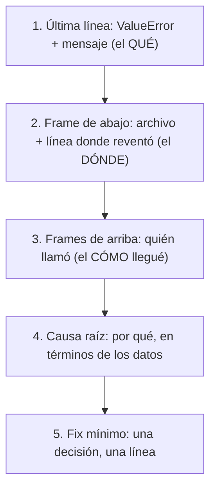

import Reto from "@components/Reto.astro";
import Solucion from "@components/Solucion.astro";
import Quiz from "@components/Quiz.astro";
import CheckDominio from "@components/CheckDominio.astro";
import Nivel from "@components/Nivel.astro";

<Nivel nivel="básico" />

Esta sub-unidad cierra la Fase 0 con las dos mitades del **método** que separa a un junior de un semi-senior: pensar **antes** de escribir código (la mini-spec) y leer con calma **cuando algo revienta** (el stack trace). No son trucos avanzados: son dos hábitos baratos que casi nadie te enseña explícitamente y que, juntos, reemplazan el "probar a ver si sale" por ingeniería de verdad.

> Una advertencia antes de empezar, en el espíritu del [Primero-Sin-IA](/fase-0-fundamentos/0-1-mentalidad-y-metodo/): cuando tu programa falle y escupa un muro de texto rojo, tu primer impulso será copiarlo entero y pegarlo en una IA. Resiste. Ese muro de texto es un **mapa con la X marcada**, y aprender a leerlo es exactamente la habilidad que la dependencia de IA atrofió. Pegar sin leer es no aprender a depurar nunca.

:::tip[Si ya tocaste esto antes]
Si ya escribiste specs o llevas tiempo leyendo tracebacks, no te saltes la lección: úsala como **diagnóstico**. Ve directo a los dos <Reto title="" /> del final y resuélvelos **sin IA**. Si escribes la mini-spec del divisor de cuenta sin titubear y diagnosticas los tres stack traces a la primera, valida con el `<CheckDominio>` y pasa al [Capstone F0](/fase-0-fundamentos/). Si dudas en algún caso borde o lees el traceback de arriba hacia abajo, vuelve a la sección que falló.
:::

## 1. Qué vas a saber hacer

Al terminar, sin IA y sin notas, podrás:

- **O1 — Escribir** una mini-spec (entradas, salidas, casos borde) de una función **antes** de implementarla, y derivar de ella los tests.
- **O2 — Leer** un stack trace de Python **de abajo hacia arriba**: identificar el tipo de error, su mensaje y el frame exacto donde reventó.
- **O3 — Depurar con método**: ir de la causa raíz a un fix mínimo, en vez de cambiar cosas al azar a ver si el error desaparece.

## 2. Por qué importa (el dinero está aquí)

> 💰 **Por qué importa:** en una entrevista o en el trabajo real, la diferencia entre "este se las arregla solo" y "este necesita que le resuelvan todo" se nota en cómo reacciona ante un error. El semi-senior lee el traceback y va directo al bug; el junior pega el muro rojo en un chat y reza.

Dos señales de mercado concretas:

- **Spec-first** es la semilla del *spec-driven development*, un hilo que recorre **todo** este curso (en la Fase 2 lo formalizarás con Spec Kit y ADRs). Quien diseña el contrato antes de programar comete menos bugs, y los bugs que comete los detecta antes. Cuesta dos minutos y ahorra horas.
- **Leer stack traces** es depurar sin depender de nadie. En un *live coding* con cámara, cuando tu código falla, el entrevistador no mira si el bug aparece: mira si **sabes leer el error y razonar el arreglo en voz alta**. Esa es la señal de autonomía que se paga.

Y hay un motivo más profundo: todo lo que viene —APIs, agentes de IA, pipelines de datos— falla **mucho más** que un ejercicio de Fase 0. Un agente que llama a cinco herramientas y una revienta te deja un stack trace de cuarenta líneas. Si hoy aprendes a leer uno de cuatro, ese de cuarenta no te dará miedo: será el mismo mapa, más largo.

## 3. Lo que ya traes (actívalo)

Esta sub-unidad se apoya en lo anterior. Reúsalo:

- De [`0.7` Fundamentos de programación](/fase-0-fundamentos/0-7-fundamentos-programacion/): el **contrato** de una función (qué entra, qué sale), la **validación** con `raise ValueError`, y que `raise` "lanza" el error hacia arriba. Justo eso es lo que produce un stack trace cuando nadie lo atrapa.
- De [`0.3` Notional machine + trazado a mano](/fase-0-fundamentos/0-3-notional-machine-trazado/): la habilidad de **predecir** qué hace el código sin ejecutarlo. Leer un traceback es trazado a mano al revés: del síntoma a la causa.
- De [`0.6` Git](/fase-0-fundamentos/0-6-git-y-github/): cada función que cierres con su spec y sus tests verdes se confirma con un **Conventional Commit** (`feat: agrega dividir_cuenta con validación`).

Antes de seguir, responde de memoria:

<Quiz
  question="Cuando un programa Python termina con un 'Traceback', ¿en qué línea de ese bloque está el tipo de error y el mensaje?"
  options={[
    "En la primera línea (justo después de 'Traceback')",
    "En la última línea del bloque",
    "Siempre en la del medio",
  ]}
  answer={1}
  explanation="El traceback se lee de abajo hacia arriba. La ÚLTIMA línea trae el tipo de excepción y su mensaje (p. ej. 'ZeroDivisionError: division by zero'). La primera línea solo dice 'Traceback (most recent call last)'."
/>

## 4. Ejemplo resuelto, pensado en voz alta

Dos worked examples, uno por cada mitad de la lección. **No los leas como resultado: léelos como me oirías razonar si estuviera al lado tuyo.**

### 4.1 Spec-first: el contrato antes del código

Quiero una función `iniciales(nombre_completo)` que convierta `"ada lovelace"` en `"A.L."`. Antes de tocar el teclado, escribo la **mini-spec**. Pienso en voz alta:

*"¿Qué entra? Un nombre como texto. ¿Qué sale? Las iniciales en mayúscula con punto. ¿Y los casos raros? Ahí está el oro: ¿qué pasa con un nombre vacío? ¿Con un solo nombre? ¿Con espacios de más?"*

Lo escribo como una tabla de tres partes —**entradas, salida, casos borde**— más una decisión de diseño:

| Parte | Decisión |
|---|---|
| **Entrada** | `nombre_completo`: `str`, palabras separadas por espacios. |
| **Salida** | `str`: la inicial de cada palabra en mayúscula, cada una seguida de un punto. `"ada lovelace"` → `"A.L."` |
| **Borde — vacío** | `""` → `""` (sin palabras, sin iniciales). |
| **Borde — un nombre** | `"ada"` → `"A."` |
| **Borde — espacios extra** | `"  ada   lovelace "` → `"A.L."` (ignoro espacios sobrantes). |
| **Decisión de diseño** | Uso `.split()` **sin argumentos**, que colapsa espacios múltiples y los bordes. Es una mini-decisión de arquitectura: la registro para acordarme de por qué. |

Recién **ahora** escribo el código, y lo escribo para cumplir *esta* spec:

```python
def iniciales(nombre_completo):
    palabras = nombre_completo.split()       # split() sin args colapsa espacios y bordes
    return "".join(letra[0].upper() + "." for letra in palabras)
```

Lo trazo mentalmente contra cada caso borde de la spec (esto es [trazado a mano](/fase-0-fundamentos/0-3-notional-machine-trazado/)):

| Entrada | `.split()` produce | Resultado |
|---|---|---|
| `"ada lovelace"` | `["ada", "lovelace"]` | `"A." + "L."` = `"A.L."` ✅ |
| `""` | `[]` | `"".join([])` = `""` ✅ |
| `"ada"` | `["ada"]` | `"A."` ✅ |
| `"  ada   lovelace "` | `["ada", "lovelace"]` | `"A.L."` ✅ |

*"El caso vacío salió gratis: `"".split()` da una lista vacía, y juntar una lista vacía da `""`. No tuve que escribir un `if` especial porque lo pensé en la spec en vez de descubrirlo a las patadas."*

Y aquí está el truco que une todo el curso: **cada fila de "borde" de la spec es un test**. La spec no es burocracia: es tu lista de tests escrita en español antes de escribirla en código.

```python
def test_dos_nombres():
    assert iniciales("ada lovelace") == "A.L."

def test_vacio():
    assert iniciales("") == ""

def test_un_nombre():
    assert iniciales("ada") == "A."

def test_espacios_extra():
    assert iniciales("  ada   lovelace ") == "A.L."
```

### 4.2 Leer un stack trace de abajo hacia arriba

Ahora el otro lado. Tengo este programa, que lee líneas tipo `clave=valor` y arma un diccionario de configuración:

```python
def cargar_config(lineas):
    config = {}
    for linea in lineas:
        clave, valor = linea.split("=")
        config[clave] = valor
    return config

texto = ["host=localhost", "puerto=8080", "debug"]
print(cargar_config(texto))
```

Lo ejecuto y Python me escupe esto:

```text
Traceback (most recent call last):
  File "config.py", line 9, in <module>
    print(cargar_config(texto))
          ^^^^^^^^^^^^^^^^^^^^
  File "config.py", line 4, in cargar_config
    clave, valor = linea.split("=")
    ^^^^^^^^^^^^
ValueError: not enough values to unpack (expected 2, got 1)
```

Mucha gente entra en pánico y pega esto en una IA. Yo lo **leo**, y lo leo **de abajo hacia arriba**, porque esa primera línea (`Traceback (most recent call last)`) me está avisando que las llamadas están ordenadas con **la más reciente al final**. Pienso en voz alta:

1. **Última línea primero — el QUÉ.** `ValueError: not enough values to unpack (expected 2, got 1)`. El tipo es `ValueError`; el mensaje es clarísimo si lo leo literal: *"esperaba 2 valores para desempacar, recibí 1"*. Ya sé qué tipo de cosa pasó sin mirar una sola línea de mi código.
2. **El frame de más abajo — el DÓNDE.** Justo encima del error: `File "config.py", line 4, in cargar_config`, y debajo la línea exacta `clave, valor = linea.split("=")` con la flecha `^^^^` apuntando a `clave, valor`. Ahí reventó. Estoy intentando meter en **dos** variables (`clave` y `valor`) algo que solo tiene **un** valor.
3. **Hacia arriba — el CÓMO llegué.** El frame de encima, `line 9, in <module>`, es solo quien llamó: `print(cargar_config(texto))`. No es la culpa, es el camino. El `<module>` significa "el nivel principal del archivo, fuera de toda función".
4. **Causa raíz.** Si `linea.split("=")` devolvió un solo valor, es porque **una línea no tenía `=`**. Miro `texto` y ahí está el culpable: `"debug"` no tiene `=`. `"debug".split("=")` da `["debug"]` — un elemento, no dos.
5. **Fix mínimo.** Decidir qué hacer con líneas malformadas. Lo más simple: saltarlas (`if "=" not in linea: continue`) o validar y lanzar un error con mensaje propio. **Una decisión, una línea.**



Fíjate en lo que **no** hice: no cambié código al azar, no pegué nada en una IA, no adiviné. Leí cinco renglones de abajo hacia arriba y el bug se delató solo. Eso es depurar con método.

:::note[La flecha que te regala Python moderno]
Esas líneas de `^^^^` debajo del código (Python 3.11 en adelante) apuntan a la **sub-expresión exacta** que falló. En un `total = sum(nums) / len(nums)` que revienta por división por cero, la flecha marca el `/`, no toda la línea. Es Python diciéndote dónde mirar. Apóyate en ellas.
:::

## 5. Errores de principiante que vas a tener (y por qué)

:::caution[Podrías pensar que el traceback se lee de arriba hacia abajo]
Es la trampa más común. Tu instinto de lector va de arriba hacia abajo, pero el traceback de Python está ordenado al revés a propósito: lo dice en su primera línea, **"most recent call last"**. La **última** línea es el error; el **frame de más abajo** (no el de arriba) es donde explotó. Empieza por el final y sube. El frame de arriba suele ser tu `main()` o el nivel del módulo: el camino, no la causa.
:::

:::caution[Podrías pensar que el mensaje de error "no dice nada útil"]
Casi siempre dice **exactamente** qué pasó, si lo lees literal en vez de asustarte por el color rojo. `KeyError: 'nombre'` te da la clave que faltó. `not enough values to unpack (expected 2, got 1)` te da el conteo exacto. `unsupported operand type(s) for +=: 'int' and 'str'` te dice que sumaste un número con un texto. Lee el mensaje **palabra por palabra antes** de pegarlo en cualquier lado.
:::

:::caution[Podrías pensar que una spec es un documento gigante tipo waterfall]
No. Una **mini**-spec son tres líneas: qué entra, qué sale, qué casos borde. No es un PDF de 40 páginas que firmas y congelas; es una servilleta que escribes en dos minutos para no programar a ciegas. La spec pesada de los 2000 es legacy; la mini-spec por función es práctica diaria de 2026.
:::

:::caution[Podrías pensar que escribir la spec DESPUÉS de codear da igual]
Escribir la spec después es **describir lo que ya hiciste**, no **diseñar lo que necesitas**. Pierdes justo el efecto valioso: pensar los casos borde *antes*, cuando todavía son baratos. Y esos casos borde (el vacío, el negativo, el `None`) son precisamente donde viven los bugs. La spec primero los caza en tu cabeza; la spec después los documenta cuando ya te mordieron.
:::

:::caution[Podrías pensar que "depurar" es cambiar cosas hasta que el error desaparezca]
Eso es *shotgun debugging* (depurar a escopetazos) y es una trampa: a veces el error se va por accidente y vuelve peor. Depurar con método es leer el traceback, formar una **hipótesis** de la causa raíz, y hacer **un** cambio dirigido a esa hipótesis. Si el error sigue, tu hipótesis estaba mal: vuelve a leer, no dispares otra vez.
:::

## 6. Práctica con andamiaje (que se desvanece)

Tres pasos, de más apoyo a menos. Hazlos **sin ejecutar primero** (predecir es pensar).

### 6.1 PREDICT — ¿qué excepción lanza, y qué dice el mensaje?

Sin ejecutar, predice el **tipo** de excepción y, si puedes, el valor que aparecerá en el mensaje:

```python
def saludar(usuario):
    return f"Hola, {usuario['nombre']}"

datos = {"name": "Ada", "edad": 36}
print(saludar(datos))
```

<Solucion title="Ver la respuesta (solo después de predecir)">
`KeyError: 'nombre'`. El diccionario tiene la clave `"name"` (en inglés), no `"nombre"`. Cuando pides `usuario['nombre']` y la clave no existe, Python lanza `KeyError` y el mensaje es exactamente la clave que faltó: `'nombre'`. Si predijiste `KeyError` pero no la clave, ya vas bien encaminado: el mensaje te la regala.
</Solucion>

### 6.2 INVESTIGATE (Parsons) — ordena los pasos de la lectura

Estos cinco pasos para leer un stack trace están **desordenados**. Reescríbelos en el orden correcto en que los aplicarías:

```text
Propón un fix mínimo dirigido a esa causa.
Mira el frame de más abajo: el archivo y la línea donde reventó.
Lee la última línea: el tipo de excepción y su mensaje.
Razona la causa raíz: por qué, en términos de los datos.
Sube por los frames de arriba para ver quién llamó (el camino).
```

<Solucion title="Ver el orden correcto">

1. Lee la **última línea**: el tipo de excepción y su mensaje (el QUÉ).
2. Mira el **frame de más abajo**: el archivo y la línea donde reventó (el DÓNDE).
3. Sube por los **frames de arriba** para ver quién llamó (el CÓMO llegué).
4. Razona la **causa raíz**: por qué, en términos de los datos.
5. Propón un **fix mínimo** dirigido a esa causa.

La clave es empezar por el final (el error) y subir hacia la causa, no al revés.
</Solucion>

### 6.3 MODIFY — completa la mini-spec

Aquí va una mini-spec **a medio escribir** para una función `precio_con_iva(neto)` que suma 19% de IVA a un precio neto. Las entradas y la salida ya están; **faltan los casos borde**. Complétalos (piensa: ¿qué entradas raras pueden llegar?):

| Parte | Decisión |
|---|---|
| **Entrada** | `neto`: número (`int` o `float`) en pesos. |
| **Salida** | `float`: `neto * 1.19`. |
| **Borde — ...** | *(complétalo)* |
| **Borde — ...** | *(complétalo)* |

<Solucion title="Ver una versión razonable">

| Parte | Decisión |
|---|---|
| **Borde — neto cero** | `0` → `0.0` (válido, gratis). |
| **Borde — neto negativo** | `< 0` → `ValueError` (un precio negativo no tiene sentido). |
| **Borde — redondeo** | Decisión de diseño: devuelvo el `float` sin redondear; redondear a peso es responsabilidad de quien muestra, no del cálculo. |

No hay una única respuesta correcta: lo que importa es que **pensaste los bordes antes de programar**. Si solo se te ocurrió uno, mira de nuevo la entrada y pregúntate qué valor "legal pero raro" podría llegar.
</Solucion>

## 7. Ejercicios Primero-Sin-IA

Sin andamiaje. Resuélvelos **sin IA** dentro del timebox. El primero combina spec-first con código; el segundo es lectura pura de tracebacks, a mano.

<Reto title="Spec-first: divisor de cuenta" timebox="35–45 min">

Vas a escribir **primero la mini-spec y solo después el código** de `dividir_cuenta(total, personas)`: reparte una cuenta en partes iguales y devuelve cuánto paga cada persona.

El orden es innegociable:

1. Escribe `spec.md` con la tabla **entradas / salida / casos borde** (mínimo: total negativo, total cero, cero personas, personas negativas, división no exacta) **antes** de programar.
2. Implementa `dividir_cuenta` en `dividir_cuenta.py` para cumplir tu spec.
3. Haz pasar los tests; agrega **un test tuyo** para un caso borde de tu spec que los tests no cubran.

Entregable: tu solución en `ejercicios/fase-0/spec-first-divisor-cuenta/`, con `spec.md`, el código y los tests en verde.

**Hecho significa:**
- [ ] `spec.md` existe y lista entradas, salida y **al menos 4 casos borde**, escrito antes del código.
- [ ] Cada caso borde de la spec aparece como un **test** o como una **rama de validación** del código.
- [ ] Los tests pasan; cuentas inválidas (total negativo, cero/menos personas) lanzan `ValueError`.
- [ ] Agregaste al menos un test propio.
- [ ] Puedes explicar **sin notas** por qué validar antes de dividir.

<Solucion title="Pista (ábrela solo si superaste el timebox)">
Tu spec es tu lista de tests: si escribiste "cero personas → ValueError" como caso borde, eso es un test y una rama `if`. El orden dentro de la función importa: tienes que **validar antes de dividir**, porque dividir entre cero revienta con `ZeroDivisionError` antes de que puedas lanzar tu `ValueError` con un mensaje claro. Y una decisión de diseño que conviene anotar en la spec: ¿redondeas el resultado o devuelves el `float` completo? Las dos son válidas si las **decides** a propósito. Esto es una pista, no la solución.
</Solucion>

</Reto>

<Reto title="Lee el stack trace (a mano)" timebox="25–35 min">

En `ejercicios/fase-0/leer-stack-traces/casos/` hay tres programas, cada uno con su stack trace ya capturado en el README. Para **cada uno**, sin ejecutarlo y sin IA, escribe en `diagnostico.md`:

1. **Tipo y significado** del error, en tus palabras (no copies el mensaje: explícalo).
2. **Frame culpable**: archivo y número de línea donde reventó (el de más abajo), y por qué ese y no otro.
3. **Causa raíz**: por qué pasó, en términos de los **datos** que entraron.
4. **Fix de una línea**: qué cambiarías (descríbelo, no hace falta reescribir todo el programa).

Recién **después** de escribir tu diagnóstico, ejecuta cada programa para confirmar (paso *Investigate* del método).

**Hecho significa:**
- [ ] Diagnosticaste los **tres** casos antes de ejecutar.
- [ ] Para cada uno nombraste el frame de más abajo (no el de arriba) como culpable.
- [ ] Tu causa raíz apunta al **dato** concreto que rompió, no a "está mal el código".
- [ ] Tu fix es mínimo y dirigido a la causa, no un parche al azar.

<Solucion title="Pista (ábrela solo si superaste el timebox)">
Lee siempre de abajo hacia arriba: última línea = tipo + mensaje; frame de abajo = dónde reventó. El mensaje suele nombrar el culpable literal (`KeyError: 'x'` te da la clave; `expected 2, got 1` te da el conteo). Para la causa raíz, pregúntate qué **dato de entrada** llevó a ese estado: ¿una lista vacía?, ¿una clave mal escrita?, ¿un texto donde esperabas un número? El fix casi siempre es validar o convertir ese dato. Pista, no solución.
</Solucion>

</Reto>

## 8. Check de dominio

Sin mirar la lección, en voz alta o por escrito:

<CheckDominio
  items={[
    "Escribir una mini-spec de tres partes (entradas, salida, casos borde) para una función nueva.",
    "Explicar por qué escribir la spec ANTES de codear caza más bugs que escribirla después.",
    "Decir en qué dirección se lee un stack trace y por qué (most recent call last).",
    "Señalar, en un traceback de tres frames, cuál es la línea donde realmente reventó.",
    "Traducir tres mensajes (KeyError, ValueError de unpack, TypeError de +=) a una causa raíz en español.",
    "Explicar la diferencia entre depurar con método y depurar a escopetazos.",
  ]}
/>

Si marcaste menos de cinco, vuelve a la sección correspondiente antes de avanzar. No es un examen: es honestidad contigo.

<Quiz
  question="Tu programa falla con 'TypeError: unsupported operand type(s) for +=: int and str'. ¿Cuál es la causa raíz más probable?"
  options={[
    "Python está roto o mal instalado",
    "Estás sumando un número con un texto: algún dato llegó como string cuando esperabas un número",
    "Falta un import",
  ]}
  answer={1}
  explanation="El mensaje lo dice literal: la operación += no soporta 'int' y 'str' juntos. Algún valor que creías número entró como texto (p. ej. '2990' en vez de 2990). El fix es convertir o validar ese dato en su origen."
/>

## 9. Recursos (documentación oficial primero)

- **Errores y excepciones — tutorial oficial de Python** — [docs.python.org/3/tutorial/errors.html](https://docs.python.org/3/tutorial/errors.html) (qué es una excepción, `try`/`except`, `raise`).
- **Built-in Exceptions** — [docs.python.org/3/library/exceptions.html](https://docs.python.org/3/library/exceptions.html) (el catálogo: `ValueError`, `KeyError`, `TypeError`, `ZeroDivisionError`… qué significa cada uno).
- **`traceback` — cómo Python arma el reporte** — [docs.python.org/3/library/traceback.html](https://docs.python.org/3/library/traceback.html) (referencia; no hace falta dominarla, pero ayuda a entender el formato).
- **Python Tutor (visualizador paso a paso)** — [pythontutor.com](https://pythontutor.com/) — para *verificar* dónde reventaría un programa después de predecirlo, nunca para predecir por ti.

## 10. Conexión con el capstone de la fase

El **Capstone F0 — CLI sin IA** empieza, literalmente, con lo de esta lección:

- **Arranca con una mini-spec.** Antes de escribir una línea, defines: ¿qué argumentos recibe el CLI (entradas)? ¿Qué imprime o guarda (salidas)? ¿Qué pasa si el usuario pasa un argumento inválido, un archivo que no existe, nada (casos borde)? Esa spec es tu mapa de construcción y tu lista de tests.
- **Lo depurarás leyendo stack traces.** Un CLI sin debugger mágico falla, y la habilidad que te salvará es leer el traceback que tú mismo provocaste, ubicar el frame y arreglar la causa. La practicas hoy con programas de cuatro líneas para que en el capstone, con tu propio código, sea reflejo y no pánico.

Spec antes, lectura de errores después: es el ciclo de trabajo de cualquier ingeniero, y lo estrenas en tu primera herramienta de verdad.

## 11. Reflexión y repaso espaciado

Cierra con dos o tres frases respondiendo: **la última vez que tu código falló, ¿leíste el error o lo pegaste en algún lado sin leer?** Ser honesto aquí es lo que convierte el hábito en automático.

Gancho de **spaced repetition**:

- **Mañana:** toma una función cualquiera que hayas escrito y escríbele la mini-spec **de memoria** (entradas / salida / 3 bordes). Si te cuesta nombrar los bordes, ahí está tu punto débil.
- **En 3 días:** provoca un error a propósito (pide una clave que no existe, divide entre cero) y lee el traceback en voz alta de abajo hacia arriba antes de arreglarlo.
- **En 1 semana:** explícale a alguien (o a una grabación) cómo lees un stack trace, usando el ejemplo del `ValueError: ... expected 2, got 1`. Enseñarlo es el test de dominio definitivo.
</content>
</invoke>
