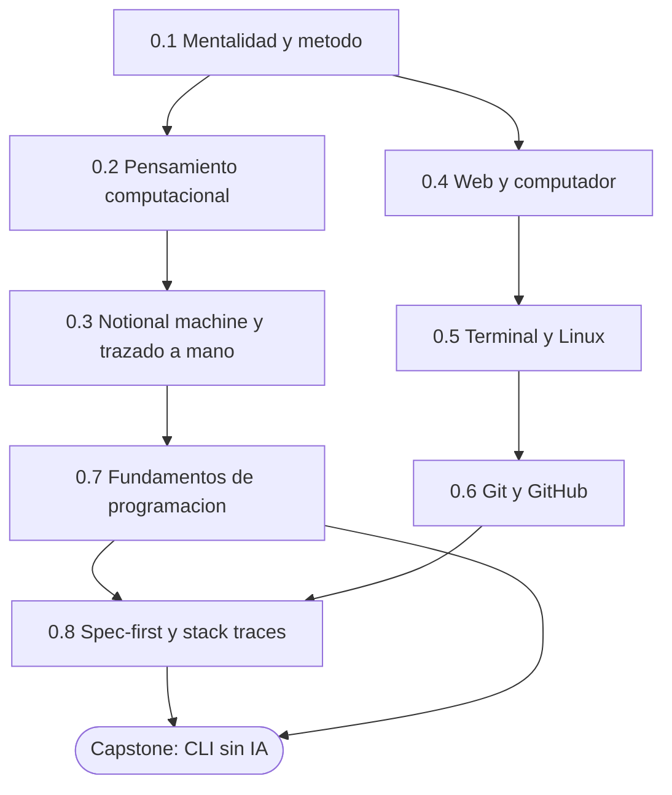
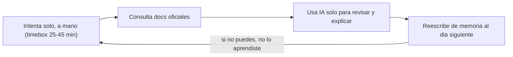

import Reto from "@components/Reto.astro";
import Solucion from "@components/Solucion.astro";
import CheckDominio from "@components/CheckDominio.astro";
import Nivel from "@components/Nivel.astro";

<Nivel nivel="básico" />

Esta es la puerta de entrada al curso. No es una fase de "repaso": es donde
construyes —o reconstruyes— la capacidad de **pensar y escribir código sin
depender de una IA para razonar**. Todo lo que viene después (lenguajes,
backend, IA, automatización) se apoya en lo que afiances aquí.

## Objetivos de la fase

Al cerrar la Fase 0 sabrás **hacer** esto (no solo "haber leído sobre ello"):

- **Explicar** la Regla del Primero-Sin-IA y **defender** por qué delegar el
  *pensar* en una IA atrofia tu autonomía de ingeniería.
- **Trazar a mano** la ejecución de un programa pequeño —su *notional machine*—
  y **predecir** su salida sin ejecutarlo.
- **Operar** la terminal, Git y el modelo cliente-servidor con fluidez básica,
  y **leer** un stack trace para ubicar un error.
- **Diseñar y construir** una herramienta de línea de comandos útil, partiendo
  de una mini-spec, con commits limpios y **100% sin IA**.

:::tip[Por qué importa (relevancia de mercado)]
Sin estos fundamentos, en cualquier entrevista técnica con *live coding* te
caes. En 2026, con el endurecimiento anti-trampa en entrevistas, **escribir
código pensando en voz alta sin asistencia es una ventaja real de
contratación**. Esta fase es el cimiento de tu credibilidad como semi-senior.
:::

## ¿Para quién es esta fase?

Está escrita para **cero real**: no asume que ya programaste, ni que usas la
terminal, ni que sabes Git. Cada concepto se enseña desde el principio, con un
ejemplo resuelto antes de pedirte que lo hagas tú.

:::tip[Si ya lo tocaste]
Si vienes con experiencia oxidada (ya usaste Git, terminal o programaste antes),
no saltes en seco: **valida**. Haz el diagnóstico de entrada del final de esta
página y resuelve un ejercicio Primero-Sin-IA de cada sub-unidad que creas
dominar. Si lo cierras sin notas y sin IA en el timebox, marca la casilla y
avanza. Si te trabas, era un falso "ya lo sé": quédate. La experiencia previa es
un **atajo de validación**, nunca un permiso para saltar a ciegas.
:::

## Mapa de la fase

La Fase 0 son ocho sub-unidades de contenido más un capstone. El orden no es
casual: cada una alimenta a la siguiente, y todas desembocan en el proyecto
final.

| # | Sub-unidad | Qué construyes ahí |
|---|---|---|
| 0.1 | [Mentalidad y método](/fase-0-fundamentos/0-1-mentalidad-y-metodo/) | El método del curso: Primero-Sin-IA escalado por novedad, *active recall* y *spaced repetition* como ritual, drill diario. |
| 0.2 | [Pensamiento computacional](/fase-0-fundamentos/0-2-pensamiento-computacional/) | Descomposición, reconocimiento de patrones, abstracción y diseño de algoritmos antes de tocar el teclado. |
| 0.3 | [Notional machine y trazado a mano](/fase-0-fundamentos/0-3-notional-machine-trazado/) | Predecir la salida línea a línea, *dry-run*, problemas Parsons. Justo lo que mide un *live coding*. |
| 0.4 | [Cómo funciona la web y un computador](/fase-0-fundamentos/0-4-web-y-computador/) | Cliente-servidor, HTTP/HTTPS, DNS, qué hace el navegador, puertos/IPs/NAT/proxies. |
| 0.5 | [Terminal y Linux](/fase-0-fundamentos/0-5-terminal-y-linux/) | Navegación, permisos, procesos, pipes; `grep`/`sed`/`awk`/`find`/`curl`/`jq`; variables de entorno; SSH; scripting bash. |
| 0.6 | [Git y GitHub a fondo](/fase-0-fundamentos/0-6-git-y-github/) | Modelo mental de Git, branching, merge vs rebase, conflictos, PRs, **Conventional Commits + hook `commit-msg` desde el commit #1**. |
| 0.7 | [Fundamentos de programación sin IA](/fase-0-fundamentos/0-7-fundamentos-programacion/) | Tipos, control de flujo, funciones/scope, estructuras (listas/dicts/sets/tuplas), recursión, manejo de errores. |
| 0.8 | [Spec-first mínimo + lectura de stack traces](/fase-0-fundamentos/0-8-spec-first-stack-traces/) | Escribir la mini-spec (entradas/salidas/casos borde) **antes** de codear; leer y entender errores. |
| 0.P | [🛠️ Capstone — CLI sin IA](/fase-0-fundamentos/0-9-capstone-cli-sin-ia/) | Una herramienta de línea de comandos útil de verdad, escrita 100% sin IA. Tu prueba de autonomía. |

> Pista B (para quien vino por la IA): tu primer contacto *construyendo* con un
> LLM llega temprano, en la Fase 1. La Fase 0 es la base que hace que ese
> contacto sea ingeniería y no copiar-pegar.

## El método que atraviesa toda la fase

Tres hábitos se tejen desde el primer día. No son "una sub-unidad": son **cómo
se estudia todo el curso**.

- **Primero-Sin-IA.** Para cada concepto o ejercicio: intenta resolverlo solo,
  aunque sea feo y lento; luego documentación oficial; **solo al final** la IA,
  y para *revisar*, no para *generar*. Se detalla en
  [0.1 Mentalidad y método](/fase-0-fundamentos/0-1-mentalidad-y-metodo/).
- **Escalado por novedad.** Cuando algo es **nuevo**, primero ves un *ejemplo
  resuelto* (el experto razona en voz alta) → luego un ejercicio de completar →
  luego lo haces solo. Cuando es **repaso**, vas directo a Primero-Sin-IA.
- **Active recall + spaced repetition.** Al día siguiente reescribes de memoria.
  Si no puedes reconstruirlo sin notas, no lo aprendiste: lo reconociste. Son
  cosas distintas.

:::note[Spec-driven desde el commit #1]
Otro hilo que arranca aquí y no se suelta nunca: cada proyecto —incluido el
capstone— empieza con una **mini-spec** y se versiona con **Conventional
Commits** (hook `commit-msg` activado el día 1, en 0.6). No es burocracia: es
el hábito que el mercado da por sentado en un semi-senior.
:::

## Checklist de avance

Marca una sub-unidad como completa **solo** cuando cumplas las tres condiciones
(criterio del roadmap): (a) entiendes el concepto **sin notas**, (b) hiciste el
ejercicio **sin IA**, y (c) lo **aplicaste** en el capstone.

- [ ] 0.1 — Mentalidad y método
- [ ] 0.2 — Pensamiento computacional
- [ ] 0.3 — Notional machine y trazado a mano
- [ ] 0.4 — Cómo funciona la web y un computador
- [ ] 0.5 — Terminal y Linux
- [ ] 0.6 — Git y GitHub a fondo
- [ ] 0.7 — Fundamentos de programación sin IA
- [ ] 0.8 — Spec-first mínimo + lectura de stack traces
- [ ] 0.P — Capstone: CLI sin IA (cumple el Definition of Done de abajo)
- [ ] `RETROSPECTIVA.md` de la fase escrita (qué aprendí, qué me costó, qué proyecto lo demuestra)

<CheckDominio
  title="Antes de avanzar a la Fase 1, ¿puedes…?"
  items={[
    "Explicar la Regla del Primero-Sin-IA y por qué reescribir de memoria detecta la comprensión ilusoria",
    "Trazar a mano un bucle y predecir su salida sin ejecutarlo",
    "Crear un repo, hacer un commit con Conventional Commits y abrir un PR sin buscar los comandos",
    "Escribir una mini-spec (entradas, salidas, casos borde) de una tarea pequeña antes de codear",
  ]}
/>

## Definition of Done (la vara del capstone)

Todos los capstones del curso comparten **un único** Definition of Done. No
todos sus puntos aplican en la Fase 0 (testing, seguridad y observabilidad
llegan en fases posteriores), pero conviene conocer la vara completa desde ya:
es el estándar de "terminado" que el mercado espera.

:::caution[Lo que aplica al Capstone F0 (CLI sin IA)]
1. **Spec inicial** + una nota de decisiones (mini-ADR) de lo que elegiste.
2. **Demo que CORRE** de verdad (la ejecutas y hace lo que prometiste).
3. **README** que explica qué es, cómo se instala y cómo se usa.
4. **Conventional Commits** en todo el historial.
5. Escrito **100% sin IA** (la IA, si acaso, solo revisa después).
:::

:::note[Lo que llega después (mismo DoD, otras fases)]
Tests verdes + lint en CI y calidad por aserciones reales (F1–F2) ·
seguridad OWASP web/LLM (F3, F6) · observabilidad con logs/trazas (F5) ·
eval harness para IA (F6) · accesibilidad WCAG si hay UI (F4). Lo verás
aparecer fase a fase; aquí solo plantamos la semilla.
:::

## Conexión con el capstone

Cada sub-unidad es una pieza del **CLI sin IA**: 0.2 y 0.3 te dan el modelo
mental para diseñarlo y depurarlo sin debugger; 0.5 es donde vive y se ejecuta;
0.6 es cómo lo versionas; 0.7 es el material con el que lo construyes; 0.8 es la
spec con la que arranca y los stack traces que vas a leer cuando falle. No
estudias temas sueltos: ensamblas, pieza a pieza, tu prueba de autonomía.

## Ejercicio de entrada: diagnóstico y plan de Fase 0

Antes de tocar la primera lección, orientarte. Este ejercicio no se corrige
"bien o mal": se corrige por **honestidad y concreción**. Es tu placement y tu
contrato.

<Reto title="Diagnóstico de entrada y plan de Fase 0" timebox="30 min">

Sin IA, en tres archivos markdown dentro de `ejercicios/fase-0/index/`:

1. **`diagnostico.md`** — una tabla con las 8 sub-unidades (0.1 a 0.8) y, para
   cada una, tu nivel **honesto**: `nuevo` · `lo reconozco` · `lo sé hacer sin
   notas`. La prueba de "lo sé hacer" es: ¿podrías resolver un ejercicio del
   tema, ahora, sin notas y sin IA? Si dudas, no es "lo sé hacer".
2. **`plan-fase-0.md`** — tu plan: **bloques semanales concretos** (día y hora),
   cuánto tiempo por sesión, y tu **ritual de repaso** (cuándo reescribes de
   memoria lo del día anterior).
3. **`contrato-primero-sin-ia.md`** — escribe, con tus palabras, los cuatro
   pasos del Primero-Sin-IA que te comprometes a seguir en este curso.

**Hecho significa:** la tabla cubre las 8 sub-unidades con un nivel defendible
(no todo en "lo sé hacer"); el plan tiene bloques reales en tu semana, no buenas
intenciones; el contrato nombra qué harás *antes* de abrir una IA.

</Reto>

<Solucion title="Pista (ábrela solo si te trabas, no es la solución)">

No busques el plan "perfecto": busca el **sostenible**. Es mejor 3 bloques de 40
minutos que de verdad vas a cumplir, que 2 horas diarias que abandonarás el
jueves. Para el diagnóstico, el error típico es la sobreconfianza: si no has
trazado un bucle anidado a mano nunca, 0.3 es `nuevo`, no "lo reconozco". Para el
contrato, ancla el primer paso en una acción observable ("predigo/escribo a mano
antes de ejecutar o consultar").

</Solucion>

### Cómo pedir la corrección

Cuando termines, pídele a tu IA:

> "Corrige `ejercicios/fase-0/index/` usando el framework de `.ai/`. Sigue
> `INSTRUCCIONES-CORRECTOR.md`."

El corrector revisará la **honestidad** de tu autoevaluación y la **realidad**
de tu plan, no si "acertaste". No existe una respuesta única correcta.

## Recursos

Prefiere siempre **documentación oficial** sobre tutoriales sueltos. Mantén una
lista viva en `articulos.md` dentro de cada sub-unidad.

- [Pro Git (libro oficial, gratis, en español)](https://git-scm.com/book/es/v2) — Git desde cero (para 0.6).
- [MDN Web Docs](https://developer.mozilla.org/es/) — referencia de web (te servirá desde 0.4).
- [The Linux command line (libro oficial gratuito)](https://linuxcommand.org/) — terminal desde cero (para 0.5).
- [Make It Stick / Retrieval Practice](https://www.retrievalpractice.org/) — la base científica del *active recall* y el *spacing* del método del curso.

## Reflexión + repaso

:::note[Para tu RETROSPECTIVA.md]
¿En qué momento dejaste de escribir código por ti y empezaste a pedírselo a una
IA? ¿Qué dejaste de practicar? Escribe dos frases. Esa honestidad es el punto de
partida real de la fase.
:::

**Gancho de repaso:** vuelve a esta portada al cerrar **cada** sub-unidad y
marca su casilla. Al terminar la 0.8, antes del capstone, reescribe **de
memoria** (sin abrir esta página) el flujo del Primero-Sin-IA y los 8 títulos de
la fase. Si te falta alguno, ahí tienes tu próximo repaso.
