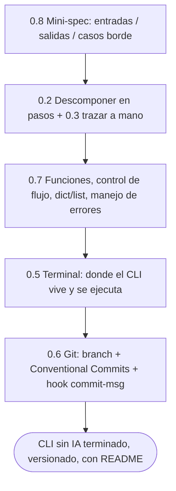

import Reto from "@components/Reto.astro";
import Solucion from "@components/Solucion.astro";
import Quiz from "@components/Quiz.astro";
import CheckDominio from "@components/CheckDominio.astro";
import Nivel from "@components/Nivel.astro";

<Nivel nivel="básico" />

Llegaste al final de la Fase 0. Las siete sub-unidades anteriores fueron piezas sueltas: trazar código a mano, mover archivos en la terminal, versionar con Git, escribir funciones que validan su entrada. **Este capstone las ensambla en una sola cosa que funciona.** No es un ejercicio de juguete con tests que alguien más escribió: es una herramienta de línea de comandos que **tú** vas a usar de verdad, diseñada desde una mini-spec y escrita **100% sin IA**.

Es, literalmente, tu prueba de autonomía. Si puedes pensar este proyecto de principio a fin sin pedirle a un modelo que lo razone por ti, recuperaste lo que la dependencia de IA te quitó. Si no puedes, este proyecto te dice exactamente dónde están los huecos —y eso también es ganar.

:::tip[Si ya programaste antes]
Quizás ya escribiste CLIs y esto te suena trivial. No lo saltes: el capstone no mide si *sabes* hacer un CLI, mide si lo haces con **disciplina de ingeniería** (spec primero, ADR de tus decisiones, Conventional Commits, demo que corre) y **sin delegar el pensamiento**. Úsalo como validación: si lo cierras cumpliendo el Definition of Done de abajo sin abrir una IA para razonar, marca la casilla de la [portada de la fase](/fase-0-fundamentos/) y avanza. Si te descubres "pidiéndole la estructura a un modelo", ahí está justo el músculo que viniste a reconstruir.
:::

## 1. Qué vas a saber hacer

Al cerrar este capstone, sin IA, podrás:

- **O1 — Diseñar** una herramienta pequeña partiendo de una **mini-spec** (entradas, salidas, casos borde) escrita *antes* de programar, y justificar tus decisiones técnicas en un **ADR**.
- **O2 — Implementar** un CLI que parsee argumentos, ejecute comandos, valide entradas y devuelva **códigos de salida honestos** y mensajes a `stderr`, todo sin asistencia de IA.
- **O3 — Entregar** el proyecto al estándar mínimo del mercado: **demo que corre**, **README** que cualquiera puede seguir, e historial con **Conventional Commits** —y explicar los **trade-offs** que tomaste.

## 2. Por qué importa (el dinero está aquí)

> 💰 **Por qué importa:** un repo que arranca con una spec, tiene commits limpios y un README que explica cómo correrlo es lo primero que mira un reclutador técnico —antes que el código. Es la diferencia entre "hizo un tutorial" y "sabe trabajar".

Hay dos motivos concretos, los dos plata:

- **En la entrevista.** "Cuéntame de un proyecto que hayas construido" es la pregunta más común. La respuesta de un junior es "seguí un curso de YouTube". La de un semi-senior es "tenía este problema, escribí la spec así, elegí esta herramienta por esto, y aquí está corriendo". Este capstone te da esa segunda historia, **con evidencia en GitHub**.
- **En el día a día.** Un AI/Automation Engineer escribe herramientas de línea de comandos *todo el tiempo*: scripts que mueven datos, que llaman a una API, que orquestan un pipeline. El CLI es el formato nativo del oficio. Empezar a construirlos con disciplina ahora —spec, errores honestos, versionado— es el hábito que vas a repetir cien veces.

Y el tercero, el más importante para ti específicamente: este proyecto es donde compruebas que **puedes generar código por ti mismo otra vez**. Esa es la meta entera de la Fase 0.

## 3. Lo que ya traes (actívalo)

Este capstone no introduce nada nuevo: **es la suma de la Fase 0**. Antes de empezar, recupera de memoria de dónde sale cada pieza.



| Pieza del capstone | Sale de | Qué reusas |
|---|---|---|
| Escribir la spec antes de codear | [0.8 Spec-first](/fase-0-fundamentos/0-8-spec-first-y-stack-traces/) | El contrato de entradas/salidas/casos borde |
| Partir el problema en pasos | [0.2 Pensamiento computacional](/fase-0-fundamentos/0-2-pensamiento-computacional/) | Descomposición y reconocimiento de patrones |
| Predecir/depurar sin debugger | [0.3 Notional machine](/fase-0-fundamentos/0-3-notional-machine-trazado/) | Trazar a mano cuando algo falla |
| El código en sí | [0.7 Fundamentos](/fase-0-fundamentos/0-7-fundamentos-programacion/) | Funciones, `dict`/`list`, validación, `try`/`except` |
| Dónde corre | [0.5 Terminal y Linux](/fase-0-fundamentos/0-5-terminal-y-linux/) | Argumentos, `stdout`/`stderr`, exit codes, env vars |
| Cómo lo versionas | [0.6 Git y GitHub](/fase-0-fundamentos/0-6-git-y-github/) | Branch, Conventional Commits, hook `commit-msg` |

Antes de seguir, una de retrieval:

<Quiz
  question="Tu CLI termina sin problemas. ¿Con qué código de salida debe terminar el proceso, y a qué flujo van los mensajes de error?"
  options={[
    "Exit 1 siempre; todo a stdout",
    "Exit 0 en éxito (≠0 en error); los errores a stderr, el dato útil a stdout",
    "No importa el código; los errores a stdout para que se vean",
  ]}
  answer={1}
  explanation="Convención de Unix (la viste en 0.5): exit 0 = éxito, ≠0 = falla; el dato que otro programa podría consumir va a stdout, los diagnósticos a stderr. Respetarlo es lo que hace tu CLI 'componible' con pipes."
/>

## 4. Ejemplo resuelto, pensado en voz alta

No voy a construir tu proyecto —ese es el punto—. Voy a **modelar el proceso** con un ejemplo distinto y pequeño, para que veas cómo razona alguien que diseña una herramienta antes de tocar el editor. Sígueme el pensamiento, no copies el resultado.

Mi problema de ejemplo: *"mi carpeta de Descargas es un caos; quiero un comando que mueva cada archivo a una subcarpeta según su extensión."* Lo llamaré `organiza`.

### 4.1 Primero la spec, no el código

Antes de escribir una sola línea de Python, escribo la mini-spec. Esto es [0.8](/fase-0-fundamentos/0-8-spec-first-y-stack-traces/) en acción: si no sé qué entra, qué sale y qué puede salir mal, no estoy listo para programar.

```text
# SPEC — organiza
Propósito: ordenar una carpeta moviendo cada archivo a subcarpetas por extensión.

Comandos:
  organiza ordenar <carpeta>     mueve archivos a <carpeta>/<ext>/
  organiza simular <carpeta>     muestra qué haría, sin mover nada (dry-run)

Entrada:   ruta de una carpeta existente.
Salida:    a stdout, una línea por archivo movido ("a.pdf -> pdf/a.pdf").
Config:    variable de entorno ORGANIZA_IGNORAR (extensiones a saltar, separadas por coma).

Casos borde:
  - la carpeta no existe        -> error a stderr, exit 2
  - no se pasa carpeta          -> mensaje de uso a stderr, exit 2
  - archivo sin extensión       -> subcarpeta "sin_extension"
  - ya existe un archivo igual en destino -> no sobrescribir, avisar, exit 1
  - carpeta vacía               -> no es error: imprime "nada que ordenar", exit 0
```

Pienso en voz alta: *"El comando `simular` (dry-run) lo agrego porque mover archivos es destructivo y quiero poder ver qué hará antes de confiar. Los casos borde son la mitad del trabajo: el de 'ya existe en destino' es el que más fácil se me olvidaría, y es justo el que perdería datos. Escribirlos ahora es más barato que descubrirlos cuando borre algo."*

### 4.2 La decisión técnica va a un ADR

Tengo una decisión que defender: ¿uso `argparse` (viene con Python) o una librería externa como `click`/`typer`? La anoto en un **ADR** (Architecture Decision Record), una notita de tres párrafos: contexto, decisión, consecuencias.

```text
# ADR-0001 — Parser de argumentos: argparse

Contexto: necesito subcomandos (ordenar/simular) y validación de argumentos.
Decisión: uso argparse de la stdlib, no una dependencia externa.
Consecuencias:
  (+) cero dependencias: el script corre con un Python pelado, fácil de compartir.
  (+) aprendo el mecanismo de base antes de usar azúcar sintáctica encima.
  (-) más verboso que typer; lo acepto porque es F0 y el objetivo es entender, no la ergonomía.
```

*"El ADR no es burocracia: es para que en tres meses —o en una entrevista— pueda decir **por qué** elegí esto, en vez de 'porque sí'. Una decisión sin razón escrita es una decisión que no tomé, me tropecé con ella."*

### 4.3 La estructura, descompuesta

Ahora descompongo ([0.2](/fase-0-fundamentos/0-2-pensamiento-computacional/)): el programa tiene tres responsabilidades separadas, una función cada una.

```python
#!/usr/bin/env python3
"""organiza — ordena una carpeta moviendo archivos por extensión."""
import argparse
import os
import shutil
import sys
from pathlib import Path


def planear(carpeta: Path, ignorar: set[str]) -> list[tuple[Path, Path]]:
    """Devuelve la lista de movimientos (origen, destino). No toca el disco."""
    movimientos = []
    for archivo in carpeta.iterdir():
        if not archivo.is_file():
            continue
        ext = archivo.suffix.lstrip(".").lower() or "sin_extension"
        if ext in ignorar:
            continue
        movimientos.append((archivo, carpeta / ext / archivo.name))
    return movimientos


def ejecutar(movimientos: list[tuple[Path, Path]], simular: bool) -> int:
    """Realiza (o simula) los movimientos. Devuelve el exit code."""
    codigo = 0
    for origen, destino in movimientos:
        if destino.exists():
            print(f"saltado (ya existe): {destino.name}", file=sys.stderr)
            codigo = 1
            continue
        print(f"{origen.name} -> {destino.parent.name}/{destino.name}")
        if not simular:
            destino.parent.mkdir(parents=True, exist_ok=True)
            shutil.move(str(origen), str(destino))
    return codigo


def main(argv: list[str] | None = None) -> int:
    parser = argparse.ArgumentParser(description="ordena una carpeta por extensión")
    sub = parser.add_subparsers(dest="comando", required=True)
    for nombre in ("ordenar", "simular"):
        p = sub.add_parser(nombre)
        p.add_argument("carpeta", type=Path)
    args = parser.parse_args(argv)

    if not args.carpeta.is_dir():
        print(f"error: la carpeta no existe: {args.carpeta}", file=sys.stderr)
        return 2

    ignorar = set(filter(None, os.environ.get("ORGANIZA_IGNORAR", "").lower().split(",")))
    movimientos = planear(args.carpeta, ignorar)
    if not movimientos:
        print("nada que ordenar")
        return 0
    return ejecutar(movimientos, simular=(args.comando == "simular"))


if __name__ == "__main__":
    sys.exit(main())
```

Razono mientras lo escribo: *"Separo `planear` (decide qué mover, sin tocar nada) de `ejecutar` (toca el disco). ¿Por qué? Porque `planear` no tiene efectos secundarios: lo puedo probar fácil y lo reuso para el dry-run **sin duplicar lógica**. El `simular` es el mismo `ejecutar` con un `if not simular`. Esa separación —decidir vs. actuar— es un patrón que voy a ver en todo el curso, hasta en agentes de IA."*

Y sobre los errores: *"Cada caso borde de la spec tiene su línea: carpeta inexistente → `return 2`; destino ocupado → aviso a stderr y `codigo = 1`; carpeta vacía → mensaje y `return 0` (no es un error). El exit code cuenta una historia honesta de qué pasó."*

### 4.4 La demo que corre

Una herramienta que no corre no existe. La pruebo de verdad:

```bash
$ python organiza.py simular ~/Descargas
informe.pdf -> pdf/informe.pdf
foto.jpg -> jpg/foto.jpg
$ python organiza.py ordenar ~/Descargas
informe.pdf -> pdf/informe.pdf
foto.jpg -> jpg/foto.jpg
$ echo $?
0
```

*"`simular` primero, para ver qué hará; recién después `ordenar`. Y reviso `$?` (el exit code) para confirmar que terminó en 0. Esta sesión de terminal —que corre— es la 'demo en vivo' que pide el Definition of Done."*

### 4.5 El historial cuenta la historia

Mientras construyo, voy commiteando en pasos pequeños con Conventional Commits ([0.6](/fase-0-fundamentos/0-6-git-y-github/)), con el hook `commit-msg` vigilando:

```text
docs: agrega SPEC y ADR-0001 (eleccion de argparse)
feat: planea movimientos por extension (sin tocar disco)
feat: ejecuta movimientos con modo simular (dry-run)
fix: no sobrescribir si el destino ya existe
docs: agrega README con instalacion y uso
```

*"El historial se lee como un resumen del proyecto. Cada commit es un paso que corre; ninguno es 'wip arregla cosas'. Eso es lo que un revisor recorre primero."*

## 5. Errores que vas a tener (y por qué)

:::caution[Podrías pensar que "100% sin IA" significa no usar el autocompletado del editor]
No. La regla del [Primero-Sin-IA](/fase-0-fundamentos/0-1-mentalidad-y-metodo/) es sobre **no delegar el pensamiento**: el diseño, la estructura, la lógica, los casos borde los piensas tú. Puedes usar `man`, la documentación oficial, y el autocompletado básico de tu editor. Lo prohibido es "Copilot, escríbeme el CLI" o "ChatGPT, ¿cómo estructuro esto?". La IA, si acaso, entra **al final** a *revisar* lo que ya hiciste. Si quitarte el chat de IA te deja en blanco frente al problema, ese vacío es exactamente lo que el capstone vino a llenar.
:::

:::caution[Podrías pensar que escribir la spec después "es lo mismo"]
No es lo mismo. Escribir la spec *después* de codear es documentar lo que hiciste; escribirla *antes* es **decidir** lo que vas a hacer. El valor está en que los casos borde aparecen en papel, baratos, antes de que te muerdan en código. Si tu `SPEC.md` tiene la misma fecha de commit que tu última función, te saltaste el ejercicio.
:::

:::caution[Podrías pensar que un capstone tiene que ser grande para "impresionar"]
Al revés. Una herramienta **pequeña, terminada y que corre** vale más que una ambiciosa a medias. Un CLI de 80 líneas con spec, README, errores honestos y commits limpios es un proyecto de portafolio. Un "framework" de 2000 líneas que no compila es un cementerio. Elige un problema chico y real, y termínalo de verdad.
:::

:::caution[Podrías pensar que "demo que corre" es "los tests pasan"]
En la Fase 0 todavía no escribes una suite de tests (eso llega en la [Fase 1](/fase-1-lenguajes/) y se vuelve obligatorio en la 2). "Demo que corre" aquí significa: lo ejecutas en tu terminal, con datos reales, y hace lo que el README promete —idealmente capturado en una sesión de consola o un GIF. Los tests automáticos son la versión robusta de esto que vas a aprender después.
:::

## 6. Antes de soltarte: el andamiaje

Este capstone es **integrador** (consolida toda la Fase 0), así que va casi directo a Primero-Sin-IA. Pero no te lanzo al vacío: aquí está el andamio que se desvanece a medida que avanzas.

### 6.1 Elige tu problema (5 min)

La herramienta tiene que ser **útil para ti** —eso es lo que sostiene la motivación de terminarla. Ideas que han funcionado, todas resolubles con lo de la Fase 0:

- **Bitácora de estudio:** `bitacora add "tema" --min 40` registra tus sesiones en un JSON; `bitacora resumen` suma minutos por semana. (Conecta con el `progreso.md` de [0.1](/fase-0-fundamentos/0-1-mentalidad-y-metodo/).)
- **Gestor de notas/vault:** busca, lista o crea notas markdown en una carpeta por título o tag.
- **Organizador de archivos:** como el `organiza` del ejemplo (¡pero no copies ese, hazlo tuyo!).
- **Divisor de gastos:** registra gastos compartidos y calcula quién le debe a quién.
- **Conversor/renombrador por lotes:** renombra archivos según un patrón con dry-run.

Regla: **un comando que sí vas a usar esta semana**. Si no lo usarías, elige otro.

### 6.2 Ordena los pasos (Parsons del proceso)

Estas son las fases de construcción, **desordenadas**. Antes de empezar, escríbelas en el orden correcto. No es trivial: el orden *es* la disciplina.

```text
   abre un PR (o documenta el merge a main) con el resumen
   escribe el README (instalación + uso + ejemplo)
   escribe la mini-spec (entradas/salidas/casos borde)
   crea el repo, instala el hook commit-msg, primer commit
   implementa el comando principal y pruébalo en la terminal
   escribe un ADR de tu decisión técnica principal
   implementa los casos borde de la spec uno por uno
```

<Solucion title="Ver el orden correcto del proceso">

1. **crea el repo, instala el hook `commit-msg`, primer commit** — la infraestructura primero; el hook tiene que vigilar *desde el commit #1*.
2. **escribe la mini-spec** — decides *qué* antes de *cómo*. Commit: `docs: agrega SPEC`.
3. **escribe un ADR de tu decisión técnica principal** — justificas la elección de herramienta/estructura antes de casarte con ella.
4. **implementa el comando principal y pruébalo en la terminal** — el "happy path" que corre. Commit `feat:`.
5. **implementa los casos borde de la spec uno por uno** — cada uno un commit `feat:`/`fix:`; aquí es donde la spec se paga sola.
6. **escribe el README** — para que otro (o tú en 3 meses) pueda correrlo sin preguntarte nada.
7. **abre un PR (o documenta el merge a main) con el resumen** — cierras con el write-up de trade-offs.

La trampa más común es empezar por el paso 4 (codear) y dejar spec/ADR/README para "después" —que nunca llega. La disciplina es justamente hacer 1-2-3 *antes* de la primera función.

</Solucion>

### 6.3 Plantillas para arrancar

En la carpeta del ejercicio tienes plantillas listas (`SPEC.md`, `ADR-0001`, el hook `commit-msg` que construiste en 0.6, y un esqueleto de CLI con `argparse`). Cópialas y rellénalas —no las uses como muleta para saltarte el pensar, úsalas para no perder tiempo en la ceremonia.

## 7. El capstone

Aquí no hay andamiaje. Es tu proyecto, tu prueba. **Sin IA para pensarlo.**

<Reto title="Construye tu CLI sin IA" timebox="proyecto · 6–10 h repartidas en ~1 semana">

Diseña y construye una herramienta de línea de comandos **útil para ti**, **100% sin IA** (sin pedirle a un modelo el diseño, la estructura ni el código; la IA, si acaso, solo revisa al final). El proyecto vive en un repo Git con el hook `commit-msg` activo desde el primer commit.

**Entregable:** un repositorio (puede ser la carpeta `ejercicios/fase-0/capstone-cli-sin-ia/` o un repo nuevo en tu GitHub) que contenga:

- `SPEC.md` — la mini-spec (entradas, salidas, casos borde), escrita **antes** de codear.
- `docs/ADR-0001-*.md` — al menos un ADR de tu decisión técnica principal.
- El código del CLI (un solo archivo está perfecto; no lo infles).
- `README.md` — qué es, cómo se instala, cómo se usa, con un ejemplo que se pueda copiar y pegar.
- Una **demo que corre**: una sesión de terminal pegada en el README (o un GIF/asciinema).
- Historial Git con **Conventional Commits** (todos válidos según tu hook).
- Al cierre, un breve **write-up de trade-offs** (3–5 líneas: qué elegí, qué dejé fuera, qué fue lo más difícil).

**Hecho significa** (esto es el Definition of Done de la fase aplicado a tu proyecto):

- [ ] La `SPEC.md` existe y se escribió **antes** que el código (commit anterior a la primera función).
- [ ] Hay al menos un **ADR** que justifica una decisión técnica real (no "elegí Python porque sí").
- [ ] El CLI **corre** y hace lo que el README promete (demo pegada que lo prueba).
- [ ] Maneja sus **casos borde**: argumento faltante, entrada inválida y al menos un caso "vacío" devuelven mensajes claros a `stderr` y **exit codes honestos**.
- [ ] El **README** permite a un desconocido instalarlo y usarlo sin preguntarte nada.
- [ ] Todo el historial usa **Conventional Commits** (el hook los validó).
- [ ] Está escrito **100% sin IA** para razonar; puedes explicar **cada línea sin notas**.
- [ ] Escribiste el **write-up de trade-offs**.

Enunciado completo, plantillas (`SPEC`, `ADR`, hook, esqueleto) y cómo pedir la corrección: `ejercicios/fase-0/capstone-cli-sin-ia/` (carpeta del repo).

<Solucion title="Pista (ábrela solo si te trabas, no es la solución)">

Si te paralizas frente a la página en blanco, casi siempre es porque saltaste la spec. Vuelve atrás: escribe en texto plano *"el comando `X` recibe `Y` y produce `Z`; si pasa `W`, falla con mensaje `M`"*. Cuando tengas 3–4 de esas líneas, ya tienes la estructura: una función por verbo, una rama por caso borde. Para el "demo que corre", empieza por el camino feliz más chico posible (un solo comando, sin opciones) y haz que corra **antes** de agregar nada. Un CLI que hace una cosa bien supera a uno que intenta cinco y no arranca. Esto es una pista del *proceso*, no de tu solución —esa la diseñas tú.

</Solucion>

</Reto>

### 7.1 Cómo se evalúa (criterios mapeados al Definition of Done)

Tu corrector IA (o tú mismo, honesto) mide el proyecto contra **el mismo Definition of Done que comparten todos los capstones del curso** ([portada de la fase](/fase-0-fundamentos/)). En la Fase 0 aplican estos puntos; el resto se siembra ahora y se exige en fases posteriores.

| Punto del DoD (§B) | En este capstone | ¿Aplica en F0? |
|---|---|---|
| 1. Spec + ADRs | `SPEC.md` antes de codear + ADR-0001 | ✅ Obligatorio |
| 8. Demo que CORRE + README + write-up de trade-offs | sesión de terminal + README usable + 3–5 líneas de trade-offs | ✅ Obligatorio |
| 9. Conventional Commits en todo el historial | validados por el hook de 0.6 | ✅ Obligatorio |
| — Escrito 100% sin IA (gate de la Fase 0) | el pensamiento es tuyo; lo defiendes sin notas | ✅ Obligatorio |
| 2. Tests verdes + lint en CI | — semilla: tu "demo que corre" es la versión manual | 🌱 Llega en F1–F2 |
| 3. Seguridad (OWASP) | — semilla: valida la entrada del usuario, no confíes en rutas a ciegas | 🌱 Llega en F3 |
| 4. Observabilidad (logs/trazas) | — semilla: mensajes claros a `stderr`, exit codes honestos | 🌱 Llega en F5 |
| 7. Estados completos / a11y | — semilla: maneja vacío/error/éxito con UX de CLI clara | 🌱 (UI llega en F4) |

> El corrector no te da una nota numérica: te dice en qué nivel estás por criterio (incompleto / en-progreso / competente / excelente) y cuál es tu siguiente paso. La vara completa está en `.ai/rubricas/fase-0/capstone-cli-sin-ia.md`.

## 8. Check de dominio

Sin mirar la lección, responde (en voz alta o por escrito):

<CheckDominio
  items={[
    "Explicar por qué se escribe la mini-spec ANTES del código, no después.",
    "Decir qué va a stdout y qué va a stderr en un CLI, y por qué importa.",
    "Justificar una decisión técnica de tu proyecto como lo harías en un ADR (contexto / decisión / consecuencias).",
    "Explicar qué significa 'exit code honesto' con dos ejemplos de tu CLI (un éxito y un error).",
    "Defender por qué 'demo que corre' no es lo mismo que 'tiene tests' en la Fase 0.",
    "Recorrer tu propio historial de commits y explicar qué hace cada uno, sin notas.",
  ]}
/>

Si dudaste en alguno, ese es tu próximo repaso. El más temido en una entrevista es el último: si no puedes explicar tu propio código y tus propios commits sin notas, es señal de que algo lo pensó por ti.

<Quiz
  question="¿Cuál de estos historiales delata que el proyecto NO se construyó con disciplina spec-first?"
  options={[
    "docs: agrega SPEC → feat: comando principal → fix: caso borde vacío → docs: README",
    "feat: todo el CLI funcionando → docs: agrega SPEC y README al final",
    "docs: SPEC → docs: ADR-0001 → feat: planear → feat: ejecutar → docs: README",
  ]}
  answer={1}
  explanation="El segundo mete todo el CLI en un solo commit gigante y la spec/README al final: la spec se escribió DESPUÉS, así que no guió nada. Un historial sano muestra la spec primero y pasos pequeños que corren."
/>

## 9. Recursos (documentación oficial primero)

- **`argparse` — parser de CLI de la stdlib de Python** — [docs.python.org/3/library/argparse.html](https://docs.python.org/3/library/argparse.html) y el [tutorial oficial de argparse](https://docs.python.org/3/howto/argparse.html). Cero dependencias, ideal para este capstone.
- **`pathlib` — rutas modernas** — [docs.python.org/3/library/pathlib.html](https://docs.python.org/3/library/pathlib.html).
- **Conventional Commits 1.0.0 (spec oficial)** — [conventionalcommits.org](https://www.conventionalcommits.org/es/v1.0.0/) (hay versión en español).
- **Architecture Decision Records (formato original de Michael Nygard)** — [adr.github.io](https://adr.github.io/) — para escribir tu ADR.
- **`[project.scripts]` en `pyproject.toml` (empaquetar tu CLI como comando)** — [Python Packaging User Guide: entry points](https://packaging.python.org/en/latest/specifications/entry-points/) — opcional, si quieres que tu herramienta se instale como un comando del sistema.
- **Command Line Interface Guidelines** — [clig.dev](https://clig.dev/) — principios de buen diseño de CLIs (en inglés; lectura de oro para el write-up).

## 10. Conexión con lo que viene

Este capstone **es** la prueba de salida de la Fase 0: si lo cerraste cumpliendo el Definition of Done sin delegar el pensamiento, recuperaste tu autonomía de ingeniería. Esa es la fundación de todo el curso.

Hacia adelante, este mismo proyecto germina:

- En la **[Fase 1](/fase-1-lenguajes/)** reescribirás una mini-app en **dos lenguajes** (Python y TypeScript) —y aquí ya practicaste el ciclo spec → código → demo que lo hace posible.
- En la **Fase 2** este CLI (o uno parecido) recibe una **suite de tests** y un refactor con SOLID: tu "demo que corre" se vuelve "tests verdes en CI".
- El hábito **spec + ADR + Conventional Commits** que estrenas aquí no se suelta más: es el punto 1 y 9 del Definition of Done de **todos** los capstones, hasta la plataforma RAG de la Fase 6 y la automatización agéntica de la Fase 7.

No construiste un script desechable. Construiste el **primer eslabón** de un portafolio y el primer músculo de un hábito.

## 11. Reflexión y repaso espaciado

:::note[Para tu RETROSPECTIVA.md de la fase]
Responde con honestidad brutal: **¿en qué momento del capstone sentiste el impulso de pedirle a una IA que lo resolviera, y qué hiciste?** Si lo resististe, ¿qué descubriste que podías hacer solo? Si cediste, ¿en qué parte exacta se te apagó la cabeza? Esa frase es el mapa de tu próximo trabajo.
:::

**Gancho de spaced repetition:**

- **Mañana:** sin abrir tu repo, reescribe **de memoria** tu `SPEC.md` (los comandos y los casos borde). Compáralo con el real. Lo que olvidaste es lo que no internalizaste.
- **En 3 días:** agrega **un caso borde nuevo** que no estaba en la spec original (con su commit `feat:`/`fix:`). Si te cuesta más que la primera vez, releíste sin practicar.
- **En 1 semana:** explícale tu CLI a alguien (o a una grabación) en 2 minutos: qué problema resuelve, por qué lo estructuraste así, qué trade-off tomaste. Ese es, palabra por palabra, el formato de la respuesta de entrevista "cuéntame de un proyecto". Practicarlo ahora vale plata después.
