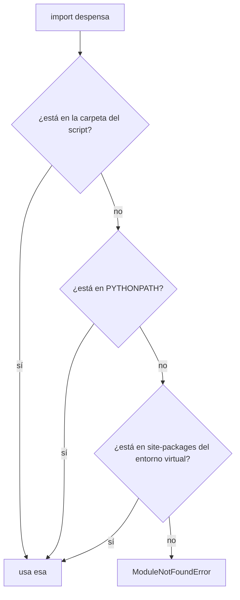

import Reto from "@components/Reto.astro";
import Solucion from "@components/Solucion.astro";
import Quiz from "@components/Quiz.astro";
import CheckDominio from "@components/CheckDominio.astro";
import Nivel from "@components/Nivel.astro";

<Nivel nivel="básico" />

En la Fase 0 aprendiste a **pensar** como programa: trazar un bucle en papel, predecir una salida, razonar el scope. Esta sub-unidad da el siguiente paso: convertir ese pensamiento en **Python real, idiomático y organizado en un proyecto que corre**. No es "los mismos temas otra vez": es la diferencia entre escribir Python que *funciona* y escribir Python que un revisor mira y dice "esta persona sabe el lenguaje".

Vas a cubrir tres cosas que en la Fase 0 quedaron implícitas o fuera de cuadro:

1. **Idiomático** — la forma *Pythonic* de hacer lo que ya sabes hacer a la fuerza (iterar, formatear texto, filtrar, validar).
2. **Módulos y paquetes** — cómo se parte un programa en archivos que se importan entre sí. Tu código deja de ser un solo `.py` gigante.
3. **Entornos virtuales** — cómo aíslas las dependencias de un proyecto para que "en mi máquina funciona" deje de ser una excusa. Aquí entra `venv` y `uv`.

:::tip[Si ya tocaste Python antes]
Si ya escribiste Python y reconoces `enumerate`, `__init__.py` y `venv`, no te saltes la lección: úsala como **diagnóstico**. Ve directo a los dos ejercicios Primero-Sin-IA (sección 7) y resuélvelos sin IA. Si cierras el de empaquetado en el timebox y puedes explicar de memoria *por qué* un entorno virtual aísla dependencias, valida con el check de dominio (sección 8) y avanza a la siguiente sub-unidad desde el [índice de la Fase 1](/fase-1-lenguajes/). Si te trabas en módulos/paquetes o en `uv`, esas son justo las dos que casi nadie formaliza bien: quédate.
:::

## 1. Qué vas a saber hacer

Al terminar, sin IA y sin notas, podrás:

- **O1 — Implementar** una función Python **idiomática** (f-strings, truthiness, `enumerate`/`zip`, comprehensions) que pase una suite de tests, eligiendo la estructura de datos correcta.
- **O2 — Organizar** código en **módulos** y un **paquete** importable (`import`, `__init__.py`, `if __name__ == "__main__"`), y **explicar** la diferencia entre módulo y paquete y cómo Python resuelve un `import`.
- **O3 — Crear y usar** un **entorno virtual** aislado (con `venv` y con `uv`) y **explicar el trade-off**: por qué aislar dependencias por proyecto evita el "works on my machine".

## 2. Por qué importa (el dinero está aquí)

> 💰 **Por qué importa:** Python es el lenguaje de la IA y el filtro de entrada de casi cualquier rol de AI/Automation Engineer. Pero "saber Python" en una entrevista **no** es trazar un `for` — eso es Fase 0. Es escribir código que se lee idiomático y montar un proyecto que corre en una máquina limpia.

Hay dos señales de mercado concretas en esta lección:

- **Idiomático = señal de seniority.** Dos candidatos resuelven el mismo problema; uno escribe `for i in range(len(lista)): print(lista[i])` y el otro `for elemento in lista: print(elemento)`. El segundo no es "más listo": conoce el lenguaje. Los revisores leen ese acento en segundos, igual que tú notas a alguien que habla inglés de memoria vs. con fluidez.
- **Entornos = la diferencia entre un demo que corre y uno que no.** El capstone de esta fase, todo proyecto de IA, y cada PR que mandes dependen de que tu código **se instale y arranque en otra máquina**. El bug más común y más vergonzoso de un junior es "en mi compu andaba". Aislar dependencias con `venv`/`uv` es la vacuna, y es barata de aprender ahora y carísima de no tener.

## 3. Lo que ya traes (actívalo)

Esta sub-unidad se para sobre la Fase 0. Reúsalo:

- De [`0.7` Fundamentos de programación](/fase-0-fundamentos/0-7-fundamentos-programacion/): los seis ladrillos (tipos, control de flujo, funciones/scope, estructuras, recursión, errores). Aquí los **escribimos idiomáticos**, no los re-explicamos desde cero.
- De [`0.5` Terminal y Linux](/fase-0-fundamentos/0-5-terminal-y-linux/): vas a correr comandos (`python`, `source`, `uv`) y a moverte entre carpetas. El entorno virtual se crea y se activa **desde la terminal**.
- De [`0.6` Git](/fase-0-fundamentos/0-6-git-y-github/): la carpeta `.venv/` **nunca** se commitea (va en `.gitignore`). El código sí; el entorno se reconstruye.

Antes de seguir, responde de memoria:

<Quiz
  question="En Python, ¿qué imprime `for i in range(len(['a','b','c'])): print(i)`?"
  options={[
    "a, b, c",
    "0, 1, 2",
    "1, 2, 3",
  ]}
  answer={1}
  explanation="range(len(...)) te da los ÍNDICES (0, 1, 2), no los elementos. Por eso es más feo que iterar directo sobre la lista: si quieres el elemento, tienes que escribir lista[i]. Lo arreglamos en la sección 4 con enumerate."
/>

## 4. Ejemplo resuelto, pensado en voz alta

Voy a construir, de cero, un pequeño paquete que gestiona el inventario de una despensa (el mismo dominio del capstone). En el camino reescribo los seis ladrillos de la Fase 0 **a la Pythonic**, los parto en módulos, y lo corro dentro de un entorno virtual. **No leas esto como un resultado: léelo como me oirías razonar si estuviera al lado tuyo.**

Trabajo con estos datos de ejemplo:

```python
productos = [
    {"nombre": "café",   "precio": 2500, "stock": 3},
    {"nombre": "té",     "precio": 1800, "stock": 0},
    {"nombre": "azúcar", "precio": 1200, "stock": 5},
]
```

### 4.1 Texto idiomático: f-strings, no concatenación

Quiero una línea legible por producto. La forma de junior que arrastra otros lenguajes:

```python
linea = producto["nombre"] + " — $" + str(producto["precio"])   # frágil y feo
```

La forma Pythonic es la **f-string** (f de *formatted*): pones una `f` antes de la comilla y metes expresiones entre llaves.

```python
nombre = producto["nombre"]
linea = f"{nombre} — ${producto['precio']}"   # "café — $2500"
```

Pienso en voz alta: *"La f-string evalúa lo de dentro de las llaves y lo convierte a texto sola — no necesito `str(...)`. Y leo la plantilla de un vistazo, sin contar `+`. Ojo con las comillas: la f-string usa comillas dobles, así que adentro uso comillas simples para la clave del dict."*

### 4.2 Control de flujo idiomático: itera el objeto, no el índice

En la Fase 0 escribiste bucles con `range`. Eso sirve cuando necesitas el número de la vuelta, pero para **recorrer una colección**, Python itera el objeto directo:

```python
# C-style (lo que arrastras): índice manual
for i in range(len(productos)):
    print(productos[i]["nombre"])

# Pythonic: itera el elemento
for producto in productos:
    print(producto["nombre"])
```

¿Y si necesito **el número de línea Y el elemento**? No fabrico un contador a mano: uso `enumerate`.

```python
for numero, producto in enumerate(productos, start=1):
    print(f"{numero}. {producto['nombre']}")
# 1. café
# 2. té
# 3. azúcar
```

Razono: *"`enumerate` me devuelve pares `(índice, elemento)`. Con `start=1` la cuenta arranca en 1 en vez de 0 — perfecto para mostrarle al humano. Desempaco el par en dos variables (`numero, producto`) en el mismo `for`."*

Y si tengo **dos listas en paralelo** y quiero recorrerlas juntas, uso `zip`:

```python
nombres = ["café", "té"]
precios = [2500, 1800]
for nombre, precio in zip(nombres, precios):
    print(f"{nombre}: ${precio}")
```

Otra: la **truthiness**. Para preguntar "¿está vacía la lista?" no escribo `if len(productos) == 0:`. Una lista vacía ya es *falsy*:

```python
if not productos:          # vacía -> True
    return {}
```

### 4.3 Funciones idiomáticas: contrato claro, valores que se desempacan

Una función Pythonic dice su contrato con un **docstring** y, cada vez más, con **type hints** (los formalizas en `1.4`; aquí los uso como documentación viva). Puede devolver **varias cosas** como una tupla, que el llamador desempaca:

```python
def precio_min_max(productos):
    """Devuelve (precio_mínimo, precio_máximo) de la lista de productos."""
    precios = [p["precio"] for p in productos]
    return min(precios), max(precios)

barato, caro = precio_min_max(productos)   # desempaco la tupla
```

:::danger[El bug clásico: argumento por defecto mutable]
Nunca pongas una lista o un dict como valor por defecto de un parámetro:

```python
def agregar(item, carrito=[]):     # 🐛 TRAMPA
    carrito.append(item)
    return carrito
```

El `[]` se crea **una sola vez**, cuando se define la función, y se **comparte** entre todas las llamadas. La segunda vez que llames `agregar("té")` sin pasar carrito, encontrarás el `"café"` de la llamada anterior. La forma correcta:

```python
def agregar(item, carrito=None):
    if carrito is None:
        carrito = []
    carrito.append(item)
    return carrito
```

Este bug aparece en entrevistas justamente porque separa a quien memorizó sintaxis de quien entiende cuándo se evalúa el default.
:::

### 4.4 Estructuras idiomáticas: comprehensions y métodos de dict

La Fase 0 te dio `list`, `dict`, `set`, `tuple`. Lo idiomático es construir colecciones con **comprehensions** en vez de un bucle que hace `append`:

```python
# Lo que arrastras:
agotados = []
for p in productos:
    if p["stock"] == 0:
        agotados.append(p["nombre"])

# Pythonic (mismo resultado, una línea legible):
agotados = [p["nombre"] for p in productos if p["stock"] == 0]   # ["té"]
```

Lee la comprehension como una frase: *"el nombre de cada `p` en productos, donde el stock es 0"*. Para **sumar** sin construir la lista intermedia, paso un *generator* a `sum`:

```python
valor_total = sum(p["precio"] * p["stock"] for p in productos)   # 13500
total_unidades = sum(p["stock"] for p in productos)              # 8
```

Y para recorrer un `dict` por clave y valor a la vez, `.items()`:

```python
resumen = {"unidades": 8, "valor": 13500}
for clave, valor in resumen.items():
    print(f"{clave}: {valor}")
```

Junto todo en una función que devuelve el resumen del inventario:

```python
def resumen_inventario(productos):
    """Resume una lista de productos {nombre, precio, stock}."""
    if not productos:
        return {"unidades": 0, "valor": 0, "agotados": []}
    return {
        "unidades": sum(p["stock"] for p in productos),
        "valor": sum(p["precio"] * p["stock"] for p in productos),
        "agotados": [p["nombre"] for p in productos if p["stock"] == 0],
    }
```

Lo trazo mentalmente con los datos de arriba: unidades `3+0+5 = 8`, valor `7500+0+6000 = 13500`, agotados `["té"]`. *"Si no puedo calcular esto a mano sin ejecutar, no entendí la función — entendí que existe."* (Ese músculo es la Fase 0; no lo sueltes.)

### 4.5 Módulos y paquetes: parte el programa en archivos

Hasta ahora todo vive en un `.py`. Un programa real se parte. Dos conceptos:

- Un **módulo** es **un archivo `.py`**. Su nombre es el del archivo sin extensión. Cuando haces `import inventario`, Python ejecuta `inventario.py` una vez y te deja usar lo que definió como `inventario.resumen_inventario(...)`.
- Un **paquete** es **una carpeta** que agrupa módulos. Para que Python la trate como paquete (de la forma clásica), lleva un archivo `__init__.py` adentro (puede estar vacío; se ejecuta al importar el paquete).

Organizo así la despensa:

```text
despensa/
├── __init__.py      ← marca la carpeta como paquete; puede re-exportar
├── inventario.py    ← módulo con la lógica (resumen_inventario, formatear_lineas)
└── __main__.py      ← punto de entrada: permite `python -m despensa`
```

El `__init__.py` puede **re-exportar** para dar una fachada limpia: que quien use el paquete escriba `from despensa import resumen_inventario` sin saber en qué módulo vive.

```python
# despensa/__init__.py
from despensa.inventario import resumen_inventario, formatear_lineas
```

Ahora, la línea más malentendida de Python: `if __name__ == "__main__":`. Cada módulo tiene una variable mágica `__name__`. Cuando **ejecutas** el archivo directo (`python inventario.py`), Python le pone `__name__ == "__main__"`. Cuando lo **importas** desde otro archivo, `__name__` es el nombre del módulo (`"despensa.inventario"`). El idioma:

```python
# despensa/inventario.py  (al final)
if __name__ == "__main__":
    # Esto SOLO corre si ejecuto este archivo directo, NO al importarlo.
    demo = [{"nombre": "café", "precio": 2500, "stock": 3}]
    print(resumen_inventario(demo))
```

Razono: *"Esto me deja tener una prueba rápida al final del módulo sin que se dispare cada vez que alguien lo importe. Importar un módulo **ejecuta su nivel superior una vez**; el guard `__main__` separa 'soy una librería' de 'me están corriendo como programa'."*

¿Cómo encuentra Python qué importar? Resuelve el `import` buscando, en orden: (1) la carpeta del script que estás ejecutando, (2) los directorios de la variable de entorno `PYTHONPATH`, (3) las librerías instaladas (`site-packages`, de tu entorno virtual). Lo primero que calza, gana. Por eso desde la carpeta que contiene a `despensa/` puedes hacer `from despensa import resumen_inventario`.



### 4.6 Entornos virtuales: aísla las dependencias

Tu Python "del sistema" es uno solo. Si el proyecto A necesita la versión 1 de una librería y el proyecto B la versión 2, instalarlas global es una guerra que alguien pierde. Un **entorno virtual** es una carpeta con una copia/enlace de Python y su **propio** `site-packages`: cada proyecto tiene sus dependencias, aisladas.

**Opción 1 — `venv`, viene con Python:**

```bash
python -m venv .venv          # crea el entorno en la carpeta .venv
source .venv/bin/activate     # actívalo (macOS/Linux). Tu prompt muestra (.venv)
pip install requests          # se instala SOLO en este entorno
deactivate                    # salir del entorno
```

Pienso en voz alta: *"Mientras está activado, `python` y `pip` apuntan al `.venv`, no al sistema. Instalo lo que quiera sin ensuciar la máquina ni otros proyectos. La carpeta `.venv/` se reconstruye; por eso va al `.gitignore` y nunca se commitea."*

**Opción 2 — `uv`, el estándar moderno (rápido, gestiona también la versión de Python):**

```bash
uv init despensa          # crea el proyecto con pyproject.toml
cd despensa
uv add requests           # añade la dependencia (crea .venv y uv.lock)
uv run python -m despensa # corre dentro del entorno, sin activarlo a mano
```

`uv` hace lo mismo que `venv` + `pip`, pero es mucho más rápido, escribe un **lockfile** (`uv.lock`) que congela versiones exactas para que tu compañero reproduzca tu entorno idéntico, y con `uv run` ni siquiera tienes que activar nada. Es la herramienta troncal de este curso.

:::note[venv vs uv — cuál uso]
`venv` siempre está disponible (viene con Python) y es bueno entenderlo porque es el cimiento. `uv` es lo que usarás día a día. No son rivales: `uv` crea por debajo un entorno virtual estándar (`.venv`). Aprende el concepto con `venv`, trabaja con `uv`.
:::

## 5. Errores que vas a tener (y por qué)

:::caution[Podrías pensar que `range(len(lista))` es como se itera en Python]
Funciona, pero es el acento de otro lenguaje. Si quieres el elemento, itera el objeto (`for x in lista`); si quieres índice + elemento, usa `enumerate(lista)`; si recorres dos listas en paralelo, `zip(a, b)`. `range(len(...))` solo se justifica cuando de verdad necesitas el número y nada más.
:::

:::caution[Podrías pensar que `carrito=[]` como default crea una lista nueva cada llamada]
No. El default se evalúa **una vez**, al definir la función, y se comparte entre llamadas (lo viste en 4.3). Usa `None` como centinela y crea la lista adentro. Es el bug de Python más preguntado en entrevistas.
:::

:::caution[Podrías pensar que módulo y paquete son lo mismo]
Un **módulo** es un archivo `.py`. Un **paquete** es una carpeta (clásicamente con `__init__.py`) que agrupa módulos. `import despensa` importa el paquete; `import despensa.inventario` importa un módulo de adentro. Confundirlos es la causa #1 de los `ModuleNotFoundError` del principiante.
:::

:::caution[Podrías pensar que el código bajo `if __name__ == "__main__":` corre siempre]
Corre **solo** cuando ejecutas ese archivo directo. Al importarlo, no. Por eso es el lugar para demos y pruebas rápidas: no se disparan cuando otro módulo te importa. Y al revés: poner ahí lógica que el resto necesita es un bug, porque al importar nunca se ejecuta.
:::

:::caution[Podrías pensar que `pip install` (sin entorno) es lo normal]
Instalar global ensucia tu Python del sistema y enfrenta versiones entre proyectos. La regla: **un entorno virtual por proyecto**. Si un tutorial te dice `sudo pip install`, está enseñándote a romperte la máquina. Crea un `.venv` (o usa `uv`) primero, siempre.
:::

:::caution[Podrías pensar que `from despensa import *` es práctico]
El `import *` arrastra todos los nombres del módulo a tu archivo, choca nombres y oculta de dónde viene cada cosa. Importa explícito lo que usas: `from despensa import resumen_inventario`. Lo explícito es más legible y depurable.
:::

## 6. Práctica con andamiaje (que se desvanece)

Tres niveles, de más apoyo a menos. Hazlos **a mano primero**.

### 6.1 PREDICT (sin ejecutar)

Antes de tocar el teclado, escribe qué imprime esto:

```python
nombres = ["café", "té", "azúcar"]
for i, nombre in enumerate(nombres, start=1):
    if len(nombre) > 2:
        print(f"{i}: {nombre}")
```

<Solucion title="Ver la respuesta (solo después de predecir)">
`enumerate(..., start=1)` numera desde 1. El `if len(nombre) > 2` deja fuera a `"té"` (3 letras... espera: "té" tiene 2 caracteres, `len("té") == 2`, no es `> 2`). Salida:

```text
1: café
3: azúcar
```

`"té"` (índice 2) se salta porque `len("té")` es 2, y `2 > 2` es falso. Si dijiste que imprimía las tres, olvidaste que el `if` filtra; si pusiste índices desde 0, olvidaste el `start=1`.
</Solucion>

### 6.2 Parsons — reordena las líneas

Estas líneas implementan `nombres_caros(productos, umbral)`, que devuelve los nombres de los productos con `precio` por encima de `umbral`, usando una comprehension. Están **desordenadas**; reescríbelas en el orden correcto (cuida la indentación):

```text
    return caros
def nombres_caros(productos, umbral):
    caros = [p["nombre"] for p in productos if p["precio"] > umbral]
```

<Solucion title="Ver el orden correcto">

```python
def nombres_caros(productos, umbral):
    caros = [p["nombre"] for p in productos if p["precio"] > umbral]
    return caros
```

La comprehension hace todo el trabajo en una línea: *"el nombre de cada `p`, donde su precio supera el umbral"*. Una versión aún más directa devuelve la comprehension sin variable intermedia: `return [p["nombre"] for p in productos if p["precio"] > umbral]`. Ambas son idiomáticas.
</Solucion>

### 6.3 MODIFY

Toma esta función con estilo "C" y **reescríbela idiomática** (sin `range(len(...))`, con f-string, y construyendo la lista con una comprehension):

```python
def etiquetas(productos):
    resultado = []
    for i in range(len(productos)):
        texto = str(i + 1) + ". " + productos[i]["nombre"]
        resultado.append(texto)
    return resultado
```

Pista: `enumerate(productos, start=1)` te da el número y el producto juntos, y la comprehension reemplaza el `append`. Debe seguir devolviendo lo mismo: `["1. café", "2. té", "3. azúcar"]`.

## 7. Ejercicios Primero-Sin-IA

Sin andamiaje. Resuélvelos **sin IA** dentro del timebox. Está bien que sea lento: el músculo se construye con el esfuerzo, no con la respuesta.

<Reto title="Inventario idiomático, empaquetado" timebox="40 min">

Implementa dos funciones idiomáticas dentro de un **paquete** Python ya estructurado (`despensa/`), y haz que la suite de tests pase en verde — incluida la prueba que importa desde el **nivel del paquete** (`from despensa import ...`), que te obliga a tocar el `__init__.py`.

- `resumen_inventario(productos)` — recibe una lista de productos (cada uno un `dict` con `"nombre"`, `"precio"`, `"stock"`) y devuelve un `dict` con `"unidades"` (suma de stock), `"valor"` (suma de `precio * stock`) y `"agotados"` (lista de nombres con stock 0). Lista vacía devuelve los tres en cero/vacío. Valida: stock negativo o precio negativo lanzan `ValueError`.
- `formatear_lineas(productos)` — devuelve una lista de strings numeradas con f-string y `enumerate`, formato `"1. café — $2500 (x3)"`.

Entregable: tu solución en `ejercicios/fase-1/python-basico-intermedio-idiomatico/` (carpeta del repo), con los tests en verde y **un caso borde tuyo** agregado.

**Hecho significa:**
- [ ] Las dos funciones pasan todos los tests, incluido el `from despensa import resumen_inventario`.
- [ ] El código es **idiomático**: sin `range(len(...))`, con f-strings, comprehensions y truthiness donde corresponde.
- [ ] Lista vacía no revienta; entradas inválidas lanzan `ValueError`.
- [ ] Agregaste al menos un test propio.
- [ ] Puedes explicar **sin notas** por qué tocaste `__init__.py`.

<Solucion title="Pista (ábrela solo si superaste el timebox)">
Piensa el **contrato** antes de codear (spec-first): qué entra, qué sale, qué casos borde. Para `resumen_inventario`, valida en un solo recorrido **antes** de acumular; `sum(p["stock"] for p in productos)` con un generator evita listas intermedias. Para `formatear_lineas`, `enumerate(productos, start=1)` te da el número y el producto a la vez. Para el test de paquete: si `from despensa import resumen_inventario` falla con `ImportError`, es porque el `__init__.py` no re-exporta ese nombre — añade ahí la línea `from despensa.inventario import ...`. Esto es una pista, no la solución.
</Solucion>

</Reto>

<Reto title="Entornos y módulos, explicados y montados" timebox="30–35 min">

Mitad razonamiento, mitad manos. **Predice** la salida de un puzzle de imports **sin ejecutar**, luego **monta** un entorno virtual real y comprueba.

1. Sin ejecutar, predice qué imprime un programa que importa un módulo con código a nivel superior y un guard `__main__` (el enunciado trae el código exacto). Justifica **qué se ejecuta al importar** y qué no.
2. Crea un entorno virtual con `venv` **y** otro con `uv`, instala una librería en cada uno, y registra los comandos exactos que usaste.
3. Explica en 3–5 frases, con tus palabras, **por qué** un entorno virtual evita el "en mi máquina funciona".

Entregable: en `ejercicios/fase-1/python-basico-intermedio-entornos-modulos/` deja `RESPUESTAS.md` con la predicción + justificación, la transcripción de comandos, y tu explicación del aislamiento. No hay tests automáticos: el corrector evalúa tu **razonamiento**.

**Hecho significa:**
- [ ] Predijiste la salida del puzzle **antes** de ejecutar y nombraste qué corre al importar vs. al ejecutar directo.
- [ ] Montaste un entorno con `venv` y otro con `uv`, con comandos reproducibles.
- [ ] Explicaste el aislamiento de dependencias sin copiar la lección.
- [ ] Identificaste que `.venv/` no se commitea (y por qué).

<Solucion title="Pista (ábrela solo si superaste el timebox)">
Para el puzzle: recuerda que **importar un módulo ejecuta su nivel superior una vez**, pero el bloque bajo `if __name__ == "__main__":` **solo** corre al ejecutar ese archivo directo, no al importarlo. Para el aislamiento: piensa en dos proyectos que necesitan versiones distintas de la misma librería — ¿dónde "viven" los paquetes de cada uno? La respuesta es el `site-packages` propio de cada `.venv`. Pista, no solución.
</Solucion>

</Reto>

## 8. Check de dominio

Sin mirar la lección, en voz alta o por escrito:

<CheckDominio
  items={[
    "Reescribir un bucle con range(len(...)) usando enumerate o iteración directa.",
    "Explicar por qué un argumento por defecto mutable (carrito=[]) es un bug y cómo se corrige.",
    "Decir la diferencia entre un módulo y un paquete, con un ejemplo de import de cada uno.",
    "Explicar qué corre al importar un módulo y qué hace if __name__ == '__main__'.",
    "Crear un entorno virtual con venv y con uv, y decir por qué .venv no se commitea.",
    "Escribir una comprehension que filtre y transforme una lista en una línea.",
  ]}
/>

Si marcaste menos de cinco, vuelve a la sección correspondiente **antes** de avanzar. No es un examen: es honestidad contigo.

<Quiz
  question="¿Cuándo se ejecuta el código bajo `if __name__ == '__main__':` de un módulo?"
  options={[
    "Siempre que el módulo se carga, incluso al importarlo",
    "Solo cuando ejecutas ese archivo directamente (no al importarlo)",
    "Solo cuando otro módulo lo importa",
  ]}
  answer={1}
  explanation="Al importar, __name__ es el nombre del módulo, así que el bloque NO corre. Solo corre cuando ejecutas el archivo directo (ahí __name__ == '__main__'). Es el lugar para demos y pruebas que no deben dispararse al importar."
/>

## 9. Recursos (documentación oficial primero)

- **Tutorial oficial de Python — Módulos** — [docs.python.org/3/tutorial/modules.html](https://docs.python.org/3/tutorial/modules.html) (módulos, paquetes, `__init__.py`, `__name__`; la fuente de verdad).
- **Estructuras de datos y comprehensions** — [docs.python.org/3/tutorial/datastructures.html](https://docs.python.org/3/tutorial/datastructures.html).
- **`venv` — entornos virtuales** — [docs.python.org/3/library/venv.html](https://docs.python.org/3/library/venv.html).
- **uv (Astral) — documentación oficial** — [docs.astral.sh/uv](https://docs.astral.sh/uv/) (proyectos, `uv init`/`add`/`run`, lockfile, gestión de versiones de Python).
- **PEP 8 — guía de estilo** — [peps.python.org/pep-0008](https://peps.python.org/pep-0008/) (qué significa "idiomático" en convenciones concretas).

## 10. Conexión con el capstone de la fase

El **Capstone F1 — La misma app, dos lenguajes** te pide construir una mini-API (gestor de la despensa de HomeHub) en Python y luego en TypeScript. El lado Python **arranca exactamente con lo de esta lección**:

- Crearás el proyecto y su **entorno virtual** con `uv` antes de escribir una línea.
- Lo organizarás en un **paquete** con módulos (no un `.py` gigante), igual que `despensa/` aquí.
- La lógica de inventario será código **idiomático** que, en `1.6`, cubrirás con tests, y en `1.4` tiparás con pydantic.

En otras palabras: el `despensa/` que empaquetas en el ejercicio es el esqueleto del lado Python del capstone. No es práctica desechable.

## 11. Reflexión y repaso espaciado

Cierra escribiendo dos o tres frases: **¿qué se sintió más "nuevo" — el estilo idiomático, los paquetes, o los entornos virtuales — y por qué?** Nombrar la dificultad con precisión ("la resolución de imports", no "los módulos") es lo que la vuelve atacable.

Gancho de **spaced repetition**:

- **Mañana:** reescribe `resumen_inventario` y `formatear_lineas` **de memoria**, en un paquete nuevo, sin mirar. Si no puedes, no lo aprendiste todavía.
- **En 3 días:** crea un proyecto con `uv` desde cero, añade una dependencia, y corre un script con `uv run`. Sin copiar comandos: de memoria.
- **En 1 semana:** explícale a alguien (o a una grabación) por qué un entorno virtual aísla dependencias y qué hace `__init__.py`. Enseñar es el test de dominio definitivo.
