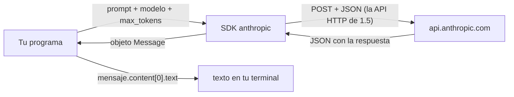

import Reto from "@components/Reto.astro";
import Solucion from "@components/Solucion.astro";
import Quiz from "@components/Quiz.astro";
import CheckDominio from "@components/CheckDominio.astro";
import Nivel from "@components/Nivel.astro";

<Nivel nivel="intermedio" />

Si llegaste a este curso porque quieres construir cosas con IA, esta es la lección donde por fin **hablas con un LLM desde tu propio código**. No desde una página web, no desde una app de otra persona: tú escribes un programa, le mandas una pregunta a un modelo de lenguaje por API, recibes la respuesta y la imprimes en tu terminal. Y vas a descubrir algo que desinfla la magia (para bien): **un llamado a un LLM es una llamada HTTP como cualquier otra** —exactamente la que aprendiste en [`1.5` Archivos, JSON y APIs](/fase-1-lenguajes/1-5-archivos-json-apis/). El modelo es el truco nuevo; el cañería ya la conoces.

> Esta es la lección de la "Pista B": una victoria de IA real, ahora, con lo poco que ya sabes (funciones, JSON, APIs, manejo de errores). No "sigue usando una herramienta no-code que ya conoces". Le da sabor a la meta y ancla la motivación. La base formal y profunda de IA llega en la Fase 6 — aquí construyes el primer ladrillo.

:::tip[Si ya tocaste esto antes]
Si ya llamaste a la API de OpenAI o Anthropic con `curl` o un SDK, no te saltes la lección: úsala como **diagnóstico**. Salta al [ejercicio Primero-Sin-IA](#7-ejercicio-primero-sin-ia) y resuélvelo a mano. El reto no es "llamar al modelo" (eso son tres líneas), sino lo que separa un script de juguete de código de ingeniero: **la API key fuera del código**, **validar el input antes de gastar una llamada**, **mapear los fallos del SDK a errores claros**, y **dejar la llamada testeable sin tocar la red**. Si lo cierras limpio en el timebox, valida con el [check de dominio](#8-check-de-dominio) y avanza. Si te trabas en el manejo de la key o en testear sin red, vuelve a la sección 4.
:::

## 1. Qué vas a saber hacer

Al terminar, sin notas, podrás:

- **O1 — Implementar** un llamado a un LLM por API desde Python con el SDK oficial: construir la petición (modelo, `max_tokens`, mensaje) y **leer el texto** de la respuesta.
- **O2 — Manejar** la API key como un secreto: leerla de una **variable de entorno**, nunca hardcodearla ni dejarla viajar a Git, y explicar por qué.
- **O3 — Envolver** la llamada en una mini-CLI que **valida el input antes de gastar una llamada**, mapea los fallos a errores claros, y queda **testeable** sin tocar la red ni gastar tokens.

## 2. Por qué importa (el dinero está aquí)

> 💰 **Por qué importa:** todo el mercado de AI/Automation Engineer se construye sobre esta primitiva. Un agente, un RAG, un clasificador de tickets, un resumidor de correos: por debajo, **siempre** hay un programa que arma un mensaje, lo manda a un modelo por API, recibe texto y decide qué hacer con él. Si dominas este llamado —y, sobre todo, cómo manejar la key, el costo y los fallos— ya puedes empezar a construir cosas que valen plata. El resto del curso es hacerlo robusto, evaluable y seguro.

Quien vino por "ser AI Engineer" suele abandonar en las primeras fases porque siente que la meta está lejísimos: meses de fundamentos antes de tocar un modelo. Esta lección rompe ese cliff. Hoy haces tu primera llamada real. Mañana le puedes pedir al modelo que clasifique, resuma o extraiga datos —y ya tienes la mitad de un producto.

Pero ojo con la trampa de la demo: que *funcione una vez* en tu terminal es fácil. Que no se caiga cuando se acaba tu cuota, cuando la red falla, o cuando alguien commitea tu API key a un repo público y te vacían la cuenta en horas —eso es lo que se paga. Por eso esta lección dedica más espacio al **secreto, el costo y los fallos** que al llamado en sí.

## 3. Lo que ya traes (actívalo)

Esta sub-unidad se para entera sobre lo anterior. Reúsalo:

- De [`1.5` Archivos, JSON y APIs](/fase-1-lenguajes/1-5-archivos-json-apis/): **una API es request → response**. Mandas un JSON, recibes un JSON. El SDK del LLM hace exactamente eso por debajo. El `timeout`, los status codes, manejar el error cuando falla: todo aplica palabra por palabra.
- De [`1.5`](/fase-1-lenguajes/1-5-archivos-json-apis/) también: **el seam de inyección**. Ahí separaste *la lógica* de *la llamada de red* inyectando `fetch` para poder testear sin internet. Hoy haces lo mismo con el llamado al modelo: lo inyectas para testear **sin red y sin gastar tokens**.
- De [`0.5` Terminal y Linux](/fase-0-fundamentos/0-5-terminal-y-linux/): **variables de entorno** (`export VAR=valor`, `os.environ`). Ahí es donde va a vivir tu API key. Hoy le das un uso de verdad.
- De [`0.6` Git y GitHub](/fase-0-fundamentos/0-6-git-y-github/): **`.gitignore`**. La regla "esto no viaja al repo" deja de ser teoría: es lo único entre tu secreto y un commit que no puedes deshacer.

Antes de seguir, responde de memoria:

<Quiz
  question="En 1.5 viste que httpx.get a una API que responde 500 NO lanza una excepción por sí solo. Una API de LLM es una API HTTP. ¿Qué implica eso?"
  options={[
    "Que llamar a un LLM necesita una librería mágica totalmente distinta",
    "Que el llamado al LLM puede fallar de las mismas formas (timeout, error de red, status de error) y hay que manejarlas",
    "Que los LLM nunca fallan porque corren en servidores grandes",
  ]}
  answer={1}
  explanation="Un LLM se sirve detrás de una API HTTP normal. Puede tardar, puede caerse, puede devolverte un 429 (te pasaste de cuota) o un 401 (key inválida). El SDK te ahorra armar el JSON a mano, pero los modos de fallo son los mismos que ya conoces de 1.5."
/>

## 4. Ejemplo resuelto, pensado en voz alta

Voy a construir, paso a paso, una mini-CLI: le pasas una pregunta como argumento, se la manda a un modelo de Anthropic (Claude), y te imprime la respuesta. En el camino paso por: instalar el SDK, conseguir y **manejar la API key**, el llamado en sí, **leer el texto**, el **costo**, y dejar todo **testeable**. **No leas esto como un resultado terminado: léelo como me oirías razonar si estuviera al lado tuyo.**

Uso Anthropic (Claude) porque es el SDK que verifiqué para esta lección. **El patrón es idéntico con OpenAI o Gemini**: cliente + modelo + mensajes + leer el texto; cambian el nombre del paquete y los ids de modelo. Revisa la documentación oficial del proveedor que uses (sección 9).

El camino completo, para que no sea una caja negra:



El SDK es la capa que te ahorra armar el `POST` a mano. Por dentro, es la misma request → response de [`1.5`](/fase-1-lenguajes/1-5-archivos-json-apis/).

### 4.1 Preparar el terreno: instalar el SDK y conseguir la key

Primero el paquete. Un SDK (Software Development Kit) es una librería que envuelve la API HTTP cruda en funciones cómodas de tu lenguaje:

```bash
pip install anthropic      # o, si usas uv:  uv add anthropic
```

Razono: *"Podría armar el `POST` a mano con `httpx` como en 1.5 —y por dentro es eso— pero el SDK oficial me da reintentos, tipos y manejo de streaming gratis. Regla: en un proyecto Python, usa el SDK oficial del proveedor; no mezcles `httpx` crudo solo porque 'se ve más liviano'."*

Ahora la **API key**. Te registras en la consola del proveedor (para Anthropic: `platform.claude.com`), creas una key —una cadena tipo `sk-ant-...`— y le cargas un poco de crédito. Tranquilo con el costo: estos experimentos cuestan **centavos** si usas el modelo más barato (lo vemos en 4.5).

Esa key es un **secreto que vale plata literal**. Quien la tenga puede gastar de tu cuenta. Así que la siguiente decisión es la más importante de la lección.

### 4.2 La regla de oro del secreto: variable de entorno, nunca el código

Hay exactamente **un** lugar donde NO va tu key: el código.

```python
# ❌ NUNCA. Esto termina en Git y de ahí es casi imposible borrarlo del historial.
cliente = anthropic.Anthropic(api_key="sk-ant-abc123...")
```

Razono en voz alta: *"Si escribo la key en el código, viaja en cada commit. Aunque la borre después, queda en el historial de Git para siempre, y los bots escanean GitHub buscando justo este patrón —cuentas vaciadas en minutos. La key va en una **variable de entorno**: vive en mi shell, fuera del repo."*

La pones en tu terminal así (de [`0.5`](/fase-0-fundamentos/0-5-terminal-y-linux/)):

```bash
export ANTHROPIC_API_KEY="sk-ant-abc123..."
```

Y el SDK la lee **solo**, sin que se la pases:

```python
import anthropic

cliente = anthropic.Anthropic()   # lee ANTHROPIC_API_KEY del entorno por ti
```

Razono: *"`anthropic.Anthropic()` sin argumentos busca `ANTHROPIC_API_KEY` en el entorno. Mi código nunca toca el texto del secreto: solo lo referencia por su nombre de variable. El día que rote la key, cambio el `export` y el código no se entera."* Para proyectos, esa variable suele vivir en un archivo `.env` que **se agrega al `.gitignore`** —pero el principio es el mismo: el secreto fuera del código, fuera del repo.

### 4.3 El llamado: tres líneas y un mensaje

Ahora sí, la primera llamada. Le mando un mensaje al modelo:

```python
mensaje = cliente.messages.create(
    model="claude-haiku-4-5",          # qué modelo. Haiku = el más barato y rápido.
    max_tokens=1024,                   # techo de cuánto puede RESPONDER. Obligatorio.
    messages=[
        {"role": "user", "content": "Explícame qué es una API en una frase."}
    ],
)
```

Razono pieza por pieza:

- **`model`** — qué cerebro uso. Hay una familia: del más barato/rápido al más caro/inteligente. Para aprender y experimentar, **Haiku** (lo veo en 4.5).
- **`max_tokens`** — el techo de la **respuesta**, en tokens (un token ≈ ¾ de una palabra en español). Es **obligatorio**. Si lo pongo muy bajo, la respuesta se corta a media frase; si lo dejo enorme, no pasa nada malo salvo que pago por lo que genere. `1024` es de sobra para una respuesta corta.
- **`messages`** — la conversación, como una lista de turnos. Cada turno tiene un `role` (`"user"` = tú, `"assistant"` = el modelo) y un `content`. Por ahora, un solo turno de usuario.

### 4.4 Leer la respuesta (y por qué viene en una lista)

La respuesta no es un string pelado. Es un objeto con metadata. El texto vive así:

```python
print(mensaje.content[0].text)
# -> "Una API es un contrato que permite que dos programas se comuniquen..."
```

Razono: *"`mensaje.content` es una **lista** de bloques, no un string. ¿Por qué una lista? Porque una respuesta puede traer varios bloques —texto, o más adelante 'razonamiento', o llamadas a herramientas. Para una pregunta de texto simple, hay un solo bloque y es de tipo texto: `content[0].text`. Lo formalizas en la Fase 6; por ahora, primer bloque, su `.text`, listo."*

¡Esa es tu primera victoria de IA! Junté las piezas:

```python
import anthropic

cliente = anthropic.Anthropic()
mensaje = cliente.messages.create(
    model="claude-haiku-4-5",
    max_tokens=1024,
    messages=[{"role": "user", "content": "Explícame qué es una API en una frase."}],
)
print(mensaje.content[0].text)
```

Corres `python primer.py` con tu `export` puesto, y un modelo te responde desde tu propio código. Quince minutos de trabajo.

Un detalle útil: para darle una "personalidad" o instrucciones globales al modelo, está el parámetro `system` (separado de los `messages`):

```python
mensaje = cliente.messages.create(
    model="claude-haiku-4-5",
    max_tokens=1024,
    system="Eres un profesor que responde en una sola frase, sin rodeos.",
    messages=[{"role": "user", "content": "¿Qué es un token?"}],
)
```

### 4.5 El costo, medido en vivo (no de fe)

Cada llamada cuesta plata: pagas por los tokens que **entran** (tu prompt) y los que **salen** (la respuesta). La respuesta te dice exactamente cuántos:

```python
print(mensaje.usage.input_tokens, mensaje.usage.output_tokens)
# -> 18 312
```

Razono: *"Esto no es decoración. Es la semilla del hábito de **costo/latencia** que me va a acompañar todo el curso. Haiku cuesta del orden de US$1 por millón de tokens de entrada y US$5 por millón de salida. Una respuesta de 312 tokens cuesta una **fracción de centavo**. Por eso, para aprender, uso Haiku: experimento sin miedo. Cuando necesite más inteligencia, subo a un modelo mejor (`claude-sonnet-4-6`, `claude-opus-4-8`) sabiendo que pago más por token. Elegir el modelo es un trade-off costo ↔ calidad, no un default ciego."*

### 4.6 Hacerlo robusto: validar antes, y mapear los fallos

Hasta aquí, un script de juguete. Lo que sigue lo vuelve código de ingeniero, y reusa todo lo de 1.5.

**Primero: no gastes una llamada en input inválido.** Si el usuario no escribió nada, no tiene sentido tocar la red (ni pagar). Valido **antes**:

```python
def responder(prompt, preguntar_al_modelo):
    if not prompt or not prompt.strip():
        raise PromptVacio("el prompt no puede estar vacío")
    return preguntar_al_modelo(prompt).strip()
```

Razono: *"¿Reconoces la forma? Es **el seam de 1.5**. `preguntar_al_modelo` está **inyectado**: `responder` no sabe (ni le importa) cómo se contacta el modelo —solo valida el prompt y delega. Eso lo hace testeable sin red. La validación va antes de delegar: input vacío → `PromptVacio`, y la llamada nunca se hace."*

**Segundo: la traducción de errores del SDK vive en el adaptador**, no en la lógica. El SDK lanza excepciones propias (`anthropic.AuthenticationError` si la key es mala, `anthropic.RateLimitError` si te pasaste de cuota, `anthropic.APIError` para el resto). Las atrapo en la función que *sí* conoce el SDK y las convierto en errores de **mi dominio**:

```python
def preguntar_a_claude(prompt):
    import anthropic
    cliente = anthropic.Anthropic()
    try:
        mensaje = cliente.messages.create(
            model="claude-haiku-4-5",
            max_tokens=1024,
            messages=[{"role": "user", "content": prompt}],
        )
    except anthropic.AuthenticationError as e:
        raise FaltaApiKey("API key inválida o ausente") from e
    except anthropic.APIError as e:                      # red, rate limit, 5xx...
        raise ModeloInalcanzable(str(e)) from e
    return mensaje.content[0].text
```

Razono: *"Esto es una **semilla de 'ports & adapters'** (lo formalizas en F3). `responder` es el núcleo, no sabe nada de Anthropic. `preguntar_a_claude` es el **adaptador**: el único lugar que importa `anthropic` y que sabe traducir sus excepciones a las mías. Si mañana cambio de proveedor, toco solo el adaptador. Y como `responder` recibe el adaptador inyectado, en los tests le paso uno falso."*

`anthropic.RateLimitError` (te pasaste de cuota, status 429) es subclase de `anthropic.APIError`, así que el segundo `except` lo cubre. En producción reaccionarías distinto a un 429 (esperar y reintentar con backoff, que verás en la Fase 3) que a un 401, pero por ahora basta con un error claro.

## 5. Errores que vas a tener (y por qué)

:::caution[Podrías pensar que poner la API key en el código "es solo para probar"]
No, ni para probar. Una key en el código (`api_key="sk-ant-..."`) viaja en cada commit y queda en el **historial de Git para siempre** —borrarla después no la saca del historial. Bots escanean GitHub en busca de exactamente ese patrón y vacían cuentas en minutos. La key va en una **variable de entorno**; si usas un archivo `.env`, va en el `.gitignore` **antes** del primer commit. Este reflejo —el secreto nunca toca el código— es de los hábitos más caros de no tener.
:::

:::caution[Podrías pensar que `mensaje.content` es un string]
No: es una **lista de bloques**. `print(mensaje.content)` te muestra `[TextBlock(text='...', type='text')]`, no el texto. El texto está en `mensaje.content[0].text`. Tratar `content` como string da error o imprime el objeto crudo. Para una pregunta de texto simple hay un solo bloque; en la Fase 6 verás respuestas con varios.
:::

:::caution[Podrías pensar que omitir `max_tokens` está bien]
No puedes omitirlo: es **obligatorio** en este SDK, y por una buena razón. Es el techo de cuánto genera el modelo —tu freno de mano de costo y de tiempo. Si lo pones muy bajo, la respuesta se **corta a media frase** (y el motivo de corte te lo dice la respuesta). Si necesitas respuestas largas, súbelo; pero ponlo siempre, conscientemente.
:::

:::caution[Podrías pensar que la respuesta del LLM siempre viene bien formada y es confiable]
Nunca asumas eso. Un LLM puede **alucinar** (inventar datos con total seguridad), devolver un formato distinto al que pediste, o —si tu prompt mezcla instrucciones con texto de un usuario— ser manipulado (*prompt injection*). El texto que sale de un modelo es **input no confiable**, igual que el JSON de una API externa en [`1.4`](/fase-1-lenguajes/1-4-type-hints-mypy-pydantic/). Hoy solo lo imprimes; pero el reflejo "valida la salida antes de actuar sobre ella" lo empiezas a cultivar ya. Lo formalizas como seguridad de LLM y *evals* en la Fase 6.
:::

:::caution[Podrías pensar que el SDK es "otra cosa" distinta de las APIs de 1.5]
Es la **misma** API HTTP de 1.5, envuelta. Por debajo, `cliente.messages.create(...)` arma un `POST` con un JSON (tu modelo, `max_tokens`, mensajes) y parsea el JSON de respuesta —exactamente lo que hiciste a mano con `httpx`. El SDK te ahorra el `POST`, los reintentos y los tipos. Si entiendes 1.5, ya entiendes lo que pasa por debajo.
:::

## 6. Práctica con andamiaje (que se desvanece)

Tres pasos, de más apoyo a menos. Hazlos **a mano primero** (predice antes de ejecutar).

### 6.1 PREDICT (sin ejecutar)

Sin correr nada, di qué pasa con este fragmento (asume que `cliente` ya existe y la key está puesta):

```python
mensaje = cliente.messages.create(
    model="claude-haiku-4-5",
    max_tokens=1024,
    messages=[{"role": "user", "content": "Di solo: hola"}],
)
print(type(mensaje.content).__name__)
print(mensaje.content[0].text)
```

<Solucion title="Ver la respuesta (solo después de predecir)">
```
list
hola
```
`mensaje.content` es una **`list`** (por eso la primera línea imprime `list`, no `str`). El texto está en el primer bloque, `content[0].text`. Si predijiste que la primera línea imprimía el texto, confundiste el objeto-respuesta con un string: el texto siempre está un nivel adentro, en un bloque de la lista.
</Solucion>

### 6.2 Parsons — reordena las líneas

Estas líneas implementan `responder(prompt, preguntar_al_modelo)` —valida el prompt y delega en el modelo inyectado— pero están **desordenadas**. Reescríbelas en el orden correcto (cuida la indentación):

```text
        raise PromptVacio("el prompt no puede estar vacío")
def responder(prompt, preguntar_al_modelo):
    return preguntar_al_modelo(prompt).strip()
    if not prompt or not prompt.strip():
```

<Solucion title="Ver el orden correcto">
```python
def responder(prompt, preguntar_al_modelo):
    if not prompt or not prompt.strip():            # 1. valida ANTES de gastar la llamada
        raise PromptVacio("el prompt no puede estar vacío")
    return preguntar_al_modelo(prompt).strip()      # 2. delega en el modelo inyectado
```
La lógica del orden: **validar primero** (si el prompt está vacío, lanzo `PromptVacio` y la llamada al modelo nunca ocurre —no malgasto plata ni tiempo), y solo entonces **delegar**. Si pusieras el `return` antes del `if`, llamarías al modelo aunque el prompt fuera vacío. El orden importa, y la razón es costo, no estética.
</Solucion>

### 6.3 MODIFY

Toma `preguntar_a_claude` de la sección 4.6 y modifícalo para que use el parámetro **`system`**: que el modelo responda siempre en una sola frase. Una línea cambia (agregas `system="Responde en una sola frase, sin rodeos."` a la llamada `messages.create`). Predice mentalmente: ¿cambia algo en cómo `responder` lo llama? (No: `responder` no sabe nada del `system` —esa es la gracia del seam.)

## 7. Ejercicio Primero-Sin-IA

Ahora sin andamiaje. Resuélvelo **a mano, sin IA** dentro del timebox. Es nuevo en lo que toca al LLM y a los secretos, pero el esqueleto —validar, inyectar, mapear errores— es justo el músculo que construiste en 1.5. Está bien que sea lento.

<Reto title="Tu primer LLM en una mini-CLI (testeable, con la key a salvo)" timebox="40 min">

Construye una mini-CLI: `python solucion.py "¿qué es un embedding?"` le manda la pregunta a un LLM y te imprime la respuesta. Pero hecha como ingeniero: la key a salvo, el input validado, los fallos claros, y **testeable sin red**.

Funciones a implementar (firmas en el starter):
- `leer_api_key(entorno) -> str` — recibe un mapping tipo `os.environ`; devuelve el valor de `ANTHROPIC_API_KEY`, o lanza `FaltaApiKey` con un mensaje claro si falta o está vacía. **No imprime la key.**
- `responder(prompt, preguntar_al_modelo) -> str` — valida el prompt (vacío o solo espacios → `PromptVacio`, **antes** de llamar), delega en el modelo inyectado y devuelve el texto sin espacios sobrantes.
- `preguntar_a_claude(prompt) -> str` — la llamada **real** con el SDK: cliente, `messages.create` (modelo, `max_tokens`, mensaje), devuelve `content[0].text`. Mapea `anthropic.AuthenticationError` → `FaltaApiKey` y `anthropic.APIError` → `ModeloInalcanzable`. (Esta es la que ejercitas con una key real; no se testea offline.)
- `main(argv, entorno, preguntar=preguntar_a_claude) -> int` — arma el prompt desde `argv`; sin prompt → mensaje de uso a `stderr` y código `2`; valida la key (falta → código `3`); llama a `responder`; mapea `ModeloInalcanzable` → código `4`; en éxito imprime la respuesta y devuelve `0`.

La gracia: como `preguntar_al_modelo` está **inyectado** (igual que `fetch` en 1.5), tus tests pasan un modelo **falso** que devuelve texto fijo o lanza el error que quieras —**cero red, cero tokens gastados**.

Entregable: tu solución en `ejercicios/fase-1/primer-llm-mini-cli/` con los tests en verde y **un caso borde tuyo** agregado.

**Hecho significa:**
- [ ] La API key se lee del entorno; **no** aparece hardcodeada en el código ni se imprime nunca.
- [ ] Prompt vacío → `PromptVacio` y el modelo **no** se llama (no gastas una llamada en input inválido).
- [ ] `leer_api_key` lanza `FaltaApiKey` cuando falta o está vacía la variable.
- [ ] Los fallos del SDK se mapean a errores de dominio (`FaltaApiKey` / `ModeloInalcanzable`); `main` los traduce a códigos de salida distintos.
- [ ] Todos los tests pasan **sin red ni key real** y agregaste al menos uno propio.
- [ ] Puedes explicar, sin notas, por qué inyectar el modelo hace el código testeable y por qué la key va en el entorno.
- [ ] **Victoria real (opcional, necesita key):** con `export ANTHROPIC_API_KEY=...` puesto, `python solucion.py "hola"` te imprime una respuesta del modelo.

Enunciado completo, starter y tests: `ejercicios/fase-1/primer-llm-mini-cli/` (carpeta del repo).

<Solucion title="Pista (ábrela solo si superaste el timebox)">
Piensa el **contrato** primero (spec-first, de [`0.8`](/fase-0-fundamentos/0-8-spec-first-y-stack-traces/)): qué entra, qué sale, qué errores. `leer_api_key` es `entorno.get("ANTHROPIC_API_KEY", "").strip()` y, si queda vacío, `raise FaltaApiKey(...)`. `responder` valida con `if not prompt or not prompt.strip(): raise PromptVacio` **antes** de `return preguntar_al_modelo(prompt).strip()`. `preguntar_a_claude` envuelve `messages.create` en `try/except anthropic.AuthenticationError / anthropic.APIError` (importa `anthropic` **dentro** de la función, así los tests corren sin el paquete instalado). `main` ordena: prompt vacío → `2`; `leer_api_key` → `3`; `responder` con `except ModeloInalcanzable` → `4`; éxito → imprime y `0`. Esto es una pista, no la solución.
</Solucion>

</Reto>

## 8. Check de dominio

Sin mirar la lección, en voz alta o por escrito:

<CheckDominio
  items={[
    "Escribir, de memoria, las cuatro piezas mínimas de un llamado a un LLM: cliente, modelo, max_tokens y el mensaje.",
    "Explicar dónde vive la API key, por qué NO va en el código, y qué la separa de un commit.",
    "Decir por qué mensaje.content es una lista y cómo se saca el texto.",
    "Explicar qué hace max_tokens y qué pasa si lo pones muy bajo.",
    "Nombrar tres formas en que un llamado a un LLM puede fallar y cómo las mapearías a errores claros.",
    "Explicar por qué inyectar el modelo (el seam) deja el código testeable sin red ni tokens, y conectar con fetch de 1.5.",
    "Decir por qué nunca debes confiar a ciegas en el texto que devuelve un modelo.",
  ]}
/>

Si marcaste menos de cinco, vuelve a la sección correspondiente **antes** de avanzar. No es un examen: es honestidad contigo.

<Quiz
  question="¿Cuál es la forma correcta de darle tu API key al SDK?"
  options={[
    "anthropic.Anthropic(api_key='sk-ant-abc123') escrito en el código",
    "export ANTHROPIC_API_KEY='...' en el entorno, y anthropic.Anthropic() sin argumentos",
    "Pegarla en un comentario al inicio del archivo para acordarte",
  ]}
  answer={1}
  explanation="La key es un secreto que vale dinero. Va en una variable de entorno; el SDK la lee solo. Hardcodearla (opción 1) o comentarla (opción 3) la mete en Git, donde queda para siempre y los bots la encuentran. El código referencia el secreto por nombre, nunca contiene su valor."
/>

## 9. Recursos (documentación oficial primero)

- **Anthropic — Get Started / Client SDKs:** [platform.claude.com/en/docs/get-started](https://platform.claude.com/en/docs/get-started) — instalación del SDK `anthropic`, primer `messages.create`, lectura de la respuesta.
- **Anthropic — Models overview (ids y precios):** [platform.claude.com/en/docs/about-claude/models/overview](https://platform.claude.com/en/docs/about-claude/models/overview) — la lista vigente de modelos (`claude-haiku-4-5`, `claude-sonnet-4-6`, `claude-opus-4-8`) con context window y precio por millón de tokens.
- **OpenAI — API quickstart (si usas OpenAI):** [platform.openai.com/docs/quickstart](https://platform.openai.com/docs/quickstart) — el mismo patrón cliente + modelo + mensajes, con sus propios ids de modelo.
- **`anthropic` Python SDK (repo):** [github.com/anthropics/anthropic-sdk-python](https://github.com/anthropics/anthropic-sdk-python) — manejo de errores (`AuthenticationError`, `RateLimitError`, `APIError`), streaming y `usage`.
- **OWASP Top 10 for LLM Applications:** [owasp.org/www-project-top-10-for-large-language-model-applications](https://owasp.org/www-project-top-10-for-large-language-model-applications/) — por qué no confiar a ciegas en la salida (lo profundizas en F6; léelo por encima ahora).

## 10. Conexión con el capstone de la fase

El **Capstone F1 — La misma app, dos lenguajes** (una mini-API de tu despensa de HomeBase, en Python y en TypeScript) no exige IA. Pero esta lección es el puente que justifica todo lo demás:

- El **seam de inyección** que practicaste aquí es el mismo que hará tu capstone testeable sin servicios externos.
- El reflejo de **secretos en variables de entorno** se aplica a cualquier credencial del capstone (la conexión a la base de datos, por ejemplo).
- Y es tu **rampa a la Pista B**: con este llamado dominado, ya puedes darle a tu HomeBase una primera feature de IA (resumir, clasificar, sugerir) en cuanto quieras —media hora de trabajo, porque la cañería ya la tienes.

Más adelante, la Fase 6 toma este mismo llamado y le agrega lo que lo vuelve producción: *prompt engineering*, salidas estructuradas y validadas, *evals*, observabilidad de costo/latencia, y seguridad de LLM. Todo se para sobre las tres líneas que escribiste hoy.

## 11. Reflexión y repaso espaciado

Cierra escribiendo dos o tres frases: **¿qué te sorprendió más al descubrir que un LLM es "solo" una API HTTP —y qué te dio más respeto: el costo, el secreto, o los fallos?** Nombrar lo que te incomoda ("no había pensado que mi key podía terminar en un repo público") es lo que lo convierte en un hábito que sí vas a cuidar.

Gancho de **spaced repetition**:

- **Mañana:** reescribe de memoria, sin mirar, el llamado mínimo de la sección 4.3 (cliente, `model`, `max_tokens`, `messages`) y cómo sacar el texto. Si no puedes, no lo aprendiste todavía.
- **En 3 días:** toma tu mini-CLI y agrégale un flag o variable de entorno para elegir el modelo (Haiku para barato, Sonnet para mejor), imprimiendo al final `usage.input_tokens`/`usage.output_tokens`. Conecta el hábito de costo con una decisión real.
- **En 1 semana:** explícale a alguien (o a una grabación) por qué la key va en el entorno y por qué inyectar el modelo hace el código testeable. Si lo puedes enseñar, lo dominas —y es justo lo que te van a preguntar en una entrevista de AI Engineer.
