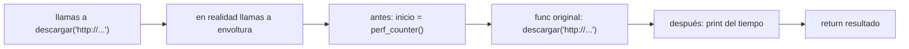

import Reto from "@components/Reto.astro";
import Solucion from "@components/Solucion.astro";
import Quiz from "@components/Quiz.astro";
import CheckDominio from "@components/CheckDominio.astro";
import Nivel from "@components/Nivel.astro";

<Nivel nivel="intermedio" />

Ya escribes funciones, bucles y diccionarios en Python (eso fue [1.1](/fase-1-lenguajes/)). Esta sub-unidad añade **cuatro herramientas intermedias** que separan al que "escribe Python" del que "escribe Java con sintaxis de Python": **comprehensions, generadores, decoradores y context managers**. No las vas a aprender por su sintaxis. Las vas a aprender por el **problema concreto** que cada una resuelve, porque esa es la única forma de saber *cuándo* usarlas (y, más importante, cuándo **no**).

> La trampa de esta lección: las cuatro son fáciles de copiar y difíciles de defender. Una IA te escupe un decorador en dos segundos; lo difícil es saber **qué hace `@` realmente**, por qué un generador no es "una lista más rápida", y por qué un `with` te salva de un bug que ni sabías que tenías. Eso es lo que mide una entrevista y lo que no se aprende copiando.

:::tip[Si ya tocaste esto antes]
Si ya usaste comprehensions o decoradores en algún proyecto, no te saltes la lección: úsala como **diagnóstico**. Salta directo a los **dos ejercicios Primero-Sin-IA** de la sección 7 y resuélvelos a mano, sin IA. Si cierras ambos en el timebox y puedes explicar *por qué* un generador ahorra memoria y *qué* preserva `functools.wraps`, valida con el check de dominio (sección 8) y avanza a [1.3 Python asíncrono](/fase-1-lenguajes/). Si te trabas en decoradores o en `__enter__/__exit__`, vuelve a esa sección: son justo las dos que más cuesta interiorizar.
:::

## 1. Qué vas a saber hacer

Al terminar, sin IA y sin notas, podrás:

- **O1 — Reescribir** un bucle acumulador como **comprehension** cuando mejora la legibilidad, y **explicar el trade-off** de cuándo *no* hacerlo.
- **O2 — Implementar** un **generador** con `yield` y **explicar el trade-off** de la evaluación perezosa (memoria y *streaming*) frente a construir la lista completa.
- **O3 — Implementar** un **decorador** (preservando la identidad de la función con `functools.wraps`) y un **context manager**, explicando qué problema concreto de duplicación o de limpieza resuelve cada uno.

## 2. Por qué importa (el dinero está aquí)

> 💰 **Por qué importa:** estas cuatro construcciones son los ladrillos con los que están hechos los frameworks que vas a usar todos los días. No reconocerlas te marca como junior en la primera lectura de código real.

Mira el código que vas a tocar en las próximas fases y vas a ver las cuatro, en todas partes:

- **Decoradores:** una ruta de FastAPI es `@app.get("/items")`. Un *fixture* de pytest es `@pytest.fixture`. El patrón que envuelve **cada llamada a un LLM** para reintentar cuando la API falla es un decorador. Si no sabes qué hace `@`, ese código es magia que no puedes depurar.
- **Generadores:** cuando un chatbot te muestra la respuesta **token por token** en vez de esperar el párrafo completo, eso es un generador transmitiendo (*streaming*). Cuando procesas un archivo de log de 5 GB sin que tu máquina se quede sin memoria, es un generador.
- **Context managers:** `with open(...)` cierra el archivo aunque tu código explote en medio. La sesión de base de datos, la conexión, el lock: todos se manejan con `with`. Es la diferencia entre un servicio que corre meses y uno que filtra recursos hasta caerse.
- **Comprehensions:** transformar y filtrar datos (la mitad del trabajo de un ingeniero de datos y de IA) se escribe en una línea legible en vez de cinco.

Son baratas de aprender una vez y carísimas de no reconocer cuando lees código ajeno bajo presión.

## 3. Lo que ya traes (actívalo)

Esta lección se para sobre cosas que ya sabes hacer a mano:

- De [0.7 Fundamentos de programación](/fase-0-fundamentos/0-7-fundamentos-programacion/): el **acumulador** (inicializar una variable antes del bucle, actualizarla dentro). Las comprehensions son ese patrón comprimido.
- De [0.7](/fase-0-fundamentos/0-7-fundamentos-programacion/) también: `list`, `dict`, `set` y **manejo de errores** (`try`/`except`/`finally`, `raise`). El `finally` es la semilla del context manager.
- De [1.1 Python básico→intermedio](/fase-1-lenguajes/): que **las funciones son valores** — puedes guardarlas en una variable y pasarlas como argumento. Sin esto, los decoradores no tienen sentido.

Antes de seguir, responde de memoria:

<Quiz
  question="En Python, ¿qué construye este bucle?  resultado = []; for n in [1,2,3,4]: resultado.append(n*n)"
  options={[
    "Una lista [1, 4, 9, 16]",
    "Una lista [1, 2, 3, 4]",
    "El número 30",
  ]}
  answer={0}
  explanation="Es el patrón acumulador clásico: inicializo una lista vacía antes del bucle y le hago append del cuadrado de cada n. Resultado: [1, 4, 9, 16]. Una list comprehension es EXACTAMENTE esto en una línea."
/>

## 4. Ejemplo resuelto, pensado en voz alta

Voy a partir de código que **ya sabes escribir** (bucles con acumulador) y, cada vez que aparezca un dolor concreto, voy a sacar la herramienta que lo cura. **No leas esto como sintaxis nueva: léelo como me oirías razonar al lado tuyo.**

### 4.1 Comprehensions — el dolor: ruido para una transformación simple

Quiero los cuadrados de los números pares de una lista. Con lo que sé de la Fase 0:

```python
numeros = [1, 2, 3, 4, 5, 6]
cuadrados_pares = []                  # acumulador, antes del bucle
for n in numeros:
    if n % 2 == 0:                    # filtro
        cuadrados_pares.append(n * n) # transformación
# cuadrados_pares == [4, 16, 36]
```

Pienso en voz alta: *"Cuatro líneas para decir algo simple: 'el cuadrado de cada par'. Tres de esas líneas son andamiaje ruidoso —crear la lista, el `for`, el `append`— y solo dos cosas importan de verdad: el **filtro** (`if n % 2 == 0`) y la **transformación** (`n * n`)."* Python tiene una forma de escribir justo eso, sin el andamiaje:

```python
cuadrados_pares = [n * n for n in numeros if n % 2 == 0]
#                  └──┬──┘ └─────┬─────┘ └──────┬──────┘
#              transformación   recorrido      filtro
```

Se lee casi como en español: *"`n*n`, para cada `n` en `numeros`, si `n` es par"*. La misma idea aplica a los otros contenedores:

```python
# dict comprehension: {clave: valor for ...}
longitudes = {palabra: len(palabra) for palabra in ["sol", "mar"]}
#   -> {"sol": 3, "mar": 3}

# set comprehension: {valor for ...}  (sin repetidos, sin orden)
iniciales = {nombre[0] for nombre in ["ana", "alba", "beto"]}
#   -> {"a", "b"}
```

Razono el criterio: *"Uso una comprehension cuando estoy **construyendo un contenedor a partir de otro** transformando o filtrando. Si lo que hago dentro del bucle es un efecto secundario (imprimir, escribir a un archivo, sumar a un total externo), una comprehension lo oscurece: ahí me quedo con el `for` normal."* La comprehension es para **producir un valor**, no para **hacer algo**.

### 4.2 Generadores — el dolor: la lista no cabe en memoria

Ahora supón que `numeros` no es `[1..6]`, sino los **diez millones** de líneas de un archivo de log, o un *stream* infinito. La comprehension `[transformar(x) for x in fuente]` construye la **lista completa en memoria de golpe**. Si la fuente tiene 5 GB, tu programa muere con `MemoryError`.

Pienso en voz alta: *"No necesito los diez millones a la vez. Necesito **uno, procesarlo, soltarlo, pedir el siguiente**. Quiero una 'cinta transportadora', no un 'camión lleno'."* Esa cinta es un **generador**. Un generador es una función que, en vez de `return` (que entrega todo y termina), usa `yield` (que entrega **un valor y se pausa**, recordando dónde quedó):

```python
def numeros_grandes(fuente, minimo):
    for n in fuente:
        if n >= minimo:
            yield n            # entrega UNO y se congela aquí hasta que le pidan el siguiente

# Llamarla NO ejecuta el cuerpo: solo crea el generador (perezoso, "lazy")
gen = numeros_grandes([3, 50, 8, 99], minimo=10)

# El cuerpo avanza solo cuando pides un valor:
print(next(gen))   # 50   (recorrió 3, lo descartó; llegó a 50, lo entregó, se pausó)
print(next(gen))   # 99
```

La versión compacta de un generador es la **generator expression**: igual que una list comprehension pero **con paréntesis** en vez de corchetes:

```python
suma = sum(n * n for n in range(1_000_000))   # NO crea la lista de un millón:
#                                                produce y suma de a uno. Memoria constante.
```

El trade-off, dicho con precisión:

| | Lista (comprehension `[...]`) | Generador (`yield` / `(...)`) |
|---|---|---|
| **Cuándo evalúa** | todo de inmediato (*eager*) | de a uno, bajo demanda (*lazy*) |
| **Memoria** | toda la colección a la vez | un elemento a la vez |
| **Reutilizable** | sí, lo recorres N veces | **no**: se agota tras una pasada |
| **Indexable** (`x[2]`) | sí | **no** |
| **Para qué** | datos pequeños que vas a recorrer varias veces | datos enormes, *streaming*, infinitos |

*"Si los datos caben y los voy a usar varias veces, lista. Si son gigantes, infinitos o los recorro una sola vez en cadena, generador."* El *streaming* de tokens de un LLM es exactamente esto: el modelo te entrega palabras de a una con `yield`, no espera a terminar el párrafo.

### 4.3 Decoradores — el dolor: el mismo envoltorio copiado en N funciones

Tengo varias funciones y quiero **cronometrar cuánto tardan**, sin copiar el mismo código de medición en cada una. Mi primer instinto (malo) es copiar y pegar:

```python
import time

def descargar_datos():
    inicio = time.perf_counter()        # ← copiado
    resultado = ...                     # el trabajo real
    print(f"tardó {time.perf_counter() - inicio:.3f}s")   # ← copiado
    return resultado
```

Pienso en voz alta: *"Si tengo diez funciones, copio esas dos líneas diez veces. Si cambio el formato del mensaje, lo cambio en diez lugares. Eso es exactamente lo que un decorador elimina: **envolver** una función con comportamiento extra, sin tocar su cuerpo."*

La clave que ya traes de 1.1: **las funciones son valores**. Entonces puedo escribir una función que *recibe una función y devuelve otra función* que la envuelve:

```python
import functools
import time

def cronometrar(func):                       # recibe la función a envolver
    @functools.wraps(func)                    # (ver más abajo: preserva la identidad de func)
    def envoltura(*args, **kwargs):           # la nueva función que la reemplaza
        inicio = time.perf_counter()
        resultado = func(*args, **kwargs)     # ← llama a la original
        print(f"{func.__name__} tardó {time.perf_counter() - inicio:.3f}s")
        return resultado
    return envoltura                          # devuelve la envoltura

@cronometrar                                  # ← azúcar para: descargar = cronometrar(descargar)
def descargar(url):
    ...
    return "datos"
```

El `@cronometrar` encima de `def descargar` es **azúcar sintáctica**. Significa, literalmente: `descargar = cronometrar(descargar)`. Razono cada pieza:

- `cronometrar` recibe la función `descargar` y devuelve `envoltura` en su lugar.
- `*args, **kwargs` hacen que `envoltura` acepte **cualquier** argumento y los reenvíe a la original. Así el decorador sirve para funciones con cualquier firma.
- `func(*args, **kwargs)` es la línea donde se ejecuta el trabajo real; alrededor, el comportamiento extra (antes y después).



¿Y `functools.wraps`? Sin él, después de decorar, `descargar.__name__` diría `"envoltura"` y se perdería el docstring: la función decorada **mentiría sobre su identidad**, y eso rompe la introspección, los tests y las trazas. `@functools.wraps(func)` copia el nombre, el docstring y la metadata de la original a la envoltura. **Siempre se pone.** No es opcional.

Este patrón es la **base del reintento de llamadas a LLM**: un decorador `@reintentar(veces=3)` que envuelve la llamada y la reintenta si la API falla. Lo construyes tú en el ejercicio B.

### 4.4 Context managers — el dolor: limpiar un recurso pase lo que pase

Abro un archivo, escribo, lo cierro. Pero si el código entre medio lanza una excepción, **el `close()` nunca corre** y el archivo queda abierto (recurso filtrado):

```python
f = open("datos.txt", "w")
f.write(procesar())     # si procesar() lanza una excepción AQUÍ...
f.close()               # ...esta línea NUNCA se ejecuta. Archivo filtrado.
```

De la Fase 0 ya sé el parche: `try/finally`, porque `finally` corre **siempre**, haya o no excepción:

```python
f = open("datos.txt", "w")
try:
    f.write(procesar())
finally:
    f.close()           # ahora sí corre pase lo que pase
```

Pienso en voz alta: *"Funciona, pero es ruidoso y fácil de olvidar. Y este par 'adquirir → liberar siempre' aparece en todos lados: archivos, conexiones a base de datos, locks. Python tiene una construcción que empaqueta exactamente ese patrón."* Es el **context manager**, y se usa con `with`:

```python
with open("datos.txt", "w") as f:
    f.write(procesar())
# al salir del bloque —normal O por excepción— el archivo se cierra solo
```

`with` garantiza que el recurso se libere al salir del bloque, **incluso si hay una excepción**. ¿Cómo lo logra? Un context manager es cualquier objeto con dos métodos: `__enter__` (qué hacer al entrar, el *setup*) y `__exit__` (qué hacer al salir, el *teardown* — corre siempre). Puedo escribir uno propio:

```python
class Conexion:
    def __enter__(self):
        print("abriendo conexión")
        self.recurso = "conectado"
        return self.recurso          # esto es lo que recibe el "as ..."
    def __exit__(self, exc_type, exc, tb):
        print("cerrando conexión")   # corre SIEMPRE, con o sin excepción
        # devolver False (o nada) => si hubo excepción, se propaga normalmente

with Conexion() as c:
    print(f"usando {c}")
# abriendo conexión / usando conectado / cerrando conexión
```

Para casos simples hay una forma más corta: el decorador `@contextmanager` de la librería estándar, que convierte un generador en context manager. Lo que va **antes** del `yield` es el *setup*; lo de **después**, el *teardown*; y el `yield` entrega el recurso:

```python
from contextlib import contextmanager

@contextmanager
def conexion():
    print("abriendo")               # setup (como __enter__)
    recurso = "conectado"
    try:
        yield recurso               # se entrega al "as ..."; aquí corre el cuerpo del with
    finally:
        print("cerrando")           # teardown (como __exit__): SIEMPRE

with conexion() as c:
    print(f"usando {c}")
```

Razono el punto central: *"El valor del context manager no es ahorrar líneas. Es la **garantía**: el `__exit__` (o el `finally` tras el `yield`) corre aunque el bloque explote. Es imposible olvidar el `close`, porque el `with` lo hace por ti."* Por eso es el patrón estándar para todo recurso que se adquiere y debe liberarse.

## 5. Errores de intermedio que vas a tener (y por qué)

:::caution[Podrías pensar que "más compacto = mejor", y meter todo en una comprehension]
No. Una comprehension anidada de tres niveles con dos `if` es **de solo escritura**: ni tú la entiendes mañana. La comprehension gana cuando la transformación es **simple y de una pasada**. Si necesitas anidar mucho, un `if` con varias ramas, o un efecto secundario (imprimir, mutar algo externo), el `for` normal es **más legible**, y legible le gana a compacto siempre. La regla: si no la lees en voz alta de corrido, no uses comprehension.
:::

:::caution[Podrías pensar que un generador es "una lista, pero más rápida"]
Son cosas distintas. Un generador **no es indexable** (`gen[2]` revienta) y, sobre todo, **se agota tras una sola pasada**. Este bug es clásico:

```python
gen = (n * n for n in range(4))
print(list(gen))   # [0, 1, 4, 9]
print(list(gen))   # []   ← ¡vacío! ya se consumió en la línea anterior
```

Si necesitas recorrer los datos **varias veces**, usa una lista. El generador es para **una pasada** sobre datos que no quieres (o no puedes) materializar.
:::

:::caution[Podrías pensar que un decorador "se ejecuta cada vez que llamas la función"]
Mitad y mitad, y la distinción importa. El decorador (`cronometrar(func)`) se ejecuta **una sola vez**: en el momento en que Python lee el `@`, al definir la función. Lo que corre en **cada llamada** es la `envoltura` que devolvió. Confundir esto lleva a bugs sutiles: si tu decorador abre una conexión "al decorar" pensando que lo hace "en cada llamada", la abre una vez y la comparte sin querer. Y nunca olvides `@functools.wraps(func)`: sin él, la función decorada pierde su nombre y su docstring.
:::

:::caution[Podrías pensar que `with` es solo azúcar para ahorrarte el close, y que un try/finally a mano da igual]
La garantía es la misma, pero el `with` la hace **imposible de olvidar** y comunica la intención. El error real con context managers propios es otro: hacer que `__exit__` **devuelva `True`**. Si `__exit__` retorna `True`, **se traga la excepción** y el programa sigue como si nada —escondiste un error en vez de manejarlo—. A menos que sea exactamente lo que quieres (un supresor deliberado, como `contextlib.suppress`), `__exit__` debe devolver `False` o nada, para que la excepción se propague.
:::

## 6. Práctica con andamiaje (que se desvanece)

Tres pasos, de más apoyo a menos. **A mano primero**, sin ejecutar.

### 6.1 PREDICT (sin ejecutar)

¿Qué imprime esto? Piensa en *cuándo* corre el cuerpo del generador:

```python
def contador(nombre):
    print(f"arranca {nombre}")
    for i in range(2):
        print(f"{nombre} produce {i}")
        yield i

gen = contador("A")
print("generador creado")
for valor in gen:
    print(f"recibí {valor}")
```

<Solucion title="Ver la respuesta (solo después de predecir)">

```text
generador creado
arranca A
A produce 0
recibí 0
A produce 1
recibí 1
```

La clave: `contador("A")` **no imprime nada** todavía —solo crea el generador—. Por eso `"generador creado"` aparece **antes** que `"arranca A"`. El cuerpo solo avanza cuando el `for` pide el primer valor. Si predijiste que `"arranca A"` salía primero, caíste justo en la trampa de la evaluación perezosa (*lazy*): el generador no ejecuta nada hasta que le piden.
</Solucion>

### 6.2 Parsons — reordena las líneas

Estas líneas implementan un decorador `registrar` que imprime cuándo se llama una función, pero están **desordenadas**. Reescríbelas en el orden correcto (cuida la indentación):

```text
    @functools.wraps(func)
        resultado = func(*args, **kwargs)
def registrar(func):
        print(f"llamando a {func.__name__}")
    return envoltura
    def envoltura(*args, **kwargs):
        return resultado
import functools
```

<Solucion title="Ver el orden correcto">

```python
import functools

def registrar(func):
    @functools.wraps(func)
    def envoltura(*args, **kwargs):
        print(f"llamando a {func.__name__}")
        resultado = func(*args, **kwargs)
        return resultado
    return envoltura
```

La estructura de **todo** decorador simple es esta: la función externa recibe `func`; dentro define `envoltura` (decorada con `@functools.wraps(func)`); `envoltura` hace algo extra, llama a `func(*args, **kwargs)`, y devuelve su resultado; la externa **devuelve `envoltura`** (sin paréntesis: devuelve la función, no la llama). Si pusiste `return envoltura()` con paréntesis, la ejecutaste en vez de devolverla: error clásico.
</Solucion>

### 6.3 MODIFY

Toma este context manager basado en clase y **reescríbelo** usando `@contextmanager` (la forma con generador), de modo que se comporte idéntico:

```python
class Seccion:
    def __init__(self, titulo):
        self.titulo = titulo
    def __enter__(self):
        print(f"== {self.titulo} ==")
        return self
    def __exit__(self, exc_type, exc, tb):
        print(f"== fin {self.titulo} ==")
```

Pista: lo que va antes del `yield` es el `__enter__`; lo que va en el `finally` después del `yield` es el `__exit__`. Pruébalo con `with seccion("Reporte"):` y confirma que imprime la apertura y el cierre, **incluso si el bloque lanza una excepción**.

## 7. Ejercicios Primero-Sin-IA

Sin andamiaje. Resuélvelos **a mano, sin IA** dentro del timebox. Cada uno trae tests que definen el contrato: hazlos pasar en verde. Está bien que sea lento; el músculo se construye con el esfuerzo, no con la respuesta.

<Reto title="Procesar transacciones con comprehensions y un generador" timebox="35–45 min">

Trabajas con una lista de transacciones (cada una un `dict` con `"id"`, `"categoria"` y `"monto"`). Implementa tres funciones, cada una con la herramienta correcta:

1. `categorias_unicas(transacciones)` → un **`set`** con las categorías distintas (**set comprehension**).
2. `indexar_por_id(transacciones)` → un **`dict`** `{id: transacción}` (**dict comprehension**).
3. `stream_montos(transacciones, minimo)` → un **generador** que produce, **de a uno y en orden**, los `monto` que sean `>= minimo` (con `yield`, *no* construyas una lista).

Entregable: tu solución en `ejercicios/fase-1/python-intermedio-comprehensions-generadores/`, con los tests en verde y **un caso borde tuyo** agregado.

**Hecho significa:**
- [ ] `categorias_unicas` y `indexar_por_id` usan comprehensions (no un `for` con `append`/asignación).
- [ ] `stream_montos` es un **generador** (usa `yield`) y respeta el orden de entrada.
- [ ] Lista vacía: `categorias_unicas([]) == set()`, `indexar_por_id([]) == {}`, `stream_montos([], 0)` no produce nada.
- [ ] Todos los tests pasan y agregaste al menos un test propio.
- [ ] Puedes explicar **sin notas** por qué `stream_montos` no debería devolver una lista.

Enunciado completo, *starter* y tests: `ejercicios/fase-1/python-intermedio-comprehensions-generadores/` (carpeta del repo).

<Solucion title="Pista (ábrela solo si superaste el timebox)">
Una set comprehension es `{expr for x in iterable}` y una dict comprehension es `{clave: valor for x in iterable}`. Para `stream_montos`, recuerda que un generador **no construye** la colección: recorres con un `for`, y cuando un monto cumple el filtro, lo entregas con `yield` y la función se pausa hasta que le pidan el siguiente. Si escribiste `return [m for m in ...]`, eso es una lista, no un generador: el contrato pide `yield`. Esto es una pista, no la solución.
</Solucion>

</Reto>

<Reto title="Un decorador de reintento y un context manager con limpieza garantizada" timebox="40–45 min">

Dos herramientas que vas a reusar en cada fase con IA:

1. `reintentar(veces)` — un **decorador parametrizado** (recibe `veces`) que envuelve una función: si la función lanza una excepción, la **reintenta** hasta `veces` veces; si alguna llamada tiene éxito, devuelve su resultado; si fallan todas, **re-lanza la última excepción**. Usa `functools.wraps`.
2. `conexion(registro)` — un **context manager** (con `@contextmanager`) que recibe una lista `registro`: al entrar agrega `"conectado"` a la lista y la entrega; al salir agrega `"desconectado"` — **siempre, incluso si el bloque `with` lanza una excepción** (que debe propagarse).

Entregable: tu solución en `ejercicios/fase-1/python-intermedio-decorador-context-manager/`, con los tests en verde y **un test borde tuyo** agregado.

**Hecho significa:**
- [ ] `reintentar` es un decorador parametrizado que funciona como `@reintentar(veces=3)`.
- [ ] Una función que falla y luego tiene éxito termina devolviendo el resultado; una que siempre falla re-lanza la excepción tras `veces` intentos.
- [ ] La función decorada **conserva su `__name__`** (usaste `functools.wraps`).
- [ ] `conexion` agrega `"desconectado"` al `registro` aunque el bloque lance una excepción, y la excepción **se propaga** (no se la traga).
- [ ] Todos los tests pasan y agregaste un test propio.

Enunciado completo, *starter* y tests: `ejercicios/fase-1/python-intermedio-decorador-context-manager/` (carpeta del repo).

<Solucion title="Pista (ábrela solo si superaste el timebox)">
Un decorador **parametrizado** tiene **tres** niveles: la función externa recibe `veces` y devuelve un decorador; ese decorador recibe `func` y devuelve `envoltura`; `envoltura` hace el trabajo. Para el reintento, un bucle `for intento in range(veces)` con `try/except` dentro: si la llamada funciona, `return` corta el bucle; guarda la excepción y, si el bucle termina sin éxito, hazle `raise` afuera. Para el context manager, lo del `finally` después del `yield` corre siempre: ahí va el `"desconectado"`. **No** uses `except` que se trague la excepción del bloque. Pista, no solución.
</Solucion>

</Reto>

## 8. Check de dominio

Sin mirar la lección, en voz alta o por escrito:

<CheckDominio
  items={[
    "Reescribir un bucle con filtro y transformación como una list comprehension, y decir cuándo NO conviene.",
    "Explicar con un ejemplo por qué un generador usa memoria constante y una lista no.",
    "Nombrar dos diferencias prácticas entre un generador y una lista (más allá de la memoria).",
    "Escribir, sin ejecutar, la estructura de un decorador simple y decir qué hace functools.wraps.",
    "Explicar por qué un decorador corre una vez al definir y la envoltura corre en cada llamada.",
    "Explicar qué garantiza un context manager que un open()+close() a secas no garantiza.",
  ]}
/>

Si marcaste menos de cinco, vuelve a la sección correspondiente **antes** de avanzar. No es un examen: es honestidad contigo.

<Quiz
  question="¿Qué imprime?  gen = (x for x in range(3)); print(list(gen)); print(list(gen))"
  options={[
    "[0, 1, 2] y luego [0, 1, 2]",
    "[0, 1, 2] y luego []",
    "Lanza un error en el segundo list(gen)",
  ]}
  answer={1}
  explanation="Un generador se agota tras UNA pasada. El primer list(gen) lo consume entero ([0,1,2]); el segundo encuentra un generador ya agotado y devuelve []. Si necesitas recorrer dos veces, usa una lista."
/>

## 9. Recursos (documentación oficial primero)

- **Comprehensions** — [docs.python.org/3/tutorial/datastructures.html#list-comprehensions](https://docs.python.org/3/tutorial/datastructures.html#list-comprehensions) (la fuente de verdad; cubre list, dict y set).
- **Generadores** — [docs.python.org/3/tutorial/classes.html#generators](https://docs.python.org/3/tutorial/classes.html#generators) y [el glosario: *generator*](https://docs.python.org/3/glossary.html#term-generator).
- **`functools.wraps`** — [docs.python.org/3/library/functools.html#functools.wraps](https://docs.python.org/3/library/functools.html#functools.wraps).
- **`contextlib` y `@contextmanager`** — [docs.python.org/3/library/contextlib.html](https://docs.python.org/3/library/contextlib.html).
- **La sentencia `with`** — [docs.python.org/3/reference/compound_stmts.html#the-with-statement](https://docs.python.org/3/reference/compound_stmts.html#the-with-statement).
- **Python Tutor** — [pythontutor.com](https://pythontutor.com/) — para *verificar* tu traza de un generador paso a paso después de predecirla, nunca para predecir por ti.

## 10. Conexión con el capstone de la fase

El **Capstone F1 — [La misma app, dos lenguajes](/fase-1-lenguajes/proyecto/)** (una mini-API de tu despensa de HomeHub, en Python y luego en TypeScript) usa estas cuatro construcciones de forma natural:

- Transformar el *payload* de entrada en la respuesta JSON → **comprehensions**.
- Si la API devuelve muchos items o los transmite → **generadores**.
- Validar entrada, medir tiempos o (más adelante) reintentar llamadas externas → **decoradores**.
- Abrir y cerrar el recurso de datos sin filtrarlo → **context managers**.

Y mirando más lejos: el decorador `@reintentar` del ejercicio B es **literalmente** el patrón con el que envolverás cada llamada a un LLM en la Fase 6 (un hilo de **costo/latencia y robustez**: reintentar con criterio en vez de caerte ante el primer error de red). El generador de *streaming* es cómo mostrarás la respuesta del modelo token por token. No estás aprendiendo sintaxis: estás construyendo los cimientos de lo que viene.

## 11. Reflexión y repaso espaciado

Cierra escribiendo dos o tres frases: **¿cuál de las cuatro herramientas te costó más entender, y cuál fue exactamente el clic que te faltaba?** Nombrar la dificultad con precisión ("entender que el decorador corre una vez, no en cada llamada", no "los decoradores") es lo que la vuelve atacable.

Gancho de **spaced repetition**:

- **Mañana:** reescribe **de memoria**, sin mirar, el decorador `reintentar` y el context manager `conexion`. Si no puedes, no lo aprendiste todavía — vuelve a la sección 4.
- **En 3 días:** toma el ejercicio de transacciones y agrégale una cuarta función con una **generator expression** que sume todos los montos sin construir una lista intermedia.
- **En 1 semana:** explícale a alguien (o a una grabación) por qué `with open(...)` es más seguro que `open()` seguido de `close()`. Si lo explicas claro, lo dominas.
