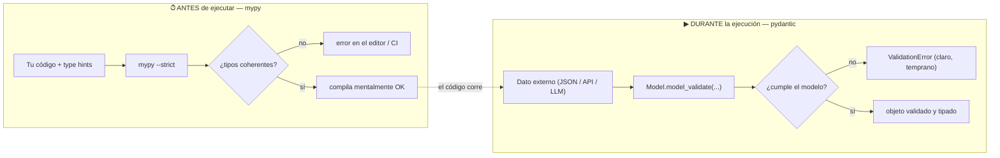

import Reto from "@components/Reto.astro";
import Solucion from "@components/Solucion.astro";
import Quiz from "@components/Quiz.astro";
import CheckDominio from "@components/CheckDominio.astro";
import Nivel from "@components/Nivel.astro";

<Nivel nivel="intermedio" />

Hasta aquí escribiste Python que **funciona**. Ahora vas a escribir Python que **avisa antes de fallar**. Dos herramientas, dos momentos distintos del tiempo: los **type hints** + **mypy** te atrapan errores de tipo **antes de ejecutar** (en tu editor, en el CI); **pydantic** valida datos **mientras el programa corre**, justo cuando entran desde afuera y no puedes confiar en ellos. La confusión entre estos dos mundos —estático vs runtime— es el corazón de esta lección y la pregunta que más se equivoca.

:::tip[Si ya tocaste esto antes]
Si ya pusiste `def f(x: int) -> str:` y usaste pydantic en alguna API, no te saltes la lección: úsala como **diagnóstico**. Ve a los **dos ejercicios Primero-Sin-IA** (sección 7). Si haces pasar `mypy --strict` sin titubear y diseñas un modelo pydantic que rechaza una salida de LLM con campos alucinados, valida con el check de dominio (sección 8) y avanza. Si dudas en "¿por qué pydantic si ya tengo type hints?", lee la sección 5: ahí está el malentendido que filtra a la mayoría.
:::

## 1. Qué vas a saber hacer

Al terminar, sin IA y sin notas, podrás:

- **O1 — Anotar** funciones y estructuras con type hints (`typing`) y hacer pasar `mypy --strict`, explicando qué error estático atrapa cada anotación.
- **O2 — Explicar el trade-off** entre verificación **estática** (mypy, antes de ejecutar) y validación en **runtime** (pydantic): por qué los type hints **no** se aplican en ejecución y cuándo necesitas cada uno.
- **O3 — Diseñar** un modelo pydantic v2 que valide datos externos no confiables (JSON de una API o la **salida de un LLM**), con constraints, validadores de campo y manejo de `ValidationError`.

## 2. Por qué importa (el dinero está aquí)

> 💰 **Por qué importa:** pydantic es la herramienta con la que se estructura la salida de un LLM, y es la base de **FastAPI** (tu backend troncal de la Fase 3). "Validar la salida del modelo antes de usarla" es literalmente el primer punto de la lista de seguridad de IA. Saberlo bien es la diferencia entre un script de juguete y un servicio que no explota con el primer dato raro.

Un LLM te devuelve texto. Tú le pediste un JSON con cinco campos y a veces te lo da bien, a veces inventa un campo, a veces pone `"monto": "mil novecientos"` en vez de un número. Si confías en esa salida sin validarla, el bug aparece tres capas más abajo, en producción, lejos de la causa. El patrón profesional —el que se paga— es **validar en la frontera**: en el punto exacto donde el dato no confiable entra a tu sistema, lo pasas por un modelo pydantic que lo acepta limpio o lo rechaza con un error claro. Ese patrón vale para una respuesta de API, un webhook, un formulario y, sobre todo, para la salida de un modelo. Lo construirás formalmente en `6.4` (structured outputs), pero el músculo se forma aquí.

Y mypy, mientras tanto, es la red que atrapa la clase de bug más tonta y más frecuente: pasar `None` donde esperabas un número, devolver el tipo equivocado, olvidar un caso. Lo atrapa **en tu editor**, en rojo, antes de que ese código llegue siquiera a correr.

## 3. Lo que ya traes (actívalo)

Esta sub-unidad se apoya en lo anterior. Reúsalo:

- De [`1.1` Python básico→intermedio](/fase-1-lenguajes/): los tipos `int`, `str`, `float`, `bool`, `None` y las estructuras `list`/`dict`/`set`/`tuple`. Ahora les vas a poner **nombre por escrito** en las firmas.
- De [`1.2` Python intermedio](/fase-1-lenguajes/): los **decoradores**. `@field_validator` de pydantic es un decorador; no es magia nueva, es el patrón que ya viste aplicado.
- De [`0.7` Fundamentos: manejo de errores](/fase-0-fundamentos/): `raise ValueError(...)`. Un validador de pydantic que lanza `ValueError` se convierte automáticamente en un `ValidationError` con un mensaje útil.
- De [`0.8` Spec-first](/fase-0-fundamentos/): pensar el contrato (entradas/salida/bordes) **antes** de codear. Un type hint **es** una mini-spec ejecutable por mypy; un modelo pydantic **es** la spec de tus datos.

Antes de seguir, responde de memoria:

<Quiz
  question="¿Qué significa la anotación dict[str, int] en una firma de función?"
  options={[
    "Un diccionario con exactamente una clave str y un valor int",
    "Un diccionario cuyas claves son str y cuyos valores son int",
    "Un diccionario que puede tener claves str O int",
  ]}
  answer={1}
  explanation="dict[str, int] = claves de tipo str, valores de tipo int, cualquier cantidad. El primer parámetro del corchete es el tipo de la clave; el segundo, el del valor."
/>

## 4. Ejemplo resuelto, pensado en voz alta

Voy a construir el camino completo: parto de una función sin tipos, le agrego type hints, dejo que **mypy** me encuentre un bug, y después muestro por qué —aun con mypy en verde— necesito **pydantic** para los datos que entran de afuera. **No leas esto como un resultado: léelo como me oirías razonar al lado tuyo.**

### 4.1 Type hints: ponerle nombre a los tipos

Una anotación no cambia lo que el código hace; **documenta** qué espera y qué devuelve, para que una herramienta (y un humano) lo verifique.

```python
def saluda(nombre: str) -> str:
    return f"Hola, {nombre}"

edad: int = 36                  # variable anotada
precios: dict[str, int] = {"pan": 1200, "leche": 990}
etiquetas: list[str] = ["oferta", "lácteo"]
```

Pienso en voz alta: *"`nombre: str` dice 'aquí entra texto'. `-> str` dice 'aquí sale texto'. Si alguien llama `saluda(42)`, mypy me lo marca en rojo sin ejecutar nada."* Las colecciones llevan el tipo de su contenido entre corchetes: `list[str]` (lista de textos), `dict[str, int]` (mapa texto→entero), `tuple[int, int]` (par de enteros).

Cuando un valor puede faltar, se usa `| None` (la barra es "o"):

```python
def buscar_precio(catalogo: dict[str, int], nombre: str) -> int | None:
    return catalogo.get(nombre)   # devuelve el int, o None si no está
```

`int | None` significa "**un int, o None**". El que llama está obligado por mypy a considerar el caso `None` antes de usar el resultado como número. Eso atrapa el clásico `NoneType has no...` antes de que ocurra.

### 4.2 Dejo que mypy encuentre el bug

Escribo una función con un error sutil y la anoto:

```python
def descuento(precio: int, porcentaje: int) -> float:
    return precio - (precio * porcentaje / 100)

def total(items: list[dict[str, int]]) -> float:
    suma: float = 0
    for item in items:
        suma += descuento(item["precio"], item.get("porcentaje"))
    return suma
```

Corro la verificación estática:

```bash
uv run mypy --strict total.py
```

mypy me responde (sin ejecutar el programa):

```text
total.py:8: error: Argument 2 to "descuento" has incompatible type "int | None"; expected "int"  [arg-type]
```

Razono: *"`item.get('porcentaje')` devuelve `int | None` —`None` cuando la clave no existe—, pero `descuento` exige un `int`. mypy me está avisando que si algún item no trae `'porcentaje'`, voy a pasarle `None` y `precio * None` reventará en runtime."* El arreglo es darle un valor por defecto:

```python
        suma += descuento(item["precio"], item.get("porcentaje", 0))
```

Ahora `.get("porcentaje", 0)` devuelve siempre un `int`, mypy queda en verde, y el bug —que habría aparecido recién con un dato real incompleto— murió en mi editor. **Eso es mypy: un test que corre sobre los tipos, antes de ejecutar.**

:::note[`mypy --strict` es exigente a propósito]
El modo `--strict` obliga a anotar **todas** las funciones y no deja tipos genéricos a medias (`list` sin contenido). Es molesto al principio y es justo el punto: te fuerza a declarar el contrato completo. En el trabajo se corre en el CI, así que el código sin tipos no pasa.
:::

### 4.3 El límite de mypy: los tipos NO existen en runtime

Aquí está la trampa que tumba a la mayoría. Supongamos que el precio entra desde un JSON externo:

```python
import json

crudo = '{"precio": "carísimo", "porcentaje": 10}'   # vino de afuera: basura
item = json.loads(crudo)            # item es un dict, pero ¿de qué tipo?
print(total([item]))                # 💥 revienta en runtime
```

mypy estaba feliz: anoté `list[dict[str, int]]` y todo cuadraba **en el papel**. Pero `json.loads` devuelve datos que Python **no verifica**: `"precio"` llegó como el string `"carísimo"`, no como un `int`. Los type hints son **promesas, no candados**: Python los ignora al ejecutar. mypy revisa lo que **tú escribes**; no puede revisar lo que **llega de afuera en runtime**.

Pienso en voz alta: *"Necesito algo que, en tiempo de ejecución, agarre el dato externo y verifique de verdad que `precio` es un entero, o lo rechace. Eso mypy no lo hace. Eso lo hace pydantic."*



### 4.4 pydantic: validación de verdad, en runtime

Un modelo pydantic es una clase que hereda de `BaseModel`. Declaras los campos con type hints **y pydantic los hace cumplir al construir el objeto**:

```python
from pydantic import BaseModel, Field, ValidationError

class Producto(BaseModel):
    nombre: str = Field(min_length=1)
    precio: int = Field(gt=0)            # gt = greater than: precio > 0
    en_oferta: bool = False              # con default => campo opcional
```

Razono: *"`Field(gt=0)` no es un type hint; es un **constraint que se chequea en runtime**. `precio: int` además **coacciona**: si llega el string `'1200'`, pydantic lo convierte a `1200`; si llega `'carísimo'`, lo rechaza."* Lo pruebo con datos limpios y con basura:

```python
p = Producto.model_validate({"nombre": "Pan", "precio": "1200"})
print(p.precio)          # 1200  (coaccionó el string a int)
print(type(p.precio))    # <class 'int'>
print(p.model_dump())    # {'nombre': 'Pan', 'precio': 1200, 'en_oferta': False}

try:
    Producto.model_validate({"nombre": "", "precio": -5})
except ValidationError as e:
    print(e)
    # 2 validation errors for Producto
    # nombre: String should have at least 1 character ...
    # precio: Input should be greater than 0 ...
```

Cuatro métodos que vas a usar todo el tiempo (nombres de pydantic **v2**):

| Quiero… | Método v2 | (v1 obsoleto — no lo uses) |
|---|---|---|
| Validar desde un dict | `Model.model_validate(d)` | ~~`parse_obj`~~ |
| Validar desde un string JSON | `Model.model_validate_json(s)` | ~~`parse_raw`~~ |
| Pasar el objeto a dict | `obj.model_dump()` | ~~`.dict()`~~ |
| Pasar el objeto a JSON | `obj.model_dump_json()` | ~~`.json()`~~ |

`model_validate_json` es especial para datos externos: **parsea el JSON y valida en un solo paso**, sin que tengas que llamar `json.loads` por separado.

### 4.5 Reglas propias: `field_validator`

Las constraints de `Field` cubren lo común (largo, rango, regex). Para reglas a medida, un decorador —el mismo concepto de [1.2](/fase-1-lenguajes/)—:

```python
from pydantic import BaseModel, Field, field_validator

class Producto(BaseModel):
    nombre: str = Field(min_length=1)
    precio: int = Field(gt=0)

    @field_validator("nombre")
    @classmethod
    def sin_espacios_sobrantes(cls, v: str) -> str:
        limpio = v.strip()
        if not limpio:                       # "   " pasa min_length pero está vacío
            raise ValueError("no puede ser solo espacios")
        return limpio                        # devuelve el valor ya normalizado
```

Pienso en voz alta: *"`Field(min_length=1)` deja pasar `'   '` (tres espacios tienen largo 3). Un LLM perfectamente puede devolverme eso. Mi `field_validator` corre **después** del chequeo de tipo, hace `strip`, y si queda vacío lanza `ValueError` —que pydantic envuelve como `ValidationError`."* El `@classmethod` es obligatorio en v2 y va **debajo** del `@field_validator`; el orden de los decoradores importa.

### 4.6 Cerrar la puerta a lo alucinado: `extra="forbid"`

Por defecto pydantic **ignora** los campos que sobran. Cuando validas la salida de un LLM, eso es peligroso: el modelo puede inventar un campo `"confianza": 0.99` y tú ni te enteras. Cierras la puerta con configuración:

```python
from pydantic import BaseModel, ConfigDict

class Producto(BaseModel):
    model_config = ConfigDict(extra="forbid")   # campo no declarado => error
    nombre: str
    precio: int
```

Ahora un JSON con un campo de más **falla** en vez de pasar en silencio. Para datos no confiables, "fallar ruidoso" es exactamente lo que quieres (lo viste en [0.7](/fase-0-fundamentos/) con `except` específico).

## 5. Errores que vas a tener (y por qué)

:::caution[Podrías pensar que los type hints validan en runtime]
**No.** `def f(x: int)` no impide llamar `f("hola")`: Python lo ejecuta igual y revienta más adelante, o peor, sigue con el dato malo. Los type hints son **promesas que mypy verifica antes de ejecutar**, no candados. Si necesitas rechazar datos malos **mientras el programa corre**, ese trabajo es de pydantic, no de los type hints. Esta es la confusión #1 de toda la lección.
:::

:::caution[Podrías pensar que mypy y pydantic hacen lo mismo]
Resuelven problemas **en momentos distintos**. **mypy** = estático, en tu editor/CI, revisa el código que tú escribes, no cuesta nada en ejecución (ni siquiera está cuando el programa corre). **pydantic** = runtime, revisa datos reales que entran de afuera, tiene un costo de CPU por validación. Regla práctica: tu **lógica interna** se cuida con mypy; tus **fronteras** (API, JSON, LLM, formularios) se cuidan con pydantic. Se complementan, no compiten.
:::

:::caution[Podrías pensar que `Optional[int]` significa "campo opcional"]
`Optional[int]` es **exactamente** `int | None`: el *valor* puede ser `None`. Eso es distinto de "el campo puede faltar". En pydantic, lo que hace **opcional** a un campo es tener **default** (`precio: int = 0`), no su tipo. Un `campo: int | None` **sin** default sigue siendo **obligatorio**: tienes que pasarlo, aunque sea como `None`. Mézclalos y vas a pelear con errores de "field required" sin entender por qué.
:::

:::caution[Podrías pensar que sirve la sintaxis vieja de pydantic v1]
`@validator`, `.dict()`, `.json()`, `.parse_obj()`, `class Config:` son **v1, obsoletos**. La mitad de los tutoriales y de las respuestas de IA están en v1 y te van a hacer perder tiempo. En **v2** (la actual) es `@field_validator` + `@classmethod`, `model_dump()`, `model_dump_json()`, `model_validate()` y `model_config = ConfigDict(...)`. Si copias código que usa `@validator`, está desactualizado.
:::

:::caution[Podrías pensar que `Any` "arregla" los errores de mypy]
`x: Any` hace que mypy **deje de revisar** ese valor: apaga la red de seguridad justo donde la querías. Es el equivalente a comentar un test que falla. Úsalo solo en fronteras genuinamente dinámicas y por el menor tiempo posible; casi siempre lo correcto es un tipo más preciso (`int | None`, un `Literal`, o un modelo pydantic). Perseguir "cero errores de mypy" llenando de `Any` es autoengaño.
:::

## 6. Práctica con andamiaje (que se desvanece)

Tres niveles, de más apoyo a menos. **A mano primero.**

### 6.1 PREDICT (sin ejecutar)

Lee este código y predice qué imprime **cada** línea (o si lanza `ValidationError`):

```python
from pydantic import BaseModel, Field

class Item(BaseModel):
    nombre: str
    cantidad: int = Field(ge=0)      # ge = greater or equal: >= 0

a = Item.model_validate({"nombre": "leche", "cantidad": "3"})
print(a.cantidad, type(a.cantidad).__name__)

b = Item.model_validate({"nombre": "pan", "cantidad": -1})
print(b.cantidad)
```

<Solucion title="Ver la respuesta (solo después de predecir)">
Línea 1 (`print(a...)`): imprime `3 int`. pydantic **coacciona** el string `"3"` a entero `3`; `ge=0` se cumple. Línea 2: **nunca se imprime**: `model_validate({"cantidad": -1})` lanza `ValidationError` porque `-1` viola `ge=0`. Si predijiste que la línea 2 imprime algo, olvidaste que la validación ocurre al **construir** el objeto, no al usarlo.
</Solucion>

### 6.2 Parsons — reordena el modelo

Estas líneas definen un modelo `Usuario` que normaliza el email a minúsculas, pero están **desordenadas**. Reescríbelas en el orden correcto (cuida la indentación y el orden de los dos decoradores):

```text
    @classmethod
class Usuario(BaseModel):
        return v.strip().lower()
    email: str = Field(min_length=3)
    @field_validator("email")
    def normaliza_email(cls, v: str) -> str:
    edad: int = Field(ge=0)
```

<Solucion title="Ver el orden correcto">

```python
class Usuario(BaseModel):
    email: str = Field(min_length=3)
    edad: int = Field(ge=0)

    @field_validator("email")
    @classmethod
    def normaliza_email(cls, v: str) -> str:
        return v.strip().lower()
```

Las claves: los **campos primero**, luego el validador; `@field_validator("email")` **arriba** y `@classmethod` **justo debajo** (ese orden es obligatorio en v2); y el cuerpo del método indentado dentro de la función. Si inviertes los dos decoradores, pydantic v2 lanza un error de configuración.
</Solucion>

### 6.3 MODIFY

Toma el modelo `Producto` de la sección 4.5 y modifícalo para que **`precio` acepte también un string con separador de miles** como `"1.200"` y lo guarde como el entero `1200`. Pista: necesitas un `@field_validator("precio", mode="before")` (corre **antes** de la coacción a `int`) que quite los puntos. Pruébalo con `{"nombre": "Pan", "precio": "1.200"}` → `precio == 1200`.

## 7. Ejercicios Primero-Sin-IA

Sin andamiaje. Resuélvelos **sin IA** dentro del timebox. Instala las herramientas una vez: `uv add pydantic mypy` (o `pip install pydantic mypy`).

<Reto title="Tipar un módulo y hacer pasar mypy --strict" timebox="30–40 min">

Un módulo de la despensa de HomeHub está **sin tipos** y esconde un bug latente: trata un campo opcional como si siempre estuviera. Tu trabajo es **anotarlo entero**, correr `mypy --strict`, y dejar que mypy te muestre el bug — después arreglarlo para que los tests pasen.

Entregable: tu solución en `ejercicios/fase-1/tipar-y-pasar-mypy/` (carpeta del repo), con `mypy --strict` en verde y los tests pasando.

**Hecho significa:**
- [ ] Todas las funciones y el acumulador local están anotados; `uv run mypy --strict despensa.py` reporta **0 errores**.
- [ ] Los 4 tests pasan (`uv run pytest`), incluido el item **sin** descuento.
- [ ] El arreglo nace del aviso de mypy (un default para el campo opcional), no de un parche a ciegas.
- [ ] Puedes explicar **sin notas** por qué mypy atrapó el bug y por qué `int | None` no es asignable a `int`.

<Solucion title="Pista (ábrela solo si superaste el timebox)">
mypy te marcará dos cosas. Una: `item.get("descuento_pct")` tiene tipo `int | None` (porque `.get` puede devolver `None`), y se lo pasas a un parámetro `int`. El arreglo no es un `# type: ignore`; es darle un **default** al `.get` para que nunca devuelva `None`. La otra: si arrancas el acumulador con `suma = 0`, mypy lo infiere `int`, pero le sumas un `float` (la división `/` devuelve float) — anótalo `suma: float = 0`. Esto es una pista, no la solución.
</Solucion>

</Reto>

<Reto title="Validar la salida de un LLM con pydantic" timebox="35–45 min">

Un LLM extrajo una compra desde el texto de un correo y te devolvió un JSON. **No confíes en él.** Diseña el modelo pydantic `Compra` que lo valide en la frontera: tipos correctos, montos positivos, sin campos vacíos de solo espacios, sin campos alucinados, y con `ValidationError` cuando algo no cuadre. Implementa también `parsear_compra(raw_json)` que parsee **y** valide en un paso.

Entregable: tu solución en `ejercicios/fase-1/validar-salida-llm-pydantic/` (carpeta del repo), con los tests en verde y **un test tuyo** para un caso borde que el LLM podría producir.

**Hecho significa:**
- [ ] `Compra` valida un JSON correcto y **coacciona** `monto` de `"12990"` a `12990` (int).
- [ ] Rechaza con `ValidationError`: monto ≤ 0, `comercio`/`categoria` de solo espacios, `items` vacío, fecha inválida y **campos alucinados** (extra).
- [ ] `parsear_compra` usa el método de pydantic que parsea JSON y valida a la vez.
- [ ] Agregaste al menos un test propio de un caso borde realista de un LLM.
- [ ] Puedes explicar **sin notas** qué es "validar en la frontera" y por qué `extra="forbid"` importa con salidas de modelos.

<Solucion title="Pista (ábrela solo si superaste el timebox)">
Piensa el contrato antes (spec-first, [0.8](/fase-0-fundamentos/)): cinco campos, qué tipo y qué constraint tiene cada uno. `monto` es `int` con `Field(gt=0)`; `items` es `list[str]` con `Field(min_length=1)`. Para los strings de solo espacios, `min_length` **no** basta (`"   "` tiene largo 3): necesitas un `@field_validator` que haga `strip` y lance `ValueError` si queda vacío. Para los campos alucinados, `model_config = ConfigDict(extra="forbid")`. Y para parsear+validar en un paso, `Compra.model_validate_json(raw)`. Esto es una pista, no la solución.
</Solucion>

</Reto>

## 8. Check de dominio

Sin mirar la lección, en voz alta o por escrito:

<CheckDominio
  items={[
    "Explicar la diferencia entre mypy (estático) y pydantic (runtime) y cuándo usar cada uno.",
    "Decir por qué un type hint NO impide pasar un dato del tipo equivocado en ejecución.",
    "Anotar una función que recibe una list[dict[str, int]] y devuelve int | None.",
    "Escribir un modelo pydantic con un Field(gt=0) y un field_validator + @classmethod.",
    "Explicar por qué Optional[int] no significa 'campo opcional' (es el default lo que lo hace opcional).",
    "Nombrar los métodos v2 (model_validate, model_dump) y por qué @validator/.dict() están obsoletos.",
  ]}
/>

Si marcaste menos de cinco, vuelve a la sección correspondiente **antes** de avanzar.

<Quiz
  question="Tienes un endpoint que recibe JSON de un cliente que no controlas. ¿Quién valida que los datos sean correctos en tiempo de ejecución?"
  options={[
    "mypy, al correr el CI",
    "Los type hints de la función, automáticamente",
    "Un modelo pydantic que valida el JSON al entrar",
  ]}
  answer={2}
  explanation="mypy y los type hints actúan ANTES de ejecutar y sobre tu propio código; no ven el dato externo en runtime. La validación del dato real entrante es trabajo de pydantic (model_validate / model_validate_json)."
/>

## 9. Recursos (documentación oficial primero)

- **pydantic — documentación oficial** — [docs.pydantic.dev/latest](https://docs.pydantic.dev/latest/) (la fuente de verdad; asegúrate de estar en **v2**). Conceptos clave: [Models](https://docs.pydantic.dev/latest/concepts/models/) y [Validators](https://docs.pydantic.dev/latest/concepts/validators/).
- **mypy — documentación oficial** — [mypy.readthedocs.io](https://mypy.readthedocs.io/en/stable/) ([cheat sheet de type hints](https://mypy.readthedocs.io/en/stable/cheat_sheet_py3.html), imprescindible).
- **`typing` — librería estándar de Python** — [docs.python.org/3/library/typing.html](https://docs.python.org/3/library/typing.html).
- **Migración v1 → v2 de pydantic** — [docs.pydantic.dev/latest/migration](https://docs.pydantic.dev/latest/migration/) — para reconocer y descartar el código viejo que verás por ahí.

## 10. Conexión con el capstone de la fase

El **Capstone F1 — La misma app, dos lenguajes** es una mini-API de la despensa de HomeHub escrita en Python y en TypeScript. En el lado Python:

- Cada **request** que entra (agregar producto, actualizar stock) se valida con un **modelo pydantic** antes de tocar la lógica: esa es tu frontera.
- Cada **response** se serializa con `model_dump()`.
- Todo el módulo pasa `mypy --strict` en el pipeline (lo conectarás con tests en [1.6](/fase-1-lenguajes/)).

Y no es casualidad que el otro lenguaje use **zod** ([1.8](/fase-1-lenguajes/)): zod es el pydantic de TypeScript. Aprender a validar en la frontera en un lenguaje te da el patrón en los dos. Cuando llegues a FastAPI en la Fase 3, descubrirás que **ya construiste con pydantic la pieza central del framework**.

> [!tip] GLaDOS dice
> Los type hints son promesas. pydantic es el contrato firmado ante notario. Confía en los datos de un LLM sin validarlos y tendrás exactamente el tipo de sorpresa que termina en un post-mortem.

## 11. Reflexión y repaso espaciado

Cierra en dos o tres frases: **¿en qué momento exacto del tiempo actúa cada herramienta, y por qué no puedes reemplazar una con la otra?** Si puedes responder eso con precisión, interiorizaste el núcleo de la lección.

Gancho de **spaced repetition**:

- **Mañana:** reescribe el modelo `Producto` (con su `field_validator` y `extra="forbid"`) **de memoria**, sin mirar. Si no puedes nombrar el orden de los decoradores, ahí está tu punto débil.
- **En 3 días:** toma tu solución del ejercicio de la `Compra` y agrégale un campo `moneda` que solo acepte `"CLP"` o `"USD"` (pista: `Literal`), sin releer la lección.
- **En 1 semana:** explícale a alguien (o a una grabación) por qué los type hints no validan en runtime, usando el ejemplo del JSON con `"precio": "carísimo"`. Enseñarlo es el test de dominio definitivo.
