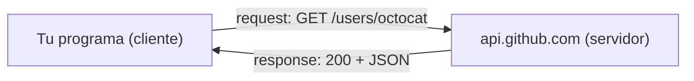
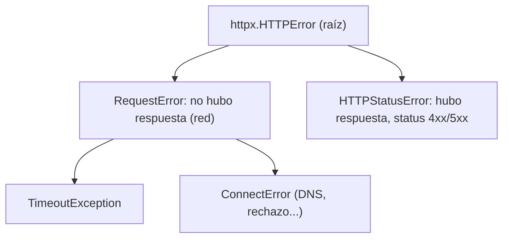

import Reto from "@components/Reto.astro";
import Solucion from "@components/Solucion.astro";
import Quiz from "@components/Quiz.astro";
import CheckDominio from "@components/CheckDominio.astro";
import Nivel from "@components/Nivel.astro";

<Nivel nivel="intermedio" />

Hasta ahora tus programas vivían encerrados: nacían y morían en la memoria, sin tocar el mundo. Esta lección los abre. Aprenderás a **persistir datos en archivos**, a hablar el idioma universal con el que los sistemas se intercambian información —**JSON**— y a **traer datos de internet** llamando a una API HTTP. Estos tres movimientos —leer un archivo, parsear un JSON, llamar a una API— son el 80% de lo que hace un AI/Automation Engineer en su día a día. Un agente de IA no es magia: es código que lee un archivo, arma un JSON, lo manda a una API, recibe otro JSON y decide qué hacer. Hoy aprendes las cuatro de esas cinco piezas.

> Antes de empezar, la misma advertencia de siempre: cuando llegues a la parte de APIs vas a sentir el impulso de pegar el ejemplo en una IA y pedir "hazme el cliente completo". Resiste. El objetivo no es que *funcione una vez*; es que entiendas **qué pasa cuando falla** —y en redes, todo falla— para que sepas arreglarlo sin depender de nadie.

:::tip[Si ya tocaste esto antes]
Si ya leíste archivos, manejaste JSON o llamaste a una API con `requests`, no te saltes la lección: úsala como **diagnóstico**. Salta directo a los **dos ejercicios Primero-Sin-IA** (sección 7) y resuélvelos a mano. El segundo —hacer un cliente de API **testeable y resiliente a fallos de red**— es justo donde se cae quien "ya sabe llamar APIs" pero nunca manejó un timeout ni un 500. Si lo cierras limpio en el timebox, valida con el check de dominio (sección 8) y avanza a [`1.6` Primer test unitario](/fase-1-lenguajes/). Si te trabas en el manejo de errores, vuelve a la sección 4.7.
:::

## 1. Qué vas a saber hacer

Al terminar, sin IA y sin notas, podrás:

- **O1 — Implementar** la lectura y escritura de archivos de texto y JSON (`open`/`with`, `json.load`/`json.dump`), haciendo un *round-trip* (guardar y volver a cargar) sin corromper los datos ni la codificación.
- **O2 — Consumir** una API HTTP con `requests` o `httpx`: construir la petición (URL, params, headers), distinguir el **status code** correcto del de error, y extraer el payload con `.json()`.
- **O3 — Depurar** un cliente de API frente a fallos reales —timeout, error de red, status 4xx/5xx, JSON inválido— explicando el *trade-off* entre dejar reventar el programa y manejar el error con gracia.

## 2. Por qué importa (el dinero está aquí)

> 💰 **Por qué importa:** "manejo de archivos, JSON y APIs" aparece en prácticamente toda oferta de AI/Automation Engineer, porque *integrar sistemas* **es** el trabajo. La diferencia entre un junior y un semi-senior no es saber llamar una API: es saber qué hacer cuando la API responde 503 a las 3 de la mañana.

Casi todo el valor que vas a producir nace de mover datos entre sistemas que no fueron diseñados para hablarse. Tu agente lee tickets de una API, los clasifica con un LLM (otra API), y escribe el resultado en una tercera. Tu pipeline de datos descarga un JSON, lo limpia, lo guarda. **El pegamento es esto.** Y el filtro de seniority está en el manejo de fallos: el código que asume que la red siempre responde y el JSON siempre viene bien formado es código de juguete. El que pone un `timeout`, valida el payload antes de usarlo y distingue un 404 de un 500 es código que aguanta producción —y eso es exactamente lo que se paga.

Hay un bonus directo: la lección que viene, [`1.10` tu primer llamado a un LLM](/fase-1-lenguajes/), **es esta misma mecánica**. Una API de OpenAI o Anthropic es una API HTTP como cualquier otra: armas un JSON, lo mandas con `httpx`, recibes un JSON, manejas el error si falla. Si dominas esto, tu primera victoria de IA es media hora de trabajo.

## 3. Lo que ya traes (actívalo)

Esta sub-unidad se para sobre lo anterior. Reúsalo:

- De [`0.7` Fundamentos de programación](/fase-0-fundamentos/): **`dict` y `list`**. Un JSON es, literalmente, `dict`s y `list`s anidados. Si sabes recorrer un `dict`, sabes recorrer un payload.
- De [`0.7`](/fase-0-fundamentos/) también: **`try`/`except` y `raise`**. El manejo de errores deja de ser teoría aquí: una llamada de red es el lugar donde *de verdad* las cosas fallan.
- De [`1.4` Type hints + pydantic](/fase-1-lenguajes/): **validar datos**. Un payload de una API es input no confiable. La regla "nunca confíes en datos externos sin validarlos" que viste con pydantic se aplica palabra por palabra al JSON que te llega de internet.
- De [`0.5` Terminal](/fase-0-fundamentos/): **`curl` y rutas de archivo**. Una petición HTTP con `requests` es lo mismo que un `curl`, pero desde Python.

Antes de seguir, responde de memoria (sin volver a 0.7):

<Quiz
  question={'En Python, ¿qué tipo nativo se parece más a un objeto JSON como {"nombre": "ada", "edad": 36}?'}
  options={[
    "Una list",
    "Un dict",
    "Una tuple",
  ]}
  answer={1}
  explanation="Un objeto JSON con pares clave-valor se mapea a un dict de Python. Un array JSON con corchetes se mapea a una list. Por eso parsear JSON es tan natural en Python: el resultado son justo las estructuras que ya conoces."
/>

## 4. Ejemplo resuelto, pensado en voz alta

Voy a construir, paso a paso, un mini-programa que **lee una lista de ciudades de un archivo, consulta una API por cada una, y guarda el resultado en otro archivo**. En el camino paso por archivos, JSON, peticiones HTTP, status codes y errores de red. **No leas esto como un resultado terminado: léelo como me oirías razonar si estuviera al lado tuyo.**

### 4.1 Archivos: leer y escribir texto

Un archivo es una secuencia de bytes en disco. Para trabajarlo lo **abres**, lo usas, y lo **cierras**. La forma correcta de garantizar el cierre —pase lo que pase— es el `with`:

```python
# Escribir
with open("notas.txt", "w", encoding="utf-8") as f:
    f.write("hola, ñandú\n")

# Leer
with open("notas.txt", "r", encoding="utf-8") as f:
    contenido = f.read()
```

Razono en voz alta: *"El `with` es un context manager (lo viste de pasada en [1.2](/fase-1-lenguajes/)): abre el archivo y garantiza que se cierre al salir del bloque, aunque explote una excepción adentro. Si abriera con `open(...)` a secas y olvidara `f.close()`, dejaría el archivo abierto —un recurso filtrado."*

Dos detalles que parecen menores y no lo son:

- **El modo.** `"r"` lee, `"w"` escribe **borrando lo que había**, `"a"` agrega al final. Confundir `"w"` con `"a"` borra datos. `"x"` crea solo si no existe.
- **`encoding="utf-8"`, siempre.** Sin él, Python usa la codificación del sistema operativo, que en Windows no es UTF-8. Resultado: la `ñ` y los acentos se corrompen en la máquina de tu compañero pero no en la tuya. Es el bug más frustrante de depurar porque "en mi máquina funciona". Ponlo **siempre**, explícito.

:::note[`pathlib`, el atajo moderno — guárdalo]
Para casos simples, `pathlib.Path` lee y escribe en una línea, sin `with`:

```python
from pathlib import Path
Path("notas.txt").write_text("hola\n", encoding="utf-8")
texto = Path("notas.txt").read_text(encoding="utf-8")
```

Para archivos grandes que procesas línea a línea, el `with open(...)` sigue siendo lo correcto (no carga todo a memoria). Por ahora, conoce ambos.
:::

### 4.2 JSON: el idioma universal de los datos

**JSON** (JavaScript Object Notation) es un formato de texto para representar datos estructurados. Es *el* formato que hablan las APIs. Se parece sospechosamente a los `dict` y `list` de Python, y no es casualidad:

| JSON | Python |
|---|---|
| `{"a": 1}` (object) | `dict` |
| `[1, 2, 3]` (array) | `list` |
| `"texto"` (string) | `str` |
| `42` / `3.14` (number) | `int` / `float` |
| `true` / `false` | `True` / `False` |
| `null` | `None` |

Dos verbos, y no los confundas nunca:

- **Serializar** (`dumps` = "dump string"): de objeto Python → texto JSON. Para *mandar* o *guardar*.
- **Parsear / deserializar** (`loads` = "load string"): de texto JSON → objeto Python. Para *recibir* o *cargar*.

```python
import json

datos = {"ciudad": "Santiago", "temp": 18.5, "lluvia": False}

# Serializar: objeto -> string JSON
texto = json.dumps(datos, ensure_ascii=False, indent=2)
# Parsear: string JSON -> objeto
otra_vez = json.loads(texto)
```

Razono: *"`json.dumps` me da un `str`. Le paso `ensure_ascii=False` para que la `ñ` y los acentos salgan como caracteres legibles y no como `ñ`. `indent=2` lo deja bonito para que un humano lo lea; si fuera para mandar por red, lo dejaría compacto sin `indent`."*

Para trabajar directo con **archivos**, `json` trae los gemelos sin la `s` (de *string*): `json.dump` (escribe a un archivo) y `json.load` (lee de un archivo):

```python
# Guardar un objeto Python como JSON en disco
with open("clima.json", "w", encoding="utf-8") as f:
    json.dump(datos, f, ensure_ascii=False, indent=2)

# Cargar de vuelta
with open("clima.json", "r", encoding="utf-8") as f:
    recuperado = json.load(f)
```

La regla mnemotécnica: **con `s` = string** (`dumps`/`loads`), **sin `s` = file** (`dump`/`load`). Es el error de tipeo #1 al empezar.

### 4.3 Round-trip y qué hacer cuando el archivo no coopera

El *round-trip* —guardar y volver a cargar— debe devolver un objeto igual al original. Pero el mundo real rompe esto de dos formas, y hay que anticiparlas:

```python
import json

def cargar_config(ruta):
    try:
        with open(ruta, "r", encoding="utf-8") as f:
            return json.load(f)
    except FileNotFoundError:
        # No existe todavía: devuelvo un default razonable, no reviento.
        return {}
    except json.JSONDecodeError as e:
        # Existe pero está corrupto: ESTO sí es un error que el llamador debe saber.
        raise ValueError(f"config en {ruta} no es JSON válido: {e}") from e
```

Razono en voz alta: *"Dos fallos distintos, dos respuestas distintas. Si el archivo **no existe**, no es un error grave: devuelvo `{}` y sigo —es esperable la primera vez. Pero si existe y tiene **JSON corrupto**, eso es un bug que debo gritar, no esconder: lo convierto en un `ValueError` con contexto. `JSONDecodeError` es subclase de `ValueError`, y lo re-lanzo con `from e` para no perder la causa original."* Decidir **qué error se traga y cuál se propaga** es justo el criterio de ingeniería que separa código robusto de código frágil.

### 4.4 Anatomía de una petición HTTP

Ahora la parte nueva. Una **API HTTP** es un servidor que responde a peticiones. Tú mandas una **request**, recibes una **response**. La request tiene cuatro piezas que ya viste de lejos en [`0.4` Cómo funciona la web](/fase-0-fundamentos/):



- **Método**: el verbo. `GET` (traer datos), `POST` (crear/enviar), `PUT`/`PATCH` (actualizar), `DELETE` (borrar).
- **URL**: la dirección del recurso, con **query params** opcionales después de `?` (`?ciudad=Santiago&unidades=metric`).
- **Headers**: metadata de la petición (`Authorization: Bearer ...`, `Content-Type: application/json`).
- **Body** (solo en `POST`/`PUT`): el payload que envías, casi siempre JSON.

La respuesta trae: un **status code** (el resultado, ver 4.6), **headers**, y un **body** (casi siempre JSON).

### 4.5 Hacer la petición: `requests` y `httpx`

Hay dos librerías que vas a ver. **`requests`** es la clásica, la que aparece en todo tutorial y respuesta de StackOverflow. **`httpx`** es la moderna: misma API casi idéntica, pero soporta `async` (lo verás en [1.3](/fase-1-lenguajes/)) y HTTP/2, y es la que usan por debajo los SDKs de OpenAI y Anthropic. **Aprende las dos; usa `httpx` por defecto en proyectos nuevos.**

Primero `requests`, que es la más difundida:

```python
import requests

resp = requests.get(
    "https://api.github.com/users/octocat",
    timeout=10,                       # SIEMPRE un timeout. Sin esto, un servidor lento te cuelga para siempre.
)
datos = resp.json()                   # parsea el body JSON a dict
print(datos["name"])                  # -> "The Octocat"
```

Ahora exactamente lo mismo con `httpx`. Mira lo poco que cambia:

```python
import httpx

resp = httpx.get(
    "https://api.github.com/users/octocat",
    timeout=10,
)
datos = resp.json()
print(datos["name"])
```

Razono: *"La firma es casi idéntica a propósito —httpx copió la API de requests para que migrar sea trivial. Lo que importa es el `timeout=10`: lo pongo en **toda** petición. `requests` y `httpx` no tienen timeout por defecto, así que sin él, si el servidor no responde, mi programa queda colgado indefinidamente. Es el error de novato que tumba pipelines en producción."*

Para mandar **query params**, no concatenes strings a la URL (te arriesgas a romper la codificación): pasa un `dict`.

```python
resp = httpx.get(
    "https://api.github.com/search/repositories",
    params={"q": "language:python", "sort": "stars"},
    timeout=10,
)
# La librería arma la URL: ...?q=language%3Apython&sort=stars  (encoding correcto, gratis)
```

### 4.6 Status codes: el semáforo de la respuesta

El servidor siempre responde con un **status code**: un número de 3 dígitos que dice *cómo le fue*. No alcanza con que la petición "no lance error" —tienes que mirar el código. Los rangos:

| Rango | Significa | Ejemplos |
|---|---|---|
| **2xx** | Éxito | `200 OK`, `201 Created`, `204 No Content` |
| **3xx** | Redirección | `301 Moved`, `304 Not Modified` |
| **4xx** | **Tú** te equivocaste | `400 Bad Request`, `401 Unauthorized`, `403 Forbidden`, `404 Not Found`, `429 Too Many Requests` |
| **5xx** | El **servidor** falló | `500 Internal Server Error`, `503 Service Unavailable` |

La distinción **4xx vs 5xx es de oro**: un 4xx es culpa de *tu* petición (URL mal, falta auth, recurso inexistente) —reintentar no sirve, hay que arreglar la petición. Un 5xx es culpa del *servidor* —puede ser temporal, y aquí *sí* tiene sentido reintentar (lo verás en [`3.14` resiliencia](/fase-0-fundamentos/), con backoff).

```python
resp = httpx.get("https://api.github.com/users/octocat", timeout=10)

if resp.status_code == 200:
    datos = resp.json()
elif resp.status_code == 404:
    raise ValueError("ese usuario no existe")
elif resp.status_code >= 500:
    raise RuntimeError("el servidor de GitHub está caído, reintenta más tarde")
```

El atajo idiomático para "reviénta si no fue 2xx" es `raise_for_status()`:

```python
resp = httpx.get("https://api.github.com/users/octocat", timeout=10)
resp.raise_for_status()      # lanza httpx.HTTPStatusError si el código es 4xx o 5xx
datos = resp.json()          # solo llego aquí si todo fue bien
```

Razono: *"`raise_for_status()` es azúcar: si el status es 4xx/5xx, lanza una excepción; si es 2xx, no hace nada y sigo. Me ahorra el `if`. Lo uso cuando cualquier error de status debe abortar; uso el `if` explícito cuando quiero **distinguir** un 404 (devuelvo `None`) de un 500 (reintento)."*

### 4.7 Errores de red: lo que pasa antes de que haya status

Hay una clase de fallo más traicionera que un 500: que **no haya respuesta en absoluto**. El DNS no resuelve, no hay internet, el servidor no contesta antes del timeout. En esos casos no hay `status_code` que mirar —la librería lanza una **excepción** antes. Hay que atraparla:

```python
import httpx

try:
    resp = httpx.get("https://api.github.com/users/octocat", timeout=10)
    resp.raise_for_status()
    datos = resp.json()
except httpx.TimeoutException:
    # El servidor no respondió a tiempo.
    print("timeout: el servidor tardó demasiado")
except httpx.HTTPStatusError as e:
    # Hubo respuesta, pero con status de error (4xx/5xx).
    print(f"status de error: {e.response.status_code}")
except httpx.RequestError as e:
    # Error de red sin respuesta (DNS, conexión rechazada, sin internet...).
    print(f"falló la conexión: {e}")
```

La jerarquía de excepciones de `httpx` —que conviene tener clara— es:



Razono: *"Separo tres mundos. `TimeoutException` y `ConnectError` son fallos de **red** (heredan de `RequestError`): no llegó respuesta. `HTTPStatusError` es otra cosa: **sí** hubo respuesta, pero con código malo. Atrapar `RequestError` cubre todos los de red de una; pero a veces quiero tratar el timeout distinto (reintentar) del DNS roto (avisar y rendirme). En `requests` los nombres cambian (`requests.exceptions.Timeout`, `requests.exceptions.RequestException`) pero el mapa mental es idéntico."*

### 4.8 Hacerlo testeable: el seam de inyección

Última pieza, y la más importante para tu carrera. ¿Cómo testeas código que llama a una API, si no quieres depender de internet (lento, frágil, con rate limits) cada vez que corres los tests? **No llamas la red en el test.** Separas *la lógica* (qué hago con la respuesta) de *la llamada* (traer la respuesta), inyectando la segunda:

```python
def nombre_de_usuario(user_id, fetch):
    """Decide qué hacer con la respuesta. NO sabe de dónde viene: la trae `fetch`."""
    resp = fetch(user_id)
    if resp.status_code == 200:
        return resp.json()["name"]
    if resp.status_code == 404:
        raise ValueError(f"usuario {user_id} no existe")
    raise RuntimeError(f"respuesta inesperada: {resp.status_code}")
```

En producción, `fetch` hace la llamada real con `httpx`. En el test, `fetch` es una función falsa que devuelve una respuesta inventada —sin tocar la red. Razono: *"Esto se llama **inyección de dependencias**, y es el truco que hace testeable todo código que toca el mundo externo. Lo verás formal en [`1.6` tests](/fase-1-lenguajes/) y otra vez en [`2.11` testear código que llama LLMs](/fase-0-fundamentos/): un LLM es una API, y la mockeas igual. Plantar el seam **ahora** te ahorra reescribir todo después."*

## 5. Errores que vas a tener (y por qué)

:::caution[Podrías pensar que `json.dumps` escribe en un archivo]
No. `json.dumps` (con `s`) devuelve un **string**; no toca el disco. Quien escribe en archivo es `json.dump` (sin `s`), que recibe el objeto **y** el archivo abierto: `json.dump(datos, f)`. El mismo par con `loads`/`load`. Mnemotécnica: **`s` de string, sin `s` de file**. Confundirlos da `TypeError` o un archivo con el texto `None` adentro.
:::

:::caution[Podrías pensar que si `requests.get` no lanza error, la petición salió bien]
Falso, y es la causa #1 de bugs silenciosos con APIs. `requests.get` y `httpx.get` **no** lanzan excepción por un status 404 o 500: te devuelven la respuesta con ese código tranquilamente. Si no revisas `resp.status_code` (o no llamas `raise_for_status()`), vas a llamar `resp.json()` sobre una página de error y obtener basura. Un 404 es una respuesta *exitosamente recibida* desde el punto de vista de la red: revisar el código es tu trabajo.
:::

:::caution[Podrías pensar que omitir el `timeout` está bien "porque la API es rápida"]
Hasta que no lo es. Sin `timeout`, si el servidor se cuelga, tu programa espera **para siempre** —no minutos, infinito. En un pipeline o un agente que corre desatendido, eso es un proceso zombi que hay que matar a mano. `requests` y `httpx` **no** ponen timeout por defecto. Pon `timeout=` en **toda** petición, sin excepción. Es la línea de código que más madrugadas salva.
:::

:::caution[Podrías pensar que el JSON que devuelve una API siempre tiene la forma que esperas]
Nunca asumas la forma de un payload externo. La API puede cambiar, devolver un error en formato JSON distinto, o un campo que esperabas como `{...}` venir como `null`. Acceder a `datos["usuario"]["nombre"]` a ciegas revienta con `KeyError`/`TypeError` el día que la forma cambie. Esto enlaza directo con [`1.4` pydantic](/fase-1-lenguajes/): **valida el payload contra un esquema antes de usarlo.** El JSON de internet es input no confiable, igual que lo que escribe un usuario.
:::

:::caution[Podrías pensar que poner la API key directo en el código es "temporal y está bien"]
No lo está, ni temporalmente. Una API key escrita en el código (`headers={"Authorization": "Bearer sk-abc123"}`) termina en Git, y de ahí es casi imposible borrarla del historial. Las keys van en **variables de entorno** (`os.environ["API_KEY"]`), nunca en el código ni en logs. Lo formalizas en F3/F5, pero el hábito —y el reflejo de no commitearlo— empieza hoy.
:::

## 6. Práctica con andamiaje (que se desvanece)

Tres niveles, de más apoyo a menos. Hazlos en orden, **a mano primero** (predecir antes de ejecutar).

### 6.1 PREDICT (sin ejecutar)

Sin correr nada, escribe qué imprime este programa:

```python
import json

datos = {"nombre": "ñandú", "patas": 2, "vuela": False}
texto = json.dumps(datos, ensure_ascii=False)
recuperado = json.loads(texto)
print(type(texto).__name__)
print(recuperado["vuela"])
print(recuperado == datos)
```

<Solucion title="Ver la respuesta (solo después de predecir)">
```
str
False
True
```
`json.dumps` devuelve un `str` (por eso `type(texto).__name__` es `"str"`). `loads` lo parsea de vuelta a un `dict`; el `false` de JSON se convierte en el `False` de Python. El round-trip es fiel, así que `recuperado == datos` es `True`. Si dijiste `dict` en la primera línea, confundiste `dumps` (que da string) con la idea de que "json son diccionarios".
</Solucion>

### 6.2 Parsons — reordena las líneas

Estas líneas implementan `traer_titulo(post_id, fetch)`, que devuelve el título de un post o maneja el error, pero están **desordenadas**. Reescríbelas en el orden correcto (cuida la indentación):

```text
        raise ValueError(f"post {post_id} no encontrado")
    resp = fetch(post_id)
def traer_titulo(post_id, fetch):
    if resp.status_code == 404:
        return resp.json()["title"]
    if resp.status_code == 200:
    raise RuntimeError(f"status inesperado: {resp.status_code}")
```

<Solucion title="Ver el orden correcto">

```python
def traer_titulo(post_id, fetch):
    resp = fetch(post_id)                  # 1. traigo la respuesta (inyectada)
    if resp.status_code == 200:            # 2. caso feliz primero
        return resp.json()["title"]
    if resp.status_code == 404:            # 3. error esperado y específico
        raise ValueError(f"post {post_id} no encontrado")
    raise RuntimeError(f"status inesperado: {resp.status_code}")  # 4. todo lo demás
```

La lógica del orden: **traer** la respuesta, manejar el **caso 200** (devuelve y sale), luego los **errores específicos** (404), y al final un **catch-all** para cualquier otro código. Si pusieras el `raise RuntimeError` antes del `if 404`, nunca llegarías a distinguir el 404. El orden de las guardas importa.
</Solucion>

### 6.3 MODIFY

Toma `cargar_config` de la sección 4.3 y modifícala para que, además, **acepte un default**: la firma pasa a `cargar_config(ruta, default=None)` y, cuando el archivo no existe, devuelve `default` en vez de `{}` fijo. Pruébalo mentalmente con un archivo inexistente pasando `default=[]`: debe devolver `[]`, no `{}`. Una sola línea cambia.

## 7. Ejercicios Primero-Sin-IA

Ahora sin andamiaje. Resuélvelos **a mano, sin IA** dentro del timebox. El primero es nuevo (archivos + JSON con casos borde); el segundo es el que de verdad te hace ingeniero (un cliente de API resiliente y testeable). Está bien que sea lento: el músculo se construye con el esfuerzo, no con la respuesta.

<Reto title="Bitácora en JSON (round-trip robusto)" timebox="35–45 min">

Implementa un pequeño módulo de **bitácora persistente** que carga registros de un archivo JSON, agrega uno nuevo y vuelve a guardar —sin corromper datos ni codificación, y manejando los casos borde.

Funciones a implementar (firmas en el starter):
- `cargar(ruta) -> list` — devuelve la lista de registros; si el archivo **no existe**, devuelve `[]`; si existe pero el JSON es **inválido**, lanza `BitacoraCorrupta`.
- `agregar(ruta, mensaje) -> None` — carga, agrega `{"mensaje": mensaje}` al final, y guarda con UTF-8 e indentado.
- `resumen(registros) -> dict` — devuelve `{"total": n}` con la cantidad de registros.

Entregable: tu solución en `ejercicios/fase-1/bitacora-json/` con los tests en verde y **un caso borde tuyo** agregado.

**Hecho significa:**
- [ ] El round-trip es fiel: agregar y recargar devuelve los mismos datos, con acentos/`ñ` intactos.
- [ ] Archivo inexistente → `cargar` devuelve `[]` sin reventar.
- [ ] JSON corrupto → `cargar` lanza `BitacoraCorrupta` (no un `JSONDecodeError` crudo).
- [ ] Todos los tests pasan y agregaste al menos uno propio.
- [ ] Puedes explicar **por qué** usas `encoding="utf-8"` y `ensure_ascii=False`, sin notas.

Enunciado completo, starter y tests: `ejercicios/fase-1/bitacora-json/` (carpeta del repo).

<Solucion title="Pista (ábrela solo si superaste el timebox)">
Piensa el **contrato** primero (spec-first): qué entra, qué sale, qué casos borde. `cargar` necesita dos `except` distintos: `FileNotFoundError` → `return []`; `json.JSONDecodeError` → `raise BitacoraCorrupta(...) from e`. `agregar` es `cargar` + `.append(...)` + guardar con `json.dump(..., ensure_ascii=False, indent=2)`. No reinventes la serialización: el módulo `json` ya hace todo. Esto es una pista, no la solución.
</Solucion>

</Reto>

<Reto title="Cliente de API resiliente y testeable" timebox="30–40 min">

Implementa `nombre_de_usuario(user_id, fetch)`: dado un `user_id` y una función `fetch` inyectada (que hace la llamada HTTP y devuelve un objeto con `.status_code` y `.json()`), devuelve el nombre del usuario, manejando los fallos como un ingeniero.

Contrato (firmas y excepciones en el starter):
- `user_id` inválido (≤ 0 o no entero) → lanza `ValueError` **antes** de llamar `fetch`.
- `fetch` lanza `TimeoutError` o `ConnectionError` (errores de red simulados) → conviértelo en `ServicioInalcanzable`.
- status `200` → devuelve `resp.json()["name"]`.
- status `404` → lanza `UsuarioNoEncontrado`.
- status `>= 500` → lanza `ServicioCaido`.
- cualquier otro status → lanza `RespuestaInesperada`.

La gracia: como `fetch` está **inyectado**, tus tests no tocan la red. Pasas un `fetch` falso que devuelve la respuesta que tú quieras (o que lanza el error que quieras).

Entregable: tu solución en `ejercicios/fase-1/cliente-api-resiliente/` con los tests en verde y **un caso borde tuyo** agregado.

**Hecho significa:**
- [ ] Validas `user_id` **antes** de llamar `fetch` (no malgastas una petición en input inválido).
- [ ] Distingues los cuatro destinos de status (200 / 404 / 5xx / otro), cada uno con su excepción.
- [ ] Conviertes el error de red en `ServicioInalcanzable` (no dejas escapar el `TimeoutError` crudo).
- [ ] Todos los tests pasan **sin red** y agregaste al menos uno propio.
- [ ] Puedes explicar por qué inyectar `fetch` hace el código testeable, sin notas.

Enunciado completo, starter y tests: `ejercicios/fase-1/cliente-api-resiliente/` (carpeta del repo).

<Solucion title="Pista (ábrela solo si superaste el timebox)">
Orden de las guardas: primero **valida** `user_id` y lanza `ValueError` si es inválido (esto va antes del `try`). Luego envuelve `fetch(user_id)` en un `try/except (TimeoutError, ConnectionError)` que re-lanza `ServicioInalcanzable`. Con la respuesta en mano, ramifica por `status_code` con el caso feliz (200) primero, luego 404, luego `>= 500`, y un catch-all final. Recuerda la lección de 4.6: el orden de los `if` importa. Pista, no solución.
</Solucion>

</Reto>

## 8. Check de dominio

Sin mirar la lección, en voz alta o por escrito:

<CheckDominio
  items={[
    "Explicar la diferencia entre json.dumps/loads y json.dump/load con un ejemplo.",
    "Decir por qué encoding='utf-8' y ensure_ascii=False importan, y qué se rompe sin ellos.",
    "Nombrar qué significa cada rango de status code (2xx/3xx/4xx/5xx) y por qué 4xx vs 5xx cambia tu reacción.",
    "Escribir, sin ejecutar, un GET con httpx que ponga timeout y maneje timeout, error de status y error de red por separado.",
    "Explicar por qué inyectar la función de fetch hace testeable un cliente de API.",
    "Decir por qué nunca debes confiar en la forma del JSON que devuelve una API externa.",
  ]}
/>

Si marcaste menos de cinco, vuelve a la sección correspondiente **antes** de avanzar. No es un examen: es honestidad contigo.

<Quiz
  question="Llamas httpx.get(url) y el servidor responde 404. ¿Qué pasa por defecto?"
  options={[
    "httpx lanza una excepción automáticamente por ser un error",
    "Devuelve la respuesta con status_code 404; revisar el código es tu trabajo",
    "Devuelve None",
  ]}
  answer={1}
  explanation="Un 404 es una respuesta exitosamente recibida a nivel de red. httpx/requests NO lanzan excepción por status 4xx/5xx: te devuelven la respuesta con ese código. Tú revisas resp.status_code o llamas raise_for_status(). Asumir que 'no lanzó error = salió bien' es el bug silencioso #1 con APIs."
/>

## 9. Recursos (documentación oficial primero)

- **`json` — Python oficial:** [docs.python.org/3/library/json.html](https://docs.python.org/3/library/json.html) — la fuente de verdad para `dump`/`dumps`/`load`/`loads`.
- **Lectura/escritura de archivos — tutorial oficial:** [docs.python.org/3/tutorial/inputoutput.html](https://docs.python.org/3/tutorial/inputoutput.html#reading-and-writing-files).
- **`httpx` — documentación oficial:** [www.python-httpx.org](https://www.python-httpx.org/) — empieza por *QuickStart*; revisa *Exceptions* para la jerarquía de errores.
- **`requests` — documentación oficial:** [requests.readthedocs.io](https://requests.readthedocs.io/en/latest/) — la *Quickstart* cubre el 90% de lo que usarás.
- **Status codes de referencia (MDN):** [developer.mozilla.org/.../HTTP/Status](https://developer.mozilla.org/en-US/docs/Web/HTTP/Status) — el catálogo completo, en inglés (vocabulario que tendrás que dominar).
- **API pública sin auth para practicar:** [GitHub REST API](https://docs.github.com/en/rest/users/users) — `https://api.github.com/users/<usuario>` devuelve JSON real sin necesitar key (ojo con el rate limit).

## 10. Conexión con el capstone de la fase

El **Capstone F1 — La misma app, dos lenguajes** (una mini-API de tu despensa de HomeBase, escrita en Python y en TypeScript) descansa sobre esta lección:

- La API **recibirá** peticiones HTTP con payloads JSON y **devolverá** JSON: serializar y parsear es su pan diario.
- Probablemente **persista** datos (en un archivo JSON al principio, en una base después): el round-trip robusto de la sección 4.3 es exactamente eso.
- Y cuando la pruebes, lo harás **sin depender de servicios externos**: el seam de inyección de la sección 4.8 es el que hace tus tests rápidos y confiables.

Más cerca aún: [`1.10` tu primer llamado a un LLM](/fase-1-lenguajes/) **es** esta lección aplicada a una API de IA. Lo que aprendiste aquí —timeout, status, manejar el error, validar el payload— es palabra por palabra lo que necesitas para que tu primera victoria de IA no se caiga al primer 429.

## 11. Reflexión y repaso espaciado

Cierra escribiendo dos o tres frases respondiendo: **¿cuál de los cuatro modos de fallo de una API —timeout, error de red sin respuesta, status 4xx, status 5xx— te costó más distinguir, y por qué?** Nombrar la confusión con precisión ("no veía la diferencia entre un 500 y un timeout") es lo que la convierte en algo que puedes atacar.

Gancho de **spaced repetition**:

- **Mañana:** reescribe de memoria, sin mirar, el bloque `try/except` de la sección 4.7 (timeout / status / red, los tres por separado). Si no puedes, no lo aprendiste todavía.
- **En 3 días:** toma el ejercicio del cliente de API y agrégale un caso: si el status es `429` (rate limit), lanza una excepción `DemasiadasPeticiones` distinta del resto. Sin volver a leer tu solución vieja.
- **En 1 semana:** explícale a alguien (o a una grabación) por qué inyectar `fetch` hace testeable el código que llama a una API. Enseñarlo es el test de dominio definitivo —y es exactamente lo que te van a pedir en una entrevista.
