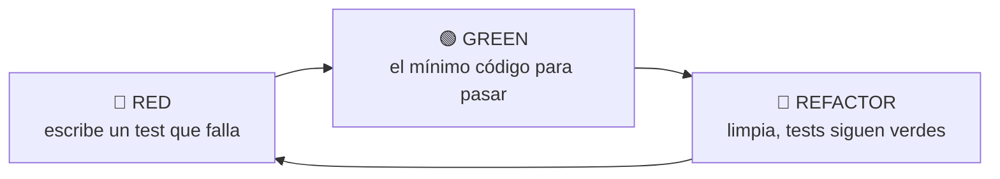

import Reto from "@components/Reto.astro";
import Solucion from "@components/Solucion.astro";
import Quiz from "@components/Quiz.astro";
import CheckDominio from "@components/CheckDominio.astro";
import Nivel from "@components/Nivel.astro";

<Nivel nivel="intermedio" />

Hasta ahora, para saber si tu código funcionaba, lo corrías, mirabas la salida con los ojos y decías "se ve bien". Ese método tiene un problema: no escala, no se repite y se basa en tu memoria de qué *debería* salir. Esta lección te enseña a escribir esa verificación **una vez, como código**, para que una máquina la corra por ti mil veces sin cansarse. Eso es un **test unitario**, y la herramienta para escribirlos en Python es **pytest**.

Pero hay algo más grande aquí. Vas a aprender a escribir el test **antes** que el código —el ciclo **red-green-refactor**, también llamado **TDD** (Test-Driven Development)—. No es un truco de gente obsesiva: es la forma más limpia de convertir "lo que quiero que haga" en algo verificable, y es **el corazón del Primero-Sin-IA**. Cuando tienes un test que dice exactamente qué debe pasar, ya no necesitas preguntarle a una IA "¿esto está bien?". El test te responde, en verde o en rojo.

:::tip[Si ya tocaste esto antes]
¿Ya corriste pytest o escribiste un `assert`? No te saltes la lección: úsala como **diagnóstico**. Salta a los **dos ejercicios Primero-Sin-IA** (sección 7) y resuélvelos a mano. El primero te obliga a hacer el ciclo red-green-refactor *de verdad* (escribir el test que falla **antes** del código); el segundo mide si sabes aislar un test con `tmp_path` y comprimir casos con `parametrize` —justo donde se cae quien "ya usa pytest" pero nunca pasó del `assert` plano. Si los cierras limpio en el timebox, valida con el check de dominio (sección 8) y avanza. Si te trabas, vuelve a la sección 4.
:::

## 1. Qué vas a saber hacer

Al terminar, sin IA y sin notas, podrás:

- **O1 — Implementar** un test unitario con pytest usando `assert`, ejecutarlo con el comando `pytest`, y leer su salida (qué pasó, qué falló y por qué).
- **O2 — Aplicar** el ciclo **red-green-refactor**: escribir un test que falla *antes* de implementar, hacerlo pasar con el mínimo código, y refactorizar con la red de seguridad puesta.
- **O3 — Diseñar** tests legibles y sin repetición usando `@pytest.mark.parametrize` (varios casos), `pytest.raises` (verificar errores) y *fixtures* como `tmp_path` (aislar el estado), y **explicar el trade-off** entre testear comportamiento y acoplarse a la implementación.

## 2. Por qué importa (el dinero está aquí)

> 💰 **Por qué importa:** testing es la línea que separa a un junior de un semi-senior. Los juniors "prueban a mano" y entregan código que funciona *una vez*; los semi-seniors dejan una suite de tests que demuestra que sigue funcionando *después de cada cambio*. Esa diferencia es exactamente lo que se paga por encima —y en 2026, con las entrevistas técnicas blindadas contra el copy-paste de IA, **saber razonar tu propio test en voz alta es una ventaja real de mercado**.

Hay dos razones por las que esta sub-unidad es bisagra:

1. **Es tu red de seguridad para todo lo que viene.** En la Fase 2 vas a *refactorizar* código y aplicar SOLID; no puedes refactorizar con confianza sin tests que te avisen si rompiste algo. En la Fase 6, cuando tu código llame a un LLM, vas a *mockear* esa llamada en los tests —y mockear es testing. El hilo de **testing arranca aquí y no se suelta** hasta el final del curso: todo capstone se entrega con tests verdes.
2. **TDD es el mejor entrenador del Primero-Sin-IA.** El riesgo de aprender con IA es delegar el *pensar*. Un test escrito por ti, antes del código, es una declaración de lo que entendiste del problema. Si tu test es vago, tu entendimiento es vago —y eso sale a la luz al instante. Escribir el test primero te fuerza a pensar el problema antes de teclear la solución. Es spec-first ([lo viste en `0.8`](/fase-0-fundamentos/)) pero ejecutable.

## 3. Lo que ya traes (actívalo)

Esta sub-unidad se para sobre lo anterior. Reúsalo:

- De [`0.7` Fundamentos](/fase-0-fundamentos/) y [`1.1` Python](/fase-1-lenguajes/1-1-python-basico-intermedio/): **funciones, valores de retorno y `raise`**. Un test no es más que una función que *llama a tu función* y comprueba lo que devuelve (o el error que lanza).
- De [`0.8` Spec-first](/fase-0-fundamentos/): la idea de **definir entradas, salidas y casos borde antes de codear**. Un test *es* esa spec, escrita en código que se puede ejecutar.
- De [`1.5` Archivos, JSON y APIs](/fase-1-lenguajes/1-5-archivos-json-apis/): el **seam de inyección** que hiciste para testear sin red. Esta lección le pone nombre y herramienta a esa intuición.
- De [`1.4` Type hints + pydantic](/fase-1-lenguajes/1-4-type-hints-mypy-pydantic/): la idea de que **los errores deben saltar temprano**. `mypy` los caza en tu editor; los tests los cazan antes de producción.

Antes de seguir, responde de memoria:

<Quiz
  question="¿Qué es, en esencia, un test unitario?"
  options={[
    "Un programa que arregla los bugs de tu código automáticamente",
    "Código que llama a tu función con una entrada conocida y verifica que la salida sea la esperada",
    "Una medición del porcentaje de líneas de tu código que se ejecutan",
  ]}
  answer={1}
  explanation="Un test unitario es código que ejerce una unidad (normalmente una función) con una entrada conocida y afirma cuál debe ser el resultado. No arregla nada por sí solo (solo te avisa que algo falló) y no es lo mismo que el coverage (eso mide qué líneas se ejecutan, no si el resultado es correcto)."
/>

## 4. Ejemplo resuelto, pensado en voz alta

Voy a construir una función con TDD, paso a paso: `iniciales(nombre)`, que toma un nombre completo y devuelve sus iniciales en mayúscula (`"ada lovelace"` → `"AL"`). **No leas esto como un resultado terminado: léelo como me oirías razonar si estuviera al lado tuyo.** El orden importa tanto como el código.

### 4.1 El modelo mental: un test es una afirmación que se ejecuta

La pieza fundamental de un test en pytest es la palabra clave de Python que ya conoces: **`assert`**. `assert expresión` no hace nada si la expresión es verdadera, y **lanza un error** si es falsa.

```python
assert 2 + 2 == 4      # pasa en silencio
assert 2 + 2 == 5      # AssertionError: revienta
```

Un test no es más que una **función cuyo nombre empieza con `test_`** que contiene uno o más `assert`. Si ningún `assert` falla, el test **pasa** (verde). Si alguno falla, el test **falla** (rojo). Eso es todo el mecanismo.

Razono en voz alta: *"Lo bonito de pytest es que uso el `assert` de toda la vida —no tengo que aprender métodos raros como `assertEqual` (eso es de `unittest`, la librería vieja). pytest reescribe el `assert` por debajo para que, cuando falle, me muestre **exactamente** qué valía cada lado de la comparación. Esa introspección es la razón #1 por la que se usa pytest sobre `unittest`."*

### 4.2 Anatomía de un test: AAA, nombre, descubrimiento

Un buen test tiene tres fases —el patrón **AAA: Arrange–Act–Assert**—:

```python
def test_iniciales_de_dos_nombres():
    nombre = "ada lovelace"          # Arrange: preparo la entrada
    resultado = iniciales(nombre)    # Act: ejecuto la unidad bajo prueba
    assert resultado == "AL"         # Assert: afirmo el resultado esperado
```

Tres reglas que parecen menores y no lo son:

- **El nombre del test es documentación.** `test_iniciales_de_dos_nombres` dice qué se prueba sin abrir el cuerpo. `test_1` no dice nada. Cuando un test falla en un pipeline a las 3am, su nombre es lo primero que lees.
- **pytest descubre los tests por convención**, no por configuración: busca archivos `test_*.py` (o `*_test.py`) y, dentro, funciones `test_*`. Si tu archivo o función no empieza con `test`, pytest no los ve. Es el "no me corre ningún test" del novato.
- **Un test, una afirmación de comportamiento.** Puedes tener varios `assert`, pero si pruebas tres cosas distintas, probablemente quieras tres tests —cuando falle, sabrás *cuál* de las tres se rompió.

Para correrlos, desde la terminal, en la carpeta del proyecto:

```bash
pytest            # descubre y corre todos los tests
pytest -v         # verbose: lista cada test con su nombre y resultado
pytest -q         # quiet: solo el resumen
```

### 4.3 El ciclo: RED → GREEN → REFACTOR

Aquí está el método. **Escribo el test primero, cuando todavía no existe la función.** Suena al revés; es el punto.

**Paso 1 — RED (rojo):** escribo el test que describe lo que quiero, y lo corro sabiendo que va a fallar.

```python
# test_iniciales.py
from iniciales import iniciales

def test_iniciales_de_dos_nombres():
    assert iniciales("ada lovelace") == "AL"
```

Corro `pytest` y, como `iniciales` ni siquiera existe (o devuelve `NotImplementedError`), el test **falla**. Razono: *"Esto no es un accidente: es el paso. Ver el test en **rojo primero** me confirma que el test de verdad está probando algo. Un test que nunca viste fallar podría estar verde por la razón equivocada —por ejemplo, porque tiene un error de tipeo y no prueba nada. El rojo es la prueba de que mi red de seguridad está conectada."*

**Paso 2 — GREEN (verde):** escribo el **mínimo** código para que pase. Nada más.

```python
# iniciales.py
def iniciales(nombre):
    partes = nombre.split()
    letras = [parte[0] for parte in partes]
    return "".join(letras).upper()
```

Corro `pytest` → verde. Razono: *"Resisto la tentación de adelantarme y manejar ya los acentos, los nombres vacíos, los espacios dobles. Todavía no tengo un test que lo pida. El TDD avanza en pasos chicos: cada paso, un test rojo que vuelvo verde. La disciplina de no escribir código que ningún test exige es lo que mantiene el diseño simple."*

**Paso 3 — REFACTOR:** con el test en verde, puedo **mejorar el código sin miedo**, porque si lo rompo, el test se pone rojo de inmediato.

```python
def iniciales(nombre):
    # Más legible: una comprehension directa sobre las palabras.
    return "".join(palabra[0] for palabra in nombre.split()).upper()
```

Corro `pytest` → sigue verde. Razono: *"Refactorizar es cambiar la **forma** del código sin cambiar su **comportamiento**. La única manera de hacerlo con confianza es tener tests que verifiquen el comportamiento. Sin la red, 'refactorizar' es 'cambiar cosas y rezar'. Esta es la razón por la que la Fase 2 exige tests **antes** de refactorizar."*



### 4.4 Testear que algo **falla**: `pytest.raises`

La mitad de la ingeniería es el camino feliz; la otra mitad es qué pasa cuando la entrada es mala. ¿Cómo testeo que `iniciales("")` lanza un error? No puedo poner `assert iniciales("") == ...` porque la gracia es que **no** devuelva nada, sino que **lance una excepción**. Para eso pytest da un context manager:

```python
import pytest

def test_nombre_vacio_lanza_value_error():
    with pytest.raises(ValueError):
        iniciales("")
```

El test pasa **si y solo si** el bloque lanza un `ValueError`. Si no lanza nada (o lanza otra excepción), el test falla. Esto es RED otra vez: hoy mi `iniciales("")` no lanza `ValueError` —lanza un `IndexError` feo, o devuelve `""`—. Así que voy a GREEN:

```python
def iniciales(nombre):
    palabras = nombre.split()
    if not palabras:
        raise ValueError("el nombre no puede estar vacío")
    return "".join(palabra[0] for palabra in palabras).upper()
```

Razono: *"`pytest.raises(ValueError)` es el espejo de `assert` para errores. Y fíjate en el flujo TDD: el test del caso borde me **empujó** a manejar el caso borde. No lo manejé 'por si acaso'; lo manejé porque un test rojo lo exigió. El test maneja el diseño."*

### 4.5 Muchos casos sin repetir: `@pytest.mark.parametrize`

Quiero probar `iniciales` con varias entradas: un nombre, dos, tres. Podría copiar y pegar el test tres veces, pero eso es repetición. pytest tiene una mejor forma: **parametrizar**.

```python
import pytest

@pytest.mark.parametrize(
    "entrada, esperado",
    [
        ("ada", "A"),
        ("ada lovelace", "AL"),
        ("grace brewster hopper", "GBH"),
    ],
)
def test_iniciales(entrada, esperado):
    assert iniciales(entrada) == esperado
```

Razono en voz alta: *"El decorador `@pytest.mark.parametrize` le dice a pytest: 'corre esta función una vez por cada fila de la lista, inyectando esos valores'. El primer argumento es un string con los nombres de los parámetros; el segundo, la lista de tuplas con los casos. pytest lo cuenta como **tres tests separados** —si el de tres nombres falla, los otros dos siguen pasando, y veo exactamente cuál se rompió. Es la diferencia entre 'algo falló' y 'falló el caso de tres nombres'."*

Esto es enorme para los casos borde: agregar un caso nuevo es **una línea** en la lista, no un test entero.

### 4.6 Aislar el estado: *fixtures* y `tmp_path`

Hasta aquí testée una función pura (misma entrada → misma salida, sin tocar el mundo). Pero en [`1.5`](/fase-1-lenguajes/1-5-archivos-json-apis/) escribiste funciones que **leen y escriben archivos**. ¿Cómo testeo `cargar_config(ruta)` sin ensuciar mi repo con archivos de prueba, ni depender de que exista un archivo concreto en mi disco?

La respuesta de pytest son las **fixtures**: piezas reutilizables que *preparan* el entorno de un test y lo *limpian* después. pytest trae varias incorporadas; la más útil al principio es **`tmp_path`**: te da un directorio temporal, único y vacío para ese test, que pytest borra solo al terminar.

```python
import json
from config import cargar_config   # función de 1.5 que lee un JSON

def test_cargar_config_lee_un_json(tmp_path):
    # Arrange: creo un archivo de verdad, pero en un dir temporal desechable.
    ruta = tmp_path / "config.json"
    ruta.write_text('{"tema": "oscuro"}', encoding="utf-8")
    # Act + Assert
    assert cargar_config(ruta) == {"tema": "oscuro"}
```

Razono: *"`tmp_path` aparece como **argumento** del test —no lo creo yo, pytest lo inyecta porque reconoce el nombre. Es un `pathlib.Path` a una carpeta temporal aislada. Escribo ahí un archivo real, pruebo contra él, y no me preocupo de borrarlo: pytest destruye el directorio al terminar el test. Cero basura, cero dependencia del orden de los tests."*

¿Y si varios tests necesitan **los mismos datos de partida**? Extraigo esos datos a una fixture propia con el decorador `@pytest.fixture`:

```python
import pytest

@pytest.fixture
def usuario_demo():
    """Datos de prueba reutilizables. Se recalculan frescos para cada test."""
    return {"nombre": "ada", "rol": "admin"}

def test_usuario_es_admin(usuario_demo):     # pido la fixture por su nombre
    assert usuario_demo["rol"] == "admin"

def test_usuario_tiene_nombre(usuario_demo): # cada test recibe una copia fresca
    assert usuario_demo["nombre"]
```

Razono: *"Una fixture es una función decorada con `@pytest.fixture` que **devuelve** lo que el test necesita. El test la 'pide' poniendo su nombre como parámetro, y pytest se encarga de llamarla e inyectar el resultado. Lo clave: cada test recibe su **propia** invocación fresca —no comparten el mismo `dict`—, así que un test no puede ensuciar a otro. Esto se llama **inyección de dependencias**, el mismo patrón que usaste a mano en `1.5` con `fetch`; pytest lo automatiza."*

### 4.7 El detalle de los `float`: `pytest.approx`

Una trampa que te va a morder: los números decimales no se comparan con `==`. `0.1 + 0.2` **no** es exactamente `0.3` en ningún lenguaje (es `0.30000000000000004`, por cómo se guardan los `float`). Así que `assert 0.1 + 0.2 == 0.3` **falla**. La solución de pytest:

```python
from pytest import approx

def test_suma_de_floats():
    assert 0.1 + 0.2 == approx(0.3)   # "aproximadamente igual", con tolerancia
```

Razono: *"`approx` compara con una tolerancia chiquita en vez de exigir igualdad bit a bit. Úsalo siempre que el resultado sea un `float` calculado. Para dinero, la jugada de semi-senior es otra: trabaja en **enteros** (centavos o pesos) y evita el `float` por completo —lo verás en el primer ejercicio."*

## 5. Errores que vas a tener (y por qué)

:::caution[Podrías pensar que más tests = más coverage = mejor]
El **coverage** (porcentaje de líneas ejecutadas por los tests) mide *cuánto* corriste, no *si verificaste algo*. Puedes tener 100% de coverage con tests que no afirman nada útil —ejecutan todas las líneas pero no comprueban el resultado. Perseguir un número de coverage como meta es un antipatrón clásico: la gente escribe tests-relleno para subir la cifra. Lo que importa son **aserciones que de verdad pueden fallar**. La calidad de los tests (mutation testing, behavior coverage) la formalizas en la Fase 2; por ahora graba: el coverage es un síntoma, no el objetivo.
:::

:::caution[Podrías pensar que un test que pasa demuestra que tu código es correcto]
No. Un test solo demuestra que tu código funciona **para los casos que probaste**. Como dijo Dijkstra: *"los tests pueden mostrar la presencia de bugs, nunca su ausencia"*. Si solo probaste `iniciales("ada lovelace")`, no sabes nada de `iniciales("")` ni de `iniciales("  ada  ")`. Por eso el TDD insiste en los casos borde: cada caso que no probaste es un bug esperando. El verde no es "es correcto"; es "no falla *en lo que miré*".
:::

:::caution[Podrías pensar que escribir el test después del código es lo mismo]
Da tests parecidos, pero te pierdes lo más valioso. Si escribes el código primero, tu test tiende a "confirmar lo que el código ya hace" —incluidos sus bugs— porque tu cabeza ya está sesgada hacia tu implementación. Escribir el test **primero** te obliga a pensar en el *comportamiento deseado* antes de tener una solución en mente, y te garantiza haber visto el test en **rojo** al menos una vez (la prueba de que prueba algo). El orden no es ceremonia: cambia qué tan honesto es el test.
:::

:::caution[Podrías pensar que hay que mockear todo lo que el código toca]
Tentador, pero peligroso. Un *mock* (un doble falso de una dependencia) es necesario cuando la dependencia es lenta o externa —la red, un LLM, un reloj—. Pero mockear de más **acopla el test a la implementación**: el test deja de verificar *qué hace* tu código y pasa a verificar *cómo lo hace*, así que cualquier refactor lo rompe aunque el comportamiento no cambie. Regla: mockea los **bordes del sistema** (red, disco, hora), no la lógica interna. La taxonomía completa de dobles (mock/stub/spy/fake) la ves en la Fase 2.
:::

:::caution[Podrías pensar que pytest corre tu archivo aunque se llame `pruebas.py`]
No. pytest **descubre por convención**: archivos `test_*.py` o `*_test.py`, y funciones `test_*`. Si tu archivo se llama `pruebas.py` o tu función `verifica_iniciales`, pytest no los encuentra y verás "no tests ran" —que parece "todo bien" pero significa "no probé nada". Respeta el prefijo `test_`.
:::

## 6. Práctica con andamiaje (que se desvanece)

Tres niveles, de más apoyo a menos. Hazlos **a mano primero** (predecir antes de ejecutar).

### 6.1 PREDICT (sin ejecutar)

Dado este código en `multiplica.py`:

```python
def multiplica(a, b):
    return a + b      # ⚠️ ojo: dice +, no *
```

Y este test en `test_multiplica.py`:

```python
import pytest
from multiplica import multiplica

@pytest.mark.parametrize("a, b, esperado", [
    (2, 3, 6),
    (0, 5, 0),
    (4, 1, 4),
])
def test_multiplica(a, b, esperado):
    assert multiplica(a, b) == esperado
```

Sin correr nada: ¿cuántos de los tres casos **pasan** y cuántos **fallan**? Para cada uno, escribe qué devuelve la función vs. qué se esperaba.

<Solucion title="Ver la respuesta (solo después de predecir)">
**Fallan los tres.** Pasan **0**.

| Caso | `a+b` (lo que la función hace) | esperado | resultado |
|---|---|---|---|
| `(2, 3, 6)` | `5` | `6` | ❌ falla |
| `(0, 5, 0)` | `5` | `0` | ❌ falla |
| `(4, 1, 4)` | `5` | `4` | ❌ falla |

La función **suma** en vez de multiplicar (`+` donde debería ir `*`), así que devuelve `5`, `5`, `5` en los tres casos. Si predijiste "pasan los tres", caíste en leer el `*` que *esperabas* en vez del `+` que está *escrito*: justo el sesgo que un test atrapa y tu ojo no. Por eso el test rojo es valioso —ejecuta lo que **está**, no lo que crees que está— y por eso `parametrize` ayuda: ves de un vistazo que el fallo es sistemático (los tres), no un caso suelto, lo que apunta directo a un bug en la función, no en un caso de prueba.
</Solucion>

### 6.2 Parsons — reordena las líneas

Estas líneas forman un test que usa `pytest.raises` para verificar que `dividir(10, 0)` lanza `ZeroDivisionError`, pero están **desordenadas**. Reescríbelas en el orden correcto (cuida la indentación):

```text
        dividir(10, 0)
import pytest
    with pytest.raises(ZeroDivisionError):
from calc import dividir
def test_dividir_por_cero_lanza_error():
```

<Solucion title="Ver el orden correcto">

```python
import pytest
from calc import dividir

def test_dividir_por_cero_lanza_error():
    with pytest.raises(ZeroDivisionError):
        dividir(10, 0)
```

La lógica: primero los **imports** (`pytest` y la función bajo prueba), luego la **definición** del test con nombre descriptivo, dentro el **context manager** `with pytest.raises(...)`, y la llamada que debe fallar **indentada** dentro del `with`. Si pones `dividir(10, 0)` fuera del `with`, la excepción escapa sin ser capturada y el test revienta en vez de pasar. La indentación es semántica, no decorativa.
</Solucion>

### 6.3 MODIFY

Toma el test parametrizado de `iniciales` de la sección 4.5 y **agrégale dos casos borde**: (a) un solo nombre que ya viene en mayúscula, `"ADA"` → `"A"`; (b) un nombre con tres palabras a tu elección. Es **una línea por caso** en la lista de `parametrize`. Luego pregúntate: ¿qué caso borde *no* está cubierto todavía y debería tener su propio test con `pytest.raises`? (Pista: ¿qué pasa con el string vacío?)

## 7. Ejercicios Primero-Sin-IA

Ahora sin andamiaje. Resuélvelos **a mano, sin IA** dentro del timebox. El primero te hace recorrer el ciclo red-green-refactor completo (escribes test **y** código); el segundo mide tu diseño de tests (fixtures, parametrize, raises sobre código ya escrito). Está bien que sea lento: el músculo se construye con el esfuerzo, no con la respuesta.

<Reto title="Tu primer ciclo red-green-refactor (TDD)" timebox="35–45 min">

Vas a construir `total_con_propina(monto, pct_propina)` **dirigido por tests**: el test primero, siempre. La función calcula el total de una cuenta de restaurante sumando la propina.

Contrato (la spec; tradúcela tú a tests):
- Devuelve `monto + propina`, donde `propina = round(monto * pct_propina / 100)`. Todo en **pesos enteros** (sin `float` en el resultado).
- `monto` negativo → lanza `ValueError`.
- `pct_propina` fuera de `[0, 100]` → lanza `ValueError`.
- `pct_propina = 0` → el total es el `monto` (propina cero).

La disciplina (no la saltes): para **cada** punto del contrato, escribe el test **primero**, córrelo y míralo en **rojo**, luego escribe el mínimo código para ponerlo en **verde**, y al final **refactoriza**. Usa `@pytest.mark.parametrize` para los montos y `pytest.raises` para los dos casos de error.

Entregable: tu solución en `ejercicios/fase-1/tdd-total-propina/` — tu implementación en `solucion.py` y **tu** suite en `test_solucion.py`, con al menos un caso borde tuyo agregado.

**Hecho significa:**
- [ ] Escribiste cada test **antes** del código que lo hace pasar (lo viste en rojo primero).
- [ ] Tus tests siguen AAA y tienen nombres que describen el comportamiento.
- [ ] Cubres el camino feliz con `parametrize` y **ambos** errores con `pytest.raises`.
- [ ] Todos los tests pasan en verde y agregaste al menos un caso borde propio.
- [ ] Puedes explicar **sin notas** por qué ver el test en rojo primero importa.

Enunciado completo y starter: `ejercicios/fase-1/tdd-total-propina/` (carpeta del repo).

<Solucion title="Pista (ábrela solo si superaste el timebox)">
No empieces por la función: empieza por el test más simple que se te ocurra (`total_con_propina(10000, 10) == 11000`) y míralo fallar porque la función aún no existe. Luego escribe el mínimo para pasarlo. Recién cuando tengas el camino feliz verde, agrega un test con `pytest.raises(ValueError)` para `monto` negativo —y obsérvalo en rojo antes de añadir la guarda. Trabaja en pesos enteros para esquivar el problema del `float`; `round()` te basta. Esto es una pista, no la solución.
</Solucion>

</Reto>

<Reto title="Diseñar tests con fixtures y parametrize" timebox="30–40 min">

Te entregamos un módulo **ya implementado y correcto**, `agenda.py`, con tres funciones: `cargar_eventos(ruta)`, `guardar_eventos(ruta, eventos)` y `proximos(eventos, hoy)`. **No lo modifiques.** Tu tarea es escribir su suite de tests `test_agenda.py` aplicando lo de la sección 4.6.

Tu suite debe cubrir, como mínimo:
- **Round-trip con `tmp_path`:** `guardar_eventos` y luego `cargar_eventos` devuelve los mismos datos —sin tocar el repo (usa la fixture `tmp_path`, no una ruta fija).
- **Archivo inexistente:** `cargar_eventos` sobre una ruta que no existe devuelve `[]`.
- **Archivo corrupto:** `cargar_eventos` sobre un archivo con texto no-JSON lanza `AgendaCorrupta` (usa `pytest.raises`; crea el archivo basura en `tmp_path`).
- **`proximos` parametrizado:** varios valores de `hoy` con su lista esperada, usando `@pytest.mark.parametrize`.
- **Una fixture propia:** extrae la lista de eventos de ejemplo a un `@pytest.fixture` y úsala en al menos dos tests.

Entregable: tu `test_agenda.py` en `ejercicios/fase-1/tests-con-fixtures-parametrize/`, con todos los tests en verde contra el `agenda.py` provisto y un caso borde tuyo.

**Hecho significa:**
- [ ] Usas `tmp_path` para todo lo que toca disco (cero archivos creados en el repo).
- [ ] Extraes los datos de ejemplo a una `@pytest.fixture` y la reutilizas.
- [ ] Comprimes los casos de `proximos` con `@pytest.mark.parametrize`.
- [ ] El caso corrupto usa `pytest.raises(AgendaCorrupta)`.
- [ ] Todos los tests pasan y puedes explicar **sin notas** por qué `tmp_path` evita tests frágiles.

Enunciado completo, módulo bajo prueba y starter: `ejercicios/fase-1/tests-con-fixtures-parametrize/` (carpeta del repo).

<Solucion title="Pista (ábrela solo si superaste el timebox)">
Para el round-trip, `ruta = tmp_path / "agenda.json"` y trabaja sobre esa ruta: pytest la borra sola. Para el archivo corrupto, escribe `ruta.write_text("esto no es json {", encoding="utf-8")` y envuelve la carga en `with pytest.raises(AgendaCorrupta):`. Para `proximos`, recuerda que las fechas `"YYYY-MM-DD"` se comparan como strings y el orden lexicográfico coincide con el cronológico —eso simplifica tus casos esperados. La fixture es solo una función decorada con `@pytest.fixture` que `return`-a la lista de eventos. Pista, no solución.
</Solucion>

</Reto>

## 8. Check de dominio

Sin mirar la lección, en voz alta o por escrito:

<CheckDominio
  items={[
    "Explicar qué hace assert y por qué pytest usa el assert plano en vez de métodos tipo assertEqual.",
    "Describir el ciclo red-green-refactor y por qué se escribe el test ANTES del código.",
    "Decir por qué ver el test en rojo primero es una verificación valiosa y no una pérdida de tiempo.",
    "Escribir, sin ejecutar, un test que use pytest.raises para verificar que una función lanza ValueError.",
    "Explicar qué hace @pytest.mark.parametrize y qué problema resuelve frente a copiar y pegar tests.",
    "Explicar qué es tmp_path y por qué hace que un test que toca archivos sea aislado y repetible.",
    "Dar un argumento de por qué perseguir un número de coverage es un mal objetivo.",
  ]}
/>

Si marcaste menos de seis, vuelve a la sección correspondiente **antes** de avanzar. No es un examen: es honestidad contigo.

<Quiz
  question="En TDD, ¿por qué es importante ver el test FALLAR (rojo) antes de escribir el código que lo hace pasar?"
  options={[
    "Por tradición; no cambia nada en la práctica",
    "Porque un test que nunca viste fallar podría estar pasando por la razón equivocada (no probar nada)",
    "Porque pytest exige un fallo previo para registrar el test",
  ]}
  answer={1}
  explanation="Ver el rojo confirma que tu test de verdad ejerce el comportamiento: si pasara desde el inicio, podría tener un error de tipeo, un assert tautológico o no estar siendo descubierto. El rojo prueba que la red de seguridad está conectada. pytest no exige nada de esto: es disciplina del método, no de la herramienta."
/>

## 9. Recursos (documentación oficial primero)

- **pytest — documentación oficial:** [docs.pytest.org](https://docs.pytest.org/) — empieza por *Get Started* y *How-to guides*.
- **`pytest.raises` — oficial:** [docs.pytest.org/.../assert.html#assertions-about-expected-exceptions](https://docs.pytest.org/en/stable/how-to/assert.html#assertions-about-expected-exceptions).
- **Parametrizar tests — oficial:** [docs.pytest.org/.../parametrize.html](https://docs.pytest.org/en/stable/how-to/parametrize.html).
- **Fixtures y `tmp_path` — oficial:** [docs.pytest.org/.../fixtures.html](https://docs.pytest.org/en/stable/how-to/fixtures.html) y [.../tmp_path.html](https://docs.pytest.org/en/stable/how-to/tmp_path.html).
- **`assert` de Python — oficial:** [docs.python.org/3/reference/simple_stmts.html#the-assert-statement](https://docs.python.org/3/reference/simple_stmts.html#the-assert-statement).
- **"Test-Driven Development" (concepto, Martin Fowler):** [martinfowler.com/bliki/TestDrivenDevelopment.html](https://martinfowler.com/bliki/TestDrivenDevelopment.html) — el *por qué* del ciclo, en inglés (vocabulario que tendrás que dominar).

## 10. Conexión con el capstone de la fase

El **Capstone F1 — La misma app, dos lenguajes** (una mini-API de tu despensa de HomeHub, en Python y TypeScript) exige tests verdes como condición de entrega —no como adorno final:

- Cada endpoint y cada función de la lógica de tu despensa **arranca con un test** (red-green-refactor): así defines su comportamiento antes de implementarlo.
- Vas a **parametrizar** los casos (agregar producto válido, cantidad negativa, producto duplicado) en vez de copiar tests.
- Y cuando la API lea o escriba datos, los testearás con **`tmp_path`** —sin depender de un archivo o una base real—, igual que practicaste aquí.

Más allá del capstone: esta lección es la **raíz del hilo de testing** que recorre todo el curso. En la Fase 2 el red-green-refactor pasa de método a *práctica diaria obligatoria*; en la Fase 6, testear código que llama a un LLM es esta misma mecánica con un mock en lugar de una función pura. Lo que aprendiste hoy no se recicla: se acumula.

## 11. Reflexión y repaso espaciado

Cierra escribiendo dos o tres frases respondiendo: **¿qué se sintió raro de escribir el test antes del código, y qué te mostró sobre el problema que no habrías visto escribiendo la solución primero?** Nombrar esa fricción ("escribir el test me obligó a decidir qué pasa con la propina de un monto negativo, algo en lo que no había pensado") es la señal de que el método está haciendo su trabajo.

Gancho de **spaced repetition**:

- **Mañana:** reescribe de memoria, sin mirar, un test con `pytest.raises` y uno con `@pytest.mark.parametrize` de tres casos. Si no puedes, no lo aprendiste todavía.
- **En 3 días:** toma `total_con_propina` y agrégale, vía TDD (test rojo primero), una regla nueva: si `pct_propina > 50`, además de calcular, redondea el total a la centena más cercana. Escribe el test antes que el código.
- **En 1 semana:** explícale a alguien (o a una grabación) el ciclo red-green-refactor y por qué el rojo importa. Enseñarlo es el test de dominio definitivo —y es exactamente lo que te van a pedir cuando un entrevistador diga "cuéntame cómo testeas".
