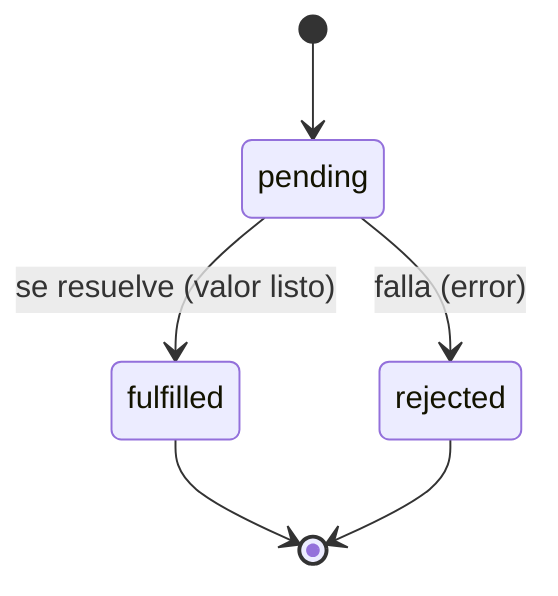
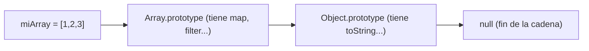

import Reto from "@components/Reto.astro";
import Solucion from "@components/Solucion.astro";
import Quiz from "@components/Quiz.astro";
import CheckDominio from "@components/CheckDominio.astro";
import Nivel from "@components/Nivel.astro";

<Nivel nivel="intermedio" />

## 1. Qué vas a saber hacer

Hasta ahora pensaste en código en un solo idioma: Python. Esta lección te da el **segundo**, el que corre en todos los navegadores del mundo y en el backend con Node: **JavaScript moderno** (de ES2015 / "ES6" en adelante). No empiezas de cero conceptual —ya sabes qué es una función, un bucle, async/await y una llamada a una API—; empiezas a **traducir** ese pensamiento a otra sintaxis, y a aprender las pocas cosas que JavaScript hace genuinamente distinto (y a veces raro).

Al terminar, sin IA y sin notas, podrás:

- **O1 — Implementar** transformaciones de datos con `map`/`filter`/`reduce`, destructuring y spread de forma **inmutable** (sin mutar el original), explicando por qué la inmutabilidad evita una clase entera de bugs.
- **O2 — Consumir** una API con `fetch` + `async`/`await`, manejando el **doble `await`** y el hecho —contraintuitivo— de que `fetch` **no** falla por un status HTTP de error (404/500).
- **O3 — Explicar el porqué** de los tres temas que separan a quien "escribe JS" de quien lo *entiende*: por qué `===` sobre `==`, por qué una arrow function cambia el `this`, y qué es un **closure** (y dónde ya lo usaste sin saberlo).

## 2. Por qué importa (el dinero está aquí)

> 💰 **Por qué importa:** **TypeScript es el filtro #1** que hoy te descarta de roles fullstack —lo piden explícitamente en una porción enorme de las ofertas web—. Pero TypeScript **es JavaScript con tipos**: no puedes escribir TS sin dominar el JS moderno de abajo. Esta lección es el escalón obligatorio antes de [`1.8` TypeScript](/fase-1-lenguajes/1-8-typescript-desde-cero/). Saltártela es construir sobre arena.

JavaScript es el único lenguaje que corre **nativo en el navegador**: cada interfaz que el mundo ve —incluida la UI de streaming token por token de una app de IA que construirás en F4— se escribe en JS/TS. Y con Node corre también en el **backend**, en herramientas de build, en servidores MCP y en bots de automatización. Es, junto a Python, uno de tus dos lenguajes troncales para el resto del curso. El detalle que marca seniority no es "saber la sintaxis": es entender los tres pozos donde caen los juniors —`this`, la coerción de `==`, y que `fetch` no se queja de un 500— y no caer en ellos. Eso es exactamente lo que se nota en una entrevista de live coding.

:::tip[Si ya tocaste JavaScript antes]
¿Ya escribiste algo de JS o jugaste con `fetch` en una página? No te saltes la lección: úsala como **diagnóstico**. Salta directo a los **dos ejercicios Primero-Sin-IA** (sección 7) y resuélvelos a mano. El segundo —un cliente `fetch` que rutea status codes **sin tocar la red**— es justo donde se cae quien "ya sabe usar fetch" pero nunca notó que un 404 no rechaza la promesa. Si los cierras limpios en el timebox, valida con el check de dominio (sección 8) y avanza a [`1.8` TypeScript](/fase-1-lenguajes/1-8-typescript-desde-cero/). Si te trabas en `this`, closures o el doble `await`, vuelve a la sección 4.
:::

## 3. Lo que ya traes (actívalo)

Esta sub-unidad se para sobre Python, que ya manejas. JavaScript es, en su mayoría, las **mismas ideas con otra ropa**. Reúsalo:

- De [`1.1` Python básico](/fase-1-lenguajes/1-1-python-basico-intermedio/): **funciones y scope**. `def f(x):` se vuelve `function f(x) {}` o `(x) => ...`. El concepto de "una variable solo existe en su bloque" es el mismo —y en JS moderno, por fin, se cumple.
- De [`1.3` Python asíncrono](/fase-1-lenguajes/1-3-python-asincrono/): **`async`/`await`**. La gran noticia: JS usa **las mismas palabras** y casi el mismo modelo mental. Si entendiste la corrutina de Python, entendiste la promesa de JS.
- De [`1.5` Archivos, JSON y APIs](/fase-1-lenguajes/1-5-archivos-json-apis/): **status codes, timeout, validar el payload**. `fetch` es `httpx` con otra cara; toda la disciplina de manejo de errores de red que aprendiste se aplica palabra por palabra.
- De [`1.2` Python intermedio](/fase-1-lenguajes/1-2-python-intermedio/): los **decoradores** que viste son closures por dentro. Cuando lleguemos a closures en JS, vas a reconocer el truco.

Antes de seguir, responde de memoria:

<Quiz
  question="En Python escribes [n*2 for n in nums if n > 0]. ¿Cuál es el equivalente conceptual en JavaScript?"
  options={[
    "nums.filter(n => n > 0).map(n => n * 2)",
    "nums.map(n => n * 2).filter(n => n > 0)",
    "for (let n of nums) { n * 2 }",
  ]}
  answer={0}
  explanation="JS no tiene comprehensions; encadena array methods. Filtras primero (te quedas con n > 0) y luego transformas (n * 2). El orden importa: si transformaras primero, el filtro n > 0 se aplicaría sobre los valores ya duplicados, no sobre los originales."
/>

## 4. Ejemplo resuelto, pensado en voz alta

Voy a construir un mini-programa que **toma una lista de pedidos, filtra los pagados, les calcula el IVA y resume el total**, y luego **trae datos de una API con `fetch`**. En el camino paso por todo el temario. **No leas esto como un resultado terminado: léelo como me oirías razonar si estuviera al lado tuyo.**

### 4.1 `let` y `const` (y por qué `var` está muerto)

En JS moderno declaras variables con **`const`** (no se reasigna) o **`let`** (se reasigna). La regla práctica: **`const` por defecto, `let` solo si vas a reasignar, `var` nunca.**

```javascript
const TASA_IVA = 0.19;   // no la voy a reasignar -> const
let contador = 0;        // la voy a incrementar -> let
contador = contador + 1; // ok

// const PI = 3.14; PI = 3; -> TypeError: Assignment to constant variable.
```

Razono en voz alta: *"`const` y `let` tienen **block scope** —viven solo dentro de las `{}` donde se declaran—, igual que esperarías de Python. El viejo `var` tiene 'function scope' y un comportamiento de hoisting que produce bugs sutiles; en código de 2026 no se usa. Si ves `var` en un tutorial, el tutorial es viejo."*

:::note[`const` no significa "inmutable", ojo]
`const` congela **la atadura** (a qué objeto apunta el nombre), no el contenido del objeto. Esto es legal y sorprende a todos al principio:

```javascript
const config = { reintentos: 3 };
config.reintentos = 5;   // ✅ permitido: muto el objeto, no reasigno la variable
// config = {};          // ❌ TypeError: reasignar la variable sí está prohibido
```

Para congelar el contenido de verdad existe `Object.freeze(config)`. Volveremos a esto en las misconceptions.
:::

### 4.2 Arrow functions vs `function` (y de paso, el `this`)

Hay dos formas de escribir una función. La clásica:

```javascript
function sumar(a, b) {
  return a + b;
}
```

Y la **arrow function**, más corta, ideal para pasarla como argumento (a un `map`, por ejemplo):

```javascript
const sumar = (a, b) => a + b;          // return implícito si es una sola expresión
const cuadrado = n => n * n;            // un solo parámetro: paréntesis opcionales
const saludar = () => console.log("hola");
const hacerObjeto = id => ({ id });     // ⚠️ para devolver un objeto literal, envuélvelo en ()
```

Razono: *"La arrow es azúcar sintáctica… **excepto por una cosa que no es cosmética**: la arrow **no tiene su propio `this`**. Hereda el `this` del lugar donde fue escrita (lexical `this`). Una `function` normal **sí** crea su propio `this`, que depende de **cómo se la llame**. Esta diferencia es la causa #1 de bugs con `this` en JS, y por eso casi siempre quieres la arrow cuando pasas un callback."* Lo desarrollo en 4.9 —por ahora, quédate con: *arrow = `this` del entorno; function = `this` del llamador.*

### 4.3 Destructuring, spread y rest (la base de la inmutabilidad)

**Destructuring** desempaca valores de un array u objeto en variables, en una línea:

```javascript
const pedido = { id: 1, cliente: "ada", total: 1200 };
const { cliente, total } = pedido;        // cliente = "ada", total = 1200

const coords = [10, 20];
const [x, y] = coords;                     // x = 10, y = 20
```

**Spread** (`...`) "esparce" los elementos de un array u objeto dentro de otro. Es la herramienta clave para **copiar sin mutar**:

```javascript
const base = { id: 1, total: 1200 };
const conIva = { ...base, iva: 228 };      // copia base + agrega iva; base NO se toca
const nums = [1, 2, 3];
const masUno = [...nums, 4];               // [1,2,3,4]; nums sigue siendo [1,2,3]
```

**Rest** (`...` del otro lado, al recibir) junta "el resto" en un array:

```javascript
const [primero, ...resto] = [10, 20, 30];  // primero = 10, resto = [20, 30]
function promedio(...valores) {            // valores = array con todos los argumentos
  return valores.reduce((a, b) => a + b, 0) / valores.length;
}
```

Razono: *"Mismo símbolo `...`, dos roles según el lado: **esparcir** al construir, **juntar** al recibir. El patrón `{ ...viejo, campo: nuevo }` es el caballo de batalla de React y de todo el código moderno: en vez de mutar un objeto, creo uno nuevo con el cambio. Suena a desperdicio, pero hace el código predecible —nadie te cambia un objeto a tus espaldas."*

### 4.4 Array methods: `map`, `filter`, `reduce`

Estos tres reemplazan al 90% de los bucles que escribirías. **No mutan** el array original: devuelven uno nuevo (o, `reduce`, un valor). Construyo el pipeline de pedidos paso a paso:

```javascript
const pedidos = [
  { id: 1, cliente: "ada",   total: 1200, pagado: true },
  { id: 2, cliente: "linus", total: 800,  pagado: false },
  { id: 3, cliente: "grace", total: 1500, pagado: true },
];

// filter: me quedo con los que cumplen una condición -> nuevo array
const pagados = pedidos.filter(p => p.pagado);          // [pedido 1, pedido 3]

// map: transformo cada elemento 1-a-1 -> nuevo array del mismo largo
const conIva = pagados.map(p => ({ ...p, total: p.total * 1.19 }));

// reduce: colapso el array a UN valor (aquí, la suma)
const recaudado = conIva.reduce((acc, p) => acc + p.total, 0);  // 0 = valor inicial
```

Razono en voz alta sobre `reduce`, que es el que más cuesta: *"`reduce` recibe dos cosas: una función `(acumulador, elementoActual) => nuevoAcumulador` y un **valor inicial** (el `0`). Empieza con `acc = 0`, y por cada pedido hace `acc = acc + p.total`. El valor inicial **no es opcional en la práctica**: si lo omites y el array está vacío, `reduce` lanza un error. Ponlo siempre."*

Dos detalles que separan junior de semi-senior:

- **`map` vs `forEach`.** `map` **devuelve** un array nuevo (lo usas cuando quieres el resultado). `forEach` devuelve `undefined` y solo sirve para efectos secundarios (imprimir, por ejemplo). Usar `forEach` y empujar a un array externo es el anti-patrón que delata a quien no entendió `map`.
- **Inmutabilidad.** Fíjate que `pedidos` quedó **intacto** después de todo el pipeline. Eso es deliberado: cada paso produce datos nuevos. Si hubiera hecho `pedidos[0].total = ...` adentro de un `forEach`, habría mutado el original y sembrado un bug que aparece tres funciones después.

### 4.5 `===` vs `==` y la verdad sobre "truthy"

JavaScript tiene **dos** operadores de igualdad, y solo uno es seguro:

- **`===`** (estricto): compara valor **y** tipo, sin conversiones. `1 === 1` ✅, `1 === "1"` ❌.
- **`==`** (laxo): **convierte tipos** antes de comparar, con reglas demenciales. `1 == "1"` es `true`. `0 == ""` es `true`. `null == undefined` es `true`.

```javascript
0 === "";        // false  (number vs string)
0 == "";         // true   (== convierte y miente)
null === undefined;  // false
null == undefined;   // true
```

Razono: *"Usa **siempre `===`** (y `!==`). El `==` introduce conversiones que casi nunca quieres y que esconden bugs. La única excepción idiomática es `x == null`, que chequea 'null o undefined' de una; pero si dudas, sé explícito con `===`."*

Relacionado: en un `if`, JS evalúa la **veracidad** (truthiness). Son **falsy** (cuentan como falso): `false`, `0`, `""`, `null`, `undefined`, `NaN`. **Todo lo demás es truthy** —incluidos `"0"`, `[]` y `{}`, que sorprenden:

```javascript
if ([]) console.log("un array vacío es truthy");   // SÍ se imprime
if ("0") console.log("el string '0' es truthy");   // SÍ se imprime
```

### 4.6 Promesas, `async`/`await` y `fetch`

Aquí reconoces terreno: el modelo asíncrono que viste en [`1.3`](/fase-1-lenguajes/1-3-python-asincrono/). Una **Promise** es JS es lo que un `awaitable` era en Python: un valor que *todavía no está*, pero estará (o fallará). Tiene tres estados:



`async`/`await` te deja escribir código asíncrono que **se lee como secuencial**, igual que en Python. `await` "espera" a que la promesa se resuelva y te da el valor:

```javascript
async function traerUsuario(login) {
  const respuesta = await fetch(`https://api.github.com/users/${login}`);
  const datos = await respuesta.json();   // ⚠️ .json() TAMBIÉN es asíncrono -> doble await
  return datos.name;
}
```

Razono sobre los **dos `await`**, que es donde todos tropiezan: *"`fetch(...)` devuelve una promesa que se resuelve con un objeto `Response` —pero ese objeto **todavía no tiene el body parseado**. Para leer el JSON hay que llamar `respuesta.json()`, que **también** devuelve una promesa (porque el body podría venir en streaming). Por eso son **dos** `await`: uno para llegar la respuesta, otro para leer su cuerpo. Olvidar el segundo es el error #1 con `fetch`: te quedas con una promesa en vez de los datos."*

Y ahora **la trampa de JS que más cuesta a quien viene de `requests`/`httpx`**:

:::caution[`fetch` NO rechaza la promesa por un status de error]
Esto es distinto a Python. En `httpx`, podías llamar `raise_for_status()`. En `fetch`, **un 404 o un 500 se consideran una respuesta exitosamente recibida**: la promesa se **resuelve** normalmente. `fetch` solo **rechaza** si falla la *red* (sin internet, DNS roto, timeout). Tienes que revisar `respuesta.ok` (o `respuesta.status`) **a mano**:

```javascript
const r = await fetch(url);
if (!r.ok) {                       // r.ok es true solo para status 200–299
  throw new Error(`HTTP ${r.status}`);
}
const datos = await r.json();
```
:::

Por eso el manejo de errores con `fetch` separa **dos mundos** (idéntico mapa mental que en 1.5):

```javascript
try {
  const r = await fetch(url);      // puede RECHAZAR -> error de red (sin respuesta)
  if (!r.ok) throw new Error(`HTTP ${r.status}`);  // hubo respuesta, status malo
  return await r.json();
} catch (err) {
  // cae aquí tanto el error de red (fetch rechazó) como el throw del status malo
  console.error("la llamada falló:", err.message);
  throw err;
}
```

### 4.7 Módulos ES (`import` / `export`)

Igual que Python tiene módulos, JS moderno tiene **ES Modules**. Exportas lo que quieres compartir e importas lo que necesitas. Compara con `from modulo import funcion`:

```javascript
// archivo: pedidos.js
export function totalRecaudado(pedidos) { /* ... */ }
export const TASA_IVA = 0.19;
export default class Carrito { /* ... */ }   // un (solo) export "por defecto"
```

```javascript
// archivo: main.js
import Carrito, { totalRecaudado, TASA_IVA } from "./pedidos.js";
//     ^default     ^named imports (mismo nombre que el export)
```

Razono: *"Dos sabores de export: **named** (cualquier cantidad; se importan por su nombre exacto entre `{}`) y **default** (uno por archivo; se importa sin llaves y puedes nombrarlo como quieras). En Node, los imports relativos llevan la **extensión `.js`** explícita —`./pedidos.js`, no `./pedidos`—; en el navegador, igual. Verás `require(...)` en código viejo (CommonJS): es el sistema antiguo; tú escribe `import`/`export`."*

### 4.8 Closures (el porqué — ya los usaste)

Un **closure** ocurre cuando una función "recuerda" las variables del lugar donde **fue definida**, aunque ese lugar ya haya terminado de ejecutarse. Suena abstracto; el ejemplo lo aterriza:

```javascript
function crearContador() {
  let cuenta = 0;                 // variable "privada"
  return () => {                  // esta arrow CIERRA sobre `cuenta`
    cuenta = cuenta + 1;
    return cuenta;
  };
}

const siguiente = crearContador();
siguiente();  // 1
siguiente();  // 2   <- `cuenta` sobrevivió, aunque crearContador() ya retornó
```

Razono: *"Cuando `crearContador()` retorna, normalmente su variable local `cuenta` desaparecería. Pero la arrow que devolví **la sigue usando**, así que JS la mantiene viva, encerrada (closed over) en la función. Eso es un closure: estado privado y persistente, sin clases. ¿Te suena? Es **exactamente** el mecanismo de los decoradores que viste en [`1.2`](/fase-1-lenguajes/1-2-python-intermedio/) —una función que envuelve a otra y recuerda su contexto. Mismo concepto, otro idioma."* Los closures son la base de medio JavaScript: callbacks que recuerdan datos, configuración encapsulada, hooks de React.

### 4.9 `this` y prototipos (el porqué, en breve)

Estos dos son "el sótano" de JS. No necesitas dominarlos hoy, pero sí entender **por qué existen**, porque explican rarezas que vas a ver.

**`this`** no es como `self` de Python (que siempre apunta a la instancia). En JS, `this` **depende de cómo se llama la función**, no de dónde se define:

```javascript
const usuario = {
  nombre: "ada",
  saludarMal: function () {
    [1].forEach(function () {
      // `this` aquí NO es `usuario`: la function interna creó su propio `this`
      console.log(this.nombre);   // undefined (o error)
    });
  },
  saludarBien: function () {
    [1].forEach(() => {
      // la arrow HEREDA el `this` de saludarBien -> `usuario`
      console.log(this.nombre);   // "ada"
    });
  },
};
```

Razono: *"Este es el bug clásico. La `function` interna crea su propio `this` que no apunta al objeto. La **arrow** no crea `this`: usa el del entorno. Por eso la regla de 4.2 —arrow para callbacks— resuelve el 90% de los dolores de `this`. La lección práctica: cuando algo con `this` te dé `undefined`, sospecha de una `function` donde debería haber una arrow."*

**Prototipos**: en JS, los objetos heredan de otros objetos a través de una cadena de **prototipos** (no de clases, en el fondo). Cuando pides `obj.metodo()` y `obj` no lo tiene, JS sube por la cadena buscándolo:



*"Por eso tu array tiene `.map()` aunque tú no se lo escribiste: lo hereda de `Array.prototype`. La sintaxis `class` que usarás existe —pero por debajo es azúcar sobre prototipos. Saber que la herencia real es **delegación a un objeto prototipo** te explica por qué `[].map` funciona y de dónde 'salen' los métodos. Es el tipo de pregunta de '¿cómo funciona JS de verdad?' que distingue en una entrevista."*

## 5. Errores que vas a tener (y por qué)

:::caution[Podrías pensar que `const` hace el objeto inmutable]
No. `const` impide **reasignar la variable**, pero el objeto al que apunta sigue siendo mutable: `const c = {x:1}; c.x = 2;` es legal. Para inmutabilidad real está `Object.freeze`. Confundir esto lleva a creer que tus datos están protegidos cuando no lo están. La inmutabilidad de verdad la consigues con **disciplina** (`{ ...viejo, cambio }` en vez de mutar), no con `const`.
:::

:::caution[Podrías pensar que `fetch` lanza error si el status es 404 o 500]
Falso, y es la trampa #1 al venir de Python. `fetch` **resuelve** la promesa normalmente ante un 404/500 —para `fetch`, "recibí una respuesta" cuenta como éxito aunque el status sea de error—. Solo **rechaza** por fallo de *red* (sin internet, DNS, timeout). Si no revisas `respuesta.ok` o `respuesta.status` **a mano**, vas a llamar `.json()` sobre una página de error y trabajar con basura. Revisar el status es tu trabajo, igual que en 1.5.
:::

:::caution[Podrías pensar que `==` y `===` son intercambiables]
No lo son. `==` convierte tipos con reglas que producen `0 == ""` → `true` y `[] == false` → `true`. Esas conversiones esconden bugs. Usa **`===`/`!==` siempre**; la única excepción tolerada es `x == null` (atrapa null y undefined de una). Si en una entrevista te ven usar `==` por defecto, es una bandera roja.
:::

:::caution[Podrías pensar que una arrow function es solo "una function más corta"]
Casi, pero hay una diferencia que **no** es cosmética: la arrow **no tiene su propio `this`** (ni `arguments`, ni se puede usar con `new`). Hereda el `this` del entorno donde se escribió. Por eso para un callback (un `map`, un event handler) casi siempre quieres la arrow, y para un **método** de un objeto que use `this` quieres una `function`. Elegir mal aquí es el origen del 90% de los bugs de `this`.
:::

:::caution[Podrías pensar que `map` y `forEach` hacen lo mismo]
No. `map` **devuelve un array nuevo** con los resultados (lo usas cuando quieres transformar). `forEach` devuelve `undefined` y solo sirve para efectos secundarios. Usar `forEach` para construir un array empujando con `.push()` a una variable externa "funciona", pero es el anti-patrón que delata que no entendiste `map`. Si vas a producir datos nuevos, es `map` (o `filter`/`reduce`).
:::

## 6. Práctica con andamiaje (que se desvanece)

Tres niveles, de más apoyo a menos. Hazlos en orden, **a mano primero** (predecir antes de ejecutar).

### 6.1 PREDICT (sin ejecutar)

Sin correr nada, escribe qué imprime:

```javascript
const nums = [1, 2, 3, 4];
const resultado = nums
  .filter(n => n % 2 === 0)
  .map(n => n * 10);

console.log(resultado);
console.log(nums);
console.log(0 == "");
console.log(0 === "");
```

<Solucion title="Ver la respuesta (solo después de predecir)">
```
[ 20, 40 ]
[ 1, 2, 3, 4 ]
true
false
```
`filter` se queda con los pares (`2`, `4`), luego `map` los multiplica por 10 → `[20, 40]`. **`nums` no cambió**: `filter` y `map` no mutan, devuelven arrays nuevos —ese es el punto. `0 == ""` es `true` porque `==` convierte tipos (ambos "valen" 0/vacío); `0 === ""` es `false` porque `===` compara también el tipo (number vs string) sin convertir. Si predijiste que `nums` cambiaba, todavía piensas en mutación; si fallaste el `==`, repasa 4.5.
</Solucion>

### 6.2 Parsons — reordena las líneas

Estas líneas implementan `traerNombre(login)`, una función async que trae el nombre de un usuario de GitHub o lanza un error, pero están **desordenadas**. Reescríbelas en el orden correcto (cuida la indentación):

```text
  if (!r.ok) throw new Error(`HTTP ${r.status}`);
async function traerNombre(login) {
  return datos.name;
  const r = await fetch(`https://api.github.com/users/${login}`);
  const datos = await r.json();
}
```

<Solucion title="Ver el orden correcto">

```javascript
async function traerNombre(login) {
  const r = await fetch(`https://api.github.com/users/${login}`);  // 1. await #1: la respuesta
  if (!r.ok) throw new Error(`HTTP ${r.status}`);                  // 2. status malo a mano (fetch no lo hace)
  const datos = await r.json();                                   // 3. await #2: leer el body
  return datos.name;                                              // 4. ya tengo los datos
}
```

La lógica del orden: primero el **`await` de `fetch`** (la respuesta llega), luego revisar el **status a mano** (porque `fetch` no rechaza por 404/500), luego el **segundo `await`** para parsear el body, y al final usar los datos. Si pusieras `r.json()` antes de revisar `r.ok`, parsearías una página de error como si fuera válida. El doble `await` y el chequeo de status son justo lo nuevo de JS aquí.
</Solucion>

### 6.3 MODIFY

Toma el pipeline de la sección 4.4. Modifícalo para que `recaudado` sume el total **con IVA incluido en una sola pasada de `reduce`**, sin crear el array intermedio `conIva`. Pista: el acumulador sigue empezando en `0`, pero dentro del `reduce` multiplicas `p.total * 1.19` antes de sumar. Una sola expresión cambia. Predice el número antes de ejecutar (con los pedidos pagados 1200 y 1500).

## 7. Ejercicios Primero-Sin-IA

Ahora sin andamiaje. Resuélvelos **a mano, sin IA** dentro del timebox. El primero entrena los array methods y la inmutabilidad; el segundo es el que de verdad te hace ingeniero: un cliente `fetch` que rutea status codes **sin tocar la red**, con la trampa de JS incluida. Está bien que sea lento: el músculo se construye con el esfuerzo, no con la respuesta.

<Reto title="Pipeline de pedidos inmutable" timebox="30–40 min">

Implementa tres funciones puras que transforman una lista de pedidos **sin mutar** la original ni sus objetos, usando `filter`/`map`/`reduce`, destructuring y spread.

Funciones a implementar (firmas en el starter, `ejercicios/fase-1/js-pipeline-inmutable/solucion.js`):
- `pagados(pedidos)` → devuelve un **array nuevo** solo con los pedidos cuyo `pagado` es `true`.
- `conIva(pedidos, tasa)` → devuelve un **array nuevo** donde cada pedido tiene un campo extra `totalConIva = total * (1 + tasa)`, **sin mutar** los objetos originales (usa spread).
- `totalRecaudado(pedidos)` → usa `reduce` para sumar el `total` de los pedidos **pagados** (un solo número).

Entregable: tu solución en `ejercicios/fase-1/js-pipeline-inmutable/` con los tests en verde (`node --test`) y **un caso borde tuyo** agregado.

**Hecho significa:**
- [ ] Las tres funciones devuelven datos nuevos; el array `pedidos` y sus objetos quedan **intactos** tras llamarlas (el test lo verifica).
- [ ] Usas `filter`/`map`/`reduce`, no bucles `for` con `.push()` a una variable externa.
- [ ] `conIva` usa spread (`{ ...p, ... }`) en vez de mutar `p`.
- [ ] Todos los tests pasan y agregaste al menos uno propio.
- [ ] Puedes explicar **por qué** la inmutabilidad evita bugs, sin notas.

Enunciado completo, starter y tests: `ejercicios/fase-1/js-pipeline-inmutable/` (carpeta del repo).

<Solucion title="Pista (ábrela solo si superaste el timebox)">
Piensa cada función como una **transformación pura**: entra un array, sale uno nuevo, no se toca nada de afuera. `pagados` es un `filter` directo. `conIva` es un `map` que devuelve `{ ...p, totalConIva: p.total * (1 + tasa) }` —el spread copia los campos viejos y agrega el nuevo, sin tocar `p`. `totalRecaudado` combina: `filter` los pagados y luego `reduce((acc, p) => acc + p.total, 0)`; recuerda el **valor inicial `0`**. Esto es una pista, no la solución.
</Solucion>

</Reto>

<Reto title="Cliente fetch que rutea status codes (sin red)" timebox="35–45 min">

Implementa `obtenerNombreUsuario(userId, fetchFn)`: una función **async** que, dado un `userId` y una función `fetchFn` **inyectada** (que simula `fetch` y devuelve una promesa de un objeto con `.status` (número) y `.json()` async), devuelve el nombre del usuario manejando los fallos como un ingeniero —incluida la trampa de JS de que `fetch` no rechaza por status de error.

Contrato (firmas y clases de error en el starter, `ejercicios/fase-1/cliente-fetch-status/solucion.js`):
- `userId` inválido (≤ 0 o no entero) → lanza `EntradaInvalida` **antes** de llamar `fetchFn`.
- `fetchFn` **rechaza** (error de red simulado) → conviértelo en `ServicioInalcanzable` (no dejes escapar el error crudo).
- status `200` → devuelve `(await resp.json()).name` (recuerda el **doble `await`**).
- status `404` → lanza `UsuarioNoEncontrado`.
- status `>= 500` → lanza `ServicioCaido`.
- cualquier otro status → lanza `RespuestaInesperada`.

La gracia: como `fetchFn` está **inyectado**, tus tests no tocan la red. Pasas un `fetchFn` falso que resuelve con la respuesta que tú quieras (o que rechaza con un error de red). Es el mismo seam de [`1.5`](/fase-1-lenguajes/1-5-archivos-json-apis/), ahora en JavaScript y asíncrono.

Entregable: tu solución en `ejercicios/fase-1/cliente-fetch-status/` con los tests en verde (`node --test`) y **un caso borde tuyo** agregado.

**Hecho significa:**
- [ ] Validas `userId` **antes** de llamar `fetchFn` (no gastas una petición en input inválido).
- [ ] Distingues los cuatro destinos de status (200 / 404 / 5xx / otro), cada uno con su error.
- [ ] Conviertes el rechazo de red en `ServicioInalcanzable` (no dejas escapar el error crudo).
- [ ] Usas el **doble `await`** y revisas el status **a mano** (no asumes que `fetch` rechaza por 404/500).
- [ ] Todos los tests pasan **sin red** y agregaste al menos uno propio.
- [ ] Puedes explicar por qué `fetch` no rechaza por un 500, sin notas.

Enunciado completo, starter y tests: `ejercicios/fase-1/cliente-fetch-status/` (carpeta del repo).

<Solucion title="Pista (ábrela solo si superaste el timebox)">
Orden: primero **valida** `userId` y lanza `EntradaInvalida` si es inválido (antes de cualquier `await`). Luego envuelve **solo** `await fetchFn(userId)` en un `try/catch`: si rechaza, lanzas `ServicioInalcanzable`. Con la respuesta en mano (fuera del `try` de red), ramifica por `resp.status` con el caso `200` primero —y ahí va el **segundo `await`** de `resp.json()`—, luego `404`, luego `>= 500`, y un catch-all final. Recuerda 4.6: el chequeo de status es **tu** trabajo, `fetch` no lo hace. Pista, no solución.
</Solucion>

</Reto>

## 8. Check de dominio

Sin mirar la lección, en voz alta o por escrito:

<CheckDominio
  items={[
    "Explicar la diferencia entre const, let y var, y por qué const no hace inmutable a un objeto.",
    "Reescribir un bucle for que filtra y transforma usando filter + map, sin mutar el original.",
    "Explicar qué hace reduce y por qué su valor inicial importa.",
    "Decir por qué fetch NO rechaza la promesa ante un status 404 o 500, y qué revisas tú a mano.",
    "Explicar por qué una arrow function evita el bug clásico de this en un callback.",
    "Definir qué es un closure y dar un ejemplo (contador privado), conectándolo con los decoradores de Python.",
  ]}
/>

Si marcaste menos de cinco, vuelve a la sección correspondiente **antes** de avanzar. No es un examen: es honestidad contigo.

<Quiz
  question="Llamas await fetch(url) y el servidor responde 500. ¿Qué pasa por defecto?"
  options={[
    "fetch rechaza la promesa automáticamente por ser un error del servidor",
    "La promesa se resuelve con un Response cuyo status es 500 y ok es false; revisarlo es tu trabajo",
    "fetch devuelve null",
  ]}
  answer={1}
  explanation="fetch solo rechaza por fallo de RED (sin internet, DNS, timeout). Un 500 es una respuesta exitosamente recibida: la promesa se resuelve con un Response (status 500, ok false). Debes revisar respuesta.ok o respuesta.status a mano. Asumir 'no rechazó = salió bien' es el bug silencioso #1 con fetch al venir de httpx."
/>

## 9. Recursos (documentación oficial primero)

- **MDN — JavaScript Guide (la fuente de verdad):** [developer.mozilla.org/.../JavaScript/Guide](https://developer.mozilla.org/en-US/docs/Web/JavaScript/Guide) — empieza por *Grammar and types* y *Control flow*.
- **MDN — Array (map/filter/reduce):** [developer.mozilla.org/.../Array](https://developer.mozilla.org/en-US/docs/Web/JavaScript/Reference/Global_Objects/Array) — cada método con ejemplos ejecutables.
- **MDN — Using the Fetch API:** [developer.mozilla.org/.../Fetch_API/Using_Fetch](https://developer.mozilla.org/en-US/docs/Web/API/Fetch_API/Using_Fetch) — lee la nota sobre por qué un 404 **no** rechaza la promesa.
- **MDN — Closures:** [developer.mozilla.org/.../Closures](https://developer.mozilla.org/en-US/docs/Web/JavaScript/Guide/Closures) — el mejor recorrido del concepto, con ejemplos.
- **MDN — `this`:** [developer.mozilla.org/.../Operators/this](https://developer.mozilla.org/en-US/docs/Web/JavaScript/Reference/Operators/this) — para cuando quieras entender el sótano.
- **Node.js — Test runner (`node --test`):** [nodejs.org/api/test.html](https://nodejs.org/api/test.html) — cómo correr los tests de los ejercicios sin instalar nada.
- **Node.js — Modules: ECMAScript modules:** [nodejs.org/api/esm.html](https://nodejs.org/api/esm.html) — `import`/`export` en Node, y por qué la extensión `.js` es obligatoria.

## 10. Conexión con el capstone de la fase

El **Capstone F1 — La misma app, dos lenguajes** te pide construir la misma mini-API (la despensa de HomeBase) en **Python y en TypeScript/Node**. Esta lección es el cimiento del lado JS/TS:

- El lado Node se escribe en **JavaScript moderno** (luego tipado con TS): array methods, destructuring, módulos ES y `async`/`await` son su gramática diaria.
- Cuando tu API llame a otros servicios, lo hará con **`fetch`** y el manejo de status de la sección 4.6 —comparar este código con su gemelo en `httpx` (Python) es justo lo que el capstone quiere que **defiendas**: qué cambió entre ambos lenguajes y por qué.
- La **inmutabilidad** que practicaste aquí es el hábito que después hace tu código React (F4) predecible y testeable.

Más cerca aún: [`1.8` TypeScript](/fase-1-lenguajes/1-8-typescript-desde-cero/) **es esta lección con tipos encima**. Todo lo que dominaste hoy —arrow, destructuring, `async`/`await`, módulos— sigue igual; TS solo le añade una capa de seguridad. Si JS te quedó firme, TS es media cuesta menos.

## 11. Reflexión y repaso espaciado

Cierra escribiendo dos o tres frases respondiendo: **¿qué concepto de JavaScript te chocó más con tu intuición de Python —`this`, que `fetch` no rechace por 404, la coerción de `==`, o la inmutabilidad— y por qué?** Nombrar la fricción con precisión ("esperaba que `fetch` lanzara como `raise_for_status`") es lo que la convierte en algo que puedes atacar.

Gancho de **spaced repetition**:

- **Mañana:** reescribe de memoria, sin mirar, la función `traerNombre` del Parsons (sección 6.2) —con el doble `await` y el chequeo de `r.ok` en el orden correcto. Si no puedes, no lo aprendiste todavía.
- **En 3 días:** toma el ejercicio del cliente `fetch` y agrégale un caso: si el status es `429` (rate limit), lanza una excepción `DemasiadasPeticiones` distinta del resto. Sin volver a leer tu solución vieja.
- **En 1 semana:** explícale a alguien (o a una grabación) qué es un closure usando el contador de la sección 4.8, y conéctalo con los decoradores de Python. Enseñarlo es el test de dominio definitivo —y es justo el tipo de "¿cómo funciona JS de verdad?" que te van a preguntar en una entrevista.
