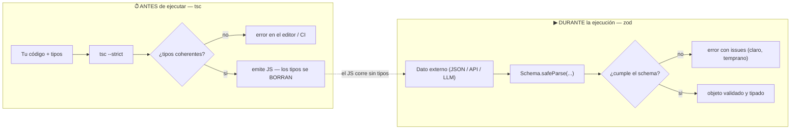

import Reto from "@components/Reto.astro";
import Solucion from "@components/Solucion.astro";
import Quiz from "@components/Quiz.astro";
import CheckDominio from "@components/CheckDominio.astro";
import Nivel from "@components/Nivel.astro";

<Nivel nivel="intermedio" />

Tu JavaScript **funciona**, pero te deja embarcar a producción una clase entera de bugs tontos: pasar un `string` donde esperabas un `number`, leer una propiedad que no existe, olvidar un caso. TypeScript es **JavaScript + un verificador de tipos** que atrapa todo eso **antes de ejecutar**, en tu editor, en rojo. Y como en Python, hay dos momentos del tiempo que no debes confundir: **`tsc`** revisa tus tipos **antes de correr** (y luego los **borra**: el JS que se ejecuta no tiene tipos); **zod** valida datos reales **mientras el programa corre**. Si ya viste [`1.4` type hints + pydantic](/fase-1-lenguajes/1-4-type-hints-mypy-pydantic/), esta lección es la **misma película en el otro idioma**: `tsc` es a TypeScript lo que `mypy` es a Python; `zod` es a TypeScript lo que `pydantic` es a Python.

:::tip[Si ya tocaste esto antes]
Si ya pusiste `: string` en alguna función y usaste zod en una API, no te saltes la lección: úsala como **diagnóstico**. Ve a los **dos ejercicios Primero-Sin-IA** (sección 7). Si modelas una unión discriminada con chequeo de exhaustividad (`never`) sin titubear, y diseñas un schema zod que rechaza una salida de LLM con campos alucinados, valida con el check de dominio (sección 8) y avanza. Si dudas en "¿por qué zod si ya tengo tipos?", lee la sección 5: ahí está el malentendido que filtra a la mayoría.
:::

## 1. Qué vas a saber hacer

Al terminar, sin IA y sin notas, podrás:

- **O1 — Modelar** un dominio con tipos básicos, `interface` y una **unión discriminada**, y **estrechar** (narrowing) con `switch` + chequeo de exhaustividad (`never`) y un **type guard** (`x is T`), haciendo pasar `tsc --strict` sin un solo `any`.
- **O2 — Explicar el trade-off** entre verificación **estática** (`tsc`, antes de ejecutar, los tipos se borran al compilar) y validación en **runtime** (zod): por qué los tipos de TypeScript **no** existen al ejecutar y cuándo necesitas cada uno.
- **O3 — Diseñar** un schema zod que valide datos externos no confiables (JSON de una API o la **salida de un LLM**) e **inferir** el tipo TypeScript desde el schema con `z.infer`, en vez de duplicarlo a mano.

## 2. Por qué importa (el dinero está aquí)

> 💰 **Por qué importa:** TypeScript es **el filtro #1 que descarta candidatos fullstack** hoy. Una porción enorme de las ofertas web lo pide explícito, y sin él ni llegas a la entrevista técnica. Y del lado IA: **zod es el pydantic de JavaScript** — la herramienta con la que validas la salida de un LLM en una app TypeScript/Node, y la base de validación de Next.js, tRPC y el ecosistema de agentes en TS. "Validar la salida del modelo antes de usarla" es, otra vez, el primer punto de la lista de seguridad de IA.

Un LLM te devuelve texto. Le pediste un JSON con cinco campos y a veces lo da bien, a veces inventa un campo, a veces pone `"monto": "carísimo"` donde esperabas un número. En el mundo Python validas esa frontera con pydantic. En el mundo TypeScript la validas con **zod**: declaras un schema, lo pasas por `parse`, y el dato entra limpio o se rechaza con un error claro. El mismo patrón profesional —**validar en la frontera**— en los dos lenguajes de tu stack. Lo formalizarás para structured outputs en `6.4`, pero el músculo se forma aquí, y se refuerza porque acabas de hacerlo con pydantic.

Y `tsc`, mientras tanto, es la red que atrapa el bug más frecuente y más barato de evitar: usar mal una variable. Lo atrapa **en tu editor**, antes de que ese código corra una sola vez.

## 3. Lo que ya traes (actívalo)

Esta sub-unidad se apoya en lo anterior. Reúsalo:

- De [`1.7` JavaScript moderno](/fase-1-lenguajes/1-7-javascript-moderno/): objetos, arrays, funciones, destructuring, `map`/`filter`. TypeScript **no cambia** nada de eso — le pone una **capa de tipos encima**. El JS que ya sabes sigue siendo el mismo; solo le agregas anotaciones que una herramienta verifica.
- De [`1.4` type hints + pydantic](/fase-1-lenguajes/1-4-type-hints-mypy-pydantic/): **todo el modelo mental**. Estático vs runtime, "los tipos no validan en ejecución", "valida en la frontera". Aquí lo vas a **reconocer**, no a aprenderlo de nuevo. Esa es la ventaja de ver el mismo concepto en dos idiomas.
- De [`0.8` Spec-first](/fase-0-fundamentos/): pensar el contrato (entradas/salida/bordes) **antes** de codear. Un tipo TypeScript **es** una mini-spec que el compilador verifica; un schema zod **es** la spec de tus datos en runtime.

Antes de seguir, responde de memoria:

<Quiz
  question="En TypeScript, ¿qué significa la anotación string[] para una variable?"
  options={[
    "Un único string que contiene corchetes",
    "Un array cuyos elementos son todos string",
    "Un array que puede mezclar strings y números",
  ]}
  answer={1}
  explanation="string[] = un array (de cualquier largo) donde cada elemento es de tipo string. La forma equivalente Array<string> significa exactamente lo mismo."
/>

## 4. Ejemplo resuelto, pensado en voz alta

Voy a construir el camino completo: parto de los tipos básicos, modelo un pequeño dominio (la despensa de HomeHub), estrecho una unión, escribo un type guard, generalizo con generics, derivo tipos con utility types, y al final muestro por qué —aun con `tsc` en verde— necesito **zod** para los datos que entran de afuera. **No leas esto como un resultado: léelo como me oirías razonar al lado tuyo.**

### 4.1 Tipos básicos e inferencia

Una anotación va después de los dos puntos. Pero gran parte del tiempo **no hace falta escribirla**: TypeScript la **infiere** del valor.

```ts
let nombre: string = "leche";      // anotación explícita
let stock = 12;                    // inferido: number (no necesita anotación)
let perecible = true;              // inferido: boolean
let etiquetas: string[] = ["oferta", "lácteo"];
let par: [number, number] = [10, 20];   // tupla: exactamente dos number
```

Pienso en voz alta: *"`let stock = 12` ya es `number`; anotarlo sería ruido. Anoto cuando el tipo **no** es obvio del valor: parámetros de función, estructuras vacías (`const ids: number[] = []`), o cuando quiero **forzar** un tipo más estrecho."* Las funciones sí se anotan siempre —entrada y salida— porque son el contrato:

```ts
function saluda(nombre: string): string {
  return `Hola, ${nombre}`;
}
```

Dos tipos especiales que importan: **`any`** apaga el verificador (volveremos a esto en la sección 5, es trampa); **`unknown`** es "no sé el tipo todavía, **oblígame a comprobarlo** antes de usarlo". Y los **tipos literales**: `"add"` no es solo `string`, es exactamente el texto `"add"`. Con `as const` congelas un valor a su forma literal más estrecha.

### 4.2 `interface` vs `type`

Para describir la **forma de un objeto**, hay dos sintaxis. Esta confusión es clásica, así que la dejo clara de entrada:

```ts
interface Producto {
  id: number;
  nombre: string;
  stock: number;
  categoria: "fresco" | "seco" | "congelado";   // unión de literales
}

type ID = number;                       // alias de un tipo
type Resultado = "ok" | "error";        // unión: esto interface NO lo puede hacer
```

Razono: *"`interface` describe formas de objeto y se puede **extender** (`extends`) y **fusionar** (declaration merging, clave para ampliar tipos de librerías). `type` es un **alias** que puede nombrar **cualquier** cosa: una unión, una tupla, un primitivo, un tipo mapeado."* Regla práctica que uso: **`interface` para formas de objeto públicas/extensibles; `type` para uniones y aliases.** No es religión; para un objeto simple son casi intercambiables.

### 4.3 Uniones discriminadas y narrowing

Aquí está el patrón más útil de TypeScript para modelar "una de varias formas posibles". Cada variante lleva un campo **discriminante** común (aquí `kind`) con un literal distinto:

```ts
type EventoStock =
  | { kind: "add"; cantidad: number }
  | { kind: "remove"; cantidad: number }
  | { kind: "set"; valor: number };

function aplicar(stock: number, e: EventoStock): number {
  switch (e.kind) {
    case "add":
      return stock + e.cantidad;     // aquí TS SABE que e tiene `cantidad`
    case "remove":
      return Math.max(0, stock - e.cantidad);
    case "set":
      return e.valor;                // aquí TS SABE que e tiene `valor`, no `cantidad`
    default: {
      const _exhaustivo: never = e;  // red de seguridad (ver abajo)
      return _exhaustivo;
    }
  }
}
```

Pienso en voz alta: *"Dentro de `case "add"`, TypeScript **estrecha** `e` a la variante `add`: si escribo `e.valor` ahí, me marca error, porque esa variante no tiene `valor`. Eso es narrowing: el compilador sigue mi lógica y sabe qué propiedades existen en cada rama."*

El `default` con `never` es el truco que más impresiona en entrevista. `never` es "el tipo que no tiene ningún valor". Si manejé **todos** los `kind`, cuando el control llega al `default` ya no queda ninguna variante posible, así que `e` es `never` y la asignación compila. Pero si **mañana agrego** `{ kind: "scrap"; motivo: string }` y olvido su `case`, entonces en el `default` `e` todavía puede ser `scrap` —no es `never`— y **`tsc` falla justo en esa línea**. El compilador me obliga a no olvidar el caso nuevo. Es exhaustividad gratis.

### 4.4 Type guards: enseñarle a estrechar a TypeScript

A veces el narrowing automático no alcanza y necesitas una función que le **diga** a TypeScript qué tipo es algo. Eso es un **type guard**, y se reconoce por el tipo de retorno `x is T`:

```ts
function esString(x: unknown): x is string {
  return typeof x === "string";
}

function largoSeguro(x: unknown): number {
  if (esString(x)) {
    return x.length;   // dentro del if, TS estrechó x a string: .length es válido
  }
  return 0;
}
```

Razono: *"`x is string` es un **predicado de tipo**. Cuando `esString(x)` devuelve `true`, TypeScript estrecha `x` a `string` en esa rama. Sin el `x is string` (si pusiera `: boolean`), el `if` filtraría en runtime pero TypeScript **no** sabría que adentro `x` es string, y `x.length` daría error."* Los type guards son cómo conectas comprobaciones de runtime con el sistema de tipos.

### 4.5 Generics: tipos con un hueco

Un **generic** es un tipo parametrizado: escribes la lógica una vez y funciona para cualquier tipo, **sin perder** la información de tipo.

```ts
function primero<T>(arr: T[]): T | undefined {
  return arr[0];
}

const a = primero([1, 2, 3]);       // a: number | undefined
const b = primero(["x", "y"]);      // b: string | undefined
```

Pienso en voz alta: *"`<T>` es una variable de tipo. Cuando llamo `primero([1,2,3])`, TypeScript deduce `T = number`, así que el retorno es `number | undefined`. Si en vez de generic hubiera escrito `any[]`, perdería el tipo y `a` sería `any` —adiós red de seguridad."* Cuando necesitas exigir que `T` tenga cierta forma, usas una **constraint** con `extends`:

```ts
function porId<T extends { id: number }>(items: T[], id: number): T | undefined {
  return items.find((it) => it.id === id);   // .id existe porque T extends { id: number }
}
```

### 4.6 Utility types: derivar tipos sin duplicar

TypeScript trae transformaciones de tipos listas. Las tres que usarás a diario, todas sobre nuestro `Producto`:

```ts
type ResumenProducto = Pick<Producto, "id" | "nombre">;   // SOLO id y nombre
type ProductoSinId   = Omit<Producto, "id">;              // TODO menos id
type ParcheProducto  = Partial<Producto>;                 // todos los campos opcionales
```

Razono: *"En vez de escribir a mano un tipo nuevo con dos campos, lo **derivo** de la fuente de verdad. Si mañana le agrego un campo a `Producto`, `Omit<Producto, "id">` se actualiza solo."* Esto se usa todo el tiempo en funciones de creación, donde el `id` lo pone la base de datos, no quien llama:

```ts
function crear(datos: Omit<Producto, "id">, id: number): Producto {
  return { id, ...datos };
}
```

### 4.7 El límite de los tipos: NO existen en runtime

Aquí está la trampa que tumba a la mayoría —la misma que viste con mypy en [`1.4`](/fase-1-lenguajes/1-4-type-hints-mypy-pydantic/)—. Supongamos que el producto entra desde un JSON externo:

```ts
const crudo = '{"id": 1, "nombre": "leche", "stock": "muchísimo"}';   // basura de afuera
const p = JSON.parse(crudo) as Producto;   // 'as' = le MIENTO al compilador
console.log(p.stock * 2);                  // 💥 "muchísimo" * 2 === NaN, sin error de tipo
```

`tsc` estaba feliz: le dije con `as Producto` que confiara, y `JSON.parse` devuelve `any`, así que nadie comprobó nada. Pero `stock` llegó como el string `"muchísimo"`. **Los tipos de TypeScript son anotaciones que `tsc` borra al compilar a JavaScript**: en runtime no queda ni rastro de ellos, y `JSON.parse` no verifica nada. `as` **no** convierte ni valida — es una aserción, una promesa tuya que el compilador cree sin chequear.

Pienso en voz alta: *"Necesito algo que, en tiempo de ejecución, agarre el dato externo y verifique de verdad que `stock` es un número, o lo rechace. Eso `tsc` no lo hace. Eso lo hace zod."*



### 4.8 zod: validación de verdad, en runtime

Un schema zod es un objeto que describe la forma **y las reglas** de un dato, y que **comprueba** de verdad cuando lo pasas por `parse`. Instálalo con `pnpm add zod` (zod **v4**, la actual):

```ts
import { z } from "zod";

const ProductoSchema = z.strictObject({
  id: z.number().int().positive(),
  nombre: z.string().trim().min(1),       // recorta espacios y exige largo >= 1
  stock: z.coerce.number().int().nonnegative(),  // coacciona "12" -> 12
});

type Producto = z.infer<typeof ProductoSchema>;   // el TIPO sale del schema
```

Razono: *"`z.coerce.number()` no es un tipo: es una **conversión + comprobación en runtime**. Si llega el string `"12"`, lo convierte a `12`; si llega `"muchísimo"`, lo rechaza. Y `z.infer` me da el tipo TypeScript **derivado del schema**: una sola fuente de verdad para el runtime y para los tipos, sin escribir el `interface` aparte."* Lo pruebo con datos limpios y con basura:

```ts
const ok = ProductoSchema.parse({ id: 1, nombre: "  Leche  ", stock: "12" });
console.log(ok);   // { id: 1, nombre: "Leche", stock: 12 }  (recortó y coaccionó)

const r = ProductoSchema.safeParse({ id: 0, nombre: "   ", stock: -1 });
if (!r.success) {
  console.log(r.error.issues);
  // [{ path: ["id"], message: "Too small ..." }, { path: ["nombre"], ... }, ...]
}
```

Dos formas de validar, y la diferencia importa:

- **`parse(data)`** devuelve el dato validado o **lanza** un `ZodError`. Úsalo cuando un dato inválido es excepcional y quieres que reviente.
- **`safeParse(data)`** devuelve `{ success: true, data }` **o** `{ success: false, error }` — una **unión discriminada** (¡otra vez narrowing!): adentro del `if (!r.success)` TypeScript sabe que existe `r.error`, y en el `else` que existe `r.data`. Úsalo cuando esperas datos malos y quieres manejarlos sin `try/catch`.

El paralelo con pydantic, lado a lado:

| Quiero… | pydantic (Python) | zod v4 (TypeScript) |
|---|---|---|
| Validar un objeto | `Model.model_validate(d)` | `Schema.parse(d)` / `Schema.safeParse(d)` |
| Obtener/usar el tipo | la clase **es** el tipo | `z.infer<typeof Schema>` |
| Rechazar campos extra | `ConfigDict(extra="forbid")` | `z.strictObject({ ... })` |
| Coaccionar `"12"` → `12` | `int` coacciona | `z.coerce.number()` |
| Regla a medida | `@field_validator` | `.refine(fn, { error })` |
| Normalizar texto | validador con `strip()` | `.trim()` |

## 5. Errores que vas a tener (y por qué)

:::caution[Podrías pensar que los tipos de TypeScript validan en runtime]
**No.** `tsc` revisa tus tipos y luego los **borra**: el JavaScript que se ejecuta no tiene ni idea de ellos. Anotar `stock: number` no impide que en runtime `stock` sea el string `"muchísimo"` si vino de un `JSON.parse`. Los tipos son **promesas que `tsc` verifica antes de ejecutar**, no candados. Para rechazar datos malos **mientras el programa corre**, ese trabajo es de zod, no de los tipos. Esta es la confusión #1 de toda la lección — y es exactamente la misma que con mypy/pydantic.
:::

:::caution[Podrías pensar que `as` convierte o valida un valor]
`as Producto` es una **aserción de tipo**: le dices al compilador "confía, esto es un `Producto`" y él te cree **sin comprobar nada**. No castea, no convierte, no valida. Si mientes (y con datos externos casi siempre mientes), el bug aparece en runtime, lejos de la causa. Para *de verdad* convertir un valor desconocido en uno tipado y seguro, necesitas un **type guard** o **zod**, no `as`. Usar `as` para "callar" a TypeScript es desactivar la red justo donde la querías.
:::

:::caution[Podrías pensar que `any` "arregla" los errores de tipo]
`x: any` hace que TypeScript **deje de revisar** ese valor: es el equivalente a comentar un test que falla. Cuando no conoces el tipo, usa **`unknown`**: te obliga a estrechar (con un type guard o zod) **antes** de usar el valor. `unknown` es "any seguro". Perseguir "cero errores" llenando de `any` es autoengaño; el bug sigue ahí, solo que ahora invisible.
:::

:::caution[Podrías pensar que `interface` y `type` son lo mismo o que uno es "mejor"]
Para describir un objeto simple son casi intercambiables. Las diferencias **reales**: `interface` admite `extends` y **declaration merging** (poder reabrir y ampliar un tipo, clave para extender tipos de librerías); `type` admite **uniones**, tuplas, primitivos y tipos mapeados (`interface` no puede ser una unión). Regla sin dogma: `interface` para formas de objeto públicas/extensibles, `type` para uniones y aliases. Elegir mal no rompe nada; solo te complica más adelante.
:::

:::caution[Podrías pensar que el `enum` de TypeScript es la forma de hacer una unión]
El `enum` de TypeScript **genera código en runtime** (no se borra como el resto de los tipos) y trae sorpresas (numeric enums con reverse-mapping, `const enum` con sus propias trampas). Para casi todo, una **unión de literales** (`"fresco" | "seco" | "congelado"`) o un objeto `as const` es más simple, **se borra al compilar** y estrecha igual de bien. No empieces por `enum`.
:::

:::caution[Podrías pensar que en zod se rechazan campos extra con `.strict()`]
En **zod v4**, `.strict()` y `.passthrough()` están **deprecados**. El equivalente actual de `extra="forbid"` es **`z.strictObject({ ... })`**. La mitad de los tutoriales y de las respuestas de IA están en **v3** (`.strict()`, `z.string().email()`, `z.string().date()`); reconócelo y usa la v4 (`z.strictObject`, `z.email()`, `z.iso.date()`). Si copias código v3, te va a costar tiempo.
:::

## 6. Práctica con andamiaje (que se desvanece)

Tres niveles, de más apoyo a menos. **A mano primero.**

### 6.1 PREDICT (sin ejecutar)

Lee este código y predice qué imprime —y si alguna línea daría **error de compilación**:

```ts
type Forma =
  | { tipo: "circulo"; radio: number }
  | { tipo: "cuadrado"; lado: number };

function area(f: Forma): number {
  if (f.tipo === "circulo") {
    return Math.PI * f.radio ** 2;
  }
  return f.lado * f.lado;
}

console.log(Math.round(area({ tipo: "cuadrado", lado: 3 })));
```

<Solucion title="Ver la respuesta (solo después de predecir)">
Imprime `9`. El `lado` es 3 ⇒ `3 * 3 = 9`. Lo importante es el **narrowing**: dentro del `if (f.tipo === "circulo")`, TypeScript estrecha `f` a la variante `circulo`, así que `f.radio` es válido; **después** del `if`, solo queda la variante `cuadrado`, por eso `f.lado` compila. Si en la última línea hubieras escrito `f.radio`, `tsc` daría error: `radio` no existe en `cuadrado`. Si predijiste un error ahí, entendiste el narrowing.
</Solucion>

### 6.2 Parsons — reordena el type guard

Estas líneas definen una unión `Resultado` y un type guard `esOk`, pero están **desordenadas**. Reescríbelas en el orden correcto (cuida la indentación y la posición del predicado `r is ...`):

```text
function esOk(r: Resultado): r is { ok: true; valor: number } {
type Resultado =
  return r.ok === true;
  | { ok: true; valor: number }
}
  | { ok: false; error: string };
```

<Solucion title="Ver el orden correcto">

```ts
type Resultado =
  | { ok: true; valor: number }
  | { ok: false; error: string };

function esOk(r: Resultado): r is { ok: true; valor: number } {
  return r.ok === true;
}
```

Las claves: la **unión primero** (sus dos variantes con `|`), luego el guard; el tipo de retorno **`r is { ok: true; valor: number }`** es lo que convierte la función en un type guard —sin él, sería un `boolean` normal y TypeScript no estrecharía al usarlo—; y el cuerpo (`return r.ok === true`) indentado dentro de la función.
</Solucion>

### 6.3 MODIFY

Toma el `ProductoSchema` de la sección 4.8 y modifícalo para que:

1. Acepte un campo `categoria` que **solo** valga `"fresco"`, `"seco"` o `"congelado"` (pista: `z.enum([...])`).
2. Acepte un campo opcional `moneda` que por defecto sea `"CLP"` (pista: `z.enum([...]).default(...)`).

Pruébalo: un objeto **sin** `categoria` debe **fallar**; con `categoria: "fresco"` y sin `moneda` debe pasar y dejar `moneda === "CLP"`.

## 7. Ejercicios Primero-Sin-IA

Sin andamiaje. Resuélvelos **sin IA** dentro del timebox. Cada carpeta trae su `package.json`; instala una vez con `pnpm install` y corre `pnpm test` (vitest) y `pnpm typecheck` (`tsc --noEmit`).

<Reto title="Tipar y estrechar un módulo TypeScript" timebox="35–45 min">

Un módulo de la despensa de HomeHub está escrito con `any` y sin modelar. Tu trabajo es **tiparlo entero sin dejar un solo `any`**: define el `Producto`, modela los eventos de stock como **unión discriminada**, implementa `aplicarEvento` con narrowing por el discriminante **y chequeo de exhaustividad (`never`)**, escribe un **type guard** y usa un **utility type** para no duplicar tipos.

Entregable: tu solución en `ejercicios/fase-1/tipar-y-estrechar-typescript/` (carpeta del repo), con `pnpm typecheck` en verde y `pnpm test` pasando.

**Hecho significa:**
- [ ] `pnpm typecheck` reporta **0 errores** y **no queda ningún `any`** en `inventario.ts`.
- [ ] `EventoStock` es una **unión discriminada** por `kind` (`add`/`remove`/`set`).
- [ ] `aplicarEvento` estrecha por `kind` y tiene el chequeo `const _exhaustivo: never = evento` en el `default`.
- [ ] `crearProducto` recibe `Omit<Producto, "id">` (no re-declara los campos a mano).
- [ ] `esEventoSet` es un **type guard** (`evento is ...`), no un `boolean` cualquiera.
- [ ] Los tests pasan y agregaste **un caso borde tuyo**.
- [ ] Puedes explicar **sin notas** por qué el `never` te obliga a manejar un `kind` nuevo.

<Solucion title="Pista (ábrela solo si superaste el timebox)">
La unión va así: `type EventoStock = { kind: "add"; cantidad: number } | { kind: "remove"; cantidad: number } | { kind: "set"; valor: number };`. En `aplicarEvento`, un `switch (evento.kind)` con un `case` por variante; en `remove` usa `Math.max(0, ...)` para no bajar de 0; en el `default`, `const _exhaustivo: never = evento; return _exhaustivo;` (si agregas un `kind` y no su `case`, esa línea deja de compilar — esa es la gracia). El type guard se firma `evento is Extract<EventoStock, { kind: "set" }>` y su cuerpo es `return evento.kind === "set";`. Esto es una pista, no la solución.
</Solucion>

</Reto>

<Reto title="Validar la salida de un LLM con zod" timebox="35–45 min">

Un LLM extrajo una compra desde el texto de un correo y te devolvió un JSON. **No confíes en él.** Diseña el schema zod `CompraSchema` que lo valide en la frontera: tipos correctos, monto positivo (coaccionando `"12990"` a `12990`), moneda restringida a `"CLP"`/`"USD"`, sin strings de solo espacios, sin campos alucinados, y con error cuando algo no cuadre. Infiere el tipo `Compra` con `z.infer` e implementa `parsearCompra(rawJson)` que parsee **y** valide.

Entregable: tu solución en `ejercicios/fase-1/validar-salida-llm-zod/` (carpeta del repo), con los tests en verde y **un test tuyo** para un caso borde que el LLM podría producir.

**Hecho significa:**
- [ ] `CompraSchema` valida un JSON correcto y **coacciona** `monto` de `"12990"` a `12990` (number).
- [ ] Rechaza: `monto` ≤ 0, `comercio`/`categoria` de solo espacios, `items` vacío, `moneda` desconocida, `fecha` no-ISO, y **campos alucinados** (extra).
- [ ] El tipo `Compra` se obtiene con `z.infer<typeof CompraSchema>`, **no** escrito a mano.
- [ ] `parsearCompra` hace `JSON.parse` + validación con zod en una función.
- [ ] Agregaste al menos un test propio de un caso borde realista de un LLM.
- [ ] Puedes explicar **sin notas** por qué `z.strictObject` importa con salidas de modelos y por qué `as` no habría servido.

<Solucion title="Pista (ábrela solo si superaste el timebox)">
Piensa el contrato antes (spec-first, [`0.8`](/fase-0-fundamentos/)): seis campos, cada uno con su tipo y constraint. Usa `z.strictObject({ ... })` (no `z.object`, que ignora campos extra). `monto: z.coerce.number().int().positive()`; `moneda: z.enum(["CLP", "USD"])`; `fecha: z.iso.date()`; `items: z.array(z.string().trim().min(1)).min(1)`. Para los strings que no pueden ser de solo espacios, `z.string().trim().min(1)` (el `.trim()` recorta y `.min(1)` rechaza el vacío resultante). Para parsear+validar: `return CompraSchema.parse(JSON.parse(rawJson));`. Esto es una pista, no la solución.
</Solucion>

</Reto>

## 8. Check de dominio

Sin mirar la lección, en voz alta o por escrito:

<CheckDominio
  items={[
    "Explicar por qué los tipos de TypeScript no existen en runtime (se borran al compilar).",
    "Decir la diferencia entre tsc (estático) y zod (runtime) y cuándo usar cada uno.",
    "Modelar una unión discriminada y estrechar por el discriminante con un switch.",
    "Explicar qué hace el chequeo `const _exhaustivo: never = e` en el default.",
    "Escribir un type guard con la firma `x is T` y decir por qué `: boolean` no estrecha.",
    "Diferenciar `as` (aserción, no comprueba) de una validación real con zod.",
    "Nombrar Pick, Omit y Partial y para qué sirve cada uno.",
    "Diseñar un z.strictObject con z.coerce.number() y z.enum, e inferir su tipo con z.infer.",
  ]}
/>

Si marcaste menos de seis, vuelve a la sección correspondiente **antes** de avanzar.

<Quiz
  question="Tienes un endpoint Node que recibe JSON de un cliente que no controlas. ¿Quién verifica que los datos sean correctos en tiempo de ejecución?"
  options={[
    "tsc, al correr el CI",
    "Las anotaciones de tipo de la función, automáticamente",
    "Un schema zod que valida el JSON al entrar (parse / safeParse)",
  ]}
  answer={2}
  explanation="tsc y los tipos actúan ANTES de ejecutar y sobre tu propio código; se borran al compilar y no ven el dato externo en runtime. La validación del dato real entrante es trabajo de zod — igual que pydantic en Python."
/>

## 9. Recursos (documentación oficial primero)

- **TypeScript — Handbook oficial** — [typescriptlang.org/docs/handbook](https://www.typescriptlang.org/docs/handbook/intro.html) (la fuente de verdad; arranca por "Everyday Types" y "Narrowing").
- **TypeScript — referencia de `tsconfig`** — [typescriptlang.org/tsconfig](https://www.typescriptlang.org/tsconfig/) (qué hace cada opción; mira `strict`, `target`, `module`, `noEmit`).
- **TypeScript Playground** — [typescriptlang.org/play](https://www.typescriptlang.org/play) (escribe TS y ve el JS emitido **sin tipos** — la mejor forma de *ver* que se borran).
- **zod — documentación oficial (v4)** — [zod.dev](https://zod.dev/) (asegúrate de estar en **v4**: `z.strictObject`, `z.coerce`, `z.iso.date()`, `z.infer`).
- **Total TypeScript (Matt Pocock)** — [totaltypescript.com/books/total-typescript-essentials](https://www.totaltypescript.com/books/total-typescript-essentials) (libro gratuito, excelente para narrowing y generics).

## 10. Conexión con el capstone de la fase

El **Capstone F1 — La misma app, dos lenguajes** es una mini-API de la despensa de HomeHub escrita en Python y en TypeScript. En el lado TypeScript:

- Cada **request** que entra (agregar producto, actualizar stock) se valida con un **schema zod** antes de tocar la lógica: esa es tu frontera, el espejo exacto del modelo pydantic del lado Python ([`1.4`](/fase-1-lenguajes/1-4-type-hints-mypy-pydantic/)).
- El **tipo** de cada entidad se **infiere del schema** con `z.infer` — una sola fuente de verdad para runtime y tipos.
- Los eventos de stock se modelan como **unión discriminada** y se procesan con narrowing exhaustivo (`never`), así un caso nuevo no se te puede olvidar.
- Todo el módulo pasa `tsc --strict` en el pipeline, junto a los tests (vitest, que estrenas en esta lección y profundizas en `2.6`).

Haber construido la **misma validación de frontera** en pydantic y en zod te deja el patrón grabado en los dos idiomas de tu stack. Cuando llegues a Next.js, tRPC o a un agente en TypeScript, vas a encontrar zod en el centro — y ya lo vas a conocer.

> [!tip] GLaDOS dice
> Los tipos de TypeScript son promesas que se evaporan al compilar. zod es el contrato firmado que sigue en pie cuando el programa corre. Confía en la salida de un LLM con un `as` y tendrás exactamente el tipo de sorpresa que en runtime se llama `NaN`, y en la reunión del lunes se llama post-mortem.

## 11. Reflexión y repaso espaciado

Cierra en dos o tres frases: **¿en qué momento exacto del tiempo actúa `tsc` y en cuál actúa zod, y por qué `as` no reemplaza a ninguno de los dos?** Si puedes responder eso con precisión, interiorizaste el núcleo de la lección (y, de paso, el de `1.4`).

Gancho de **spaced repetition**:

- **Mañana:** reescribe `EventoStock` y `aplicarEvento` (con el chequeo `never`) **de memoria**, sin mirar. Si no recuerdas por qué el `default` te protege, ahí está tu punto débil.
- **En 3 días:** toma tu `CompraSchema` y agrégale un campo `descuento` opcional que, si viene, sea un number entre 0 y 1 (pista: `z.number().min(0).max(1).optional()`), sin releer la lección.
- **En 1 semana:** explícale a alguien (o a una grabación) por qué los tipos no validan en runtime, usando el ejemplo del JSON con `"stock": "muchísimo"`. Enseñarlo en los dos idiomas —pydantic y zod— es el test de dominio definitivo.
