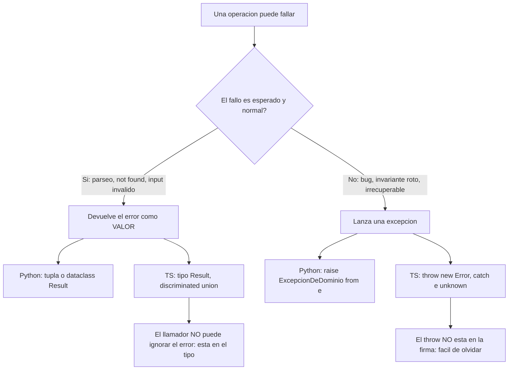

import Reto from "@components/Reto.astro";
import Solucion from "@components/Solucion.astro";
import Quiz from "@components/Quiz.astro";
import CheckDominio from "@components/CheckDominio.astro";
import Nivel from "@components/Nivel.astro";

<Nivel nivel="profundización" />

Una función que solo dice qué hace cuando todo sale bien está contando media historia. La otra mitad —qué pasa cuando el archivo no existe, cuando el LLM devuelve basura, cuando el número no es un número— es **el contrato real**. En esta lección vas a ver las dos formas idiomáticas de escribir esa otra mitad: las **excepciones** (`raise` / `throw`, el camino por defecto en Python) y el **patrón Result** con **discriminated unions** (devolver el error como un valor tipado, muy idiomático en TypeScript). No son rivales: son herramientas para momentos distintos, y saber **cuándo lanzar vs cuándo devolver** es exactamente la clase de decisión que separa a un junior de un semi-senior.

:::tip[Si ya tocaste esto antes]
Si ya escribiste `try/except` en Python y `try/catch` en JS, no te saltes la lección: úsala como **diagnóstico**. Ve directo a los **dos ejercicios Primero-Sin-IA** (sección 7). Si puedes implementar una jerarquía de excepciones con encadenamiento (`raise ... from e`) y un `Result<T, E>` que obligue al llamador a manejar el fallo, valida con el check de dominio (sección 8) y avanza. Si dudas en "¿por qué `Result` si ya tengo `throw`?", lee la sección 4.4 y la 5: ahí está la decisión que filtra a la mayoría.
:::

## 1. Qué vas a saber hacer

Al terminar, sin IA y sin notas, podrás:

- **O1 — Explicar el trade-off** entre lanzar una excepción y devolver el error como valor: cuándo cada uno es la decisión correcta y por qué un `throw` es **invisible** en la firma mientras un `Result` es **parte del contrato**.
- **O2 — Implementar** en Python una jerarquía de excepciones de dominio, lanzarla con encadenamiento (`raise ... from e`) y consumirla con `try/except` específico (estilo EAFP).
- **O3 — Implementar** en TypeScript el patrón `Result<T, E>` con una **discriminated union** y consumirlo con **narrowing exhaustivo**, de modo que el compilador obligue a manejar el caso de error.

## 2. Por qué importa (el dinero está aquí)

> 💰 **Por qué importa:** "¿cómo manejas los errores?" es una pregunta de entrevista que parece inocente y revela tu nivel en treinta segundos. El junior atrapa todo con un `except` pelado o un `catch {}` vacío y sigue. El semi-senior trata el fallo como un caso de primera clase: lo tipa, lo prueba, lo registra con su causa, y decide a conciencia si sube o se devuelve. En el mundo de la IA esto es doble: la salida de un LLM **falla seguido** (alucina, devuelve JSON roto, se pasa de tokens), y el código que no maneja ese fallo con disciplina no llega a producción.

TypeScript es el filtro #1 que hoy te descarta de roles fullstack, y el patrón `Result` es parte de cómo se escribe TS profesional moderno (lo verás en librerías, en código de Effect/neverthrow, en cualquier API que no quiera mentirle al llamador). Python, tu lenguaje de IA, tiene una cultura de excepciones fuerte y específica —EAFP, "pide perdón, no permiso"— que hay que conocer para no escribir Python con acento de Java. Dominar **las dos** te da algo escaso: el criterio para elegir, no la costumbre de repetir un solo patrón en todos lados.

## 3. Lo que ya traes (actívalo)

Esta sub-unidad se apoya en lo anterior. Reúsalo:

- De [`0.7` Fundamentos: manejo de errores](/fase-0-fundamentos/0-7-fundamentos-programacion/): `try/except`, `raise ValueError(...)`, y la idea de "fallar ruidoso" en vez de seguir con un dato malo.
- De [`0.8` Spec-first + stack traces](/fase-0-fundamentos/0-8-spec-first-y-stack-traces/): pensar entradas/salidas/**casos borde** antes de codear, y **leer** una stack trace. Los casos borde son justo los modos de fallo que esta lección convierte en contrato.
- De [`1.1` Python básico→intermedio](/fase-1-lenguajes/1-1-python-basico-intermedio/): clases, `dataclass`, tuplas. Una excepción de dominio es una clase; un `Result` en Python suele ser una tupla o un dataclass.
- De [`1.4` Type hints y pydantic](/fase-1-lenguajes/1-4-type-hints-mypy-pydantic/): `ValidationError` es una excepción; un modelo pydantic que rechaza datos **lanza**. Esa es una decisión de diseño que aquí vas a entender.
- De la sub-unidad de [`1.8` TypeScript](/fase-1-lenguajes/1-8-typescript-desde-cero/): **discriminated unions**, **narrowing** y **type guards**. El patrón `Result` es la aplicación estrella de las discriminated unions; si esa sección te quedó floja, esta la consolida.

Antes de seguir, responde de memoria:

<Quiz
  question="En Python, ¿cuál es la diferencia entre `raise ValueError('x')` y `return None` para señalar 'no encontré nada'?"
  options={[
    "Son equivalentes; ambos detienen la función",
    "`raise` interrumpe el flujo y sube hasta quien lo capture; `return None` continúa normal y obliga al llamador a recordar chequear",
    "`return None` es más rápido, así que siempre es mejor",
  ]}
  answer={1}
  explanation="`raise` cambia el flujo de control: la función no devuelve, la excepción sube por la pila hasta un `except` que la maneje (o revienta el programa). `return None` es un retorno normal: el llamador recibe un valor y, si olvida compararlo con None, el bug aparece más adelante. Por eso `None` como señal de error es ambiguo y peligroso."
/>

## 4. Ejemplo resuelto, pensado en voz alta

Mismo problema, dos idiomas. Quiero una función que tome una línea de texto de un gasto —formato `comercio;monto;categoria`, como `"Lider;12990;supermercado"`— y la convierta en un dato estructurado. Pero las líneas vienen de afuera (un archivo, un correo, un LLM): pueden estar **rotas**. ¿Qué hago cuando lo están? Esa es toda la lección. **No leas esto como un resultado: léelo como me oirías razonar al lado tuyo.**

### 4.1 Primero el contrato (spec-first)

Antes de una línea de código, listo los **modos de fallo** —los casos borde de [0.8](/fase-0-fundamentos/0-8-spec-first-y-stack-traces/)—:

- la línea no tiene exactamente 3 campos,
- el `monto` no es un entero,
- el `monto` es ≤ 0,
- `comercio` o `categoria` están vacíos.

Razono: *"Estos cuatro fallos **no son bugs míos**: son entrada inválida, algo perfectamente esperable cuando el dato viene de afuera. La pregunta de diseño es: ¿interrumpo el flujo (excepción) o devuelvo el fallo como un valor que el llamador está obligado a mirar (Result)? Voy a mostrar ambas y después decido."*

### 4.2 Python idiomático: excepciones de dominio

En Python la cultura es **EAFP** —*Easier to Ask Forgiveness than Permission*—: intentas la operación y manejas la excepción si falla, en vez de chequear todo de antemano. Defino una excepción **propia** (de dominio) para que el llamador pueda distinguir "esta línea está mala" de cualquier otro error:

```python
from dataclasses import dataclass


@dataclass(frozen=True)
class Gasto:
    comercio: str
    monto: int
    categoria: str


class LineaInvalida(Exception):
    """La línea no respeta el formato 'comercio;monto;categoria'."""


def parsear_linea(linea: str) -> Gasto:
    partes = [p.strip() for p in linea.split(";")]
    if len(partes) != 3:
        raise LineaInvalida(f"esperaba 3 campos, llegaron {len(partes)}: {linea!r}")

    comercio, monto_raw, categoria = partes
    if not comercio or not categoria:
        raise LineaInvalida(f"comercio y categoría no pueden ser vacíos: {linea!r}")

    try:
        monto = int(monto_raw)            # EAFP: intento convertir, no pre-chequeo
    except ValueError as e:
        raise LineaInvalida(f"monto no es entero: {monto_raw!r}") from e   # 👈 encadenado

    if monto <= 0:
        raise LineaInvalida(f"monto debe ser > 0: {monto}")

    return Gasto(comercio=comercio, monto=monto, categoria=categoria)
```

Pienso en voz alta sobre las dos decisiones clave:

1. *"Defino `LineaInvalida(Exception)` en vez de lanzar un `ValueError` genérico. ¿Por qué? Porque quien llame a `parsear_linea` quiere atrapar **exactamente este** fallo —línea mala— sin tragarse de paso un `KeyError` o un bug real. Una excepción de dominio es un nombre en el vocabulario de mi sistema."*
2. *"El `raise LineaInvalida(...) from e` es **encadenamiento**. `int(monto_raw)` lanzó un `ValueError` de bajo nivel; yo lo traduzco a mi excepción de dominio, pero conservo la causa original con `from e`. En la stack trace aparecerá 'The above exception was the direct cause of...' y no pierdo la pista del fallo real. Como uso `from e`, gano observabilidad gratis; si lo omitiera, escondería la causa raíz."*

El llamador consume con `try/except` **específico**:

```python
try:
    gasto = parsear_linea(linea)
except LineaInvalida as e:
    print(f"línea ignorada: {e}")       # decisión consciente: la salto
else:
    registrar(gasto)
```

Hereda de `Exception`, **no** de `BaseException`: heredar de `BaseException` te haría atrapar también `KeyboardInterrupt` y `SystemExit`, que **no** quieres tragarte.

### 4.3 TypeScript idiomático: el patrón Result

TypeScript también tiene `throw`/`try`/`catch`, pero arrastra un problema: **lo que una función lanza no aparece en su firma**. `parsearLinea(s: string): Gasto` *miente* —dice que devuelve un `Gasto`, y calla que a veces explota—. El compilador no me obliga a manejar nada. El patrón **Result** arregla eso: en vez de lanzar, **devuelvo** el fallo como un valor, y la firma lo declara.

La pieza central es una **discriminated union** (de [1.8](/fase-1-lenguajes/1-8-typescript-desde-cero/)): un campo común —aquí `ok`— que el compilador usa para saber en cuál de los dos casos estás.

```ts
// Result: o un éxito con `value`, o un fallo con `error`. Discriminados por `ok`.
export type Result<T, E> =
  | { ok: true; value: T }
  | { ok: false; error: E };

export const ok = <T>(value: T): Result<T, never> => ({ ok: true, value });
export const err = <E>(error: E): Result<never, E> => ({ ok: false, error });

export type Gasto = { comercio: string; monto: number; categoria: string };

// El error también es una discriminated union: distingo el TIPO de fallo.
export type ParseError =
  | { tipo: "formato"; mensaje: string }
  | { tipo: "monto"; mensaje: string };

export function parsearLinea(linea: string): Result<Gasto, ParseError> {
  const partes = linea.split(";").map((p) => p.trim());
  if (partes.length !== 3) {
    return err({ tipo: "formato", mensaje: `esperaba 3 campos, llegaron ${partes.length}` });
  }

  const [comercio, montoRaw, categoria] = partes;
  if (comercio.length === 0 || categoria.length === 0) {
    return err({ tipo: "formato", mensaje: "comercio y categoría no pueden ser vacíos" });
  }

  const monto = Number(montoRaw);
  if (!Number.isInteger(monto) || monto <= 0) {
    return err({ tipo: "monto", mensaje: `monto inválido: ${montoRaw}` });
  }

  return ok({ comercio, monto, categoria });
}
```

Pienso en voz alta: *"La firma ahora dice la verdad completa: `Result<Gasto, ParseError>`. El llamador **no puede** usar el `Gasto` sin antes preguntar `if (resultado.ok)`. Eso es 'el error es parte del contrato': el fallo está en el tipo de retorno, no escondido en un `throw`."*

El llamador hace **narrowing** sobre `ok`, y al manejar el error puedo cubrir cada `tipo` exhaustivamente:

```ts
const r = parsearLinea(linea);
if (r.ok) {
  registrar(r.value);            // aquí TS sabe que r.value es Gasto
} else {
  // aquí TS sabe que r.error es ParseError
  switch (r.error.tipo) {
    case "formato":
      console.warn(`formato: ${r.error.mensaje}`);
      break;
    case "monto":
      console.warn(`monto: ${r.error.mensaje}`);
      break;
    default: {
      const _exhaustivo: never = r.error;   // si agrego un tipo y olvido un case, NO compila
      throw new Error(`tipo no manejado: ${JSON.stringify(_exhaustivo)}`);
    }
  }
}
```

Ese truco del `const _exhaustivo: never` es oro de entrevista: si mañana agrego un tercer `tipo` de `ParseError` y olvido su `case`, **el compilador me lo marca en rojo**. El error es exhaustivo por construcción.

### 4.4 La decisión: cuándo lanzar y cuándo devolver

Aquí está el núcleo. La regla práctica:

| Pregúntate… | Si la respuesta es sí → | Idioma |
|---|---|---|
| ¿El fallo es **esperado y normal** (entrada inválida, "no encontrado", parseo)? | **Devuelve** el error (Result / valor) | `Result<T, E>`, tupla `(valor, error)` |
| ¿El fallo es **excepcional, raro o irrecuperable aquí** (bug, invariante roto, disco lleno)? | **Lanza** una excepción | `raise` / `throw` |
| ¿Quieres que el llamador **esté obligado** a manejarlo? | **Devuelve** (queda en el tipo) | `Result<T, E>` |
| ¿Quieres que **suba** varios niveles hasta un manejador central? | **Lanza** | `raise` / `throw` |

Y la asimetría cultural que tienes que conocer:

- **Python** se inclina a **excepciones** por defecto (EAFP). Devolver `Result` existe, pero lo idiomático para la mayoría de fallos es lanzar una excepción de dominio.
- **TypeScript** puede ir por cualquiera, y para **fallos esperados y recuperables** el `Result` gana terreno fuerte porque pone el error en el tipo —algo que `throw` nunca hace en ningún lenguaje de los dos: ni Python ni TS declaran en la firma qué excepciones lanzan—.



## 5. Errores que vas a tener (y por qué)

:::caution[Podrías pensar que `except:` / `catch {}` "maneja" el error]
Atrapar **todo** y no hacer nada (o solo un `print`) **esconde** el bug, no lo maneja. En Python un `except:` pelado se traga hasta `KeyboardInterrupt`; usa `except Exception` como mucho, y mejor el tipo **específico** (`except LineaInvalida`). En TS un `catch {}` vacío hace que el programa siga con estado corrupto. Manejar un error es **decidir** algo: registrarlo con contexto, traducirlo, reintentar, o devolverlo hacia arriba. Silenciarlo no es manejarlo.
:::

:::caution[Podrías pensar que en TS `catch (e)` te da un `Error`]
En modo `strict` (el de este curso), `catch (e)` tipa `e` como **`unknown`**, no como `Error`. ¿Por qué? Porque en JavaScript puedes lanzar **cualquier cosa**: `throw "texto"`, `throw 42`, `throw { code: 1 }`. Antes de usar `e.message` tienes que **estrechar**: `if (e instanceof Error) { e.message }`. Si tu código asume `e: Error` sin chequear, es un bug esperando un `throw` raro de una librería.
:::

:::caution[Podrías pensar que devolver `None` / `null` / `-1` es una buena señal de error]
Es la trampa clásica. `def buscar(...) -> int` que devuelve `-1` "si no encontró" obliga a **recordar** comparar con `-1` en cada llamada, y nada te obliga a hacerlo: el día que lo olvidas, `-1` se cuela como un índice o un monto real. Un `None` sin tipar es igual de ambiguo: ¿`None` significa "no encontrado", "error", o "el valor es legítimamente nulo"? Si el fallo importa, hazlo **explícito**: una excepción de dominio o un `Result` tipado. El tipo debe gritar el fallo, no susurrarlo.
:::

:::caution[Podrías pensar que las excepciones son "lentas" y por eso hay que evitarlas]
En Python, lanzar y atrapar una excepción en el camino de error es barato comparado con la lógica que lo rodea; EAFP es **idiomático y rápido** para el caso normal (el `try` sin excepción casi no cuesta). El argumento de rendimiento para preferir `Result` casi nunca aplica a nivel de aplicación; cuando preferimos `Result` es por **claridad del contrato**, no por velocidad. Optimizar el manejo de errores por micro-rendimiento es resolver un problema que no tienes.
:::

:::caution[Podrías pensar que `Result` es "mejor" que las excepciones y hay que usarlo siempre]
No. Si envuelves **cada** función en `Result`, terminas propagando `if (r.ok)` por veinte niveles —ruido que las excepciones resuelven dejando que el error **suba solo** hasta un manejador central—. `Result` brilla en **fronteras** y fallos esperados que el llamador inmediato debe decidir; las excepciones brillan cuando el fallo debe viajar lejos sin que cada capa intermedia lo toque. Elegir uno para todo es la señal de que copiaste un patrón sin entender el trade-off.
:::

## 6. Práctica con andamiaje (que se desvanece)

Tres niveles, de más apoyo a menos. **A mano primero.**

### 6.1 PREDICT (sin ejecutar)

Lee este código Python y predice **qué imprime**, en orden:

```python
class ErrorDeDominio(Exception):
    pass

def f(x):
    try:
        if x < 0:
            raise ErrorDeDominio("negativo")
        return 10 // x
    except ZeroDivisionError:
        print("A")
        return 0
    except ErrorDeDominio:
        print("B")
        return -1
    finally:
        print("C")

print(f(0))
print(f(-5))
print(f(2))
```

<Solucion title="Ver la respuesta (solo después de predecir)">
Salida, en orden:

```text
A
C
0
B
C
-1
C
5
```

`f(0)`: `10 // 0` lanza `ZeroDivisionError` → imprime `A`, el `finally` imprime `C`, devuelve `0`. `f(-5)`: el `raise ErrorDeDominio` salta al `except ErrorDeDominio` → `B`, luego `finally` → `C`, devuelve `-1`. `f(2)`: no hay error, no entra a ningún `except`, pero `finally` **siempre** corre → imprime `C`, devuelve `5`. La clave: `finally` corre **siempre**, haya o no excepción, y corre **antes** de que el valor de retorno llegue al `print` de afuera.
</Solucion>

### 6.2 Parsons — reordena el `Result`

Estas líneas implementan un `dividir` en TypeScript que devuelve un `Result` en vez de lanzar, pero están **desordenadas**. Reescríbelas en el orden correcto (cuida llaves e indentación):

```text
  return { ok: true, value: a / b };
export function dividir(a: number, b: number): Result<number, string> {
  }
  if (b === 0) {
    return { ok: false, error: "división por cero" };
}
```

<Solucion title="Ver el orden correcto">

```ts
export function dividir(a: number, b: number): Result<number, string> {
  if (b === 0) {
    return { ok: false, error: "división por cero" };
  }
  return { ok: true, value: a / b };
}
```

Las claves: el **guard del caso de error primero** (`if (b === 0)`), que devuelve temprano el `{ ok: false, ... }`; y el **camino feliz al final** (`{ ok: true, value: ... }`). Devolver temprano el error mantiene el camino feliz sin anidar. Aquí `E` es un simple `string`; en código real suele ser una discriminated union como `ParseError`.
</Solucion>

### 6.3 MODIFY

Toma esta función de Python que devuelve un **sentinel ambiguo** y arréglala para que **lance** una excepción de dominio en su lugar:

```python
def cobrar(saldo: int, monto: int) -> int:
    if monto > saldo:
        return -1          # 👈 sentinel ambiguo: ¿y si un saldo real fuera -1?
    return saldo - monto
```

Tu tarea: define `class SaldoInsuficiente(Exception)` y haz que `cobrar` la lance con un mensaje útil (incluye saldo y monto). Pruébalo: `cobrar(1000, 500)` → `500`; `cobrar(100, 500)` → debe lanzar `SaldoInsuficiente`. Piensa: ¿por qué lanzar es aquí mejor que devolver `-1`? (Pista: nadie puede usar el resultado de `cobrar` como si fuera un saldo válido si el fallo interrumpe el flujo).

## 7. Ejercicios Primero-Sin-IA

Sin andamiaje. Resuélvelos **sin IA** dentro del timebox. Son dos: el mismo problema en cada idioma, para que sientas el contraste en las manos.

<Reto title="Excepciones de dominio en Python (parser de gastos)" timebox="30–40 min">

Escribe un parser de líneas de gastos en Python con **dos niveles** de manejo de error: la unidad **lanza**, el lote **devuelve los errores como datos**. `parsear_linea` lanza una excepción de dominio `LineaInvalida` (con encadenamiento cuando convierte el monto), y `parsear_archivo` recorre muchas líneas **sin caerse en la primera mala**: junta los `Gasto` válidos por un lado y los errores por otro.

Entregable: tu solución en `ejercicios/fase-1/excepciones-idiomaticas-python/` (carpeta del repo), con los tests en verde.

**Hecho significa:**
- [ ] `parsear_linea` lanza `LineaInvalida` (subclase de `Exception`) ante línea con campos ≠ 3, monto no entero, monto ≤ 0, o `comercio`/`categoria` vacíos.
- [ ] Cuando el monto no es entero, la excepción está **encadenada** (`raise ... from e`): `exc.__cause__` es el `ValueError` original.
- [ ] `parsear_archivo(texto)` devuelve `(list[Gasto], list[ErrorLinea])`, ignora líneas en blanco, y **no se cae** aunque haya líneas malas.
- [ ] Agregaste al menos un test propio de un caso borde realista.
- [ ] Puedes explicar **sin notas** por qué la unidad lanza pero el lote devuelve, y qué gana el `from e`.

<Solucion title="Pista (ábrela solo si superaste el timebox)">
Diseña el contrato antes (spec-first, [0.8](/fase-0-fundamentos/0-8-spec-first-y-stack-traces/)): cuatro modos de fallo, cada uno con su `raise LineaInvalida(...)`. Para el monto, EAFP: `try: monto = int(monto_raw) except ValueError as e: raise LineaInvalida(...) from e`. Para `parsear_archivo`, usa `enumerate(texto.splitlines(), start=1)`, un `try/except LineaInvalida` por línea que en vez de relanzar **acumula** un `ErrorLinea(numero, contenido, motivo)` en una lista. La unidad lanza porque su contrato es "una línea válida o nada"; el lote devuelve porque su contrato es "procesa todo lo que puedas y repórtame qué falló". Esto es una pista, no la solución.
</Solucion>

</Reto>

<Reto title="El patrón Result con discriminated unions en TypeScript" timebox="35–45 min">

Implementa el mismo parser, pero en TypeScript con el patrón `Result<T, E>` **sin lanzar**. Define el tipo `Result`, los helpers `ok`/`err`, la discriminated union `ParseError` (con `tipo`), y `parseGasto(linea): Result<Gasto, ParseError>`. Además, escribe `safeJsonParse(raw): Result<unknown, Error>` que envuelva el `JSON.parse` (que **sí** lanza) y lo convierta en un `Result` —el patrón "domar una API que lanza"—, manejando el `catch (e: unknown)` con narrowing.

Entregable: tu solución en `ejercicios/fase-1/result-discriminated-union-ts/` (carpeta del repo), con los tests de Vitest en verde.

**Hecho significa:**
- [ ] `parseGasto` **nunca lanza**: devuelve `{ ok: true, value }` o `{ ok: false, error }` con el `tipo` de `ParseError` correcto (`formato` vs `monto`).
- [ ] El llamador hace narrowing sobre `.ok` y un `switch (error.tipo)` con chequeo de exhaustividad (`const _: never`).
- [ ] `safeJsonParse` atrapa el throw de `JSON.parse`, estrecha `e: unknown` (`e instanceof Error`) y devuelve un `Result` —nunca propaga el throw—.
- [ ] Agregaste al menos un test propio de un caso borde.
- [ ] Puedes explicar **sin notas** por qué `Result` pone el error "en el contrato" y `catch` tipa `e` como `unknown`.

<Solucion title="Pista (ábrela solo si superaste el timebox)">
El tipo: `type Result<T, E> = { ok: true; value: T } | { ok: false; error: E }`. Los helpers devuelven `Result<T, never>` y `Result<never, E>` (el `never` los hace asignables a cualquier `Result<T, E>`). En `parseGasto`, **return temprano** por cada modo de fallo con su `err({ tipo: ..., mensaje: ... })`; el camino feliz al final con `ok({...})`. En `safeJsonParse`: `try { return ok(JSON.parse(raw)); } catch (e) { return err(e instanceof Error ? e : new Error(String(e))); }`. Para correr los tests: `pnpm add -D vitest` y `pnpm vitest run`. Esto es una pista, no la solución.
</Solucion>

</Reto>

## 8. Check de dominio

Sin mirar la lección, en voz alta o por escrito:

<CheckDominio
  items={[
    "Explicar cuándo lanzar una excepción y cuándo devolver el error como valor, con un ejemplo de cada uno.",
    "Decir por qué un `throw` es invisible en la firma y un `Result<T, E>` es parte del contrato.",
    "Escribir una excepción de dominio en Python y lanzarla encadenada con `raise ... from e`.",
    "Explicar qué hace `from e` y qué pierdes si lo omites.",
    "Definir un `Result<T, E>` con discriminated union y consumirlo con narrowing sobre `ok`.",
    "Decir por qué en TS `catch (e)` tipa `e` como `unknown` y cómo se estrecha a `Error`.",
    "Explicar por qué devolver `None`/`-1` como señal de error es ambiguo y peligroso.",
  ]}
/>

Si marcaste menos de seis, vuelve a la sección correspondiente **antes** de avanzar.

<Quiz
  question="Escribes una función `findUser(id): User` en TypeScript. A veces el usuario no existe. ¿Cuál diseño hace que el llamador NO pueda olvidar el caso 'no existe'?"
  options={[
    "Devolver `User | null` y confiar en que el llamador chequee null",
    "Lanzar una excepción `UserNotFound` y documentarla en un comentario",
    "Devolver `Result<User, UserNotFound>`: el éxito y el fallo están en el tipo, y TS obliga a discriminar antes de usar el `User`",
  ]}
  answer={2}
  explanation="`User | null` se puede ignorar (el llamador olvida el null); el `throw` no está en la firma (un comentario no lo obliga). `Result<User, UserNotFound>` mete el fallo EN el tipo de retorno: el compilador no te deja tocar el `User` sin antes preguntar `if (r.ok)`. El error es parte del contrato, no una nota al pie."
/>

## 9. Recursos (documentación oficial primero)

- **Python — Errors and Exceptions (tutorial oficial)** — [docs.python.org/3/tutorial/errors.html](https://docs.python.org/3/tutorial/errors.html) (cubre `try/except/else/finally`, excepciones propias y encadenamiento).
- **Python — Built-in Exceptions** — [docs.python.org/3/library/exceptions.html](https://docs.python.org/3/library/exceptions.html) (la jerarquía: de cuál heredar y por qué `Exception`, no `BaseException`).
- **TypeScript Handbook — Narrowing y discriminated unions** — [typescriptlang.org/docs/handbook/2/narrowing.html](https://www.typescriptlang.org/docs/handbook/2/narrowing.html) (la base técnica del patrón `Result`).
- **TypeScript Handbook — More on Functions / `never`** — [typescriptlang.org/docs/handbook/2/functions.html](https://www.typescriptlang.org/docs/handbook/2/functions.html) (el chequeo de exhaustividad con `never`).
- **MDN — `try...catch`** — [developer.mozilla.org/.../try...catch](https://developer.mozilla.org/en-US/docs/Web/JavaScript/Reference/Statements/try...catch) (y por qué se puede lanzar cualquier valor en JS).
- **neverthrow** — [github.com/supermacro/neverthrow](https://github.com/supermacro/neverthrow) — librería que implementa `Result` para TS con métodos encadenables. Mírala **después** de haberlo hecho a mano, para entender qué te ahorra.

## 10. Conexión con el capstone de la fase

El **Capstone F1 — La misma app, dos lenguajes** es la mini-API de la despensa de HomeHub en Python y en TypeScript. El manejo de errores es justo donde el contraste bilingüe se vuelve material de portafolio:

- **Lado Python:** cada operación que puede fallar de forma esperada (producto no encontrado, stock insuficiente) lanza una **excepción de dominio** propia; cuando llegues a **FastAPI** en la Fase 3, esas excepciones se mapean a códigos HTTP (404, 409) en un solo lugar. La validación de cada request con pydantic ([1.4](/fase-1-lenguajes/1-4-type-hints-mypy-pydantic/)) **lanza** `ValidationError`: ya es una decisión de diseño que ahora entiendes.
- **Lado TypeScript:** las funciones de la capa de dominio devuelven `Result<T, E>` para los fallos esperados, de modo que el handler de la ruta esté **obligado** a discriminar antes de responder. El error nunca se cuela como un `200 OK` con basura.
- **Ambos lados** registran el error con su **causa** (encadenamiento en Python, el `error` del `Result` en TS): esa es la semilla de la observabilidad que formalizas en la Fase 5.

> [!tip] GLaDOS dice
> Un `try/except` pelado que se traga todo es el equivalente a tapar la luz "check engine" con una calcomanía. El auto sigue andando. Hasta que no.

## 11. Reflexión y repaso espaciado

Cierra en dos o tres frases: **¿cuál es el costo real de un `throw` que no está en la firma, y qué problema exacto resuelve poner el error en el tipo de retorno?** Si puedes responder eso con un ejemplo propio, interiorizaste el núcleo de la lección.

Gancho de **spaced repetition**:

- **Mañana:** reescribe **de memoria** la definición de `Result<T, E>` y los helpers `ok`/`err` en TypeScript, sin mirar. Si no sale el `never` en los tipos de retorno, ahí está tu punto débil.
- **En 3 días:** toma tu `parsear_archivo` de Python y agrégale un tercer modo de fallo (p. ej. categoría no permitida), asegurándote de que el encadenamiento y la recolección de errores sigan funcionando, sin releer la lección.
- **En 1 semana:** explícale a alguien (o a una grabación) la tabla de "cuándo lanzar vs cuándo devolver" con un ejemplo de cada fila. Enseñarlo es el test de dominio definitivo.
