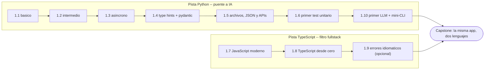

import Reto from "@components/Reto.astro";
import Solucion from "@components/Solucion.astro";
import CheckDominio from "@components/CheckDominio.astro";
import Nivel from "@components/Nivel.astro";

<Nivel nivel="básico" />

Saliste de la [Fase 0](/fase-0-fundamentos/) sabiendo *pensar* en código sin que
una IA piense por ti. Aquí le pones **dos idiomas** a ese pensamiento: **Python**
—tu puente directo a la IA— y **TypeScript** —el lenguaje que hoy te abre (o te
cierra) la puerta fullstack—. No es "aprender sintaxis": es ganar fluidez en los
dos lenguajes sobre los que se construye todo lo que viene (backend, frontend,
agentes, pipelines), y escribir tu **primer test** y tu **primer llamado a un
LLM** en el camino.

## Objetivos de la fase

Al cerrar la Fase 1 sabrás **hacer** esto (no solo "haber leído sobre ello"):

- **Escribir** programas Python idiomáticos —de los tipos básicos al código
  asíncrono— y **explicar el trade-off** de cuándo usar un generador, un
  decorador o `async/await`, en vez de copiarlos por inercia.
- **Tipar y validar** datos en serio: type hints + `mypy` y `pydantic` en Python,
  tipos + `zod` en TypeScript, para que los errores salten en tu editor y no en
  producción.
- **Escribir un test unitario** *antes* del código (primer ciclo red-green-refactor)
  y usarlo como método para aprender el lenguaje, no como trámite final.
- **Construir la misma mini-API en Python y en TypeScript**, partiendo de una
  mini-spec, y **defender** qué cambió entre ambos y por qué.

:::tip[Por qué importa (relevancia de mercado)]
**TypeScript es el filtro #1 que descarta candidatos fullstack** hoy: lo piden de
forma explícita en una porción enorme de las ofertas web, y sin él ni llegas a la
entrevista técnica. **Python** es el otro lado de tu perfil: es el lenguaje en el
que se sirve casi toda la IA en producción (FastAPI, los SDK de los modelos, los
pipelines de datos). Dominar los dos no es "saber dos lenguajes": es poder
construir **de punta a punta** el software que envuelve a la IA —que es justo lo
que el mercado semi-senior paga por encima del que solo *orquesta* modelos.
:::

## ¿Para quién es esta fase?

Está escrita para **cero real**: no asume que ya programaste en Python ni que
sabes qué es un tipo. Cada concepto arranca con un ejemplo resuelto —el experto
razonando en voz alta— antes de pedirte que lo hagas tú. TypeScript se enseña
**desde cero**, no como "JavaScript con tipos para quien ya sabe JS".

:::tip[Si ya lo tocaste]
¿Vienes con Python oxidado o algo de JavaScript? No saltes en seco: **valida**.
Haz el [diagnóstico de entrada](#ejercicio-de-entrada-diagnóstico-y-plan-de-fase-1)
del final de esta página y resuelve un ejercicio Primero-Sin-IA de cada
sub-unidad que creas dominar. Si lo cierras sin notas y sin IA dentro del
timebox, marca la casilla y avanza. Si te trabas con type hints, generadores o
`async`, era un falso "ya lo sé": quédate. La experiencia previa es un **atajo de
validación**, nunca un permiso para saltar a ciegas.
:::

## Las dos pistas de la fase

La Fase 1 corre en **dos pistas que convergen** en el capstone. No las estudies
en bloques aislados: alternarlas (*interleaving*) fija mejor cada una.

- **Pista Python (puente a IA):** la columna larga. Vas de los fundamentos al
  código asíncrono, te tomas en serio el tipado y la validación, escribes tu
  primer test y rematas con tu **primera victoria de IA**: llamar a un LLM por API
  desde una mini-CLI. Es la [Pista B del curso](/empezar/) hecha realidad —el
  "para esto vine" del que entró por la IA, ya en la Fase 1.
- **Pista TypeScript (filtro fullstack):** JavaScript moderno primero (porque TS
  *es* JavaScript con tipos), luego TypeScript desde cero. Más corta, pero es la
  que te saca del montón de descartes automáticos.

## Mapa de la fase

Diez sub-unidades de contenido más un capstone. El orden dentro de la pista
Python **importa**: cada pieza motiva la siguiente (no aprendes decoradores
"porque tocan", sino cuando un problema los pide).

| # | Sub-unidad | Nivel | Qué construyes ahí |
|---|---|---|---|
| 1.1 | [Python básico](/fase-1-lenguajes/1-1-python-basico-intermedio/) | 🟢 básico | Tipos, control de flujo, funciones, estructuras (listas/dicts/sets/tuplas), módulos/paquetes y entornos con `venv`/`uv`. |
| 1.2 | [Python intermedio](/fase-1-lenguajes/1-2-python-intermedio/) | 🟡 intermedio | Comprehensions, generadores, decoradores y context managers —cada uno motivado por el problema que resuelve. |
| 1.3 | [Python asíncrono](/fase-1-lenguajes/1-3-python-asincrono/) | 🔴 avanzado | `async`/`await` y el modelo de concurrencia, al final de la secuencia y motivado por necesidad (no antes). |
| 1.4 | [Type hints + mypy + pydantic](/fase-1-lenguajes/1-4-type-hints-mypy-pydantic/) | 🟡 intermedio | Tipado profesional con `mypy` y validación de datos en runtime con `pydantic`. La base de todo código serio en IA y APIs. |
| 1.5 | [Archivos, JSON y APIs](/fase-1-lenguajes/1-5-archivos-json-apis/) | 🟡 intermedio | Leer/escribir archivos, parsear JSON y hablar con APIs HTTP (`httpx`/`requests`). El primer paso para que tu código toque el mundo. |
| 1.6 | [Primer test unitario (pytest)](/fase-1-lenguajes/1-6-primer-test-pytest/) | 🟡 intermedio | Tu **primer ciclo red-green-refactor**: el test como método para *aprender* el lenguaje. Aquí arranca el hilo de testing del curso. |
| 1.7 | [JavaScript moderno (ES6+)](/fase-1-lenguajes/1-7-javascript-moderno/) | 🟢 básico | `let`/`const`, arrow functions, destructuring, promesas/`async`, módulos ES, métodos de array, closures, `this` y prototipos. |
| 1.8 | [TypeScript desde cero](/fase-1-lenguajes/1-8-typescript-desde-cero/) | 🟡 intermedio | Tipos, interfaces vs types, generics, narrowing/type guards, utility types, `tsconfig` y `zod`. El filtro fullstack, dominado. |
| 1.9 | [Manejo de errores idiomático](/fase-1-lenguajes/1-9-errores-idiomaticos-comparados/) | 🔵 profundización | Excepciones de Python vs. `Result`/discriminated unions en TS. Cómo cada lenguaje *quiere* que manejes el error. |
| 1.10 | [Victoria-IA: primer LLM + mini-CLI](/fase-1-lenguajes/1-10-primer-llm-mini-cli/) | 🟡 intermedio | Tu **primera victoria de IA**: llamar a un LLM por API desde una mini-CLI, validar su salida y medir tokens/costo. El "para esto vine". |
| 1.P | [🛠️ Capstone — La misma app, dos lenguajes](/fase-1-lenguajes/proyecto/) | 🟡 intermedio | Una mini-API (la despensa de HomeHub) en Python **y** en TypeScript/Node, con tests mínimos y mini-spec. |

> La 1.9 es **profundización**: no bloquea el avance. Hazla si quieres entender
> por qué cada lenguaje maneja errores distinto; si vas con el tiempo justo,
> ciérrala como repaso más adelante. Ninguna sub-unidad opcional se elimina del
> curso —se pospone.

## Los hilos que arrancan o se afianzan aquí

La Fase 1 no es solo "dos lenguajes": es donde varios **hábitos transversales**
del curso entran en escena. No son temas sueltos, son la forma de trabajar.

- **Testing / TDD (arranca en 1.6).** El primer test unitario no es un trámite al
  final: es el **método por defecto del Primero-Sin-IA**. Escribes el test que
  describe lo que quieres, lo ves fallar (red), lo haces pasar (green), limpias
  (refactor). A partir de aquí, cada reto se puede atacar así.
- **Tipado como red de seguridad (1.4, 1.8).** `mypy` + `pydantic` y TypeScript +
  `zod` hacen que una clase entera de errores salte **mientras escribes**, no en
  producción. Es la versión barata de "calidad desde el día 1".
- **Validar la salida del LLM (1.10).** La primera regla de la IA en producción
  aparece ya en tu primera victoria: **nunca confíes en lo que devuelve un modelo
  sin validarlo** (con `pydantic`/`zod`). Y mides **tokens y costo** desde el
  primer request: el hilo de costo/latencia empieza aquí.
- **Spec-driven + Conventional Commits (heredado de F0).** El capstone arranca con
  una mini-spec y se versiona con Conventional Commits, igual que en la Fase 0. No
  se suelta nunca.
- **Inglés técnico ([Track 0](/track-0-empleabilidad/)).** El README del capstone
  va en inglés. El inglés corre en paralelo desde la semana 1, no es una fase
  final.

## Un aviso sobre el orden (carga cognitiva)

:::caution[`async` y los decoradores NO van primero]
Podrías pensar que "Python avanzado" (decoradores, `async/await`, `pydantic`) es
lo que te hace ver pro, y querer saltar ahí de una. Está mal por una razón
concreta: **son soluciones a problemas que todavía no tienes**. Un decorador sin
entender funciones-como-valores es magia que copias y pegas; `async` sin entender
qué problema de espera resuelve es complejidad gratis. Por eso la pista Python va
**básico → intermedio → asíncrono**: cada herramienta llega *cuando un problema la
pide*. Si la lección te lo presenta antes de que duela el problema, es porque
primero te muestra el dolor.
:::

## Checklist de avance

Marca una sub-unidad como completa **solo** cuando cumplas las tres condiciones
(criterio del roadmap): (a) entiendes el concepto **sin notas**, (b) hiciste el
ejercicio **sin IA**, y (c) lo **aplicaste** en el capstone.

- [ ] 1.1 — Python básico
- [ ] 1.2 — Python intermedio
- [ ] 1.3 — Python asíncrono
- [ ] 1.4 — Type hints + mypy + pydantic
- [ ] 1.5 — Archivos, JSON y APIs
- [ ] 1.6 — Primer test unitario (pytest)
- [ ] 1.7 — JavaScript moderno (ES6+)
- [ ] 1.8 — TypeScript desde cero
- [ ] 1.9 — Manejo de errores idiomático *(opcional/profundización)*
- [ ] 1.10 — Victoria-IA: primer LLM + mini-CLI
- [ ] 1.P — Capstone: la misma app, dos lenguajes (cumple el Definition of Done de abajo)
- [ ] `RETROSPECTIVA.md` de la fase escrita (qué aprendí, qué me costó, qué proyecto lo demuestra)

<CheckDominio
  title="Antes de avanzar a la Fase 2, ¿puedes…?"
  items={[
    "Explicar la diferencia entre una lista y un generador, y cuándo te conviene cada uno",
    "Escribir un test con pytest que falle primero y luego hacerlo pasar (red-green)",
    "Tipar una función en Python con type hints y validar su entrada con pydantic",
    "Escribir el mismo modelo de datos en pydantic (Python) y en zod (TypeScript) y señalar qué cambia",
    "Llamar a un LLM por API desde una mini-CLI y validar su salida antes de usarla",
  ]}
/>

## Definition of Done (la vara del capstone)

Todos los capstones del curso comparten **un único** Definition of Done. No todos
sus puntos aplican aún en la Fase 1 (seguridad, observabilidad y evals llegan en
fases posteriores), pero la vara crece: aquí se suman los **tests verdes**.

:::caution[Lo que aplica al Capstone F1 (la misma app, dos lenguajes)]
1. **Mini-spec inicial** + una nota de decisiones (mini-ADR) de lo que elegiste
   (¿qué endpoints?, ¿qué validación?, ¿por qué `httpx` y no `requests`?).
2. **Tests verdes** + lint: la mini-API tiene al menos un puñado de tests con
   **aserciones reales** (no "coverage %"), en ambas versiones.
3. **Demo que CORRE** de verdad: levantas cada versión y responde a una petición.
4. **README en inglés** que explica qué es, cómo se corre y qué cambió entre
   Python y TypeScript.
5. **Conventional Commits** en todo el historial.
6. (Si tu app llama a un LLM) **valida la salida del modelo** antes de usarla y
   registra **tokens/costo** del request.
:::

:::note[Lo que llega después (mismo DoD, otras fases)]
Seguridad OWASP web/LLM (F3, F6) · observabilidad con logs/trazas (F5) · eval
harness para IA (F6) · accesibilidad WCAG si hay UI (F4) · mutation/behavior
coverage como medida de calidad (F2). Lo verás aparecer fase a fase; aquí
plantamos los tests y la validación de salida del LLM.
:::

## Conexión con el capstone

Cada sub-unidad es una pieza de **La misma app, dos lenguajes**: 1.1–1.3 son el
material con el que escribes la lógica; 1.4 tipa y valida la entrada de la API;
1.5 es cómo la API lee datos y habla con el exterior; 1.6 es la red de tests que
la protege; 1.7–1.8 son la otra mitad de la app, la versión TypeScript; 1.10 es
la *feature* de IA que la diferencia. No estudias temas sueltos: ensamblas, pieza
a pieza, una misma app contada en dos idiomas —tu primer material de portafolio
bilingüe.

## Ejercicio de entrada: diagnóstico y plan de Fase 1

Antes de tocar la primera lección, orientarte. Este ejercicio no se corrige "bien
o mal": se corrige por **honestidad y concreción**. Es tu *placement* y tu
contrato con las dos pistas.

<Reto title="Diagnóstico de entrada y plan de Fase 1" timebox="30 min">

Sin IA, en tres archivos markdown dentro de `ejercicios/fase-1/index/`:

1. **`diagnostico.md`** — una tabla con las 10 sub-unidades (1.1 a 1.10) y, para
   cada una, tu nivel **honesto**: `nuevo` · `lo reconozco` · `lo sé hacer sin
   notas`. La prueba de "lo sé hacer" es: ¿podrías resolver un ejercicio del tema,
   ahora, sin notas y sin IA? Si dudas, no es "lo sé hacer".
2. **`plan-fase-1.md`** — tu plan: **bloques semanales concretos** (día y hora),
   cómo vas a **alternar** las dos pistas (Python y TS) en vez de hacer una y
   después la otra, **cuándo** te das tu primera victoria de IA (1.10) como ancla
   de motivación, y tu **ritual de repaso** (cuándo reescribes de memoria).
3. **`por-que-dos-lenguajes.md`** — en 4–6 frases, con tus palabras: por qué este
   curso te pide Python *y* TypeScript, qué rol juega cada uno en tu perfil y en
   qué situación usarías uno u otro.

**Hecho significa:** la tabla cubre las 10 sub-unidades con un nivel defendible
(no todo en "lo sé hacer"); el plan tiene bloques reales en tu semana, alterna las
pistas y agenda la victoria-IA; el texto de los dos lenguajes nombra el rol
concreto de cada uno (no "porque están de moda").

</Reto>

<Solucion title="Pista (ábrela solo si te trabas, no es la solución)">

No busques el plan "perfecto": busca el **sostenible**. Tres bloques de 40 minutos
que cumples valen más que dos horas diarias que abandonas el jueves. Para alternar
las pistas, una receta simple: dedica la mayor parte a la pista Python (es la
larga) y reserva un bloque por semana a la de TypeScript, para que ninguna se
enfríe. Agenda la 1.10 (tu primer LLM) **temprano**, en cuanto cierres 1.5: es la
zanahoria que sostiene la motivación. Para el diagnóstico, vigila la
sobreconfianza: si nunca escribiste un test con `pytest`, 1.6 es `nuevo`, no "lo
reconozco". Para los dos lenguajes, ancla cada rol en algo concreto (Python → IA y
APIs; TypeScript → el front y los filtros de las ofertas), no en una frase
genérica.

</Solucion>

### Cómo pedir la corrección

Cuando termines, pídele a tu IA:

> "Corrige `ejercicios/fase-1/index/` usando el framework de `.ai/`. Sigue
> `INSTRUCCIONES-CORRECTOR.md`."

El corrector revisará la **honestidad** de tu autoevaluación, el **realismo** de
tu plan y la **claridad** de tu justificación de las dos pistas, no si
"acertaste". No existe una respuesta única correcta.

## Recursos

Prefiere siempre **documentación oficial** sobre tutoriales sueltos. Mantén una
lista viva en `articulos.md` dentro de cada sub-unidad.

- [Tutorial oficial de Python (en español)](https://docs.python.org/es/3/tutorial/) — el lenguaje desde la fuente (para 1.1–1.3).
- [Documentación de uv](https://docs.astral.sh/uv/) — el gestor de entornos y paquetes moderno (para 1.1).
- [Documentación de pytest](https://docs.pytest.org/) — tu primer framework de tests (para 1.6).
- [Documentación de pydantic](https://docs.pydantic.dev/latest/) — validación de datos en Python (para 1.4 y 1.10).
- [MDN Web Docs (en español)](https://developer.mozilla.org/es/docs/Web/JavaScript) — JavaScript desde cero (para 1.7).
- [TypeScript Handbook (oficial)](https://www.typescriptlang.org/docs/handbook/intro.html) — TypeScript desde la fuente (para 1.8).
- [Documentación de zod](https://zod.dev/) — el "pydantic de TypeScript" (para 1.8 y 1.10).

## Reflexión + repaso

:::note[Para tu RETROSPECTIVA.md]
¿Qué se te hizo más natural: pensar en Python o en TypeScript? ¿Por qué crees que
fue así? Y la pregunta del método: ¿cuántas veces, esta fase, abriste la IA
*antes* de intentarlo tú? Escribe dos frases honestas. Esa es la métrica real de
si recuperaste la autonomía.
:::

**Gancho de repaso:** vuelve a esta portada al cerrar **cada** sub-unidad y marca
su casilla. Al terminar la 1.10, antes del capstone, reescribe **de memoria** (sin
abrir esta página) las dos pistas de la fase y el rol de Python vs. TypeScript en
tu perfil. Si te falta alguno, ahí tienes tu próximo repaso —al día siguiente, no
hoy.
