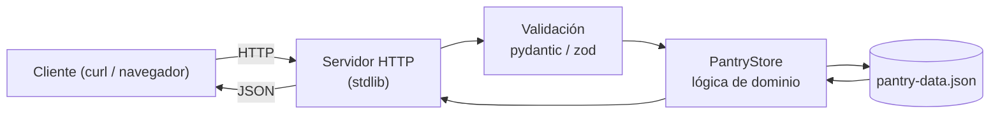
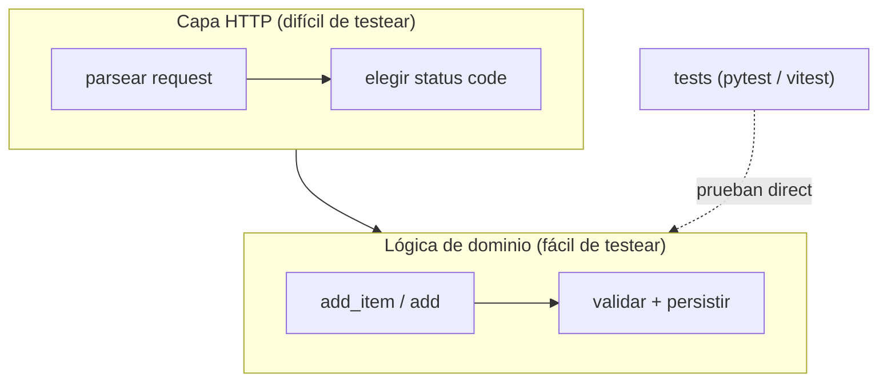

import Reto from "@components/Reto.astro";
import Solucion from "@components/Solucion.astro";
import Quiz from "@components/Quiz.astro";
import CheckDominio from "@components/CheckDominio.astro";
import Nivel from "@components/Nivel.astro";

<Nivel nivel="intermedio" />

Llegaste al final de la Fase 1. Ya no es momento de aprender una pieza nueva: es
momento de **ensamblar todas** en un solo proyecto. Vas a construir **la misma
mini-API dos veces** —una en Python, otra en TypeScript/Node— y al hacerlo vas a
descubrir algo que ningún tutorial te dice: *los lenguajes son distintos, pero el
problema es el mismo*. Esa es la lección que te vuelve bilingüe de verdad.

## Objetivos del capstone

Al cerrar este proyecto sabrás **hacer** esto (no "haber leído sobre ello"):

- **Construir** la misma mini-API REST (un gestor de despensa) en Python y en
  TypeScript/Node, partiendo de **una sola mini-spec compartida**.
- **Validar** los datos de entrada en ambos lenguajes —`pydantic` en Python,
  `zod` en TypeScript— *antes* de persistirlos, para que el dato malo nunca entre.
- **Proteger** la lógica con tests de **aserciones reales** (`pytest` y `vitest`),
  escritos primero y vistos fallar (red) antes de hacerlos pasar (green).
- **Explicar el trade-off**: defender por escrito qué cambió entre la versión
  Python y la TypeScript, y por qué cada lenguaje te empujó a hacerlo así.

:::tip[Por qué importa (relevancia de mercado)]
Un capstone "la misma app, dos lenguajes" es **oro de portafolio bilingüe**. La
mayoría de los candidatos junior muestra proyectos en *un* lenguaje; tú vas a
mostrar que piensas el **problema** por encima de la sintaxis, y que te mueves
entre el ecosistema de IA (Python) y el ecosistema fullstack (TypeScript) sin
fricción. Eso es exactamente lo que separa a quien "sabe un lenguaje" de quien
**hace ingeniería de software**. Y como bonus: cuando una entrevista te pida "haz esto en
el otro lenguaje", ya lo viviste.
:::

## Lo que ya traes (activación de conocimiento previo)

Este proyecto no introduce nada nuevo: **es la suma de la fase**. Antes de
empezar, recupera de memoria —sin abrir las lecciones— qué te dio cada pieza:

- [Python básico → intermedio](/fase-1-lenguajes/1-1-python-basico-intermedio/):
  funciones, estructuras (listas/dicts), módulos. La **lógica** de la despensa
  vive aquí.
- [Type hints + mypy + pydantic](/fase-1-lenguajes/1-4-type-hints-mypy-pydantic/):
  cómo **validar** un dato antes de confiar en él. El corazón de la entrada de la
  API.
- [Archivos, JSON y APIs](/fase-1-lenguajes/1-5-archivos-json-apis/): leer y
  escribir JSON, status codes, manejar errores de red. Tu despensa **persiste** en
  un archivo JSON.
- **Primer test unitario (pytest)** (sub-unidad 1.6): el ciclo red-green que
  protege la lógica. Aquí lo aplicas en serio.
- **JavaScript moderno** y **TypeScript desde cero** (sub-unidades 1.7 y 1.8):
  la **otra mitad** del capstone. `zod` es tu `pydantic` del lado TS.
- **Victoria-IA: primer LLM + mini-CLI** (sub-unidad 1.10): el patrón "valida la
  salida del modelo" que reusarás si decides agregar la *feature* opcional de IA.

:::tip[Si ya programaste antes]
¿Vienes con experiencia en algún backend (Node, .NET, lo que sea)? Este capstone
es tu **atajo de validación**: si puedes diseñar la mini-spec, implementar las dos
versiones con validación y tests, y escribir el write-up de trade-offs sin pedirle
a una IA que decida por ti, dominaste la fase. Si te trabas en `zod` o en el ciclo
red-green de `pytest`, era un falso "ya lo sé": vuelve a esa sub-unidad. La
experiencia previa **acelera**, no exime.
:::

## Qué vas a construir

Una **API de despensa**: la versión mínima del módulo de inventario de HomeHub.
Guarda ítems (`{ id, name, quantity, unit }`) en un archivo JSON y expone cinco
operaciones HTTP. Sin base de datos, sin framework web —eso llega en la
[Fase 3](/fase-3-backend/)—. Aquí usas **solo la librería estándar** de cada
lenguaje, porque el objetivo es **los lenguajes**, no las herramientas.

El **contrato HTTP** (idéntico en ambas versiones) es:

| Método | Ruta | Qué hace | Éxito | Error |
|---|---|---|---|---|
| `GET` | `/health` | ping de vida | `200 {"status":"ok"}` | — |
| `GET` | `/items` | lista todos los ítems | `200 [ ... ]` | — |
| `POST` | `/items` | agrega un ítem (body JSON) | `201 { item }` | `422` si no valida · `400` si el JSON está roto |
| `GET` | `/items/{id}` | un ítem por id | `200 { item }` | `404` si no existe |
| `DELETE` | `/items/{id}` | borra un ítem | `204` (sin cuerpo) | `404` si no existe |

> Que el contrato sea **el mismo** es lo que hace valioso el ejercicio: cuando las
> dos versiones responden igual a `curl`, *demostraste* que entendiste el problema
> por encima del lenguaje.

## Ejemplo resuelto: pensar el mismo endpoint en dos idiomas

Antes de que construyas las cinco rutas, modelemos **una sola** —`POST /items`—
pensando en voz alta. No te doy el código completo (eso es tu trabajo): te doy el
**razonamiento de diseño** que se repite en cada operación.

> **Pienso en voz alta.** El cliente manda un JSON con `name`, `quantity` y
> `unit`. Lo primero que me pregunto **no** es "cómo lo guardo", sino **"¿me puedo
> fiar de esto?"**. La respuesta es no: viene de fuera. Así que el primer paso, en
> los dos lenguajes, es **validar**.
>
> En **Python** eso es un modelo `pydantic`: declaro que `name` es texto no vacío,
> `quantity` un número `> 0`, `unit` texto no vacío. Si el body no cumple,
> `model_validate` lanza `ValidationError` y yo lo traduzco a un `422`. No escribo
> ni un `if` de validación a mano: el tipo *es* la validación.
>
> En **TypeScript** el equivalente es un esquema `zod`: `z.object({ name:
> z.string().min(1), quantity: z.number().positive(), unit: z.string().min(1) })`.
> `.parse(body)` lanza un `ZodError` si algo falla. Mismo mapa mental, otra
> librería. Y `z.infer<typeof Schema>` me regala el **tipo** TypeScript gratis, sin
> repetirlo —el detalle que enamora del ecosistema TS.
>
> Recién **después** de validar pienso en persistir: leo el JSON, calculo el
> próximo `id` (el mayor actual + 1), agrego, escribo. Esa parte es casi idéntica
> palabra por palabra entre los dos lenguajes —`json.loads`/`json.dumps` en Python,
> `JSON.parse`/`JSON.stringify` en TS—. Ahí es donde *sientes* que el problema es
> el mismo.

La pieza clave que aparece en los dos: separar **la lógica de dominio**
(`PantryStore`: agregar, listar, borrar) de **la capa HTTP** (parsear la
petición, elegir el status). Esa separación es lo que hace la lógica
**testeable sin levantar un servidor** —tus tests de `pytest`/`vitest` prueban el
`PantryStore` directo, con un archivo temporal, sin tocar la red—. Es la misma
idea del *seam* de inyección que viste en
[Archivos, JSON y APIs](/fase-1-lenguajes/1-5-archivos-json-apis/).

## Errores que vas a querer evitar (misconceptions)

:::caution[No empieces por el servidor HTTP]
Podrías pensar que lo primero es montar el servidor y "después le pongo la lógica".
Está al revés. El servidor es **plomería**: lo más aburrido y lo menos examinable.
Si arrancas ahí, terminas con un archivo gigante donde validación, persistencia y
HTTP están enredados y **nada** se puede testear. Empieza por el `PantryStore` y
sus tests; el servidor es la última capa, una cáscara delgada que solo traduce
HTTP ↔ funciones.
:::

:::caution[Validar no es escribir `if`s a mano]
Podrías "validar" con `if not name: return error`. Funciona para un campo; se
vuelve un nido de `if`s con tres. El punto de `pydantic`/`zod` es que **declaras
la forma** del dato una vez y la librería valida todo —tipos, vacíos, números
negativos— y te da mensajes de error gratis. Si te encuentras escribiendo
validación campo por campo a mano, estás reimplementando peor lo que ya tienes.
:::

:::caution["Mismo código en los dos" es falso, y "todo distinto" también]
La trampa de novato es esperar que las dos versiones sean idénticas (no lo serán:
`undefined` vs `None`, `ZodError` vs `ValidationError`, el manejo de tipos en
runtime). La trampa opuesta es tratarlas como dos proyectos sin relación. La verdad
está en medio: **la estructura es la misma** (dominio + HTTP + validación +
persistencia), **los detalles del lenguaje cambian**. Tu write-up de trade-offs es
justo donde nombras *cuáles* detalles y *por qué*. Ese documento es lo que un
revisor lee primero.
:::

:::caution[`status_code` no se lanza solo]
Un `404` o un `422` **no** ocurren mágicamente. En la capa HTTP *tú* decides qué
status mandar según lo que devolvió el dominio: si `get_item` devolvió `None` →
`404`; si la validación lanzó → `422`; si el JSON del body está roto → `400`. Olvidar
esto deja una API que responde `200` a todo, incluso cuando falló. Es el error #1 de
quien nunca diseñó una API.
:::

## Plan de construcción (andamiaje que se desvanece)

El capstone es grande; pártelo en pasos con el andamiaje bajando poco a poco. Los
primeros pasos te dicen *qué* test escribir; los últimos te sueltan.

1. **Mini-spec primero (sin código).** Escribe `SPEC.md`: entradas, salidas, casos
   borde (¿qué pasa si `quantity` es `0`? ¿si el id no existe? ¿si el body no es
   JSON?). Esto es el hilo **spec-driven** de la Fase 0 aplicado. *Andamiaje alto:
   el `SPEC.md` del starter ya trae los títulos de sección.*
2. **Python, dominio con TDD.** Abre `python/test_pantry.py` (ya viene escrito y
   **falla**). Implementa `PantryStore` en `python/pantry.py` hasta verlo verde.
   *El test te dice exactamente qué construir.*
3. **Python, capa HTTP.** Completa las rutas en `python/server.py` (las ayudas de
   parseo ya están; tú escribes el ruteo). Levántalo y pégale con `curl`.
4. **TypeScript, dominio con TDD.** Mismo paso 2 pero en `typescript/`. Aquí el
   andamiaje baja: el test viene, pero ya viviste el patrón en Python.
5. **TypeScript, capa HTTP.** Completa `typescript/server.ts`. *Andamiaje mínimo:
   ya sabes qué status va en cada caso.*
6. **Write-up + README en inglés.** Documenta qué cambió entre las dos versiones.
   *Sin andamiaje: es tu análisis.*

Trabaja **Primero-Sin-IA**: el capstone consolida lo que ya practicaste, así que va
sin IA de entrada. Usa la IA *al final*, para que **revise** tu código y tu
write-up —nunca para que decida la estructura por ti—.

## El capstone

<Reto title="La misma app, dos lenguajes: API de despensa" timebox="45 min por sesión (proyecto multi-sesión, ~6–10 h en total)">

Construye la API de despensa descrita arriba **dos veces** —Python y
TypeScript/Node— en `ejercicios/fase-1/capstone-misma-app-dos-lenguajes/`. El
starter trae la estructura, los tests (que fallan) y las plantillas de
documentación. Sigue el plan de construcción de seis pasos.

**El contrato HTTP a cumplir** está en `CONTRATO-HTTP.md` (es el mismo para ambas
versiones). El modelo de un ítem es `{ id: int, name: str≠"", quantity: number>0,
unit: str≠"" }`.

**Hecho significa** (mapeado al [Definition of Done de la fase](/fase-1-lenguajes/#definition-of-done-la-vara-del-capstone)):

1. **Mini-spec + decisiones.** `SPEC.md` completado (entradas/salidas/casos borde)
   y `DECISIONES.md` con al menos **dos** mini-ADRs (p. ej. "por qué un archivo
   JSON y no SQLite", "por qué `pydantic`/`zod` y no validación a mano").
2. **Las dos versiones corren y cumplen el contrato.** `curl` a cada ruta devuelve
   el status y el cuerpo de la tabla, en **ambas** versiones.
3. **Tests verdes con aserciones reales.** `pytest` y `vitest` pasan; cada suite
   tiene al menos los tests del starter **más uno tuyo** (un caso borde que se te
   ocurra). Nada de "coverage %": aserciones que prueban comportamiento.
4. **Validación real.** Un `POST /items` con `quantity: 0` o `name: ""` devuelve
   `422` en las dos versiones, y el dato malo **no** se persiste.
5. **README en inglés** que explique qué es, cómo se corre cada versión y un
   **write-up de trade-offs**: 5–8 frases sobre qué cambió entre Python y TS.
6. **Conventional Commits** en todo el historial (`feat:`, `test:`, `docs:`…).

**Opcional (victoria-IA, si hiciste la 1.10):** agrega una ruta
`POST /items/suggest` que reciba `{ "dish": "..." }`, le pida a un LLM qué
ingredientes faltan, **valide la respuesta** con `pydantic`/`zod` antes de usarla,
y registre **tokens y costo** del request. Es la semilla del hilo costo/latencia.

**Criterios de evaluación** (cómo te corrige la IA, ver más abajo): corrección del
contrato · calidad de los tests (aserciones, no mocks de más) · validación
declarativa (no `if`s a mano) · separación dominio/HTTP · claridad del write-up de
trade-offs.

</Reto>

<Solucion title="Pista de arranque (ábrela solo si te trabas al empezar, NO es la solución)">

No intentes las dos versiones en paralelo: **termina Python completo primero**
(dominio + tests verdes + HTTP + `curl`), y recién entonces espeja en TypeScript.
Tener la versión Python funcionando te da un **oráculo**: cuando dudes "¿qué debería
devolver TS aquí?", lo corres en Python y miras.

Para el dominio, el orden que evita enredos: (1) leer el archivo JSON a una lista,
(2) operar sobre la lista en memoria, (3) escribirla de vuelta. El `id` nuevo es
`max(ids existentes, default 0) + 1`. Para la capa HTTP, una sola idea: la ruta
solo **traduce** —parsea el id o el body, llama al método del `PantryStore`, y
elige el status según lo que devolvió—. Si una rama de tu `do_POST`/`createServer`
tiene lógica de negocio, está en el lugar equivocado.

No mires la solución de referencia hasta haber cerrado tu intento de verdad. El
valor del capstone está en *pelearlo*, no en *leerlo*.

</Solucion>

## Check de dominio

<CheckDominio
  title="Antes de dar el capstone por cerrado, ¿puedes…?"
  items={[
    "Explicar por qué empezaste por el PantryStore y sus tests, y no por el servidor HTTP",
    "Decir qué status devuelve POST /items con quantity 0, y dónde en tu código se decide ese status",
    "Mostrar el modelo de datos en pydantic y en zod, y señalar tres diferencias concretas entre ambos",
    "Escribir, sin notas, un test de pytest que verifique que un id inexistente devuelve None",
    "Defender en dos frases por qué validas con pydantic/zod en vez de con ifs escritos a mano",
  ]}
/>

<Quiz
  question="En la versión Python, un POST /items con quantity 0 (y name y unit válidos) debe devolver 422. ¿Dónde se origina ese 422?"
  options={[
    "El servidor HTTP revisa quantity con un if y devuelve 422 a mano",
    "pydantic lanza ValidationError al validar el body, y la capa HTTP traduce esa excepción a 422",
    "El archivo JSON rechaza el dato al escribirlo",
    "Python devuelve 422 automáticamente cuando un número es 0",
  ]}
  answer={1}
  explanation="La validación vive en el modelo pydantic (quantity > 0). model_validate lanza ValidationError; la capa HTTP atrapa esa excepción y la mapea al status 422. El dato malo nunca llega a persistirse. Ningún status se manda 'solo': siempre lo decides tú a partir de lo que devolvió el dominio."
/>

## Recursos

Prefiere **documentación oficial** sobre tutoriales sueltos.

- [`http.server` — Python (oficial)](https://docs.python.org/3/library/http.server.html) — el servidor HTTP de la stdlib que usarás.
- [`node:http` `createServer` — Node.js (oficial)](https://nodejs.org/api/http.html#httpcreateserveroptions-requestlistener) — el equivalente en Node.
- [pydantic — validación (oficial)](https://docs.pydantic.dev/latest/concepts/models/) — modelos y `model_validate`/`model_dump`.
- [zod (oficial)](https://zod.dev/) — esquemas, `.parse`/`.safeParse`, `z.infer`.
- [pytest (oficial)](https://docs.pytest.org/) — fixtures como `tmp_path` para tests con archivos.
- [Vitest (oficial)](https://vitest.dev/) — el runner de tests para la versión TS.
- [tsx](https://tsx.is/) — correr TypeScript directo sin compilar (`npx tsx server.ts`).

## Conexión con lo que viene

Este capstone **no se tira**: es el insumo del
[Capstone de la Fase 2](/fase-2-ingenieria/). Allí tomarás esta misma app y le
aplicarás SOLID, una suite de tests completa con **mutation testing** (no
"coverage %"), y un `ARQUITECTURA.md` con ADRs. Por eso aquí ya separaste dominio
y HTTP: esa frontera es lo que la Fase 2 va a refactorizar y endurecer. Cuanto más
limpia la dejes ahora, menos dolor después. Es el [currículo en espiral](/empezar/)
del curso: el mismo proyecto, cada vez más profesional.

## Reflexión + repaso

:::note[Para tu RETROSPECTIVA.md]
Responde honesto, en dos o tres frases cada una: (1) ¿Cuál de las dos versiones te
salió más natural, y qué dice eso de cómo *piensas* el código? (2) ¿Qué diferencia
entre Python y TypeScript te sorprendió al construir lo mismo dos veces? (3) La
pregunta del método: ¿cuántas veces abriste la IA *antes* de intentarlo tú? Esa es
la métrica real de si recuperaste la autonomía.
:::

**Gancho de repaso (spaced repetition):** **mañana**, sin abrir tu código,
reescribe de memoria el modelo de datos del ítem en `pydantic` *y* en `zod`, y la
tabla de los cinco endpoints con sus status. Si te falta alguno, ahí está tu
próximo repaso. **A la semana**, levanta una de las dos versiones y pégale con
`curl` desde cero: si recuerdas cómo correrla sin mirar el README, lo aprendiste.
Si no, no era memoria: era el archivo abierto al lado.

> [!tip] GLaDOS dice
> Construir lo mismo dos veces suena redundante. No lo es: la primera vez aprendes
> el problema, la segunda aprendes el lenguaje. La gente que solo lo hace una vez
> nunca sabe cuál de las dos cosas entendió. Tú vas a saberlo.
