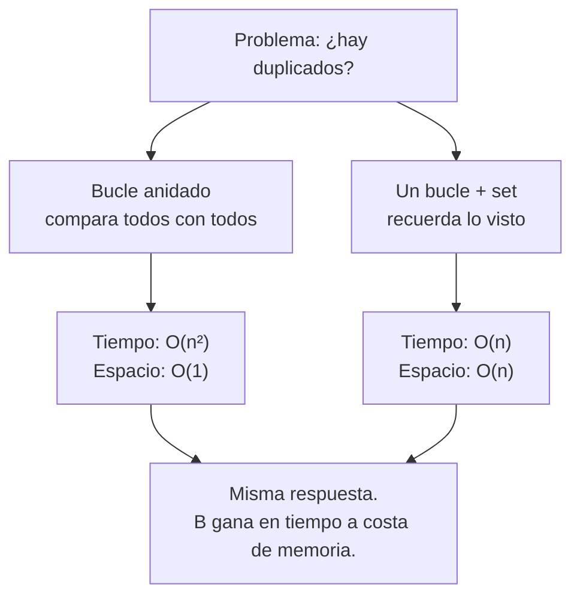

import Reto from "@components/Reto.astro";
import Solucion from "@components/Solucion.astro";
import Quiz from "@components/Quiz.astro";
import CheckDominio from "@components/CheckDominio.astro";
import Nivel from "@components/Nivel.astro";

<Nivel nivel="intermedio" />

Hay un momento que se repite en cada entrevista técnica seria: te dan un problema, escribes un primer intento con dos bucles anidados, funciona con la lista de ejemplo, y el entrevistador pregunta —en tono amable— *"¿y si la lista tuviera un millón de elementos?"*. Si no sabes responder, no es que falles el problema: fallas la conversación que el problema era una excusa para tener. Esta lección te enseña a tener esa conversación.

No vienes a memorizar 300 problemas de leetcode ni a implementar tu propio quicksort. Vienes a algo más útil y más permanente: **mirar un fragmento de código y saber, por intuición, cuánto se va a poner de lento cuando la entrada crezca** (eso es Big-O), y **elegir la estructura de datos correcta** para que no se ponga lento en primer lugar. Esas dos habilidades son las que separan al que escribe el bucle anidado que tumba el endpoint en producción del que, sin pensarlo mucho, usa un `dict` y resuelve lo mismo cien veces más rápido.

:::tip[Si ya tocaste esto antes]
¿Ya sabes qué es Big-O y cuándo usar un hashmap? No te saltes la lección: úsala como **diagnóstico**. Salta a los **tres ejercicios Primero-Sin-IA** (sección 7) y resuélvelos a mano. El primero mide si de verdad ves el salto de O(n²) a O(n) con un set; el segundo, si reconoces un problema de **stack** cuando lo tienes enfrente; el tercero, si puedes *defender* una complejidad en voz alta —que es lo que mide el live coding, no si te la sabes—. Si los cierras limpio en el timebox, valida con el check de dominio (sección 8) y avanza. Si te trabas en justificar el *por qué*, vuelve a la sección 4.
:::

## 1. Qué vas a saber hacer

Al terminar, sin IA y sin notas, podrás:

- **O1 — Estimar** la complejidad **Big-O** (tiempo y espacio) de un fragmento de código por intuición, identificando el **patrón dominante** (paso fijo, un bucle, bucle anidado, división por mitades, lookup en hashmap) y descartando constantes y términos menores.
- **O2 — Elegir** la estructura de datos correcta para un problema —`array`/lista, hashmap/`dict`, stack, queue— según las operaciones que domina, y **explicar el trade-off** (p. ej. por qué un `dict` da lookup O(1) a cambio de memoria, y cuándo eso vale la pena).
- **O3 — Implementar** sin IA la solución a un problema tipo entrevista (detectar duplicados, two-sum, paréntesis balanceados) y **justificar** por qué pasaste de O(n²) a O(n), defendiéndolo en voz alta como lo harías frente a un entrevistador.

## 2. Por qué importa (el dinero está aquí)

> 💰 **Por qué importa:** el *DSA screen* (esa ronda de "resuelve este problema mientras te miro") sigue siendo el filtro #1 para entrar a roles bien pagados, y en 2026 las empresas lo blindaron contra el copy-paste de IA: cámara encendida, razonamiento en voz alta, sin asistente. **Saber explicar tu propia complejidad es, hoy, una ventaja de mercado real** —más que nunca, porque es exactamente lo que la IA no puede hacer por ti en esa sala—. No se trata de recitar la tabla de complejidades: se trata de mirar *tu* código y decir "esto es O(n²), y aquí está el `dict` que lo baja a O(n)".

Pero el filtro de entrevista es lo *menos* importante. Big-O es la herramienta con la que un semi-senior **justifica decisiones de diseño todos los días**:

1. **Es el lenguaje del costo y la latencia.** Un bucle anidado sobre datos del usuario es O(n²): con 100 elementos hace 10.000 operaciones, con 10.000 hace 100 *millones*. Eso es un endpoint que responde en 8 segundos y un cliente que se va. En la Fase 3 le pondrás nombre a la versión de base de datos de este mismo error —el **problema N+1**—; es el mismo bucle anidado, disfrazado.
2. **Es cómo eliges una estructura sin adivinar.** "¿Lista o `set`?" no es cuestión de gusto: es O(n) vs O(1) por consulta. Multiplica eso por las veces que consultas y tienes la respuesta. Un semi-senior no debate, *calcula*.
3. **Es un asunto de seguridad.** Un algoritmo O(n²) sobre una entrada que **controla un atacante** es un vector de denegación de servicio (un *algorithmic complexity attack*): el atacante manda la entrada peor-caso y tu servicio se cae solo. Reconocer la complejidad de tu código es el primer paso para no exponerlo.

Honestidad: para *casi todo* tu trabajo diario no implementarás algoritmos desde cero —usarás el `sorted()` de Python, el `dict`, la librería—. Lo que harás constantemente es **elegir** entre opciones y **defender** la elección. Para eso es esta lección.

## 3. Lo que ya traes (actívalo)

Esta sub-unidad no introduce sintaxis nueva: reordena lo que ya sabes alrededor de una pregunta nueva ("¿cuánto cuesta?"). Reúsalo:

- De [`0.2` Pensamiento computacional](/fase-0-fundamentos/) y [`0.3` Notional machine + trazado](/fase-0-fundamentos/0-3-notional-machine-trazado/): la habilidad de **trazar un bucle a mano**. Big-O es trazar el bucle pero *contando* en vez de simular: ¿cuántas vueltas da en función del tamaño?
- De [`0.7` Fundamentos de programación](/fase-0-fundamentos/0-7-fundamentos-programacion/): **listas, diccionarios (`dict`), conjuntos (`set`) y tuplas**. Hoy aprendes *cuándo* cada una, no solo *cómo*.
- De [`1.1` Python básico→intermedio](/fase-1-lenguajes/1-1-python-basico-intermedio/): comprehensions, `in`, indexación. Ya las usas; hoy verás cuáles son O(1) y cuáles O(n).
- De [`1.6` Primer test con pytest](/fase-1-lenguajes/1-6-primer-test-pytest/): el ciclo **red-green-refactor**. Los ejercicios de hoy se entregan con tests verdes: el test te dice que tu versión *rápida* sigue siendo *correcta*.

Antes de seguir, responde de memoria:

<Quiz
  question="Tienes una lista de 1.000.000 de nombres y necesitas comprobar muchas veces si un nombre está en ella. ¿Qué estructura hace la comprobación `nombre in coleccion` drásticamente más rápida?"
  options={[
    "Una lista (list): recorre los elementos hasta encontrarlo",
    "Un conjunto (set) o las claves de un dict: comprueban la pertenencia sin recorrer todo",
    "Da igual, en Python `in` siempre cuesta lo mismo",
  ]}
  answer={1}
  explanation="`x in lista` recorre la lista de principio a fin en el peor caso: O(n). `x in set` (o `x in dict`) usa una tabla hash que va directo al lugar donde el elemento debería estar: O(1) amortizado. Con un millón de elementos consultados muchas veces, esa diferencia es la lección central de hoy."
/>

## 4. Ejemplo resuelto, pensado en voz alta

Voy a resolver un problema clásico de entrevista —**¿esta lista tiene elementos duplicados?**— de dos formas, y a *medir* ambas como lo haría en voz alta frente a un entrevistador. **No leas esto como un resultado: léelo como me oirías razonar.** El razonamiento es el producto; el código es la prueba.

### 4.1 Primer intento: el bucle anidado (y por qué es O(n²))

Lo más directo: comparar cada elemento con todos los que vienen después.

```python
def tiene_duplicados(nums):
    n = len(nums)
    for i in range(n):
        for j in range(i + 1, n):
            if nums[i] == nums[j]:
                return True
    return False
```

Razono en voz alta: *"Funciona. Ahora, ¿cuánto cuesta? Cuento las comparaciones en el **peor caso** (sin duplicados, recorre todo). El primer elemento se compara con los `n-1` siguientes; el segundo, con `n-2`; y así. La suma es `(n-1) + (n-2) + ... + 1`, que es `n(n-1)/2`. Eso es `n²/2 - n/2`."*

Aquí viene el corazón de Big-O —y es **intuición, no fórmula**—:

- *"Para entradas grandes, ¿qué término manda? `n²/2` aplasta a `n/2`: si `n` es 10.000, `n²/2` es 50 millones y `n/2` es 5.000. El segundo término es ruido. **Me quedo solo con el que crece más rápido.**"*
- *"¿Y el `/2`? Es una constante. Big-O describe **la forma en que crece** el costo, no el número exacto. Doblar la entrada cuadruplica el trabajo, tenga o no el `/2`. **Las constantes se ignoran.**"*

Tachando el término menor y la constante, `n²/2 - n/2` se convierte en **O(n²)**. Léelo "orden de n al cuadrado". Lo que dice: *si doblas la entrada, el trabajo se multiplica por cuatro.* Tabla mental:

| Tamaño `n` | Operaciones (≈ n²) | Qué se siente |
|---|---|---|
| 10 | 100 | instantáneo |
| 1.000 | 1.000.000 | aún rápido |
| 100.000 | 10.000.000.000 | tu servidor llora |

### 4.2 Segundo intento: cambiar tiempo por memoria (y por qué es O(n))

Razono: *"El bucle anidado vuelve a mirar elementos que ya vi. ¿Y si **recuerdo** lo que ya vi, en una estructura donde preguntar '¿lo vi?' sea instantáneo? Esa estructura es el `set` (conjunto): comprobar pertenencia es O(1) amortizado porque por dentro usa una **tabla hash** —calcula una posición a partir del valor y va directo, sin recorrer—."*

```python
def tiene_duplicados(nums):
    vistos = set()
    for x in nums:
        if x in vistos:      # O(1) amortizado, no recorre
            return True
        vistos.add(x)        # O(1) amortizado
    return False
```

*"Ahora cuento: **un solo bucle** sobre `n` elementos, y dentro cada operación es O(1). `n` por una constante es **O(n)** —orden lineal: doblar la entrada dobla el trabajo, no lo cuadruplica."*

¿El precio? *"El `set` ocupa memoria: en el peor caso guarda los `n` elementos. Eso es **O(n) de espacio**. La versión anterior usaba O(1) de espacio (un par de índices). Acabo de hacer el trade-off más importante de toda la estructura de datos: **gasté memoria para ganar tiempo.**"* Esto se llama *space–time trade-off*, y reconocerlo es media lección de DSA.



> Esta es **la** jugada que el entrevistador quiere ver: dar la versión obvia, medirla, y mejorarla con la estructura correcta explicando qué ganas y qué pagas. El código es de diez líneas; lo que se evalúa es que dijiste "O(n²)", "tabla hash", "O(1) amortizado" y "trade-off de memoria".

### 4.3 El otro patrón que debes reconocer: dividir por mitades → O(log n)

Hay un patrón más que vale oro: **descartar la mitad del problema en cada paso**. El ejemplo canónico es la **búsqueda binaria** en una lista *ya ordenada*.

```python
def busqueda_binaria(ordenada, objetivo):
    lo, hi = 0, len(ordenada) - 1
    while lo <= hi:
        medio = (lo + hi) // 2
        if ordenada[medio] == objetivo:
            return medio
        if ordenada[medio] < objetivo:
            lo = medio + 1        # descarto la mitad de abajo
        else:
            hi = medio - 1        # descarto la mitad de arriba
    return -1
```

Razono: *"En cada vuelta miro el elemento del medio y **tiro la mitad** de los candidatos. ¿Cuántas veces puedo partir `n` por la mitad hasta quedarme con uno? Eso es `log₂(n)`. La intuición que importa: un millón de elementos se resuelve en ~20 pasos; mil millones, en ~30. **El logaritmo es casi plano** —por eso O(log n) es una de las mejores complejidades que existen."*

| Tamaño `n` | Búsqueda lineal (O(n)) | Búsqueda binaria (O(log n)) |
|---|---|---|
| 1.000 | hasta 1.000 pasos | ~10 pasos |
| 1.000.000 | hasta 1.000.000 pasos | ~20 pasos |

La condición innegociable: la lista **debe estar ordenada**. Por eso aparece la jugada de semi-senior: si vas a buscar muchas veces, **ordena una vez** (O(n log n)) y después haz búsquedas binarias (O(log n) cada una). Eso vence por lejos a escanear linealmente cada vez.

### 4.4 Tu chuleta de patrones (la que de verdad usarás)

No memorices una tabla de 30 algoritmos. Memoriza **cómo se ve cada patrón en el código**:

| Si en el código ves… | El costo suele ser | Nombre |
|---|---|---|
| Pasos fijos, sin bucle que dependa de `n` | O(1) | constante |
| **Partir el problema a la mitad** cada vez | O(log n) | logarítmico |
| **Un** bucle sobre los `n` datos | O(n) | lineal |
| Ordenar; o un bucle que en cada paso hace trabajo log | O(n log n) | "linealítmico" |
| **Bucle anidado** sobre los mismos `n` datos | O(n²) | cuadrático |
| Lookup / inserción en `dict` o `set` | O(1) amortizado | hash |
| `x in lista` | O(n) | escaneo lineal |

Ordenadas de mejor a peor (para entradas grandes):

```text
O(1)  <  O(log n)  <  O(n)  <  O(n log n)  <  O(n²)  <  O(2ⁿ)
mejor  ───────────────────────────────────────────────▶  peor
```

## 5. Errores que vas a tener (y por qué)

:::caution[Podrías pensar que Big-O mide segundos]
No mide tiempo, mide **crecimiento**. O(n²) no dice "tarda 2 segundos"; dice "si doblas la entrada, el trabajo se cuadruplica". Un algoritmo O(n²) con `n=5` puede ser más rápido en un reloj real que uno O(n) con mil millones de elementos. Big-O es una afirmación sobre la **forma de la curva** cuando `n` se hace grande, no sobre un cronómetro. Por eso se ignoran constantes: describen el "cuánto" puntual, no la forma.
:::

:::caution[Podrías pensar que O(n²) siempre es peor que O(n)]
Para `n` chico, no necesariamente. Big-O es **asintótico**: describe qué pasa cuando `n` tiende a grande. Para `n=10`, un O(n²) con constante pequeña puede ganarle a un O(n) con constante grande (o que monta un `set` con su overhead). La regla práctica: para datos pequeños y acotados, no te obsesiones; el O(n²) puede ser más simple y suficiente. La complejidad importa cuando la entrada **puede crecer** —y especialmente cuando la controla un usuario o un atacante.
:::

:::caution[Podrías pensar que saberte la tabla de complejidades es saber DSA]
Recitar "búsqueda binaria es O(log n)" no sirve si no reconoces el patrón en *tu* código. La habilidad real es la inversa: miras un fragmento que escribiste, ves el bucle anidado, y dices "esto es O(n²), y este `set` lo baja a O(n)". El examen no es "¿cuál es la complejidad de heapsort?"; es "mira tu propia solución y dime su complejidad y cómo mejorarla". Practica analizando código, no leyendo tablas.
:::

:::caution[Podrías pensar que una linked list es más rápida que un array]
Es el mito más persistente. Una **lista enlazada** (nodos con un puntero al siguiente) inserta/borra en O(1) *si ya estás parado en el nodo*, pero **encontrar** ese nodo cuesta O(n), y acceder al elemento `k` también O(n) (no hay índice: hay que caminar). Un **array** (la `list` de Python por dentro) accede al elemento `k` en O(1) y, por estar contiguo en memoria, aprovecha la *caché* del procesador —que en la práctica lo hace volar—. En el 95% de los casos, el array gana. La linked list importa como **noción** (es la base de la `deque` y de las colas) y como vocabulario de entrevista, no como tu estructura por defecto.
:::

:::caution[Podrías pensar que debes implementar tu propio sort en producción]
Casi nunca. El `sorted()` y el `list.sort()` de Python usan **Timsort**, un algoritmo O(n log n) afinado por expertos durante años. Tu `bubble_sort` casero es O(n²) y más buggy. Saber de sorting sirve para **elegir y razonar** (saber que ordenar cuesta O(n log n), que no se puede bajar de ahí con comparaciones, que ordenar-una-vez habilita búsqueda binaria), no para reinventarlo. En entrevista quizás te pidan implementarlo para ver si entiendes el mecanismo; en el trabajo, usas la librería.
:::

:::caution[Podrías pensar que `lista.pop(0)` y `lista.append()` cuestan lo mismo]
Trampa clásica al hacer una **cola (queue)**. `lista.append(x)` y `lista.pop()` (por el final) son O(1). Pero `lista.pop(0)` —sacar por el **principio**— es **O(n)**: Python tiene que desplazar todos los demás elementos un lugar a la izquierda. Si haces una cola FIFO con `list` y `pop(0)`, acabas de meter un O(n) escondido en cada operación. La estructura correcta para una cola es `collections.deque`, cuyo `popleft()` sí es O(1). Lo verás en la sección 6.
:::

## 6. Las estructuras, en una pasada (con su costo)

Ya viste array, hashmap y la idea de la linked list. Cierro el set mínimo que un semi-senior reconoce al vuelo. La regla: **elige la estructura por la operación que más repites**.

### 6.1 Array / lista — acceso por índice
La `list` de Python. Acceso por índice `lista[k]`: **O(1)**. Recorrer: O(n). Buscar un valor (`x in lista`): **O(n)**. Insertar/borrar al final: O(1); al principio o en medio: O(n) (desplaza). Tu estructura por defecto cuando importa el **orden** y el **acceso por posición**.

### 6.2 Hashmap (`dict`) y `set` — pertenencia y conteo instantáneos
Lookup, inserción y borrado por clave: **O(1) amortizado**. El `set` es un `dict` sin valores: sirve para "¿está esto?" y para deduplicar. Tu estructura por defecto cuando preguntas **"¿existe / cuántas veces / qué hay asociado a esta clave?"**. Es la que convierte O(n²) en O(n), como en el ejemplo resuelto.

### 6.3 Stack (LIFO) — lo último que entra, sale primero
Una pila. En Python: una `list` con `append()` (apilar) y `pop()` (desapilar), ambos O(1). Lo reconoces cuando el problema tiene **anidamiento o "deshacer"**: paréntesis balanceados, botón *undo*, la propia pila de llamadas de tu programa, recorrer un árbol en profundidad (DFS). Si piensas "necesito recordar dónde estaba para volver", es un stack.

### 6.4 Queue (FIFO) — lo primero que entra, sale primero
Una cola. En Python, **`collections.deque`** con `append()` (encolar) y `popleft()` (desencolar), ambos O(1). **No uses `list.pop(0)`** (es O(n), ver el caution de arriba). La reconoces en **procesamiento por orden de llegada**: una cola de tareas, recorrer un árbol/grafo por niveles (BFS), un buffer de mensajes.

```python
from collections import deque

cola = deque()
cola.append("tarea-1")     # encolar al final   — O(1)
cola.append("tarea-2")
primera = cola.popleft()   # desencolar al frente — O(1)  -> "tarea-1"
```

### 6.5 Árboles y grafos — solo nociones (por ahora)
- **Árbol:** datos jerárquicos —un nodo raíz, hijos, sin ciclos—. Ya los usas sin saberlo: el sistema de archivos, el DOM de una página, un JSON anidado, el AST que parsea tu código. Un *árbol binario de búsqueda* balanceado da búsqueda en O(log n). Recorrerlo: **DFS** (con stack/recursión) o **BFS** (con queue).
- **Grafo:** nodos conectados por aristas, con posibles ciclos —modela redes: amigos en una red social, dependencias entre tareas, rutas en un mapa—. Se representa con una *lista de adyacencia* (un `dict` de nodo → lista de vecinos). Se recorre con BFS o DFS.

A nivel de trabajo te basta con **reconocerlos y nombrarlos**: "esto es un problema de grafo", "esto es un recorrido en anchura". La implementación profunda es profundización; el reconocimiento es ruta crítica.

## 7. Ejercicios Primero-Sin-IA

Tres ejercicios, de menos a más razonamiento. **Resuélvelos a mano, sin IA, dentro del timebox.** Estos son los primeros de tu **piso de ~15–20 problemas tipo entrevista** que irás resolviendo *interleaved* (intercalados) a lo largo de todo el curso —no en un atracón—. Lleva un registro: un `dsa-log.md` donde por cada problema anotas el patrón y la complejidad. Repartir la práctica en el tiempo (spacing) fija el músculo mucho mejor que un maratón.

<Reto title="De O(n²) a O(n): two-sum con hashmap" timebox="30–40 min">

Implementa `tiene_dos_que_suman(nums, objetivo)`: devuelve `True` si **dos elementos en posiciones distintas** suman exactamente `objetivo`, y `False` si no.

La disciplina (no la saltes):
1. Primero escribe la versión **obvia** con bucle anidado y convéncete de que es correcta. Anota su Big-O.
2. Después, **sin IA**, encuentra la versión O(n) usando un `set`: por cada `x`, pregúntate si ya viste su *complemento* (`objetivo - x`).
3. Entrega solo la versión O(n) en `solucion.py`, con tu suite en `test_solucion.py`.

Casos que tu solución debe respetar (tradúcelos a tests **antes** de codear, red-green-refactor):
- `[2, 7, 11, 15]`, objetivo `9` → `True` (2 + 7).
- `[3, 3]`, objetivo `6` → `True` (las dos posiciones, aunque el valor se repita).
- `[1]`, objetivo `2` → `False` (hace falta **dos** posiciones; un solo 1 no cuenta).
- `[]`, objetivo `0` → `False`.
- `[1, 5, 9]`, objetivo `8` → `False`.

Entregable: `ejercicios/fase-2/dsa-dedup-hashmap/` — tu `solucion.py`, tu `test_solucion.py`, y un `NOTAS.md` de 4–6 líneas con la Big-O de **ambas** versiones (tiempo y espacio) y por qué el `set` baja el tiempo.

**Hecho significa:**
- [ ] Tu función pasa todos los casos de arriba más al menos un caso borde tuyo.
- [ ] La versión entregada es **O(n) en tiempo** (un solo bucle, lookups en `set`).
- [ ] En `NOTAS.md` justificas el trade-off: ganaste tiempo (O(n²)→O(n)) a costa de espacio (O(1)→O(n)).
- [ ] Puedes explicar **sin notas**, en voz alta, por qué el `set` hace el lookup en O(1).

Enunciado completo y starter: `ejercicios/fase-2/dsa-dedup-hashmap/` (carpeta del repo).

<Solucion title="Pista (ábrela solo si superaste el timebox)">
No compares pares: recorre una vez. Mantén un `set` llamado `vistos`. Para cada `x`, antes de agregarlo, pregunta `if (objetivo - x) in vistos: return True`. Si el complemento todavía no apareció, agrega `x` a `vistos` y sigue. El orden importa: pregunta **antes** de agregar, así no emparejas un elemento consigo mismo. Comprueba a mano que `[3, 3]` con objetivo `6` da `True` con este orden. Es una pista, no la solución.
</Solucion>

</Reto>

<Reto title="Reconoce el stack: paréntesis balanceados" timebox="30–40 min">

Implementa `parentesis_balanceados(s)`: devuelve `True` si los símbolos `()`, `[]` y `{}` en el string `s` están **balanceados y correctamente anidados**, y `False` si no. Cualquier otro carácter se ignora.

La parte que se evalúa no es el código: es que **reconozcas que esto es un problema de stack**. Pregúntate por qué `([)]` está mal aunque tenga el mismo número de cada símbolo —y verás por qué necesitas recordar *en qué orden* se abrieron.

Casos:
- `"()"` → `True` · `"([])"` → `True` · `"{[()]}"` → `True`
- `"([)]"` → `False` (cierre cruzado) · `"("` → `False` · `")"` → `False`
- `""` → `True` · `"a(b)c"` → `True`

Entregable: `ejercicios/fase-2/dsa-stack-parentesis/` — tu `solucion.py`, tu `test_solucion.py`, y una línea en `NOTAS.md` con la complejidad (tiempo y espacio) y **por qué** un stack es la estructura correcta.

**Hecho significa:**
- [ ] Pasa todos los casos más uno borde tuyo (sugerencia: anidamiento profundo, o solo caracteres no-paréntesis).
- [ ] Usas una `list` como stack (`append`/`pop`), no índices ni cuentas separadas por tipo.
- [ ] Manejas el caso de un cierre cuando el stack está vacío (no revientes con `IndexError`).
- [ ] Puedes explicar **sin notas** por qué `([)]` exige un stack y no basta con contar símbolos.

Enunciado completo y starter: `ejercicios/fase-2/dsa-stack-parentesis/` (carpeta del repo).

<Solucion title="Pista (ábrela solo si superaste el timebox)">
Recorre `s` carácter a carácter. Si es un símbolo de apertura `([{`, apílalo. Si es de cierre `)]}`, mira la **cima** del stack: si está vacío, o la cima no es el par que abre este cierre, devuelve `False`. Un `dict` `{')': '(', ']': '[', '}': '{'}` te da el par esperado en O(1). Al final, el string está balanceado **solo si el stack quedó vacío** (no quedaron aperturas sin cerrar). Contar símbolos no basta: `([)]` tiene las cuentas correctas pero el orden de cierre es inválido —y eso solo lo ve el stack. Pista, no solución.
</Solucion>

</Reto>

<Reto title="Defiende la complejidad: auditoría Big-O" timebox="25–35 min">

Este es de **razonamiento, a mano** (sin código). Entrena el objetivo O1 directamente: mirar código ajeno y *medirlo*, que es lo que harás en el live coding.

En un archivo `analisis.md`, para **cada uno** de estos cuatro fragmentos, escribe: (a) su complejidad de **tiempo** en Big-O, (b) su complejidad de **espacio**, y (c) una frase nombrando el patrón dominante que te llevó a esa respuesta.

```python
# A
def f(nums):
    total = 0
    for x in nums:
        total += x
    return total

# B
def g(nums):
    pares = []
    for i in range(len(nums)):
        for j in range(len(nums)):
            if nums[i] + nums[j] == 10:
                pares.append((i, j))
    return pares

# C
def h(ordenada, objetivo):     # `ordenada` ya viene ordenada
    lo, hi = 0, len(ordenada) - 1
    while lo <= hi:
        m = (lo + hi) // 2
        if ordenada[m] == objetivo: return m
        if ordenada[m] < objetivo: lo = m + 1
        else: hi = m - 1
    return -1

# D
def k(nums):
    return len(set(nums)) != len(nums)
```

Y al final, **decide y justifica con Big-O**: tienes que comprobar 10.000 veces si un `id` está dentro de una colección de 1.000.000 de elementos. ¿La guardas en una `list` o en un `set`? Da el número aproximado de operaciones de cada opción.

Entregable: `ejercicios/fase-2/dsa-analisis-big-o/analisis.md`.

**Hecho significa:**
- [ ] Diste tiempo **y** espacio para los cuatro fragmentos.
- [ ] Nombraste el patrón dominante de cada uno (no solo la letra O).
- [ ] En la decisión final, justificaste con Big-O y un orden de magnitud, no con "el set es más rápido".
- [ ] Puedes defender cada respuesta en voz alta, como si te preguntaran "¿por qué?".

Enunciado completo: `ejercicios/fase-2/dsa-analisis-big-o/` (carpeta del repo).

<Solucion title="Pista (ábrela solo si superaste el timebox)">
Para cada fragmento, cuenta los bucles y mira de qué dependen. ¿Uno solo sobre `n`? ¿Dos anidados sobre `n`? ¿Se parte algo a la mitad? Para el espacio, pregúntate cuánta memoria *extra* crece con `n` (¿una lista que puede tener `n` o `n²` elementos? ¿un par de variables?). El fragmento D esconde su costo dentro de `set(...)`: ¿cuánto cuesta construir un `set` de `n` elementos, en tiempo y en espacio? Para la decisión final, `list` = O(n) por consulta × 10.000 consultas; `set` = O(1) por consulta × 10.000. Pon los números. Pista, no solución.
</Solucion>

</Reto>

## 8. Check de dominio

Sin mirar la lección, en voz alta o por escrito:

<CheckDominio
  items={[
    "Explicar qué mide Big-O (crecimiento, no segundos) y por qué se ignoran constantes y términos menores.",
    "Mirar un bucle anidado sobre los mismos datos y decir 'esto es O(n²)' sin dudar.",
    "Explicar por qué `x in set` es O(1) amortizado y `x in lista` es O(n).",
    "Reconstruir el trade-off del ejemplo de duplicados: O(n²) espacio O(1) vs O(n) espacio O(n).",
    "Explicar por qué la búsqueda binaria es O(log n) y qué condición exige (lista ordenada).",
    "Decir cuándo usar un stack (anidamiento/undo/DFS) y cuándo una queue (orden de llegada/BFS).",
    "Explicar por qué `list.pop(0)` es O(n) y qué usar en su lugar para una cola.",
    "Dar un ejemplo de cómo un O(n²) sobre entrada de un atacante es un problema de seguridad.",
  ]}
/>

Si marcaste menos de seis, vuelve a la sección correspondiente **antes** de avanzar. No es un examen: es honestidad contigo.

<Quiz
  question="Tu función recorre la lista una vez y, dentro del bucle, por cada elemento hace `if x in otra_lista`. ¿Cuál es la complejidad de tiempo?"
  options={[
    "O(n): es un solo bucle",
    "O(n²): el `in` sobre una lista es O(n), y lo haces n veces",
    "O(log n): el `in` divide la búsqueda por la mitad",
  ]}
  answer={1}
  explanation="El bucle exterior es O(n). Pero `x in otra_lista` recorre `otra_lista` por dentro: O(n). Un O(n) dentro de un O(n) da O(n²) — el bucle anidado está escondido en el `in`. La jugada: convierte `otra_lista` en un `set` una vez (O(n)); entonces `x in conjunto` es O(1) y el total baja a O(n). Este es exactamente el N+1 que verás en la Fase 3, disfrazado."
/>

## 9. Recursos (documentación oficial primero)

- **Costo de las operaciones en Python (oficial):** [wiki.python.org/moin/TimeComplexity](https://wiki.python.org/moin/TimeComplexity) — la tabla canónica: qué cuesta O(1) y qué O(n) en `list`, `dict`, `set` y `deque`. Tenla a mano.
- **`collections.deque` (oficial):** [docs.python.org/3/library/collections.html#collections.deque](https://docs.python.org/3/library/collections.html#collections.deque) — la cola FIFO con `popleft()` O(1).
- **Módulo `bisect` (oficial):** [docs.python.org/3/library/bisect.html](https://docs.python.org/3/library/bisect.html) — búsqueda binaria lista para usar sobre listas ordenadas, sin reinventarla.
- **Sorting HOW TO (oficial):** [docs.python.org/3/howto/sorting.html](https://docs.python.org/3/howto/sorting.html) — `sorted()`, `key`, estabilidad; el O(n log n) que ya tienes gratis.
- **Big-O Cheat Sheet (comunidad):** [bigocheatsheet.com](https://www.bigocheatsheet.com/) — referencia visual de complejidades por estructura. Úsala para *consultar*, no para memorizar.
- **NeetCode — patrones de problemas (comunidad):** [neetcode.io](https://neetcode.io/) — buena fuente de problemas tipo entrevista, agrupados por patrón. Resuélvelos **Primero-Sin-IA**.

## 10. Conexión con el capstone de la fase

El **Capstone F2 — Refactor + suite de tests** te pide tomar código y mejorarlo con SOLID, tests y un `ARQUITECTURA.md` con ADRs. DSA aparece ahí de forma muy concreta:

- Cuando **refactorices**, vas a encontrar el bucle anidado O(n²) o el `x in lista` escondido. Reemplazarlo por un `dict`/`set` es un refactor de rendimiento —y tus **tests verdes** (de [`1.6`](/fase-1-lenguajes/1-6-primer-test-pytest/)) son la red que te confirma que la versión rápida sigue siendo correcta.
- Tu `ARQUITECTURA.md` debe **justificar** las decisiones. "Elegí un `dict` indexado por id en vez de buscar en la lista porque la búsqueda pasa de O(n) a O(1), y este lookup ocurre en cada request" es exactamente el tipo de ADR que un semi-senior escribe. Big-O es el vocabulario de esa justificación.

Más allá del capstone: este hábito de "medir antes de aceptar" recorre todo el curso. En la **Fase 3** el O(n²) reaparece como el **problema N+1** de los ORMs; en la **Fase 6**, elegir un *vector store* y razonar el costo de la búsqueda semántica es esta misma intuición aplicada a embeddings. Lo que aprendiste hoy no se recicla: se acumula.

## 11. Reflexión y repaso espaciado

Cierra escribiendo dos o tres frases respondiendo: **¿en qué parte de tu propio código (de la Fase 1) escondiste, sin darte cuenta, un O(n²) o un `x in lista` caro?** Buscarlo a propósito —"¿dónde está mi bucle anidado?"— es el reflejo que esta lección quiere instalarte.

Gancho de **spaced repetition**:

- **Mañana:** reescribe de memoria, sin mirar, la versión O(n) de `tiene_duplicados` y explica en una frase por qué es O(n) y no O(n²). Si no puedes, no lo aprendiste todavía.
- **En 3 días:** resuelve un problema nuevo de NeetCode del patrón *hashmap* (p. ej. "group anagrams" o "valid anagram") **Primero-Sin-IA**, y anótalo en tu `dsa-log.md` con su complejidad. Sumas uno a tu piso de 15–20.
- **En 1 semana:** explícale a alguien (o a una grabación) por qué `x in set` es O(1) y `x in lista` es O(n), usando la palabra "tabla hash". Enseñarlo en voz alta es el ensayo exacto del live coding —y de la pregunta "¿y si fueran un millón de elementos?".
