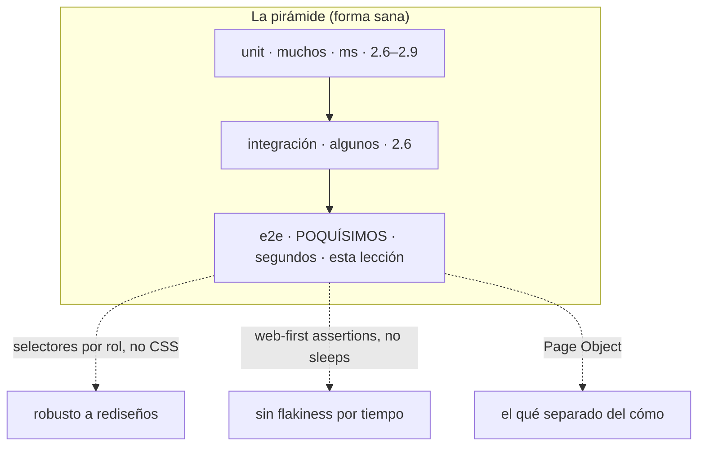

import Reto from "@components/Reto.astro";
import Solucion from "@components/Solucion.astro";
import Quiz from "@components/Quiz.astro";
import CheckDominio from "@components/CheckDominio.astro";
import Nivel from "@components/Nivel.astro";

<Nivel nivel="intermedio" />

:::note[Esta sub-unidad es profundización, no ruta crítica]
Los tests **end-to-end (e2e)** son la punta de la pirámide: poderosos pero caros, así que se usan **poco y solo en lo crítico**. Puedes llegar a semi-senior sin dominar Playwright, pero un solo e2e bien hecho sobre el flujo que de verdad importa —y la sensatez de no llenar el proyecto de ellos— es justo el tipo de juicio que distingue. Esta lección **completa** la pirámide que armaste en [`2.6`](/fase-2-ingenieria/2-6-testing-fundamentos/): te da la base, no la cima entera.
:::

En [`2.6`](/fase-2-ingenieria/2-6-testing-fundamentos/) montaste la **pirámide de testing** y escribiste tus primeros tests unitarios; en [`2.8`](/fase-2-ingenieria/2-8-diseno-de-tests/) aprendiste a diseñarlos; en [`2.9`](/fase-2-ingenieria/2-9-coverage-vs-mutation/) aprendiste a medir si de verdad prueban algo. Todo eso vive **adentro** de tu código: llamas a una función y verificas lo que devuelve. Esta lección sale al mundo real y responde otra pregunta: **¿la aplicación completa, vista por un usuario en un navegador de verdad, hace lo que promete?** Esa es la pregunta del test **end-to-end**, y Playwright es la herramienta estándar de la industria en 2026 para responderla.

El peligro es que los e2e son seductores: parecen "el test definitivo" porque prueban *todo junto*. Esa intuición, llevada al extremo, produce suites lentas, frágiles y odiadas por el equipo. Aprender e2e **de verdad** es aprender tanto a escribir uno robusto como a tener la disciplina de escribir **pocos**.

:::tip[Si ya tocaste Selenium, Cypress o Playwright en tu trabajo]
¿Ya escribiste tests de navegador? Entonces probablemente arrastras dos cicatrices: **selectores CSS que se rompían a cada rato** y **`sleep`/`waitForTimeout` regados para "estabilizar" tests flaky**. Esta lección nombra por qué ambos son antipatrones y te da el reemplazo correcto (selectores por rol + web-first assertions con auto-waiting). Valida saltando a los **ejercicios Primero-Sin-IA** (sección 7): el primero te entrega un e2e flaky lleno de esos vicios para que lo refactorices; el segundo te pide decidir **qué flujos merecen e2e y cuáles no**, y escribir tu política de pirámide. Si los cierras limpio, valida con el check de dominio (sección 8). Si dudas en "¿por qué `getByRole` y no `#id`?", el problema es la sección 4.2.
:::

## 1. Qué vas a saber hacer

Al terminar, sin IA y sin notas, podrás:

- **O1 — Explicar el trade-off** de los tests e2e: por qué van en la **cima** de la pirámide (validan el flujo real del usuario, pero son lentos, caros y frágiles), y **decidir** qué flujo crítico merece un e2e y cuál no (la regla "poco y crítico").
- **O2 — Implementar** un test e2e robusto con Playwright: **selectores por rol/accesibilidad** (`getByRole`, `getByLabel`) en vez de CSS, **web-first assertions** con auto-waiting (sin `sleep`s), y un **Page Object** que separe el *qué* del *cómo*. Todo con **pnpm**.
- **O3 — Depurar** un test e2e flaky: identificar `waitForTimeout`, selectores frágiles y la falta de auto-waiting como causas raíz de la intermitencia, y eliminarlas.

## 2. Por qué importa (el dinero está aquí)

> 💰 **Por qué importa:** "tengo tests" es expectativa semi-senior, pero el mercado está lleno de suites e2e que el equipo **silencia** porque fallan al azar (flaky) y tardan media hora. El candidato que dice *"escribo e2e solo para los 2-3 flujos que dan plata, con selectores por rol y cero sleeps, y dejo el resto a tests unitarios"* demuestra un criterio de pirámide que el 90% no tiene. Es la misma sabiduría que en la Fase 5 te hará instrumentar **trazas** (el `trace viewer` de Playwright es eso mismo) y en la Fase 6 te hará exigir **evals** en vez de "lo probé a mano y funcionó": medir el comportamiento de punta a punta, no la apariencia.

Tres razones hacen de esta sub-unidad un diferenciador:

1. **El e2e es el único test que prueba lo que el usuario realmente vive.** Un unit test verde no garantiza que el botón "Pagar" funcione cuando el frontend, la API y la base de datos se juntan. El e2e abre un navegador de verdad, hace clic de verdad, y verifica el resultado de verdad. Para el flujo que te da ingresos, esa garantía vale oro.
2. **Mal usado, el e2e es el antipatrón más caro de testing.** Una suite e2e lenta y flaky se vuelve ruido: el equipo aprende a ignorar el rojo ("ah, ese test siempre falla"), y el día que el rojo es real, nadie lo ve. Saber **cuántos** e2e escribir es tan importante como saber escribirlos.
3. **Playwright es la respuesta de entrevista correcta en 2026.** "¿Cómo testeas el frontend de punta a punta?" → Playwright, selectores por rol, web-first assertions, Page Objects, pocos y críticos. Esa respuesta, bien dada, te marca como alguien que ya sufrió suites flaky y aprendió.

## 3. Lo que ya traes (actívalo)

Esta lección se para sobre lo anterior. Reúsalo antes de seguir:

- De [`2.6` Testing fundamentos](/fase-2-ingenieria/2-6-testing-fundamentos/): la **pirámide** (muchos unit, algunos integración, **poquísimos** e2e) y por qué su forma importa. Hoy le ponemos la punta.
- De [`2.8` Diseño de tests](/fase-2-ingenieria/2-8-diseno-de-tests/): **Given-When-Given** y los **valores de borde**. Un e2e es un Given-When-Then en grande: *dado* que estoy en login, *cuando* envío credenciales válidas, *entonces* veo el panel.
- De [`1.8` TypeScript desde cero](/fase-1-lenguajes/1-8-typescript-desde-cero/): clases, tipos e `import`. El Page Object es, literalmente, una clase de TS con `Locator`s tipados.

Antes de seguir, responde de memoria:

<Quiz
  question="En la pirámide de testing, ¿por qué los e2e van en la cima (los menos numerosos)?"
  options={[
    "Porque son los más fáciles de escribir, así que se dejan para el final",
    "Porque son los más lentos, caros y frágiles: dan la mayor confianza por test, pero también el mayor costo de mantenimiento, así que se reservan para los pocos flujos críticos",
    "Porque solo sirven para medir el rendimiento de la página, no su comportamiento",
  ]}
  answer={1}
  explanation="La cima de la pirámide es estrecha a propósito: cada e2e cubre mucho (frontend + API + datos) pero corre lento (segundos por test, no milisegundos) y se rompe con cualquier cambio de UI. Esa relación valor/costo dicta 'pocos y críticos'. Invertir la pirámide (muchos e2e, pocos unit) es el antipatrón del 'cono de helado'."
/>

## 4. Ejemplo resuelto, pensado en voz alta

Voy a llevarte de un e2e **frágil y flaky** —el que casi todos escriben primero— a uno **robusto**, paso a paso. **No lo leas como un resultado: léelo como me oirías razonar al lado tuyo.**

El escenario: una app web con un login. El usuario escribe email y contraseña, presiona "Entrar", y aparece su panel con el título "Mi panel". Quiero un e2e que verifique ese flujo crítico.

### 4.1 El primer intento (el que se rompe)

Razono en voz alta: *"Lo más directo: abro la página, lleno los campos, hago clic, espero, y leo el título."* Así sale el primer borrador, con Playwright y su test runner `@playwright/test`:

```ts
// e2e/login.spec.ts — VERSIÓN FRÁGIL (no la copies)
import { test, expect } from '@playwright/test';

test('el usuario inicia sesión', async ({ page }) => {
  await page.goto('http://localhost:3000/login');
  await page.locator('#email').fill('ana@ejemplo.cl');
  await page.locator('#password').fill('secreto123');
  await page.locator('body > div.card > form > button.btn-primary').click();
  await page.waitForTimeout(2000); // "espero a que cargue el panel"
  const titulo = await page.locator('h1').textContent();
  expect(titulo).toBe('Mi panel');
});
```

Razono: *"Funciona... hoy. Pero tiene **tres bombas de tiempo** que lo van a volver flaky o falso. Las desactivo una por una."*

### 4.2 Bomba 1 — selectores acoplados a la implementación

Razono: *"`body > div.card > form > button.btn-primary` es un selector CSS que describe la **estructura del HTML**, no lo que el usuario ve. El día que un diseñador envuelva el botón en otro `<div>` o renombre la clase `btn-primary` a `btn-cta`, el selector deja de encontrar nada y el test falla —aunque el login funcione perfecto—. Lo mismo con `#email`: depende de un `id` que es un detalle interno."*

*"La cura: seleccionar como un humano. Un humano no ve `div.card`; ve un campo etiquetado **Email** y un botón que dice **Entrar**. Playwright expone exactamente eso con los **locators por rol y accesibilidad**:"*

```ts
await page.getByLabel('Email').fill('ana@ejemplo.cl');
await page.getByLabel('Contraseña').fill('secreto123');
await page.getByRole('button', { name: 'Entrar' }).click();
```

> **Vocabulario clave (en inglés, como en la herramienta):**
> - **`getByRole('button', { name: 'Entrar' })`**: busca por el **rol de accesibilidad** (lo que un lector de pantalla anunciaría) y el texto visible. Es el selector recomendado: estable y, de paso, te obliga a tener HTML accesible.
> - **`getByLabel('Email')`**: el input cuyo `<label>` dice "Email". Resistente a cambios de estructura.
> - **`getByText`, `getByPlaceholder`, `getByTestId`**: otros locators "user-facing". `getByTestId` (un atributo `data-testid`) es el escape cuando no hay rol ni texto estable, pero úsalo como último recurso.

*"Beneficio lateral enorme: si `getByRole('button', { name: 'Entrar' })` no encuentra el botón, probablemente tu HTML **no es accesible** (un `<div onclick>` en vez de un `<button>`). El test robusto y la accesibilidad (WCAG, que verás en la Fase 4) empujan en la misma dirección."*

### 4.3 Bomba 2 — el `sleep` disfrazado

Razono: *"`await page.waitForTimeout(2000)` es un **`sleep` de 2 segundos**. Es el peor patrón de e2e y merece una explicación larga porque es el error que más caro sale:"*

- *"**Si 2 s es muy poco** (la red estuvo lenta hoy), el panel aún no cargó cuando leo el `h1` → el test falla sin que haya ningún bug. Eso es **flakiness**: rojo al azar."*
- *"**Si 2 s es de sobra** (casi siempre), pago 2 segundos de espera **por test, en cada corrida**. Multiplica por 50 tests y por 20 corridas al día: minutos tirados a la basura, todos los días."*
- *"No hay número mágico. Cualquier `waitForTimeout` está o muy corto (flaky) o muy largo (lento). Pierdes en ambos casos."*

*"La cura es la idea más importante de Playwright: las **web-first assertions esperan solas**. Cuando escribo `await expect(locator).toBeVisible()`, Playwright **reintenta automáticamente** durante unos segundos hasta que la condición se cumpla, y sigue **apenas** se cumple. Espera lo justo, ni un milisegundo de más, sin que yo adivine cuánto:"*

```ts
await expect(page.getByRole('heading', { name: 'Mi panel' })).toBeVisible();
```

*"Esto reemplaza al `sleep` **y** a la lectura manual del título. Si el panel tarda 200 ms, el test sigue a los 200 ms. Si tarda 1.9 s, espera 1.9 s. Si nunca aparece, falla con un mensaje claro tras el timeout. Cero adivinanza, cero flakiness por tiempo."*

### 4.4 Bomba 3 — leer y luego afirmar (en vez de afirmar directo)

Razono: *"`const titulo = await page.locator('h1').textContent(); expect(titulo).toBe(...)` toma una **foto instantánea** del texto en ese milisegundo exacto. Si el `h1` todavía no existe, `textContent()` devuelve `null` y revienta. La web-first assertion `await expect(locator).toHaveText(...)` no toma una foto: **observa y reintenta**. Regla: prefiere `expect(locator).toBeVisible()/toHaveText()` sobre `getAttribute`/`textContent` + `expect` manual."*

El e2e robusto queda así:

```ts
// e2e/login.spec.ts — VERSIÓN ROBUSTA
import { test, expect } from '@playwright/test';

test('el usuario inicia sesión y ve su panel', async ({ page }) => {
  await page.goto('/login'); // baseURL vive en la config (sección 4.6)
  await page.getByLabel('Email').fill('ana@ejemplo.cl');
  await page.getByLabel('Contraseña').fill('secreto123');
  await page.getByRole('button', { name: 'Entrar' }).click();
  await expect(page.getByRole('heading', { name: 'Mi panel' })).toBeVisible();
});
```

*"Cinco líneas, cero sleeps, cero selectores frágiles. Este test sobrevive a rediseños de CSS y a redes lentas. Eso es robustez."*

### 4.5 El Page Object — separar el *qué* del *cómo*

Razono: *"Un test está bien. Pero en una app real tendré 8 tests que tocan el login (login válido, contraseña mala, campo vacío, etc.). Si copio `getByLabel('Email')` en los 8 y mañana el label cambia a 'Correo', edito **ocho** archivos. Eso es el code smell de duplicación que vimos en [`2.3`](/fase-2-ingenieria/2-3-code-smells-refactoring/)."*

*"El **Page Object Model (POM)** es la cura: una clase que encapsula **dónde** están las cosas y **cómo** se interactúa con una página. El test dice *qué* hace el usuario; el Page Object sabe *cómo* hacerlo. Si el label cambia, edito un solo lugar."*

```ts
// e2e/pages/login.page.ts
import { type Page, type Locator } from '@playwright/test';

export class LoginPage {
  readonly page: Page;
  readonly email: Locator;
  readonly password: Locator;
  readonly entrar: Locator;

  constructor(page: Page) {
    this.page = page;
    this.email = page.getByLabel('Email');
    this.password = page.getByLabel('Contraseña');
    this.entrar = page.getByRole('button', { name: 'Entrar' });
  }

  async goto() {
    await this.page.goto('/login');
  }

  async iniciarSesion(email: string, password: string) {
    await this.email.fill(email);
    await this.password.fill(password);
    await this.entrar.click();
  }
}
```

Y el test se vuelve una narración legible del comportamiento, sin un solo selector a la vista:

```ts
// e2e/login.spec.ts — CON PAGE OBJECT
import { test, expect } from '@playwright/test';
import { LoginPage } from './pages/login.page';

test('el usuario inicia sesión y ve su panel', async ({ page }) => {
  const login = new LoginPage(page);
  await login.goto();
  await login.iniciarSesion('ana@ejemplo.cl', 'secreto123');
  await expect(page.getByRole('heading', { name: 'Mi panel' })).toBeVisible();
});
```

*"Fíjate qué queda dónde: la **aserción** (lo que verifico) se queda en el test, porque es el corazón de la prueba. Las **interacciones** (cómo lleno el form) viven en el Page Object. El test ahora se lee como una historia de usuario."*

### 4.6 El pegamento: `playwright.config.ts` y pnpm

Razono: *"Falta lo que hace que todo arranque. Playwright trae un test runner que se configura con `defineConfig`. Aquí defino el `baseURL` (por eso el test pudo decir `goto('/login')`), el navegador, y —clave— el `webServer`: Playwright **levanta mi app sola** antes de correr los tests y la apaga al terminar."*

```ts
// playwright.config.ts
import { defineConfig, devices } from '@playwright/test';

export default defineConfig({
  testDir: './e2e',
  fullyParallel: true,
  forbidOnly: !!process.env.CI,      // falla si dejaste un test.only en CI
  retries: process.env.CI ? 2 : 0,   // reintenta solo en CI
  reporter: 'html',
  use: {
    baseURL: 'http://localhost:3000',
    trace: 'on-first-retry',         // guarda la traza cuando un test reintenta
  },
  projects: [
    { name: 'chromium', use: { ...devices['Desktop Chrome'] } },
  ],
  webServer: {
    command: 'pnpm dev',             // cómo levantar tu app
    url: 'http://localhost:3000',    // Playwright espera a que responda
    reuseExistingServer: !process.env.CI,
  },
});
```

*"Y los comandos, **siempre con pnpm** (regla del curso, nunca npm):"*

```bash
pnpm create playwright          # andamia config + ejemplos (una vez)
pnpm exec playwright install    # descarga los navegadores (una vez)
pnpm exec playwright test       # corre la suite
pnpm exec playwright test --ui  # modo UI: ver paso a paso, time-travel
pnpm exec playwright show-report
```

*"Ese `trace: 'on-first-retry'` es observabilidad pura: cuando un test falla y reintenta, Playwright graba una **traza** —DOM, red, capturas en cada paso— que abres con `show-trace` y revives como una película. Es el mismo músculo de 'instrumenta para poder depurar' que formalizarás con OpenTelemetry en la Fase 5."*

### 4.7 El cierre conceptual



Razono el principio: *"**El e2e prueba el flujo completo como lo vive el usuario; por eso es valioso, y por eso es caro. La disciplina no es escribir muchos: es escribir pocos, robustos y solo en lo crítico.** Selectores por rol para que no se rompan con la UI, web-first assertions para que no sean flaky, y Page Objects para que no sean un infierno de mantener."*

## 5. Errores que vas a tener (y por qué)

:::caution[Podrías pensar que mientras más e2e, más seguro está el sistema]
Es el antipatrón del **cono de helado** (la pirámide invertida): muchos e2e, pocos unit. Suena seguro y es lo contrario. Cada e2e corre en segundos (vs. milisegundos de un unit), así que 200 e2e tardan una eternidad y nadie los corre antes de mergear. Y como tocan toda la pila, **se rompen por cualquier cosa** (un cambio de CSS, una red lenta), generando rojos que no son bugs. El equipo aprende a ignorarlos. Resultado: suite lenta, flaky y desconfiada. La regla es al revés: **muchos unit baratos** para la lógica, **un puñado de e2e** solo para los flujos que, si se rompen, te cuestan plata o usuarios.
:::

:::caution[Podrías pensar que un selector CSS o un #id está bien si funciona hoy]
Funciona hoy y se rompe mañana. `page.locator('#email')` o `'.btn-primary > span'` describen la **estructura interna** del HTML, que es un detalle de implementación que cambia sin avisar (un refactor de componentes, un cambio de framework de CSS). Tu test falla sin que haya bug: el peor tipo de falla, porque entrena al equipo a no confiar. Los selectores **user-facing** (`getByRole`, `getByLabel`, `getByText`) describen lo que el usuario percibe, que es justo lo que **no** debería cambiar si el comportamiento no cambia. Bonus: te fuerzan a tener HTML accesible.
:::

:::caution[Podrías pensar que si un test es flaky, le agregas un waitForTimeout más largo]
Es la trampa más común y la más cara. `waitForTimeout(5000)` no **arregla** la flakiness: la **esconde** y, de paso, vuelve la suite lenta para siempre. La flakiness por tiempo viene de **afirmar antes de que el estado esté listo**; la solución no es esperar "más", es esperar **lo correcto**: una web-first assertion (`await expect(locator).toBeVisible()`) que reintenta hasta que la condición se cumple y sigue apenas se cumple. Si te descubres escribiendo `waitForTimeout` para estabilizar, casi siempre hay un `expect(...).toBeVisible()` o `.toHaveText(...)` que hace el trabajo bien. (`waitForTimeout` tiene usos legítimos rarísimos —depurar, throttling deliberado— nunca "esperar a que cargue".)
:::

:::caution[Podrías pensar que los e2e reemplazan a los tests unitarios]
No: se complementan, y cumplen roles distintos. Un e2e te dice **que** el flujo falló, pero **no dónde**: "el login no funcionó" puede ser el frontend, la API, la base de datos o la red. Para *localizar* el bug necesitas los unit/integration tests que aíslan cada pieza. El e2e es una **alarma de humo** (algo se quema en el edificio); los unit tests son los **sensores por habitación** (te dicen cuál). Necesitas ambos. Por eso la pirámide tiene base ancha: cuando un e2e se pone rojo, son tus unit tests los que te dicen qué arreglar.
:::

:::caution[Podrías pensar que correr todos los e2e en cada push es lo riguroso]
Es lo que vuelve la suite insufrible y el hilo de **costo/latencia** lo desaconseja. Los e2e son caros en tiempo (segundos por test) y a veces en dinero (entornos, navegadores en CI). La práctica real: corre los **pocos e2e críticos** en cada PR, y deja las suites más largas (multi-navegador, casos secundarios) para una corrida **programada** (nightly) o por etiqueta. Es el mismo presupuesto que en la Fase 6 aplicarás a los evals de LLM: la verificación de calidad cuesta, y hay que dosificarla, no dispararla en cada commit.
:::

## 6. Práctica con andamiaje (que se desvanece)

Tres pasos, de más apoyo a menos. Hazlos **a mano primero** (predecir antes de ejecutar): razonar sobre por qué un e2e es flaky *es* el ejercicio.

### 6.1 PREDICT — ¿pasa siempre, flakea, o falla siempre?

La app muestra el mensaje "Gasto agregado" **300 ms después** de hacer clic en "Agregar" (simula latencia). Para cada test, di **sin ejecutar** si pasa siempre, flakea (a veces sí, a veces no), o falla siempre, y **por qué**:

```ts
// A
await page.getByRole('button', { name: 'Agregar' }).click();
const msg = await page.getByTestId('msg').textContent();
expect(msg).toBe('Gasto agregado');

// B
await page.getByRole('button', { name: 'Agregar' }).click();
await page.waitForTimeout(100);
await expect(page.getByText('Gasto agregado')).toBeVisible();

// C
await page.getByRole('button', { name: 'Agregar' }).click();
await expect(page.getByText('Gasto agregado')).toBeVisible();
```

<Solucion title="Ver la respuesta (solo después de predecir)">
- **A — FALLA SIEMPRE (o casi).** `textContent()` toma una foto **inmediata**, en el milisegundo del clic, cuando el mensaje aún no existe (llega a los 300 ms). Devuelve `''` o `null` → la aserción `toBe('Gasto agregado')` falla. No espera nada.
- **B — FLAKEA.** El `waitForTimeout(100)` espera fijo 100 ms, pero el mensaje llega a los 300 ms. *Pero* la web-first assertion `toBeVisible()` que viene después **reintenta** y lo rescata casi siempre... salvo que la red/CPU esté tan lenta que ni con el reintento alcance, o que justo el default de retry no cubra. El `waitForTimeout` no aporta nada y solo suma 100 ms muertos. Es código confuso que invita al bug: quítalo.
- **C — PASA SIEMPRE.** Sin sleep. `toBeVisible()` reintenta solo hasta que el mensaje aparece (a los ~300 ms) y sigue apenas aparece. Espera lo justo, robusto ante latencia variable. **Este es el patrón correcto.**

Moraleja: el problema de A no se arregla con el sleep de B; se disuelve con la web-first assertion de C.
</Solucion>

### 6.2 Parsons — ordena un test e2e robusto

Estos seis pasos están **desordenados**. Reescríbelos en el orden correcto de un e2e de "agregar gasto":

```text
A. await expect(page.getByText('Gasto agregado: Almuerzo')).toBeVisible();
B. await page.getByLabel('Monto').fill('5000');
C. await page.goto('/gastos');
D. await page.getByRole('button', { name: 'Agregar' }).click();
E. await page.getByLabel('Descripción').fill('Almuerzo');
F. await expect(page.getByRole('listitem')).toHaveCount(1);
```

<Solucion title="Ver el orden correcto">
Orden: **C → E → B → D → A → F** (Given → When → Then).

1. **C** — *Given*: navego a la página (con `baseURL`, la ruta relativa basta).
2. **E** y **B** — *When (entrada)*: lleno descripción y monto. El orden entre E y B da igual.
3. **D** — *When (acción)*: hago clic en "Agregar".
4. **A** — *Then*: la web-first assertion espera a que aparezca el mensaje (auto-waiting cubre la latencia).
5. **F** — *Then*: y que la lista tenga exactamente un ítem.

Las aserciones (`expect`) van **al final**, después de la acción, nunca antes. Y son web-first (`toBeVisible`, `toHaveCount`): esperan solas.
</Solucion>

### 6.3 MODIFY — desactiva las tres bombas

Toma este e2e frágil. Reescríbelo eliminando **los tres** antipatrones (selector CSS, `waitForTimeout`, `textContent` + `expect` manual). No ejecutes: hazlo a mano y justifica cada cambio en una frase.

```ts
test('agregar gasto', async ({ page }) => {
  await page.goto('http://localhost:3000/gastos');
  await page.locator('#desc').fill('Café');
  await page.locator('form > div:nth-child(2) > input').fill('2500');
  await page.locator('.btn.btn-add').click();
  await page.waitForTimeout(1500);
  const t = await page.locator('.toast').textContent();
  expect(t).toContain('Gasto agregado');
});
```

Luego pregúntate y responde en una frase: el campo "Monto" no tiene un `<label>` asociado y no se puede usar `getByRole` ni `getByLabel`. ¿Cuál es el **último recurso** correcto y por qué no es lo ideal? (Pista: empieza con `data-`.)

## 7. Ejercicios Primero-Sin-IA

Ahora sin andamiaje. Resuélvelos **a mano, sin IA** dentro del timebox. El primero es código: refactorizas un e2e flaky a uno robusto contra una app real que corre en tu máquina. El segundo es razonamiento de ingeniería: decides **qué merece e2e y qué no**, y escribes tu política de pirámide —el juicio que un entrevistador busca—.

<Reto title="Estabiliza un e2e flaky (refactor robusto + Page Object)" timebox="40–45 min">

Te entregamos una mini-app web autocontenida (`app.html`, una pantalla de "agregar gasto" que ya funciona) y un test `gastos.spec.ts` que **pasa a veces y falla a veces** porque está lleno de antipatrones: selectores CSS frágiles, un `waitForTimeout`, lectura con `textContent`, y cero estructura. **No toques `app.html`** (es la app bajo prueba). Tu trabajo es reescribir el test para que sea robusto y determinista, y extraer un Page Object.

En orden estricto:
1. **Diagnostica a mano, sin ejecutar:** en `diagnostico.md`, lista cada antipatrón del `gastos.spec.ts` de partida y por qué hace al test frágil o lento. Esto es el Primero-Sin-IA: piénsalo antes de tocar el teclado.
2. **Refactoriza el test:** reescribe `gastos.spec.ts` usando selectores por rol/label (`getByRole`, `getByLabel`, `getByText`), web-first assertions con auto-waiting (sin un solo `waitForTimeout`), y cubre **dos** caminos: el feliz (gasto válido se agrega) y el de validación (monto inválido muestra un error).
3. **Extrae el Page Object:** crea `gastos.page.ts` con una clase que encapsule los locators y las acciones; el test no debe contener selectores crudos.
4. **Corre la suite con pnpm** (`pnpm install` y `pnpm exec playwright test`) hasta verde estable —córrela 3 veces seguidas: debe pasar las 3.

Entregable: `gastos.spec.ts` refactorizado + `gastos.page.ts` + `diagnostico.md`.

**Hecho significa:**
- [ ] Diagnosticaste los antipatrones **antes** de refactorizar (el `diagnostico.md` existe y es tuyo).
- [ ] El test **no** usa ningún `waitForTimeout` ni selector CSS/`#id`; todo es `getByRole`/`getByLabel`/`getByText` (o `getByTestId` solo donde no haya alternativa, justificado).
- [ ] Las verificaciones son **web-first assertions** (`expect(locator).toBeVisible()/toHaveText()/toHaveCount()`), no `textContent()` + `expect` manual.
- [ ] Hay un Page Object `gastos.page.ts` y el `.spec.ts` no contiene selectores crudos.
- [ ] Cubres el camino feliz **y** el de validación (monto inválido).
- [ ] `pnpm exec playwright test` pasa **3 de 3** corridas seguidas (determinista), sin tocar `app.html`.
- [ ] Puedes explicar **sin notas** por qué `toBeVisible()` reemplaza al sleep sin volver el test lento.

Enunciado completo y starter: `ejercicios/fase-2/playwright-refactor-robusto/` (carpeta del repo).

<Solucion title="Pista (ábrela solo si superaste el timebox)">
El mensaje de éxito aparece con un pequeño retraso (la app simula latencia): por eso `textContent()` inmediato falla y el `waitForTimeout` "parchaba" eso. Reemplaza **toda** la espera por `await expect(page.getByText('Gasto agregado')).toBeVisible()`: esa sola línea espera lo justo. Para el botón, `getByRole('button', { name: 'Agregar' })`; para los campos, `getByLabel('Descripción')` y `getByLabel('Monto')`. El error de validación está en un elemento con `role="alert"`: `getByRole('alert')` o `getByText('Monto inválido')`. El Page Object: una clase con `readonly` locators en el constructor y métodos como `agregar(desc, monto)`. La aserción se queda en el test; las interacciones, en el Page Object. Pista, no solución.
</Solucion>

</Reto>

<Reto title="Presupuesto de la pirámide: qué merece e2e y qué no" timebox="30–40 min">

Sin código: puro juicio de ingeniería, el que se evalúa en entrevista. Te entregamos `escenarios.md` con 8 escenarios candidatos a test de una app de finanzas (registro/login, agregar un gasto, el cálculo de un total, la validación de un campo, un flujo de pago completo, un formato de fecha, un endpoint de la API, y el render de un gráfico).

Tu tarea:
1. **Clasifica** cada escenario en `decisiones.md`: `e2e` / `integración` / `unit` / `no-testear`, con **una frase** de justificación basada en "¿es un flujo crítico de usuario de punta a punta?" y "¿el costo/fragilidad de un e2e se justifica, o un test más barato da la misma confianza?".
2. **Escribe `politica-piramide.md`** (máx. 1 página): la política de e2e que le propondrías a tu equipo. Debe responder, con argumentos: ¿cuántos e2e y sobre qué (criterio "poco y crítico")? ¿qué regla de selectores adoptamos y por qué (rol vs CSS)? ¿cuál es la regla sobre `sleep`s/esperas? ¿cuándo corren los e2e en CI (cada PR vs nightly) y por el costo de qué?

Entregable: `decisiones.md` + `politica-piramide.md`.

**Hecho significa:**
- [ ] Cada uno de los 8 escenarios tiene una clasificación **y** una justificación ligada a valor/costo (no "porque sí").
- [ ] Identificaste correctamente que solo **1-2 flujos críticos** (login, flujo de pago) merecen e2e, y que el cálculo del total, el formato de fecha y la validación se cubren mejor con **unit** tests baratos.
- [ ] Tu política **no** propone "un e2e por cada feature"; explica por qué eso es el cono de helado y propone la forma de pirámide.
- [ ] Tu política adopta selectores por rol y **prohíbe** `waitForTimeout` como estabilizador, con la razón.
- [ ] Tu política reconoce el **costo** de los e2e y propone una cadencia de CI realista (críticos en PR, resto nightly).
- [ ] Puedes defender **sin notas** por qué meter el cálculo del total a un e2e es desperdiciar la pirámide.

Enunciado completo y starter: `ejercicios/fase-2/playwright-presupuesto-e2e/` (carpeta del repo).

<Solucion title="Pista (ábrela solo si superaste el timebox)">
Heurística para clasificar: va a **e2e** lo que es (a) un **flujo de usuario de punta a punta** y (b) **crítico** (si se rompe, pierdes plata o usuarios): login y el flujo de pago completo califican. Va a **unit** la **lógica pura** que puede equivocarse pero no necesita navegador: cálculo de total, formato de fecha, validación de un campo. Va a **integración** la frontera entre tu código y un sistema (el endpoint de la API contra una DB de prueba). "Agregar un gasto" puede ser e2e si es el corazón de la app, o integración si la UI es trivial: justifica. El render del gráfico rara vez merece e2e (frágil, bajo valor): un test de que el dato llega, sí. Para la política, ancla en la lección: pocos y críticos (pirámide, no cono), selectores por rol (robustez), cero sleeps (web-first assertions), costo → críticos en PR + nightly. Pista, no solución.
</Solucion>

</Reto>

## 8. Check de dominio

Sin mirar la lección, en voz alta o por escrito:

<CheckDominio
  items={[
    "Explicar por qué los e2e van en la cima de la pirámide (pocos) y qué relación valor/costo lo dicta.",
    "Definir qué es un test end-to-end y en qué se diferencia de un unit test (qué prueba cada uno, qué localiza cada uno).",
    "Explicar por qué getByRole/getByLabel son más robustos que un selector CSS o un #id.",
    "Explicar por qué waitForTimeout es un antipatrón y qué lo reemplaza (web-first assertions con auto-waiting).",
    "Describir qué problema resuelve un Page Object y qué se queda en el test vs. en el Page Object.",
    "Decir, dado un flujo, si merece un e2e o un test más barato, y justificarlo con la regla 'poco y crítico'.",
    "Nombrar para qué sirve el trace viewer y cómo se activa (trace: 'on-first-retry').",
    "Dar los comandos pnpm para instalar navegadores y correr la suite.",
  ]}
/>

Si marcaste menos de seis, vuelve a la sección correspondiente **antes** de avanzar. No es un examen: es honestidad contigo.

<Quiz
  question="Un compañero arregló un e2e flaky agregándole await page.waitForTimeout(5000) antes de la aserción. El test ahora pasa. ¿Cuál es la mejor evaluación?"
  options={[
    "Correcto: 5 segundos es tiempo suficiente para que cualquier cosa cargue, problema resuelto",
    "Escondió la flakiness y volvió el test 5 s más lento para siempre; lo correcto es reemplazar la espera por una web-first assertion (expect(locator).toBeVisible()) que reintenta hasta que el estado esté listo y sigue apenas lo está",
    "El problema es el navegador: debería cambiar a otro browser en la config",
  ]}
  answer={1}
  explanation="El waitForTimeout no arregla la causa (afirmar antes de que el estado esté listo): la oculta y agrega 5 s muertos a cada corrida. La cura real es esperar 'lo correcto', no 'más tiempo': una web-first assertion espera lo justo, sin adivinar el número, y elimina la flakiness por tiempo sin penalizar la velocidad."
/>

## 9. Recursos (documentación oficial primero)

- **Playwright — sitio oficial y guía de inicio:** [playwright.dev/docs/intro](https://playwright.dev/docs/intro) — instalación con pnpm, `playwright.config.ts`, el test runner, `webServer`, modo UI y reportes.
- **Locators (selectores robustos):** [playwright.dev/docs/locators](https://playwright.dev/docs/locators) — `getByRole`, `getByLabel`, `getByText`, `getByTestId`; por qué los user-facing son los recomendados.
- **Best Practices (lectura obligada):** [playwright.dev/docs/best-practices](https://playwright.dev/docs/best-practices) — "test user-visible behavior", evita selectores acoplados a la implementación, usa web-first assertions, no uses `waitForTimeout` manual.
- **Auto-waiting y assertions:** [playwright.dev/docs/actionability](https://playwright.dev/docs/actionability) y [playwright.dev/docs/test-assertions](https://playwright.dev/docs/test-assertions) — qué hace Playwright antes de cada acción y por qué `expect(locator)` reintenta.
- **Page Object Model:** [playwright.dev/docs/pom](https://playwright.dev/docs/pom) — la clase que encapsula locators y acciones, con ejemplo.
- **Trace Viewer (observabilidad):** [playwright.dev/docs/trace-viewer-intro](https://playwright.dev/docs/trace-viewer-intro) — graba y revive cada paso del test; la "traza" que conecta con la Fase 5.
- **The Practical Test Pyramid (Martin Fowler, conceptual):** [martinfowler.com/articles/practical-test-pyramid.html](https://martinfowler.com/articles/practical-test-pyramid.html) — por qué la forma de pirámide (y no el cono de helado) importa.

## 10. Conexión con el capstone de la fase

El **Capstone F2 — Refactor + suite de tests** se mide por la base de la pirámide (unit + mutation score, de [`2.9`](/fase-2-ingenieria/2-9-coverage-vs-mutation/)). Esta sub-unidad es **profundización**: si tu capstone tiene **alguna interfaz** (un CLI con prompts interactivos no aplica, pero una mini-UI sí), un solo e2e bien hecho sobre su flujo crítico es un plus que demuestra criterio:

- Escribe **un** e2e —no diez— sobre el camino que de verdad importa, con un Page Object y web-first assertions. Documenta en tu `ARQUITECTURA.md`/ADR **por qué ese flujo y no otros** (la decisión de pirámide es parte de la nota).
- Conecta con el **Definition of Done** de los capstones: "demo en vivo que CORRE" y "estados completos (empty/loading/error/success)". Un e2e es la prueba automatizada de que esa demo no se romperá en silencio.
- Es el ensayo del músculo que reaparecerá: en la Fase 4, el e2e validará tu frontend con a11y; en la Fase 6, la idea de "verificar el comportamiento de punta a punta, no solo las piezas" se vuelve el **eval harness** de tu IA.

## 11. Reflexión y repaso espaciado

Cierra escribiendo dos o tres frases respondiendo: **en el ejercicio 1, ¿cuál de los tres antipatrones (selector CSS, `waitForTimeout`, `textContent`) te costó más eliminar, y por qué?** Si fue el `waitForTimeout`, fíjate si todavía sentías la tentación de "esperar para estar seguro" —ese instinto es justo el que vuelve flaky a las suites del mundo real—.

Gancho de **spaced repetition**:

- **Mañana:** toma el `gastos.page.ts` que escribiste y, de memoria (sin mirarlo), reescribe la clase del Page Object con sus locators. Si no te sale, no interiorizaste el patrón todavía.
- **En 3 días:** explica en voz alta (o a una grabación) por qué `getByRole('button', { name: 'Entrar' })` es más robusto que `'.btn-primary'`, **y** por qué de paso mejora la accesibilidad. Si no fluye, vuelve a la sección 4.2.
- **En 1 semana:** defiende tu política de pirámide como si un entrevistador te dijera *"¿por qué no le pones un e2e a cada feature, para estar 100% seguro?"*. Esa respuesta —pirámide, no cono; pocos y críticos; el costo manda— bien dada, vale un nivel de seniority.
