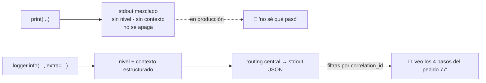

import Reto from "@components/Reto.astro";
import Solucion from "@components/Solucion.astro";
import Quiz from "@components/Quiz.astro";
import CheckDominio from "@components/CheckDominio.astro";
import Nivel from "@components/Nivel.astro";

<Nivel nivel="intermedio" />

Hasta ahora escribiste código tuyo, lo testeaste y lo refactorizaste. Esta lección trata del otro 70% del trabajo real: **entrar a código que no escribiste, encontrar por qué se rompe, y arreglarlo sin romper tres cosas más**. Vas a aprender el método con el que se depura un bug —reproducir, leer el stack trace, formar una hipótesis, confirmarla con el debugger, capturar el bug con un test que falle primero, y recién entonces arreglar— y a dejar de usar `print` como linterna para usar **logging estructurado**, que es lo que te dejará ver qué pasó en un sistema que ya no tienes delante.

:::tip[Si ya depuraste código legado en tu trabajo]
¿Ya entraste a un proyecto ajeno a apagar un incendio? Bien: tienes la intuición. La trampa del que "ya depura" es hacerlo **por instinto y a fuerza de `print`**, sin método y sin red. Salta a los **ejercicios Primero-Sin-IA** (sección 7): el primero te da un bug reportado y te pide cazarlo con stack trace + `pdb` + un test de regresión que falle *antes* del fix; el segundo te pide convertir un script lleno de `print` en logging estructurado con niveles y contexto. Si los cierras limpio y puedes defender *por qué* el test va antes que el fix, valida con el check de dominio (sección 8). Si te descubres "probando cosas al azar hasta que pase", el problema es la sección 4.
:::

## 1. Qué vas a saber hacer

Al terminar, sin IA y sin notas, podrás:

- **O1 — Leer un stack trace** de Python de abajo hacia arriba: identificar el **tipo y mensaje** de la excepción, y el **frame exacto de tu código** donde nace el fallo (no donde explota).
- **O2 — Depurar con método científico** usando `pdb`/`breakpoint()` y el debugger de VS Code (breakpoints, breakpoints condicionales, watch, call stack): **reproducir → hipótesis → confirmar inspeccionando estado → capturar el bug con un test de regresión que falle primero → arreglar solo la causa raíz**.
- **O3 — Explicar el trade-off** entre `print` y **logging estructurado** (niveles, contexto, routing, off-switch), y entrar de forma segura a código que no escribiste apoyándote en **characterization tests** como red.

## 2. Por qué importa (el dinero está aquí)

> 💰 **Por qué importa:** debugging y lectura de código legado son **la expectativa semi-senior que los juniors saltan, por eso cobran menos**. Casi todo el código que tocarás en un trabajo no lo escribiste tú, llega sin tests y "ya estaba en producción". El candidato que en una entrevista depura **con método** —lee el trace, plantea una hipótesis, la confirma con el debugger, escribe el test de regresión— se separa al instante del que mete `print` por todos lados o pide "reescríbelo entero". Es además el músculo que en la Fase 5 se vuelve **observabilidad** (logs/trazas/correlation IDs) y en la Fase 6 te deja **depurar la traza de un agente** que tomó una decisión rara.

Tres razones hacen de esta sub-unidad una bisagra:

1. **Depurar al azar es el sumidero de tiempo #1 de un junior.** "Pruebo esto… no… pruebo esto otro…" es una caminata aleatoria por el espacio de estados. El método científico convierte esa caminata en una **búsqueda binaria**: cada hipótesis confirmada o descartada parte el problema a la mitad. La diferencia entre 20 minutos y 3 horas para el mismo bug es tener método.
2. **Pedirle a la IA "arregla este bug" sin entenderlo te entrena para no poder.** La IA a veces parcha el síntoma y rompe otra cosa, y tú no sabrías por qué. Esta es exactamente la habilidad que el Primero-Sin-IA protege: **necesitas poder localizar y entender un fallo por ti mismo**, porque eso es lo que un live coding mide y lo que un sistema en producción a las 3am exige.
3. **`print` no sobrevive a producción.** En tu máquina ves la consola; en un servidor el `print` se pierde, no tiene nivel, no tiene contexto y no se puede apagar. Saber instrumentar con **logging estructurado** es la diferencia entre "no sé qué pasó" y "filtro por `correlation_id` y veo los 4 pasos que llevaron al error".

## 3. Lo que ya traes (actívalo)

Esta lección se para sobre lo anterior. Reúsalo antes de seguir:

- De [`2.3` Code smells y refactoring](/fase-2-ingenieria/2-3-code-smells-refactoring/): los **characterization tests** (golden master) y la disciplina de los **dos sombreros** (refactorizar ≠ arreglar bugs). Aquí los usamos como **red para entrar a código ajeno**: pintas lo que hace hoy antes de tocarlo.
- De [`2.6` Testing fundamentos](/fase-2-ingenieria/2-6-testing-fundamentos/) y [`2.7` TDD](/fase-2-ingenieria/2-7-tdd-obligatorio/): el ciclo **red-green-refactor**. El corazón de esta lección es una variante: **un test de regresión que falle primero** (rojo) reproduce el bug; el fix lo pone verde. Sin el rojo, no sabes si arreglaste algo.
- De Fase 1 (excepciones) y Fase 0 (lectura básica de stack traces): un error de Python no es ruido; es un mapa con coordenadas exactas hacia el fallo. Hoy aprendemos a leerlo entero.

Antes de seguir, responde de memoria:

<Quiz
  question="En un stack trace de Python que termina con la línea 'Traceback (most recent call last)', ¿dónde está el frame donde realmente se originó la excepción?"
  options={[
    "En la PRIMERA línea de archivo del traceback (arriba): es la primera llamada",
    "En la ÚLTIMA línea de archivo del traceback (abajo, justo antes del tipo de excepción): es la llamada más reciente, la que reventó",
    "Siempre en la línea del main/módulo de entrada, porque desde ahí arranca todo",
  ]}
  answer={1}
  explanation="'most recent call last' es literal: las llamadas se apilan de arriba (la más antigua, tu main) hacia abajo (la más reciente, donde explotó). Lees el trace de ABAJO hacia arriba: primero el tipo+mensaje de la excepción (el QUÉ), luego subes hasta el último frame que está en TU código (el DÓNDE). El frame de más abajo suele estar en una librería; el último frame tuyo es donde empieza tu trabajo."
/>

## 4. Ejemplo resuelto, pensado en voz alta

Te voy a mostrar dos cazas reales: un bug que **revienta** (sección 4.1–4.5) y cómo **instrumentar** para ver lo que no revienta (4.6). **No lo leas como un resultado: léelo como me oirías razonar al lado tuyo.**

### 4.1 El reporte y la reproducción

Llega el ticket: *"#412 — El resumen de cuenta revienta para cuentas que solo tienen abonos."* El código legado (no lo escribí yo) es este:

```python
# cuenta.py  (estaba en producción)
def _solo(movimientos, tipo):
    return [m["monto"] for m in movimientos if m["tipo"] == tipo]

def resumen_cuenta(movimientos):
    abonos = _solo(movimientos, "abono")
    cargos = _solo(movimientos, "cargo")
    saldo = sum(abonos) - sum(cargos)
    return {
        "saldo": saldo,
        "n_movimientos": len(movimientos),
        "mayor_cargo": max(cargos),
    }
```

Razono en voz alta: *"Regla cero del método: **antes de mirar el código a fondo, reproduzco el bug**. Si no puedo reproducirlo, no puedo arreglarlo ni saber cuándo lo arreglé. El reporte me da el caso: solo abonos."*

```python
movs = [{"tipo": "abono", "monto": 1000}, {"tipo": "abono", "monto": 500}]
print(resumen_cuenta(movs))
```

Lo corro y obtengo un stack trace. **Ese trace es oro; no lo descarto, lo leo.**

### 4.2 Anatomía de un stack trace (se lee de abajo hacia arriba)

```text
Traceback (most recent call last):
  File "app.py", line 4, in <module>
    print(resumen_cuenta(movs))
          ^^^^^^^^^^^^^^^^^^^^^^
  File "/proj/cuenta.py", line 11, in resumen_cuenta
    "mayor_cargo": max(cargos),
                   ^^^^^^^^^^^
ValueError: max() iterable argument is empty
```

Razono: *"Lo leo en este orden:*

1. *Última línea primero — **el QUÉ**: `ValueError: max() iterable argument is empty`. No es 'se rompió'; es 'le pasé una secuencia vacía a `max()`'. (El mensaje exacto cambia entre versiones de Python: en algunas dice `max() arg is an empty sequence`. Da igual: dice lo mismo.)*
2. *Subo al **frame más cercano al fallo — el DÓNDE**: `File "/proj/cuenta.py", line 11, in resumen_cuenta`, en `max(cargos)`. Ahí explotó. El `^^^^` me apunta la subexpresión exacta (Python 3.11+).*
3. *Sigo subiendo: `app.py line 4` es **quién lo llamó**. Eso es el contexto, no la causa.*

*Conclusión instantánea: `cargos` estaba vacío y `max([])` no existe. Pero 'instantáneo' es peligroso — **no parcheo por corazonada; confirmo**."*

> **Cómo leer cualquier traceback (regla fija):**
> 1. **Abajo del todo:** tipo de excepción + mensaje = *el QUÉ*.
> 2. **Sube hasta el último frame que esté en TU código** (ignora los frames de librerías por ahora) = *el DÓNDE*.
> 3. **Más arriba** = la cadena de llamadas que llevó ahí = *el cómo llegué*.
> 4. Si ves `During handling of the above exception, another exception occurred` o `The above exception was the direct cause...`, es una **excepción encadenada**: hay dos traces; el de más abajo suele ser la causa raíz.

### 4.3 Confirmar la hipótesis con el debugger (no con `print`)

Razono: *"Mi hipótesis es 'cargos == []'. La confirmo con `pdb` en modo **post-mortem**: corro el script y, cuando reviente, me deja parado justo en el frame del crash con todo el estado vivo."*

```text
$ python -m pdb -c continue app.py
Traceback (most recent call last):
  ...
ValueError: max() iterable argument is empty
Uncaught exception. Entering post mortem debugging
Running 'cont' or 'step' will restart the program
> /proj/cuenta.py(11)resumen_cuenta()
-> "mayor_cargo": max(cargos),
(Pdb) p cargos
[]
(Pdb) p abonos
[1000, 500]
(Pdb) w
  /proj/app.py(4)<module>()
-> print(resumen_cuenta(movs))
> /proj/cuenta.py(11)resumen_cuenta()
-> "mayor_cargo": max(cargos),
(Pdb) q
```

*"`p cargos` → `[]`. **Hipótesis confirmada con evidencia**, no con fe. `p abonos` → `[1000, 500]`, así que el resto del cálculo está bien; el único problema es `max([])`. `w` (where) me muestra la pila: ahí está el camino completo. Salgo con `q`."*

`-c continue` le dice a `pdb`: corre el programa hasta que reviente y entra en **post-mortem** (también puedes hacer `import pdb; pdb.pm()` en el REPL después de un crash). Para parar **antes** de que algo pase, pones `breakpoint()` en la línea que te interesa:

```python
def resumen_cuenta(movimientos):
    abonos = _solo(movimientos, "abono")
    cargos = _solo(movimientos, "cargo")
    breakpoint()   # el programa se detiene aquí y abre pdb
    ...
```

> **Cheat-sheet de `pdb`** (los que usarás el 90% del tiempo):
>
> | Comando | Qué hace |
> |---|---|
> | `l` / `ll` | lista el código alrededor / la función completa |
> | `n` (next) | ejecuta la línea actual **sin entrar** a las funciones que llama |
> | `s` (step) | ejecuta la línea **entrando** a la función que llama |
> | `c` (continue) | sigue hasta el próximo breakpoint o el final |
> | `p expr` / `pp expr` | imprime / imprime "bonito" el valor de una expresión |
> | `w` (where) | muestra la pila de llamadas (en qué frame estás) |
> | `u` / `d` | sube / baja un frame en la pila (para inspeccionar al que llamó) |
> | `b archivo:linea` | pone un breakpoint; `b` solo lista los activos |
> | `display expr` | re-muestra el valor de `expr` cada vez que se detiene |
> | `until` | corre hasta una línea mayor a la actual (útil para salir de un loop) |
> | `q` (quit) | sale del debugger |
>
> Tip de seguridad: en producción nunca quieres que un `breakpoint()` olvidado congele el proceso. Con la variable de entorno `PYTHONBREAKPOINT=0`, **todas** las llamadas a `breakpoint()` se desactivan. (También puedes enrutarlo a otro debugger, p. ej. `PYTHONBREAKPOINT=ipdb.set_trace`.)

### 4.4 Capturar el bug con un test de regresión (rojo primero)

Razono: *"Ya sé la causa. Pero **no arreglo todavía**. Primero escribo el test que reproduce el bug y lo veo **fallar**. ¿Por qué? Porque ese test rojo es la prueba objetiva de que (a) entendí el bug, y (b) cuando pase a verde, lo arreglé de verdad. Y queda para siempre: si alguien re-introduce el bug, este test lo atrapa. Es el ciclo de [`2.7`](/fase-2-ingenieria/2-7-tdd-obligatorio/), aplicado a un defecto."*

```python
# test_cuenta.py
from cuenta import resumen_cuenta

def test_regresion_412_cuenta_solo_abonos():
    # Antes del fix: ValueError. Después del fix: mayor_cargo == 0.
    movs = [{"tipo": "abono", "monto": 1000}, {"tipo": "abono", "monto": 500}]
    r = resumen_cuenta(movs)
    assert r["saldo"] == 1500
    assert r["mayor_cargo"] == 0
```

Corro: **falla** con el `ValueError` esperado. Rojo. Perfecto: el test ve el bug.

### 4.5 Arreglar la causa raíz (y solo eso)

Razono: *"El arreglo mínimo y correcto: `max(cargos, default=0)`. `default=` es justo para esto: 'el máximo, o este valor si está vacío'. No reescribo la función, no 'mejoro' otras cosas de paso (sombrero equivocado). Una línea."*

```python
        "mayor_cargo": max(cargos, default=0),
```

Corro la suite: **verde**. El test de regresión pasa, y los tests viejos siguen pasando (no rompí nada). Fin.

> **Una decisión, declarada:** ¿`mayor_cargo` debe ser `0` o `None` cuando no hay cargos? `0` mantiene el tipo numérico (cómodo para sumar/comparar); `None` dice "no aplica" más honestamente pero obliga a chequear `None` aguas abajo. Las dos son defendibles — lo que **no** es defendible es no decidirlo y dejar que reviente. Elegí `0` y lo dejé fijado por el test.

### 4.6 Segundo ejemplo: de `print` a logging estructurado

El bug anterior reventaba, así que el trace me lo sirvió en bandeja. Pero la mayoría de los problemas en producción **no revientan**: dan un número raro, procesan de más, se cuelgan. Ahí no tienes un trace; tienes que **haber instrumentado** para ver. El instinto del junior es sembrar `print`:

```python
def procesar(pedido):
    print("procesando", pedido["id"])          # ¿qué nivel? ¿se apaga?
    total = pedido["cantidad"] * pedido["precio"]
    print("total", total)                        # ¿dónde queda esto en el server?
    if total > 100000:
        print("OJO pedido grande")               # ¿cómo lo filtro entre 10.000 logs?
    return total
```

Razono: *"Esto se siente útil en mi máquina y es veneno en producción. `print` no tiene **nivel** (no distingo 'info de rutina' de 'algo anda mal'), no tiene **contexto** estructurado (no puedo filtrar por `pedido_id`), va a `stdout` mezclado con todo, y **no se puede apagar** sin editar y redeployar. La versión profesional usa `logging`:"*

```python
import logging

logger = logging.getLogger(__name__)   # un logger por módulo, configurado afuera

def procesar(pedido, correlation_id):
    logger.info(
        "pedido recibido",
        extra={"pedido_id": pedido["id"], "correlation_id": correlation_id},
    )
    total = pedido["cantidad"] * pedido["precio"]
    logger.debug(
        "total calculado",
        extra={"pedido_id": pedido["id"], "correlation_id": correlation_id, "total": total},
    )
    if total > 100000:
        logger.warning(
            "pedido grande, requiere revisión",
            extra={"pedido_id": pedido["id"], "correlation_id": correlation_id, "total": total},
        )
    return total
```

Razono las cuatro ganancias: *"(1) **Niveles**: `debug` para el detalle, `info` para el ciclo de vida, `warning` para la anomalía recuperable, `error` para el fallo. En producción configuro nivel `INFO` y el `debug` desaparece **sin tocar el código** — el off-switch que `print` nunca tuvo. (2) **Contexto estructurado** en `extra=`: cada log carga `pedido_id` y `correlation_id`, así que puedo seguir **un** pedido a través de todo el sistema. (3) **Routing**: configuro a dónde va (stdout, archivo, un colector) **una vez**, fuera de la lógica. (4) **Formato JSON** para que una máquina lo parsee."*

La configuración vive **una sola vez**, al arrancar el programa (no en cada módulo). Con stdlib, un formateador JSON mínimo:

```python
import json, logging, sys

class JsonFormatter(logging.Formatter):
    def format(self, record):
        datos = {
            "nivel": record.levelname,
            "logger": record.name,
            "msg": record.getMessage(),
            "pedido_id": getattr(record, "pedido_id", None),
            "correlation_id": getattr(record, "correlation_id", "-"),
        }
        return json.dumps(datos, ensure_ascii=False)

def configurar_logging(nivel=logging.INFO):
    handler = logging.StreamHandler(sys.stdout)   # en contenedores: a stdout
    handler.setFormatter(JsonFormatter())
    logging.basicConfig(level=nivel, handlers=[handler])
```

Una línea de log ahora se ve así, lista para indexar y filtrar:

```text
{"nivel": "WARNING", "logger": "ventas", "msg": "pedido grande, requiere revisión", "pedido_id": 77, "correlation_id": "req-abc123"}
```

> *"En un proyecto real usaría `python-json-logger` (un `Formatter` JSON ya hecho) o `structlog` en vez de escribir el mío, y en la Fase 5 ese `correlation_id` se conecta con **trazas** (OpenTelemetry) para seguir una petición entre servicios. Pero el principio ya está aquí: **niveles + contexto + routing centralizado**. Eso es observabilidad; `print` es una linterna que se queda prendida."*



## 5. Errores que vas a tener (y por qué)

:::caution[Podrías pensar que el debugger es para "cuando ya no entiendo nada"]
Al revés: el debugger es un **instrumento de precisión que usas temprano**, no un último recurso. Sembrar `print`, correr, leer, borrar, repetir, es un ciclo lento y sucio. Con un breakpoint inspeccionas **todo** el estado vivo de una vez (`p`, `pp`, subir frames con `u`), evalúas expresiones, avanzas paso a paso. Diez minutos aprendiendo `pdb` (o el panel de debug de VS Code) te ahorran cientos de `print` a lo largo de tu carrera. No es para expertos; es lo que te *hace* experto más rápido.
:::

:::caution[Podrías pensar que más print = depurar más rápido]
`print` por todos lados es una **caminata aleatoria**: agregas diez, corres, miras el muro de salida, adivinas dónde mirar. El método científico es una **búsqueda binaria**: una hipótesis concreta ("`cargos` está vacío"), un punto de observación que la confirma o la descarta, y cada paso parte el problema a la mitad. No es "cuántos print pongo"; es "qué pregunta exacta le hago al estado del programa". El junior agrega print; el semi-senior plantea hipótesis.
:::

:::caution[Podrías pensar que el primer cambio que hace pasar el repro es "el fix"]
Hacer desaparecer el síntoma no es arreglar la causa. Si "envuelvo en `try/except` y devuelvo `0`" el `ValueError` se va… y también se traga cualquier otro `ValueError` real que aparezca después: parchaste el síntoma y plantaste un bug peor (silencioso). El fix correcto ataca la **causa raíz** (`max([])` no tiene valor → `default=0`), está respaldado por un **test de regresión que falló primero**, y no cambia comportamiento que no te pidieron. Sin entender *por qué* fallaba, no sabes si lo arreglaste o solo lo escondiste.
:::

:::caution[Podrías pensar que logging es "print con más pasos"]
`logging` te da cuatro cosas que `print` no puede: **niveles** (filtras `DEBUG` en prod sin tocar código), **contexto estructurado** (`extra={"correlation_id": ...}` para seguir una petición), **routing central** (decides una vez a dónde van: stdout, archivo, colector) y **formato** (JSON parseable por una máquina). `print` es fuego y olvido: sin nivel, sin contexto, sin off-switch, y siempre alguien lo deja olvidado contaminando la salida. En una librería que otros importan, un `print` es directamente un bug de cortesía.
:::

:::caution[Podrías pensar que para tocar código ajeno hay que leerlo entero primero]
Nadie lee 40.000 líneas antes de arreglar una. Entras por el **síntoma** (el trace te da las coordenadas), caracterizas la **rebanada** que vas a tocar con tests que pinten su comportamiento actual ([`2.3`](/fase-2-ingenieria/2-3-code-smells-refactoring/)), y limitas el radio de explosión: cambias lo mínimo, con la red verde alrededor. Leer de más es procrastinación disfrazada de prudencia; la prudencia real es la **red de tests** antes del cambio.
:::

## 6. Práctica con andamiaje (que se desvanece)

Tres niveles, de más apoyo a menos. Hazlos **a mano primero** (predecir antes de ejecutar): depurar *es* predecir el estado, encaja perfecto con el Primero-Sin-IA.

### 6.1 PREDICT — ¿dónde está el fallo en el trace?

Sin ejecutar nada, lee este traceback y responde: (a) ¿cuál es el **tipo** de la excepción y qué significa el mensaje?, (b) ¿cuál es el **último frame de TU código** (el DÓNDE)?, (c) ¿la causa raíz está en `app.py` o en `descuentos.py`?

```text
Traceback (most recent call last):
  File "app.py", line 9, in <module>
    total = aplicar_descuento(carrito, cupon)
            ^^^^^^^^^^^^^^^^^^^^^^^^^^^^^^^^^^^
  File "/proj/descuentos.py", line 14, in aplicar_descuento
    factor = TABLA_CUPONES[cupon]
             ^^^^^^^^^^^^^^^^^^^^^
KeyError: 'BLACKFRIDAY'
```

<Solucion title="Ver la respuesta (solo después de predecir)">
- **(a)** `KeyError: 'BLACKFRIDAY'`. Un `KeyError` significa que pediste una clave que **no existe** en un diccionario; aquí, `'BLACKFRIDAY'` no está en `TABLA_CUPONES`.
- **(b)** El último (y único) frame de tu código que reventó es `descuentos.py:14`, en `aplicar_descuento`, sobre `TABLA_CUPONES[cupon]`. Ese es el DÓNDE.
- **(c)** La causa raíz está en `descuentos.py`: o falta la entrada `'BLACKFRIDAY'` en `TABLA_CUPONES`, o el código debería manejar un cupón inválido (p. ej. `TABLA_CUPONES.get(cupon, 1.0)`) en vez de asumir que siempre existe. `app.py:9` es solo **quién llamó** con ese cupón — contexto, no causa. La decisión de diseño ("¿cupón inválido = error visible o se ignora?") es justo lo que un test de regresión debe fijar.
</Solucion>

### 6.2 Parsons — ordena el método científico de debugging

Estos seis pasos están **desordenados**. Reescríbelos en el orden correcto:

```text
A. Arregla la CAUSA RAÍZ (no el síntoma) con el cambio mínimo; corre la suite: verde.
B. Forma una HIPÓTESIS concreta y falsable sobre la causa ("X está vacío", "Y llega como str").
C. REPRODUCE el bug de forma fiable (el caso mínimo que lo dispara).
D. LOCALIZA el frame con el stack trace (de abajo hacia arriba).
E. Escribe un TEST DE REGRESIÓN que reproduzca el bug y MÍRALO FALLAR (rojo).
F. CONFIRMA o descarta la hipótesis inspeccionando el estado con el debugger (p, w, u/d).
```

<Solucion title="Ver el orden correcto">
Orden: **C → D → B → F → E → A**.

1. **C** — Reproduce. Sin repro fiable no hay nada que depurar ni forma de saber cuándo terminaste.
2. **D** — Localiza con el trace (abajo→arriba): tipo+mensaje, luego tu último frame.
3. **B** — Hipótesis falsable. "Algo anda mal" no sirve; "`cargos` está vacío" sí.
4. **F** — Confirma con el debugger inspeccionando el estado real (no adivinando).
5. **E** — Test de regresión que **falla primero** (rojo): la prueba de que entendiste el bug.
6. **A** — Arreglas la causa raíz; la suite (incluido el nuevo test) queda verde.

Nota: E puede ir junto a C en equipos que escriben el repro directamente como test desde el inicio — perfectamente válido y aún mejor. Lo inamovible es: **el rojo va antes del fix**, y arreglas **causa**, no síntoma.
</Solucion>

### 6.3 MODIFY — del print al breakpoint

Toma la función `procesar` con `print` de la sección 4.6. (a) Reescríbela usando `logger.debug/info/warning` con `extra={"pedido_id": ...}` en cada llamada. (b) Luego, en vez de un `print` para inspeccionar `total`, pon un `breakpoint()` justo después de calcularlo y escribe los **dos comandos de `pdb`** que usarías para (1) ver el valor de `total` y (2) ver la pila de llamadas. (Pista: están en el cheat-sheet de 4.3.)

## 7. Ejercicios Primero-Sin-IA

Ahora sin andamiaje. Resuélvelos **a mano, sin IA** dentro del timebox. El primero es la caza completa de un bug en código legado con método; el segundo te convierte el `print`-spam en logging estructurado de verdad.

<Reto title="Caza el bug con método: stack trace → pdb → test de regresión" timebox="40–45 min">

Te entregamos `solucion.py`: un módulo legado (`resumen_cuenta`) que **ya estaba en producción** y tiene un bug reportado en el ticket **#412** ("revienta para cuentas que solo tienen abonos"), más `test_solucion.py` con un test de reproducción que **hoy falla**. No reescribas el módulo: **depúralo con método**.

En orden estricto (y deja rastro de cada paso en `traza.md`, eso es lo que demuestra que depuraste tú):
1. **Reproduce** corriendo `pytest`: copia en `traza.md` el **stack trace** y léelo de abajo hacia arriba (anota: tipo de excepción, mensaje, y el frame exacto de `solucion.py` donde nace).
2. **Hipótesis + confirmación con el debugger:** formula tu hipótesis en una frase y confírmala con `pdb` (post-mortem `python -m pdb -c continue ...`, o un `breakpoint()`). Pega en `traza.md` los comandos que usaste (`p`, `w`, …) y lo que viste (p. ej. el valor de `cargos`).
3. **Test de regresión rojo:** completa el test que reproduce el bug y míralo **fallar** antes de arreglar nada.
4. **Arregla la causa raíz** con el cambio **mínimo** (declara en `traza.md` tu decisión de diseño: ¿`0` o `None` cuando no hay cargos? ¿por qué?). Corre `pytest`: todo verde.
5. **Dos sombreros:** el módulo además **ignora silenciosamente** un movimiento cuyo `tipo` no es `"abono"` ni `"cargo"`. Eso es deuda separada: **NO lo arregles en este ticket**; anótalo en `traza.md` como un bug futuro con su propio test.

Entregable: `solucion.py` arreglado + `test_solucion.py` con el test de regresión + `traza.md` (trace + hipótesis + sesión de pdb + decisión de diseño + la deuda anotada).

**Hecho significa:**
- [ ] `traza.md` muestra que leíste el trace (tipo, mensaje, frame exacto), no solo "lo arreglé".
- [ ] Hay evidencia de haber inspeccionado el estado con `pdb` (comandos + valor observado), no una corazonada.
- [ ] El test de regresión **falló primero** y ahora pasa; los tests previos siguen verdes.
- [ ] El fix ataca la **causa raíz** (no un `try/except` que traga el error) y no cambia comportamiento que no te pidieron.
- [ ] La rareza del `tipo` desconocido está **anotada como deuda separada**, no "arreglada" de paso.
- [ ] Puedes explicar **sin notas** por qué el test de regresión va **antes** que el fix.

Enunciado completo y starter: `ejercicios/fase-2/depurar-con-stack-trace-y-pdb/` (carpeta del repo).

<Solucion title="Pista (ábrela solo si superaste el timebox)">
El mensaje `max() ... is empty` te dice todo: alguien llamó `max()` con una secuencia vacía. ¿Qué secuencia, y por qué está vacía cuando solo hay abonos? Confírmalo con `pdb`: `p cargos` justo en el frame del crash. El fix idiomático para "el máximo, o un valor por defecto si está vacío" es el parámetro `default=` de `max()`. Para los dos sombreros: el `tipo` desconocido cae fuera de los dos `_solo(...)`, así que simplemente no se suma a ningún lado — pinta ese comportamiento en un test marcado como deuda (`xfail` del comportamiento deseado futuro), no lo "corrijas" aquí. Pista, no solución.
</Solucion>

</Reto>

<Reto title="De print-spam a logging estructurado (con niveles y contexto)" timebox="30–40 min">

Te entregamos `solucion.py`: un mini-pipeline legado (`procesar_pedidos`) sembrado de `print()` para "depurar" y mostrar estado. Convierte esa instrumentación amateur en **logging estructurado profesional**, y `test_solucion.py` (con `caplog`/`capsys`) verifica que lo hiciste bien.

Tu tarea:
1. **Crea un logger por módulo** (`logging.getLogger(__name__)`) y reemplaza **todos** los `print` por la llamada de `logging` con el **nivel correcto**: `debug` para el detalle interno, `info` para el ciclo de vida (pedido recibido/procesado), `warning` para la anomalía recuperable (un pedido inválido que se omite), `error` si algo falla de verdad.
2. **Añade contexto estructurado** en cada log con `extra={"pedido_id": ..., "correlation_id": ...}` para poder seguir un pedido.
3. **Configura el logging una sola vez** (función `configurar_logging(nivel)`) con salida a `stdout`; deja el detalle (`debug`) **apagable** subiendo el nivel a `INFO` sin tocar la lógica.
4. **Escribe `por-que.md`** (máx. media página): 3 razones concretas por las que `print` es un antipatrón de observabilidad en producción, y qué te da el logging estructurado que `print` no puede (conéctalo con la observabilidad de la Fase 5: correlation IDs, trazas).

Entregable: `solucion.py` con logging + `por-que.md`. Corre `pytest` hasta verde.

**Hecho significa:**
- [ ] **Cero** `print` quedan en `solucion.py` (el test con `capsys` confirma que `stdout` no tiene prints sueltos).
- [ ] Cada log usa el **nivel** correcto y lleva `pedido_id` y `correlation_id` en `extra=`.
- [ ] El nivel `DEBUG` se puede silenciar configurando `INFO`, **sin** tocar las llamadas de log.
- [ ] El pedido inválido genera un `WARNING` (no un crash, no un `print`).
- [ ] `por-que.md` defiende niveles + contexto + routing + off-switch, no "porque queda más prolijo".
- [ ] Puedes explicar **sin notas** por qué un `print` en una librería que otros importan es un problema.

Enunciado completo y starter: `ejercicios/fase-2/de-print-a-logging-estructurado/` (carpeta del repo).

<Solucion title="Pista (ábrela solo si superaste el timebox)">
`logger = logging.getLogger(__name__)` arriba del módulo; **no** lo configures ahí (un logger se obtiene en el módulo, se configura en el `main`). El contexto va en `extra=` como dict; en el formateador lo lees con `getattr(record, "pedido_id", None)` para que no reviente si falta. Para que `caplog` capture tus logs, el logger debe **propagar** (es el default, no lo desactives). El `warning` del pedido inválido es el caso donde más se nota la diferencia con `print`: tiene nivel propio y se puede alertar sobre él. Pista, no solución.
</Solucion>

</Reto>

## 8. Check de dominio

Sin mirar la lección, en voz alta o por escrito:

<CheckDominio
  items={[
    "Leer un stack trace: explicar qué es el QUÉ (tipo+mensaje) y el DÓNDE (último frame de tu código) y por qué se lee de abajo hacia arriba.",
    "Enumerar el método científico de debugging en orden (reproducir → localizar → hipótesis → confirmar → test rojo → fix de causa raíz).",
    "Explicar la diferencia entre 'n' (next) y 's' (step) en pdb, y para qué sirven 'p', 'w' y 'u/d'.",
    "Explicar por qué un test de regresión debe FALLAR antes de aplicar el fix.",
    "Dar un ejemplo de 'arreglar el síntoma' que esconde el bug en vez de arreglarlo.",
    "Nombrar las cuatro cosas que logging te da y print no (niveles, contexto, routing, off-switch).",
    "Explicar qué es un correlation_id y por qué importa para seguir una petición.",
    "Explicar cómo entrarías a una función legada de 200 líneas para arreglar UN bug sin leerla entera.",
  ]}
/>

Si marcaste menos de seis, vuelve a la sección correspondiente **antes** de avanzar. No es un examen: es honestidad contigo.

<Quiz
  question="Estás en pdb detenido en una línea que dice 'total = calcular_impuesto(monto)' y sospechas que el bug está DENTRO de calcular_impuesto. ¿Qué comando usas?"
  options={[
    "'n' (next): ejecuta la línea y sigo en mi función, así avanzo más rápido",
    "'s' (step): entra a calcular_impuesto para depurar su interior línea a línea",
    "'c' (continue): dejo correr todo y veo qué pasa al final",
  ]}
  answer={1}
  explanation="'s' (step) ENTRA en la función llamada, que es exactamente lo que quieres si el bug vive ahí dentro. 'n' (next) ejecutaría calcular_impuesto entera de un saque sin dejarte ver su interior (úsalo cuando confías en esa función y solo quieres avanzar). 'c' te saca del modo paso a paso. Regla: 's' para bajar al detalle, 'n' para sobrevolar lo que ya confías."
/>

<Quiz
  question="En producción configuraste el logging en nivel INFO. Tu código tiene muchos logger.debug(...) con detalle interno. ¿Qué pasa con esos debug?"
  options={[
    "Hay que borrarlos del código antes de deployar para que no aparezcan",
    "No se emiten (quedan filtrados por el nivel), pero siguen en el código listos para reactivarse subiendo el nivel a DEBUG, sin redeployar lógica",
    "Se emiten igual: el nivel solo cambia el formato, no qué se muestra",
  ]}
  answer={1}
  explanation="Ese es justo el off-switch que print nunca tuvo: los logger.debug() quedan en el código pero no se emiten mientras el nivel sea INFO. El día que necesites diagnosticar, subes el nivel a DEBUG (por config o variable de entorno) y aparecen, sin tocar ni una línea de lógica. Con print tendrías que editar el código y redeployar para apagar o prender el detalle."
/>

## 9. Recursos (documentación oficial primero)

- **`pdb` — The Python Debugger (docs oficiales):** [docs.python.org/3/library/pdb.html](https://docs.python.org/3/library/pdb.html) — todos los comandos, `breakpoint()`, post-mortem (`pdb.pm()`, `pdb.post_mortem()`), y `PYTHONBREAKPOINT`.
- **`logging` — Logging facility (docs oficiales) + HOWTO:** [docs.python.org/3/library/logging.html](https://docs.python.org/3/library/logging.html) y [docs.python.org/3/howto/logging.html](https://docs.python.org/3/howto/logging.html) — niveles, loggers por módulo, `extra=`, `dictConfig`.
- **Debugging en VS Code (docs oficiales) + Python debugging:** [code.visualstudio.com/docs/debugtest/debugging](https://code.visualstudio.com/docs/debugtest/debugging) y [code.visualstudio.com/docs/python/debugging](https://code.visualstudio.com/docs/python/debugging) — breakpoints, breakpoints condicionales, logpoints, watch, call stack, `launch.json` (tipo `debugpy`).
- **`pytest` — captura de logs (`caplog`) y de salida (`capsys`):** [docs.pytest.org/en/stable/how-to/logging.html](https://docs.pytest.org/en/stable/how-to/logging.html) y [docs.pytest.org/en/stable/how-to/capture-stdout-stderr.html](https://docs.pytest.org/en/stable/how-to/capture-stdout-stderr.html) — cómo testear que tu código loguea lo que debe.
- **`python-json-logger` (formateador JSON listo) y `structlog`:** [github.com/nhairs/python-json-logger](https://github.com/nhairs/python-json-logger) y [www.structlog.org](https://www.structlog.org/) — el camino idiomático a logs estructurados en producción.

## 10. Conexión con el capstone de la fase

El **Capstone F2 — Refactor + suite de tests** te hace tomar un proyecto previo (código que escribiste hace tiempo = legado para tu yo de hoy) y dejarlo limpio, testeado y con pipeline. Esta lección es la que te deja **entrar sin romper**:

- Cuando el capstone te pida arreglar un bug que descubres al refactorizar, lo harás con método: trace → hipótesis → `pdb` → **test de regresión rojo primero** → fix de causa raíz. Ese test queda en la suite como evidencia.
- Instrumentarás el proyecto con **logging estructurado** (niveles + contexto), no `print`. Es el ensayo directo de la **observabilidad** de la Fase 5 (logs/métricas/trazas + correlation IDs) y de depurar la traza de un **agente** en la Fase 6.
- Los **characterization tests** de [`2.3`](/fase-2-ingenieria/2-3-code-smells-refactoring/) + el método de debugging de aquí son, juntos, la disciplina con la que se toca código ajeno sin miedo — exactamente lo que el [`2.13` Colaboración y spec-driven](/fase-2-ingenieria/2-13-colaboracion-spec-driven-adrs/) formaliza en flujo de equipo.

## 11. Reflexión y repaso espaciado

Cierra escribiendo dos o tres frases respondiendo: **en el ejercicio 1, ¿cuánto tardaste entre ver el trace y confirmar la causa con `pdb`? ¿Sentiste la tentación de parchear apenas leíste el mensaje, sin confirmar?** Esa tentación —arreglar por corazonada— es exactamente lo que el método disciplina. Nombrarla es empezar a vencerla.

Gancho de **spaced repetition**:

- **Mañana:** toma cualquier bug que arregles (en este curso o en tu trabajo) y oblígate a escribir el **test de regresión rojo** antes del fix. Cronométralo: ¿cuánto cuesta de verdad? (Spoiler: mucho menos de lo que crees, y te ahorra el bug que vuelve.)
- **En 3 días:** abre un script viejo tuyo con `print` y conviértelo a `logging` con niveles de memoria, sin mirar la sección 4.6. Si no te sale el `getLogger(__name__)` + `extra=`, vuelve a leerla.
- **En 1 semana:** explícale a alguien (o a una grabación) cómo lees un stack trace de abajo hacia arriba y por qué `print` no sobrevive a producción. Si lo dices fluido, lo interiorizaste; si dudas, repasa las secciones 4.2 y 5.
