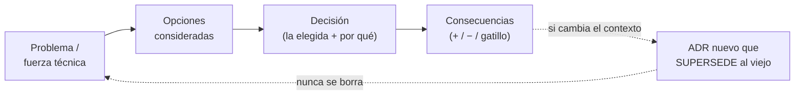
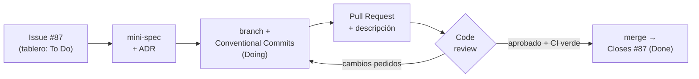

import Reto from "@components/Reto.astro";
import Solucion from "@components/Solucion.astro";
import Quiz from "@components/Quiz.astro";
import CheckDominio from "@components/CheckDominio.astro";
import Nivel from "@components/Nivel.astro";

<Nivel nivel="intermedio" />

Hasta aquí escribiste, testeaste, refactorizaste y depuraste código —casi siempre **solo**. El trabajo real es otra cosa: tu cambio entra a una base que comparten cinco personas, pasa por la mirada crítica de alguien más antes de mergear, y dentro de seis meses alguien (quizá tú) preguntará *"¿por qué demonios elegimos esto?"*. Esta lección es el sistema operativo del trabajo en equipo: cómo va un cambio **desde un issue hasta un PR mergeado** con commits legibles, cómo escribir un **mini-spec antes de codear** para no construir lo equivocado rápido, cómo registrar las decisiones en **ADRs** que sobreviven a la memoria, y cómo dar un **code review** que mejora el código sin lastimar a la persona. No es relleno de "soft skills": es la diferencia entre un junior que produce diffs y un semi-senior en quien se confía un repo.

:::tip[Si ya trabajaste con PRs, tableros y commits en tu trabajo]
¿Ya abriste PRs, moviste tarjetas en un board y commiteaste a diario? Bien: tienes la mecánica. La trampa del que "ya colabora" es hacerlo **por costumbre, sin disciplina**: commits tipo `wip` y `fix2`, PRs gigantes sin descripción, decisiones que viven solo en tu cabeza o en un hilo de Slack que nadie volverá a leer, y reviews que son "lgtm 👍" o, peor, ataques personales. Salta a los **ejercicios Primero-Sin-IA** (sección 7): el primero te hace escribir un **mini-spec + un ADR** de una decisión real; el segundo te hace reescribir un historial de commits a **Conventional Commits**, redactar la descripción de un PR y dar un **code review constructivo** sobre un diff ajeno. Si los cierras limpio y puedes defender *cuándo el spec-first paga y cuándo es burocracia*, valida con el check de dominio (sección 8). Si te descubres pensando "el ADR es papeleo", el problema está en la sección 5.
:::

## 1. Qué vas a saber hacer

Al terminar, sin IA y sin notas, podrás:

- **O1 — Llevar un cambio de issue a PR mergeado** siguiendo el flujo de equipo (issue → branch → **Conventional Commits** → PR con descripción → code review → merge), explicando **qué problema concreto resuelve cada paso** y dónde encaja un tablero Scrum/Kanban.
- **O2 — Escribir un mini-spec antes de codear** (spec-driven dev, estilo Spec Kit) y un **ADR** (Architecture Decision Record) que capture una decisión técnica con su **contexto, opciones consideradas, decisión y consecuencias**.
- **O3 — Explicar el trade-off del spec-driven** (cuándo el spec-first paga y cuándo es burocracia) y **dar un code review** que mejore el trabajo, separando lo que **bloquea** de lo que es opinión, y comentando el código, no a la persona.

## 2. Por qué importa (el dinero está aquí)

> 💰 **Por qué importa:** colaboración profesional, documentación técnica y decisiones trazables son **expectativa semi-senior; los juniors las saltan, por eso cobran menos**. En una entrevista, "sé Git" no impresiona a nadie; lo que separa es contar cómo llevas un cambio por code review, cómo decides *qué* construir antes de construirlo, y cómo dejas registro de por qué elegiste Postgres y no Mongo. En 2026 esto pesa el doble: el código se genera rápido con IA, así que el cuello de botella se movió a **especificar bien, revisar con criterio y decidir con trazabilidad**. El ingeniero que orquesta IA con un spec claro, ADRs y reviews disciplinados es exactamente el perfil "AI-augmented" que el mercado paga —y es lo que sostiene cada capstone de este curso (su *Definition of Done* exige spec + ADRs + Conventional Commits).

Tres razones hacen de esta sub-unidad una bisagra de carrera:

1. **El código sin contexto envejece como leche.** El código dice *qué* hace; **nunca dice por qué se decidió así**. Seis meses después, "¿por qué este timeout es 30s y no 5?" no tiene respuesta —y alguien lo "arregla" a 5s y rompe producción. El ADR es la memoria de las decisiones; sin él, cada cambio es arqueología.
2. **Construir lo equivocado rápido es el desperdicio más caro.** Codear sin spec se siente productivo y a menudo termina en "ah, no era esto". El mini-spec —entradas, salidas, casos borde, criterios de aceptación— es **30 minutos que ahorran 3 días**. Es la versión de equipo del Primero-Sin-IA: pensar antes de teclear.
3. **El code review es donde se transfiere el criterio.** Es la herramienta #1 de calidad y de aprendizaje en un equipo: atrapa bugs antes de producción, difunde estándares y forma a los juniors. Hacerlo mal (ataques, nitpicking sin fin, "lgtm" sin leer) envenena al equipo; hacerlo bien es lo que te vuelve alguien con quien la gente *quiere* trabajar.

## 3. Lo que ya traes (actívalo)

Esta lección reúne hilos que ya tocaste. Recupéralos antes de seguir:

- De `0.6` Git y GitHub (Fase 0): branches, merge/rebase, conflictos y la idea de **Conventional Commits + `commit-msg` hook**. Aquí pasamos del comando al **flujo social** que lo rodea (issue → PR → review).
- De [`2.7` TDD](/fase-2-ingenieria/2-7-tdd-obligatorio/) y [`2.8` Diseño de tests](/fase-2-ingenieria/2-8-diseno-de-tests/): el spec-driven es TDD un nivel arriba —**primero defines el comportamiento esperado (spec/criterios de aceptación), luego los tests, luego el código**. El mini-spec es el contrato; los tests lo verifican.
- De [`2.4` SOLID con crítica](/fase-2-ingenieria/2-4-solid-con-critica/): ahí decidiste *cuándo abstraer*. El **ADR es donde esa decisión se documenta** para que sobreviva a quien la tomó (la propia 2.4 te apunta aquí).
- De [`2.12` Debugging y código legado](/fase-2-ingenieria/2-12-debugging-codigo-legado/): entrar a código ajeno con red de tests. El code review es el lado opuesto del mismo músculo: **leer el código de otro y entenderlo lo suficiente para mejorarlo**.

Antes de seguir, responde de memoria:

<Quiz
  question="¿Cuál es la diferencia esencial entre el mensaje de un commit y un ADR?"
  options={[
    "Ninguna real: ambos describen un cambio de código; el ADR es solo más largo",
    "El commit describe QUÉ cambió en el código; el ADR captura POR QUÉ se tomó una decisión técnica (el contexto, las opciones y las consecuencias) que no se ve en el diff",
    "El ADR lo escribe el manager y el commit lo escribe el dev",
  ]}
  answer={1}
  explanation="El diff y su commit te dicen QUÉ cambió ('cambié el timeout a 30s'). El ADR captura el POR QUÉ y el contexto que el código nunca muestra: qué problema había, qué opciones evaluaste, por qué elegiste esta y qué se vuelve más difícil por la decisión. Por eso el ADR sobrevive: cuando alguien quiera bajar el timeout, lee la decisión en vez de adivinar. No es 'un commit largo': es un tipo de documento distinto, con otra vida útil."
/>

## 4. Ejemplo resuelto, pensado en voz alta

Te voy a llevar por **un cambio completo, de principio a fin**, como me oirías razonar al lado tuyo. La feature es pequeña a propósito —lo que importa no es el código, son **los artefactos que lo rodean**. **No lo leas como un resultado: léelo como un proceso.**

### 4.1 El issue: el punto de partida

Llega un issue al tablero:

```text
#87 — Dividir un gasto en partes desiguales (por porcentaje)
Hoy split_equal(monto, n) reparte en partes iguales. Necesitamos repartir
por porcentajes (ej: 50/30/20). Reportado por: Carla (usa la app de gastos del hogar).
```

Razono: *"Antes de tocar el editor, dos preguntas: ¿entiendo bien **qué** se pide? y ¿cuál es la **decisión técnica** escondida aquí? El issue dice 'porcentajes', pero no dice qué pasa cuando los porcentajes no dividen exacto el monto (el clásico problema del centavo perdido). Eso es ambigüedad: si codeo ahora, voy a *adivinar*. El spec-driven existe para no adivinar."*

### 4.2 El mini-spec: definir antes de codear

Escribo un `spec.md` corto **antes** de escribir una línea de implementación. No es burocracia: es el contrato.

```markdown
# Spec — split_uneven(monto, porcentajes)

## Objetivo
Repartir un monto entero (en centavos) según una lista de porcentajes.

## Entradas
- monto: int, centavos, ≥ 0
- porcentajes: list[int], cada uno > 0, **deben sumar exactamente 100**

## Salida
- list[int]: una parte por porcentaje, en centavos, que **suma exactamente `monto`**

## Casos borde (acordados)
- porcentajes que no suman 100 → ValueError (no adivinar la intención)
- monto = 0 → todas las partes 0
- el reparto no es exacto (ej: 100 al 33/33/34) → el **remanente** por redondeo
  va a la última parte, de modo que la suma cuadre al centavo

## Criterios de aceptación
- [ ] sum(resultado) == monto SIEMPRE (invariante de dinero)
- [ ] len(resultado) == len(porcentajes)
- [ ] porcentajes inválidos lanzan ValueError con mensaje claro
```

Razono: *"Fíjate qué hizo el spec: convirtió '50/30/20' en un **contrato falsable**. El invariante `sum(resultado) == monto` es la regla de oro del dinero —nunca puedes perder un centavo. Y forcé una decisión que el issue dejaba abierta: el remanente del redondeo. Eso es exactamente lo que el spec-driven captura: **las preguntas que el código te haría responder a la mala, las respondes antes y a propósito.** Esto es justo lo que un flujo como Spec Kit estructura (`/speckit.specify` produce este documento); aquí lo hago a mano para que veas el esqueleto."*

> **Spec-driven dev en una frase:** primero escribes *qué* debe pasar (spec, criterios de aceptación) y *recién después* el *cómo* (tests → código). Es TDD subido un nivel: el spec es el contrato que los tests verifican.

### 4.3 El ADR: registrar la decisión que el código esconde

La decisión del remanente es **arquitectónicamente significativa**: cambia el resultado y alguien podría querer hacerlo distinto. Eso merece un ADR. No todo merece ADR (volver a eso en la sección 5), pero esto sí.

```markdown
# ADR-0007 — Reparto del remanente por redondeo en split_uneven

- Estado: aceptado
- Fecha: 2026-06-26
- Decididores: @pelu, Carla

## Contexto y problema
Al repartir un monto entero por porcentajes, la división rara vez es exacta
(100 centavos al 33/33/34 da 33/33/34, pero 100 al 33/33/33... no suma 99→100).
El remanente de centavos debe ir a alguna parte. Si no se decide, cada
implementación lo hace distinto y la suma deja de cuadrar (bug de dinero).

## Opciones consideradas
1. **Remanente a la última parte.** Simple, determinista, fácil de testear.
   Contra: la última persona "absorbe" siempre el centavo extra.
2. **Repartir el remanente de a un centavo (largest remainder).** Más justo.
   Contra: más código, y para gastos del hogar la diferencia es 1-2 centavos.
3. **Devolver floats y que el caller redondee.** Contra: floats + dinero = bugs
   de redondeo silenciosos. Descartada de entrada.

## Decisión
Elegimos la **opción 1** (remanente a la última parte). El dominio (gastos del
hogar, montos pequeños) no justifica la complejidad de la opción 2, y el
invariante `sum == monto` queda garantizado y trivial de testear.

## Consecuencias
- (+) Implementación simple; invariante de dinero garantizado por construcción.
- (+) Determinista → tests estables.
- (−) Ligero sesgo: la última parte recibe hasta (n-1) centavos extra.
- Gatillo de revisión: si el producto pasa a montos grandes o exige equidad
  estricta, reabrir este ADR y migrar a "largest remainder" (opción 2).
```

Razono: *"Lo valioso del ADR no es la decisión —es el **registro de las opciones que descarté y por qué**. Dentro de un año, cuando alguien diga 'esto es injusto, repartamos parejo el centavo', no va a empezar de cero: lee el ADR, ve que ya lo pensamos, y que dejamos un **gatillo** explícito para reabrirlo. El ADR es **inmutable**: no se edita la decisión; si cambia, se escribe un ADR nuevo que *supersede* a este. Así la historia de decisiones queda intacta, como un commit log de la arquitectura."*



### 4.4 Branch + Conventional Commits: el historial como documentación

Ahora sí, código. Creo una rama desde el issue y trabajo en TDD (test rojo → verde → refactor), commiteando en pasos pequeños y legibles:

```bash
git switch -c feat/87-split-uneven
```

Mis commits siguen **Conventional Commits**, el estándar que da estructura al historial:

```text
test(gastos): añade specs de split_uneven (rojo)
feat(gastos): implementa split_uneven con remanente a la última parte
docs(adr): registra ADR-0007 sobre reparto del remanente
test(gastos): cubre porcentajes inválidos y monto 0
```

Razono el formato: *"Cada mensaje es `tipo(scope): descripción en imperativo`. El **tipo** no es decoración: `feat` y `fix` tienen significado semántico (mapean a versiones SemVer minor/patch), y un tooling puede generar el changelog solo. Compara con la alternativa real del junior: `wip`, `cambios`, `fix2`, `ya funciona`. Ese historial es **basura forense**: cuando un bug aparezca y hagas `git bisect`, querrás commits atómicos y legibles, no un pantano. Los tipos que usarás el 95% del tiempo:"*

> **Anatomía de un Conventional Commit:**
> ```text
> <tipo>(<scope opcional>): <descripción en imperativo, minúscula, sin punto>
>
> [cuerpo opcional: el POR QUÉ, no el qué]
>
> [footer opcional: BREAKING CHANGE: ... / Closes #87]
> ```
>
> | Tipo | Cuándo | SemVer |
> |---|---|---|
> | `feat` | nueva funcionalidad para el usuario | MINOR |
> | `fix` | corrección de un bug | PATCH |
> | `docs` | solo documentación (README, ADR, comentarios) | — |
> | `refactor` | cambio interno sin alterar comportamiento | — |
> | `test` | añadir o corregir tests | — |
> | `chore` | tareas de mantenimiento (deps, config) | — |
> | `build` / `ci` | sistema de build / pipeline de CI | — |
> | `perf` | mejora de rendimiento | PATCH |
>
> Un cambio que **rompe compatibilidad** lleva `!` tras el tipo (`feat!:`) o un footer `BREAKING CHANGE:` → bump MAYOR. La descripción va en **imperativo** ("añade", no "añadí" ni "añadiendo"): se lee como "este commit *[añade]* split_uneven".

### 4.5 El Pull Request: la descripción es la mitad del trabajo

Abro el PR. Un PR sin descripción le tira al revisor el trabajo de adivinar qué hiciste y por qué. La descripción es donde **le ahorras tiempo a quien te va a revisar**:

```markdown
## Qué
Añade `split_uneven(monto, porcentajes)`: reparte un gasto por porcentajes.
Closes #87.

## Por qué
Carla necesita repartir gastos del hogar en proporciones desiguales (50/30/20),
no solo en partes iguales.

## Cómo
- Spec en `spec.md`; decisión del remanente en ADR-0007.
- Remanente por redondeo → última parte (garantiza sum(partes) == monto).
- Tests: caso feliz, porcentajes que no suman 100 (ValueError), monto 0, redondeo.

## Cómo probarlo
`uv run pytest tests/test_gastos.py` — 5 verdes.

## Decisiones / trade-offs
Elegí "remanente a la última parte" por simplicidad (ver ADR-0007); el gatillo
para migrar a reparto justo queda documentado.
```

Razono: *"Un buen PR es **pequeño** (revisable en &lt;15 min), tiene **una sola intención**, enlaza el issue (`Closes #87` lo cierra solo al mergear) y explica el **por qué**, no solo el qué —para eso está el diff. Un PR de 2.000 líneas que toca diez cosas no se revisa: se aprueba a ciegas, que es como no revisarlo."*

### 4.6 El code review: mejorar sin atacar

Un colega revisa. Recibo comentarios y respondo. Mira la **forma** de los comentarios buenos:

```text
🟢 praise: el invariante sum(partes)==monto cubierto con property-based test,
   muy sólido.

🔴 issue (blocking): si `porcentajes` viene vacío, esto lanza IndexError en
   `partes[-1]`, no el ValueError del spec. ¿Añadimos el caso al spec y un test?

🟡 suggestion (non-blocking): `resto = monto - sum(partes[:-1])` se lee mejor
   como una variable nombrada que inline. Tómalo o déjalo.

❓ question: ¿por qué centavos enteros y no Decimal? (no es objeción, quiero
   entender la decisión — quizá merece una línea en el ADR).
```

Razono: *"Estos comentarios hacen tres cosas bien. (1) **Etiquetan la intención**: `issue` que bloquea vs `suggestion` que no vs `question` que solo pregunta —así yo sé qué *debo* arreglar y qué es opinión (esto es el estándar [Conventional Comments](https://conventionalcomments.org/)). (2) **Comentan el código, no a mí**: 'esto lanza IndexError', no 'no pensaste en el caso vacío, qué torpe'. (3) **El `praise` importa**: señalar lo bueno no es cortesía vacía, enseña qué replicar. El revisor que solo busca fallos quema al equipo."*

El `issue` bloqueante es real: el caso `porcentajes == []` no estaba en el spec. Razono: *"El review encontró un **hueco en mi spec**, no solo en mi código. Vuelvo, lo agrego al spec, escribo el test, lo arreglo, y respondo el hilo. **Eso** es el valor del review: dos cabezas atrapan lo que una no ve."* Arreglo, los checks de CI pasan (lint + tests verdes), el colega aprueba, y mergeo. El issue #87 se cierra solo.



### 4.7 Dónde encaja Scrum/Kanban (nociones)

Todo ese flujo vive en un **tablero**. No necesitas certificarte en agile; sí entender el vocabulario:

- **Kanban:** un tablero con columnas `To Do → Doing → Done` (a veces `In Review`). Regla clave: **WIP limit** (límite de trabajo en progreso) —no empieces diez cosas, termina las que tienes. El issue #87 fluye de columna en columna; el PR lo empuja a `In Review`.
- **Scrum:** trabajo en **sprints** (iteraciones de 1-2 semanas) con ceremonias —*planning* (qué entra al sprint), *daily standup* (qué hice / qué haré / qué me bloquea, en 1 minuto), *review* (demo), *retrospective* (qué mejorar). El **backlog** es la lista priorizada de issues; el sprint toma de ahí.

> **Honestidad:** Scrum y Kanban son *nociones* aquí. Lo que de verdad practicarás —y lo que se ve en una entrevista— es el flujo issue → PR → review. Las ceremonias las aprenderás en tu primer equipo en una tarde; el criterio para revisar un PR o escribir un ADR toma meses. Invierte ahí.

## 5. Errores que vas a tener (y por qué)

:::caution[Podrías pensar que el spec-driven es burocracia que te frena]
A veces lo es —y saber *cuándo* es la marca del criterio. El spec-first paga cuando hay **ambigüedad o decisiones de diseño** (¿qué pasa en el borde? ¿qué contrato expone?); ahí 30 minutos de spec ahorran días de construir lo equivocado. Para un cambio trivial y obvio (renombrar una variable, subir un timeout ya decidido), un spec formal es teatro. La regla: **el tamaño del spec escala con la incertidumbre, no con el tamaño del código.** Un bugfix de una línea con comportamiento ambiguo merece más spec que una feature de 200 líneas totalmente especificada por el issue. No es "siempre spec" ni "nunca spec": es *spec proporcional a lo que no sabes*.
:::

:::caution[Podrías pensar que un ADR es "un commit largo" o documentación que se actualiza]
Un ADR **no se edita**. Captura una decisión *en un momento*, con el contexto que existía entonces. Si la decisión cambia, escribes un **ADR nuevo** que marca el anterior como `superseded by ADR-00XX`. ¿Por qué tanta rigidez? Porque el valor es la **historia**: poder ver que en 2026 elegiste A por estas razones, y en 2027 migraste a B por estas otras. Editar el ADR viejo borra esa historia y te deja sin saber por qué pensabas distinto. Un ADR es a las decisiones lo que un commit inmutable es al código: un registro, no un documento vivo.
:::

:::caution[Podrías pensar que "lgtm 👍" es un code review válido]
Aprobar sin leer es peor que no revisar: le da a un cambio el sello de "dos personas lo vieron" cuando solo lo vio una a medias. Si apruebas, te haces **co-responsable** del código. Un review real (a) entiende qué hace el PR, (b) verifica que cumple el spec y tiene tests, (c) separa lo que **bloquea** (un bug, una falla de seguridad) de lo que es **preferencia** (un nit de estilo), y (d) deja constancia de lo que está bien, no solo lo que está mal. El "lgtm" sin leer y el nitpicking infinito son los dos extremos malos; el punto medio es revisar **lo que importa** con respeto.
:::

:::caution[Podrías pensar que Conventional Commits es solo cosmética]
El formato `tipo(scope): desc` no es para que se vea bonito: es **estructura legible por máquinas y humanos**. Las máquinas generan changelogs y bumps de versión automáticos (`feat` → minor, `fix` → patch, `BREAKING CHANGE` → major). Los humanos hacen `git log --oneline` y entienden la historia, o `git bisect` sobre commits atómicos para cazar un bug. Un historial de `wip`/`fix`/`asdf` desperdicia las dos cosas. El `commit-msg` hook que pusiste en Fase 0 es justo para que esto sea un hábito forzado, no un acto de voluntad.
:::

:::caution[Podrías pensar que un PR grande "es más eficiente" que varios chicos]
Al revés. Un PR de 1.500 líneas no se revisa de verdad: el revisor se cansa, su tasa de detección de bugs se desploma, y termina aprobando a ciegas. Un PR pequeño (una intención, idealmente &lt;400 líneas) se revisa con atención real, se mergea rápido y reduce el dolor de conflictos. "Pequeño y frecuente" le gana a "grande y raro" en todo: velocidad, calidad y revisabilidad. Si tu cambio es grande, **pártelo** —y si no se puede partir, eso suele ser un smell de que estás haciendo demasiado a la vez.
:::

## 6. Práctica con andamiaje (que se desvanece)

Tres pasos, de más apoyo a menos. Hazlos **a mano primero** (predecir/decidir antes de "ejecutar"): en colaboración, "ejecutar" es escribir el artefacto.

### 6.1 PREDICT — clasifica estos commits

Sin escribir nada aún, di para cada mensaje qué **tipo** de Conventional Commit le corresponde (`feat`/`fix`/`docs`/`refactor`/`test`/`chore`) y si alguno debería ser `BREAKING CHANGE`:

```text
A. "Arregla que split_uneven reventaba con lista de porcentajes vacía"
B. "Cambia la firma de split_uneven: ahora exige porcentajes que sumen 100 (antes 1.0)"
C. "Extrae el cálculo del remanente a una función privada, sin cambiar comportamiento"
D. "Agrega el ADR-0007 sobre el reparto del remanente"
E. "Sube la versión de pytest en pyproject"
```

<Solucion title="Ver la respuesta (solo después de predecir)">
- **A** → `fix` (corrige un bug; bump PATCH).
- **B** → `feat!` o `fix!` con `BREAKING CHANGE:` — cambia el contrato público (antes aceptaba que sumaran 1.0, ahora 100). Quien llamaba con el contrato viejo se rompe → bump MAYOR. **El "!" / footer es lo importante**, no el tipo base.
- **C** → `refactor` (cambio interno, comportamiento idéntico; sin bump).
- **D** → `docs` (solo documentación; el ADR es un doc).
- **E** → `chore` (mantenimiento de dependencias; a veces `build`).

La trampa es **B**: es fácil ponerle `feat` y olvidar el `BREAKING CHANGE`. Romper compatibilidad sin marcarlo es de los errores que más dolor causan aguas abajo.
</Solucion>

### 6.2 Parsons — ordena el flujo spec-driven de un cambio

Estos pasos están **desordenados**. Reescríbelos en el orden correcto:

```text
A. Abrir el PR con descripción (qué/por qué/cómo probarlo) y enlazar el issue.
B. Escribir un mini-spec: entradas, salidas, casos borde, criterios de aceptación.
C. Tomar el issue del backlog y leerlo: ¿qué se pide?, ¿qué ambigüedad esconde?
D. Atender el code review: arreglar lo que bloquea, responder los hilos.
E. Registrar la decisión técnica significativa en un ADR.
F. Crear la branch e implementar en TDD, con Conventional Commits.
G. Mergear cuando el review aprueba y CI está verde; el issue se cierra.
```

<Solucion title="Ver el orden correcto">
Orden: **C → B → E → F → A → D → G**.

1. **C** — Lee el issue y detecta la ambigüedad (si no hay ambigüedad, el spec es mínimo).
2. **B** — Mini-spec: convierte la ambigüedad en contrato falsable *antes* de codear.
3. **E** — ADR de la decisión significativa que el spec destapó (no toda decisión, solo las arquitectónicas).
4. **F** — Recién ahora código: branch + TDD + Conventional Commits.
5. **A** — PR con descripción que le ahorra trabajo al revisor.
6. **D** — Code review: arregla lo bloqueante, responde el resto.
7. **G** — Merge con CI verde; el issue se cierra solo (`Closes #87`).

Variante válida: E y B pueden solaparse (la decisión emerge mientras escribes el spec). Lo inamovible es: **spec/decisión antes que código**, y **review antes que merge**.
</Solucion>

### 6.3 MODIFY — arregla este code review tóxico

Estos tres comentarios de review están mal por **forma**, no por contenido. Reescríbelos para que comenten el código (no a la persona), etiqueten su intención (`issue`/`suggestion`/`question`/`praise`) y marquen si bloquean:

```text
1. "esto está mal"
2. "¿en serio no se te ocurrió manejar el caso vacío? lo de siempre"
3. "yo lo habría hecho con Decimal pero bueno, da igual"
```

<Solucion title="Ver una reescritura posible">
1. → `🔴 issue (blocking): split_uneven con porcentajes que no suman 100 no lanza el ValueError que pide el spec; lanza AssertionError. ¿Lo alineamos con el spec y añadimos test?` (Concreto, accionable, sin juicio.)
2. → `🔴 issue (blocking): si porcentajes viene vacío, partes[-1] lanza IndexError. El spec no cubre el caso vacío — ¿lo agregamos al spec y lo manejamos?` (Apunta al código y al hueco del spec, no a la persona.)
3. → `❓ question: ¿consideraste Decimal en vez de centavos enteros? No es objeción —quiero entender el trade-off; si hay razón, vale una línea en el ADR.` (Pregunta genuina, no opinión disfrazada de crítica.)

El patrón: **describe el comportamiento observable, propone una acción, etiqueta la intención, y deja espacio para que el autor decida.** El sarcasmo y el "lo de siempre" no aportan información y queman la relación.
</Solucion>

## 7. Ejercicios Primero-Sin-IA

Ahora sin andamiaje. Resuélvelos **a mano, sin IA** dentro del timebox. No se corrigen con tests verdes: se corrigen con la **calidad de tus artefactos y tu razonamiento** —exactamente lo que ninguna IA tiene por ti.

<Reto title="Mini-spec + ADR de una decisión real" timebox="35–45 min">

Vas a hacer spec-driven en miniatura sobre una feature pequeña y ambigua a propósito:

> **Feature:** una función `acortar_titulo(titulo, max_len)` que recorta un título largo para mostrarlo en una tarjeta de UI. Debe "verse bien": no cortar a mitad de palabra si se puede evitar, y señalar que hubo recorte.

El issue es deliberadamente vago. Tu trabajo es **resolver la ambigüedad antes de codear** (no escribes implementación):

1. **Escribe `spec.md`** con: objetivo, **entradas** (tipos y restricciones), **salida**, **3+ casos borde acordados** (¿qué pasa si el título ya es corto? ¿si `max_len` es minúsculo, digamos 3? ¿con el carácter de elipsis "…" cuenta o no dentro de `max_len`?) y **criterios de aceptación falsables** (checklist).
2. **Identifica la decisión técnica significativa** que el spec destapa (al menos una; p. ej. "¿la elipsis cuenta dentro de `max_len` o se suma aparte?", o "¿cortamos en el último espacio o duro?") y **escríbela como `adr-0001-<algo>.md`** con la estructura completa: contexto/problema, **2-3 opciones consideradas con pro/contra**, decisión + por qué, y consecuencias (incluido un **gatillo** de revisión).

Entregable: `spec.md` + `adr-0001-<slug>.md` en la carpeta del ejercicio.

**Hecho significa:**
- [ ] El `spec.md` tiene entradas con **restricciones** (no solo tipos), salida y **≥3 casos borde** resueltos *a propósito* (no "lo veré al codear").
- [ ] Los criterios de aceptación son **falsables** (se pueden volver tests), no deseos vagos ("que se vea bien").
- [ ] El ADR nombra **≥2 opciones** con su pro y su contra (no una sola "decisión obvia").
- [ ] La decisión del ADR está **justificada por el contexto**, no por gusto, e incluye un **gatillo** de cuándo reabrirla.
- [ ] Puedes **defender en voz alta** por qué resolviste cada caso borde así.

Enunciado completo y starter: `ejercicios/fase-2/escribir-adr-y-mini-spec/` (carpeta del repo).

<Solucion title="Pista (ábrela solo si superaste el timebox)">
El truco del spec no es predecir el código: es **destapar las preguntas que el código te obligaría a contestar a la mala**. Para `acortar_titulo`, recórrelo mentalmente con tres entradas extremas: un título de 4 caracteres con `max_len=20` (no recortes), un título de 100 con `max_len=3` (¿cabe siquiera "…"?), y uno donde el último espacio está muy lejos del corte (¿cortas duro o dejas una palabra colgando?). Cada respuesta que no es obvia es **un caso borde para el spec** o **una decisión para el ADR**. Para el ADR, la mejor candidata suele ser "¿la elipsis cuenta dentro de `max_len`?" porque cambia el resultado y es defendible en ambos sentidos. Pista, no solución.
</Solucion>

</Reto>

<Reto title="Reescribe el historial: Conventional Commits + PR + code review" timebox="35–45 min">

Te entregamos en la carpeta del ejercicio (`historial-malo.md`, `diff-a-revisar.md`) el material de un PR real-ish: un historial de commits horrible, el diff de un compañero y el contexto. Conviértelo en trabajo profesional. **Sin IA, a mano.**

1. **Reescribe los commits** (`commits.md`): toma estos cinco mensajes y reescríbelos como Conventional Commits correctos (tipo, scope, descripción en imperativo; marca el que rompe compatibilidad):
   ```text
   - "cambios"
   - "ya funciona el descuento"
   - "fix"
   - "ahora el cupón inválido tira error en vez de aplicar 0 (antes lo ignoraba)"
   - "subo deps y arreglo el lint"
   ```
2. **Escribe la descripción del PR** (`pr.md`) con las secciones **Qué / Por qué / Cómo probarlo / Trade-offs**, enlazando un issue ficticio (`Closes #42`).
3. **Da el code review** (`review.md`) sobre el `diff-a-revisar.md`: **3-4 comentarios**, cada uno etiquetado (`praise`/`issue`/`suggestion`/`question`) y marcando si **bloquea** o no. Al menos uno debe ser un `issue` bloqueante real (hay un bug plantado en el diff) y al menos uno un `praise` (hay algo bien hecho).

Entregable: `commits.md` + `pr.md` + `review.md`.

**Hecho significa:**
- [ ] Los 5 commits tienen **tipo válido** + descripción en **imperativo**; el que cambia el contrato del cupón lleva `!`/`BREAKING CHANGE`.
- [ ] La descripción del PR explica el **por qué** (no solo el qué) y dice **cómo probarlo**.
- [ ] Los comentarios del review **comentan el código, no a la persona**, y están **etiquetados** por intención.
- [ ] Separas explícitamente lo que **bloquea** de lo que es preferencia; identificaste el bug plantado.
- [ ] Hay al menos un `praise` concreto (no "buen trabajo" genérico).
- [ ] Puedes explicar **sin notas** por qué un PR pequeño se revisa mejor que uno grande.

Enunciado completo y material: `ejercicios/fase-2/flujo-pr-commits-code-review/` (carpeta del repo).

<Solucion title="Pista (ábrela solo si superaste el timebox)">
Para los commits, pregúntate por cada uno: ¿esto agrega funcionalidad (`feat`), arregla un bug (`fix`), o es mantenimiento (`chore`)? El cuarto ("cupón inválido ahora tira error") **cambia comportamiento observable para quien llama** → es breaking, va con `!` o footer `BREAKING CHANGE:`. El quinto mezcla dos cosas (deps + lint) — idealmente serían dos commits; si lo dejas en uno, `chore`. Para el review, recorre el diff buscando: ¿algún caso borde sin manejar? ¿el test cubre lo que dice cubrir? El bug plantado suele ser un off-by-one o un caso vacío. Y no olvides el `praise`: encontrar lo bueno entrena al equipo tanto como marcar lo malo. Pista, no solución.
</Solucion>

</Reto>

## 8. Check de dominio

Sin mirar la lección, en voz alta o por escrito:

<CheckDominio
  items={[
    "Enumerar el flujo de un cambio de issue a merge (issue → spec → branch → commits → PR → review → merge) y qué problema resuelve cada paso.",
    "Explicar la diferencia entre lo que captura un commit y lo que captura un ADR.",
    "Escribir de memoria la anatomía de un Conventional Commit y nombrar qué tipos mapean a SemVer minor/major.",
    "Listar las 4 secciones mínimas de un ADR (contexto, opciones, decisión, consecuencias) y explicar por qué un ADR no se edita.",
    "Explicar cuándo el spec-driven paga y cuándo es burocracia (el spec escala con la incertidumbre, no con el tamaño del código).",
    "Dar un ejemplo de comentario de code review tóxico y reescribirlo para que comente el código, etiquete intención y marque si bloquea.",
    "Explicar por qué un PR pequeño se revisa mejor que uno grande.",
    "Distinguir Scrum de Kanban en una frase cada uno (sprints+ceremonias vs flujo continuo+WIP limit).",
  ]}
/>

Si marcaste menos de seis, vuelve a la sección correspondiente **antes** de avanzar. No es un examen: es honestidad contigo.

<Quiz
  question="Tomaste una decisión hace tres meses (registrada en ADR-0007: 'remanente a la última parte'). Hoy el producto cambió y vas a repartir el remanente de forma justa. ¿Qué haces con el ADR?"
  options={[
    "Edito ADR-0007 y cambio la decisión a la nueva, para que quede actualizado",
    "Escribo un ADR nuevo (ADR-00XX) con la nueva decisión y marco ADR-0007 como 'superseded by ADR-00XX', sin borrar el viejo",
    "Borro ADR-0007 porque ya no aplica y crearía confusión",
  ]}
  answer={1}
  explanation="Un ADR es inmutable: registra una decisión EN UN MOMENTO con su contexto. Si la decisión cambia, escribes uno nuevo y marcas el viejo como 'superseded'. El valor está en la HISTORIA: poder ver que elegiste A por estas razones y luego migraste a B por estas otras. Editar o borrar el ADR viejo destruye esa trazabilidad —que es justo lo que el ADR existía para preservar."
/>

<Quiz
  question="Te llega para revisar un PR de 1.800 líneas que añade tres features distintas, sin descripción. ¿Cuál es la respuesta profesional?"
  options={[
    "Lo apruebo con 'lgtm' para no frenar al compañero; total, ya está escrito",
    "Lo reviso entero línea por línea aunque me tome el día; mi deber es revisar todo",
    "Pido que lo parta en PRs pequeños (uno por feature) y que agregue descripción; un PR así no se puede revisar de verdad y aprobarlo sería darle un sello falso",
  ]}
  answer={2}
  explanation="Un PR de 1.800 líneas con tres intenciones no es revisable con atención real: la detección de bugs se desploma y aprobarlo es darle un sello de calidad que no tuvo. La respuesta profesional no es ni el 'lgtm' a ciegas ni martirizarte: es pedir que se parta en PRs pequeños de una intención cada uno, con descripción. 'Pequeño y frecuente' es una propiedad del proceso, y exigirla es parte de revisar bien."
/>

## 9. Recursos (documentación oficial primero)

- **Conventional Commits 1.0.0 (spec oficial):** [conventionalcommits.org/en/v1.0.0](https://www.conventionalcommits.org/en/v1.0.0/) — la especificación completa de tipos, scope, `BREAKING CHANGE` y su relación con SemVer.
- **GitHub Spec Kit (repo oficial) + Quick Start:** [github.com/github/spec-kit](https://github.com/github/spec-kit) y [github.github.io/spec-kit/](https://github.github.io/spec-kit/) — el flujo `/speckit.constitution → specify → clarify → plan → tasks → analyze → implement` y el `specify` CLI.
- **Architecture Decision Records (adr.github.io):** [adr.github.io](https://adr.github.io/) — el formato MADR + el ADR original de Michael Nygard; plantillas y ejemplos.
- **GitHub — About pull requests (docs oficiales):** [docs.github.com/.../about-pull-requests](https://docs.github.com/en/pull-requests/collaborating-with-pull-requests/proposing-changes-to-your-work-with-pull-requests/about-pull-requests) — PRs, linking de issues (`Closes #N`), reviews y required checks.
- **Google Engineering Practices — Code Review:** [google.github.io/eng-practices/review](https://google.github.io/eng-practices/review/) — la guía de referencia de cómo revisar (y cómo recibir review) en un equipo serio.
- **Conventional Comments:** [conventionalcomments.org](https://conventionalcomments.org/) — el estándar de etiquetas (`praise`/`nit`/`suggestion`/`issue`/`question`) para comentarios de review claros.

## 10. Conexión con el capstone de la fase

El **[Capstone F2 — Refactor + suite de tests](/fase-2-ingenieria/proyecto/)** no se da por terminado sin lo de esta lección —su *Definition of Done* lo exige explícitamente:

- **Arranca con un mini-spec** de lo que vas a refactorizar y por qué (spec-driven): el contrato antes del código.
- **Documenta las decisiones en `ARQUITECTURA.md` + ADRs**: dónde aplicaste SOLID y dónde decidiste *no* abstraer (eso viene de [`2.4`](/fase-2-ingenieria/2-4-solid-con-critica/)), qué patrón usaste y por qué. Cada decisión significativa = un ADR inmutable.
- **Todo el historial en Conventional Commits**: el `commit-msg` hook de Fase 0 lo fuerza; tu `git log` debe leerse como documentación.
- **El trabajo entra por PRs revisables** (aunque trabajes solo, abre PR contra `main` y auto-revísalo con esta disciplina): pequeños, con descripción, con CI verde antes de mergear.

Esta es además la disciplina que **escala a todas las fases siguientes**: cada capstone del curso (F3 API, F5 pipeline, F6 RAG, F7 agente) exige spec + ADRs + Conventional Commits como entregables de primera clase. Lo que practicas aquí es el hábito que el mercado llama "AI-augmented engineer": especificar bien, decidir con trazabilidad, revisar con criterio.

## 11. Reflexión y repaso espaciado

Cierra escribiendo dos o tres frases respondiendo: **en el ejercicio 1, ¿cuántas preguntas destapó el spec que no habías visto en el issue?** Esas preguntas son exactamente las que, sin spec, habrías "descubierto" a mitad de la implementación —rehaciendo trabajo. Nombrar cuántas eran es medir lo que el spec-driven te ahorró.

Gancho de **spaced repetition**:

- **Mañana:** toma cualquier cambio que hagas (en este curso o tu trabajo) y, antes de codear, escribe **tres líneas de spec** (entrada/salida/un caso borde). Cronométralo. ¿Te frenó o te ahorró una vuelta?
- **En 3 días:** escribe un ADR **de memoria** sobre una decisión técnica que hayas tomado (qué stack, qué librería, qué umbral). Si no te salen las cuatro secciones (contexto/opciones/decisión/consecuencias), vuelve a la sección 4.3.
- **En 1 semana:** dale un code review a un PR ajeno (open source, o un compañero) aplicando Conventional Comments. Si solo encuentras cosas que criticar y ningún `praise`, estás revisando a medias —repasa la sección 4.6.
