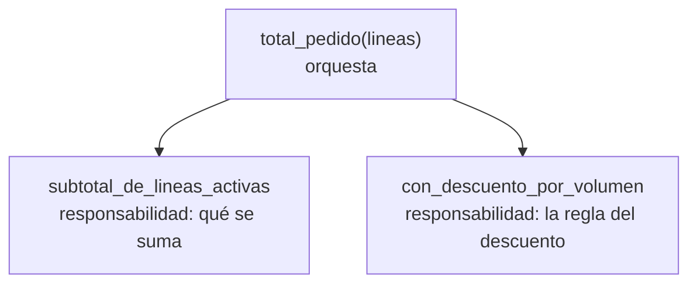

import Reto from "@components/Reto.astro";
import Solucion from "@components/Solucion.astro";
import Quiz from "@components/Quiz.astro";
import CheckDominio from "@components/CheckDominio.astro";
import Nivel from "@components/Nivel.astro";

<Nivel nivel="intermedio" />

Ya sabes escribir funciones, bucles y diccionarios que **funcionan** (eso vino de la [Fase 1](/fase-1-lenguajes/)). Esta sub-unidad no añade ninguna construcción nueva del lenguaje: añade el **criterio** que separa al código que funciona del código que otra persona —incluido tú dentro de seis meses— puede **leer, cambiar y confiar sin miedo**. Clean code es eso: optimizar para el lector, no para el compilador. El computador ejecuta cualquier cosa; el ser humano que tiene que mantenerla, no.

> La trampa de esta lección: "código limpio" suena a opinión y a gusto personal, y por eso se enseña mal (reglas memorizadas y aplicadas a ciegas). Aquí lo vas a tratar como lo que es —una **disciplina con trade-offs**—: cada regla tiene un *por qué*, y cada regla tiene un *cuándo no*. El junior aprende la regla. El semi-senior aprende cuándo romperla.

:::tip[Si ya lo tocaste]
Si ya escribiste código "ordenado" en proyectos previos, no te saltes la lección: úsala como **diagnóstico**. Salta directo a los **dos ejercicios Primero-Sin-IA** (sección 7) y resuélvelos a mano. Si logras el refactor del ejercicio A **manteniendo los tests en verde** y puedes defender, en el ejercicio B, **cuándo NO aplicar DRY**, valida con el check de dominio (sección 8) y avanza a [2.3 Code smells y refactoring](/fase-2-ingenieria/2-3-code-smells-refactoring/). Si dudaste en la duplicación incidental del ejercicio B, vuelve a la sección 4.4: es justo lo que distingue criterio de dogma.
:::

## 1. Qué vas a saber hacer

Al terminar, sin IA y sin notas, podrás:

- **O1 — Renombrar** variables y funciones para que **revelen intención** (eliminar `d`, `tmp`, `flag`, índices mágicos como `i[1]`) **sin cambiar el comportamiento**, usando los tests como red de seguridad.
- **O2 — Descomponer** una función que hace varias cosas en **funciones pequeñas con una sola responsabilidad**, y **explicar el trade-off** del criterio "una sola razón para cambiar".
- **O3 — Aplicar DRY/KISS/YAGNI con criterio**: decidir **cuándo extraer y cuándo NO**, distinguiendo duplicación real de duplicación incidental, y defender la decisión.

## 2. Por qué importa (el dinero está aquí)

> 💰 **Por qué importa:** testing, código limpio y patrones son **expectativa semi-senior**. Los juniors los saltan; por eso cobran menos. Escribir código que funciona es el piso; escribir código que el equipo puede mantener es lo que se paga.

Esto no es estética. Tiene consecuencias medibles en tu día a día y en tu sueldo:

- **El código se lee ~10 veces más de lo que se escribe.** Cada hora que ahorras escribiéndolo críptico se la cobras (con intereses) a quien lo lea después —casi siempre tú—. La legibilidad es velocidad de equipo.
- **Es el filtro silencioso de las entrevistas.** En un live coding, resolver el problema es la mitad. La otra mitad es: ¿tus nombres se entienden?, ¿partiste el problema en piezas?, ¿el revisor puede seguir tu razonamiento? Un semi-senior se delata ahí.
- **Es la base del trabajo con IA.** Cuando le pides a un modelo que modifique tu código, el modelo lee tus nombres igual que un humano: si tu función se llama `proc(d, x)`, la IA adivina; si se llama `aplicar_descuento(pedido, tasa)`, la IA acierta. Código limpio = mejores prompts implícitos.
- **Código que no se entiende no se puede auditar.** Una función de 80 líneas que hace seis cosas esconde bugs y huecos de seguridad a plena vista. La claridad es un prerrequisito de la revisión —y de la seguridad— que verás formalizada en [2.13](/fase-2-ingenieria/2-13-colaboracion-spec-driven-adrs/).

## 3. Lo que ya traes (actívalo)

Esta lección se para sobre cosas que ya sabes hacer:

- De [0.7 Fundamentos de programación](/fase-0-fundamentos/0-7-fundamentos-programacion/): **funciones, parámetros y scope**. Una función pequeña es una función que **nombra** un trozo de lógica.
- De [1.1 Python básico→intermedio](/fase-1-lenguajes/1-1-python-basico-intermedio/): **tuplas, dicts y desempaquetado** (`a, b = par`). El desempaquetado con nombres es tu mejor arma contra los índices mágicos.
- De [1.2 Python intermedio](/fase-1-lenguajes/1-2-python-intermedio/): las **comprehensions** y los **generadores**. Reescribir un bucle con acumulador como `sum(... for ...)` no es solo más corto: nombra la intención ("la suma de").
- De [2.1 DSA nivel trabajo](/fase-2-ingenieria/2-1-dsa-nivel-trabajo/): leer código y predecir qué hace. Aquí lo vamos a usar para **sentir** cuánto más lento se lee el código mal nombrado.

Antes de seguir, responde de memoria:

<Quiz
  question="¿Por qué un nombre como `total_neto` es mejor que un comentario `# este es el total neto` encima de una variable `x`?"
  options={[
    "Porque el nombre viaja con el valor a todos lados; el comentario se queda atrás y miente cuando el código cambia",
    "Porque los comentarios son más lentos de ejecutar",
    "Porque Python prohíbe los comentarios en producción",
  ]}
  answer={0}
  explanation="Un buen nombre es un comentario que no se puede desincronizar: acompaña a la variable en cada uso. Un comentario describe el código en un solo lugar y, cuando el código cambia y el comentario no, se vuelve una mentira peligrosa. Por eso 'el mejor comentario es un buen nombre'."
/>

## 4. Ejemplo resuelto, pensado en voz alta

Te voy a mostrar un refactor real de principio a fin. **No leas esto como reglas: léelo como me oirías razonar al lado tuyo.** Partimos de código que funciona pero que cuesta leer, y lo limpiamos en pasos pequeños, **sin cambiar lo que hace**.

Este es el punto de partida. Calcula el total a pagar de un pedido (una lista de líneas; cada línea es una tupla `(producto, precio, cantidad, activo)`), sumando solo las líneas activas y aplicando un 10% de descuento si el subtotal supera los 100.000:

```python
def calc(d):
    r = 0
    for i in d:
        if i[3] == True:
            r = r + i[1] * i[2]
    if r > 100000:
        r = r - int(r * 0.1)
    return r
```

Pienso en voz alta: *"Funciona, pero tuve que ejecutarlo en mi cabeza para saber qué hace. `calc` no me dice nada. `d`, `r`, `i` no me dicen nada. `i[1] * i[2]` me obliga a recordar qué hay en cada posición de la tupla. `100000` y `0.1` aparecen de la nada. Y la función hace **tres cosas**: filtra activas, suma, y aplica un descuento. Voy a arreglar esto en pasos chicos, y después de **cada** paso confirmo que sigue dando lo mismo."*

### 4.1 Paso 1 — nombres que revelan intención

Primero, los nombres. La regla operativa: **el nombre debe responder qué es, sin que tengas que leer cómo se calcula.**

```python
def total_pedido(lineas):
    total = 0
    for linea in lineas:
        producto, precio, cantidad, activo = linea   # desempaqueto: adiós a los índices mágicos
        if activo:                                    # adiós al "== True"
            total = total + precio * cantidad
    if total > 100000:
        total = total - int(total * 0.1)
    return total
```

Razono qué cambié y por qué:
- `calc` → `total_pedido`. Una función se nombra por **lo que produce**, normalmente un sustantivo o un verbo + sustantivo. Ahora la firma sola ya te dice qué esperar.
- `d` → `lineas`, `i` → `linea`, `r` → `total`. Nombres del **dominio**, no de la mecánica. `total` no es solo "una variable que acumula": es *el total*.
- `i[1] * i[2]` → desempaqueto la tupla en `producto, precio, cantidad, activo`. Ahora `precio * cantidad` se lee solo. Los **índices mágicos** son una de las peores fuentes de bugs: un día insertas un campo y todos los `i[2]` apuntan a otra cosa.
- `if i[3] == True` → `if activo`. Comparar un booleano con `True` es redundante (`activo` ya *es* el booleano) y delata a quien no confía en lo que escribió.

### 4.2 Paso 2 — nombra los números mágicos

`100000` y `0.1` son **números mágicos**: literales sin nombre cuyo significado vive solo en tu cabeza. Les pongo nombre con constantes:

```python
UMBRAL_DESCUENTO_VOLUMEN = 100_000   # CLP a partir de los cuales aplica el descuento
TASA_DESCUENTO_VOLUMEN = 0.10        # 10%

def total_pedido(lineas):
    total = 0
    for linea in lineas:
        producto, precio, cantidad, activo = linea
        if activo:
            total = total + precio * cantidad
    if total > UMBRAL_DESCUENTO_VOLUMEN:
        total = total - int(total * TASA_DESCUENTO_VOLUMEN)
    return total
```

*"Ahora, si mañana el negocio cambia el umbral a 150.000, lo cambio en **un** lugar con un nombre que explica qué es. Y `100_000` con guion bajo se lee de un vistazo como cien mil, no como diez mil o un millón."*

### 4.3 Paso 3 — una función, una responsabilidad

`total_pedido` todavía hace dos trabajos distintos: **(a)** sumar las líneas activas y **(b)** aplicar el descuento por volumen. El criterio no es "cuenta las líneas": es **"¿cuántas razones distintas tendría para cambiar esta función?"** Tiene dos (cambia la regla de qué se suma, o cambia la regla del descuento). Eso son dos responsabilidades. Las separo:

```python
UMBRAL_DESCUENTO_VOLUMEN = 100_000
TASA_DESCUENTO_VOLUMEN = 0.10


def total_pedido(lineas):
    subtotal = subtotal_de_lineas_activas(lineas)
    return con_descuento_por_volumen(subtotal)


def subtotal_de_lineas_activas(lineas):
    subtotal = 0
    for linea in lineas:
        producto, precio, cantidad, activo = linea
        if activo:
            subtotal += precio * cantidad
    return subtotal


def con_descuento_por_volumen(subtotal):
    if subtotal > UMBRAL_DESCUENTO_VOLUMEN:
        return subtotal - int(subtotal * TASA_DESCUENTO_VOLUMEN)
    return subtotal
```

Pienso en voz alta: *"Ahora `total_pedido` se lee como una frase: 'el total del pedido es el subtotal de las líneas activas, con descuento por volumen'. Cada pieza tiene un nombre que es su contrato. Puedo testear `con_descuento_por_volumen` por separado, sin construir un pedido entero. Y cuando alguien pregunte '¿cómo se calcula el descuento?', voy directo a una función de tres líneas en vez de leer todo."*



### 4.4 Paso 4 — DRY/KISS/YAGNI con criterio (la parte difícil)

Aquí es donde el dogma hace daño. Tres siglas, y para cada una, **cuándo SÍ y cuándo NO**:

- **DRY (Don't Repeat Yourself).** El bucle de `subtotal_de_lineas_activas` se puede comprimir con lo que aprendiste en [1.2](/fase-1-lenguajes/1-2-python-intermedio/), y de paso *nombra* la intención ("la suma de"):

  ```python
  def subtotal_de_lineas_activas(lineas):
      return sum(precio * cantidad
                 for _, precio, cantidad, activo in lineas
                 if activo)
  ```

  Esto es buen DRY: una sola expresión, legible, que dice lo que hace. **Pero DRY no es "nunca dos líneas parecidas".** DRY es *"cada pieza de conocimiento del sistema debe tener una sola representación"*. La clave es **conocimiento**, no **texto**. Dos trozos que se parecen pero representan **decisiones distintas** NO deben unirse: el día que una cambie, la otra no debería seguirla. Unir duplicación incidental crea un acoplamiento falso que después duele desenredar. (Lo practicas a fondo en el ejercicio B.)

- **KISS (Keep It Simple).** Resistí la tentación de meter el descuento dentro del `sum` con un condicional anidado. Dos funciones simples le ganan a una "ingeniosa". Si no la lees en voz alta de corrido, es demasiado lista.

- **YAGNI (You Aren't Gonna Need It).** No agregué un parámetro `tipo_descuento="volumen"` "por si mañana hay otros descuentos", ni una jerarquía de clases `Descuento`. Hay **un** descuento hoy. Construir para un futuro imaginado es deuda que pagas ahora por un beneficio que quizá nunca llega. Cuando aparezca el segundo descuento, refactorizo —**con** la información real del caso real—, no antes.

> El hilo invisible de todo este refactor: **cada paso preservó el comportamiento, y lo sé porque corrí los tests después de cada uno.** Refactorizar sin una red de tests no es refactorizar: es reescribir con los ojos cerrados. Ese es el puente a [2.7 TDD](/fase-2-ingenieria/2-7-tdd-obligatorio/).

## 5. Errores de criterio que vas a tener (y por qué)

:::caution[Podrías pensar que "más corto = más limpio"]
No. Limpio es **claro**, no **corto**. `t=sum(l[1]*l[2] for l in d if l[3])` es cortísimo y es basura: ahorra teclas hoy y cobra minutos de descifrado cada vez que alguien lo lea. La meta es minimizar el **esfuerzo de lectura**, no los caracteres. Cuando claridad y brevedad chocan, gana claridad —siempre—.
:::

:::caution[Podrías pensar que comentar mucho hace el código más limpio]
Un comentario que explica *qué* hace una línea (`total += precio  # suma el precio`) es ruido: el código ya lo dice. Peor: cuando el código cambia y el comentario no, el comentario **miente**, y una mentira es peor que ningún comentario. La regla: **prefiere un buen nombre a un comentario.** Reserva los comentarios para el *por qué* que el código no puede expresar ("usamos `int()` porque el CLP no admite decimales", "este orden importa por un bug del proveedor X").
:::

:::caution[Podrías pensar que DRY significa que dos líneas iguales SIEMPRE deben unirse]
Este es el error más caro de la lección. Dos funciones que hoy comparten la línea `len(x) >= 3` pueden estar validando cosas **sin nada que ver** (un RUT y un SKU). Si las unificas en un `validar_largo(x)`, las **acoplas**: el día que el RUT cambie su regla, tu cambio rompe el SKU en silencio. Eso es *duplicación incidental*, y la respuesta correcta es **dejarla separada**. Regla de oro: extrae cuando los trozos representan **el mismo conocimiento** (cambian juntos por la misma razón); déjalos cuando solo **se parecen** (cambiarían por razones distintas). "Duplicación es más barata que la abstracción equivocada."
:::

:::caution[Podrías pensar que "funciones de una sola responsabilidad" = "funciones de una sola línea"]
SRP no se mide en líneas. Se mide en **razones para cambiar**. Una función de 15 líneas que hace una sola cosa coherente está perfecta; una de 4 líneas que mezcla dos decisiones distintas no. Partir por partir —extraer una función que se usa una vez y solo agrega un salto mental— puede empeorar la legibilidad. El criterio es semántico, no aritmético.
:::

## 6. Práctica con andamiaje (que se desvanece)

Tres pasos, de más apoyo a menos. **A mano primero**, sin ejecutar y sin IA.

### 6.1 PREDICT — siente el costo de los malos nombres

Lee esta función (no la ejecutes) y responde: ¿qué devuelve `f([4, 11, 15, 22, 30], 10)`? Cronométrate mentalmente: vas a notar cuánto más lento se lee por culpa de los nombres.

```python
def f(a, b):
    c = []
    for d in a:
        if d % 2 == 0 and d > b:
            c.append(d)
    return c
```

<Solucion title="Ver la respuesta (solo después de predecir)">

Devuelve `[22, 30]`: los números **pares** (`d % 2 == 0`) **mayores que 10** (`d > b`). De `[4, 11, 15, 22, 30]`: 4 es par pero no > 10; 11 y 15 son > 10 pero impares; 22 y 30 cumplen ambas.

Lo importante no es el resultado: es que tuviste que **decodificar** `f`, `a`, `b`, `c`, `d` antes de razonar. Con nombres con intención —`pares_mayores_que(numeros, minimo)`, `resultado`, `numero`— habrías entendido el *qué* sin leer el *cómo*. Ese costo de decodificación, multiplicado por cada lectura durante años, es lo que clean code elimina.
</Solucion>

### 6.2 Parsons — reordena un refactor

Estas líneas son la versión limpia de la función de arriba, pero están **desordenadas**. Reescríbelas en el orden correcto (cuida la indentación):

```text
    return [n for n in numeros if n % 2 == 0 and n > minimo]
def pares_mayores_que(numeros, minimo):
```

…y, como segundo nivel, decide: ¿conviene además extraer el predicado `n % 2 == 0 and n > minimo` a una función `es_par_y_mayor(n, minimo)`?

<Solucion title="Ver el orden correcto y el criterio">

```python
def pares_mayores_que(numeros, minimo):
    return [n for n in numeros if n % 2 == 0 and n > minimo]
```

Sobre extraer el predicado: para **una** condición simple usada **una** vez, extraerla agrega un salto mental sin pagar legibilidad —es partir por partir (ver el último `:::caution`)—. La comprehension ya se lee como una frase. Extraerías el predicado si **(a)** se repitiera en varios lugares (ahí sí DRY), o **(b)** la condición fuera tan compleja que su nombre la explicara mejor que su código. Aquí, no: déjala inline. Eso es KISS con criterio.
</Solucion>

### 6.3 MODIFY — termina un refactor a medias

Esta función está **a mitad de limpiar**. Los nombres ya mejoraron, pero todavía hace dos cosas (validar y formatear) y tiene un número mágico. Termínala: separa la validación del formateo en dos funciones, y nombra el `19`.

```python
def procesar_precio(neto):
    if neto < 0:
        raise ValueError("el neto no puede ser negativo")
    con_impuesto = neto + int(neto * 0.19)
    return f"$ {con_impuesto}"
```

Pista: una función `validar_neto(neto)` que lanza si es inválido, y una `con_iva(neto)` que devuelve el entero con impuesto; `procesar_precio` las orquesta y formatea. El `0.19` es la tasa de IVA: dale un nombre. Confirma a mano que `procesar_precio(10000)` sigue devolviendo `"$ 11900"`.

## 7. Ejercicios Primero-Sin-IA

Sin andamiaje. Resuélvelos **a mano, sin IA** dentro del timebox. Los dos parten de código que **ya funciona y con los tests en verde**: tu trabajo es mejorar la legibilidad **sin romper nada**. Esa es la esencia del refactor —y los tests verdes son tu red de seguridad, no un trámite—.

<Reto title="Refactor: nombres con intención + funciones pequeñas, sin romper los tests" timebox="30–40 min">

Te dan `total_pedido(lineas)`: funciona, pasa todos los tests, y es ilegible (nombres de una letra, índices mágicos, números mágicos, una función que hace tres cosas). Tu tarea: **refactorizarla** para que revele intención, **sin cambiar su comportamiento ni su firma pública**. Los tests deben seguir **verdes después de cada cambio**.

Entregable: tu solución en `ejercicios/fase-2/clean-code-refactor-nombres-funciones/`, con los tests en verde y **un test borde tuyo** agregado.

**Hecho significa:**
- [ ] No quedan nombres sin intención (`d`, `r`, `i`, `x`, `tmp`) ni índices mágicos (`linea[1]`); usaste desempaquetado o nombres del dominio.
- [ ] Los números mágicos (`100000`, `0.1`) están en **constantes con nombre**.
- [ ] La función está **descompuesta** en piezas con una sola responsabilidad (al menos: sumar líneas activas / aplicar descuento), cada una nombrada por lo que hace.
- [ ] **Todos los tests siguen en verde** y la firma pública `total_pedido(lineas)` no cambió.
- [ ] Agregaste un test borde tuyo y puedes **explicar sin notas** por qué tu versión se lee mejor que la original.

Enunciado completo, *starter* y tests: `ejercicios/fase-2/clean-code-refactor-nombres-funciones/` (carpeta del repo).

<Solucion title="Pista (ábrela solo si superaste el timebox)">
Avanza en pasos pequeños y corre los tests entre cada uno: (1) renombra variables a nombres del dominio; (2) desempaqueta la tupla (`producto, precio, cantidad, activo = linea`) para matar los índices; (3) sube los literales a constantes `UMBRAL_...` y `TASA_...`; (4) extrae el descuento y la suma a funciones separadas. Si los tests se ponen rojos en algún paso, deshaz ese paso: cambiaste comportamiento, que es justo lo que un refactor NO hace. Esto es una pista, no la solución.
</Solucion>

</Reto>

<Reto title="DRY/KISS/YAGNI con criterio: extrae lo que toca, resiste lo que no" timebox="35–45 min">

Te dan `facturacion.py` con cuatro funciones que **funcionan y pasan los tests**, pero tienen tres problemas de criterio distintos: **(a)** duplicación real (la fórmula del IVA copiada), **(b)** una trampa de duplicación *incidental* (dos validadores que se parecen pero modelan cosas distintas) y **(c)** sobre-ingeniería (una función con parámetros que nadie usa). Aplica el principio correcto a cada caso —y **resiste** aplicarlo donde no toca—. Los tests deben quedar **verdes**.

Además del código, entrega un `decisiones.md` corto (estilo mini-ADR): para cada uno de los tres casos, **una o dos frases** justificando qué hiciste y por qué. La decisión de **no** unificar los validadores es tan importante como las que sí.

Entregable: tu solución en `ejercicios/fase-2/clean-code-dry-kiss-yagni/` (`facturacion.py` refactorizado + `decisiones.md`), con los tests en verde.

**Hecho significa:**
- [ ] La fórmula del IVA vive en **un** solo lugar (DRY real aplicado) y las dos funciones que la usaban la reusan.
- [ ] Los dos validadores **siguen separados** (resististe la falsa DRY) y tu `decisiones.md` explica por qué unirlos sería un error.
- [ ] La función sobre-parametrizada quedó **simplificada** a lo que de verdad se usa (KISS/YAGNI), sin perder comportamiento.
- [ ] **Todos los tests siguen en verde.**
- [ ] `decisiones.md` tiene las tres decisiones, cada una con su porqué, en lenguaje claro.

Enunciado completo, *starter* y tests: `ejercicios/fase-2/clean-code-dry-kiss-yagni/` (carpeta del repo).

<Solucion title="Pista (ábrela solo si superaste el timebox)">
Pregúntate, por cada par de trozos parecidos: *"si esta regla cambiara mañana, ¿la otra debería cambiar con ella?"*. Si la respuesta es sí (la fórmula del IVA: si sube el IVA, ambas suben), es el **mismo conocimiento** → extrae. Si es no (el RUT y el SKU validan largo por razones que no tienen relación), es **incidental** → déjalos. Para la sobre-ingeniería: mira cómo se **llama** la función en los tests; si nadie usa los parámetros extra, no existen para tu caso real (YAGNI) y sobran (KISS). Esto es una pista, no la solución.
</Solucion>

</Reto>

## 8. Check de dominio

Sin mirar la lección, en voz alta o por escrito:

<CheckDominio
  items={[
    "Tomar una función con nombres crípticos e índices mágicos y reescribirla con nombres que revelan intención, sin cambiar lo que hace.",
    "Explicar el criterio de 'una sola responsabilidad' en términos de 'razones para cambiar', no de líneas.",
    "Dar un ejemplo de duplicación que SÍ conviene unificar (DRY) y uno que NO (incidental), y justificar la diferencia.",
    "Explicar por qué un buen nombre le gana a un comentario, y cuándo un comentario sí aporta.",
    "Defender por qué NO agregaste un parámetro 'por si acaso' (YAGNI) en una función concreta.",
    "Explicar por qué refactorizar exige tener tests verdes antes de empezar.",
  ]}
/>

Si marcaste menos de cinco, vuelve a la sección correspondiente **antes** de avanzar. No es un examen: es honestidad contigo.

<Quiz
  question="Tienes `calcular_iva_boleta(neto)` y `calcular_iva_factura(neto)`, ambas con la línea `return neto + int(neto * 0.19)`. ¿Qué haces?"
  options={[
    "Las unifico de inmediato en una sola función: dos líneas iguales son duplicación y DRY manda siempre",
    "Extraigo la fórmula del IVA a una función `con_iva(neto)` y ambas la reusan, porque si el IVA cambia las dos cambian por la misma razón",
    "Las dejo idénticas y copio-pego: tocar código que funciona es peligroso",
  ]}
  answer={1}
  explanation="Acá la duplicación es REAL: boleta y factura aplican el MISMO conocimiento (la tasa de IVA). Si el IVA sube al 20%, ambas deben cambiar por la misma razón, así que extraer `con_iva(neto)` es DRY bien aplicado. Sería incidental —y NO deberías unir— si las dos líneas se parecieran pero representaran reglas independientes que cambian por razones distintas."
/>

## 9. Recursos (documentación oficial primero)

- **PEP 8 — Style Guide for Python Code** — [peps.python.org/pep-0008/](https://peps.python.org/pep-0008/). La guía oficial; lee en particular la sección de *Naming Conventions*.
- **PEP 20 — The Zen of Python** — [peps.python.org/pep-0020/](https://peps.python.org/pep-0020/). "Simple is better than complex" (KISS) y "Readability counts" en 19 líneas. Córrelo con `python -c "import this"`.
- **Refactoring catalog (Martin Fowler)** — [refactoring.com/catalog](https://refactoring.com/catalog/). Referencia autorizada; mira *Rename Variable*, *Extract Function* y *Replace Magic Literal with Symbolic Constant* (los tres que usaste hoy).
- **The Wrong Abstraction (Sandi Metz)** — [sandimetz.com/blog/2016/1/20/the-wrong-abstraction](https://sandimetz.com/blog/2016/1/20/the-wrong-abstraction). El mejor texto corto sobre por qué DRY mal aplicado duele más que la duplicación.
- **Honestidad sobre el dogma:** el libro *Clean Code* (Robert C. Martin) popularizó muchas de estas ideas y vale leerlo, pero algunas de sus reglas (funciones de 2–4 líneas, "una sola assertion") son **opiniones discutidas** en la industria, no leyes. Tómalas como heurísticas con trade-offs, que es justo el enfoque de esta lección.

## 10. Conexión con el capstone de la fase

El **[Capstone F2 — Refactor + suite de tests](/fase-2-ingenieria/proyecto/)** es, literalmente, esta lección a escala. Vas a tomar el proyecto de la Fase 1 y dejarlo limpio: nombres con intención en todo el código, funciones con una sola responsabilidad, y DRY/KISS/YAGNI aplicados **con criterio y justificados** en el `ARQUITECTURA.md` con ADRs.

Lo que practicaste hoy es el músculo central de ese capstone:
- El ejercicio A es el refactor de nombres y funciones que harás en cada archivo.
- El ejercicio B —y su `decisiones.md`— es exactamente el tipo de razonamiento que irá en tus ADRs: *por qué* extrajiste algo, y *por qué* dejaste otra cosa duplicada a propósito.
- Y la red de tests verde que mantuviste en ambos es el prerrequisito que [2.3 Code smells](/fase-2-ingenieria/2-3-code-smells-refactoring/) y [2.7 TDD](/fase-2-ingenieria/2-7-tdd-obligatorio/) van a formalizar. No estás aprendiendo a "ordenar código": estás construyendo el criterio que el capstone evalúa.

## 11. Reflexión y repaso espaciado

Cierra escribiendo dos o tres frases: **¿cuál de los tres principios (DRY, KISS, YAGNI) te costó más aplicar *con criterio*, y en qué momento estuviste a punto de aplicarlo donde no tocaba?** Nombrar la tentación con precisión ("casi unifico los dos validadores solo porque se parecían") es lo que la vuelve un hábito que reconoces la próxima vez.

Gancho de **spaced repetition**:

- **Mañana:** toma el `total_pedido` del ejercicio A y reescríbelo **de memoria**, limpio, sin mirar tu solución. Si no puedes, no internalizaste el patrón —vuelve a la sección 4—.
- **En 3 días:** abre cualquier función fea de un proyecto viejo tuyo (todos tienen una) y dale un solo refactor de nombres. Cronométrate: vas a sentir cuánto más rápido la entiendes después.
- **En 1 semana:** explícale a alguien (o a una grabación) la diferencia entre duplicación real e incidental con un ejemplo propio. Si lo explicas claro, lo dominas.
