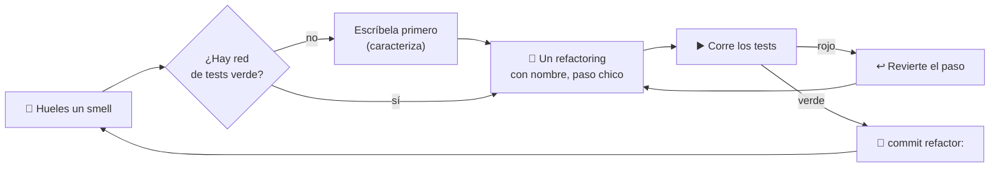

import Reto from "@components/Reto.astro";
import Solucion from "@components/Solucion.astro";
import Quiz from "@components/Quiz.astro";
import CheckDominio from "@components/CheckDominio.astro";
import Nivel from "@components/Nivel.astro";

<Nivel nivel="intermedio" />

En [`2.2`](/fase-2-ingenieria/2-2-clean-code/) aprendiste cómo se ve el código limpio. Esta lección responde a la pregunta que sigue de inmediato: **tengo código que ya está escrito y huele mal — ¿cómo lo mejoro sin romperlo?** La respuesta tiene un nombre, una disciplina y un catálogo: se llama **refactoring**, y es una de las habilidades que más distingue a un semi-senior de un junior.

Un **code smell** (literalmente, "olor a código") es un síntoma en la superficie del código que *sugiere* un problema más profundo. No es un bug: el código funciona. Es una señal de que la estructura va a dolerte cuando tengas que cambiarla. El smell es el **gatillo**; el refactoring es la **respuesta**; y —esto es lo que casi nadie te dice— los patrones de diseño que verás en [`2.5`](/fase-2-ingenieria/2-5-patrones-diseno/) suelen ser el **destino** al que llegas refactorizando, no algo que impones desde el día uno.

:::tip[Si ya refactorizaste antes]
¿Ya "limpiaste código" en tu trabajo? Úsalo como diagnóstico, no como excusa para saltar. La trampa del que "ya refactoriza" es hacerlo **sin red de tests** y **mezclando cambios de comportamiento con cambios de estructura** en el mismo commit. Salta a los **dos ejercicios Primero-Sin-IA** (sección 7): el primero mide si aplicas refactorings *con nombre* sin romper una suite verde; el segundo —el difícil— mide si sabes **caracterizar** código legado *sin tests* antes de tocarlo. Si los cierras limpio en el timebox, valida con el check de dominio (sección 8). Si te trabas, el problema casi siempre es la sección 4.1.
:::

## 1. Qué vas a saber hacer

Al terminar, sin IA y sin notas, podrás:

- **O1 — Identificar** al menos seis code smells en una función real (long function, duplicated code, magic numbers, mysterious name, nested conditionals, comment-as-deodorant) y **nombrar** el refactoring del catálogo de Fowler que cada uno gatilla.
- **O2 — Refactorizar** una función en **pasos pequeños y reversibles**, corriendo la suite de tests después de cada paso, sin alterar su comportamiento observable.
- **O3 — Explicar el trade-off** entre refactorizar y reescribir, y por qué una **red de tests** (y separar el `refactor:` del `feat:`/`fix:`) es un prerrequisito y no un lujo.

## 2. Por qué importa (el dinero está aquí)

> 💰 **Por qué importa:** testing, código limpio y patrones son expectativa semi-senior; los juniors los saltan y por eso cobran menos. Pero el código limpio rara vez nace limpio: **se cultiva refactorizando**. En cualquier trabajo real, el 90% de tu tiempo es modificar código que ya existe —tuyo o ajeno—, no escribir en una hoja en blanco. Quien sabe entrar a un módulo enredado, ponerle una red de tests y dejarlo mejor de lo que lo encontró **sin romper producción** es exactamente quien vale la banda que buscas.

Dos razones hacen de esta sub-unidad una bisagra de la Fase 2:

1. **Refactoring es el verbo de todo lo demás.** SOLID ([`2.4`](/fase-2-ingenieria/2-4-solid-con-critica/)) no se "aplica" de un día para otro: llegas a él refactorizando smells. Los patrones ([`2.5`](/fase-2-ingenieria/2-5-patrones-diseno/)) "emergen" cuando refactorizas duplicación o condicionales. El capstone de la fase es, literalmente, *refactor + suite de tests*. Sin esta habilidad, el resto de la fase es vocabulario sin acción.
2. **Es la otra cara del Primero-Sin-IA.** Pedirle a una IA "limpia este código" y aceptar el resultado a ciegas es la forma más rápida de meter un cambio de comportamiento sin darte cuenta. Refactorizar a mano, en pasos chicos, con tests que te avisan, es el músculo que te hace dueño del código en vez de pasajero.

## 3. Lo que ya traes (actívalo)

Esta lección se para sobre lo anterior. Reúsalo antes de seguir:

- De [`1.6` Primer test con pytest](/fase-1-lenguajes/1-6-primer-test-pytest/) y [`2.6` Testing](/fase-2-ingenieria/2-6-testing-fundamentos/): **la suite verde**. Refactorizar *es* cambiar el código mientras los tests siguen en verde. Sin tests, no estás refactorizando: estás "cambiando cosas y rezando".
- De [`2.2` Clean code](/fase-2-ingenieria/2-2-clean-code/): nombres con intención, funciones pequeñas, DRY/KISS/YAGNI. Un smell es, casi siempre, la **violación** de uno de esos principios hecha visible.
- De [`1.6`](/fase-1-lenguajes/1-6-primer-test-pytest/): el ciclo **red-green-refactor**. La "R" final de ese ciclo es justo esto. Hoy le damos nombre y catálogo a ese tercer paso.

Antes de seguir, responde de memoria:

<Quiz
  question="¿Cuál es la definición precisa de refactoring?"
  options={[
    "Reescribir un módulo desde cero para que quede más moderno",
    "Cambiar la estructura interna del código para hacerlo más fácil de entender y modificar, SIN cambiar su comportamiento observable",
    "Arreglar los bugs que un módulo arrastra y, de paso, ordenarlo",
  ]}
  answer={1}
  explanation="Refactoring (Fowler) es un cambio a la estructura interna que NO altera el comportamiento observable: misma entrada, misma salida. Reescribir desde cero es otra cosa (rewrite). Y arreglar bugs cambia el comportamiento: eso es un fix, va en otro commit y con su propio test. Mezclarlos es el error #1."
/>

## 4. Ejemplo resuelto, pensado en voz alta

Voy a refactorizar una función real, paso a paso. **No la leas como un resultado terminado: léela como me oirías razonar si estuviera al lado tuyo.** La función clasifica el índice de masa corporal (IMC) de una persona. Funciona —pasa sus tests— pero apesta. Vamos a dejarla limpia *sin cambiar lo que devuelve para ninguna entrada*.

Punto de partida (el código que "huele"):

```python
def f(p, a):
    # p = peso en kg, a = altura en metros
    x = p / (a * a)
    # clasificar el resultado
    if x < 18.5:
        r = "bajo peso"
    else:
        if x < 25:
            r = "normal"
        else:
            if x < 30:
                r = "sobrepeso"
            else:
                r = "obesidad"
    return r
```

### 4.1 Primero, la red de seguridad (esto NO es opcional)

Razono en voz alta: *"Antes de mover una sola línea, necesito tests que pinten el comportamiento actual. Si no los tengo, no puedo saber si mi 'mejora' rompió algo. Esta es la regla de oro del refactoring: **sin tests verdes, no se refactoriza**. Escribo unos pocos casos que cubren cada rama y, sobre todo, los **bordes** (18.5, 25, 30), que es donde un refactor descuidado mete bugs."*

```python
import pytest
from imc import f

@pytest.mark.parametrize("peso, altura, esperado", [
    (50, 1.75, "bajo peso"),     # imc 16.3
    (68, 1.75, "normal"),        # imc 22.2
    (80, 1.75, "sobrepeso"),     # imc 26.1
    (100, 1.75, "obesidad"),     # imc 32.7
    (56.65625, 1.75, "normal"),  # imc EXACTO 18.5 -> "normal" (frontera: < usa el de abajo)
])
def test_clasifica_imc(peso, altura, esperado):
    assert f(peso, altura) == esperado
```

Corro `pytest` → **verde**. Razono: *"Ahora tengo una red. Cualquier paso que ponga esto en rojo me grita 'cambiaste el comportamiento'. Fíjate en el caso frontera de 18.5 exacto: con `x < 18.5`, un IMC de 18.5 cae en `else` → 'normal'. Eso es el comportamiento **actual**, lo correcto o no es otra discusión. Mi trabajo hoy es preservarlo, no juzgarlo."*

### 4.2 Smell: *Mysterious Name* → refactoring **Rename**

Razono: *"`f`, `p`, `a`, `x`, `r` no le dicen nada a nadie. El primer smell, y el más barato de arreglar, son los **nombres misteriosos**. El refactoring se llama **Rename Variable / Rename Function**. Es mecánico y bajo riesgo, pero corro los tests igual después."*

```python
def clasificar_imc(peso_kg, altura_m):
    imc = peso_kg / (altura_m * altura_m)
    if imc < 18.5:
        categoria = "bajo peso"
    else:
        if imc < 25:
            categoria = "normal"
        else:
            if imc < 30:
                categoria = "sobrepeso"
            else:
                categoria = "obesidad"
    return categoria
```

Corro `pytest` → verde. (El test importaba `f`; ajusto el import a `clasificar_imc`. El cambio de nombre público *es* parte del refactor.) Razono: *"Ya se lee infinitamente mejor y todavía no toqué la lógica. Un commit acá: `refactor: renombra clasificar_imc y sus variables`. Pequeño y reversible."*

### 4.3 Smell: *Magic Numbers* → refactoring **Replace Magic Literal with Symbolic Constant**

Razono: *"`18.5`, `25`, `30` son **números mágicos**: aparecen sin explicación. ¿Qué son? Los umbrales de la OMS. Si los nombro, el código se auto-documenta y, si mañana cambian, hay **un solo lugar** que tocar."*

```python
IMC_BAJO_PESO = 18.5
IMC_NORMAL = 25.0
IMC_SOBREPESO = 30.0

def clasificar_imc(peso_kg, altura_m):
    imc = peso_kg / (altura_m * altura_m)
    if imc < IMC_BAJO_PESO:
        categoria = "bajo peso"
    else:
        if imc < IMC_NORMAL:
            categoria = "normal"
        else:
            if imc < IMC_SOBREPESO:
                categoria = "sobrepeso"
            else:
                categoria = "obesidad"
    return categoria
```

Corro `pytest` → verde. Razono: *"Nota que el **comentario** `# clasificar el resultado` desapareció: cuando el código se explica solo, el comentario sobra. Un comentario que repite lo que el código ya dice es un smell aparte —**Comments** usados como desodorante para tapar código poco claro—. La cura no es escribir mejores comentarios: es escribir código que no los necesite."*

### 4.4 Smell: *Nested Conditional* → refactoring **Decompose / aplanar el condicional**

Razono: *"La escalera de `if/else` anidados crece hacia la derecha como una flecha (`arrow code`). Cada nivel de anidación es una cosa más que mi cabeza tiene que sostener. Como aquí cada rama *asigna y sale*, puedo aplanarla a una cadena `if/elif` —misma lógica, la mitad de la carga mental—. Y como cada rama solo asigna `categoria`, puedo **devolver directo** y borrar la variable temporal."*

```python
IMC_BAJO_PESO = 18.5
IMC_NORMAL = 25.0
IMC_SOBREPESO = 30.0

def clasificar_imc(peso_kg, altura_m):
    imc = peso_kg / (altura_m * altura_m)
    if imc < IMC_BAJO_PESO:
        return "bajo peso"
    if imc < IMC_NORMAL:
        return "normal"
    if imc < IMC_SOBREPESO:
        return "sobrepeso"
    return "obesidad"
```

Corro `pytest` → verde. Razono: *"Esto es **Replace Nested Conditional with Guard Clauses** en espíritu: cada `return` temprano es una guarda que saca un caso del camino y deja el resto más plano. El último `return` es el caso por defecto. Pasé de 4 niveles de anidación a cero. Y como cada `if` ya devuelve, no necesito `elif` ni `else`: si llegué a la línea siguiente, es porque la condición anterior fue falsa."*

### 4.5 ¿Y ahora? El smell de la *separación de fases*

Razono: *"La función hace **dos cosas**: (1) calcular el IMC y (2) clasificarlo. Eso es un smell sutil, **Split Phase**: dos responsabilidades pegadas. Podría extraer cada una a su propia función:"*

```python
def calcular_imc(peso_kg, altura_m):
    return peso_kg / (altura_m * altura_m)

def categoria_imc(imc):
    if imc < IMC_BAJO_PESO:
        return "bajo peso"
    if imc < IMC_NORMAL:
        return "normal"
    if imc < IMC_SOBREPESO:
        return "sobrepeso"
    return "obesidad"

def clasificar_imc(peso_kg, altura_m):
    return categoria_imc(calcular_imc(peso_kg, altura_m))
```

Esto usa el refactoring **Extract Function**. Corro `pytest` → verde, y ahora puedo testear el cálculo y la clasificación **por separado**.

:::caution[Pero detente aquí un segundo: ¿lo necesitas?]
Aquí es donde el juicio importa. Para una función de 6 líneas, este último paso puede ser **sobre-ingeniería** (un smell propio: *Speculative Generality*). Lo hago si: (a) el cálculo del IMC se usa en otro lado, o (b) quiero testear la clasificación con IMC ya dado, sin pasar peso/altura. Si nada de eso aplica, la versión de 4.4 ya es excelente y parar ahí es la decisión madura. **Refactorizar no es "aplicar todos los refactorings que conozcas": es aplicar el que el smell justifica, y detenerte.**
:::



### 4.6 Los dos sombreros (Kent Beck)

El cierre conceptual: cuando programas, llevas **un sombrero a la vez**. El sombrero de *añadir función* (`feat:`/`fix:`: cambias comportamiento, escribes un test nuevo que falla y lo haces pasar) o el sombrero de *refactorizar* (`refactor:`: no cambias comportamiento, los tests existentes siguen verdes). **Nunca los dos a la vez.** Si te das cuenta de que para agregar una feature primero necesitas limpiar, te quitas el sombrero de feature, refactorizas (commit aparte), te lo vuelves a poner y agregas la feature. Esa disciplina —visible en tu historial de **Conventional Commits** ([`2.13`](/fase-2-ingenieria/2-13-colaboracion-spec-driven-adrs/))— es lo que hace que un code review sea revisable y que un `git bisect` encuentre el bug.

## 5. Errores que vas a tener (y por qué)

:::caution[Podrías pensar que refactorizar y arreglar bugs es lo mismo "ya que estoy"]
No. Refactoring preserva el comportamiento **exacto**, bugs incluidos. Si mientras limpias notas un bug, **anótalo y arréglalo después**, en un commit separado con su propio test. ¿Por qué tan estricto? Porque si mezclas, y algo se rompe, no sabes si fue tu limpieza o tu arreglo. Y un reviewer que ve `refactor: extrae validación` confía en que el comportamiento no cambió; si escondiste un fix ahí, traicionaste esa confianza. Un sombrero a la vez.
:::

:::caution[Podrías pensar que puedes refactorizar sin tests "porque conoces el código"]
La causa #1 de "refactoré y rompí producción". Tu confianza no es una red de seguridad: los tests sí. Si el código no tiene tests (código legado), tu **primer** trabajo no es refactorizar, es escribir *characterization tests* (golden master) que pinten el comportamiento actual —el del ejercicio 2—. Solo cuando esa red está verde, empiezas a mover código. "Conozco este código" es justo lo que piensas el día antes de romperlo.
:::

:::caution[Podrías pensar que un smell es un bug que hay que arreglar siempre]
Un smell es una *pista*, no un veredicto. Fowler es explícito: un smell "no siempre indica un problema". Un método largo puede estar perfecto si es lineal y claro; tres números mágicos en un script de un solo uso pueden no merecer constantes. El smell te dice **mira aquí**, no **cambia esto ya**. La sobre-aplicación de refactorings —abstraer lo que solo se usa una vez, extraer funciones de una línea— produce su propio smell: *Speculative Generality*. El juicio de cuándo **no** refactorizar es tan semi-senior como el de cuándo sí.
:::

:::caution[Podrías pensar que "refactorizar" significa reescribir el módulo desde cero]
Eso es un *rewrite*, no un refactor, y es una decisión de riesgo completamente distinta. Refactoring es una serie de **transformaciones pequeñas que preservan el comportamiento**, cada una con tests en verde, de modo que en cualquier momento puedes parar y tener código funcionando. Un rewrite tira la red al suelo: durante semanas no tienes nada que funcione, y reintroduces los bugs que el código viejo ya había resuelto en silencio. La regla práctica: **refactoriza por defecto; reescribe solo cuando el diseño es irrecuperable y tienes tests para probar la equivalencia.**
:::

:::caution[Podrías pensar que más pasos pequeños es ineficiente — "lo hago todo de una"]
Al revés. Los pasos chicos *parecen* lentos pero son más rápidos en total, porque cuando un test se pone rojo sabes que la causa está en las últimas tres líneas que tocaste, no en un cambio masivo de 200. Cada paso es reversible (`git checkout` de un archivo). Hacer "todo de una" y descubrir un rojo al final te deja depurando un cambio gigante a ciegas —exactamente el agujero del que querías salir—.
:::

## 6. Práctica con andamiaje (que se desvanece)

Tres niveles, de más apoyo a menos. Hazlos **a mano primero** (predecir antes de ejecutar).

### 6.1 PREDICT — caza el smell y predice la salida

Lee esta función. **Sin ejecutarla**, responde dos cosas: (a) nombra al menos **tres** code smells, y (b) predice qué devuelve `g(85, 2)`.

```python
def g(w, h):
    # calcular y devolver
    b = w / (h * h)
    if b >= 25:
        if b >= 30:
            return "alto"
        else:
            return "medio"
    else:
        return "bajo"
```

<Solucion title="Ver la respuesta (solo después de predecir)">
**(a) Smells:** nombres misteriosos (`g`, `w`, `h`, `b`) → *Mysterious Name*; números mágicos (`25`, `30`) → *Magic Numbers*; condicional anidado innecesario (`if/else` dentro de `if`) → *Nested Conditional*; comentario-desodorante (`# calcular y devolver` no aporta nada) → *Comments*. Cuatro, no tres.

**(b)** `g(85, 2)` → `b = 85 / (2*2) = 85/4 = 21.25`. `21.25 >= 25`? No → cae al `else` → devuelve **`"bajo"`**. Si dijiste "medio" o "alto", leíste el `>= 25` como `>= 21` por inercia: justo el error que un test atrapa y el ojo no. La estructura anidada se aplana sin cambiar nada: `if b >= 30: return "alto"` / `if b >= 25: return "medio"` / `return "bajo"`.
</Solucion>

### 6.2 Parsons — ordena los pasos del refactor seguro

Estos cinco pasos de un refactoring están **desordenados**. Reescríbelos en el único orden que respeta la disciplina ("sin tests no se refactoriza", "un paso a la vez"):

```text
A. Aplica un refactoring con nombre (p. ej. Extract Function) en un solo paso pequeño.
B. Corre la suite: si está roja, no empieces — arréglala o escríbela primero.
C. Haz commit `refactor: ...` y vuelve al smell siguiente.
D. Corre la suite de nuevo: si se puso roja, revierte ese paso; si sigue verde, continúa.
E. Identifica el smell concreto y decide si justifica un cambio (¿o es sobre-ingeniería?).
```

<Solucion title="Ver el orden correcto">
Orden: **B → E → A → D → C**.

1. **B** — Antes que nada, ¿hay red verde? Sin ella, te detienes y la construyes. Es el prerrequisito, va primero.
2. **E** — Identificas el smell y **decides si vale la pena** tocarlo (el juicio del "cuándo no refactorizar").
3. **A** — Aplicas **un** refactoring con nombre, en un paso chico y reversible.
4. **D** — Corres los tests *inmediatamente*: rojo → revierte ese paso (no depures un mar de cambios); verde → sigue.
5. **C** — Commit `refactor:` aislado, y al siguiente smell.

El error clásico es saltarse B (refactorizar sin red) o fusionar A sin D (varios cambios antes de correr tests, perdiendo el "qué paso lo rompió").
</Solucion>

### 6.3 MODIFY — aplica un refactoring con nombre

Toma la función `g` de 6.1. Aplica, en este orden y corriendo los tests mentalmente entre paso y paso: (1) **Rename** todo a nombres con intención; (2) **Replace Magic Literal with Symbolic Constant** para `25` y `30`; (3) **aplana el condicional anidado** a guardas con `return` temprano. Escribe la versión final. Luego pregúntate: ¿extraerías el cálculo `w/(h*h)` a su propia función? Justifica tu respuesta en una frase (pista: ¿se reutiliza?, ¿lo testearías aparte?).

## 7. Ejercicios Primero-Sin-IA

Ahora sin andamiaje. Resuélvelos **a mano, sin IA** dentro del timebox. El primero te da la red de tests verde y mide si refactorizas *con nombre* sin romperla; el segundo —el realista y difícil— te da código legado **sin tests** y mide si sabes construir la red **antes** de tocar nada. Está bien que sea lento: el músculo se construye con el esfuerzo, no con la respuesta.

<Reto title="Refactoriza una función con smells (red ya puesta)" timebox="35–45 min">

Te entregamos `calc(items, c, p)` en `solucion.py`: calcula el total de una orden (subtotal + descuento por tipo de cliente − envío + IVA). **Funciona** y trae una suite de tests **en verde** en `test_solucion.py` que pinta su comportamiento. Tu trabajo: dejarla limpia **sin que ni un solo test se ponga rojo**.

La disciplina (no la saltes):
- Corre `pytest` primero y confirma el **verde** de partida. Si no corre, no refactorices.
- Aplica refactorings **con nombre**, **uno a la vez**, corriendo los tests después de cada uno. No cambies el comportamiento: mismos números de salida para las mismas entradas.
- Caza, como mínimo: *mysterious names*, *magic numbers*, *long function*, *duplicated code* (el descuento vip y frecuente comparten estructura), *nested conditionals* y *comment-as-deodorant*.

Entregable: tu `solucion.py` refactorizado (tests verdes) y un `smells.md` con una tabla **smell → refactoring de Fowler aplicado → por qué**. Mínimo seis filas.

**Hecho significa:**
- [ ] `pytest` sigue **verde** sobre la suite provista (no la modificaste para que pase).
- [ ] Cada refactoring que aplicaste tiene un **nombre del catálogo** en tu `smells.md` (Rename, Extract Function, Replace Magic Literal…, Decompose Conditional, etc.).
- [ ] Eliminaste la **duplicación** del descuento (vip/frecuente) sin cambiar los montos.
- [ ] No quedan números mágicos ni comentarios-desodorante.
- [ ] Puedes explicar **sin notas** por qué corres los tests después de *cada* paso y no al final.

Enunciado completo y starter: `ejercicios/fase-2/refactor-precio-con-smells/` (carpeta del repo).

<Solucion title="Pista (ábrela solo si superaste el timebox)">
Empieza barato y reversible: **Rename** primero (`calc`→`total_orden`, `c`→`tipo_cliente`, `p`→`codigo_cupon`). Luego saca los números a constantes con nombre (`DESCUENTO_VIP_ALTO = 0.20`, `UMBRAL_ENVIO_GRATIS = 50000`, `TASA_IVA = 0.19`…). El corazón es la **duplicación**: el bloque vip y el frecuente tienen la misma forma "si total > umbral, descuento alto; si no, descuento bajo" — extráela a una función `descuento_por_cliente(tipo, subtotal)`. Extrae también `subtotal(items)`, `costo_envio(...)` e `iva(...)` con **Extract Function**, y compón el total al final. Aplana cada condicional anidado a guardas. Corre `pytest` entre cada paso. Pista, no solución.
</Solucion>

</Reto>

<Reto title="Caracteriza y refactoriza código legado (sin red)" timebox="35–45 min">

Te entregamos `etiqueta_envio(peso_gramos, zona)` en `solucion.py`: clasifica un envío según peso y zona. Está enredada, tiene duplicación… y **no tiene ni un solo test**. Es código legado real. **No la refactorices todavía.**

Tu tarea, en orden estricto:
1. **Caracteriza** el comportamiento actual: escribe en `test_solucion.py` una suite de *characterization tests* que pinte lo que la función hace **hoy**, incluyendo los **bordes** (499/500 g, 1999/2000 g, 999/1000 g) y los casos raros (¿qué devuelve con una `zona` desconocida como `5`?). Corre `pytest` hasta tener **todo verde** contra el código sin tocar.
2. **Solo entonces**, refactoriza con la red puesta: elimina la duplicación entre zonas (extrae el "tamaño según peso" y compón con el prefijo de zona), aplana los condicionales. Los tests deben seguir **verdes**.
3. Documenta en `notas.md` los smells, los refactorings, y —clave— **qué comportamiento raro preservaste a propósito** (la `zona` desconocida) y por qué no lo "arreglaste".

Entregable: tu `test_solucion.py` (la red que construiste), tu `solucion.py` refactorizado y `notas.md`.

**Hecho significa:**
- [ ] Escribiste los characterization tests **antes** de refactorizar (la red existía y estaba verde primero).
- [ ] Tus tests cubren los **bordes** de peso y el caso de `zona` desconocida.
- [ ] Refactorizaste eliminando la duplicación entre zonas, con todos los tests aún en verde.
- [ ] **No cambiaste el comportamiento**, ni siquiera el de la `zona` desconocida (lo anotaste como deuda separada, no lo "arreglaste" dentro del refactor).
- [ ] Puedes explicar **sin notas** por qué los characterization tests son el prerrequisito para tocar código legado.

Enunciado completo y starter: `ejercicios/fase-2/caracterizar-y-refactorizar-legado/` (carpeta del repo).

<Solucion title="Pista (ábrela solo si superaste el timebox)">
La red primero: un `@pytest.mark.parametrize` con `(peso, zona, etiqueta_esperada)` donde el *esperado* lo obtienes **leyendo la función actual** (o ejecutándola una vez para cada caso y copiando el resultado — eso es el "golden master"). Cubre cada frontera: 499→ligero, 500→medio, 1999→medio, 2000→pesado, y zona 3 con 999/1000. Para la `zona` desconocida (`5`), observa que cae en el `else` final y se comporta como internacional: pínta **ese** comportamiento, no el que crees correcto. Para refactorizar, fíjate que zona 1 y 2 usan los mismos umbrales 500/2000: extrae `tamano_por_peso(peso)` que devuelva `"ligero"/"medio"/"pesado"`, y compón `f"{prefijo}-{tamano}"`. Pista, no solución.
</Solucion>

</Reto>

## 8. Check de dominio

Sin mirar la lección, en voz alta o por escrito:

<CheckDominio
  items={[
    "Definir refactoring con precisión: cambiar la estructura sin cambiar el comportamiento observable.",
    "Nombrar seis code smells y, para cada uno, el refactoring del catálogo de Fowler que lo gatilla.",
    "Explicar por qué una red de tests verde es prerrequisito y no un lujo para refactorizar.",
    "Explicar los 'dos sombreros' de Kent Beck y por qué un refactor: nunca va en el mismo commit que un fix:.",
    "Describir qué es un characterization test y por qué es el primer paso al tocar código legado sin tests.",
    "Aplanar a mano un condicional anidado a guardas con return temprano, sin cambiar la salida.",
    "Dar un ejemplo de cuándo NO refactorizar (sobre-ingeniería / Speculative Generality).",
  ]}
/>

Si marcaste menos de seis, vuelve a la sección correspondiente **antes** de avanzar. No es un examen: es honestidad contigo.

<Quiz
  question="Estás refactorizando un módulo y, a mitad de camino, notas un bug real en su lógica. ¿Qué haces?"
  options={[
    "Lo arreglo de inmediato dentro del mismo refactor, total ya estoy en ese archivo",
    "Lo anoto, termino el refactor (comportamiento preservado), y en un commit aparte escribo un test que falle y lo arreglo",
    "Reescribo la función entera desde cero para que el bug desaparezca de paso",
  ]}
  answer={1}
  explanation="Dos sombreros: refactoring preserva el comportamiento exacto, bug incluido. Arreglar el bug cambia el comportamiento — es otro sombrero (fix:), otro commit, con su propio test que primero falla. Mezclarlos te deja sin saber si un rojo vino de la limpieza o del arreglo, y traiciona la confianza del reviewer que lee 'refactor:'."
/>

## 9. Recursos (documentación oficial primero)

- **Catálogo de refactorings (Martin Fowler) — la fuente canónica:** [refactoring.com/catalog](https://refactoring.com/catalog/) — cada refactoring con su nombre, mecánica y ejemplo. Es tu diccionario de referencia.
- **"Refactoring: Improving the Design of Existing Code" (Fowler, 2.ª ed.):** [martinfowler.com/books/refactoring.html](https://martinfowler.com/books/refactoring.html) — el libro; el capítulo 3 ("Bad Smells in Code") es la lista de smells.
- **Refactoring Guru — smells y refactorings ilustrados:** [refactoring.guru/refactoring](https://refactoring.guru/refactoring) — buena referencia visual con ejemplos en varios lenguajes (en inglés; vocabulario que vas a usar).
- **"Two Hats" (Fowler, sobre separar añadir-función de refactorizar):** [martinfowler.com/bliki/...](https://martinfowler.com/articles/preparatory-refactoring-example.html) — el principio del sombrero a la vez.
- **Conventional Commits — el tipo `refactor:`:** [conventionalcommits.org](https://www.conventionalcommits.org/) — cómo marcar tus commits de refactor para que el historial sea legible.

## 10. Conexión con el capstone de la fase

El **Capstone F2 — Refactor + suite de tests** es esta lección llevada a un proyecto completo: tomas el código de la Fase 1 (la mini-API de tu despensa) y lo dejas limpio y cubierto de tests, documentando las decisiones en un `ARQUITECTURA.md` con ADRs.

- El flujo del capstone *es* el de la sección 4.1: **primero** la red de tests (caracterizas lo que hay), **después** los refactorings con nombre, uno a uno, con la suite en verde.
- Tu historial de **Conventional Commits** mostrará los `refactor:` separados de cualquier `feat:`/`fix:` — los dos sombreros, hechos visibles para quien revise tu repo.
- Los smells que caces aquí son los que justifican el **SOLID** de [`2.4`](/fase-2-ingenieria/2-4-solid-con-critica/) y los **patrones** de [`2.5`](/fase-2-ingenieria/2-5-patrones-diseno/): no los impones, los *descubres* refactorizando. Y la habilidad de entrar a código que no escribiste se profundiza en [`2.12` Debugging y código legado](/fase-2-ingenieria/2-12-debugging-codigo-legado/).

## 11. Reflexión y repaso espaciado

Cierra escribiendo dos o tres frases respondiendo: **¿en qué momento del ejercicio 2 sentiste la tentación de "arreglar" algo en vez de solo caracterizarlo, y qué te dice esa tentación sobre la disciplina de los dos sombreros?** Nombrar esa fricción ("quería arreglar la zona desconocida y tuve que frenarme porque eso cambiaba el comportamiento") es la señal de que el método está calando.

Gancho de **spaced repetition**:

- **Mañana:** toma una función fea de tu propio código viejo (o del capstone de la Fase 1) y aplícale, de memoria, los tres refactorings más baratos: Rename, Replace Magic Literal y aplanar un condicional. Corre los tests entre cada paso.
- **En 3 días:** escribe de memoria la definición precisa de refactoring y la lista de seis smells con su refactoring gatillo. Si no te salen seis, no los aprendiste todavía.
- **En 1 semana:** explícale a alguien (o a una grabación) por qué no se refactoriza sin tests y qué son los characterization tests. Enseñarlo es el test de dominio definitivo —y es justo lo que un entrevistador te pedirá cuando diga "tienes este módulo legado sin tests, ¿cómo lo abordas?".
