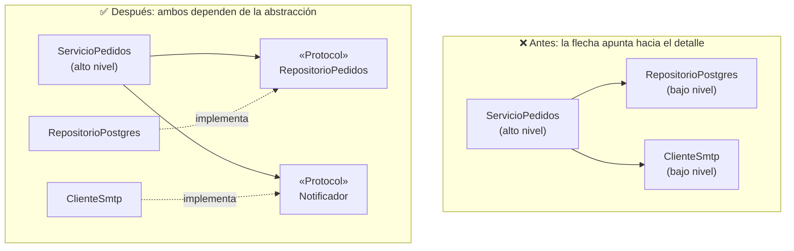

import Reto from "@components/Reto.astro";
import Solucion from "@components/Solucion.astro";
import Quiz from "@components/Quiz.astro";
import CheckDominio from "@components/CheckDominio.astro";
import Nivel from "@components/Nivel.astro";

<Nivel nivel="intermedio" />

**SOLID** es un acrónimo de cinco principios de diseño orientado a objetos que vas a oír en cada entrevista semi-senior, en cada code review, y en la mitad de las discusiones de arquitectura de tu vida profesional. Esta lección te los enseña desde cero —sin asumir que ya los conoces— y hace algo que la mayoría de los tutoriales no se atreve: te enseña también **cuándo NO aplicarlos**. Porque el junior que repite "hay que cumplir SOLID" y llena el código de interfaces inútiles hace tanto daño como el que nunca oyó hablar de ellos. La idea rectora de toda la lección: **el smell justifica el principio, no al revés.** Primero el dolor concreto; después la abstracción que lo cura.

:::tip[Si ya tocaste esto antes]
¿Ya escuchaste "Single Responsibility" o usaste una interfaz para desacoplar? No te saltes la lección: úsala como **diagnóstico**. Salta a los **dos ejercicios Primero-Sin-IA** (sección 7). El primero te hace refactorizar una cadena de `if/elif` que crece (violación de Open/Closed) con tests que prueban que no rompiste nada; el segundo —el que separa a quien *entendió* SOLID de quien lo *memorizó*— te da tres escenarios y te obliga a decidir, con argumentos, **cuándo aplicar un principio es ingeniería y cuándo es sobre-ingeniería**. Si los cierras limpio, valida con el check de dominio (sección 8). Si te trabas en el segundo, vuelve a la sección 5.
:::

## 1. Qué vas a saber hacer

Al terminar, sin IA y sin notas, podrás:

- **O1 — Explicar** cada uno de los cinco principios SOLID con un ejemplo propio, **nombrando el code smell concreto** que cada uno resuelve (no la definición de memoria: el dolor que cura).
- **O2 — Refactorizar** un fragmento que viola un principio (Open/Closed o Dependency Inversion) hacia una versión que lo cumple, **con tests verdes** que demuestran que el comportamiento se preservó.
- **O3 — Evaluar el trade-off** entre aplicar un principio y caer en sobre-abstracción (YAGNI), **decidiendo y defendiendo** cuándo SOLID estorba.

## 2. Por qué importa (el dinero está aquí)

> 💰 **Por qué importa:** clean code y principios de diseño son **expectativa semi-senior**, no un extra. Los juniors entregan código que funciona hoy; los semi-seniors entregan código que **sigue siendo barato de cambiar** dentro de seis meses, cuando llegue el requisito que nadie anticipó. SOLID es el vocabulario común de esa conversación: en un code review, "esto viola Open/Closed" comunica en tres palabras lo que de otro modo serían tres párrafos. Pero el verdadero diferenciador —lo que distingue al semi-senior del junior que leyó un blog— es saber **cuándo un principio NO aplica**. Aplicar SOLID a ciegas produce *arquitectura astronauta*: capas de abstracción que nadie pidió, indirección que hace ilegible un `if` de tres líneas. Saber defender "aquí NO abstraigo, todavía no hay un segundo caso" en voz alta, con argumentos, es exactamente la madurez técnica por la que se paga el premium.

Dos razones por las que esta sub-unidad es bisagra:

1. **Es el puente entre los smells y los patrones.** En [`2.3`](/fase-2-ingenieria/2-3-code-smells-refactoring/) aprendiste a *oler* el código malo; en [`2.5`](/fase-2-ingenieria/2-5-patrones-diseno/) vas a aprender el catálogo de patrones. SOLID es lo que está en medio: los principios que, cuando un smell aparece, te dicen *en qué dirección* refactorizar. Sin SOLID, un patrón es una receta que aplicas sin entender por qué.
2. **Es donde el "Primero-Sin-IA" se vuelve criterio, no código.** Una IA te escribe una `AbstractFactory` en segundos. Lo que **no** te da —y lo que el mercado paga— es el juicio de decir "no, esto no necesita una factory, es un `dict`". Ese juicio solo se entrena pensando tú, decidiendo tú, y defendiendo tu decisión. Esta lección es puro entrenamiento de ese músculo.

## 3. Lo que ya traes (actívalo)

Esta sub-unidad se para sobre lo anterior. Reúsalo:

- De [`2.2` Clean code](/fase-2-ingenieria/2-2-clean-code/): **DRY, KISS y, sobre todo, YAGNI** (*You Aren't Gonna Need It*). YAGNI es el contrapeso permanente de SOLID en esta lección: cada principio te empuja a abstraer; YAGNI te frena hasta que el dolor sea real.
- De [`2.3` Code smells + refactoring](/fase-2-ingenieria/2-3-code-smells-refactoring/): los smells **divergent change**, **shotgun surgery**, **switch statements** y **speculative generality**. Cada principio SOLID es la respuesta a uno de ellos. Y refactorizar exige **red de tests** como prerrequisito: sin tests, "refactorizar" es "cambiar y rezar".
- De [`1.6` Primer test con pytest](/fase-1-lenguajes/1-6-primer-test-pytest/): el ciclo **red-green-refactor** y el **seam de inyección** (pasar una dependencia como argumento en vez de instanciarla dentro). Ese seam es, literalmente, la D de SOLID. Lo intuiste a mano; aquí le pones nombre.
- De [`1.4` Type hints + pydantic](/fase-1-lenguajes/1-4-type-hints-mypy-pydantic/): `typing.Protocol` y las clases base abstractas (`abc`). Son las herramientas con las que se escriben las abstracciones de SOLID en Python.

Antes de seguir, responde de memoria:

<Quiz
  question="En esta lección, ¿qué relación hay entre un code smell y un principio SOLID?"
  options={[
    "Hay que aplicar los cinco principios siempre, desde el primer día, para evitar que aparezcan smells",
    "El smell es el síntoma concreto; el principio es la dirección del refactor que lo cura. Primero el dolor, después la abstracción",
    "Son lo mismo con nombres distintos: un smell es una violación de SOLID",
  ]}
  answer={1}
  explanation="El smell es observable (un if/elif que crece, una clase que cambia por mil razones). El principio te dice hacia dónde refactorizar cuando ese dolor aparece. Aplicar el principio SIN el smell —abstraer 'por si acaso'— es el antipatrón que esta lección te enseña a evitar (speculative generality). El smell justifica el principio, no al revés."
/>

## 4. Los cinco principios, smell-first (ejemplo resuelto, pensado en voz alta)

Voy a recorrer los cinco. Para cada uno: **el smell primero** (el dolor que ya sabes oler), **luego** el principio como cura, y el **costo** de aplicarlo. No leas esto como definiciones de diccionario; léeme razonar como si estuviera al lado tuyo. Todos los ejemplos giran en torno a un mismo dominio que ya conoces: una tienda que calcula precios y procesa pedidos.

### 4.1 — S · Single Responsibility Principle (SRP)

> *Una clase debe tener una sola razón para cambiar.*

**El smell:** *divergent change* — una clase que tienes que tocar por motivos completamente distintos. Mira esta clase `Pedido`:

```python
class Pedido:
    def __init__(self, items: list[dict]) -> None:
        self.items = items

    def total(self) -> int:
        return sum(item["precio"] * item["cantidad"] for item in self.items)

    def guardar(self) -> None:
        # abre conexión a Postgres, hace INSERT...
        ...

    def enviar_confirmacion(self) -> None:
        # arma un HTML, abre SMTP, manda el correo...
        ...
```

Razono en voz alta: *"Esta clase me obliga a tocarla por tres razones que no tienen nada que ver entre sí. Si cambia la regla de negocio del total (agrego IVA), la toco. Si migramos de Postgres a otra base, la toco. Si el equipo de marketing rediseña el correo, la toco. Tres equipos distintos, tres ritmos de cambio distintos, un solo archivo que se vuelve un campo de batalla con conflictos de merge. Eso es `divergent change`."*

La cura (SRP) es separar por **razón de cambio**:

```python
class Pedido:
    def __init__(self, items: list[dict]) -> None:
        self.items = items

    def total(self) -> int:                       # solo lógica de negocio
        return sum(i["precio"] * i["cantidad"] for i in self.items)

class RepositorioPedidos:                          # solo persistencia
    def guardar(self, pedido: Pedido) -> None: ...

class NotificadorPedidos:                          # solo comunicación
    def enviar_confirmacion(self, pedido: Pedido) -> None: ...
```

*"Ahora cada clase cambia por una sola razón. La regla mental que uso: SRP no es 'una clase hace una cosa' —eso es vago e inútil—, es **'una clase responde a un solo actor / a una sola fuente de cambio'**. El total responde al negocio; el repositorio, a infraestructura; el notificador, a marketing."*

### 4.2 — O · Open/Closed Principle (OCP)

> *Una entidad debe estar abierta a la extensión, pero cerrada a la modificación.* Debes poder agregar comportamiento **sin editar** el código que ya funciona.

**El smell:** *switch statements* / una cadena de `if/elif` que crece cada vez que aparece un caso nuevo. El descuento por tipo de cliente:

```python
def calcular_descuento(cliente_tipo: str, monto: int) -> int:
    if cliente_tipo == "regular":
        return 0
    elif cliente_tipo == "vip":
        return monto * 10 // 100
    elif cliente_tipo == "empleado":
        return monto * 30 // 100
    # cada cliente nuevo = editar esta función = riesgo de romper los otros
    return 0
```

Razono: *"El problema no es que sea feo. Es que para agregar el cliente 'mayorista' tengo que **abrir y editar** una función que ya funcionaba para los otros tres. Cada edición arriesga romper un caso que andaba bien, y obliga a re-testear todo. La función no está cerrada a la modificación: cada requisito nuevo la abre con un cuchillo."*

La cura (OCP) es mover cada caso a su propia clase que comparte un contrato común; agregar un caso es **agregar una clase**, no editar las existentes:

```python
from abc import ABC, abstractmethod

class Descuento(ABC):
    @abstractmethod
    def calcular(self, monto: int) -> int: ...

class SinDescuento(Descuento):
    def calcular(self, monto: int) -> int:
        return 0

class DescuentoVip(Descuento):
    def calcular(self, monto: int) -> int:
        return monto * 10 // 100

class DescuentoEmpleado(Descuento):
    def calcular(self, monto: int) -> int:
        return monto * 30 // 100

def precio_final(monto: int, descuento: Descuento) -> int:
    return monto - descuento.calcular(monto)   # cerrado: nunca se vuelve a tocar
```

*"`precio_final` no volverá a cambiar aunque agregue diez tipos de cliente. Para el mayorista, escribo `class DescuentoMayorista(Descuento)` y listo —no toco nada de lo que ya pasaba sus tests. Eso es 'abierto a extensión, cerrado a modificación'."*

:::caution[El costo de OCP, y la regla de las tres veces]
No corras a "polimorfizar" cada `if`. Si solo tienes **un** caso, un `if` es más claro que una jerarquía de clases. La heurística profesional es la **Rule of Three** (la regla de las tres veces): la primera vez escribes el caso concreto; la segunda vez que aparece algo parecido, aguantas la tentación y copias; a la **tercera** ya tienes evidencia de un eje de variación real, y *ahí* abstraes. Abstraer con un solo caso es adivinar el futuro —y casi siempre adivinas mal. Volveremos a esto en la sección 5.
:::

### 4.3 — L · Liskov Substitution Principle (LSP)

> *Si `B` es subtipo de `A`, debes poder usar un `B` en cualquier lugar donde se espera un `A`, sin que el programa se comporte mal.* La herencia tiene que respetar el **comportamiento**, no solo la forma.

**El smell:** *refused bequest* (una subclase que hereda algo que no puede honrar) y `if isinstance(...)` esparcidos para "arreglar" subclases que no encajan. El ejemplo canónico, cuadrado y rectángulo:

```python
class Rectangulo:
    def __init__(self, ancho: int, alto: int) -> None:
        self.ancho = ancho
        self.alto = alto
    def set_ancho(self, w: int) -> None:
        self.ancho = w
    def area(self) -> int:
        return self.ancho * self.alto

class Cuadrado(Rectangulo):           # "un cuadrado ES un rectángulo", ¿no?
    def set_ancho(self, w: int) -> None:
        self.ancho = w
        self.alto = w                 # para mantenerse cuadrado, fuerza ambos lados
```

Razono: *"En matemáticas un cuadrado es un rectángulo. Pero en código, la herencia es una **promesa de comportamiento**, y `Cuadrado` la rompe. Mira este test que vale para cualquier `Rectangulo`:"*

```python
def test_set_ancho_no_afecta_alto():
    r = Rectangulo(2, 3)
    r.set_ancho(5)
    assert r.area() == 15      # 5 * 3 → cierto para Rectangulo, FALSO para Cuadrado (5*5=25)
```

*"Si paso un `Cuadrado` donde el código espera un `Rectangulo`, ese test revienta: cambiar el ancho también cambió el alto, algo que un `Rectangulo` jamás haría. El `Cuadrado` **no es sustituible** por su padre. Eso es violar Liskov. La lección de fondo no es 'evita cuadrados': es que **la relación 'es-un' del lenguaje natural no garantiza una relación 'es-un' de comportamiento**. Cuando la herencia te obliga a romper expectativas del padre, la herramienta correcta casi siempre es **composición en vez de herencia** —no heredes; contén."*

### 4.4 — I · Interface Segregation Principle (ISP)

> *Ningún cliente debe ser forzado a depender de métodos que no usa.* Mejor varias interfaces pequeñas y específicas que una grande y genérica.

**El smell:** *fat interface* — un contrato gordo que obliga a sus implementadores a rellenar métodos que no les corresponden con `raise NotImplementedError`. Una multifuncional:

```python
from typing import Protocol

class Maquina(Protocol):
    def imprimir(self, doc: str) -> None: ...
    def escanear(self, doc: str) -> None: ...
    def faxear(self, doc: str) -> None: ...

class ImpresoraSimple:           # solo imprime, pero el contrato la obliga a todo
    def imprimir(self, doc: str) -> None:
        print(doc)
    def escanear(self, doc: str) -> None:
        raise NotImplementedError   # 🚩 no debería existir
    def faxear(self, doc: str) -> None:
        raise NotImplementedError   # 🚩 humo: el contrato miente
```

Razono: *"Esos `NotImplementedError` son humo de un mal diseño. Cualquier código que reciba una `Maquina` cree que puede faxear, y revienta en runtime con una impresora simple. El contrato promete más de lo que sus implementadores cumplen. La cura: parto la interfaz gorda en contratos chicos que se componen."*

```python
class Impresora(Protocol):
    def imprimir(self, doc: str) -> None: ...

class Escaner(Protocol):
    def escanear(self, doc: str) -> None: ...

class ImpresoraSimple:           # implementa SOLO lo que de verdad hace
    def imprimir(self, doc: str) -> None:
        print(doc)
```

*"Ahora una función que solo imprime pide un `Impresora`, no una `Maquina`. La multifuncional implementará `Impresora`, `Escaner` y `Fax` por separado. Nadie depende de lo que no usa. Nota lo cómodo de Python: con `Protocol`, `ImpresoraSimple` cumple `Impresora` **sin heredar nada** —basta que tenga el método (structural typing / duck typing tipado). No hace falta el `implements` ceremonioso de Java."*

### 4.5 — D · Dependency Inversion Principle (DIP) — worked example a fondo

> *Los módulos de alto nivel no deben depender de los de bajo nivel; ambos deben depender de **abstracciones**.* Y: *las abstracciones no deben depender de los detalles; los detalles deben depender de las abstracciones.*

Este es el principio más importante para todo lo que viene (testing, backend, IA), así que lo razono completo. **El smell:** una clase de alto nivel (lógica de negocio) que **instancia por dentro** sus dependencias de bajo nivel (base de datos, correo, un LLM):

```python
class ServicioPedidos:
    def __init__(self) -> None:
        self.repo = RepositorioPostgres()     # 🚩 acoplado a Postgres, hardcodeado
        self.email = ClienteSmtp()            # 🚩 acoplado a SMTP, hardcodeado

    def confirmar(self, pedido: Pedido) -> None:
        self.repo.guardar(pedido)
        self.email.enviar(pedido.cliente, "Tu pedido está confirmado")
```

Razono, paso a paso:

*"Paso 1 — ¿dónde duele? Quiero **testear** `confirmar` sin tocar una base de datos real ni mandar un correo real. Pero no puedo: `ServicioPedidos` construye `RepositorioPostgres` y `ClienteSmtp` adentro, así que correr el test abre una conexión de verdad. Es lento, frágil, y le manda un mail a alguien cada vez que corro pytest. Este es exactamente el dolor que sentiste en [`1.5`](/fase-1-lenguajes/1-5-archivos-json-apis/) cuando inyectaste `fetch` para poder testear sin red."*

*"Paso 2 — ¿quién depende de quién? Mi lógica de negocio (alto nivel, lo que importa) depende de detalles de infraestructura (bajo nivel, reemplazable). Eso está al revés. La regla de DIP: **invierte la flecha**. Que ambos dependan de una abstracción que yo controlo."*

Defino las abstracciones con `Protocol` y las **inyecto** (las paso como argumentos, no las construyo dentro):

```python
from typing import Protocol

class RepositorioPedidos(Protocol):
    def guardar(self, pedido: "Pedido") -> None: ...

class Notificador(Protocol):
    def enviar(self, destinatario: str, mensaje: str) -> None: ...

class ServicioPedidos:
    def __init__(self, repo: RepositorioPedidos, notificador: Notificador) -> None:
        self.repo = repo                  # depende de la ABSTRACCIÓN, no de Postgres
        self.notificador = notificador

    def confirmar(self, pedido: "Pedido") -> None:
        self.repo.guardar(pedido)
        self.notificador.enviar(pedido.cliente, "Tu pedido está confirmado")
```

*"Paso 3 — la recompensa, que es doble. Primero, **testeo trivial**: en el test inyecto un doble falso (un `fake`) que registra en memoria, sin red ni base:"*

```python
class RepoFake:
    def __init__(self) -> None:
        self.guardados: list = []
    def guardar(self, pedido) -> None:
        self.guardados.append(pedido)

class NotificadorFake:
    def __init__(self) -> None:
        self.enviados: list[tuple[str, str]] = []
    def enviar(self, destinatario: str, mensaje: str) -> None:
        self.enviados.append((destinatario, mensaje))

def test_confirmar_guarda_y_notifica():
    repo, notif = RepoFake(), NotificadorFake()
    servicio = ServicioPedidos(repo, notif)
    servicio.confirmar(pedido_demo)
    assert pedido_demo in repo.guardados
    assert notif.enviados == [(pedido_demo.cliente, "Tu pedido está confirmado")]
```

*"Cero red, cero base de datos, milisegundos. El seam de inyección de `1.6` ahora tiene nombre: es Dependency Inversion. Segundo: **flexibilidad real** —mañana cambio Postgres por SQLite, o SMTP por una API de WhatsApp, y `ServicioPedidos` no se entera, porque depende del `Protocol`, no de la implementación. Esto es la semilla de **ports & adapters / arquitectura hexagonal**, que vas a aplicar de verdad en la [Fase 3](/fase-3-backend/): la lógica de negocio en el centro, hablando con el mundo solo a través de puertos (los `Protocol`)."*



## 5. Errores que vas a tener (y la crítica al dogmatismo)

Aquí está la otra mitad de la lección —la que casi nadie enseña. SOLID **mal aplicado** hace más daño que ignorado, porque la sobre-abstracción es cara y silenciosa: nadie te grita por un bug, pero cada cambio cuesta el triple.

:::caution[Podrías pensar que más SOLID = mejor diseño, siempre]
No. Cada principio te empuja a **agregar una capa de indirección** (una interfaz, una clase, una inyección). La indirección tiene un costo real: más archivos, más saltos para seguir el flujo, un `if` de tres líneas convertido en tres clases y una factory. Si no hay un smell que lo justifique, esa indirección es deuda, no diseño. El antipatrón tiene nombre —**speculative generality** (lo viste en [`2.3`](/fase-2-ingenieria/2-3-code-smells-refactoring/))— y su primo, la *astronaut architecture*. La regla: **el smell justifica el principio, no al revés.** Sin dolor concreto, no abstraes.
:::

:::caution[Podrías pensar que SRP significa "una función/método por clase"]
Mal. SRP no es "hace una sola cosa" (¿qué es "una cosa"? `total()` hace una multiplicación y una suma, ¿son dos cosas?). La formulación útil es **"una sola razón para cambiar" / "un solo actor"**. Trocear una clase coherente en diez clases anémicas de un método cada una —cada una sin estado, llamándose en cadena— no es cumplir SRP: es crear *shotgun surgery* (ahora un cambio te obliga a tocar diez archivos). La cohesión también es un valor; SRP la equilibra, no la destruye.
:::

:::caution[Podrías pensar que OCP exige una interfaz para cada clase desde el día uno]
Ese es el error más caro del principiante con SOLID. Abstraer requiere conocer el **eje de variación**, y con un solo caso no lo conoces: estás adivinando qué va a variar. Casi siempre adivinas mal, y terminas con una abstracción que no calza con el segundo caso real cuando por fin llega —y refactorizar una abstracción equivocada es más caro que refactorizar un `if` honesto. **Rule of Three:** un `if` está perfecto hasta que tienes tres casos reales. Recién ahí el eje de variación es evidencia, no profecía.
:::

:::caution[Podrías pensar que la herencia es la forma de cumplir LSP y OCP]
La herencia es la fuente de la mitad de las violaciones de Liskov (cuadrado/rectángulo) y crea jerarquías rígidas. La industria convergió en una heurística: **"composición sobre herencia"**. Para extender comportamiento (OCP), un objeto que *contiene* una estrategia (como el `Descuento` inyectado de 4.2) es más flexible y más testeable que una jerarquía de subclases. Hereda solo cuando hay una relación 'es-un' de **comportamiento** genuina y estable; ante la duda, contén.
:::

:::caution[Podrías pensar que SOLID es una checklist objetiva que se "cumple" o "no se cumple"]
SOLID son **heurísticas**, no teoremas. Hay tensiones reales entre ellas y con DRY/YAGNI, y diseñar es **elegir qué tensión aceptas**. Críticos serios lo han dicho fuerte: Dan Abramov, en *The WET Codebase*, muestra cómo el celo por DRY/abstracción temprana produce código *peor* que una duplicación honesta; "SRP" ha sido criticado por vago. No tienes que comprar el dogma para usar la herramienta. La marca del semi-senior no es recitar los cinco principios: es **defender, con un trade-off concreto, por qué aquí aplicaste DIP pero NO partiste esta clase**. Esa decisión vive en un [ADR](/fase-2-ingenieria/2-13-colaboracion-spec-driven-adrs/), no en un dogma.
:::

## 6. Práctica con andamiaje (que se desvanece)

SOLID es contenido **nuevo**, así que vamos del worked example al apoyo decreciente: primero identificar (reconocer el smell), luego completar un refactor a medias, luego juzgar. Hazlo **a mano primero** —razona antes de teclear.

### 6.1 IDENTIFICAR (sin escribir código)

Para cada fragmento, di **qué principio SOLID viola** y **cuál es el smell** observable. No lo arregles todavía; solo nómbralo.

```python
# Fragmento A
class GeneradorReporte:
    def datos(self) -> list: ...
    def a_pdf(self) -> bytes: ...
    def subir_a_s3(self, pdf: bytes) -> None: ...

# Fragmento B
class Pajaro:
    def volar(self) -> None: ...
class Pinguino(Pajaro):
    def volar(self) -> None:
        raise RuntimeError("los pingüinos no vuelan")

# Fragmento C
def notificar(usuario, canal: str, msg: str) -> None:
    if canal == "email": ...
    elif canal == "sms": ...
    elif canal == "push": ...
```

<Solucion title="Ver la respuesta (solo después de predecir)">
- **A → viola SRP.** Smell: *divergent change*. Una clase con tres razones de cambio (la consulta de datos, el formato PDF, la subida a S3). Cambia el negocio → la tocas; cambia el storage → la tocas; cambia el layout → la tocas. Sepárala en tres colaboradores.
- **B → viola LSP.** Smell: *refused bequest* + el `raise` en runtime. `Pinguino` no es sustituible por `Pajaro`: cualquier código que reciba un `Pajaro` y llame `.volar()` revienta con un pingüino. El modelo está mal: `volar` no pertenece a todo pájaro. Mejor componer (`Pajaro` tiene un comportamiento de movimiento) o segregar (`PajaroVolador`).
- **C → viola OCP.** Smell: *switch statements*. Cada canal nuevo te obliga a editar `notificar`. **Pero ojo:** con solo estos tres canales estables, este `if` puede ser perfectamente aceptable —ver 6.3. Identificar la violación no significa que el refactor sea obligatorio.
</Solucion>

### 6.2 COMPLETAR (refactor a medias)

Este refactor de OCP está **a medias**: la abstracción existe pero falta una pieza. Completa lo marcado con `# TODO` para que `precio_final` quede **cerrado a modificación**.

```python
from abc import ABC, abstractmethod

class Descuento(ABC):
    @abstractmethod
    def calcular(self, monto: int) -> int: ...

class DescuentoVip(Descuento):
    def calcular(self, monto: int) -> int:
        return monto * 10 // 100

# TODO 1: crea la clase SinDescuento (cliente regular: descuento 0)

def precio_final(monto: int, descuento: Descuento) -> int:
    # TODO 2: devuelve el monto menos el descuento calculado
    ...
```

<Solucion title="Ver el orden correcto">

```python
class SinDescuento(Descuento):           # TODO 1
    def calcular(self, monto: int) -> int:
        return 0

def precio_final(monto: int, descuento: Descuento) -> int:
    return monto - descuento.calcular(monto)   # TODO 2
```

La clave de OCP: `precio_final` recibe **cualquier** `Descuento` y nunca pregunta de qué tipo es (`if isinstance` sería volver al smell). Agregar `DescuentoMayorista` mañana es escribir una clase nueva, sin tocar `precio_final` ni los descuentos existentes —que conservan sus tests verdes.
</Solucion>

### 6.3 JUZGAR (el músculo de la crítica)

Vuelve al **Fragmento C** de 6.1 (el `if/elif` de canales). Pregúntate, y escribe tu respuesta en dos o tres frases **antes** de mirar:

> Tienes exactamente estos tres canales y no hay ninguno nuevo en el roadmap. ¿Refactorizas a OCP (una clase `Canal` por cada uno) **ahora**, o dejas el `if/elif`? Defiende tu decisión nombrando un principio **a favor** y otro **en contra**.

<Solucion title="Ver una respuesta defendible (no la única)">
Una respuesta semi-senior: **lo dejo como `if/elif` por ahora.** A favor del refactor está OCP; en contra está **YAGNI + Rule of Three**: con tres casos estables y sin variación prevista, la jerarquía de clases agrega indirección sin pagar un beneficio real, y adivinar el eje de variación con la información de hoy es probable que falle. Lo dejo, pero **registro el gatillo**: "si aparece un cuarto canal o la lógica de un canal crece más allá de unas líneas, refactorizo a OCP". Eso es ingeniería: no es 'nunca abstraer' ni 'abstraer siempre', es abstraer **cuando el smell aparece de verdad**. (Si tu respuesta fue la contraria pero la defendiste con un trade-off explícito, también es válida —lo que se evalúa es el razonamiento, no el bando.)
</Solucion>

## 7. Ejercicios Primero-Sin-IA

Ahora sin andamiaje, **a mano y sin IA**, dentro del timebox. El primero entrena el refactor (código + tests); el segundo entrena el **juicio** —la mitad de SOLID que el mercado paga y que ninguna IA tiene por ti.

<Reto title="Refactor a Open/Closed con red de tests" timebox="35–45 min">

Te entregamos `descuentos.py` con una función `calcular_descuento(cliente_tipo, monto)` implementada como una cadena de `if/elif` que ya creció fea (cinco tipos de cliente), y su suite `test_descuentos.py` **que pasa en verde**. Tu trabajo, en este orden estricto:

1. **No toques los tests primero.** Córrelos: están verdes. Esa es tu red de seguridad —la prueba de que el comportamiento actual es el que debes preservar.
2. **Refactoriza** la función a un diseño que cumpla **OCP**: una abstracción `Descuento` (con `abc` o `Protocol`) y una clase por tipo de cliente. La función pública que el resto del código usa debe quedar **cerrada a modificación**.
3. Corre los tests de nuevo: deben **seguir verdes sin que los hayas modificado**. Si tuviste que cambiar un test para que pase, cambiaste el comportamiento —eso es un bug en tu refactor, no un test malo.
4. **Demuestra OCP de verdad:** agrega un tipo nuevo (`mayorista`, 25%) **sin editar** ninguna clase existente ni la función pública, y agrega su test.

Entregable: tu solución en `ejercicios/fase-2/refactor-ocp-descuentos/` — `descuentos.py` refactorizado y `test_descuentos.py` con tu caso `mayorista` agregado.

**Hecho significa:**
- [ ] Los tests originales pasan **sin modificarlos** (refactor = mismo comportamiento).
- [ ] Existe una abstracción `Descuento` y una clase por tipo; no quedan `if/elif` ni `isinstance` sobre el tipo de cliente en la lógica de precio.
- [ ] Agregaste `mayorista` creando **solo** una clase nueva + su test, sin tocar las demás.
- [ ] Puedes explicar **sin notas** qué significa "cerrado a modificación" y por qué tu diseño lo cumple.

Enunciado completo y starter: `ejercicios/fase-2/refactor-ocp-descuentos/` (carpeta del repo).

<Solucion title="Pista (ábrela solo si superaste el timebox)">
El contrato común es un método `calcular(self, monto: int) -> int`. Cada `elif` se vuelve una clase con ese método. El truco para mantener la función pública existente sin romper a quien la llama: por dentro, mapea el string a la clase con un `dict` —`{"vip": DescuentoVip(), ...}`— y delega. Ese `dict` es el único lugar que crece al agregar un tipo (es un *registro*, no un `if`); algunos lo consideran aceptable, otros lo reemplazan por auto-registro. Trabaja en pesos enteros (`//`) para esquivar el `float`. Pista, no solución.
</Solucion>

</Reto>

<Reto title="El juicio: ¿abstraer o no? (defiende tu decisión)" timebox="25–35 min">

Sin escribir código de producción. Te damos **tres escenarios**; para cada uno decides **aplicar el principio SOLID** o **NO aplicarlo (YAGNI)**, y lo defiendes por escrito.

1. **El reporte que solo exporta a PDF.** Una función `exportar(reporte)` que hoy genera PDF. El PM dice "quizás algún día agreguemos Excel, no sé". ¿Creas ya una abstracción `Exportador` (OCP/DIP) o dejas la función concreta?
2. **El cliente de pagos.** Tu `ServicioCheckout` instancia `StripeCliente()` por dentro. Necesitas testear el checkout sin cobrar tarjetas reales, y el negocio evalúa agregar un segundo proveedor el próximo trimestre. ¿Inviertes la dependencia (DIP) o lo dejas concreto?
3. **La clase `Usuario`.** Tiene `nombre`, `email`, y métodos `validar_email()` y `nombre_completo()`. Un colega dice "viola SRP, hay que separar validación en una clase aparte". ¿Lo separas o no?

Para **cada** escenario, escribe en `decisiones.md`: (a) tu decisión, (b) el **smell concreto presente o ausente** que la justifica, (c) un principio **a favor** y un argumento **en contra** (YAGNI/Rule of Three/costo de indirección), y (d) si dejas algo sin abstraer, **el gatillo** que te haría cambiar de opinión ("si pasa X, refactorizo").

Entregable: `decisiones.md` en `ejercicios/fase-2/solid-juicio-sobre-abstraccion/` con los tres escenarios resueltos.

**Hecho significa:**
- [ ] Cada decisión nombra el smell **presente o ausente** (la ausencia de smell es una razón válida para NO abstraer).
- [ ] Cada decisión expone un argumento a favor **y** uno en contra (no hay decisión sin trade-off).
- [ ] Las decisiones de "no abstraer" incluyen un **gatillo** concreto y observable.
- [ ] Puedes **defender en voz alta** cualquiera de las tres como en un code review.

Enunciado completo: `ejercicios/fase-2/solid-juicio-sobre-abstraccion/` (carpeta del repo).

<Solucion title="Pista (ábrela solo si superaste el timebox)">
No hay una respuesta "correcta" universal, pero hay decisiones **mejor y peor defendidas**. Pista de dirección, no de respuesta: el escenario 2 tiene **dos** fuerzas empujando a abstraer (testabilidad *hoy* + segundo proveedor *probable*) —fíjate si eso cambia el cálculo frente al escenario 1, donde el "quizás algún día" es pura especulación. El escenario 3 es una trampa de SRP dogmático: pregúntate si `validar_email` y `nombre_completo` cambian por **razones distintas** o son parte de la misma cohesión de "qué es un usuario". Distinguir un eje de variación **real y presente** de uno **especulado** es todo el ejercicio.
</Solucion>

</Reto>

## 8. Check de dominio

Sin mirar la lección, en voz alta o por escrito:

<CheckDominio
  items={[
    "Enunciar los cinco principios SOLID y, para cada uno, el code smell concreto que resuelve.",
    "Explicar por qué SRP no significa 'una clase hace una sola cosa' sino 'una sola razón para cambiar'.",
    "Refactorizar mentalmente una cadena de if/elif que crece hacia un diseño Open/Closed, y decir qué queda 'cerrado'.",
    "Dar un ejemplo de violación de Liskov y explicar por qué 'es-un' del lenguaje natural no garantiza sustituibilidad.",
    "Explicar cómo Dependency Inversion convierte el seam de inyección de 1.5/1.6 en código testeable, e instanciarlo con un fake.",
    "Defender con un trade-off concreto un caso donde aplicar un principio SOLID sería sobre-ingeniería (YAGNI / Rule of Three).",
    "Explicar por qué 'el smell justifica el principio, no al revés' y qué es speculative generality.",
  ]}
/>

Si marcaste menos de seis, vuelve a la sección correspondiente **antes** de avanzar. No es un examen: es honestidad contigo.

<Quiz
  question="Un colega abre un PR que envuelve un único if de dos ramas en una jerarquía de cinco clases con una factory, 'para cumplir Open/Closed'. No hay ningún segundo caso real previsto. ¿Cuál es la objeción técnica más sólida en el code review?"
  options={[
    "Ninguna: cumplir SOLID siempre es correcto y hay que aprobarlo",
    "Es speculative generality: abstrae sin un smell que lo justifique; con un solo caso no se conoce el eje de variación (YAGNI / Rule of Three). La indirección es deuda, no diseño",
    "El problema es solo de estilo de nombres; pídele que renombre las clases y apruébalo",
  ]}
  answer={1}
  explanation="OCP es una respuesta a un smell (un if/elif que CRECE), no un mandato a priori. Con un único caso no hay evidencia del eje de variación, así que la abstracción adivina el futuro y agrega indirección sin beneficio. La objeción correcta nombra el antipatrón (speculative generality) y la heurística de freno (YAGNI / Rule of Three). El smell justifica el principio, no al revés."
/>

## 9. Recursos (documentación oficial primero)

- **`typing.Protocol` — documentación oficial de Python:** [docs.python.org/3/library/typing.html#typing.Protocol](https://docs.python.org/3/library/typing.html#typing.Protocol) y el **PEP 544** [peps.python.org/pep-0544](https://peps.python.org/pep-0544/) — el mecanismo de structural typing con el que se escriben las abstracciones de ISP/DIP en Python.
- **`abc` (Abstract Base Classes) — oficial:** [docs.python.org/3/library/abc.html](https://docs.python.org/3/library/abc.html) — `ABC` y `@abstractmethod`.
- **Robert C. Martin, *Design Principles and Design Patterns* (origen de SOLID):** [en `objectmentor`/archive](https://web.archive.org/web/20150906155800/http://www.objectmentor.com/resources/articles/Principles_and_Patterns.pdf) — la fuente, en inglés.
- **Martin Fowler — *Refactoring* y bliki:** [refactoring.com](https://refactoring.com/) y la nota sobre la [Rule of Three en *Refactoring*](https://martinfowler.com/bliki/) — el "cuándo" de la abstracción.
- **Refactoring.Guru — SOLID + code smells:** [refactoring.guru/design-patterns/what-is-pattern](https://refactoring.guru/design-patterns) — ejemplos visuales de smells y refactors (puente directo con [`2.3`](/fase-2-ingenieria/2-3-code-smells-refactoring/) y [`2.5`](/fase-2-ingenieria/2-5-patrones-diseno/)).
- **Crítica honesta — Dan Abramov, *The WET Codebase*:** [overreacted.io/the-wet-codebase](https://overreacted.io/the-wet-codebase/) — por qué la abstracción prematura sale más cara que la duplicación. Léelo: el dogma es para romperlo con criterio.

## 10. Conexión con el capstone de la fase

El **[Capstone F2 — Refactor + suite de tests](/fase-2-ingenieria/proyecto/)** es, literalmente, esta lección aplicada a un proyecto real (tu app de la Fase 1):

- Vas a **identificar smells** y refactorizar aplicando SOLID **donde un smell lo justifique** —y a **documentar en un ADR** dónde decidiste *no* abstraer y por qué. Esa segunda parte (la crítica) es lo que distingue tu capstone del de un junior que metió interfaces en todos lados.
- La **red de tests** (de [`2.6`](/fase-2-ingenieria/2-6-testing-fundamentos/)) no es opcional: cada refactor SOLID se hace con los tests en verde antes y después. Refactorizar sin tests no es refactorizar.
- El seam de **Dependency Inversion** que practicaste aquí es la base de la arquitectura **ports & adapters** que construirás de verdad en la [Fase 3](/fase-3-backend/), y del mockeo de LLMs en la Fase 6. Lo que aprendiste hoy no se recicla: se acumula.

## 11. Reflexión y repaso espaciado

Cierra escribiendo dos o tres frases respondiendo: **¿en qué momento de tu propio código pasado (HomeHub, scripts) recuerdas haber sentido uno de estos cinco smells —y qué principio lo habría curado?** Anclar el principio a un dolor que ya viviste es lo que lo vuelve tuyo, no vocabulario prestado.

Gancho de **spaced repetition**:

- **Mañana:** reescribe de memoria, sin mirar, la definición de los cinco principios **junto al smell que cada uno resuelve**. Si recuerdas el principio pero no el smell, no lo aprendiste: lo memorizaste.
- **En 3 días:** toma el refactor OCP de descuentos y aplícale **DIP**: extrae la persistencia de los descuentos a un `Protocol` inyectado, y testéalo con un fake. Dos principios sobre el mismo código.
- **En 1 semana:** explícale a alguien (o a una grabación) **por qué SOLID mal aplicado es peor que no aplicarlo**, con el ejemplo de la astronaut architecture. Defender el "cuándo NO" en voz alta es exactamente lo que un entrevistador semi-senior quiere oír cuando pregunta "¿qué opinas de SOLID?".
