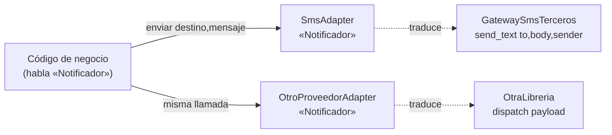

import Reto from "@components/Reto.astro";
import Solucion from "@components/Solucion.astro";
import Quiz from "@components/Quiz.astro";
import CheckDominio from "@components/CheckDominio.astro";
import Nivel from "@components/Nivel.astro";

<Nivel nivel="profundización" />

Un **patrón de diseño** es una solución con nombre a un problema de estructura de código que aparece una y otra vez. No es una librería que instalas ni una sintaxis del lenguaje: es una *forma de organizar clases y objetos* que la industria descubrió a fuerza de tropezar con el mismo dolor. Esta lección te enseña cinco —los que de verdad vas a usar— **desde cero**, sin asumir que conoces ninguno. Y lo hace con una regla que la mayoría de los cursos de patrones traiciona: **cada patrón nace del code smell que lo justifica.** Primero el dolor concreto (un `if/elif` que crece, una interfaz que no encaja, un método que notifica a medio sistema); después —y solo después— el patrón como cura. El patrón es el **destino de un refactor**, no el punto de partida.

:::tip[Si ya tocaste esto antes]
¿Ya usaste un "Strategy" o escribiste una clase con "Factory" en el nombre? No te saltes la lección: úsala como **diagnóstico**. La mitad valiosa de esta sub-unidad no es el catálogo —eso lo googleas— sino el **criterio** de cuándo un patrón es ingeniería y cuándo es *pattern-itis* (sección 5). Salta directo a los **dos ejercicios Primero-Sin-IA** (sección 7): el primero te hace integrar dos librerías de terceros con interfaces incompatibles vía **Adapter** con tests; el segundo —el que separa a quien *entendió* los patrones de quien los *colecciona*— te da cuatro escenarios y te obliga a decidir, con argumentos, **qué patrón convoca el smell, o si ninguno (YAGNI)**. Si los cierras limpio, valida con el check de dominio (sección 8).
:::

## 1. Qué vas a saber hacer

Al terminar, sin IA y sin notas, podrás:

- **O1 — Explicar** Strategy, Factory, Repository, Adapter y Observer **nombrando el code smell concreto** que cada uno cura, y reconocer cuál convoca un smell dado.
- **O2 — Implementar** un patrón (Adapter) que haga compatible una interfaz de terceros con el contrato que tu código espera, **con tests** que prueban la traducción y la extensibilidad (Open/Closed).
- **O3 — Evaluar el trade-off** entre aplicar un patrón y caer en sobre-diseño (*pattern-itis*), **decidiendo y defendiendo** cuándo el smell justifica el patrón y cuándo no.

## 2. Por qué importa (el dinero está aquí)

> 💰 **Por qué importa:** clean code y patrones son **expectativa semi-senior**, no un extra. Pero los patrones son un arma de doble filo en el mercado: vocabulario que comunica diseño en una palabra ("esto pide un Adapter", "métele un Strategy") *y*, mal usado, la marca número uno del junior inseguro que rellena un CRUD de tres líneas con cinco interfaces y una factory para "verse senior". Lo que el mercado paga no es saber recitar los 23 patrones del Gang of Four —eso es trivia—; es **reconocer el smell que convoca a un patrón y, sobre todo, saber cuándo NO aplicarlo.** En un code review, "esto es speculative generality, un `dict` basta" es exactamente la madurez por la que se paga el premium. La IA escribe una `AbstractFactory` perfecta en dos segundos; lo que no te da —y lo que vale— es el juicio de decir "no, esto no necesita una factory".

Por qué esta sub-unidad cierra el bloque de diseño de la Fase 2:

1. **Es la continuación natural de los smells y de SOLID.** En [`2.3`](/fase-2-ingenieria/2-3-code-smells-refactoring/) aprendiste a *oler* el código malo; en [`2.4`](/fase-2-ingenieria/2-4-solid-con-critica/) aprendiste los principios que te dicen *en qué dirección* refactorizar. Los patrones son los **destinos concretos** de esos refactors: las formas reconocibles a las que llegas cuando aplicas un principio para curar un smell. De hecho, ya descubriste dos sin nombrarlos —lo verás en la sección 3.
2. **Es `[opcional/profundización]`, y eso importa.** No necesitas memorizar este catálogo para ser empleable: necesitas el *criterio*. Por eso la lección invierte el énfasis habitual —menos "aquí están los 23 patrones", más "aquí está el smell, ¿qué patrón, si alguno, lo cura?". Tratar el patrón como receta a priori es justo el antipatrón que entrena al junior; tratarlo como destino de refactor es lo que hace el semi-senior.

## 3. Lo que ya traes (actívalo)

Esta sub-unidad se para sobre lo anterior. Reúsalo —y date cuenta de cuánto ya sabes:

- De [`2.3` Code smells + refactoring](/fase-2-ingenieria/2-3-code-smells-refactoring/): los smells **switch statements**, **divergent change**, **shotgun surgery**, **duplicated code** y **speculative generality**. Cada patrón de hoy es la cura de uno de ellos —y speculative generality es el smell que produces *tú* si abusas de los patrones.
- De [`2.4` SOLID con crítica](/fase-2-ingenieria/2-4-solid-con-critica/): cuando refactorizaste el `calcular_descuento` —una clase por tipo de cliente detrás de un contrato común, despachadas por un `dict`-registro— **implementaste Strategy y un Factory sin nombrarlos.** Y cuando inyectaste un `Protocol` `RepositorioPedidos` para invertir la dependencia (DIP), estabas a un paso de **Repository**. Hoy a esos descubrimientos les pones nombre, y agregas dos más (Adapter, Observer).
- De [`2.4`](/fase-2-ingenieria/2-4-solid-con-critica/) también: **`typing.Protocol` y `abc`** (las herramientas con las que se escriben las abstracciones), **composición sobre herencia** (todos estos patrones componen, no heredan) y la **Rule of Three** (el freno permanente contra abstraer de más).
- De [`2.2` Clean code](/fase-2-ingenieria/2-2-clean-code/): **DRY, KISS y YAGNI**. YAGNI es, otra vez, el contrapeso: cada patrón te tienta a abstraer; YAGNI te frena hasta que el smell sea real.

Antes de seguir, responde de memoria:

<Quiz
  question="En esta lección, ¿cuál es la relación correcta entre un code smell y un patrón de diseño?"
  options={[
    "Eliges el patrón primero (es la 'buena arquitectura') y diseñas el código alrededor de él para evitar smells",
    "El smell es el dolor observable; el patrón es el destino del refactor que lo cura. Sin un smell que lo justifique, aplicar el patrón es speculative generality",
    "Cada patrón corresponde exactamente a un principio SOLID: son la misma cosa con otro nombre",
  ]}
  answer={1}
  explanation="Un patrón sin un smell que lo motive es indirección comprada al fiado: más clases, más saltos, sin beneficio. La regla rectora del bloque de diseño se mantiene: el dolor justifica la abstracción, no al revés. Los patrones son los destinos reconocibles de los refactors que SOLID dirige, no recetas que se aplican a priori."
/>

## 4. Cinco patrones, smell-first (ejemplo resuelto, pensado en voz alta)

Voy a recorrer los cinco. Para cada uno: **el smell primero** (el dolor que ya sabes oler), **luego** el patrón como cura, y el **costo** de aplicarlo. No leas esto como fichas de un catálogo; léeme razonar como si estuviera al lado tuyo. Todos los ejemplos giran en torno a un sistema que ya conoces de [`2.4`](/fase-2-ingenieria/2-4-solid-con-critica/): una tienda que procesa pedidos y notifica a sus clientes.

### 4.1 — Strategy · cuando el comportamiento varía por tipo

> **Strategy** encapsula cada variante de un comportamiento en su propio objeto intercambiable, todos detrás de un contrato común. El código que lo usa (el *contexto*) tiene una estrategia y delega en ella, sin saber cuál es.

**El smell:** *switch statements* — un `if/elif` que crece cada vez que aparece un modo nuevo de hacer algo. El canal de envío de una notificación:

```python
def enviar(canal: str, destino: str, mensaje: str) -> None:
    if canal == "email":
        ...   # arma MIME, abre SMTP
    elif canal == "sms":
        ...   # llama a la API del proveedor de SMS
    elif canal == "push":
        ...   # arma el payload y pega al servicio de push
    # cada canal nuevo = editar esta función = riesgo de romper los otros
```

Razono en voz alta: *"Este es exactamente el smell del `calcular_descuento` de 2.4. Para agregar 'WhatsApp' tengo que **abrir y editar** una función que ya funcionaba para los otros tres canales. La cura es la misma forma a la que llegué allá: saco cada rama a su propio objeto que comparte un contrato, y el contexto delega."*

```python
from typing import Protocol

class CanalEnvio(Protocol):
    def enviar(self, destino: str, mensaje: str) -> None: ...

class CanalEmail:
    def enviar(self, destino: str, mensaje: str) -> None:
        ...   # SMTP

class CanalSms:
    def enviar(self, destino: str, mensaje: str) -> None:
        ...   # API SMS

class Notificador:
    def __init__(self, canal: CanalEnvio) -> None:   # recibe la estrategia
        self._canal = canal
    def notificar(self, destino: str, mensaje: str) -> None:
        self._canal.enviar(destino, mensaje)         # delega, no pregunta el tipo
```

*"Ese refactor del descuento de 2.4 **era Strategy** —solo que no lo nombré. Ahora tiene nombre: cada `Descuento`/`CanalEnvio` es una estrategia; la función/clase que las usa es el contexto. Y noto el matiz pythónico: una estrategia puede ser simplemente una **función**, no necesita clase. `Notificador(canal=enviar_por_sms)` donde `enviar_por_sms` es una función con la firma correcta es Strategy igual de válido. En lenguajes sin funciones de primera clase necesitas la clase; en Python, a veces no."*

:::caution[El costo de Strategy, y la Rule of Three]
Igual que con OCP en 2.4: con **un** solo caso, un `if` es más claro que una jerarquía de estrategias. La **Rule of Three** manda —abstrae cuando el eje de variación es evidencia (tres casos reales), no profecía. Strategy con una sola estrategia es speculative generality con corbata.
:::

### 4.2 — Factory · cuando construir el objeto correcto se esparce

> **Factory** centraliza en un solo lugar la lógica de *crear* el objeto adecuado a partir de una clave o configuración. Su trabajo es aislar el `new` (la construcción) para que el resto del código dependa de la abstracción, no de las clases concretas.

**El smell:** Strategy resolvió *cómo* varía el comportamiento, pero dejó una pregunta abierta: **¿quién decide qué estrategia construir?** Si cada lugar que necesita notificar hace `if canal == "email": Notificador(CanalEmail())`, esa lógica de selección y construcción queda **duplicada por todas partes** —*shotgun surgery*: cambiar cómo se crea un canal te obliga a tocar diez archivos.

```python
# Esparcido en 8 sitios del código:
if canal == "email":
    notif = Notificador(CanalEmail())
elif canal == "sms":
    notif = Notificador(CanalSms())
# ...
```

Razono: *"El conocimiento de cómo se construye cada canal se filtró a todos los call sites. Quiero un solo lugar que sepa 'dado el string `canal`, dame el objeto correcto'. Eso es una Factory."*

```python
def crear_canal(canal: str) -> CanalEnvio:
    registro: dict[str, CanalEnvio] = {
        "email": CanalEmail(),
        "sms": CanalSms(),
    }
    try:
        return registro[canal]
    except KeyError:
        raise ValueError(f"canal no soportado: {canal!r}")
```

*"El `dict`-registro del descuento de 2.4 **era una Factory**. La forma más simple de Factory en Python no es una clase `AbstractFactory` con herencia —eso es ceremonia de Java— sino una función (o un `dict`) que mapea clave → instancia. Agregar un canal es una entrada nueva en el registro, en un solo archivo, y los call sites solo llaman `crear_canal(canal)`. La construcción dejó de filtrarse."*

:::caution[Factory ≠ una clase con "Factory" en el nombre]
La mayor confusión: creer que Factory exige una jerarquía `AbstractCreator`/`ConcreteCreator`. En la práctica, **una función que devuelve el objeto correcto ya es una factory.** El valor del patrón no está en la ceremonia: está en tener **un solo lugar** que conoce las clases concretas, para que el resto del código no las importe. Si tu "factory" es un `if/elif` que crece, no curaste el smell —lo mudaste de casa. Un `dict`-registro sí lo cura.
:::

### 4.3 — Repository · cuando la persistencia se mezcla con el negocio

> **Repository** ofrece una interfaz tipo-colección para el dominio (`obtener`, `guardar`, `listar_activos`) que esconde *de dónde* salen los datos. La lógica de negocio le pide cosas en términos del dominio; no sabe si detrás hay Postgres, un `dict` en memoria o una API REST.

**El smell:** *divergent change* + *duplicated code* — SQL (o llamadas al ORM) incrustado en medio de la lógica de negocio, repetido:

```python
def usuarios_activos() -> list[dict]:
    conn = psycopg.connect(DSN)                       # 🚩 infraestructura
    rows = conn.execute(
        "SELECT * FROM users WHERE active = true"
    ).fetchall()                                      # 🚩 SQL en el dominio
    return [dict(r) for r in rows]
```

Razono: *"Esta función mezcla dos razones de cambio: la regla de negocio ('qué es un usuario activo') y el detalle de almacenamiento (Postgres, esta query, esta conexión). Y si diez funciones más abren su propia conexión y escriben su propio SELECT, cualquier cambio de esquema es shotgun surgery. Es el mismo dolor que el DIP de 2.4: el alto nivel acoplado al bajo nivel. La cura especializada para datos es Repository."*

```python
from typing import Protocol

class RepositorioUsuarios(Protocol):
    def obtener(self, id: int) -> "Usuario | None": ...
    def guardar(self, usuario: "Usuario") -> None: ...
    def listar_activos(self) -> list["Usuario"]: ...

class ServicioUsuarios:
    def __init__(self, repo: RepositorioUsuarios) -> None:
        self._repo = repo                              # depende de la abstracción
    def reporte_activos(self) -> int:
        return len(self._repo.listar_activos())        # habla en términos de dominio
```

*"Ahora el negocio pide `listar_activos()` y no le importa el cómo. Para testear, inyecto un `RepositorioEnMemoria` que guarda en una `list` —cero base de datos, milisegundos. Esto es el `RepositorioPedidos` que rozaste en 2.4, ya con nombre, y es la **semilla de ports & adapters / arquitectura hexagonal** que aplicarás de verdad en la Fase 3: el dominio en el centro, hablando con el almacenamiento solo a través de un puerto (el `Protocol`)."*

:::caution[El costo de Repository: no envuelvas un CRUD trivial]
Un Repository que solo reexpone los métodos del ORM uno a uno (`guardar` → `session.add`, `obtener` → `session.get`) **no agrega valor**: es una capa de paso que duplica la API que ya tenías, puro YAGNI. Repository vale cuando (a) hay lógica de consulta de dominio que merece un nombre (`listar_morosos_del_mes`), (b) quieres testear el negocio sin base de datos, o (c) prevés cambiar el almacenamiento. Sin alguno de esos, el ORM directo es más honesto.
:::

### 4.4 — Adapter · cuando dos interfaces no encajan (worked example a fondo)

> **Adapter** es un envoltorio delgado que hace que una interfaz *ajena* (una librería de terceros, un sistema legado, un SDK) satisfaga el contrato que **tu** código espera. Traduce, no reimplementa.

Este es el patrón más concreto y testeable de los cinco, así que lo razono completo. **El smell:** *incompatible interface* + *shotgun surgery* al cambiar de proveedor. Tu código habla un contrato:

```python
from typing import Protocol

class Notificador(Protocol):
    def enviar(self, destino: str, mensaje: str) -> None: ...
```

Pero la librería de SMS que te toca integrar habla **otro idioma**, y no la puedes modificar (es de terceros):

```python
class GatewaySmsTerceros:            # NO la controlas
    def send_text(self, to_number: str, body: str, *, sender: str) -> dict:
        ...
```

Razono, paso a paso:

*"Paso 1 — ¿dónde duele? Mi negocio sabe llamar `notificador.enviar(destino, mensaje)`. La librería quiere `send_text(to_number, body, sender=...)`: otros nombres, otro orden, un parámetro extra (`sender`), y devuelve un `dict` que a mí no me sirve. Si dejo que mi código de negocio llame directo a `send_text`, lo acoplo a Twilio. El día que migremos de proveedor, tengo que editar cada call site —shotgun surgery garantizado."*

*"Paso 2 — ¿quién se adapta a quién? El que se adapta es **el extraño**, nunca mi dominio. Escribo una clase que cumple MI contrato (`Notificador`) por fuera, y por dentro traduce a la API ajena."*

```python
class SmsAdapter:                          # cumple Notificador por fuera...
    def __init__(self, gateway: GatewaySmsTerceros, remitente: str) -> None:
        self._gateway = gateway
        self._remitente = remitente
    def enviar(self, destino: str, mensaje: str) -> None:
        self._gateway.send_text(           # ...y traduce por dentro
            destino, mensaje, sender=self._remitente
        )
```

*"Paso 3 — la recompensa, doble. Primero, **mi dominio nunca importa Twilio**: recibe un `Notificador` y ya. Segundo, **Open/Closed real**: el día que entre un segundo proveedor con OTRA interfaz incompatible, escribo `OtroProveedorAdapter` —una clase nueva— y no toco una sola línea del negocio. Cambiar de proveedor es cambiar qué adapter inyecto. Eso es el patrón completo."*



:::tip[En la práctica — el adapter es tu frontera de defensa]
El Adapter no solo traduce *formas*: es el lugar natural para **validar y sanear** lo que entra desde un tercero antes de que toque tu dominio. Cuando en la Fase 6 envuelvas un cliente de LLM en un adapter, ese envoltorio es donde validas el JSON que devolvió el modelo, recortas tokens o capturas un timeout —*improper output handling* (OWASP LLM05) y *costo/latencia* viven exactamente en esta costura. No dejes pasar la salida cruda de un extraño a tu lógica: ése es el pecado que el adapter te permite evitar en un solo punto.
:::

### 4.5 — Observer · cuando un evento debe disparar reacciones que crecen

> **Observer** desacopla la *fuente de un evento* de quienes *reaccionan* a él. La fuente publica "pasó X"; los interesados se suscriben. La fuente no sabe —ni le importa— quiénes reaccionan ni cuántos son.

**El smell:** *divergent change* — un método que, después de hacer su trabajo, tiene que notificar a una lista de subsistemas que no para de crecer:

```python
def confirmar(pedido: "Pedido") -> None:
    repo.guardar(pedido)
    email.enviar(pedido.cliente, "Pedido confirmado")   # marketing
    inventario.descontar(pedido.items)                  # bodega
    analytics.track("pedido_confirmado", pedido.id)     # growth
    # cada equipo nuevo que quiere "enterarse" = otra línea aquí
```

Razono: *"`confirmar` cambia por razones que no tienen nada que ver entre sí: marketing edita el correo, bodega cambia el descuento de stock, growth agrega tracking. Tres equipos, tres ritmos, un método que se vuelve campo de batalla. La lista de 'cosas que pasan tras confirmar' crece sin techo. La cura: que `confirmar` solo **anuncie** el hecho, y que cada interesado se suscriba por su cuenta."*

```python
from typing import Protocol

class Suscriptor(Protocol):
    def notificar(self, pedido: "Pedido") -> None: ...

class PedidoConfirmado:                    # la fuente del evento
    def __init__(self) -> None:
        self._suscriptores: list[Suscriptor] = []
    def suscribir(self, s: Suscriptor) -> None:
        self._suscriptores.append(s)
    def publicar(self, pedido: "Pedido") -> None:
        for s in self._suscriptores:
            s.notificar(pedido)            # no sabe quiénes son

def confirmar(pedido: "Pedido", evento: PedidoConfirmado) -> None:
    repo.guardar(pedido)
    evento.publicar(pedido)                # solo anuncia; ya no sabe qué reacciona
```

*"Ahora `confirmar` hace su trabajo y publica. Agregar 'manda un Slack al equipo' es escribir un `Suscriptor` nuevo y suscribirlo en el arranque —no toco `confirmar`. Y noto algo potente: así es como se cuelga **observabilidad** (logging, métricas, trazas) sin ensuciar el negocio —un suscriptor que registra cada evento es la costura natural para instrumentar."*

:::caution[El costo de Observer: control de flujo invisible]
Observer es el patrón con el costo más traicionero. Al desacoplar la fuente de las reacciones, **leer `confirmar` ya no te dice todo lo que pasa.** ¿Quién reacciona? Depende de quién se suscribió, en runtime, quizás en otro archivo, quizás según config. Debuggear se vuelve "¿quién está suscrito a esto?" —control de flujo invisible. El desacople compra flexibilidad y **cuesta trazabilidad**. No conviertas en evento cada llamada: úsalo cuando las reacciones de verdad crecen y pertenecen a actores distintos. Para dos reacciones fijas, las dos líneas explícitas son más legibles.
:::

## 5. Errores que vas a tener (y la crítica a la pattern-itis)

Aquí está la otra mitad de la lección —la que casi nadie enseña. Los patrones **mal aplicados** hacen más daño que ignorados, porque convierten código simple en una catedral de indirección que nadie pidió.

:::caution[Podrías pensar que más patrones = mejor diseño]
No. Cada patrón **agrega una capa de indirección** (una interfaz, una clase, una suscripción). Si no hay un smell que la justifique, esa indirección es deuda, no diseño. El antipatrón tiene nombre —**pattern-itis** (o *cargo cult* del Gang of Four)— y se ve así: un CRUD de tres campos con Repository + Factory + Strategy + un `EventBus`, "por las dudas". La regla del bloque entero se mantiene: **el smell justifica el patrón, no al revés.** Sin dolor concreto, no hay patrón.
:::

:::caution[Podrías pensar que hay que memorizar los 23 patrones del Gang of Four]
Mal uso de tu tiempo. Nadie en una entrevista semi-senior te pide recitar Memento o Flyweight. Lo que se evalúa es: ante un smell, **¿reconoces qué forma lo cura?** y **¿sabes cuándo NO vale la pena?**. Cinco patrones bien entendidos —los de esta lección— cubren el 90% de lo que aparece en código de aplicaciones. El catálogo completo es referencia para consultar, no tabla para memorizar.
:::

:::caution[Podrías pensar que estos patrones requieren herencia y clases ceremoniales]
Falso en Python. Strategy puede ser una **función** (primera clase). Factory puede ser un **`dict`** o una función. Observer puede ser una **lista de callables**. La formulación clásica del Gang of Four nació en C++/Java, lenguajes sin funciones de primera clase, y arrastra una ceremonia (clases abstractas, jerarquías) que en Python suele sobrar. Traducir el patrón a la herramienta más simple del lenguaje **es** entender el patrón; copiar la jerarquía de Java es cargo cult.
:::

:::caution[Podrías pensar que Repository siempre mejora el acceso a datos]
No si solo envuelve el ORM uno a uno. Un Repository que es un *passthrough* (`obtener` → `session.get`, sin lógica de dominio ni testabilidad ganada) duplica la API del ORM sin pagar nada: pura indirección. La pregunta de control: *¿qué gano que el ORM directo no me da?* Si la respuesta es "nada concreto", no lo metas.
:::

:::caution[Podrías pensar que el patrón es el punto de partida del diseño]
Este es el error mental de fondo. Empezar diseñando "voy a usar Strategy + Observer aquí" es adivinar el futuro. El flujo correcto es el inverso, el que practicas desde [`2.3`](/fase-2-ingenieria/2-3-code-smells-refactoring/): escribe el código simple → siente el smell cuando aparece → refactoriza hacia el patrón que lo cura. El patrón es **a dónde llegas**, no de dónde partes. La decisión de introducir uno —y de *no* introducir otro— merece quedar registrada en un [ADR](/fase-2-ingenieria/2-13-colaboracion-spec-driven-adrs/), no en un dogma.
:::

## 6. Práctica con andamiaje (que se desvanece)

Los patrones son contenido **nuevo**, así que vamos del worked example al apoyo decreciente: primero reconocer (qué patrón convoca el smell), luego completar uno a medias, luego juzgar. Hazlo **a mano primero** —razona antes de teclear.

### 6.1 RECONOCER (sin escribir código)

Para cada fragmento, di **qué patrón** lo curaría y **qué smell** es el síntoma. No lo arregles; solo nómbralo.

```python
# Fragmento A
class ServicioReporte:
    def generar(self):
        conn = sqlite3.connect("app.db")
        return conn.execute("SELECT * FROM ventas").fetchall()

# Fragmento B
def procesar(formato: str, datos):
    if formato == "json": ...
    elif formato == "csv": ...
    elif formato == "xml": ...

# Fragmento C
class ClienteStripe:        # de terceros, no se toca
    def charge(self, amount_cents: int, token: str) -> dict: ...
# ...pero tu código espera: cobrar(monto: int, tarjeta: Tarjeta) -> Pago
```

<Solucion title="Ver la respuesta (solo después de predecir)">
- **A → Repository.** Smell: *persistencia mezclada con el negocio* (SQL + conexión incrustados). Saca el acceso a datos detrás de un `Protocol` tipo-colección. **Ojo:** si es la única query y nunca se testea el negocio sin DB, podría ser YAGNI —ver 6.3.
- **B → Strategy** (+ posiblemente una **Factory** para construir el formateador desde el string). Smell: *switch statements* que crece por formato. Cada rama → un objeto/función con contrato común.
- **C → Adapter.** Smell: *interfaz incompatible* (`charge(amount_cents, token)` vs `cobrar(monto, tarjeta)`). Un `StripeAdapter` que cumple tu contrato `cobrar` por fuera y traduce a `charge` por dentro. El que se adapta es el extraño, no tu dominio.
</Solucion>

### 6.2 COMPLETAR (un Observer a medias)

Este Observer está **a medio hacer**: la fuente publica, pero falta la mecánica de suscripción. Completa los `# TODO` para que agregar un reactor no requiera tocar `publicar`.

```python
from typing import Protocol

class Suscriptor(Protocol):
    def notificar(self, dato: str) -> None: ...

class Evento:
    def __init__(self) -> None:
        # TODO 1: inicializa la lista de suscriptores
        ...
    def suscribir(self, s: Suscriptor) -> None:
        # TODO 2: registra un suscriptor
        ...
    def publicar(self, dato: str) -> None:
        # TODO 3: avisa a todos los suscriptores
        ...
```

<Solucion title="Ver la solución">

```python
class Evento:
    def __init__(self) -> None:
        self._suscriptores: list[Suscriptor] = []   # TODO 1
    def suscribir(self, s: Suscriptor) -> None:
        self._suscriptores.append(s)                # TODO 2
    def publicar(self, dato: str) -> None:
        for s in self._suscriptores:                # TODO 3
            s.notificar(dato)
```

La clave del Observer: `publicar` recorre suscriptores **sin saber quiénes son**. Agregar un reactor es `evento.suscribir(MiReactor())` en el arranque —nunca se edita `publicar`. Ése es el desacople (y su costo: leer `publicar` no te dice quién reacciona).
</Solucion>

### 6.3 JUZGAR (el músculo de la crítica)

Vuelve al **Fragmento A** de 6.1 (el `ServicioReporte` con SQL). Escribe tu respuesta en dos o tres frases **antes** de mirar:

> Es la **única** query de la app, no hay tests del negocio que la necesiten aislada, y el almacenamiento (SQLite) no va a cambiar. ¿Introduces un Repository **ahora**, o dejas el SQL donde está? Defiende tu decisión nombrando una fuerza **a favor** y una **en contra**.

<Solucion title="Ver una respuesta defendible (no la única)">
Una respuesta semi-senior: **lo dejo como está por ahora.** A favor del Repository está la separación de responsabilidades; en contra están **YAGNI + el costo de la indirección**: con una sola query, sin necesidad de test sin DB y sin cambio de almacenamiento previsto, el Repository sería una capa de paso que no paga su costo (justo el non-example de la sección 4.3). Pero **registro el gatillo**: "si aparece una segunda o tercera query de esta tabla, o quiero testear el negocio sin tocar SQLite, refactorizo a Repository". Eso es ingeniería: no es 'nunca abstraer' ni 'patrón siempre', es abstraer **cuando el smell aparece de verdad**. (Si tu respuesta fue la contraria pero la defendiste con un trade-off explícito, también vale —se evalúa el razonamiento, no el bando.)
</Solucion>

## 7. Ejercicios Primero-Sin-IA

Ahora sin andamiaje, **a mano y sin IA**, dentro del timebox. El primero entrena el patrón más concreto (Adapter, con código + tests); el segundo entrena el **juicio** —reconocer qué patrón convoca un smell, o si ninguno— que es la mitad que el mercado paga y que ninguna IA tiene por ti.

<Reto title="Integra dos terceros con Adapter (y prueba Open/Closed)" timebox="35–45 min">

Te entregamos `notificaciones.py` con: tu contrato `Notificador` (`enviar(destino, mensaje)`), **dos librerías de terceros con interfaces incompatibles** que **no puedes modificar** (`GatewaySmsLegacy.send_text(...)` y `ClienteEmailV2.dispatch(payload)`), y una función de negocio `enviar_alerta(notificador, destino)` que **solo conoce el contrato `Notificador`** —tampoco la modificas. Además, `tests/test_notificaciones.py` define el contrato esperado del Adapter de SMS. Tu trabajo, en este orden:

1. **Corre los tests primero.** Están en **rojo** porque los adapters aún no existen (`NotImplementedError`). Ése es tu punto de partida (TDD: rojo → verde).
2. **Implementa `SmsAdapter`** para que `GatewaySmsLegacy` satisfaga `Notificador`: traduce `enviar(destino, mensaje)` a `send_text(to_number, body, sender=...)`. Los tests de SMS deben pasar a **verde**.
3. **Demuestra Open/Closed:** escribe `EmailAdapter` para `ClienteEmailV2` (que espera `dispatch({"recipient": ..., "subject": ..., "html": ...})`) **sin tocar** `enviar_alerta` ni `SmsAdapter`, y **agrega su test** demostrando que `enviar_alerta` funciona con él.
4. El que se adapta es **el extraño**: tu dominio (`enviar_alerta`, el contrato `Notificador`) no cambia ni una línea.

Entregable: tu solución en `ejercicios/fase-2/patrones-adapter-notificaciones/` — `notificaciones.py` con ambos adapters y `tests/test_notificaciones.py` con tu test de email agregado.

**Hecho significa:**
- [ ] Los tests de SMS pasan **sin que hayas modificado** `enviar_alerta` ni el contrato `Notificador`.
- [ ] `SmsAdapter` y `EmailAdapter` **cumplen `Notificador` por fuera** y traducen a la API ajena por dentro; tu dominio nunca importa la librería de terceros directamente.
- [ ] Agregaste `EmailAdapter` creando **solo una clase nueva** + su test, sin tocar `SmsAdapter` ni el negocio (Open/Closed demostrado).
- [ ] Puedes explicar **sin notas** por qué "el que se adapta es el extraño" y qué tendrías que cambiar para migrar de proveedor.

Enunciado completo y starter: `ejercicios/fase-2/patrones-adapter-notificaciones/` (carpeta del repo).

<Solucion title="Pista (ábrela solo si superaste el timebox)">
Un Adapter es **composición**: guarda la librería de terceros en `__init__` (`self._gateway = gateway`) y, en el método de tu contrato (`enviar`), llama al método ajeno traduciendo nombres y orden de argumentos. Para `SmsAdapter`, `enviar(destino, mensaje)` → `self._gateway.send_text(destino, mensaje, sender=self._remitente)`. Para `EmailAdapter`, arma el `dict` que `dispatch` espera: `{"recipient": destino, "subject": "Alerta", "html": mensaje}`. No reimplementes el envío: solo traduce la llamada. Pista, no solución.
</Solucion>

</Reto>

<Reto title="El juicio: ¿qué patrón, o ninguno? (defiende tu decisión)" timebox="25–35 min">

Sin escribir código de producción. Te damos **cuatro escenarios**; para cada uno decides **qué patrón aplica** (Strategy / Factory / Repository / Adapter / Observer) o **NINGUNO (YAGNI)**, y lo defiendes por escrito.

1. **El exportador de un solo formato.** Una función `exportar(reporte)` que hoy genera PDF y solo PDF. El PM dice "quizás algún día Excel, no sé". ¿Metes Strategy + Factory ahora, o dejas la función concreta?
2. **El cliente de LLM que llamas en 8 sitios.** Tu negocio llama directo al SDK de OpenAI en ocho lugares; el equipo evalúa migrar a otro proveedor el próximo trimestre y además necesitas testear sin gastar tokens. ¿Adapter, o lo dejas directo?
3. **`confirmar_pedido` que hace exactamente dos cosas.** Hoy guarda el pedido y manda un email, y no hay ninguna reacción más prevista. Un colega dice "métele un Observer para desacoplar". ¿Lo haces o no?
4. **El acceso a la tabla `users`.** Tres funciones distintas repiten SQL crudo contra `users`, y vienen más queries en el roadmap; además quieres testear la lógica de negocio sin levantar Postgres. ¿Repository o SQL directo?

Para **cada** escenario, escribe en `decisiones.md`: (a) tu decisión (patrón o ninguno), (b) el **smell concreto presente o ausente** que la justifica, (c) una fuerza **a favor** y un argumento **en contra** (YAGNI / Rule of Three / costo de indirección / control de flujo invisible), y (d) si decides NO aplicar el patrón, **el gatillo** que te haría cambiar de opinión.

Entregable: `decisiones.md` en `ejercicios/fase-2/patrones-juicio-cual-patron/` con los cuatro escenarios resueltos.

**Hecho significa:**
- [ ] Cada decisión nombra el smell **presente o ausente** (la ausencia de smell es razón válida para NO aplicar un patrón).
- [ ] Cada decisión expone una fuerza a favor **y** un argumento en contra (no hay decisión sin trade-off).
- [ ] Las decisiones de "ninguno" incluyen un **gatillo** concreto y observable.
- [ ] Distingues los escenarios con **una sola fuerza especulativa** (1, 3) de los que tienen **dos fuerzas reales y presentes** (2, 4: testabilidad *hoy* + cambio probable).

Enunciado completo: `ejercicios/fase-2/patrones-juicio-cual-patron/` (carpeta del repo).

<Solucion title="Pista (ábrela solo si superaste el timebox)">
No hay respuesta universal, pero hay decisiones **mejor y peor defendidas**. Dirección, no respuesta: en 1 y 3 hay **una sola** fuerza, y es especulativa ("quizás algún día", "por si acaso") —pesa la Rule of Three y el costo del control de flujo invisible (Observer para dos reacciones fijas es pattern-itis). En 2 y 4 hay **dos** fuerzas reales y presentes (testabilidad *hoy* + cambio *probable*), lo que inclina la balanza hacia abstraer. Distinguir un eje de variación **real y presente** de uno **especulado** es todo el ejercicio.
</Solucion>

</Reto>

## 8. Check de dominio

Sin mirar la lección, en voz alta o por escrito:

<CheckDominio
  items={[
    "Nombrar los cinco patrones y, para cada uno, el code smell concreto que cura.",
    "Explicar por qué el refactor de descuentos de 2.4 era Strategy + Factory sin nombrarlos.",
    "Escribir de memoria un Adapter que haga compatible una interfaz de terceros con tu contrato, y decir 'quién se adapta a quién'.",
    "Explicar el costo de Observer (control de flujo invisible) y cuándo NO usarlo.",
    "Dar un ejemplo de Repository que SÍ vale la pena y uno que es YAGNI (passthrough del ORM).",
    "Defender con un trade-off concreto un caso donde aplicar un patrón sería pattern-itis.",
    "Explicar por qué 'el patrón es el destino de un refactor, no el punto de partida'.",
  ]}
/>

Si marcaste menos de seis, vuelve a la sección correspondiente **antes** de avanzar. No es un examen: es honestidad contigo.

<Quiz
  question="Un colega abre un PR que, para una función que exporta a PDF (único formato, sin otro previsto), introduce una interfaz Exportador, tres clases concretas vacías, una ExportadorFactory y un registro. 'Es para cumplir con los patrones', dice. ¿Cuál es la objeción técnica más sólida en el code review?"
  options={[
    "Ninguna: usar patrones siempre es buena práctica y hay que aprobarlo",
    "Es pattern-itis (speculative generality): Strategy/Factory curan un smell de 'switch que crece', y aquí hay un solo formato sin variación prevista. La indirección es deuda, no diseño (YAGNI / Rule of Three). Un gatillo registrado basta",
    "El único problema son los nombres de las clases; pídele que los mejore y aprueba",
  ]}
  answer={1}
  explanation="Strategy y Factory son respuestas a un smell concreto (un if/elif que CRECE por formato), no mandatos a priori. Con un solo formato no hay eje de variación: la abstracción adivina el futuro y agrega clases vacías que nadie usa. La objeción correcta nombra el antipatrón (pattern-itis / speculative generality) y la heurística de freno (YAGNI / Rule of Three), y propone registrar el gatillo ('si entra un segundo formato, refactorizo'). El smell justifica el patrón, no al revés."
/>

## 9. Recursos (documentación oficial primero)

- **`typing.Protocol` — documentación oficial de Python:** [docs.python.org/3/library/typing.html#typing.Protocol](https://docs.python.org/3/library/typing.html#typing.Protocol) y el **PEP 544** [peps.python.org/pep-0544](https://peps.python.org/pep-0544/) — el structural typing con el que se escriben los contratos de Strategy, Repository y Adapter en Python.
- **`abc` (Abstract Base Classes) — oficial:** [docs.python.org/3/library/abc.html](https://docs.python.org/3/library/abc.html) — la alternativa explícita a `Protocol`.
- **Refactoring.Guru — catálogo de patrones con ejemplos visuales:** [refactoring.guru/design-patterns](https://refactoring.guru/design-patterns) — la mejor referencia gratuita; usa cada ficha **a posteriori** (cuando un smell te llevó al patrón), no como menú a priori.
- **Gang of Four — *Design Patterns* (Gamma, Helm, Johnson, Vlissides, 1994):** el origen del catálogo. Referencia histórica, no lista para memorizar; recuerda que nació en C++ (de ahí parte de la ceremonia que en Python sobra).
- **Martin Fowler — *Refactoring* / bliki:** [refactoring.com](https://refactoring.com/) y [martinfowler.com/bliki](https://martinfowler.com/bliki/) — el "cuándo" del refactor que te lleva a un patrón, y la Rule of Three.
- **Crítica honesta — Brandon Rhodes, *Python Design Patterns* (charla/notas):** [python-patterns.guide](https://python-patterns.guide/) — por qué muchos patrones del Gang of Four se simplifican o desaparecen con funciones de primera clase y módulos en Python. Léelo: traducir el patrón al lenguaje **es** entenderlo.

## 10. Conexión con el capstone de la fase

El **[Capstone F2 — Refactor + suite de tests](/fase-2-ingenieria/proyecto/)** es esta lección aplicada a un proyecto real (tu app de la Fase 1):

- Vas a **refactorizar smells hacia patrones donde un smell lo justifique** —y a **documentar en un ADR** dónde decidiste introducir un patrón **y dónde decidiste NO hacerlo** (pattern-itis evitada). Esa segunda parte —la crítica— es lo que distingue tu capstone del de un junior que metió un Factory en cada constructor.
- La **red de tests** (de [`2.6`](/fase-2-ingenieria/2-6-testing-fundamentos/)) no es opcional: cada refactor hacia un patrón se hace con los tests en verde antes y después. Como en el ejercicio de Adapter, el contrato lo fijan los tests.
- El **Repository** y el **Adapter** que practicaste aquí son la semilla directa de la **arquitectura ports & adapters** que construirás de verdad en la **Fase 3 (Backend)**, y el Adapter es exactamente cómo envolverás un cliente de LLM en la Fase 6. Lo que aprendiste hoy no se recicla: se acumula.

## 11. Reflexión y repaso espaciado

Cierra escribiendo dos o tres frases respondiendo: **¿en qué momento de tu propio código pasado (HomeBase, scripts) escribiste un `if/elif` que crecía, un SQL incrustado en el negocio, o una integración de terceros pegada directo —y qué patrón de hoy lo habría curado?** Anclar el patrón a un dolor que ya viviste es lo que lo vuelve tuyo, no vocabulario prestado.

Gancho de **spaced repetition**:

- **Mañana:** reescribe de memoria, sin mirar, los cinco patrones **junto al smell que cada uno cura**. Si recuerdas el patrón pero no el smell, no lo aprendiste: lo memorizaste.
- **En 3 días:** toma tu `SmsAdapter` del ejercicio y agrégale, en el propio adapter, **manejo de la falla del tercero** (qué pasa si `send_text` lanza una excepción) —la costura de defensa de la sección 4.4. Un solo punto que protege todo tu dominio.
- **En 1 semana:** explícale a alguien (o a una grabación) **por qué la pattern-itis es peor que no usar patrones**, con el ejemplo del CRUD de tres campos envuelto en cinco abstracciones. Defender el "cuándo NO" en voz alta es justo lo que un entrevistador semi-senior quiere oír cuando pregunta "¿qué opinas de los patrones de diseño?".
