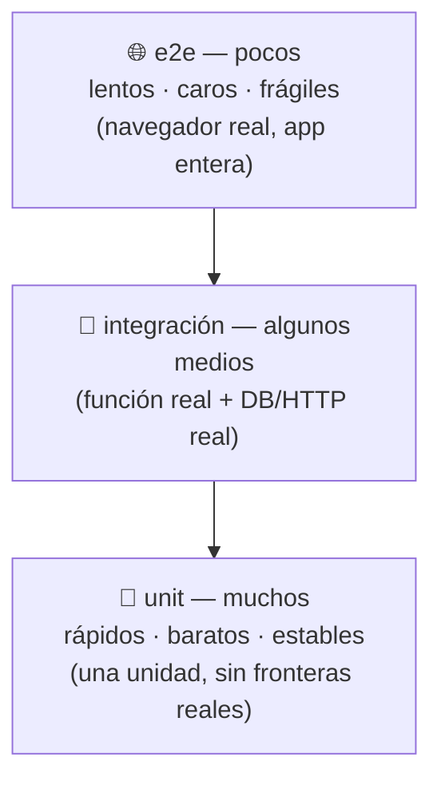

import Reto from "@components/Reto.astro";
import Solucion from "@components/Solucion.astro";
import Quiz from "@components/Quiz.astro";
import CheckDominio from "@components/CheckDominio.astro";
import Nivel from "@components/Nivel.astro";

<Nivel nivel="intermedio" />

En [`1.6`](/fase-1-lenguajes/1-6-primer-test-pytest/) escribiste tu primer test con pytest: una función, un `assert`, verde. Eso fue el "hola mundo" del testing. Esta lección te lleva del primer test a **pensar como alguien que escribe suites de verdad**: cómo se organiza el conjunto (la *pirámide*), las herramientas que te ahorran horas (fixtures, parametrize, mocking), su equivalente en el mundo JS/TS (Vitest), y la decisión que más separa a un semi-senior de un junior: **qué testear, qué no, y dónde está bien mockear.**

:::tip[Si ya escribiste tests antes]
¿Ya tienes una suite en algún proyecto? Úsalo como diagnóstico, no como excusa para saltar. La trampa del que "ya testea" es vivir en la **base** de la pirámide sin saberlo (todo unit, cero integración), **mockear de más** (tests que se rompen al refactorizar aunque el comportamiento no cambie) y **testear detalles de implementación** en vez de comportamiento. Salta a los [ejercicios Primero-Sin-IA](#7-ejercicios-primero-sin-ia): el primero mide si dominas parametrize + fixtures + mock-en-la-frontera con pytest; el segundo, lo mismo en Vitest con pnpm; el tercero mide tu **juicio** clasificando tests en la pirámide y cazando el sobre-mockeo. Si los cierras limpio, valida con el [check de dominio](#8-check-de-dominio).
:::

## 1. Qué vas a saber hacer

Al terminar, sin IA y sin notas, podrás:

- **O1 — Clasificar** un test como unit, integration o e2e, ubicarlo en la **pirámide de testing**, y explicar el trade-off de cada nivel (velocidad/confianza/costo de mantenimiento).
- **O2 — Implementar** una suite con **pytest** usando `@pytest.mark.parametrize`, una `@pytest.fixture` y un mock **solo en la frontera** (red/IO/tiempo), y su equivalente en **Vitest** (`it.each`, `vi.fn()`) corrido con **pnpm**.
- **O3 — Decidir** qué vale la pena testear y qué no, y diagnosticar dos antipatrones: el **sobre-mockeo** (acoplar el test a la implementación) y el test que **verifica un detalle interno** en vez del comportamiento observable.

## 2. Por qué importa (el dinero está aquí)

> 💰 **Por qué importa:** testing, código limpio y patrones son **expectativa semi-senior**; los juniors los saltan y por eso cobran menos. Una suite de tests no es "tarea aburrida después de programar": es la **red que te deja moverte rápido sin romper producción**, la **especificación ejecutable** de lo que tu código promete, y —en una entrevista— la diferencia entre "sé programar" y "sé entregar software que otros mantienen". Quien escribe tests que atrapan bugs reales y no estallan con cada refactor es exactamente quien vale la banda que buscas.

Tres razones hacen de esta sub-unidad una bisagra de la Fase 2 y de todo el curso:

1. **El testing es un hilo transversal, no una fase.** A partir de aquí, el Primero-Sin-IA se hace con **TDD** ([`2.7`](/fase-2-ingenieria/2-7-tdd-obligatorio/)): el test que escribes *antes* es tu forma de pensar el problema sin IA. Y cada capstone del curso exige una suite verde como parte del *Definition of Done*.
2. **El refactoring de [`2.3`](/fase-2-ingenieria/2-3-code-smells-refactoring/) depende de esto.** "Sin tests no se refactoriza" era una promesa; aquí aprendes a cumplirla. La red que ahí dabas por puesta, ahora la construyes tú.
3. **Es el puente a evaluar IA.** Testear código que llama a un LLM ([`2.11`](/fase-2-ingenieria/2-11-testing-codigo-llm/)) y, más allá, los **evals** de IA de la Fase 6, son esta misma disciplina aplicada a salidas no deterministas. Si no sabes mockear una frontera aquí, no sabrás mockear la API del LLM allá.

## 3. Lo que ya traes (actívalo)

Esta lección se para sobre lo anterior. Reúsalo antes de seguir:

- De [`1.6` Primer test con pytest](/fase-1-lenguajes/1-6-primer-test-pytest/): la estructura **AAA** (Arrange–Act–Assert), `assert`, y `pytest.approx` para comparar floats. Hoy multiplicamos eso por diez con parametrize y fixtures.
- De [`2.2` Clean code](/fase-2-ingenieria/2-2-clean-code/): funciones pequeñas y con un solo propósito. **El código fácil de testear y el código limpio son la misma cosa**: si una función es difícil de testear, casi siempre es porque hace demasiado o esconde sus dependencias.
- De [`2.3` Refactoring](/fase-2-ingenieria/2-3-code-smells-refactoring/): el ciclo red-green-**refactor**. Los tests son la "red verde" que hacía seguro ese tercer paso.

Antes de seguir, responde de memoria:

<Quiz
  question="¿Qué es, en una frase, un test unitario?"
  options={[
    "Un script que arranca toda la app y simula a un usuario haciendo clic",
    "Una verificación rápida y aislada de UNA unidad de comportamiento (una función/clase) sin tocar red, disco ni otros servicios",
    "Cualquier archivo que termine en _test y contenga la palabra assert",
  ]}
  answer={1}
  explanation="Un unit test verifica una unidad de comportamiento de forma aislada, en milisegundos, sin dependencias externas (red, DB, disco, hora real). Arrancar la app entera y simular clics es un e2e. Y el nombre del archivo no define nada: lo que define a un test unitario es su alcance y su aislamiento."
/>

## 4. Ejemplo resuelto, pensado en voz alta

Voy a construir una suite real, paso a paso. **No la leas como resultado terminado: léela como me oirías razonar.** Tenemos un módulo de puntos de fidelidad. Quiero tests que (a) cubran muchos casos sin repetir código, (b) compartan setup vía fixture, y (c) mockeen **solo** lo que cruza una frontera de red.

El código bajo prueba (en inglés, *system under test* o **SUT**):

```python
# loyalty.py
PUNTOS_POR_PESO = 0.01
BONO_CUMPLE = 500


def puntos_ganados(monto, es_cumple):
    if monto < 0:
        raise ValueError("monto no puede ser negativo")
    puntos = int(monto * PUNTOS_POR_PESO)
    if es_cumple:
        puntos += BONO_CUMPLE
    return puntos


def canjear(cliente_id, puntos, gateway):
    # gateway.descontar(...) hace una llamada de RED: es una frontera.
    if puntos <= 0:
        return False
    gateway.descontar(cliente_id, puntos)
    return True
```

### 4.1 Un caso, escrito a la antigua (AAA)

Razono: *"Empiezo con el caso más simple, con la estructura **Arrange–Act–Assert** que ya conozco. Un test = una afirmación de comportamiento, con un nombre que diga qué garantiza."*

```python
from loyalty import puntos_ganados


def test_puntos_ganados_sin_cumple_es_uno_por_ciento():
    # Arrange
    monto = 10000
    # Act
    resultado = puntos_ganados(monto, es_cumple=False)
    # Assert
    assert resultado == 100
```

Corro `pytest` → verde. Razono: *"Funciona, pero si quiero diez casos más voy a copiar/pegar este bloque diez veces. Eso es **Duplicated Code** en los tests, un smell igual que en el código de producción. La cura tiene nombre: **parametrize**."*

### 4.2 Muchos casos, cero duplicación → `parametrize`

Razono: *"`@pytest.mark.parametrize` corre la **misma** función de test con distintos datos. Cada fila es un caso independiente: si una falla, las demás siguen corriendo, y pytest me dice exactamente cuál cayó. Pienso la tabla como una mini-especificación: entrada → salida esperada, incluyendo los **bordes** (monto 0, el bono de cumpleaños, el redondeo de `int()`)."*

```python
import pytest
from loyalty import puntos_ganados


@pytest.mark.parametrize(
    "monto, es_cumple, esperado",
    [
        (10000, False, 100),     # caso base: 1%
        (0, False, 0),           # borde: monto cero
        (10000, True, 600),      # 100 + bono de cumpleaños
        (150, False, 1),         # int() trunca: 1.5 -> 1
        (99, False, 0),          # int() trunca: 0.99 -> 0
    ],
)
def test_puntos_ganados(monto, es_cumple, esperado):
    assert puntos_ganados(monto, es_cumple) == esperado


def test_monto_negativo_lanza_value_error():
    # El comportamiento de error TAMBIÉN es comportamiento: hay que testearlo.
    with pytest.raises(ValueError, match="negativo"):
        puntos_ganados(-1, es_cumple=False)
```

Corro `pytest -v` → 6 tests verdes (5 del parametrize + 1 del error). Razono: *"`pytest.raises` verifica que la función **lanza** la excepción correcta: un error esperado no es un fallo del test, es el contrato. Y noté algo: al pensar la tabla de casos, encontré el borde `99 -> 0` que el ojo pasa por alto. **Escribir los casos ES diseñar.**"*

### 4.3 Setup compartido → `fixture`

Razono: *"Ahora quiero testear `canjear`. Necesita un `gateway`, y varios tests lo van a necesitar. En vez de crearlo en cada test, lo pongo en una **fixture**: una función decorada con `@pytest.fixture` cuyo valor pytest **inyecta** en cualquier test que lo pida por nombre como argumento. Es Arrange reutilizable y explícito."*

```python
from unittest.mock import Mock


@pytest.fixture
def gateway():
    # Un doble de prueba: imita al gateway real sin tocar la red.
    return Mock()


def test_canjear_descuenta_y_confirma(gateway):
    ok = canjear(cliente_id="c1", puntos=50, gateway=gateway)

    assert ok is True
    gateway.descontar.assert_called_once_with("c1", 50)
```

### 4.4 Por qué se mockea `gateway` (y NADA más)

Razono en voz alta, porque **esta es la decisión que define al semi-senior**: *"`gateway.descontar` hace una llamada de red. Si la dejo real, mi test (a) es lento, (b) falla cuando no hay internet, y (c) cobra de verdad en un sistema real. Eso es una **frontera**: red, base de datos, disco, hora del sistema, aleatoriedad. **Se mockea en la frontera, no la lógica de adentro.** Fíjate que NO mockeo `puntos_ganados`: esa es la lógica que quiero verificar de verdad. Un `Mock()` de `unittest.mock` graba con qué se le llamó, así que puedo afirmar el **contrato de la interacción**: 'canjear llamó a descontar exactamente una vez, con estos argumentos'. Pero ojo: afirmar la interacción solo se justifica porque *provocar el efecto en el gateway ES el trabajo de `canjear`*. Para `puntos_ganados`, afirmo el **valor de retorno**, no cómo lo calculó."*

Y el caso que no debe tocar la frontera:

```python
def test_canjear_con_puntos_invalidos_no_llama_al_gateway(gateway):
    ok = canjear(cliente_id="c1", puntos=0, gateway=gateway)

    assert ok is False
    gateway.descontar.assert_not_called()   # NO se cobró nada
```

Razono: *"Este test vale oro: garantiza que con puntos inválidos **no** se dispara la llamada de red. `assert_not_called()` documenta una regla de negocio importante. Corro todo → 8 verdes."*

:::note[Tres formas de mockear en pytest, una idea]
- `unittest.mock.Mock` / `patch` — de la librería estándar; lo que usé arriba.
- `monkeypatch` (fixture *built-in*) — para reemplazar un atributo, variable de entorno o función: `monkeypatch.setattr("modulo.ahora", lambda: fecha_fija)`. Ideal para el **tiempo** o el **azar**.
- `mocker` (del plugin `pytest-mock`) — envuelve `unittest.mock` con limpieza automática: `mocker.patch(...)`.

La regla es la misma con las tres: **mockea la frontera, inyecta la dependencia, no toques la lógica.** La forma más limpia de "mockear" es a menudo no usar un mock: **inyectar** la dependencia como parámetro (como hicimos con `gateway`) y pasarle un *fake* simple.
:::

### 4.5 El mismo músculo en Vitest (lado JS/TS, con pnpm)

El stack JS cambia, la idea no. En vez de pytest usamos **Vitest**; en vez de `parametrize`, `it.each`; en vez de `Mock()`, `vi.fn()`. Y se corre con **pnpm** (`pnpm test`), nunca con npm.

```ts
// loyalty.test.ts
import { describe, it, expect, vi } from "vitest";
import { puntosGanados, canjear } from "./loyalty";

describe("puntosGanados", () => {
  it.each([
    { monto: 10000, esCumple: false, esperado: 100 },
    { monto: 0, esCumple: false, esperado: 0 },
    { monto: 10000, esCumple: true, esperado: 600 },
  ])("$monto (cumple=$esCumple) -> $esperado", ({ monto, esCumple, esperado }) => {
    expect(puntosGanados(monto, esCumple)).toBe(esperado);
  });
});

describe("canjear", () => {
  it("descuenta en el gateway cuando los puntos son válidos", () => {
    const gateway = { descontar: vi.fn() };           // doble en la frontera
    const ok = canjear("c1", 50, gateway);
    expect(ok).toBe(true);
    expect(gateway.descontar).toHaveBeenCalledWith("c1", 50);
  });

  it("no toca el gateway si los puntos son inválidos", () => {
    const gateway = { descontar: vi.fn() };
    expect(canjear("c1", 0, gateway)).toBe(false);
    expect(gateway.descontar).not.toHaveBeenCalled();
  });
});
```

Razono: *"`it.each` es el `parametrize` de Vitest; `vi.fn()` es el `Mock()`; `toHaveBeenCalledWith` es `assert_called_once_with`. Misma pirámide, misma disciplina de frontera. Aprender uno es aprender los dos."*

### 4.6 La pirámide: cómo se ordena todo esto

Tres niveles, en proporción de pirámide. Abajo, **muchos** tests baratos; arriba, **pocos** tests caros.



| Nivel | Qué prueba | Velocidad | Cuándo lo usas |
|---|---|---|---|
| **unit** | una función/clase aislada (mockeas las fronteras) | milisegundos | la base: el 70–80% de tu suite |
| **integration** | dos o más piezas reales juntas (tu código + Postgres real, o + un HTTP real) | décimas de seg. | el "pegamento" que un unit no ve |
| **e2e** | el sistema completo como un usuario ([`2.10` Playwright](/fase-2-ingenieria/2-10-playwright-e2e/)) | segundos | unos pocos *happy paths* críticos |

La forma de pirámide no es decorativa: si la inviertes (muchos e2e, pocos unit) tienes el **antipatrón del cono de helado** — una suite lenta, frágil, que falla por razones que no son tu bug y que nadie quiere mantener.

## 5. Errores que vas a tener (y por qué)

:::caution[Podrías pensar que "más cobertura = mejor suite"]
La cobertura (*coverage*) mide qué líneas **se ejecutaron**, no si las **verificaste**. Puedes tener 100% de cobertura sin un solo `assert` útil: el código corre, nada se comprueba. Perseguir un número de coverage como meta produce tests inflados que no atrapan bugs. La pregunta correcta no es "¿qué % cubrí?" sino "¿qué bug atraparía este test?". El porqué y la alternativa (mutation/behavior coverage) los desmenuzamos en [`2.9`](/fase-2-ingenieria/2-9-coverage-vs-mutation/) — por ahora: **un assert que importa > una línea cubierta.**
:::

:::caution[Podrías pensar que mockear todo hace los tests "más unitarios"]
El sobre-mockeo es la causa #1 de tests que **se rompen al refactorizar aunque el comportamiento no cambie**. Si mockeas una función interna pura, tu test ya no verifica *qué* hace el código, sino *cómo* lo hace: acoplas el test a la implementación. Resultado: refactorizas (sin cambiar el comportamiento), media suite se pone roja, y los tests dejaron de ser una red para volverse un freno. Regla: **mockea solo lo que cruza una frontera** (red, DB, disco, hora, azar). Lo de adentro, déjalo real.
:::

:::caution[Podrías pensar que hay que testear los métodos privados / detalles internos]
Testea **comportamiento observable** (lo que entra y sale por la interfaz pública), no detalles internos. Un test que afirma "se llamó al método privado `_calcular_iva`" se rompe en cuanto renombras o reorganizas, sin que el usuario note nada. Si un detalle interno es tan importante que quieres testearlo, suele ser señal de que merece ser su **propia** función pública testeable. Testea la API, no las tripas.
:::

:::caution[Podrías pensar que un e2e que cubre el flujo completo hace innecesarios los unit]
Al revés. Un e2e te dice "algo se rompió en este flujo de 12 pasos" pero no **dónde**; un unit te dice "esta función falla con este input". Necesitas la pirámide: muchos unit para localizar el bug en segundos, algunos integration para el pegamento, pocos e2e para confirmar que las piezas se hablan. Una suite de solo e2e tarda minutos, falla por *flakiness* (timeouts, red) y te deja depurando a ciegas.
:::

:::caution[Podrías pensar que testear la salida de un LLM es "igual que testear una función"]
No del todo, y es el puente a la Fase 6. Un LLM es **no determinista**: la misma entrada puede dar salidas distintas. No puedes hacer `assert salida == "texto exacto"`. En [`2.11`](/fase-2-ingenieria/2-11-testing-codigo-llm/) verás que se mockea la **respuesta del LLM** (la frontera, igual que el `gateway`) para testear *tu* lógica, y que evaluar la calidad de la salida del LLM es otra disciplina: los **evals**. Pero la mecánica de "mockea la frontera" que aprendes hoy es exactamente la que usarás allí.
:::

## 6. Práctica con andamiaje (que se desvanece)

Tres pasos, de más apoyo a menos. Hazlos **a mano primero** (predecir antes de ejecutar).

### 6.1 PREDICT — ¿cuántos tests corren y cuáles pasan?

Lee esta suite. **Sin ejecutarla**, responde: (a) ¿cuántos *test cases* cuenta pytest en total?, y (b) ¿cuál(es) **falla(n)**?

```python
import pytest

def es_par(n):
    return n % 2 == 0

@pytest.mark.parametrize("n, esperado", [
    (2, True),
    (3, False),
    (0, True),
    (-4, True),
    (7, True),   # ojo
])
def test_es_par(n, esperado):
    assert es_par(n) == esperado
```

<Solucion title="Ver la respuesta (solo después de predecir)">
**(a)** Cinco casos: `@pytest.mark.parametrize` genera **un test independiente por fila**, no uno solo. pytest los reporta como `test_es_par[2-True]`, `test_es_par[3-False]`, etc.

**(b)** Falla **uno**: `(7, True)`. `es_par(7)` es `False`, pero el caso espera `True` (es un error en los **datos del test**, no en la función). Los otros cuatro pasan. La lección clave: cuando un caso parametrizado falla, los demás **siguen corriendo** y pytest te dice exactamente cuál cayó por su id — por eso parametrize es superior a un solo test con cinco asserts (donde el primer fallo aborta el resto).
</Solucion>

### 6.2 Parsons — ordena la decisión "¿mockear o no?"

Estos cinco pasos para decidir si algo se mockea están **desordenados**. Reescríbelos en el orden de un razonamiento correcto:

```text
A. Si es lógica pura (cálculo, transformación), NO la mockees: testea su valor de retorno.
B. Pregunta: ¿esta dependencia cruza una frontera (red, DB, disco, hora, azar)?
C. Si NO cruza frontera, déjala real dentro del test (es parte de lo que verificas).
D. Identifica cada dependencia que la unidad bajo prueba usa.
E. Si SÍ cruza frontera, reemplázala por un doble (mock/fake/stub) inyectado.
```

<Solucion title="Ver el orden correcto">
Orden: **D → B → E → C → A**.

1. **D** — Primero mira qué dependencias toca la unidad.
2. **B** — Para cada una, la pregunta clave: ¿cruza una frontera?
3. **E** — Si sí (red/DB/disco/hora/azar), un doble inyectado.
4. **C** — Si no, déjala real: es parte del comportamiento que quieres verificar.
5. **A** — Y la lógica pura nunca se mockea; se verifica por su salida.

El error clásico es saltar directo a "mockeo todo lo que se mueva" (E sin pasar por B), que es justo el sobre-mockeo de la sección 5.
</Solucion>

### 6.3 MODIFY — añade el caso que falta

Toma la suite de `puntos_ganados` de la sección 4.2. Le falta un caso importante: **el monto exacto que está justo en el borde donde `int()` empieza a sumar un punto** (es decir, `monto * 0.01` pasa de `0.99...` a `1.0`). Escribe esa fila del `parametrize` (monto y esperado) y, en una frase, justifica por qué ese borde merece su propio caso. Pista: ¿qué devuelve `int(100 * 0.01)`? ¿Y `int(99 * 0.01)`?

## 7. Ejercicios Primero-Sin-IA

Ahora sin andamiaje. Resuélvelos **a mano, sin IA** dentro del timebox. Está bien que sea lento: el músculo se construye con el esfuerzo, no con la respuesta. El primero te hace escribir una suite pytest completa (parametrize + fixture + mock-en-frontera); el segundo, lo mismo en Vitest con pnpm; el tercero mide tu **juicio** sobre la pirámide y el sobre-mockeo.

<Reto title="Suite pytest para un módulo de envíos (parametrize + fixture + mock en la frontera)" timebox="40 min">

Te entregamos `solucion.py` con un módulo de tarifas de envío **ya implementado y correcto** (`costo_envio` puro y `cotizar`, que usa una dependencia inyectada `tasa_usd` — una frontera). **Tu trabajo no es tocar el módulo: es escribir la suite de tests** en `test_solucion.py`.

Tu suite debe:
- Usar `@pytest.mark.parametrize` para varios casos de `costo_envio`, incluyendo **bordes** (peso justo en un kg entero vs. con decimales; zona remota vs. normal; socio vs. no socio).
- Usar `pytest.raises` para el caso de error (peso ≤ 0).
- Usar una `@pytest.fixture` para el doble de `tasa_usd`.
- Testear `cotizar` **mockeando solo la frontera** (`tasa_usd`), sin mockear `costo_envio`, y afirmando tanto el resultado como que la dependencia se usó.

Autochequeo (la prueba de que tu suite **sirve**): en `mutantes/` hay dos versiones del módulo con un bug introducido. Una suite buena se pone **roja** con cada mutante. Cambia temporalmente el `import` para apuntar a `mutantes.mutante_a` y luego `mutantes.mutante_b`, corre `pytest`, confirma el rojo, y revierte.

**Hecho significa:**
- [ ] La suite pasa **verde** contra `solucion.py`.
- [ ] Hay al menos un `parametrize` con ≥5 casos y al menos un borde no obvio.
- [ ] Hay un `pytest.raises` para el peso inválido.
- [ ] `cotizar` se testea con la frontera mockeada (fixture) y `costo_envio` **real** (no mockeado).
- [ ] Tu suite **caza los dos mutantes** (se pone roja con cada uno).
- [ ] Puedes explicar **sin notas** por qué mockeas `tasa_usd` pero no `costo_envio`.

Enunciado completo y starter: `ejercicios/fase-2/pytest-suite-envios/` (carpeta del repo).

<Solucion title="Pista (ábrela solo si superaste el timebox)">
Para el borde del redondeo de kg, recuerda que se cobra por **kg completo** (`ceil`): un envío de 2.0 kg y otro de 2.1 kg deben dar resultados distintos — ese par es tu caso que caza el `mutante` que usa `floor`. Para `cotizar`, la fixture devuelve un *stub* simple: `lambda: 950` ya sirve, pero si quieres afirmar que se llamó, usa `Mock(return_value=950)` y luego `tasa.assert_called_once()`. No mockees `costo_envio`: si lo haces, tu test de `cotizar` ya no prueba el cálculo, solo prueba aritmética con un número que inventaste. Pista, no solución.
</Solucion>

</Reto>

<Reto title="Suite Vitest para un validador (it.each + vi.fn) con pnpm" timebox="30 min">

Te entregamos un módulo TypeScript `solucion.ts` (un validador/normalizador de emails y una función `registrar` que usa un `logger` inyectado). **Escribe la suite** en `solucion.test.ts` y córrela con **pnpm** (`pnpm install` una vez, luego `pnpm test`).

Tu suite debe:
- Usar `it.each` para una tabla de emails **válidos e inválidos** (incluye bordes: espacios alrededor, mayúsculas, `a@b` sin punto, dominio que termina en punto).
- Verificar que `registrar` **llama al `logger.warn`** cuando el email es inválido, y que **NO lo llama** cuando es válido, usando `vi.fn()`.
- Afirmar el valor de retorno de `registrar` (el email normalizado, o `null`).

**Hecho significa:**
- [ ] `pnpm test` pasa **verde**.
- [ ] El `it.each` cubre al menos 3 válidos y 3 inválidos, con bordes.
- [ ] Hay una aserción `toHaveBeenCalledWith` y otra `not.toHaveBeenCalled` sobre el `logger` mockeado.
- [ ] No mockeaste `esEmailValido` ni `normalizarEmail` (son la lógica pura que verificas).
- [ ] Puedes explicar **sin notas** qué es la frontera aquí y por qué el `logger` sí se mockea.

Enunciado completo y starter: `ejercicios/fase-2/vitest-suite-validador/` (carpeta del repo).

<Solucion title="Pista (ábrela solo si superaste el timebox)">
El `logger` es la frontera (en producción escribiría a un archivo o a un servicio de observabilidad). Por eso lo reemplazas por `{ warn: vi.fn() }` y afirmas la interacción. Para `it.each` con objetos: `it.each([{ entrada: " A@B.com ", esperado: "a@b.com" }])("...", ({ entrada, esperado }) => ...)`. Recuerda que el validador normaliza (trim + lowercase) **antes** de validar, así que `" A@B.COM "` es válido y `registrar` debe devolver `"a@b.com"`. Pista, no solución.
</Solucion>

</Reto>

<Reto title="Ubica los tests en la pirámide y caza el sobre-mockeo" timebox="25 min">

No se escribe código: se ejercita el **juicio**, que es lo que un entrevistador prueba. Te damos seis descripciones de tests y dos fragmentos. Entrega un `respuestas.md` con: (1) el **nivel de la pirámide** de cada uno de los seis (unit / integration / e2e) con una línea de justificación; (2) para los dos fragmentos, di **qué está mal** (uno sobre-mockea, otro testea un detalle interno) y **cómo lo arreglarías** sin escribir la solución completa; (3) un párrafo respondiendo: si tu suite tiene 4 e2e y 2 unit, ¿qué antipatrón tienes y qué harías?

**Hecho significa:**
- [ ] Clasificaste los 6 con justificación coherente (no solo la etiqueta).
- [ ] Identificaste el fragmento sobre-mockeado y por qué acopla a la implementación.
- [ ] Identificaste el fragmento que testea un detalle interno y propusiste testear comportamiento.
- [ ] Nombraste el antipatrón del cono de helado y una acción concreta.

Enunciado completo: `ejercicios/fase-2/piramide-decidir-nivel/` (carpeta del repo).

<Solucion title="Pista (ábrela solo si superaste el timebox)">
La pregunta que clasifica: ¿el test toca una **frontera real** (DB, HTTP, navegador)? Si no toca ninguna → unit. Si toca una o dos piezas reales (tu repositorio + Postgres real) → integration. Si maneja la app entera como un usuario → e2e. Para el sobre-mockeo, busca un mock de una función **pura** (sin frontera): ese mock sobra y acopla. Para el detalle interno, busca una aserción sobre un método "privado" o un nombre interno en vez de sobre lo que entra/sale. Pista, no solución.
</Solucion>

</Reto>

## 8. Check de dominio

Sin mirar la lección, en voz alta o por escrito:

<CheckDominio
  items={[
    "Definir unit, integration y e2e, y ubicarlos en la pirámide con su proporción relativa.",
    "Explicar el trade-off de cada nivel: velocidad vs. confianza vs. costo de mantenimiento.",
    "Escribir de memoria un @pytest.mark.parametrize con 3 casos y un pytest.raises.",
    "Explicar qué es una fixture y por qué evita repetir el Arrange.",
    "Decir la regla del mockeo: solo en la frontera (red/DB/disco/hora/azar), nunca la lógica pura.",
    "Dar el equivalente Vitest de parametrize y de Mock (it.each y vi.fn), y cómo se corre con pnpm.",
    "Explicar por qué 100% de coverage no garantiza una buena suite, y por qué el sobre-mockeo es un antipatrón.",
  ]}
/>

Si marcaste menos de seis, vuelve a la sección correspondiente **antes** de avanzar. No es un examen: es honestidad contigo.

<Quiz
  question="Tienes una función pura calcular_total(items) y una función guardar_orden(orden, db) que escribe en Postgres. ¿Qué mockeas en sus tests unitarios?"
  options={[
    "Mockeo calcular_total en ambos para aislar cada test al máximo",
    "No mockeo calcular_total (verifico su retorno real); mockeo db en el test de guardar_orden porque la base de datos es la frontera",
    "No mockeo nada: uso siempre la base de datos real para tener más confianza",
  ]}
  answer={1}
  explanation="calcular_total es lógica pura: se verifica por su valor de retorno, mockearla no tendría sentido (acoplaría el test a la implementación). guardar_orden cruza una frontera (Postgres): en el unit test se mockea db para que sea rápido y aislado; la integración real con Postgres se cubre con un test de integración aparte. Usar la DB real en TODOS los tests los vuelve lentos y frágiles (cono de helado)."
/>

## 9. Recursos (documentación oficial primero)

- **pytest — documentación oficial:** [docs.pytest.org](https://docs.pytest.org/) — empieza por "How to" → *parametrize*, *fixtures* y *monkeypatch*. Es tu referencia canónica.
- **`unittest.mock` (librería estándar):** [docs.python.org/3/library/unittest.mock.html](https://docs.python.org/3/library/unittest.mock.html) — `Mock`, `MagicMock`, `patch`, `assert_called_once_with`.
- **pytest-mock (`mocker`):** [pytest-mock.readthedocs.io](https://pytest-mock.readthedocs.io/) — el wrapper con limpieza automática.
- **Vitest — guía oficial:** [vitest.dev/guide](https://vitest.dev/guide/) — y [vitest.dev/api](https://vitest.dev/api/) para `it.each`, `vi.fn`, `vi.mock`.
- **Martin Fowler — "The Practical Test Pyramid":** [martinfowler.com/articles/practical-test-pyramid.html](https://martinfowler.com/articles/practical-test-pyramid.html) — la referencia conceptual de la pirámide y por qué importa la proporción.
- **Martin Fowler — "Test Double":** [martinfowler.com/bliki/TestDouble.html](https://martinfowler.com/bliki/TestDouble.html) — el vocabulario (mock/stub/spy/fake/dummy) que profundizas en [`2.8`](/fase-2-ingenieria/2-8-diseno-de-tests/).

## 10. Conexión con el capstone de la fase

El **[Capstone F2 — Refactor + suite de tests](/fase-2-ingenieria/proyecto/)** es, en buena parte, esta lección a escala de proyecto: sobre la mini-API de tu despensa (Fase 1) construirás la **suite que da soporte a todo el refactor**.

- La pirámide te dice **cómo repartir** esos tests: muchos unit sobre la lógica de negocio, algunos de integración sobre el acceso a datos, y los e2e quedan para [`2.10`](/fase-2-ingenieria/2-10-playwright-e2e/).
- El `parametrize` y las fixtures que practicaste aquí son lo que hace que esa suite sea legible y no un muro de copy/paste.
- La disciplina de **mockear solo en la frontera** es lo que evitará que tu suite se rompa cuando refactorices — exactamente el problema que [`2.3`](/fase-2-ingenieria/2-3-code-smells-refactoring/) te enseñó a no provocar.
- A partir de [`2.7` TDD](/fase-2-ingenieria/2-7-tdd-obligatorio/), esta suite no se escribe *después* del código: se escribe **antes**, como tu Primero-Sin-IA.

## 11. Reflexión y repaso espaciado

Cierra escribiendo dos o tres frases respondiendo: **en el ejercicio 1, ¿cuál de los dos mutantes te costó más cazar, y qué te dice eso sobre los casos borde que faltaban en tu primera versión de la suite?** Si un mutante pasó tu suite (quedó verde con el bug), tu suite tenía un hueco — nombrarlo ("me faltaba el par 2.0 vs 2.1 kg") es la señal de que entendiste qué hace valioso a un test.

Gancho de **spaced repetition**:

- **Mañana:** escribe de memoria, sin mirar, un `@pytest.mark.parametrize` con 3 casos + un `pytest.raises`, y su equivalente `it.each` + `vi.fn()` en Vitest. Si no te sale, no lo aprendiste todavía.
- **En 3 días:** dibuja la pirámide de memoria con las proporciones y, para cada nivel, di una frase de su trade-off. Luego explica la regla del mockeo en una sola oración.
- **En 1 semana:** toma una función con una dependencia de red en tu propio código (o en el capstone de la Fase 1) y escríbele dos tests: uno que mockee la frontera y verifique tu lógica, y otro que afirme que la frontera **no** se llama en el camino de error. Enseñarle esto a alguien (o a una grabación) es el test de dominio definitivo — y es justo lo que un entrevistador pide cuando dice "tienes esta función que llama a una API, ¿cómo la testeas?".
