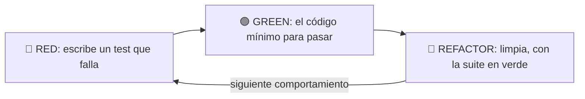

import Reto from "@components/Reto.astro";
import Solucion from "@components/Solucion.astro";
import Quiz from "@components/Quiz.astro";
import CheckDominio from "@components/CheckDominio.astro";
import Nivel from "@components/Nivel.astro";

<Nivel nivel="intermedio" />

En [`2.6` Testing: fundamentos](/fase-2-ingenieria/2-6-testing-fundamentos/) aprendiste a escribir un test con `pytest` después de tener el código. Esta lección invierte el orden y, al invertirlo, cambia todo: **escribes el test primero, lo ves fallar, y solo entonces escribes el código mínimo para que pase**. Esa inversión tiene un nombre —**TDD** (Test-Driven Development)— y un ritmo de tres tiempos: **red → green → refactor**.

No es un tema más de la fase. Es un **hábito**. Un semi-senior no "sabe lo que es TDD": lo *practica* casi sin pensar, igual que tú no piensas en cómo mover los dedos al teclear. Y resulta que es, además, el mejor entrenamiento posible para la regla que sostiene este curso entero: el **Primero-Sin-IA**. Cuando el método por defecto para resolver un problema es "escribe primero el test que describe lo que quieres", estás obligado a *pensar antes de codear*. Por eso aquí TDD deja de ser "nociones" y pasa a ser obligatorio.

:::tip[Si ya hiciste TDD antes]
¿Ya escribiste tests "siguiendo TDD" en algún proyecto? Úsalo como diagnóstico, no como excusa para saltar. La trampa del que "ya hace TDD" es en realidad hacer **test-after disfrazado**: escribir el código, después un test que ya sabes que pasa, y llamarlo TDD. Eso se nota en una cosa: **nunca viste el rojo**. Salta a los dos ejercicios Primero-Sin-IA (sección 7) y mide si puedes resolver un kata *sin escribir una línea de implementación antes de tener un test rojo*, y si tu bitácora muestra el `🔴` antes del `🟢` en cada ciclo. Si te cuesta, el problema casi siempre está en la sección 4 (el ritmo) o en la 5 (las misconceptions).
:::

## 1. Qué vas a saber hacer

Al terminar, sin IA y sin notas, podrás:

- **O1 — Implementar** una función pequeña siguiendo el ciclo **red-green-refactor** de forma estricta: el test que falla primero, ver el rojo, el código mínimo para el verde, y la limpieza con la suite en verde.
- **O2 — Explicar el trade-off** entre TDD y "test-after"/"code-first", y por qué *ver el rojo primero* no es ceremonia sino la verificación de que el test mismo sirve.
- **O3 — Usar TDD como método por defecto del Primero-Sin-IA**: traducir un requisito en una **lista de comportamientos**, y dejar que los tests, uno a uno, conduzcan el diseño en vez de imponerlo desde el inicio.

## 2. Por qué importa (el dinero está aquí)

> 💰 **Por qué importa:** testing, código limpio y patrones son la expectativa que separa a un semi-senior de un junior — y los juniors los saltan, por eso cobran menos. Pero hay un nivel más: el mercado no solo quiere que *tengas* tests, quiere ver *cómo trabajas*. En un take-home, en una sesión de pair programming, en una entrevista en vivo, quien escribe el test antes del código transmite una señal que no se finge: **sé lo que estoy construyendo antes de construirlo**. Esa es la marca de seniority que más rápido se reconoce y más difícil es improvisar.

Tres razones hacen de esta sub-unidad una bisagra de la Fase 2:

1. **Es un diferenciador de mercado en 2026.** Con el endurecimiento contra el uso de IA en entrevistas, las empresas migraron a formatos donde se observa tu *proceso*: pairing, take-homes evaluados por disciplina, "escribe un test que falle para este bug". Un hábito de TDD genuino es exactamente lo que esos formatos premian — y lo que la IA no puede pegar por ti, porque el test *es* tu razonamiento hecho código.
2. **Es la columna del Primero-Sin-IA.** Pedirle a una IA "escríbeme la función y sus tests" es la forma más rápida de no aprender nada: no diseñaste, no pensaste en los casos borde, no defines el contrato. TDD a mano te fuerza a hacer las tres cosas *antes* de tener una sola línea de implementación. Es el músculo que te hace dueño del código en vez de pasajero.
3. **Es el ancestro conceptual de los evals de IA.** Cuando llegues a [`2.11` Testing de código que llama a LLMs](/fase-2-ingenieria/2-11-testing-codigo-llm/) y, en la Fase 6, al *eval-driven development*, vas a reconocer el mismo patrón: define qué es "correcto" *antes* de optimizar, y deja que esa definición te guíe. TDD es ese hábito en su forma más pura. Lo que aprendes aquí lo vas a reusar el resto del curso.

## 3. Lo que ya traes (actívalo)

Esta lección se para sobre lo anterior. Reúsalo antes de seguir:

- De [`2.6` Testing: fundamentos](/fase-2-ingenieria/2-6-testing-fundamentos/): cómo se escribe y se corre un test con `pytest`, la estructura **AAA** (Arrange-Act-Assert), `@pytest.mark.parametrize` y `pytest.raises`. Toda la *mecánica* de testear ya la tienes; aquí cambia el **orden** y la **intención**.
- De [`1.6` Primer test con pytest](/fase-1-lenguajes/1-6-primer-test-pytest/): la primera vez que viste el ciclo red-green-refactor nombrado. Hoy deja de ser una idea y se vuelve tu forma de trabajar.
- De [`2.3` Code smells y refactoring](/fase-2-ingenieria/2-3-code-smells-refactoring/): la "R" final del ciclo. El **refactor** de TDD es exactamente el refactoring con red de tests que practicaste ahí — solo que ahora la red la construyes tú, test a test, *mientras* escribes el código.

Antes de seguir, responde de memoria:

<Quiz
  question="En TDD, ¿para qué sirve ver el test en ROJO antes de escribir el código?"
  options={[
    "Es solo una formalidad del proceso; el rojo no aporta información real",
    "Comprueba que el test PUEDE fallar — es decir, que realmente prueba algo y no es un falso verde",
    "Sirve para medir cuánto coverage te falta antes de empezar",
  ]}
  answer={1}
  explanation="Un test que nunca lo viste fallar no prueba nada: pudo quedar mal escrito (un assert trivial, un import equivocado, una función que ya devolvía ese valor por casualidad). Ver el ROJO confirma que el test reacciona a la ausencia del comportamiento. Si pasa a la primera sin código nuevo, sospecha del test, no celebres."
/>

## 4. El ciclo, pensado en voz alta

Voy a construir una función con TDD **paso a paso**. No leas esto como un resultado terminado: léelo como me oirías razonar si estuviera al lado tuyo, hablando mientras escribo. El problema: una función `dias_de_mes(mes, anio)` que devuelve cuántos días tiene un mes. Suena trivial. *No lo es* —febrero existe—, y por eso es perfecta para ver cómo los tests, uno a uno, te empujan a un diseño que no habías planeado.

El ritmo tiene tres tiempos y se repite:



### 4.0 Primero, la lista de comportamientos (mini-spec)

Razono: *"Antes de tocar el teclado escribo, en una línea cada uno, los comportamientos que quiero. No es código: es mi mini-spec. Me da el orden de los tests y me obliga a pensar los casos borde **antes** de programar."*

```text
- enero tiene 31 días
- abril tiene 30 días
- febrero tiene 28 días en un año normal
- febrero tiene 29 días en un año bisiesto (2024)
- un mes inválido (13) lanza un error claro
```

Esta lista *es* el Primero-Sin-IA. Si la IA me la genera, me robó la parte que importa.

### 4.1 Ciclo 1 — el primer rojo (y por qué importa)

🔴 **RED.** Escribo el test del comportamiento más simple. Todavía no existe `dias_de_mes`.

```python
# test_dias.py
from dias import dias_de_mes


def test_enero_tiene_31():
    assert dias_de_mes(1, 2023) == 31
```

Corro `pytest`. Falla con `ImportError` / `NameError`: la función no existe. Razono: *"Bien. Este rojo es el correcto: falla porque **falta el código**, no porque el test esté mal escrito. Acabo de comprobar que el test reacciona. Ahora —y solo ahora— tengo permiso para escribir implementación."*

🟢 **GREEN.** El código **mínimo** para pasar. Y mínimo significa mínimo, aunque te dé vergüenza:

```python
# dias.py
def dias_de_mes(mes, anio):
    return 31
```

Corro `pytest` → **verde**. Razono en voz alta sabiendo lo que estás pensando: *"Sí, devolví `31` a lo bruto. Parece trampa. No lo es: es la técnica **fake it** (finge hasta lograrlo). Solo escribo el código que un test **exige**, ni una línea más. Mi único test exige que enero dé 31; `return 31` lo cumple. El siguiente test va a destruir esta mentira y eso es justo lo que lo hará crecer. Esto se llama **triangulación**: cada test nuevo agrega un punto que fuerza una generalización."*

### 4.2 Ciclo 2 — el segundo test rompe la mentira

🔴 **RED.** Agrego abril:

```python
def test_abril_tiene_30():
    assert dias_de_mes(4, 2023) == 30
```

Corro → rojo: `dias_de_mes(4, 2023)` devuelve `31`, esperaba `30`. *"Perfecto. El `return 31` ya no alcanza. El test me obliga a distinguir meses."*

🟢 **GREEN.** Mínimo para pasar ambos:

```python
def dias_de_mes(mes, anio):
    if mes == 4:
        return 30
    return 31
```

Verde. *"Sigue siendo medio falso —solo conozco abril como excepción—, pero los dos tests pasan. No me adelanto a febrero todavía: no hay test que lo pida."*

### 4.3 Ciclo 3 — febrero entra

🔴 **RED.**

```python
def test_febrero_normal_tiene_28():
    assert dias_de_mes(2, 2023) == 28
```

Rojo (devuelve 31). 🟢 **GREEN:**

```python
def dias_de_mes(mes, anio):
    if mes == 2:
        return 28
    if mes == 4:
        return 30
    return 31
```

Verde. *"Noto que esto va a escalar feo si sigo con un `if` por mes. Pero todavía no refactorizo: la regla es **no limpiar en rojo**. Termino de sacar el comportamiento de febrero, que es el interesante, y limpio después."*

### 4.4 Ciclo 4 — el año bisiesto fuerza el diseño real

🔴 **RED.** Aquí está el comportamiento que hace al problema no-trivial:

```python
def test_febrero_bisiesto_2024_tiene_29():
    assert dias_de_mes(2, 2024) == 29
```

Rojo: devuelve `28`. *"Este test es el que justifica todo. Ahora `dias_de_mes` **necesita** mirar el año. El diseño me lo pidió el test, no lo impuse yo de entrada."*

🟢 **GREEN.** Mínimo honesto que pasa los cuatro:

```python
def dias_de_mes(mes, anio):
    if mes == 2:
        if anio % 4 == 0:
            return 29
        return 28
    if mes == 4:
        return 30
    return 31
```

Verde, los cuatro tests. *"Tengo comportamiento correcto para todo lo que probé. Ahora —en verde— puedo limpiar sin miedo."*

### 4.5 Refactor — limpiar con la red puesta

🔵 **REFACTOR.** Razono: *"Estoy en verde: mi red me avisa si rompo algo. Saco la lógica de bisiesto a su propia función (le doy nombre, la hago testeable aparte) y reemplazo la cascada de `if` por una tabla. Corro `pytest` después de **cada** cambio."*

```python
DIAS_POR_MES = {1: 31, 2: 28, 3: 31, 4: 30, 5: 31, 6: 30,
                7: 31, 8: 31, 9: 30, 10: 31, 11: 30, 12: 31}


def es_bisiesto(anio):
    return anio % 4 == 0 and (anio % 100 != 0 or anio % 400 == 0)


def dias_de_mes(mes, anio):
    if mes == 2 and es_bisiesto(anio):
        return 29
    return DIAS_POR_MES[mes]
```

Corro → **verde**. *"Misma conducta observable, estructura mucho mejor. Eso es refactoring (lo de [`2.3`](/fase-2-ingenieria/2-3-code-smells-refactoring/)): cambié la estructura, no el comportamiento. Y fíjate que aproveché para meter la regla **completa** del bisiesto (divisible por 4, salvo siglos no divisibles por 400)."*

:::caution[Un detalle honesto que debes ver]
Metí la regla `% 100`/`% 400` en el refactor, pero **ningún test la prueba**. `dias_de_mes(2, 1900)` debería dar 28 (1900 no es bisiesto), y mi suite *no lo verifica*. TDD no demuestra que tu código es correcto: demuestra que cumple **los tests que escribiste**. Comportamiento sin test = comportamiento sin red. La disciplina honesta es: si me importa el caso de 1900, escribo `assert dias_de_mes(2, 1900) == 28` *en rojo primero*. Lo que no está testeado, no está garantizado.
:::

### 4.6 Ciclo 5 — el camino de error también es un comportamiento

🔴 **RED.** Un mes inválido no debería devolver basura (hoy lanza un `KeyError` críptico). Quiero un error claro:

```python
import pytest


def test_mes_invalido_lanza_valueerror():
    with pytest.raises(ValueError, match="mes"):
        dias_de_mes(13, 2023)
```

Rojo: hoy levanta `KeyError`, no `ValueError`. 🟢 **GREEN:**

```python
def dias_de_mes(mes, anio):
    if mes not in DIAS_POR_MES:
        raise ValueError(f"mes inválido: {mes}")
    if mes == 2 and es_bisiesto(anio):
        return 29
    return DIAS_POR_MES[mes]
```

Verde. *"Los caminos de error son comportamiento de primera clase, no un 'lujo'. La mayoría de los bugs de producción —y de los agujeros de seguridad— viven justo aquí, en lo que pasa con la entrada inválida. TDD me obliga a diseñarlos, no a olvidarlos."*

El historial cuenta la historia. Cada verde es un commit pequeño con [Conventional Commits](https://www.conventionalcommits.org/): `feat: dias_de_mes maneja meses de 30 días`, `feat: soporte de año bisiesto`, `refactor: tabla de días + es_bisiesto`, `feat: valida mes fuera de rango`. Un reviewer lee tu repo y *ve* cómo pensaste.

## 5. Non-examples y misconceptions (lee esto despacio)

Aquí es donde la mayoría cree que hace TDD y no lo hace. Confronta cada idea:

:::caution[Misconception 1: "TDD = escribir tests"]
**Está mal.** TDD no es "tener tests"; es escribir **el test primero** y dejar que conduzca el diseño. Escribir el código y *después* un test (test-after) puede dar la misma suite, pero te pierdes lo esencial: el test-after se escribe sabiendo cómo quedó el código, así que tiende a confirmarlo en vez de cuestionarlo, y nunca lo viste fallar. Señal delatora: si nunca apareció un rojo, no fue TDD.
:::

:::caution[Misconception 2: "Ver el rojo es ceremonia, ya sé que va a fallar"]
**Está mal.** El rojo no es para *ti*, es para *el test*. Verifica que el test puede distinguir entre "hay comportamiento" y "no lo hay". Un `assert` mal escrito, un import al módulo equivocado, o una función que ya devolvía ese valor por casualidad producen un **falso verde**: un test que pasa siempre y no protege nada. El rojo es la única prueba de que tu test sirve.
:::

:::caution[Misconception 3: "Hardcodear `return 31` es trampa"]
**Está mal.** "Fake it till you make it" es una técnica legítima y deliberada. Escribir lo *mínimo* —incluso una constante— te mantiene honesto: solo agregas código que un test exige. El siguiente test (triangulación) te fuerza a generalizar. Lo contrario —escribir la solución "completa" de una— es adivinar, y adivinar es donde entran los bugs que ningún test cubre.
:::

:::caution[Misconception 4: "TDD busca 100% de coverage / un test por método"]
**Está mal.** El coverage es un *subproducto*, no la meta. TDD persigue **comportamiento**: cada test describe algo que el sistema debe hacer. Perseguir el porcentaje te lleva a tests que ejecutan líneas sin afirmar nada útil. La diferencia entre coverage como número y aserciones que importan es justo el tema de [`2.9` Coverage vs mutation/behavior](/fase-2-ingenieria/2-9-coverage-vs-mutation/).
:::

:::caution[Misconception 5: "TDD me hace más lento"]
**A medias, y vale el trade-off.** Sí: tecleas más al principio (escribes el test antes). Pero ganas en tres frentes: feedback inmediato (sabes al segundo qué rompiste), menos tiempo en el debugger, y un diseño que nace testeable. El balance honesto: TDD **no aplica a todo**. Para un *spike* exploratorio (estás aprendiendo qué hacer), una UI puramente visual, o un script de un solo uso, TDD estorba. Para lógica con reglas, casos borde y errores —el 80% del código de trabajo— es más rápido de punta a punta.
:::

:::caution[Misconception 6: "Le pido a la IA que escriba el test y el código"]
**Está mal, y es el punto entero del curso.** El test es tu pensamiento. Si la IA lo escribe, no diseñaste el contrato, no pensaste los bordes, no decidiste qué es "correcto". Te queda código que *parece* cubierto pero que no entiendes ni puedes defender en una entrevista. TDD a mano es el Primero-Sin-IA en su forma más estricta: la IA, si acaso, revisa o explica **después** de que tú cerraste el ciclo.
:::

## 6. Práctica con andamiaje

Antes de los ejercicios sin red, calienta con tres pasos que se desvanecen. Hazlos en orden.

### 6.1 PREDICT — ¿este verde es real?

Mira este test y esta implementación. **Predice** si el test pasa, y —más importante— si pasar significa que el código es correcto. No ejecutes todavía; razónalo.

```python
# implementación
def es_par(n):
    return True

# test
def test_es_par():
    assert es_par(4) == True
```

<Solucion title="Ver la respuesta (solo después de predecir)">
El test **pasa** (verde)… y no prueba **nada**. `es_par` siempre devuelve `True`, así que `es_par(4)` da `True` por la razón equivocada. Este es el **falso verde** del que hablan las misconceptions 2 y 3: el test nunca lo viste fallar, y un `assert es_par(3) == False` lo tumbaría al instante. Moraleja de TDD: un test que pasa con una implementación obviamente rota es un test que no afirma lo suficiente. Por eso se escribe el test esperando el rojo, y por eso se triangula con un segundo caso.
</Solucion>

### 6.2 PARSONS — ordena el ciclo

Estos pasos de **un** ciclo de TDD están desordenados. Reescríbelos en el único orden que respeta la disciplina ("no escribir código sin un test rojo", "no limpiar en rojo"):

```text
A. Escribe el código MÍNIMO para que el test pase (verde).
B. Corre la suite y confirma el ROJO (falla por la razón correcta: falta el código).
C. Refactoriza si hace falta, corriendo los tests tras cada cambio — siempre en verde.
D. Elige el siguiente comportamiento de tu lista y escribe un test que lo describa.
E. Corre la suite: debe estar toda en VERDE antes de tocar nada nuevo.
```

<Solucion title="Ver el orden correcto">
Orden: **D → B → A → E → C** (y vuelta a D para el siguiente comportamiento).

1. **D** — eliges el siguiente comportamiento y escribes su test. (El test viene de tu mini-spec.)
2. **B** — corres y confirmas el **rojo correcto**: falla porque falta el código, no por un error tonto del test.
3. **A** — el código **mínimo** para pasar (fake it si hace falta). Nada que un test no exija.
4. **E** — corres todo: **verde** completo. Solo en verde tienes permiso de limpiar.
5. **C** — **refactor** con la red puesta, corriendo tests tras cada paso.

El error clásico es saltarse **B** (escribir código sin haber visto el rojo → no sabes si el test sirve) o hacer **C** sin **E** (refactorizar en rojo → ya no sabes qué rompiste).
</Solucion>

### 6.3 MODIFY — cierra un ciclo tú

Toma la `dias_de_mes` final de la sección 4. Agrega **un** comportamiento nuevo siguiendo el ciclo completo: *"si `anio` es menor que 1, lanza `ValueError`"*. Escribe (1) el test que falla, (2) córrelo mentalmente y predice el rojo, (3) el código mínimo, (4) decide si hay algo que refactorizar. Escribe las cuatro piezas. Pregúntate al final: ¿el test de `anio` inválido va *antes* o *después* del de `mes` inválido en tu validación, y cambia eso algún comportamiento observable?

## 7. Ejercicios Primero-Sin-IA

Ahora sin andamiaje. Resuélvelos **a mano, sin IA**, dentro del timebox. La regla de oro: **no escribas una línea de implementación sin un test rojo que la exija**. Tu entregable incluye una `bitacora.md` donde anotas, por ciclo, el `🔴`/`🟢`/`🔵` — esa bitácora *es* la evidencia de que hiciste TDD y no test-after. Está bien que sea lento: el músculo se construye con el esfuerzo, no con la respuesta.

<Reto title="Sumador de texto (kata de TDD desde cero)" timebox="35–45 min">

Construye, **test-driven**, una función `sumar(numeros: str) -> int` que suma los números de una cadena. No te damos los tests: los escribes tú, uno por comportamiento, en este orden:

1. `sumar("")` devuelve `0`.
2. `sumar("1")` devuelve `1`.
3. `sumar("1,2")` devuelve `3`.
4. `sumar("1,2,3,4")` devuelve `10` (cualquier cantidad de números).
5. `sumar("1\n2,3")` devuelve `6` (el salto de línea `\n` también separa, igual que la coma).
6. `sumar(" 1 , 2 ")` devuelve `3` (ignora espacios alrededor de cada número).
7. `sumar("1,-2,3")` lanza `ValueError` y el mensaje **incluye** el número negativo.

La disciplina (no la saltes):
- Para **cada** comportamiento: escribe el test → corre y confirma el **rojo** → código **mínimo** para el verde → refactor si hace falta. Anota el ciclo en `bitacora.md`.
- Empieza por el comportamiento 1 y baja en orden. Usa "fake it" cuando sea natural (el `0` de la cadena vacía sale casi gratis).
- Cuando llegues al 5, vas a tener que **refactorizar** el split: hazlo en verde.
- El 7 usa `pytest.raises(ValueError, match=...)` (lo viste en [`2.6`](/fase-2-ingenieria/2-6-testing-fundamentos/)).

Entregable: tu `test_solucion.py` (con un test por comportamiento, escritos por ti), tu `solucion.py`, y `bitacora.md` con el log de ciclos. Al **final**, corre `acceptance_test.py` (te lo damos) para confirmar que no se te escapó ningún comportamiento — pero no lo abras antes: te quita el trabajo de traducir la spec a tests, que es justo lo que se entrena.

**Hecho significa:**
- [ ] Hay **un test por comportamiento** de la lista, y tu `bitacora.md` muestra el `🔴` antes del `🟢` en cada uno.
- [ ] `pytest` (tus tests) y `pytest acceptance_test.py` están ambos en **verde**.
- [ ] El caso negativo lanza `ValueError` con el número en el mensaje, y lo testeaste con `pytest.raises`.
- [ ] Tu implementación no tiene código que ningún test exija (nada "por si acaso").
- [ ] Puedes explicar **sin notas** qué es "fake it", qué es "triangulación", y dónde aparecieron en tu kata.

Enunciado completo y starter: `ejercicios/fase-2/tdd-sumador-de-texto/` (carpeta del repo).

<Solucion title="Pista (ábrela solo si superaste el timebox)">
El comportamiento 1 sale con `if numeros == "": return 0`. Para el 2 y 3, "fake it" pierde fuerza rápido: en cuanto tengas `"1,2"`, separa por coma, convierte a `int` y suma. El comportamiento 4 ya funciona gratis si usaste `split(",")` + `sum(...)` (esa es la gracia de la triangulación: el diseño general aparece). El 5 es el refactor clave: antes de separar, reemplaza `\n` por `,` (`numeros.replace("\n", ",")`) y vuelves a tu split de una sola separación. El 6: aplica `.strip()` a cada parte antes de `int(...)`. El 7: junta los negativos en una lista y, si no está vacía, `raise ValueError(f"...{negativos}")`. Pista, no solución.
</Solucion>

</Reto>

<Reto title="Dividir un gasto en partes justas (TDD de una regla real)" timebox="35–45 min">

Construye, **test-driven**, `dividir_gasto(monto_clp: int, personas: int) -> list[int]` que reparte un gasto entero (en pesos chilenos, sin decimales) entre varias personas **lo más parejo posible**: las partes suman *exactamente* el monto y difieren entre sí en a lo más 1 peso. Cuando la división no es exacta, las primeras personas asumen el peso de más. Es la lógica que vive dentro de un Splitwise. Comportamientos, en orden:

1. `dividir_gasto(100, 2)` → `[50, 50]` (división exacta).
2. `dividir_gasto(100, 3)` → `[34, 33, 33]` (sobra 1 peso → a la primera persona; la suma es 100).
3. `dividir_gasto(10, 4)` → `[3, 3, 2, 2]` (sobran 2 → a las dos primeras).
4. `dividir_gasto(0, 3)` → `[0, 0, 0]`.
5. `dividir_gasto(100, 1)` → `[100]`.
6. `dividir_gasto(100, 0)` lanza `ValueError` (no se reparte entre cero personas).
7. `dividir_gasto(-100, 2)` lanza `ValueError` (monto negativo no tiene sentido aquí).

La disciplina:
- Un test por comportamiento, **rojo antes que verde**, bitácora por ciclo.
- El comportamiento 2 es el que fuerza el diseño: la división entera sola da `[33, 33, 33]` y *no suma 100*. Ahí tu test rojo te empuja a repartir el resto. Resístete a programarlo "completo" desde el 1: deja que el test 2 te lo pida.
- Después del verde, **refactoriza** a algo limpio (pista: `divmod` reparte cociente y resto de una).
- Escribe, además de los 7, **al menos un test de invariante**: que `sum(dividir_gasto(m, p)) == m` para algún caso no exacto. Es el puente a las *property-based tests* de [`2.8`](/fase-2-ingenieria/2-8-diseno-de-tests/).

Entregable: tu `test_solucion.py`, tu `solucion.py`, y `bitacora.md`. Al final, corre `acceptance_test.py` para verificar.

**Hecho significa:**
- [ ] Un test por comportamiento + al menos un test de invariante (la suma); bitácora con `🔴`→`🟢` por ciclo.
- [ ] `pytest` (tuyos) y `acceptance_test.py` en **verde**.
- [ ] El reparto del resto está dirigido por el test 2/3, no programado "de una" antes de tener el rojo.
- [ ] Los dos caminos de error (`personas <= 0`, `monto < 0`) lanzan `ValueError`, testeados con `pytest.raises`.
- [ ] Puedes explicar **sin notas** por qué `sum(resultado) == monto` es una propiedad más fuerte que cualquier caso suelto.

Enunciado completo y starter: `ejercicios/fase-2/tdd-dividir-gasto/` (carpeta del repo).

<Solucion title="Pista (ábrela solo si superaste el timebox)">
Para el test 1, `[monto // personas] * personas` pasa. El test 2 lo rompe (suma 99, no 100). Ahí llega el insight: `base, resto = divmod(monto, personas)` te da el cociente y cuántos pesos sobran. Las primeras `resto` personas reciben `base + 1`; el resto, `base`. Una comprensión lo expresa: `[base + 1 if i < resto else base for i in range(personas)]`. Valida primero (`if personas <= 0: raise ...`, `if monto < 0: raise ...`) — y escribe esos tests de error *en rojo* antes de la guarda. Pista, no solución.
</Solucion>

</Reto>

## 8. Check de dominio

Sin mirar la lección, en voz alta o por escrito:

<CheckDominio
  items={[
    "Nombrar los tres tiempos del ciclo y qué se hace (y qué NO) en cada uno: red, green, refactor.",
    "Explicar por qué se escribe el test ANTES del código y por qué hay que VER el rojo.",
    "Definir 'fake it' y 'triangulación', y dar un ejemplo de cada uno de tu propio kata.",
    "Distinguir TDD de test-after, y nombrar la señal que delata al test-after disfrazado.",
    "Explicar el trade-off honesto de TDD: cuándo vale la pena y cuándo estorba (spike, UI, script).",
    "Explicar por qué TDD no demuestra corrección, solo que se cumplen los tests que escribiste.",
    "Escribir a mano un ciclo completo (test rojo → mínimo verde → refactor) para una función nueva.",
  ]}
/>

Si marcaste menos de seis, vuelve a la sección correspondiente **antes** de avanzar. No es un examen: es honestidad contigo.

<Quiz
  question="Escribes un test, lo corres ANTES de implementar nada, y pasa en VERDE de inmediato. ¿Qué significa?"
  options={[
    "Que tienes suerte y puedes pasar al siguiente comportamiento",
    "Que algo anda mal con el test: o no afirma lo que crees, o el comportamiento ya existía — investiga antes de seguir",
    "Que el código que vas a escribir es innecesario, así que lo saltas",
  ]}
  answer={1}
  explanation="Un test nuevo que pasa sin código nuevo es una alarma, no una buena noticia. Casos típicos: el assert es trivialmente cierto, importaste o llamaste algo equivocado, o el comportamiento ya estaba cubierto por código previo (y entonces este test es redundante o tu spec se solapa). En TDD el verde inmediato te manda a revisar el test, no a celebrar."
/>

## 9. Recursos (documentación oficial primero)

- **pytest — documentación oficial:** [docs.pytest.org](https://docs.pytest.org/) — tu herramienta para el ciclo en Python; revisa "How to write and report assertions" y `pytest.raises`.
- **"Test-Driven Development: By Example" (Kent Beck):** [martinfowler.com/bliki/TestDrivenDevelopment.html](https://martinfowler.com/bliki/TestDrivenDevelopment.html) — la definición canónica del ciclo y de "fake it / triangulate", por quien lo formalizó (la página de Fowler resume y enlaza el libro).
- **The Three Rules of TDD (Robert C. Martin):** [butunclebob.com/ArticleS.UncleBob.TheThreeRulesOfTdd](http://butunclebob.com/ArticleS.UncleBob.TheThreeRulesOfTdd) — las tres reglas mínimas que definen el hábito.
- **"Is TDD Dead?" (Beck, Fowler, DHH) — la visión honesta:** [martinfowler.com/articles/is-tdd-dead/](https://martinfowler.com/articles/is-tdd-dead/) — el debate sobre cuándo TDD ayuda y cuándo no; te da el trade-off sin dogma.
- **Vitest — para el lado TypeScript:** [vitest.dev](https://vitest.dev/) — el mismo ciclo en JS/TS (`describe`/`it`/`expect`, `expect(fn).toThrow()`); lo usarás cuando hagas TDD en tu app bilingüe.
- **Conventional Commits:** [conventionalcommits.org](https://www.conventionalcommits.org/) — para que tu historial muestre los ciclos (`feat:`, `refactor:`, `test:`).

## 10. Conexión con el capstone de la fase

El **[Capstone F2 — Refactor + suite de tests](/fase-2-ingenieria/proyecto/)** asume este hábito. Cuando tomes tu mini-API de la Fase 1 y le construyas la suite, **toda nueva función o arreglo va test-first**:

- Cada feature nueva nace de un test rojo; cada bug que encuentres se reproduce con un **test que falla** *antes* de arreglarlo (TDD aplicado a debugging, lo profundizas en [`2.12`](/fase-2-ingenieria/2-12-debugging-codigo-legado/)).
- El **refactor** del capstone es la "R" de este ciclo a escala: lo de [`2.3`](/fase-2-ingenieria/2-3-code-smells-refactoring/), con tu red de tests dándote permiso para mover código.
- Tu historial de **Conventional Commits** mostrará el ritmo red-green-refactor — un reviewer verá *cómo* trabajaste, no solo el resultado. Esa es la evidencia de seniority que pide el Definition of Done de la fase.
- La calidad de esos tests (no su cantidad ni su coverage) se mide en [`2.9`](/fase-2-ingenieria/2-9-coverage-vs-mutation/); cómo diseñarlos bien, en [`2.8`](/fase-2-ingenieria/2-8-diseno-de-tests/).

## 11. Reflexión y repaso espaciado

Cierra escribiendo dos o tres frases respondiendo: **¿en qué momento de los katas sentiste la tentación de escribir "la solución completa" antes de tener un test rojo que la pidiera, y qué te dice esa tentación sobre tu dependencia de adivinar en vez de diseñar?** Nombrar esa fricción ("quería programar el reparto del resto de una, y tuve que frenarme hasta que el test 2 me lo exigió") es la señal de que el hábito está calando.

Gancho de **spaced repetition**:

- **Mañana:** reescribe de memoria, sin mirar, el kata del sumador de texto, comportamiento por comportamiento, viendo el rojo en cada uno. Si no te sale el orden de los ciclos, no lo aprendiste todavía.
- **En 3 días:** toma cualquier función de tu código viejo que *no* tenga tests y aplícale el ciclo al revés: escribe primero un test que falle para un comportamiento que crees que tiene, y mira si pasa. Te sorprenderá cuántas veces el "verde fácil" esconde un falso verde.
- **En 1 semana:** explícale a alguien (o a una grabación) el ciclo red-green-refactor y por qué se ve el rojo primero, usando un ejemplo en vivo. Enseñarlo es el test de dominio definitivo — y es exactamente lo que un entrevistador te pedirá cuando diga "escríbeme un test que falle para este requisito".
