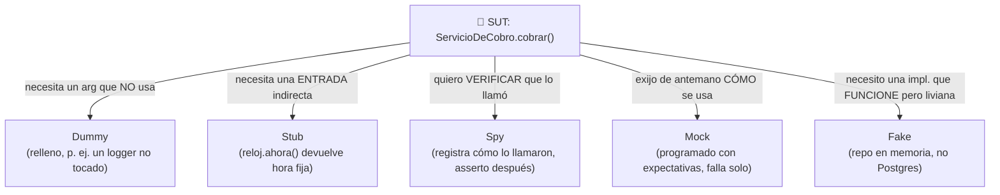

import Reto from "@components/Reto.astro";
import Solucion from "@components/Solucion.astro";
import Quiz from "@components/Quiz.astro";
import CheckDominio from "@components/CheckDominio.astro";
import Nivel from "@components/Nivel.astro";

<Nivel nivel="intermedio" />

En [`2.6`](/fase-2-ingenieria/2-6-testing-fundamentos/) aprendiste a escribir un test y en [`2.7`](/fase-2-ingenieria/2-7-tdd-obligatorio/) a dejar que el test maneje el diseño (red-green-refactor). Esta lección responde la pregunta que viene después: **ya sé escribir tests; ¿cómo los diseño para que sean buenos?** Un test malo es peor que ningún test: te da una falsa sensación de seguridad, se rompe cada vez que tocas el código aunque el comportamiento no cambie, y nadie confía en él. Aquí aprendes las cuatro herramientas que separan un test frágil de uno que te respalda de verdad: **estructura (AAA / Given-When-Then)**, **test doubles (la taxonomía completa, no "mock para todo")**, **property-based testing** y **contract testing**.

:::tip[Si ya escribiste tests con mocks]
¿Ya usaste `unittest.mock`, `jest.fn()` o `vi.fn()` en tu trabajo? Úsalo como diagnóstico, no como permiso para saltar. La trampa del que "ya mockea" es **mockear de más** (acoplar el test a la implementación, no al comportamiento) y llamar "mock" a todo cuando el 80% de las veces lo correcto era un **stub** o un **fake**. Salta a los **dos ejercicios Primero-Sin-IA** (sección 7): el primero mide si escribes *property-based tests* que cazan bugs que tus tres ejemplos no cazan; el segundo mide si eliges el double correcto por colaborador y sabes *cuándo el problema pide contract testing y no un mock*. Si los cierras limpio, valida con el check de dominio (sección 8). Si te trabas en "qué double va aquí", el problema está en la sección 4.3.
:::

## 1. Qué vas a saber hacer

Al terminar, sin IA y sin notas, podrás:

- **O1 — Estructurar** un test con **Arrange-Act-Assert** (y su gemelo de negocio **Given-When-Then**), con un solo motivo de fallo por test y un nombre que describe el comportamiento.
- **O2 — Elegir y justificar** el **test double** correcto para cada colaborador (dummy, stub, spy, mock, fake), explicando la diferencia entre **verificar estado** y **verificar interacción** y por qué "mockear todo" produce tests frágiles.
- **O3 — Escribir property-based tests** (Hypothesis en Python, fast-check en TS) que afirman **invariantes** sobre *muchas* entradas generadas, y **diseñar un contract test** (Pact) para una frontera entre dos servicios, explicando qué problema resuelve que un mock no resuelve.

## 2. Por qué importa (el dinero está aquí)

> 💰 **Por qué importa:** testing, código limpio y patrones son expectativa semi-senior; los juniors los saltan y por eso cobran menos. Pero hay un escalón más: casi todo el mundo sabe escribir *un* test. Lo que se paga es **diseñar la suite**: tests que no se rompen cuando refactorizas, que cazan bugs que no se te ocurrieron, y que dejan que dos equipos integren sus servicios sin desplegar todo junto para probar. Property-based y contract testing son justo las dos técnicas que un junior nunca menciona en una entrevista y que a un semi-senior se le presumen.

Tres razones hacen de esta sub-unidad una bisagra:

1. **El test double mal elegido es la causa #1 de tests frágiles.** El antipatrón "mockea todo" acopla cada test a *cómo* está escrito el código, no a *qué hace*. Refactorizas (sin cambiar comportamiento) y media suite se pone roja. Saber cuándo un stub basta y cuándo de verdad necesitas verificar una interacción es lo que hace que tu suite sobreviva a un refactor —el verbo de toda la [Fase 2](/fase-2-ingenieria/).
2. **Property-based testing encuentra los bugs de los bordes que no imaginaste.** Tres ejemplos felices pasan; el caso `total=0`, `partes=7`, el overflow, el unicode raro, el remanente de una división entera... ahí viven los bugs de producción. Una propiedad bien escrita prueba *cientos* de entradas y te entrega el **caso mínimo** que rompe.
3. **Contract testing es el cimiento de la integración de servicios.** Cuando en la Fase 7 conectes un agente de automatización con sistemas externos, el modo de falla más caro es "el otro lado cambió su API y nadie se enteró hasta producción". Un *consumer-driven contract* (Pact) convierte ese acuerdo implícito en un artefacto versionado que ambos lados verifican en CI, por separado, sin levantar todo el stack.

## 3. Lo que ya traes (actívalo)

Esta lección se para sobre lo anterior. Reúsalo antes de seguir:

- De [`2.6` Testing fundamentos](/fase-2-ingenieria/2-6-testing-fundamentos/): la **pirámide de tests**, `pytest` con `fixtures`/`parametrize`, y la noción de *mock* que viste de pasada. Hoy le damos nombre y precisión a esa noción difusa.
- De [`2.7` TDD obligatorio](/fase-2-ingenieria/2-7-tdd-obligatorio/): el ciclo **red-green-refactor**. Un test bien diseñado es el que te deja hacer la "R" final sin miedo. Si tu test se rompe al refactorizar, estaba mal diseñado.
- De [`2.3` Code smells](/fase-2-ingenieria/2-3-code-smells-refactoring/): un test **es** código, y tiene sus propios smells (test largo, assert múltiple sin foco, setup duplicado). Las mismas reglas de clean code aplican.

Antes de seguir, responde de memoria:

<Quiz
  question="¿Qué distingue a un test 'frágil' (brittle) de uno bueno, según su relación con el código que prueba?"
  options={[
    "El test frágil es lento; el bueno es rápido",
    "El test frágil se rompe cuando cambias CÓMO está escrito el código aunque su COMPORTAMIENTO observable no cambie; el bueno solo se rompe cuando cambia el comportamiento",
    "El test frágil no tiene asserts; el bueno tiene muchos",
  ]}
  answer={1}
  explanation="La fragilidad se mide contra el refactoring: un test bueno prueba el comportamiento observable (entrada→salida, o un efecto real), así que sobrevive a cualquier cambio interno que preserve ese comportamiento. Un test frágil está acoplado a los detalles de implementación (típicamente por mockear de más), así que se pone rojo cuando reorganizas el código sin cambiar lo que hace. La velocidad importa, pero no es lo que define la fragilidad."
/>

## 4. Ejemplo resuelto, pensado en voz alta

Voy a diseñar tests para una clase real, razonando en voz alta. **No leas esto como un resultado terminado: léelo como me oirías pensar si estuviera al lado tuyo.** El sistema bajo prueba (SUT, *system under test*) es un servicio de cobro que depende de tres colaboradores: una pasarela de pago, un reloj y un repositorio.

```python
from dataclasses import dataclass

@dataclass(frozen=True)
class Recibo:
    cliente_id: str
    monto: int            # en centavos
    id_transaccion: str
    emitido_en: str       # ISO-8601

class ServicioDeCobro:
    def __init__(self, pasarela, reloj, repositorio):
        self._pasarela = pasarela
        self._reloj = reloj
        self._repo = repositorio

    def cobrar(self, cliente_id: str, monto: int) -> Recibo:
        if monto <= 0:
            raise ValueError("el monto debe ser positivo")
        resultado = self._pasarela.cobrar(cliente_id, monto)   # llama a un servicio externo (red)
        recibo = Recibo(cliente_id, monto, resultado.id_transaccion, self._reloj.ahora())
        self._repo.guardar(recibo)                              # efecto: persiste
        return recibo
```

### 4.1 Primero, la estructura: AAA

Razono: *"Todo test que escribo tiene tres fases, siempre en el mismo orden. **Arrange** (preparo el mundo: construyo el SUT y sus colaboradores), **Act** (ejecuto la **una** acción que estoy probando), **Assert** (verifico el resultado). Un test = una acción en el Act. Si tengo dos llamados a `cobrar` en el mismo test, casi seguro son dos tests."* Lo dejo visible con líneas en blanco entre fases:

```python
def test_cobrar_devuelve_recibo_con_monto_y_transaccion():
    # Arrange
    pasarela = PasarelaStub(id_transaccion="tx-123")
    reloj = RelojStub(ahora="2026-06-26T10:00:00Z")
    repo = RepositorioFake()
    servicio = ServicioDeCobro(pasarela, reloj, repo)

    # Act
    recibo = servicio.cobrar("cli-1", 5000)

    # Assert
    assert recibo.monto == 5000
    assert recibo.id_transaccion == "tx-123"
    assert recibo.emitido_en == "2026-06-26T10:00:00Z"
```

Razono: *"Fíjate en el **nombre**: `test_cobrar_devuelve_recibo_con_monto_y_transaccion`. No dice 'test_cobrar_1'. Dice **qué comportamiento** verifica. Cuando este test falle dentro de seis meses, el nombre solo ya me dice qué se rompió, sin abrir el cuerpo. El nombre es documentación ejecutable."*

### 4.2 El mismo test, contado en lenguaje de negocio: Given-When-Then

Razono: *"AAA y **Given-When-Then** (GWT) son la misma estructura con dos vocabularios. AAA es el del programador; GWT es el del **comportamiento de negocio** —viene de BDD— y es el que uso cuando hablo con product, escribo un criterio de aceptación, o quiero que el test lea como una spec:"*

```text
Given (Dado)    un cliente cli-1 y una pasarela que responderá con la transacción tx-123
When  (Cuando)  cobro 5000 centavos a ese cliente
Then  (Entonces) recibo un comprobante con monto 5000 y la transacción tx-123
```

> **Given = Arrange. When = Act. Then = Assert.** No son técnicas distintas: son la misma anatomía vista desde el código (AAA) o desde el negocio (GWT). Usar GWT al *nombrar* y *comentar* tus tests los conecta con el **spec-driven dev** de [`2.13`](/fase-2-ingenieria/2-13-colaboracion-spec-driven-adrs/): el test se vuelve la spec verificable.

### 4.3 El corazón: ¿qué pongo en lugar de cada colaborador?

Razono en voz alta el problema central de esta lección: *"`cobrar` llama a una pasarela que toca la **red**, a un reloj que devuelve la hora **real** (no determinista) y a un repositorio que **persiste**. Si dejo los reales, mi test unitario es lento, no determinista y con efectos secundarios. Necesito reemplazarlos por **test doubles** —dobles de riesgo, como en el cine—. Pero 'double' no es sinónimo de 'mock'. Hay cinco tipos (taxonomía de Gerard Meszaros, popularizada por Fowler), y elegir el correcto es justo la habilidad que se paga:"*



Razono colaborador por colaborador:

- **`reloj` → Stub.** Solo necesito que `ahora()` devuelva una hora **fija y conocida** para que el test sea determinista. No me importa *si* lo llamaron ni cuántas veces. Un stub **provee una entrada indirecta** controlada. Eso es todo.

  ```python
  class RelojStub:
      def __init__(self, ahora: str): self._ahora = ahora
      def ahora(self) -> str: return self._ahora   # respuesta enlatada, sin lógica
  ```

- **`pasarela` → Stub (a veces Spy/Mock).** Para el test de "devuelve recibo", solo necesito que `cobrar()` retorne un resultado con `id_transaccion="tx-123"`: es un stub. **Pero** si quiero verificar *"no se le cobra de más al cliente"*, sí me importa **con qué argumentos** la llamaron → ahí necesito un **spy** (registra la llamada) o un **mock** (la exige).

  ```python
  class PasarelaStub:
      def __init__(self, id_transaccion: str): self._id = id_transaccion
      def cobrar(self, cliente_id, monto):
          return type("R", (), {"id_transaccion": self._id})()
  ```

- **`repositorio` → Fake (o Spy).** Quiero comprobar que el recibo se **guardó**. Tengo dos caminos honestos: (a) un **fake** —una implementación real pero en memoria— y al final **verifico el estado** (`repo.recibos` contiene el recibo); o (b) un **spy/mock** y **verifico la interacción** (`repo.guardar` fue llamado una vez con el recibo). Prefiero el fake: es más robusto al refactoring.

  ```python
  class RepositorioFake:                    # FAKE: implementación funcional, no de producción
      def __init__(self): self.recibos = []
      def guardar(self, recibo): self.recibos.append(recibo)
  ```

### 4.4 Verificación de estado vs. verificación de interacción (la distinción de Fowler)

Razono el matiz que más confunde: *"Hay dos formas de afirmar que algo funcionó."*

- **Verificación de estado:** ejecuto la acción y miro el **resultado** o el **estado final** del mundo. *"¿El recibo quedó guardado en el fake?"* Es **robusta**: no le importa *cómo* el SUT logró el efecto.

  ```python
  def test_cobrar_persiste_el_recibo_estado():
      repo = RepositorioFake()
      servicio = ServicioDeCobro(PasarelaStub("tx-9"), RelojStub("2026-06-26T10:00:00Z"), repo)

      servicio.cobrar("cli-1", 5000)

      assert len(repo.recibos) == 1                 # verifico el ESTADO del fake
      assert repo.recibos[0].id_transaccion == "tx-9"
  ```

- **Verificación de interacción:** uso un **mock/spy** y afirmo *cómo* el SUT habló con su colaborador. Es la herramienta correcta cuando el efecto **no es observable de otra forma** (un envío de email, un cobro a una pasarela: no puedo "leer el estado" del mundo externo).

  ```python
  from unittest.mock import Mock

  def test_cobrar_llama_a_la_pasarela_una_vez_interaccion():
      pasarela = Mock()                              # MOCK/SPY: graba las llamadas
      pasarela.cobrar.return_value = type("R", (), {"id_transaccion": "tx-9"})()
      servicio = ServicioDeCobro(pasarela, RelojStub("2026-06-26T10:00:00Z"), RepositorioFake())

      servicio.cobrar("cli-1", 5000)

      pasarela.cobrar.assert_called_once_with("cli-1", 5000)   # verifico la INTERACCIÓN
  ```

Razono la regla práctica: *"**Prefiere verificación de estado.** Usa verificación de interacción solo cuando el efecto cruza una frontera que no puedes inspeccionar (red, email, cola). ¿Por qué? Porque `assert_called_once_with` está atado a la **firma** y al **número de llamadas**: si refactorizo `cobrar` para que llame a la pasarela distinto pero con el mismo efecto de negocio, el test de interacción se rompe sin que el comportamiento haya cambiado. Eso es fragilidad."*

### 4.5 Cuando tres ejemplos no bastan: property-based testing

Razono: *"Mis tests de arriba prueban **un** monto: 5000. ¿Y `monto=1`? ¿`monto=2_147_483_648`? ¿`monto=0` (debe lanzar)? Podría escribir 20 ejemplos a mano... o podría declarar una **propiedad** que debe cumplirse para **cualquier** entrada válida y dejar que la máquina genere cientos de casos. Eso es **property-based testing**."*

Tomo otra función para que la propiedad sea nítida: `repartir_monto(total, partes)` reparte un entero `total ≥ 0` en `partes` partes lo más parejo posible (las partes difieren a lo más en 1 y **suman exactamente `total`**).

```python
def repartir_monto(total: int, partes: int) -> list[int]:
    if partes <= 0:
        raise ValueError("partes debe ser >= 1")
    base, resto = divmod(total, partes)
    return [base + 1 if i < resto else base for i in range(partes)]
```

Razono: *"¿Qué debe ser verdad **siempre**, no importa el `total` ni las `partes`? Tres invariantes:"*

```python
from hypothesis import given, strategies as st

montos = st.integers(min_value=0, max_value=10**9)
cuantas = st.integers(min_value=1, max_value=1000)

@given(montos, cuantas)
def test_la_suma_se_conserva(total, partes):
    # PROPIEDAD 1: el reparto no pierde ni inventa plata.
    assert sum(repartir_monto(total, partes)) == total

@given(montos, cuantas)
def test_es_lo_mas_parejo_posible(total, partes):
    # PROPIEDAD 2: las partes difieren a lo más en 1.
    partes_resultado = repartir_monto(total, partes)
    assert max(partes_resultado) - min(partes_resultado) <= 1

@given(montos, cuantas)
def test_devuelve_exactamente_n_partes(total, partes):
    # PROPIEDAD 3: tantas partes como se pidió.
    assert len(repartir_monto(total, partes)) == partes
```

Razono el valor: *"Hypothesis va a correr cada propiedad ~100 veces con enteros que yo nunca habría escrito a mano. Y si alguna falla, hace **shrinking**: te entrega el **caso mínimo** que rompe (por ejemplo `total=1, partes=2`), no el monstruo de 9 dígitos donde lo encontró. Compara con la implementación ingenua `[total // partes] * partes`: pasa mis tres ejemplos 'redondos' (100/4) y **falla la propiedad 1** en cuanto hay resto (101/4 perdería un centavo). El ejemplo a mano no lo caza; la propiedad sí, al primer intento."*

> El mismo concepto en TypeScript con **fast-check**:
> ```typescript
> import fc from "fast-check";
> import { test } from "vitest";
> import { repartirMonto } from "./repartir";
>
> test("la suma se conserva para cualquier entrada", () => {
>   fc.assert(
>     fc.property(
>       fc.nat({ max: 1_000_000_000 }),       // total >= 0
>       fc.integer({ min: 1, max: 1000 }),    // partes >= 1
>       (total, partes) => {
>         const r = repartirMonto(total, partes);
>         return r.reduce((a, b) => a + b, 0) === total;
>       },
>     ),
>   );
> });
> ```

### 4.6 Cuando el bug vive *entre* dos servicios: contract testing

Razono el último escenario, el que conecta con la Fase 7: *"Mi `PasarelaStub` asume que el servicio real responde con un objeto que tiene `id_transaccion`. ¿Y si el equipo de la pasarela renombra ese campo a `transaction_id`? Mi stub sigue verde —yo lo escribí—, mis tests pasan, y en producción todo explota. El mock me **mintió**: codifica *mi suposición* del otro lado, no la *realidad* del otro lado."*

*"La cura es **contract testing**: el consumidor (yo) declara el contrato que espera; ese contrato se guarda como un archivo (el *pact*); y el **proveedor** verifica, en SU pipeline, que su API real cumple ese contrato. Si el proveedor rompe el contrato, su CI falla —antes de desplegar—. Es un mock que el otro lado se compromete a honrar."* Así se ve el lado consumidor con **Pact** (API vigente de `pact-python`):

```python
from pathlib import Path
import pytest
from pact import Pact, match

@pytest.fixture
def pact():
    contrato = Pact("servicio-de-cobro", "pasarela-pagos").with_specification("V4")
    yield contrato
    contrato.write_file(Path(__file__).parent / "pacts")   # genera el archivo de contrato

def test_la_pasarela_responde_id_de_transaccion(pact):
    cuerpo_esperado = {
        "id_transaccion": match.string("tx-123"),   # me importa el TIPO/forma, no el valor exacto
        "estado": match.string("aprobado"),
    }
    (
        pact.upon_receiving("un cobro de 5000 a cli-1")
        .given("el cliente cli-1 puede pagar")
        .with_request("POST", "/cobros")
        .will_respond_with(200)
        .with_body(cuerpo_esperado, content_type="application/json")
    )

    with pact.serve() as servidor:
        cliente = ClientePasarela(str(servidor.url))   # mi código real apunta al mock de Pact
        resultado = cliente.cobrar("cli-1", 5000)
        assert resultado.id_transaccion == "tx-123"
```

Razono el cierre: *"Nota dos cosas. (1) Uso `match.string(...)` en vez de comparar el valor exacto: el contrato afirma **la forma** (existe `id_transaccion`, es un string), no el valor concreto —eso lo hace robusto—. (2) Esto genera un archivo `pact` que el equipo de la pasarela corre contra su servicio real. Si renombran el campo, **su** test falla. El acuerdo implícito se volvió un artefacto versionado. Eso es exactamente lo que necesitas cuando en la Fase 7 un agente integre con sistemas que tú no controlas."*

## 5. Errores que vas a tener (y por qué)

:::caution[Podrías pensar que "test double" y "mock" son sinónimos]
"Mock" es **uno** de los cinco doubles, no el término paraguas. Llamar "mock" a un stub no es solo impreciso: te empuja a *verificar interacciones* (`assert_called_with`) cuando lo que querías era *proveer una entrada* (un valor enlatado). Esa confusión es la fuente #1 de tests frágiles. La regla mental: ¿solo necesito que devuelva algo? **Stub**. ¿Necesito afirmar *cómo* lo llamaron? **Mock/Spy**. ¿Necesito una implementación que funcione de verdad pero liviana? **Fake**. ¿Es un relleno que ni se usa? **Dummy**.
:::

:::caution[Podrías pensar que "mockear todo" hace los tests más limpios y rápidos]
Al revés: te entrega tests que prueban *que tu código está escrito como está escrito*, no *que hace lo que debe*. Cada `assert_called_once_with` te ata a la firma interna del colaborador. El síntoma es inconfundible: **refactorizas sin cambiar comportamiento y media suite se pone roja**. Si eso pasa, tus tests miden implementación, no comportamiento. Mockea solo lo que cruza una frontera real (red, disco, reloj, aleatoriedad); para todo lo demás, prefiere objetos reales o fakes y verifica estado.
:::

:::caution[Podrías pensar que property-based testing reemplaza a los tests de ejemplo]
No, se complementan. Un test de ejemplo (`repartir_monto(100, 4) == [25,25,25,25]`) documenta un caso concreto y legible; cualquiera lo entiende. Una propiedad afirma una invariante sobre el espacio de entradas y caza los bordes que no imaginaste. Los buenos suites tienen ambos: ejemplos para comunicar la intención y propiedades para cazar lo inesperado. Y ojo: una propiedad mal escrita puede ser **tautológica** (reimplementa la función en el assert y "siempre pasa"). La propiedad debe ser una verdad *independiente* del algoritmo (la suma se conserva), no una copia del algoritmo.
:::

:::caution[Podrías pensar que contract testing es lo mismo que un test de integración]
Son distintos y resuelven cosas distintas. Un test de integración **levanta los dos servicios reales** y los hace hablar: prueba que funcionan juntos *ahora*, es lento y frágil de orquestar. Un contract test corre **cada lado por separado**, sin levantar al otro: el consumidor verifica contra un mock que cumple el contrato; el proveedor verifica que su API real cumple ese mismo contrato. No prueba la integración en vivo —prueba que **el acuerdo se mantiene**—. Por eso escala a decenas de servicios donde la integración end-to-end no.
:::

:::caution[Podrías pensar que un test con tres asserts no relacionados está bien "para ahorrar setup"]
Cada test debería tener **un motivo de fallo**. Si un test afirma monto, transacción *y* que se llamó a la pasarela, cuando falle no sabrás *cuál* de las tres se rompió sin leer el cuerpo, y el primer assert que falle oculta a los siguientes. Asserts sobre el *mismo* concepto (las tres propiedades de un mismo recibo) está bien; asserts sobre *conceptos distintos* (estado + interacción + validación) son tres tests disfrazados de uno. Nombre claro + un concepto por test = cuando algo se rompe, el nombre te dice qué.
:::

## 6. Práctica con andamiaje (que se desvanece)

Tres niveles, de más apoyo a menos. Hazlos **a mano primero** (predecir antes de ejecutar).

### 6.1 PREDICT — clasifica cada double

Lee este test. **Sin ejecutarlo**, identifica qué tipo de double es cada uno de los tres colaboradores (`reloj`, `auditor`, `repo`) y di si la última línea verifica **estado** o **interacción**.

```python
def test_registrar_evento():
    reloj = RelojStub(ahora="2026-01-01T00:00:00Z")   # (1)
    auditor = Mock()                                   # (2)
    repo = RepositorioEnMemoria()                      # (3) implementación real, en memoria

    servicio = Auditoria(reloj, auditor, repo)
    servicio.registrar("login", usuario="ana")

    auditor.notificar.assert_called_once()             # (4)
```

<Solucion title="Ver la respuesta (solo después de predecir)">
**(1) `reloj` → Stub.** Devuelve una hora enlatada; provee una entrada indirecta determinista. No se verifica si lo llamaron.

**(2) `auditor` → Mock (o Spy).** Es un `Mock()` cuya llamada se *verifica* en la línea (4). Como afirmamos *cómo* se usó (`assert_called_once`), funciona como mock/spy.

**(3) `repo` → Fake.** "Implementación real, en memoria" es la definición exacta de fake: funciona de verdad, pero no es la de producción (no toca Postgres).

**(4) Verificación de INTERACCIÓN.** `assert_called_once()` no mira el resultado ni el estado del mundo: afirma *que el SUT habló con el auditor*. Una verificación de estado, en cambio, miraría `repo.eventos` o el valor devuelto. Si dijiste "estado", confundiste *mirar un colaborador* con *mirar el resultado*: la pista es que `assert_called_*` siempre es interacción.
</Solucion>

### 6.2 Parsons — ordena un property-based test

Estas cinco líneas de un test con Hypothesis están **desordenadas**. Reescríbelas en el único orden que compila y tiene sentido:

```text
A. @given(st.lists(st.integers()))
B. def test_ordenar_es_idempotente(xs):
C. from hypothesis import given, strategies as st
D.     assert ordenar(ordenar(xs)) == ordenar(xs)
E.     # ordenar dos veces == ordenar una vez (propiedad de idempotencia)
```

<Solucion title="Ver el orden correcto">
Orden: **C → A → B → E → D**.

```python
from hypothesis import given, strategies as st        # C: import primero

@given(st.lists(st.integers()))                        # A: el decorador genera las entradas
def test_ordenar_es_idempotente(xs):                   # B: la firma recibe lo generado (xs)
    # ordenar dos veces == ordenar una vez (idempotencia)   # E: comentario que nombra la propiedad
    assert ordenar(ordenar(xs)) == ordenar(xs)         # D: la invariante, sin un valor "esperado" fijo
```

La clave conceptual: el `@given` va **encima** de la firma (es un decorador) y el parámetro `xs` **no** lo pasas tú —lo inyecta Hypothesis—. Y el assert no compara contra un valor concreto esperado: compara una **relación** que debe cumplirse siempre (ordenar dos veces da lo mismo que ordenar una). Esa es la mentalidad property-based: afirmas una verdad, no un caso.
</Solucion>

### 6.3 MODIFY — de ejemplo a Given-When-Then + una propiedad

Toma este test de ejemplo. (a) Reescríbelo nombrándolo en **Given-When-Then** y separando las tres fases con líneas en blanco (AAA). (b) Añade **una** propiedad con Hypothesis que afirme una invariante de `aplicar_descuento` (pista: el precio con descuento **nunca** debe ser mayor que el original, ni negativo). Justifica en una frase por qué esa propiedad caza bugs que el ejemplo no.

```python
def test_descuento():
    assert aplicar_descuento(1000, 10) == 900   # 10% de 1000
```

## 7. Ejercicios Primero-Sin-IA

Ahora sin andamiaje. Resuélvelos **a mano, sin IA** dentro del timebox. El primero es código: escribes property-based tests que cazan un bug que tres ejemplos no cazan. El segundo es de diseño: eliges el double correcto por colaborador y decides dónde el problema pide *contract testing* y no un mock. Está bien que sea lento: el músculo se construye con el esfuerzo, no con la respuesta.

<Reto title="Property-based testing: caza el bug del remanente" timebox="35–45 min">

Te entregamos `repartir_monto(total, partes)` en `solucion.py` (reparte un entero `total ≥ 0` en `partes` partes lo más parejo posible, sumando exactamente `total`) y unos tests de ejemplo en verde en `test_solucion.py`. Tu trabajo: **primero implementa la función a mano** (el starter lanza `NotImplementedError`), y luego **diseña los property-based tests** con Hypothesis que la blinden.

La disciplina (no la saltes):
- Implementa `repartir_monto` sin IA. Corre `pytest` y confirma que los ejemplos provistos pasan.
- Instala Hypothesis si no lo tienes (`uv add --dev hypothesis` o `pip install hypothesis`).
- Escribe **al menos tres** propiedades con `@given`: (1) la suma se conserva, (2) las partes difieren a lo más en 1, (3) hay exactamente `partes` partes. Usa estrategias acotadas (`st.integers(min_value=0, max_value=10**9)` y `min_value=1` para las partes).
- Escribe **una** prueba más que verifique que `partes=0` lanza `ValueError` (`pytest.raises`).
- Entrega también un `propiedades.md` que, por cada propiedad, explique en una frase **qué invariante** afirma y **qué bug atraparía** que un ejemplo no.

**Hecho significa:**
- [ ] `repartir_monto` implementada; los tests de ejemplo provistos pasan en **verde**.
- [ ] Al menos **tres** propiedades con `@given` y estrategias acotadas, todas verdes.
- [ ] Una de tus propiedades, si la corres contra la versión ingenua `[total // partes] * partes`, **falla** (la suma no se conserva). Lo demuestras describiéndolo en `propiedades.md`.
- [ ] Cubriste el caso `partes <= 0` con `pytest.raises(ValueError)`.
- [ ] Puedes explicar **sin notas** qué es el *shrinking* y por qué una propiedad tautológica (que reimplementa la función en el assert) no sirve.

Enunciado completo y starter: `ejercicios/fase-2/pbt-repartir-monto/` (carpeta del repo).

<Solucion title="Pista (ábrela solo si superaste el timebox)">
Para la implementación, el truco es `divmod`: `base, resto = divmod(total, partes)` te da el piso y cuántas partes deben llevar **una unidad extra**. Reparte el `resto` a las primeras partes: `[base + 1 if i < resto else base for i in range(partes)]`. Para las propiedades, recuerda que una propiedad **no** compara contra un valor esperado fijo: afirma una **relación** (`sum(...) == total`). La propiedad 2 se escribe `max(r) - min(r) <= 1`. La tautología a evitar: NO hagas `assert repartir_monto(t, n) == [...]` recomputando el algoritmo; eso solo prueba que tu código es igual a sí mismo. Pista, no solución.
</Solucion>

</Reto>

<Reto title="Diseña la estrategia de dobles y decide dónde va un contrato" timebox="30–45 min">

Te entregamos, como **contexto de lectura** (no lo ejecutas), el código de un `ServicioDeReembolsos` en `sistema_bajo_prueba.py`. Depende de cuatro colaboradores: una `PasarelaDePago` (HTTP, servicio de otro equipo), un `Reloj`, un `EnviadorDeEmail` (SMTP externo) y un `RepositorioDeReembolsos` (base de datos). **No escribes código de tests ejecutable**: produces un documento de **diseño**.

Tu tarea, en `plan-de-tests.md`:
1. Para **cada uno** de los cuatro colaboradores, decide qué **test double** usarías (dummy / stub / spy / mock / fake) y justifica en una frase. Al menos uno debe ser fake y al menos uno debe verificarse por **interacción** (mock/spy) — y debes explicar *por qué ese* y no otro.
2. Escribe **dos** casos de prueba en **Given-When-Then** (texto, no código): uno del camino feliz y uno de un borde (p. ej. reembolso mayor que el cobro original → debe rechazarse).
3. Para cada caso, di si la verificación final es de **estado** o de **interacción**, y por qué.
4. Identifica **cuál** de los cuatro colaboradores merece además un **contract test con Pact** (no un mock) y explica en 3–4 frases: qué falla un mock aquí que un contrato sí previene, quién es el *consumer* y quién el *provider*, y en qué pipeline corre cada verificación.

**Hecho significa:**
- [ ] Los cuatro colaboradores tienen un double asignado **y justificado** (no "mock para todo").
- [ ] Distingues explícitamente al menos un caso de **verificación de estado** de uno de **interacción**, con el porqué.
- [ ] Tus dos casos están en formato Given-When-Then legible (un product manager los entendería).
- [ ] Señalaste **la PasarelaDePago** (frontera HTTP entre servicios) como la candidata a contract testing y explicaste el modo de falla que un mock oculta (tu suposición ≠ la realidad del otro lado).
- [ ] Puedes explicar **sin notas** la diferencia entre un contract test y un test de integración end-to-end.

Enunciado completo y material: `ejercicios/fase-2/disenar-dobles-y-contrato/` (carpeta del repo).

<Solucion title="Pista (ábrela solo si superaste el timebox)">
Mapeo guía: el `Reloj` casi siempre es **stub** (hora fija, determinismo). El `RepositorioDeReembolsos` es un buen **fake** (en memoria) y verificas **estado** (el reembolso quedó guardado). El `EnviadorDeEmail` no tiene estado inspeccionable desde tu test → **mock/spy** y verificas **interacción** (`assert_called_once`). La `PasarelaDePago` es la frontera entre **tu** servicio (consumer) y el de otro equipo (provider): un mock codifica *tu suposición* de su respuesta; si ellos cambian el JSON, tu mock sigue verde y producción cae. Por eso va **contract testing**: el pact se genera en tu CI y el equipo de la pasarela lo verifica contra su API real en el suyo. Pista, no solución.
</Solucion>

</Reto>

## 8. Check de dominio

Sin mirar la lección, en voz alta o por escrito:

<CheckDominio
  items={[
    "Nombrar las tres fases de AAA y su equivalente en Given-When-Then, y por qué un test tiene un solo Act.",
    "Listar los cinco test doubles (dummy/stub/spy/mock/fake) y dar un caso de uso de una frase para cada uno.",
    "Explicar la diferencia entre verificación de estado y de interacción, y por qué se prefiere la de estado.",
    "Explicar por qué 'mockear todo' produce tests frágiles que se rompen al refactorizar.",
    "Definir property-based testing y qué es el shrinking; dar una propiedad no tautológica de una función.",
    "Explicar qué problema resuelve el contract testing que un mock no resuelve, y quién es consumer vs provider.",
    "Distinguir un contract test de un test de integración end-to-end.",
  ]}
/>

Si marcaste menos de seis, vuelve a la sección correspondiente **antes** de avanzar. No es un examen: es honestidad contigo.

<Quiz
  question="Tienes un servicio que, al confirmar un pedido, envía un email (SMTP externo) y guarda el pedido en la base. ¿Cómo verificas cada efecto en un test unitario?"
  options={[
    "Mock para ambos: assert_called sobre el email Y sobre el guardado",
    "Para el email, mock/spy y verifico la interacción (no tiene estado inspeccionable); para la base, un fake en memoria y verifico el estado (el pedido quedó guardado)",
    "Fake para ambos: levanto un SMTP y una base en memoria y reviso su estado",
  ]}
  answer={1}
  explanation="El email cruza una frontera sin estado inspeccionable desde el test: la única forma honesta de saber 'se envió' es verificar la interacción con un mock/spy. El guardado en base sí tiene estado: un fake en memoria te deja verificar el resultado real (más robusto al refactoring que mockear el repositorio). Mockear ambos te ata a la implementación del guardado innecesariamente; 'fake para ambos' es imposible de forma limpia para el email saliente."
/>

## 9. Recursos (documentación oficial primero)

- **Hypothesis (property-based en Python) — docs oficiales:** [hypothesis.readthedocs.io](https://hypothesis.readthedocs.io/) — empieza por *Quickstart* y *Strategies Reference*. Es la fuente canónica de `@given` y las estrategias.
- **fast-check (property-based en TS/JS) — sitio oficial:** [fast-check.dev](https://fast-check.dev/) — el tutorial *"Our first Property-Based Test"* y la referencia de *arbitraries*.
- **Pact / contract testing — docs oficiales:** [docs.pact.io](https://docs.pact.io/) y la guía de Python en [pact-foundation.github.io/pact-python](https://pact-foundation.github.io/pact-python/) — consumer-driven contracts paso a paso.
- **"Mocks Aren't Stubs" (Martin Fowler) — la distinción canónica:** [martinfowler.com/articles/mocksArentStubs.html](https://martinfowler.com/articles/mocksArentStubs.html) — verificación de estado vs. interacción, de la mano de quien acuñó los términos.
- **xUnit Test Patterns (Gerard Meszaros) — la taxonomía completa de doubles:** [xunitpatterns.com/Test%20Double.html](http://xunitpatterns.com/Test%20Double.html) — dummy/stub/spy/mock/fake con precisión.
- **`unittest.mock` (Python stdlib):** [docs.python.org/3/library/unittest.mock.html](https://docs.python.org/3/library/unittest.mock.html) — `Mock`, `assert_called_once_with`, `spec=`.

## 10. Conexión con el capstone de la fase

El **Capstone F2 — Refactor + suite de tests** ([proyecto](/fase-2-ingenieria/proyecto/)) es donde estas técnicas dejan de ser ejercicios y se vuelven tu suite real:

- Al refactorizar tu mini-API de la Fase 1, los tests que diseñes aquí —**con estado y fakes, no mocks de todo**— son los que te dejan refactorizar sin miedo. Si tu suite se rompe al refactorizar, vuelve a la sección 4.4: probablemente estás verificando interacción donde debías verificar estado.
- Las **propiedades** que escribas blindan la lógica de negocio (cálculos, validaciones) contra los bordes que tus ejemplos no cubren — y se miden mejor con el **mutation testing** de [`2.9`](/fase-2-ingenieria/2-9-coverage-vs-mutation/) que con un % de cobertura.
- El **contract testing** que diseñas aquí es la semilla directa de la integración de la **Fase 7**: cuando tu agente de automatización hable con sistemas externos, el pact es lo que evita que un cambio ajeno te rompa en producción. Y el mismo músculo de "no confíes en la salida de un sistema externo, valida su forma" reaparece al **testear código que llama a LLMs** en [`2.11`](/fase-2-ingenieria/2-11-testing-codigo-llm/): un LLM es la frontera no determinista por excelencia.

## 11. Reflexión y repaso espaciado

Cierra escribiendo dos o tres frases respondiendo: **¿en qué momento del ejercicio de diseño sentiste la tentación de poner un mock "porque es más fácil", y qué te dice esa tentación sobre cuándo un fake o una verificación de estado habrían sido más robustos?** Nombrar esa fricción ("iba a mockear el repositorio pero un fake en memoria me deja verificar el estado real") es la señal de que la distinción caló.

Gancho de **spaced repetition**:

- **Mañana:** toma una función de tu propio código (o del capstone de Fase 1) y escríbele **una** propiedad con Hypothesis. Si no se te ocurre ninguna invariante, esa función probablemente hace demasiadas cosas.
- **En 3 días:** escribe de memoria los cinco test doubles con un caso de uso de cada uno, y la regla de cuándo verificar estado vs. interacción. Si no salen los cinco, no los aprendiste todavía.
- **En 1 semana:** explícale a alguien (o a una grabación) la diferencia entre un contract test y un test de integración, y por qué un mock puede "mentirte". Es justo lo que un entrevistador te pedirá cuando diga "tienes dos servicios que se integran, ¿cómo los pruebas sin levantar todo el stack?".
